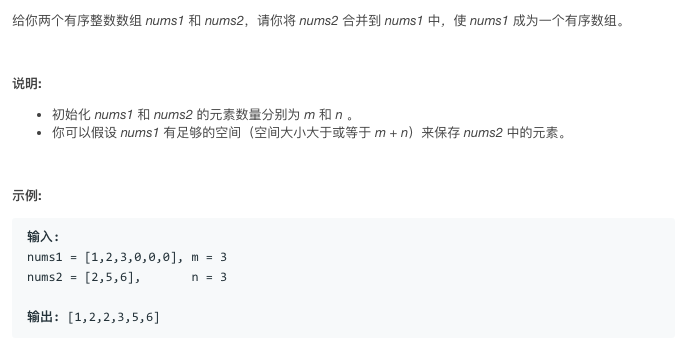
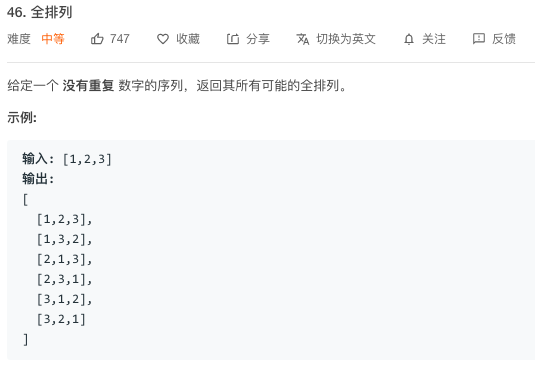
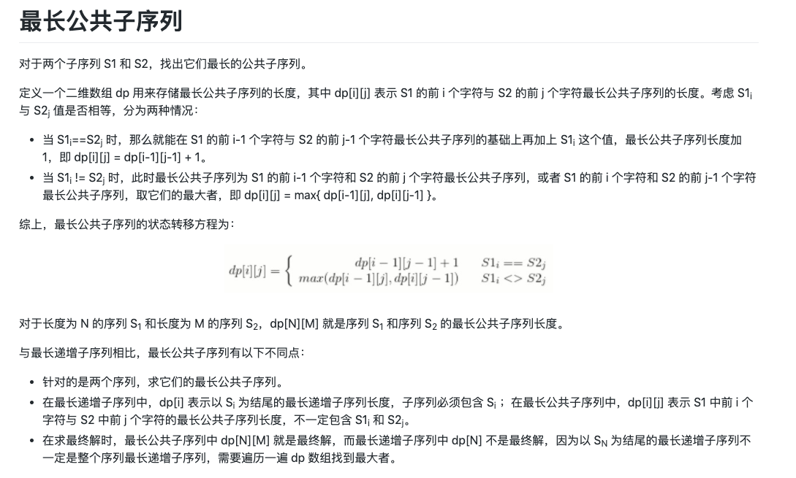

# LeetCode笔记
## 二叉树
### 递归
#### 1.树的高度


```js
var maxDepth = function(root) {
    if(!root) return 0;
    return Math.max(maxDepth(root.left),maxDepth(root.right)) + 1;
};
```
#### 2.平衡二叉树

我的解法：（不推荐）

```js
var isBalanced = function(root) {
    
    var height = {};
    return isBalancedHelper(root,height);

};

var isBalancedHelper = function(root,height){
    if(!root){
        height.h = -1;//利用对象传指针进行修改高度
        return true;
    }
    var left = {};
    var right = {};
    if(isBalancedHelper(root.left,left) && isBalancedHelper(root.right,right)
       && Math.abs(left.h - right.h) < 2){
           height.h = Math.max(left.h,right.h) + 1;
           return true;
           }else return false;
}
```
正规解法：
求一个结点的最大深度本来就要遍历整个结点并求出左右子树的深度，用一个全局的变量看有没有一个结点让flag变成false即可
```js
var isBalanced = function (root) {

    var flag = true;

    var isBalancedHelper = function (root) {
        if (!root) return 0;
        let l = isBalancedHelper(root.left);
        let r = isBalancedHelper(root.right);
        if (Math.abs(l - r) > 1) flag = false;
        return Math.max(l,r) + 1;
    }

    isBalancedHelper(root);
    return flag;

};
```
#### **3. 二叉树的直径x**


```js
var diameterOfBinaryTree = function(root) {

    let ans = 1;

    function getDepth(rootNode){
    if(!rootNode) return 0;
    let l = getDepth(rootNode.left);
    let r = getDepth(rootNode.right);
    ans = Math.max(ans,l + r + 1);
    return Math.max(l,r) + 1;
      
}
    getDepth(root);
    return ans - 1;
  
};
```
思路其实和上一个求平衡二叉树的相同，都是在求最大深度的过程中更新一个全局变量。

以一个节点为根的书的最长直径 = 左节点的最大深度 + 右节点的最大深度 + 1

一个节点为根的最长深度 = max(左节点的最大深度,右节点的最大深度) + 1

#### **4. 翻转二叉树**
 

```js
 var invertTree = function(root) {
    if(!root) return null;
    [root.left,root.right] = [invertTree(root.right), invertTree(root.left)];
    return root;
};
```
递归
目的或返回值：输入一个root为根的树，返回一个以root为根的对称树
递归式：左子树 = 以右子树为根的对称右子树
               右子树 = 以左子树为根的对称左子树
递归边界： root为空直接返回

#### **5.合并二叉树x**

递归
目的：输入一个root1,root2,返回一个以root1为根的合并树
递归逻辑：root1.val =+ root2.val
递归式：左子树.left = 输入一个root1.left,root2.left，返回一个以root1.left为根的合并树
               右子树相同
递归边界： root1若为空则返回root2
                    root2若为空则返回root1(正好与递归边界有所重叠)
        

```js
var mergeTrees = function(t1, t2) {
    if(t1 === null) return t2;
    if(t2 === null) return t1;
    t1.val = t1.val + t2.val;
    t1.left = mergeTrees(t1.left,t2.left);
    t1.right = mergeTrees(t1.right,t2.right);
    return t1;
}
```

#### **6.路径总和**


```js
var hasPathSum = function(root, sum) {
        if(root === null){
            return false;
        }
        sum -= root.val;
        if(sum === 0 && !root.left && !root.right) return true;
        return hasPathSum(root.left,sum) || hasPathSum(root.right,sum);
};
```

目的：输入一个root,sum,判断能否以该结点为根...
递归逻辑：sum - root.val是否等于0该结点为**叶子结点**，若为0则返回true
递归式：若sum已经小于0则不用递归，否则对左右子树进行递归
递归边界： root 为空
**注意sum可以为负值，所以不能用sum<0来结束递归**

#### **7. 路径总和 IIIx**

我的方法：

```js
var pathSum = function (root, sum) {
    var ans = 0;
    var pathSumHelper = function (root, sum) {
        if (!root) {
            return;
        }
        sum -= root.val;
        if (sum === 0) {
            ans += 1;
        }
        pathSumHelper(root.left, sum);
        pathSumHelper(root.right, sum);
    }
    var traverse = function (root, sum) {
        if (!root) return;
        pathSumHelper(root, sum);
        traverse(root.left, sum);
        traverse(root.right, sum);
    }
    traverse(root, sum);
    return ans;
};      
```
思路与上一个题类似，就是多遍历一次树即可

另外一种：

```js
/**
 * Definition for a binary tree node.
 * function TreeNode(val) {
 *     this.val = val;
 *     this.left = this.right = null;
 * }
 */
/**
 * @param {TreeNode} root
 * @param {number} sum
 * @return {number}
 */
var pathSum = function (root, sum) {
    function pathSumHelper(root, sum) {//以一个结点为根有多少连续的路径可以得到这个sum
        if (!root) return 0;//注意这里的递归边界
        let res = 0;
        if (root.val === sum) res++;
        res += pathSumHelper(root.left, sum - root.val) + pathSumHelper(root.right, sum - root.val);
        return res;
    }
    if (!root) return 0;
    let ans = pathSumHelper(root, sum) + pathSum(root.left, sum) + pathSum(root.right, sum);
    return ans;
};
```
其实原理都一样，但是这种写法其实更好的体现了递归的思想，一定要注意这种拿到递归的返回结果返回给一个变量的方法

#### **8.另一个树的子树x**

  
  把功能分成两层，一层为判断两个树是否相等，另外一层为对树的结点的遍历

```js
var isSubtree = function (s, t) {
    function isEqual(s,t){
   		  if(!s && !t) return true;
        if(!s || !t)return false;
        if(s.val === t.val) return isEqual(s.left,t.left) && isEqual(s.right,t.right);
        else return false;
    }
    if (!s) return false;//注意这里要return false
    if (isEqual(s,t)) return true;
    else {
        return isSubtree(s.left, t) || isSubtree(s.right, t);
    }
};
```
#### **9.对称二叉树**

抽象为两个功能：
1:两个树是否对称相等
递归实现
2：一个树是否对称相等

```js
var isSymmetric = function(root) {
            function isSymmetricHelper(s,t){
            if(!s && !t) return true;
                if(!s || !t)return false;
                if(s.val === t.val) return isSymmetricHelper(s.left,t.right) && isSymmetricHelper(s.right,t.left);
                else return false;
            }
            if(!root) return true;
            return isSymmetricHelper(root.left,root.right);
};
```
#### **10.二叉树的最小深度x**

解法1:笨办法

```js
var minDepth = function(root) {
    var min = 100000000;
    function traverse(root,depth){//遍历更新全局变量
        depth += 1;
        if(!root.left && !root.right){       
            if(depth < min) min = depth;
            return;
        }
        if(root.left) traverse(root.left,depth)；
        if(root.right) traverse(root.right,depth);
    }
    if(!root) return 0;
    traverse(root,0);
    return min;
};
```
解法二：就是求最大深度倒过来嘛

```js
var minDepth = function (root) {
    if (!root) return 0;
    let l = minDepth(root.left);
    let r = minDepth(root.right);
    if (l == 0 || r == 0) return l + r + 1;//注意此处若左子树或者右子树是空树的话就不能用Math.min(l,r) + 1因为若左子树为空右子树不为空时必须要以右子树的最小深度+1
    return Math.min(l, r) + 1;
};
```
**也不完全一样，注意对该结点的左结点或右结点为空的情况**

#### **11.左叶子之和**

方法1:
```js
var sumOfLeftLeaves = function(root) {
    var ans = 0;
    function traverse(root){
        if(root.left){
            if(!root.left.left && !root.left.right){//要为叶子结点
            ans += root.left.val;
            }
             traverse(root.left);
        }
        if(root.right){
            traverse(root.right);
        }
    }
    if(!root) return ans;
    traverse(root);
    return ans;
};
```
方法2:

```js
var sumOfLeftLeaves = function(root) {
    if(!root) return 0;
    let ans = 0;
    if(root.left && !root.left.left && !root.left.right){
        ans += root.left.val;
    }
    ans += (sumOfLeftLeaves(root.left) + sumOfLeftLeaves(root.right));
    return ans;
};
```
方法2更好的体现了递归的思想

**注意是左叶子而不是左孩子**
#### **12.最长同值路径x**


```js
/**
 * Definition for a binary tree node.
 * function TreeNode(val) {
 *     this.val = val;
 *     this.left = this.right = null;
 * }
 */
/**
 * @param {TreeNode} root
 * @return {number}
 */
var longestUnivaluePath = function (root) {
    let ans = 0;
    helper(root);
    return ans;

    function helper(root) {//从一个结点开始的最长同值路径长度
        if (!root) return 0;
        //注意因为要递归到底所以不能在这个时候判断相等不相等然后结束递归
        let l = helper(root.left);
        let r = helper(root.right);
        //递归式在这里
        l = root.left && root.left.val === root.val ? l + 1 : 0;//注意路径长度由边数表示所以是:0
        r = root.right && root.right.val === root.val ? r + 1 : 0;
        ans = Math.max(ans,l + r);
        return Math.max(l, r);
    }

};
```
其实思路与求二叉树的直径和平衡二叉树类似
都是在求另外一个子目标的过程中不断更新一个最优值

#### **13.打家劫舍 III**


这个题是递归的美妙应用
```js
var rob = function (root) {
    function helper(root) {//递归式：一个结点的最高金额和（目的） = Max(子结点的最高金额和之和，孙结点最高金额和 + 自己的金额)
        if (!root) return 0;
        var val = root.val;
        if (root.left) {
            val += helper(root.left.left);
            val += helper(root.left.right);
        }
        if (root.right) {
            val += helper(root.right.left);
            val += helper(root.right.right);
        }
        return Math.max(val, helper(root.left) + helper(root.right));
    }
    return helper(root);
};
```
#### **14.二叉树中第二小的节点x**

标准解法：

```js
    //目的：返回以这个结点为根的第二小的值
    //递归式：若左子树和右子树相等，则递归找左右子树第二小的值
             //若已经比根大，则无需递归
            //若左右子树都有比根结点大的值返回左右子树第二小值中的较小值
            //否则返回有第二大值的子树
    //边界条件：root的孩子为空,返回-1
var findSecondMinimumValue = function(root) {
    if(!root.left) return -1;
    let l = root.left.val;
    let r = root.right.val;
    if(l === root.val) l = findSecondMinimumValue(root.left);
    if(r === root.val) r = findSecondMinimumValue(root.right);
    if(l === -1 || r === -1) return Math.max(l,r);
    else return Math.min(l,r);
};
```
另外一种思路，但是不太好，要形成解题的固定思路：

```js
var findSecondMinimumValue = function (root) {

    return traverse(root,root.val);

    function traverse(root,val) {//求以root为根结点的树中，第一个大于某个值的值
    if(!root) return -1;
    if(root.val > val) return root.val;
    let l = traverse(root.left,val);
    let r = traverse(root.right,val);
    if(l != -1 && r != -1) return Math.min(l,r);
    return Math.max(l,r);
    }

};
```
递归中，只关心一个递归过程中的步骤，这次步骤会用到这个递归的目的作为返回值从而实现一个逻辑关系，最后再考虑边界条件。
最后的return值是和目的相关的。
递归的边界其实也是和目的相关的。

#### 总结
* 对于可以不从根结点开始的题目，要先抽象出一个简单的从根结点开始的函数，找到与原函数的递推关系，或者是在递归的过程中更新一个全局变量找到最优解
* 对于需要求路径的题目，转换为以一个结点为根的深度问题并找到与路径的递推关系
* 对于即不要求从根结点开始，又求路径的问题，结合以上两者将问题转换为在求深度的过程中更新一个全局变量


### 层次遍历
#### 1.二叉树的层平均值


```js
var averageOfLevels = function (root) {
    var q = [];
    var ans = [];
    q.push(root);
    while (q.length !== 0) {
        let sum = 0;
        let len = q.length;
        for (let i = 0; i < len; i++) {
            sum += q[0].val;//注意这个地方下标都为0，因为出队后下标会发生改变
            if (q[0].left) q.push(q[0].left);
            if (q[0].right) q.push(q[0].right);
            q.shift();//队首出队用shift()
        }
        ans.push(sum / len);
    }
    return ans;
};
```
#### 2.找树左下角的值


```js
var findBottomLeftValue = function (root) {
    let q = [];
    q.push(root);
    let ans = root;
    while (q.length) {
        let len = q.length;
        for (let i = 0; i < len; i++) {
            ans = q[0];
            if (q[0].right) q.push(q[0].right);//注意是从右孩子开始入队
            if (q[0].left) q.push(q[0].left);
            q.shift();
        }
    }
    return ans.val;
};
```
### 前中后序遍历

#### 1.非递归实现二叉树的前序遍历x

```js
var preorderTraversal = function (root) {
    let ans = [];
    let stack = [];
    if(root) stack.push(root);
    while (stack.length) {
        let temp = stack.pop();
        ans.push(temp.val);
        if (temp.right) stack.push(temp.right);
        if (temp.left) stack.push(temp.left);
    }
    return ans;
};
```
先入根结点，再依次遍历是**先入右孩子，再入左孩子**
#### 2.非递归后序遍历x

```js
var postorderTraversal = function (root) {
    let ans = [];
    let stack = [];
    if (root) stack.push(root);
    while (stack.length) {
        let temp = stack.pop();
        ans.push(temp.val);
        if (temp.left) stack.push(temp.left);
        if (temp.right) stack.push(temp.right);
    }
    return ans.reverse();

};
```
先入根结点，再依次遍历是**先入左孩子，再入右孩子，最后再反转**
思路与前序类似，就是最后要再反转

#### 3.非递归实现二叉树的中序遍历x

```js
var inorderTraversal = function(root) {
    let stack = [];
    let ans = [];
    let node = root;
    while(node || stack.length !== 0){
        while(node){
            stack.push(node);
            node = node.left;
        }
        let temp = stack.pop();
        ans.push(temp.val);
        node = temp.right;
    }
    return ans;
};
```
根入栈后一直左孩子入栈，直到入不了了再出栈顶从栈顶的右孩子重复
### 二叉查找树
#### 1.修剪二叉搜索树


```js
var trimBST = function(root, L, R) {
    //目的：返回以一个结点为根的修建后的二叉树
    //递归式：若结点值小于要求，则返回以右结点为根修剪后的二叉树
    //若结点值大于要求，则返回以左结点为根修剪后的二叉树
    //若满足要求，则将左孩子修剪后返回给左孩子，右孩子修剪后返回右孩子
    //边界条件：root为空,返回空；
    if(!root) return null;
    if(root.val < L) return trimBST(root.right,L ,R );//记得填满参数呀！！！
    if(root.val > R) return trimBST(root.left,L ,R );
    root.left = trimBST(root.left,L ,R );
    root.right = trimBST(root.right, L, R);
    return root;
};
```
注意这是二叉搜索树，左孩子的值都小于根，右孩子的值都大于根，所以若一个结点根的值大于范围，这个结点和右孩子都不能要，反之左孩子都不能要
#### 2.寻找二叉查找树的第 k 小的元素


```js
var kthSmallest = function(root, k) {
    //二叉搜索树的两个重要性质
    //1.左子树的所有结点比根结点小，右子树的所有结点比根结点打
    //2.中序遍历后的数组仍然有序
    let ans = 0;
    let now = 0;
    function inOrder(root,k){
        if(!root) return;
        inOrder(root.left,k);
        now += 1;//用来计数是第几个数，由于有序，第几个数就是第几小
        if(now === k){
            ans = root.val;
            return;
        }
        inOrder(root.right,k);
    }
    inOrder(root,k);
    return ans;
};
```
灵活运用了二叉搜索树的遍历后数组仍然有序的性质，并且运用一个计数来提前结束递归
#### 3. 把二叉搜索树转换为累加树


```js
var convertBST = function (root) {
    var sum = 0;
    function midTra(root) {
        if(!root) return;
        midTra(root.right);
        sum += root.val;
        root.val = sum;
        midTra(root.left);
    }
    midTra(root);
    return root;
};
```
同样灵活运用了二叉搜索树中序遍历有序的性质，右中左遍历得到由大到小的序列，再通过一个变量计数积累和从而进行运算
#### 4.二叉搜索树的最近公共祖先x 


```js
/**
 * Definition for a binary tree node.
 * function TreeNode(val) {
 *     this.val = val;
 *     this.left = this.right = null;
 * }
 */
/**
 * @param {TreeNode} root
 * @param {TreeNode} p
 * @param {TreeNode} q
 * @return {TreeNode}
 */
var lowestCommonAncestor = function(root, p, q) {
    if(root.val > p.val && root.val > q.val) return lowestCommonAncestor(root.left,p,q);
    if(root.val < p.val && root.val < q.val) return lowestCommonAncestor(root.right,p,q);
    return root;
};
```
注意返回的是结点，输入的也是结点
灵活运用了二叉搜索树的右边大，左边小的性质

最近公共节点的深度指的是从根到这个节点的距离

#### 5.二叉树的最近公共祖先 x


```js
/**
 * Definition for a binary tree node.
 * function TreeNode(val) {
 *     this.val = val;
 *     this.left = this.right = null;
 * }
 */
/**
 * @param {TreeNode} root
 * @param {TreeNode} p
 * @param {TreeNode} q
 * @return {TreeNode}
 */
var lowestCommonAncestor = function(root, p, q) {
    if(!root || root.val === p.val || root.val === q.val){
        return root;
    }
    let l = lowestCommonAncestor(root.left,p,q);
    let r = lowestCommonAncestor(root.right,p,q);
    if(l && r) return root;
    return l ? l : r;
};
```
**结点值唯一并且pq两个节点一定存在的条件特别重要**
其实就是往左右子树找这两个数的过程，对这些值进行一些判断返回答案

递归式子：

lowestCommonAncestor：以一个root为根节点的树，寻找p,q两个节点的最近公共祖先，如果其中一个节点没有就返回另外一个有的节点

递归式：递归得到左子树的最近公共祖先和右子树的最近公共祖先，

​				如果两个都存在，则说明这个节点就是最近公共祖先，否则就是只存在的那一个是最近公共祖先。

递归边界：如果一个树的root和p,q任何一个值相等，那么这棵树的根节点必然是那个公共祖先

​					如果是空树,return null;

#### 6.将有序数组转换为二叉搜索树x


```js
/**
 * Definition for a binary tree node.
 * function TreeNode(val) {
 *     this.val = val;
 *     this.left = this.right = null;
 * }
 */
/**
 * @param {number[]} nums
 * @return {TreeNode}
 */
var sortedArrayToBST = function(nums) {
    if(nums.length === 0) return null;
    let len = nums.length;
    let mid = Math.floor(len/2);//注意js的向下取整
    let node = new TreeNode(nums[mid]);
    let left_nums = nums.slice(0,mid);
    let right_nums = nums.slice(mid + 1);
    node.left = sortedArrayToBST(left_nums);
    node.right = sortedArrayToBST(right_nums);
    return node;
};
```
js向下取整Math.floor()
向上取整Math.ceil()
直接运算是带小数的
slice方法(m,n)取下标从m至**n-1**
slice(m)取下标为m到结尾的值，若m大于最大下表则返回空数组

#### 7.有序链表转换二叉搜索树


```js
/**
 * Definition for singly-linked list.
 * function ListNode(val) {
 *     this.val = val;
 *     this.next = null;
 * }
 */
/**
 * Definition for a binary tree node.
 * function TreeNode(val) {
 *     this.val = val;
 *     this.left = this.right = null;
 * }
 */
/**
 * @param {ListNode} head
 * @return {TreeNode}
 */
var sortedListToBST = function (head) {

    function transe(head){
        if(head instanceof Array) return head;
        let nums = [];
        while(head !== null){
            nums[nums.length] = head.val;
            head = head.next;
        }
        return nums;
    }

    let nums = transe(head);

    if (nums.length === 0) return null;
    let len = nums.length;
    let mid = Math.floor(len / 2);
    let node = new TreeNode(nums[mid]);
    let left_nums = nums.slice(0, mid);
    let right_nums = nums.slice(mid + 1);
    node.left = sortedListToBST(left_nums);
    node.right = sortedListToBST(right_nums);
    return node;

};
```
跟上一题思路相同，就是转化一下为数组即可
#### 8.两数之和 IV - 输入 BSTx

```js
/**
 * Definition for a binary tree node.
 * function TreeNode(val) {
 *     this.val = val;
 *     this.left = this.right = null;
 * }
 */
/**
 * @param {TreeNode} root
 * @param {number} k
 * @return {boolean}
 */
var findTarget = function(root, k) {
    let map = new Map();
    function helper(root){
        if(!root) return false;
        if(map.has(k-root.val)){
            return true;
        }else{
            map.set(root.val,root.val);
        }
        return helper(root.left) || helper(root.right);
    }
    return helper(root);
};
```
注意map的用法
这个题其实是不是二叉搜索树都没有关系，因为有可能左右子树都有

#### 9.二叉搜索树的最小绝对差


```js
/**
 * Definition for a binary tree node.
 * function TreeNode(val) {
 *     this.val = val;
 *     this.left = this.right = null;
 * }
 */
/**
 * @param {TreeNode} root
 * @return {number}
 */
var getMinimumDifference = function(root) {
    let pre = -1;
    let min = 999999999;
    function helper(root){
        if(!root) return;
        helper(root.left);
        temp = pre < 0 ? 999999999 : root.val - pre;
        if(temp < min) min = temp;
        if(temp === 0) return;
        pre = root.val;
        helper(root.right);
    }
    helper(root);
    return min;
};
```
其实就是运用中序遍历的性质即可
#### 10.二叉搜索树中的众数x


```js
/**
 * Definition for a binary tree node.
 * function TreeNode(val) {
 *     this.val = val;
 *     this.left = this.right = null;
 * }
 */
/**
 * @param {TreeNode} root
 * @return {number[]}
 */
var findMode = function (root) {
    let mode = [];
    let pre;
    let count = 0;
    let max_count = 0;
    function helper(root) {
        if (!root) return;
        helper(root.left);
        //如果这个值和上一个相等继续累加
        if (pre === root.val) count++;
        //如果不相等对上一个数是不是众数进行判断
        else {
            //如果等于最大的次数
            if (max_count === count) {
                mode.push(pre);
                //如果最大次数有更新
            } else if (max_count < count) {
                mode = [];
                mode.push(pre);
                max_count = count;
            }
            count = 1;
        }
        pre = root.val;
        helper(root.right);
    }
    helper(root);
    if(!root) return [];
    if (max_count === count) {
        mode.push(pre);
        //如果最大次数有更新
    } else if (max_count < count) {
        mode = [];
        mode.push(pre);
        max_count = count;
    }
    return mode;
};
```
**注意最后一次的记录要再识别一次**

## 链表
### 1.相交链表x


```js
/**
 * Definition for singly-linked list.
 * function ListNode(val) {
 *     this.val = val;
 *     this.next = null;
 * }
 */

/**
 * @param {ListNode} headA
 * @param {ListNode} headB
 * @return {ListNode}
 */
var getIntersectionNode = function(headA, headB) {
    let a = headA;
    let b = headB;
    while(a !== b){
        a = (a === null) ? headB : a.next;
        b = (b === null) ? headA : b.next;
    }
    return a;
};
```
设 A 的长度为 a + c，B 的长度为 b + c，其中 c 为尾部公共部分长度，可知 a + c + b = b + c + a。

当访问 A 链表的指针访问到链表尾部时，令它从链表 B 的头部开始访问链表 B；同样地，当访问 B 链表的指针访问到链表尾部时，令它从链表 A 的头部开始访问链表 A。这样就能控制访问 A 和 B 两个链表的指针能同时访问到交点。

**如果不存在交点，那么 a + b = b + a，以下实现代码中 l1 和 l2 会同时为 null，从而退出循环。**

### 2. 反转链表x


#### 递归：x
```js
/**
 * Definition for singly-linked list.
 * function ListNode(val) {
 *     this.val = val;
 *     this.next = null;
 * }
 */
/**
 * @param {ListNode} head
 * @return {ListNode}
 */
var reverseList = function(head) {
    if(head === null || head.next === null) return head;
    let newNode = reverseList(head.next);//实际上这个newNode是为了保存最后一个结点的位置好返回最后的结果
    head.next.next = head;
    head.next = null;
    return newNode;
};
```
递归式： 以下一个结点为开头的结点进行反转然后再改变这一个结点的指针指向

**注意返回值是newHead/newNode**

#### 迭代x

```js
/**
 * Definition for singly-linked list.
 * function ListNode(val) {
 *     this.val = val;
 *     this.next = null;
 * }
 */
/**
 * @param {ListNode} head
 * @return {ListNode}
 */
var reverseList = function(head) {
    let newHead = null;
    while(head !== null){
        let next = head.next;//用一个变量保存下一个结点的位置
        head.next = newHead;//改变这个结点的指向
        newHead = head;//保存这个结点的位置
        head = next;//向下移动一次
    }
    return newHead;
};
```

**注意这里最开始吧newHead设置为null的做法可以极大的简化操作的步骤**

### 3.合并两个有序链表x


```js
/**
 * Definition for singly-linked list.
 * function ListNode(val) {
 *     this.val = val;
 *     this.next = null;
 * }
 */
/**
 * @param {ListNode} l1
 * @param {ListNode} l2
 * @return {ListNode}
 */
var mergeTwoLists = function(l1, l2) {
    if(l1 === null) return l2;
    if(l2 === null) return l1;
    if(l1.val < l2.val){
        l1.next = mergeTwoLists(l1.next,l2);
        return l1;
    }else{
        l2.next = mergeTwoLists(l1,l2.next);
        return l2;
    }
};
```
一种排序的新思路，因为指针只需要改变指向即可，所以在这里用这种递归改变指针的方法就会更快不需要新创建结点
### 4.删除排序链表中的重复元素x

很妙的递归解法：

```js
/**
 * Definition for singly-linked list.
 * function ListNode(val) {
 *     this.val = val;
 *     this.next = null;
 * }
 */
/**
 * @param {ListNode} head
 * @return {ListNode}
 */
var deleteDuplicates = function(head) {
    if(!head || !head.next) return head;//注意边界条件
    head.next = deleteDuplicates(head.next);
    return head.val === head.next.val ? head.next : head;
};
```
若从程序执行的角度考虑就是递归到最后一个结点然后往回进行对比，递归解决链表的问题可以很好的解决由于指针的指向问题的改变引发的问题因为是从后往前进行修改
若从递归的角度看：
递归式就是将本次的next改为以下一个指针开头的不重复排序链表，然后对比这个结点的值和这个不重复链表的开头的结点的值返回结果。
**递归的思考方式只需要考虑递归式**

### 5.删除链表的倒数第N个节点x


```js
/**
 * Definition for singly-linked list.
 * function ListNode(val) {
 *     this.val = val;
 *     this.next = null;
 * }
 */
/**
 * @param {ListNode} head
 * @param {number} n
 * @return {ListNode}
 */
var removeNthFromEnd = function(head, n) {
    let fast = head;
    let slow = head;
    while(n !== 0){
        fast = fast.next;
        n--;
    }
    if(!fast) return head.next;//特判删除头结点
    while(fast.next){
        slow = slow.next;
        fast = fast.next;
    }
    slow.next = slow.next.next;
    return head;
};
```
利用双指针找到要删除的结点的前一个结点进行删除，若删除的是头结点可以特判

**注意要特判是第一个节点的可能性**

### 6.两两交换链表中的节点


```js
/**
 * Definition for singly-linked list.
 * function ListNode(val) {
 *     this.val = val;
 *     this.next = null;
 * }
 */
/**
 * @param {ListNode} head
 * @return {ListNode}
 */
var swapPairs = function(head) {
    if(!head || !head.next) return head;//注意判断head和head.next
    let next = head.next;
    next.next = swapPairs(next.next);
    head.next = next.next;
    next.next = head;
    return next;
};
```
和前面的题的递归思路很想，也可以用迭代重新生成一个链的方式来解决
### 7.链表求和（可以不用下面的方法做）


```js
/**
 * Definition for singly-linked list.
 * function ListNode(val) {
 *     this.val = val;
 *     this.next = null;
 * }
 */
/**
 * @param {ListNode} l1
 * @param {ListNode} l2
 * @return {ListNode}
 */
var addTwoNumbers = function (l1, l2) {
    let stack1 = [];
    let stack2 = [];
    let carry = 0;
    let dummy = new ListNode();//头结点
    while (l1) {
        stack1.push(l1.val);
        l1 = l1.next;
    }
    while (l2) {
        stack2.push(l2.val);
        l2 = l2.next;
    }
    //进行相加
    while (stack1.length || stack2.length || carry) {
        let stack1Num = stack1.pop() || 0;//解决个数不匹配问题
        let stack2Num = stack2.pop() || 0;
        let current = (stack1Num + stack2Num + carry) % 10;
        carry = Math.floor((stack1Num + stack2Num + carry) / 10);
        let newNode = new ListNode(current);
        newNode.next = dummy.next;//注意用头插法插入结点保证顺序
        dummy.next = newNode;
    }
    return dummy.next;
};
```
使用栈来进行逆序的运算的思想
### 8.回文链表(大概看一下即可)x


```js
/**
 * Definition for singly-linked list.
 * function ListNode(val) {
 *     this.val = val;
 *     this.next = null;
 * }
 */
/**
 * @param {ListNode} head
 * @return {boolean}
 */
var isPalindrome = function (head) {
    //递归反转链表
    // function reverseList(head) {
    //     if (!head || !head.next) return head;
    //     let newHead = reverseList(head.next);
    //     head.next.next = head;
    //     head.next = null;
    //     return newHead;
    // }
    //迭代反转链表
    function reverseList(head){
        let pre = null;
        let next = null;
        while(head){
            next = head.next
            head.next = pre;
            pre = head;
            head = next
        }
        return pre;
    }
    function cut(head,cutNode){//cut一个list
        while(head.next != cutNode){
            head = head.next;
        }
        head.next = null;
    }
    function isEqual(head1,head2){//判断两个list是否相等
        while(head1 && head2){
            if(head1.val != head2.val) return false;
            head1 = head1.next;
            head2 = head2.next;
        }
        return true;
    }
    if(head === null || head.next === null) return true;
    //找到要cut的结点即中间的结点！！！
    let fast = head;
    let slow = head;
    while(fast && fast.next){
        fast = fast.next.next;
        slow = slow.next;
    }
    cut(head,slow);
    return isEqual(head,reverseList(slow))
};
```
* 一定要注意怎么去找的cut的结点，通过快指针比慢指针快一步的这种方法：
对于奇数个的链表fast会指向最后一个结点，slow会指向中间的结点
对于偶数个的链表fast会指向null, slow会指向中间偏右一个的结点
* 是把cutnode的前一个结点的next设置为null,从而让前半部分保持正序
* 后半部分是先以slow为起点，但是反转了过后就是以尾为起点
* 在比较两个list的时候只比较相同的个数所以不用管奇数个结点时多出来的那一个结点
### 9.分隔链表x

```js
var splitListToParts = function(root, k) {
    let ans = [];
    function helper(root,length,k){
        if(k === 0) return;
        if(length === 0){
            ans.push(null);
            helper(root,length,k-1);
            return;
        }else{
        //要分的个数
        let temp = Math.ceil(length/k);
        let newNode = root;
        let head = newNode;
        let i = 1;
        while(i <= temp - 1){//剪下来这一段
            root = root.next;
            i++;
        }
        let next = root.next;
        root.next = null;//直接剪下来就好不需要重新生成
        ans.push(newNode);
        helper(next,length - temp,k-1);
        }
    }
    //求出链表的长度
    let p = root;
    let length = 0;
    while(p){
        length++;
        p = p.next;
    } 
    helper(root,length,k);
    return ans;
};
```
### 10.奇偶链表x


```js
/**
 * Definition for singly-linked list.
 * function ListNode(val, next) {
 *     this.val = (val===undefined ? 0 : val)
 *     this.next = (next===undefined ? null : next)
 * }
 */
/**
 * @param {ListNode} head
 * @return {ListNode}
 */
var oddEvenList = function(head) {
    if(!head) return head;
    let odd = head;
    let even = head.next;
    let evenhead = even;
    while(even && even.next){
        odd.next = odd.next.next;
        odd = odd.next;
        even.next = even.next.next;
        even = even.next;
    }
    odd.next = evenhead;//最后连接奇数表和偶数表
    return head;
};
```
这个题有迭代的思想完成反而更容易，如果是递归的话就会发现这个oddEvenList要求是返回一个已经连接处理好了的链表，并不好找到递推式子。

## 队列和栈

### 1.用栈实现队列x


```js
/**
 * Initialize your data structure here.
 */
var MyQueue = function() {
    this.stack1 = [];
    this.stack2 = [];
};

/**
 * Push element x to the back of queue. 
 * @param {number} x
 * @return {void}
 */
MyQueue.prototype.push = function(x) {
    this.stack1.push(x);
};

/**
 * Removes the element from in front of queue and returns that element.
 * @return {number}
 */
MyQueue.prototype.pop = function() {
    if(this.stack2.length !== 0) return this.stack2.pop();
    while(this.stack1.length !== 0) this.stack2.push(this.stack1.pop());
    return this.stack2.pop();
};

/**
 * Get the front element.
 * @return {number}
 */
MyQueue.prototype.peek = function() {
    if(this.stack2.length !== 0) return this.stack2[this.stack2.length - 1];//若stack2有元素则返回最后一个元素
    else return this.stack1[0];//否则直接返回stack1的第一个元素即可
};

/**
 * Returns whether the queue is empty.
 * @return {boolean}
 */
MyQueue.prototype.empty = function() {
    return this.stack1.length === 0 && this.stack2.length == 0; 
};

/**
 * Your MyQueue object will be instantiated and called as such:
 * var obj = new MyQueue()
 * obj.push(x)
 * var param_2 = obj.pop()
 * var param_3 = obj.peek()
 * var param_4 = obj.empty()
 */
```
用两个栈，把第一个栈依次出栈到第二个栈实现顺序的改变从而实现先入先出
### 2.用队列实现栈x

```js
/**
 * Initialize your data structure here.
 */
var MyStack = function () {
    this.queue = [];
};

/**
 * Push element x onto stack. 
 * @param {number} 
 * @return {void}
 */
MyStack.prototype.push = function (x) {
    this.queue.push(x);
    let len = this.queue.length;
    while (--len >= 1) {//注意是--len不是len--
        this.queue.push(this.queue.shift());
    }
};

/**
 * Removes the element on top of the stack and returns that element.
 * @return {number}
 */
MyStack.prototype.pop = function () {
    return this.queue.shift();
};

/**
 * Get the top element.
 * @return {number}
 */
MyStack.prototype.top = function () {
    return this.queue[0];
};

/**
 * Returns whether the stack is empty.
 * @return {boolean}
 */
MyStack.prototype.empty = function () {
    return this.queue.length === 0;
};

/**
 * Your MyStack object will be instantiated and called as such:
 * var obj = new MyStack()
 * obj.push(x)
 * var param_2 = obj.pop()
 * var param_3 = obj.top()
 * var param_4 = obj.empty()
 */
```
入队后把每一个其他值都出队再入队
### 3.最小栈x

```js
/**
 * initialize your data structure here.
 */
var MinStack = function() {
    this.minStack = [];
    this.stack = [];
    this.min = Number.MAX_SAFE_INTEGER;//最大安全值
};

/** 
 * @param {number} x
 * @return {void}
 */
MinStack.prototype.push = function(x) {
    this.min = Math.min(x,this.min);
    this.minStack.push(this.min);
    this.stack.push(x);
};

/**
 * @return {void}
 */
MinStack.prototype.pop = function() {
    this.minStack.pop();
    this.stack.pop();
    let len = this.minStack.length;
    this.min = len !== 0 ? this.minStack[len - 1] : Number.MAX_SAFE_INTEGER;
};

/**
 * @return {number}
 */
MinStack.prototype.top = function() {
    return this.stack[this.minStack.length - 1];
};

/**
 * @return {number}
 */
MinStack.prototype.getMin = function() {
    return this.min;
};

/**
 * Your MinStack object will be instantiated and called as such:
 * var obj = new MinStack()
 * obj.push(x)
 * obj.pop()
 * var param_3 = obj.top()
 * var param_4 = obj.getMin()
 */
```
用两个栈去实现，一个栈正常放数，另外一个栈每次push的时候都存放栈中的最小值。pop的时候就更新最小值为minStack的栈顶元素即可，若全都pop了要重置最小值
Number.MAX_SAFE_INTEGER代表了最大的安全值

### 4.有效的括号


```js
/**
 * @param {string} s
 * @return {boolean}
 */
var isValid = function(s) {
    let stack = [];
    let m = new Map([['(',')'],['{','}'],['[',']']]);
    for (let i in s){
        if(s[i] === '(' || s[i] === '{' || s[i] === '[') stack.push(s[i]);
        else{
            let len = stack.length;
            if(len === 0) return false;
            let p = stack.pop();
            if(s[i] !== m.get(p)) return false;
        }
    }
    return stack.length === 0 ? true : false;
};
```
### 5.每日温度

```js
/**
 * @param {number[]} T
 * @return {number[]}
 */
var dailyTemperatures = function (T) {
    let stack = [];
    let ans = new Array(T.length).fill(0);//注意给一个初始化解决有一些为0的问题

    T.forEach(function (ele, index) {
        while (stack.length !== 0 && T[stack[stack.length - 1]] < ele) {
            let temp = stack.pop();
            ans[temp] = index - temp;
        }
        stack.push(index);
    })

    return ans;
};
```
用一个栈去存储T的下标维持一个递增栈
若比栈顶的元素对应的温度大就要让它出栈，并且序号之差就是相隔的距离

### 6.下一个更大元素 IIx


```js
/**
 * @param {number[]} nums
 * @return {number[]}
 */
var nextGreaterElements = function (nums) {
    let stack = [];
    let len = nums.length;
    let ans = new Array(len).fill(-1);
    for (let i = 0; i < 2 * len; i++) {
        let index = i % len;//注意要取余数
        while (stack.length !== 0 && nums[stack[stack.length - 1]] < nums[index]) {
            let temp = stack.pop();
            ans[temp] = nums[index];
        }
        stack.push(index);
    }
    return ans;
};
```
思路和上一个题相似，就是要**遍历两次下标取余即可**
### 7.逆波兰表达式求值x


```js
/**
 * @param {string[]} tokens
 * @return {number}
 */
var evalRPN = function (tokens) {
    let num;
    let stack = [];
    tokens.forEach(
        function (ele, index) {
            let temp;
            switch (ele) {
                case "+":
                stack.push(stack.pop() + stack.pop());
                break;
                case '-':
                let sub = stack.pop();
                stack.push(stack.pop() - sub);
                break;
                case '/':
                let divider = stack.pop();
                stack.push(parseInt(stack.pop() / divider,10));
                break;
                case '*':
                stack.push(stack.pop() * stack.pop());
                break;
                default:
                stack.push(parseInt(ele));
            }
        }
    )
    return stack.pop();
};
```
注意：
1. switch的语法
2. 注意除法和减法的顺序
3. **JS中floor会向下保留整数，比如-1.2变成-2，ceil向上保留整数比如1.2-2**
4. **如果只是单纯保留整数部分就直接用parseInt即可parseInt(数字或字符串，进制)，注意默认不为10进制**
## Hash
### 1.数组中两个数的和为给定值


```js
/**
 * @param {number[]} nums
 * @param {number} target
 * @return {number[]}
 */
var twoSum = function (nums, target) {
    let map = new Map();
    for (let i = 0; i < nums.length; i++) {
        let temp = map.get(target - nums[i]);
        if (temp !== undefined) {
            return new Array(temp, i);
        }
        map.set(nums[i], i);
    }
    //错误方法：若用forEach的话这个返回值时forEach中匿名函数的返回值，所以不能用
    // nums.forEach(function(ele,index){
    //     let temp = map.get(target - ele);
    //     if(temp !== undefined){
    //         return new Array(temp,ele);
    //     }
    //     map.set(ele,index);
    // })
};
```
### 2.判断数组是否含有重复元素


```js
/**
 * @param {number[]} nums
 * @return {boolean}
 */
var containsDuplicate = function(nums) {
    let len = nums.length;
    let map = new Map();
    for(let i = 0;i < len;i++){
        if(map.get(nums[i]) !== undefined) return true;
        else map.set(nums[i],i);
    }
    return false;
};
```
### 3. 最长和谐子序列x


```js
 * @param {number[]} nums
 * @return {number}
 */
var findLHS = function(nums) {
    let map = [];
    for(num of nums){
        map[num] = map[num] === undefined ? 1 : map[num] + 1;
    }
    let longest = 0;
    for(num of nums){
        longest = Math.max(longest,map[num] + map[num+1] || 0);//注意这个地方map[num + 1]可能为undefined所以要||0
    }
    return longest;
};
```
注意看题目这个序列不一定连续
### 4. 最长连续序列x

```js
/**
 * @param {number[]} nums
 * @return {number}
 */
var longestConsecutive = function(nums) {
    //构建哈希表
    let map = new Map();
    for(num of nums){
        let count = map.get(num);
        if(count === undefined){
            map.set(num,1);//注意是1
        }else{
            map.set(num,count + 1);
        }
    }
    let longest = 0;
    //再遍历一次找最长的长度
    for(num of nums){
        if(map.get(num - 1) === undefined){//只有当这个值的前一个值没有出现时才可能是最长序列的开头
        let count = 0;
        while(map.get(num) !== undefined){
            count++;
            num++;
        }
        longest = Math.max(count,longest);
        }
    }
    return longest;
};
```
注意是最长的连续序列要一直递增+1才可以
## 字符串
### 1.有效的字母异位词x


```js
/**
 * @param {string} s
 * @param {string} t
 * @return {boolean}
 */
var isAnagram = function(s, t) {
    let maps = new  Array(26).fill(0);
    let mapt = new  Array(26).fill(0);
    for(let i of s) maps[i.charCodeAt() - 'a'.charCodeAt()]++;//注意js中字符串的相减不会自动转换为asco码
    for(let i of t) mapt[i.charCodeAt() - 'a'.charCodeAt()]++;
    for(let i = 0;i < 26;i++){
        if(maps[i] !== mapt[i]) return false;
    }
    return true;
};
```
#### 字符串和数字的相加减总结
1. 字符串+字符串
始终是字符串的拼接
2. 字符串 */- 字符串
会把字符串强制转换为Number进行计算
如：'123.123' + 1 = Number('123.123') + 1 = 124.123
**但是Number只会转换成功那些符合数字规范的字符串，像是'123as'就会转换成NaN,最后的结果也只会是NaN**
3. 字符串 + 数字
同样也是字符串的拼接
4. 字符串 */- 数字
同样将字符串用Number()强制转换再进行运算
#### parseInt() 和 Number()的区别
parseInt(数字或者字符串,基于多少进制转换)
parseInt()会转换字符串开头首部数字部分,也会保留浮点数的整数部分，不向上或者向下取整
如：123asd => 123, asd123 => NaN,‘’123.123‘ => 123, 123.12 => 123
Number()会强制转换其他类型为数字
#### 所有类型的相加相减总结
1. 所有类型和字符串相加都会强制转换为字符串再拼接
'123' + 1 = '123' + String(1) = '1231'
'123' + NaN = '123NaN'
'123' + undefined = '123undefined'
2.  其他的遇到再总结吧

### 2.最长回文串x

注意只是用这些数字，并没有顺序
```js
/**
 * @param {string} s
 * @return {number}
 */
var longestPalindrome = function (s) {
    let map = new Array(60).fill(0);
    for (let c of s) map[c.charCodeAt() - 65]++;
    let ans = 0;
    let flag = false;
    for (let i of map) {
        if (i % 2 === 1) {
            if (flag === false) {
                ans++;
                flag = true;
            };
            i--;
        }
        ans += i;
    }
    return ans;
};
```
注意不需要注意顺序，最长的个数就是所有值的偶数部分或者如果有奇数的话就+1

### 3.同构字符串


```js
/**
 * @param {string} s
 * @param {string} t
 * @return {boolean}
 */
var isIsomorphic = function(s, t) {
    let maps = new Array(256).fill(-1);
    let mapt = new Array(256).fill(-1);
    for(let i = 0;i < s.length;i++){
        let temps = s[i].charCodeAt();
        let tempt = t[i].charCodeAt();
        if(maps[temps] != mapt[tempt]) return false;
        maps[temps] = i;
        mapt[tempt] = i;
    }
    return true;
};
```
用一个map存放每一个值上次出现的位置来判断值的位置相等不相等即可
### 4.回文子串x

```js
/**
 * @param {string} s
 * @return {number}
 */
var countSubstrings = function(s) {
    function extendSubstrings(s,start,end){
        while(start >= 0 && end < s.length && s[start] === s[end]){
            ans++;
            start--;
            end++;
        }
    }
    let ans = 0;
    for(let i = 0;i < s.length;i++){
        extendSubstrings(s,i,i);//对于以当前元素为中心及奇数回文序列
        extendSubstrings(s,i,i+1);//对于以当前元素和后一个元素为中心即偶数回文序列
    }
    return ans;
};
```
以每一个元素为中心（奇数）或者是**以每一个元素和后一个元素一起**（偶数）为中心向两侧扩展
可以使用**马拉车算法对这个算法进行优化，使时间复杂度降低到O(2n)即(n)的水平**

[马拉车算法详解](https://mp.weixin.qq.com/s?__biz=MzUyNjQxNjYyMg==&mid=2247485998&idx=1&sn=ecccf562324dac313a23964325145c78&chksm=fa0e65afcd79ecb9058babb2310f019e0ed5e5822503cce6a0d734d4fe2306b696d706f0bad8&scene=21#wechat_redirect)

### 5.回文数(看看就好)
题目要求不能转换为字符串进行解决


```js
/**
 * @param {number} x
 * @return {boolean}
 */
var isPalindrome = function (x) {
    if(x === 0) return true;//因为0%10也是0所以要特判
    if (x < 0 || x % 10 === 0) return false;
    let origion = x;
    let reverse = 0;//反转后半部分的数字
    while (origion > reverse) {
        reverse = (reverse * 10 + origion % 10);
        origion = Math.floor(origion / 10);
    }
    return origion === reverse || origion === Math.floor(reverse / 10);
};
```
不用字符串比较麻烦，要特判好几种情况

### 6.计数二进制子串x


```js
/**
 * @param {string} s
 * @return {number}
 */
var countBinarySubstrings = function (s) {
    let pre = 0;
    let cur = 1;
    let ans = 0;
    for (let i = 1; i < s.length; i++) {
        if (s[i] === s[i - 1]) cur++;
        else {
            ans += Math.min(pre, cur);
            pre = cur;
            cur = 1;
        }
    }
    ans += Math.min(pre, cur);//注意最后要再加一次
    return ans;
};
```
这种只需要保留前后两个值的问题可以不用全部保存，就直接用两个值保存然后更新即可
## 双指针
### 1.两数之和 II - 输入有序数组


```js
/**
 * @param {number[]} numbers
 * @param {number} target
 * @return {number[]}
 */
var twoSum = function(numbers, target) {
    let len = numbers.length;
    let left = 0,
        right = len - 1;
    let ans = [];
    while(numbers[left] + numbers[right] !== target){
        if(numbers[left] + numbers[right] < target) left++;
        else right--;
    }
    ans.push(left + 1);
    ans.push(right + 1);
    return ans;
};
```
### 2.两数平方和


```js
/**
 * @param {number} c
 * @return {boolean}
 */
var judgeSquareSum = function(c) {
    let right = Math.floor(Math.sqrt(c)),
        left = 0;
    
    while(left <= right){
        let sum = right * right + left * left;
        if(sum === c) return true;
        if(sum > c) right--;
        else left++;
    }
    
    return false;
};
```
### 3.反转字符串中的元音字母


```js
/**
 * @param {string} s
 * @return {string}
 */
var reverseVowels = function(s) {
    let sArray = s.split('');
    let map = ['a','e','i','o','u','A','E','I','O','U'];
    let len = sArray.length;
    let left = 0,
        right = len - 1;
    while(left < right){
        let flagleft = map.indexOf(s[left]),
            flagright = map.indexOf(s[right]);
        if(flagleft === -1 ) left++;
        if(flagright === -1) right--;
        if(flagright !== -1 && flagleft !== -1){
            [sArray[left],sArray[right]] = [sArray[right],sArray[left]];
            left++;
            right--;
        }
    }
    return sArray.join('');
};
```
注意：
1. **字符串不能改，要转换成array再改**
2. 字符串转array .split('分隔的字符串')
3. array转字符串 .join('要连接每个元素的字符')

### 4.验证回文字符串 Ⅱx


```js
/**
 * @param {string} s
 * @return {boolean}
 */
var validPalindrome = function (s) {
    function isPalindrome(s, left, right) {
        while (left < right) {
            if (s[left++] != s[right--]) return false;
        }
        return true;
    }
    let left = 0,
        right = s.length - 1;
    while (left < right) {
        if (s[left++] != s[right--]) return isPalindrome(s, left - 1, right) || isPalindrome(s, left, right + 1);//注意left++和right--过后就已经改变了
    }
    return true;
};
```
很巧妙的写法不用再自己写代码判断，分离出一个功能
### 5.合并两个有序数组


```js
/**
 * @param {number[]} nums1
 * @param {number} m
 * @param {number[]} nums2
 * @param {number} n
 * @return {void} Do not return anything, modify nums1 in-place instead.
 */
var merge = function (nums1, m, nums2, n) {
    let p1 = m - 1,
        p2 = n - 1,
        mergeIndex = m + n - 1;
    while(p1 >= 0 && p2 >= 0){
        if(nums1[p1] < nums2[p2]) nums1[mergeIndex--] = nums2[p2--];
        else if(nums1[p1] >= nums2[p2]) nums1[mergeIndex--] = nums1[p1--];
    }
    if(p2 >= 0){
        while(p2 >= 0) nums1[mergeIndex--] = nums2[p2--];
    } 
    return nums1;
};
```
从后往前遍历这样就可以不用多用一个数组来存储遍历后的值

### 6.环形链表x


```js
/**
 * Definition for singly-linked list.
 * function ListNode(val) {
 *     this.val = val;
 *     this.next = null;
 * }
 */

/**
 * @param {ListNode} head
 * @return {boolean}
 */
var hasCycle = function(head) {
    if(!head) return false;
    let fast = head.next,
        slow = head;
    while(fast && fast.next){
        if(fast === slow) return true;
        else {
            fast = fast.next.next;
            slow = slow.next;
        }
    }
    return false;  
};
```
用快慢指针，有点像赛跑，如果有环的话，快指针每次比慢指针快一步，迟早会追上，所以若有环迟早会相等的
### 7.通过删除字母匹配到字典里最长单词x


```js
/**
 * @param {string} s
 * @param {string[]} d
 * @return {string}
 */
var findLongestWord = function (s, d) {
    let maxlen = 0;
    let maxS = '';
    function isEqual(s1, s2) {
        let p1 = 0,
            p2 = 0;
        let len1 = s1.length,
            len2 = s2.length;
        if (maxlen > len2 || len2 > len1) return false;//可以判断一下，如果已经匹配的值已经够大了就不用判断小的了
        while (p1 < len1 && p2 < len2){
            if(s1[p1] === s2[p2]){
                p1++;
                p2++;
            }else{
                p1++;
            }
        }
        if(p2 === len2) return true;
        else return false;    
    }
    for(let s2 of d){
        if(isEqual(s,s2)){
            if(s2.length === maxS.length) maxS = maxS < s2 ? maxS : s2;
            else{
                maxS = s2;
                maxlen = s2.length;
            }
        }
    }
    return maxS;
};
```
## 排序
### 排序的方式总结(JS)
#### 选择排序
1. 思想
第一次从待排序的数据元素中选出最小（或最大）的一个元素，存放在序列的起始位置，然后再从剩余的未排序元素中寻找到最小（大）元素，然后放到已排序的序列的末尾。 以此类推，直到全部待排序的数据元素的个数为零。 选择排序是不稳定的排序方法。
2. 代码
```js
function selectSort(arr) {
    let len = arr.length;
    for (let i = 0; i < len - 1; i++) {
        let minIndex = i;
        for (let j = i + 1; j < len; j++) {
            if (arr[j] < arr[minIndex]) minIndex = j;
        }
        [arr[minIndex], arr[i]] = [arr[i], arr[minIndex]];
    }
}
let arr = [4,3,2,1];
selectSort(arr);
console.log(arr);
```
3. 分析
* 时间复杂度
		* O(n2)
		* 最好最坏都是O(n2)
* 空间
		*  O(1)
* 不稳定

#### 插入排序
1. 思想

2. 代码
```js
function insertSort(arr) {
    let len = arr.length;
    for (let i = 1; i < len; i++) {
        let temp = arr[i];
        let j = i - 1;
        for (; j >= 0; j--) {
            if(temp < arr[j]) [arr[j],arr[j + 1]] = [arr[j + 1], arr[j]];
            else break;
        }
        arr[j + 1] = temp;
    }
}

let arr = [20,3,4,2,51,23,45];
insertSort(arr);
console.log(arr);
```
3. 分析
* 时间复杂度
		* 平均： O(n2)
		* 最差：O(n2)
		* 最优：O(n)已经有序
* 空间复杂度
		* O(1)
* 稳定
#### 冒泡
1.思想
就是n-1趟排序，把最大的值浮上去
2.代码
* 没有优化的
```js
function bubbleSort(arr) {
    let len = arr.length;
    for (let i = 1; i < len; i++) {//总共排序len - 1趟
        for (let j = 0; j < len - i; j++) {
            if (arr[j] > arr[j + 1]) [arr[j], arr[j + 1]] = [arr[j + 1], arr[j]];
        }
    }
}

arr = [4,3,2,1,1,2,5,25,6,22]
bubbleSort(arr);
console.log(arr);
```
* 优化后的冒泡排序
如果某一趟排序没有交换顺序说明已经有序无须再继续
```js
function bubbleSort(arr) {
    let len = arr.length;
    for (let i = 1; i < len; i++) {//总共排序len - 1趟
        let flag = true;
        for (let j = 0; j < len - i; j++) {
            if (arr[j] > arr[j + 1]){
                [arr[j], arr[j + 1]] = [arr[j + 1], arr[j]];
                flag = false;
            }
        }
        if(flag) break;
    }
}

arr = [4,3,2,1,1,2,5,25,6,22]
bubbleSort(arr);
console.log(arr);
```
3. 分析(优化后)
* 时间复杂度
		* O(n2)
		* O(n) 最优
		* O(n2)最差
* 稳定
#### 二路归并x
1. 思想
把一个数组二分，先对左边进行二路归并，再对右边进行二路归并使左右两边有序，再把左右两边组合为一个连续的数组。需要把一个数组的**连续**的两个有序的部分组合称为一个有序的部分。
2. 代码

```js
function mergeSort(arr, left, right) {

    function merge(arr, l1, r1, l2, r2) {
        let p1 = l1,
            p2 = l2;

        let temp = [];

        while (p1 <= r1 && p2 <= r2) {
            if (arr[p1] < arr[p2]) temp.push(arr[p1++]);
            else temp.push(arr[p2++]);
        }

        while (p1 <= r1) temp.push(arr[p1++]);
        while (p2 <= r2) temp.push(arr[p2++]);

        for (let i = 0; i < temp.length; i++) {
            arr[i + l1] = temp[i];
        }
    }

    let mid = Math.floor((left + right) / 2);  
    if (left < right) {
        mergeSort(arr, left, mid);
        mergeSort(arr, mid + 1, right);
        merge(arr, left, mid, mid + 1, right);
    }

}

arr = [4, 3, 2, 1, 1, 2, 5, 25, 6, 22]
mergeSort(arr,0,arr.length - 1);
console.log(arr);
```
3. 分析
* 时间复杂度
		* O(nlogn)
* 空间复杂度
		* O(n)
* 稳定

#### 快排x
1. 思想
调整一个序列的第一个值的位置使得让其左边的值都小于等于它，右边的值都大于等于它，然后再最左边和右边进行递归
2. 实现

```js
function quickSort(arr, left, right) {

    function partition(arr, left, right) {

        let temp = arr[left];

        while (left < right) {
            while (arr[right] >= temp && left < right) right--;
            arr[left] = arr[right];
            while (arr[left] <= temp && left < right) left++;
            arr[right] = arr[left];
        }

        arr[left] = temp;
        return left;
        
    }

    if (left < right) {

        let mid = partition(arr, left, right);

        quickSort(arr, left, mid - 1);
        quickSort(arr, mid + 1, right);

    }

}

arr = [4, 3, 2, 1, 1, 2, 5, 25, 6, 22]
quickSort(arr, 0, arr.length - 1);
console.log(arr);
```
3. 分析
* 时间复杂度
		* O(nlogn)
* 不稳定
#### 堆排序
1. 思想
先建立一个大顶堆，再进行堆排序，注意堆是一棵完全二叉树，下标要从1开始，所以要调整一下下标
2. 实现
```js
function heapSort(arr) {


    //向下调整
    function downAdjust(left, right) {
        let lchild = left * 2;
        let rchild = lchild + 1;
        if (lchild > right) return;
        //找到lchild和rchild中的较大值，并把较大的值赋给lchild
        if (rchild <= right && arr[lchild] < arr[rchild]) [lchild, rchild] = [rchild, lchild];
        //与这个结点比较
        if (arr[left] < arr[lchild]) {
            [arr[left], arr[lchild]] = [arr[lchild], arr[left]];
            downAdjust(lchild, right);
        }
    }

    //假设arr不从1下标开始
    arr.push(arr[0]);
    var len = arr.length - 1;

    //从倒数第一个非叶子结点开始向下调整得到大顶堆
    for (let i = Math.floor(len / 2); i > 0; i--) {
        downAdjust(i, len);
    }

    //再进行堆排序
    for(let i = len; i > 0;i--){
        [arr[i],arr[1]] = [arr[1],arr[i]];
        downAdjust(1,i-1);
    }

    //再去掉这个空值
    arr.shift();
}

arr = [2, 3, 12, 41, 32, 12, 3];
heapSort(arr);
console.log(arr);
```
3. 分析
* 时间复杂度
		* O(nlogn)
* 不稳定
#### 希尔排序
#### 基数排序
#### 排序方式比较


### 数组中的第K个最大元素

解法1:直接用js内置的sort()
**注意：内置sort会把所有的东西都转换为字符串进行比较，所以要自己定比较方式**

```js
/**
 * @param {number[]} nums
 * @param {number} k
 * @return {number}
 */
var findKthLargest = function(nums, k) {
    nums.sort(function (x, y) {
    if (x < y) {
        return -1;
    }
    if (x > y) {
        return 1;
    }
    return 0;
});
    let len = nums.length;
    //倒数第k个最大的元素就是len-k
    return nums[len - k];
};
```
解法2:使用大/小顶堆

```js
/**
 * @param {number[]} nums
 * @param {number} k
 * @return {number}
 */
var findKthLargest = function (nums, k) {
    //创建大顶堆
    //向下调整
    function downAdjust(nums, low, high) {
        let lchild = low * 2;
        let rchild = lchild + 1;
        if (lchild > high) return;
        if (rchild <= high && nums[lchild] < nums[rchild]) [lchild, rchild] = [rchild, lchild];
        if (nums[low] < nums[lchild]) {
            [nums[lchild], nums[low]] = [nums[low], nums[lchild]];
            downAdjust(nums, lchild, high);
        }
    }

    //调整为大顶堆
    nums.push(nums[0]);
    let len = nums.length - 1;
    for (let i = Math.floor(len / 2); i > 0; i--) {
        downAdjust(nums, i, len);
    }

    //通过大顶堆排序取第k个值，不用全部都排，只排到第k个即可
    for (let i = len; i > len - k; i--) {
        [nums[1], nums[i]] = [nums[i], nums[1]];
        downAdjust(nums, 1, i - 1);
    }

    return nums[len - k + 1];

};

console.log(findKthLargest([3,2,3,1,2,4,5,5,6,7,7,8,2,3,1,1,1,10,11,5,6,2,4,7,8,5,6],2));
```

解法3:快排

```js
/**
 * @param {number[]} nums
 * @param {number} k
 * @return {number}
 */
var findKthLargest = function (nums, k) {
    //快排逆序
    //实现分配函数使nums第一个值的左边都大于它，右边都小于它
    function partition(nums, l, r) {
        let temp = nums[l];
        let front = l;
        let end = r;
        while (front < end) {
            while (front < end && nums[end] <= temp) end--;
            nums[front] = nums[end];
            while (front < end && nums[front] >= temp)front++;
             nums[end] = nums[front];
        }
        nums[front] = temp;
        return front;
    }

    //进行快排
    function quickSort(nums, l, r) {
        if (l > r) return;
        let pos = partition(nums, l, r);
        quickSort(nums, l, pos - 1);
        quickSort(nums, pos + 1, r);
    }

    quickSort(nums, 0, nums.length - 1);
    return nums[k - 1];
};
```
### 出现频率最多的 k 个元素(桶排序)x

```js
/**
 * @param {number[]} nums
 * @param {number} k
 * @return {number[]}
 */
var topKFrequent = function (nums, k) {
  //首先建立每个值的频率键值对
  let map = new Map();
  nums.forEach(function (item) {
      //注意只能通过.get去访问map中的值
      if (map.has(item)) map.set(item,map.get(item)+1);
      else map.set(item, 1 );
  })
  //以频率为数组下标放入一个数组中
  let arr = [];
  map.forEach(function (value, key) {
      if (!arr[value]) arr[value] = [];
      arr[value].push(key);
  })
  //逆序遍历数组取k个元素放入result数组
  let result = [];
  let len = arr.length - 1;
  let count = 0;
  for(let i = len;i > 0;i--){
      if(arr[i]){
          //注意因为答案唯一所以不用在此处再进行一次遍历判断是否已经达到了k个
          result.push(...arr[i]);
          count += arr[i].length;
      }
      if(count == k) break;
  }
  return result;
};
```
###  根据字符出现频率排序

```js
/**
 * @param {string} s
 * @return {string}
 */
var frequencySort = function (s) {
    let map = new Map();
    let len = s.length;
    for (let i = 0; i < len; i++) {
        if (map.has(s[i])) map.set(s[i], map.get(s[i]) + 1);
        else map.set(s[i], 1);
    }

    let arr = [];
    map.forEach(function (val, key) {
        if (!arr[val]) arr[val] = [];
        arr[val].push(key);
    })

    let ans = '';
    for (let i = arr.length - 1; i > 0; i--) {
        if (arr[i]) {//如果有重复了i次的元素
            arr[i].forEach(function (item) {//对每一个元素都加上对应的频率次
                for (let j = 0; j < i; j++) ans += item;
            })
        }
    }
    return ans;
};
```
同样也是桶排序
###  颜色分类(荷兰国旗问题)x


**三路快排**
```js
/**
 * @param {number[]} nums
 * @return {void} Do not return anything, modify nums in-place instead.
 */
var sortColors = function (nums) {
    let zero = 0,
        one = 0,
        two = nums.length - 1;

    while (one <= two) {
        if (nums[one] === 0) {
            [nums[one], nums[zero]] = [nums[zero], nums[one]];
            one++;
            zero++;
        } else if (nums[one] === 1) {
            one++;
        } else {
            [nums[one], nums[two]] = [nums[two], nums[one]];
            two--;
        }
    }

    return nums;

};
```
0 1的指针位置代表了在这个指针的位置之前一定是0 1

2指针位置代表了在这个指针的位置之后一定是2

所以终结条件要取等

## 贪心

### 1.分发饼干x


```js
/**
 * @param {number[]} g
 * @param {number[]} s
 * @return {number}
 */
var findContentChildren = function (g, s) {
  //对g和s进行排序
  g.sort(function (x, y) {
      if(x < y) return -1;//小于0 x在y之前
      if(x > y) return 1;//大于0 x在y之后
      return 0;//等于0 相对位置不变
  });
  s.sort(function (x, y) {
    if(x < y) return -1;
    if(x > y) return 1;
    return 0;
});
  let p_g = 0,
      p_s = 0;
      
  while (p_g < g.length && p_s < s.length) {
      if (g[p_g] <= s[p_s]) {
          p_g++;
      }
      p_s++;
  }
  return p_g;
};
```
### 2.无重叠区间x


```js
/**
 * @param {number[][]} intervals
 * @return {number}
 */
var eraseOverlapIntervals = function(intervals) {
  //移除区间的最小数量 = 总长度 - 最长的不重叠区域
  //求最长的不重叠区域个数
  //以区间的终点从小到大排序，然后依次选取起点比前一个终点大的
  if(!intervals[0]) return 0;

  //注意sort的两种写法
  //sort中的函数的意思是最后返回<0 x在y前，>0 x在y后 ， ==0 x和y相对位置不变
  // intervals.sort((x,y)=>{
  //     return x[1] - y[1];
  // });

   //只有这样写可以不给一个返回值
  intervals.sort((x,y)=> x[1]-y[1]);

  let account = 1;
  let end = intervals[0][1];

  for(let i = 1;i<intervals.length;i++){
      if(end <= intervals[i][0]){
          account++;
          end  = intervals[i][1];
      }
  }
  
  return intervals.length - account;
};
```

<===|

​	<===|

​				<===|

如上图所示，我们只要找到了右边界排序就可以解决这个问题

### 3.用最少数量的箭引爆气球


```js
/**
 * @param {number[][]} points
 * @return {number}
 */
var findMinArrowShots = function(points) {
    if(!points[0]) return 0;
    //先排序
    points.sort((x,y)=>{
        return x[1] - y[1];
    })

    //再找重叠区间
    let account = 1;
    let end = points[0][1];

    for(let i = 1;i < points.length;i++){
        if(end < points[i][0]){
            account++;
            end = points[i][1];
        }
    }

    return account;
};
```
思路与上一个题类似，都是对重叠区间的处理问题

### 4.根据身高重建队列x


```js
/**
 * @param {number[][]} people
 * @return {number[][]}
 */
var reconstructQueue = function(people) {
    //按照身高降序，k升序来排序
    people.sort((x,y)=>{
        if(x[0] !== y[0]) return y[0] - x[0];
        else return x[1] - y[1];
    })

    //再进行插入
    let ans = [];
    people.forEach(function(person){
    //注意splice方法进行插入，删除数组的用法
        ans.splice(person[1],0,person);
    });

    return ans;
};
```

### 5.买卖股票的最佳时机x


```js
/**
 * @param {number[]} prices
 * @return {number}
 */
var maxProfit = function(prices) {
    let profit = 0;
    let minPrice = 9999999;
    prices.forEach(function(price){
        minPrice = Math.min(minPrice,price);
        profit = Math.max(profit,price - minPrice);
    })
    return profit;
};
```
注意这个地方是低价买，高价卖所以可以维护一个之前的最小价格来进行遍历。

### 6.买卖股票的最佳时机 IIx


```js
/**
 * @param {number[]} prices
 * @return {number}
 */
var maxProfit = function (prices) {
    let profit = 0;
    let len = prices.length;
    for (let i = 1; i < len; i++) {
        profit += prices[i] - prices[i - 1] < 0 ? 0 : prices[i] - prices[i - 1];
    }
    return profit;
};
```
能获得的最大收益就是所有的涨，不用考虑买入卖出点
跌之前就卖，涨之前就马上买

### 7.种花问题x


```js
/**
 * @param {number[]} flowerbed
 * @param {number} n
 * @return {boolean}
 */
var canPlaceFlowers = function (flowerbed, n) {
    let i = 0;
    let account = 0;
    let len = flowerbed.length;
    while (i < len) {
        if (flowerbed[i] === 1) i = i + 2;
        else {

            let pre = i === 0 ? 0 : flowerbed[i - 1];
            let next = i === len - 1 ? 0 : flowerbed[i + 1];

            if (pre === 0 && next === 0) {
                account++;
                flowerbed[i] = 1;
                i = i + 2;
            }else i++;

        }
    }

    return account >= n;
};
```

就是判断一下一个位置的前面和后面有没有花，**注意一下前面和后面的边界问题即可**

### 8.判断子序列


```js
/**
 * @param {string} s
 * @param {string} t
 * @return {boolean}
 */
var isSubsequence = function(s, t) {
    let len = s.length;
    let flag = true;
    for(let i = 0;i < len;i++){
        let index = t.indexOf(s[i]);
        if(index == -1){
            flag = false;
            break;
        }else{
            t = t.substring(index + 1);
        }
    }
    return flag;

};
```

### 9.非递减数列


```js
/**
 * @param {number[]} nums
 * @return {boolean}
 */
var checkPossibility = function (nums) {
    let len = nums.length;
    let account = 0;
    for (let i = 1; i < len; i++) {
        if (nums[i] >= nums[i - 1]) continue;

        if (account < 1) {

            if (i > 1 && nums[i] < nums[i - 2]) nums[i] = nums[i - 1];
            else nums[i - 1] = nums[i];

        } else return false;

        account++;

    }
    return true;
};
```
最好的情况是当前一个数字大于后一个数字的时候，把前一个数字变成后一个数字

但是当前数字小得太多直接比前两个数字都要小的时候就只能把这个数字的值变成前一个数字

### 10.最大子序和x


```js
/**
 * @param {number[]} nums
 * @return {number}
 */
var maxSubArray = function (nums) {
    let pre = nums[0];
    let max = pre;
    let len = nums.length;

    for (let i = 1; i < len; i++) {
        if (pre < 0) {
            pre = nums[i];
        } else {
            pre += nums[i];
        }
        max = Math.max(pre, max);
    }
    return max;
};
```
### 11.划分字母区间


```js
/**
 * @param {string} S
 * @return {number[]}
 */
var partitionLabels = function (S) {
    let len = S.length;
    let pos = [];
    let l = 0,
        r = 0;
    let ans = [];

    //用一个数组存储所有的字符最后一次出现的下标
    for (let i = 0; i < len; i++) {
        pos[S[i].charCodeAt() - 97] = i;
    }

    for (let i = 0; i < len; i++) {
        //更新一个区间的右边界
        r = Math.max(r, pos[S[i].charCodeAt() - 97]);
        //如果更新了过后仍然处在右边界上说明找到了一个区间
        if (i === r) {
            ans.push(r - l + 1);
            l = i + 1;
            r = i + 1;
        }
    }

    return ans;
};
```
### 12.盛最多水的容器


**双指针+贪心**
```js
/**
 * @param {number[]} height
 * @return {number}
 */
var maxArea = function (height) {

    function computeArea(x, y) {
        let temp = Math.min(height[x], height[y]);
        return temp * (y - x);
    }

    let left = 0;
    let right = height.length - 1;
    let max = 0;

    while(left < right){
        max = Math.max(computeArea(left,right),max);
        if(height[left] < height[right]){
            left++;
        }else{
            right--;
        }
    }

    return max;

};
```
## 二分查找
### 1.x 的平方根

```js
/**
 * @param {number} x
 * @return {number}
 */
var mySqrt = function(x) {
    let l = 0;
    let r = x;
    while(l <= r){
    //要向下取整
        let mid = Math.floor((l + r) / 2);
        let powerMin = mid * mid;
        if(powerMin > x){
            r = mid - 1;
        }else if(powerMin < x){
            l = mid + 1;
        }else{
            return mid;
        }
    }
    //注意最后都要返回r
    return r;
};
```
原理在于总有一次在+1或者-1后左边界或者右边界会跨过真实的平方值，而跨过之后谁跨过就不会再发生变化直到l > r，此时r指向的是真实平方值的整数部分
### 2.寻找比目标字母大的最小字母x

我的做法：
```js
/**
 * @param {character[]} letters
 * @param {character} target
 * @return {character}
 */
var nextGreatestLetter = function (letters, target) {
    let arr = [];
    //构建一个数组来存贮字母的asc码
    for (let i = 0; i < 2; i++) {
        letters.forEach(function (letter) {
            arr.push(letter.charCodeAt() + i * 26);
        })
    }
    let l = 0;
    let h = arr.length - 1;
    target = target.charCodeAt();
    while(l < h){
        let mid = l + Math.floor((h - l) / 2);
        if(arr[mid] <= target){
            l = mid + 1;
        }else{
            h = mid;
        }
    }

    return String.fromCharCode(arr[h] > 122 ? arr[h] - 26 : arr[h]);
};
```
更简单的：如果找不到返回第一个值就好

```js
/**
 * @param {character[]} letters
 * @param {character} target
 * @return {character}
 */
var nextGreatestLetter = function (letters, target) {
    let n = letters.length - 1;
    let l = 0;
    let h = n
    //因为h=mid没有-1所以只能用l < h而不能取等否则会死循环
    //最后退出循环的条件一定是l===h,此时l代表着唯一有可能满足条件的位置
    //所以去判断l是否满足条件就可以判断是否存在这样的元素
    while(l < h){
        let mid = l + Math.floor((h - l)/2);
        //注意此处是找到第一个大于target的值，所以是大于符号
        if(letters[mid] > target){
        //这个值有可能就是第一个大于target的值，所以不-1
            h = mid;
        }else{
            l = mid + 1;
        }
    }
    return letters[l] > target ? letters[l] : letters[0];
};
```
### 3.有序数组中的单一元素x


```js
/**
 * @param {number[]} nums
 * @return {number}
 */
var singleNonDuplicate = function(nums) {
    let l = 0;
    let h = nums.length - 1;
    while(l < h){
        let mid = l + Math.floor((h - l)/2);
        if(mid % 2 === 1 ){
            mid--;
        }
        if(nums[mid] === nums[mid + 1]){
            l = mid + 2;
        }else{
            h = mid;
        }
    }
    return nums[l];
};
```
### 4.第一个错误的版本


```js
/**
 * Definition for isBadVersion()
 * 
 * @param {integer} version number
 * @return {boolean} whether the version is bad
 * isBadVersion = function(version) {
 *     ...
 * };
 */

/**
 * @param {function} isBadVersion()
 * @return {function}
 */
var solution = function(isBadVersion) {
    /**
     * @param {integer} n Total versions
     * @return {integer} The first bad version
     */
    return function(n) {
        let l = 1;
        let h = n;
        while(l < h){
            let mid = Math.floor((l + h)/2);
            if(isBadVersion(mid)){
                h = mid;
            }else{
                l = mid + 1;
            }
        }
        return l;

    };
};
```
### 5.寻找旋转排序数组中的最小值

把这个数组看成两个部分，l和h各指向一个部分，最小值只能在右边那个部分，取mid发现若发现比nums[h]小则说明mid在l部分，要+1，否则说明mid在h部分并且可能是最小值
```js
/**
 * @param {number[]} nums
 * @return {number}
 */
var findMin = function (nums) {
    let l = 0;
    let h = nums.length - 1;
    if(nums[0] < nums[h]) return nums[0];
    while (l < h) {
        let mid = Math.floor((l + h) / 2);
        if(nums[mid] > nums[h]){
            l = mid + 1;
        }else{
            h = mid;
        }
    }
    return nums[l];
};
```
### 6.在排序数组中查找元素的第一个和最后一个位置


```js
/**
 * @param {number[]} nums
 * @param {number} target
 * @return {number[]}
 */
var searchRange = function (nums, target) {

    function binarySearch(nums, target) {//第一个值为target的可能的位置
        let l = 0;
        //注意下标从nums.length开始，因为target+1的值可能比所有的值都大，而我们要找的是target+1的位置，所以target+1的位置是可能在nums.length的，所以要从nums.length开始
        //并且mid的值在此处是不可能取到nums[length]的，因为是向下取整，r又至少比l大1，并且循环条件是不取等，所以r至少比mid大1
        let r = nums.length;
        while (l < r) {
            let mid = l + Math.floor((r - l)/2);
            if (nums[mid] < target) {
                l = mid + 1;
            } else {
                r = mid;
            }
        }
        return l;
    }

    //找到第一个值为target的下标
    let index1 = binarySearch(nums,target);
    if(nums[index1] !== target){
        return [-1,-1];
    }
    let index2 = binarySearch(nums,target + 1);
    return [index1,index2 - 1];
};
```
## 分治
### 1.为运算表达式设计优先级x

1.基本分治方法
```js
/**
 * @param {string} input
 * @return {number[]}
 */
var diffWaysToCompute = function (input) {
    let len = input.length;
    let ans = [];
    for (let i = 0; i < len; i++) {
        if (input[i] === '+' || input[i] === '-' || input[i] === '*') {
            let l = diffWaysToCompute(input.substring(0, i));
            let r = diffWaysToCompute(input.substring(i + 1));
            for (let j = 0; j < l.length; j++) {
                for (let k = 0; k < r.length; k++) {
                    switch (input[i]) {
                        case '+':
                            ans.push(l[j] + r[k]);
                            break;
                        case '-':
                            ans.push(l[j] - r[k]);
                            break;
                        case '*':
                            ans.push(l[j] * r[k]);
                    }
                }
            }
        }
    }
    //如果全部都为数字，那就直接把这个字符串转换了过后放入数组
    //也相当于递归边界
    if(ans.length === 0){
        ans.push(parseInt(input));
    }
    return ans;
};
```
2.使用一个map记录每一个input的值防止重复递归

```js
/**
 * @param {string} input
 * @return {number[]}
 */
var diffWaysToCompute = function (input) {
    let map = new Map();
    function helper(input) {
        let temp = map.get(input);
        if(temp) return temp;
        let len = input.length;
        let ans = [];
        for (let i = 0; i < len; i++) {
            if (input[i] === '+' || input[i] === '-' || input[i] === '*') {
                let l = diffWaysToCompute(input.substring(0, i));
                let r = diffWaysToCompute(input.substring(i + 1));
                for (let j = 0; j < l.length; j++) {
                    for (let k = 0; k < r.length; k++) {
                        switch (input[i]) {
                            case '+':
                                ans.push(l[j] + r[k]);
                                break;
                            case '-':
                                ans.push(l[j] - r[k]);
                                break;
                            case '*':
                                ans.push(l[j] * r[k]);
                        }
                    }
                }
            }
        }
        if (ans.length === 0) {
            ans.push(parseInt(input));
        }
        map.set(input,ans);
        return ans;
    }
    return helper(input);
};
```
### 2.不同的二叉搜索树 IIx

思路与上一个题类似
```js
/**
 * Definition for a binary tree node.
 * function TreeNode(val, left, right) {
 *     this.val = (val===undefined ? 0 : val)
 *     this.left = (left===undefined ? null : left)
 *     this.right = (right===undefined ? null : right)
 * }
 */
/**
 * @param {number} n
 * @return {TreeNode[]}
 */
var generateTrees = function (n) {

  //如果n小于1则特判
    if(n < 1) return [];

    function helper(l, r) {//由l-r组成的二叉搜索树
        let ans = [];
        for (let i = l; i <= r; i++) {
            let leftChildren = helper(l,i - 1);//最开始l> r则返回null节点
            let rightChildren = helper(i + 1,r);
            for(let j = 0;j < leftChildren.length;j++){
                for(let k = 0;k < rightChildren.length;k++){
                    let root = new TreeNode(i);
                    root.left = leftChildren[j];
                    root.right = rightChildren[k];
                    ans.push(root);
                }
            }
        }
//如果没有生成结点则要push一个null
        if(ans.length === 0){
            ans.push(null);
        }
        return ans;
    }

    return helper(1,n);
};
```
## 搜索
### BFS
#### 1.二进制矩阵中的最短路径x

```js
/**
 * @param {number[][]} grid
 * @return {number}
 */
var shortestPathBinaryMatrix = function (grid) {
    let directions = [[1, -1], [1, 0], [1, 1], [0, -1], [0, 1], [-1, -1], [-1, 0], [-1, 1]];
    if (grid[0][0] === 1) return -1;
    if(grid[0][0] === 0 && grid.length === 1) return 1;
    let queue = [];
    queue.push([0, 0]);
    let dis = 1;
    while (queue.length !== 0) {
        let len = queue.length;
        dis++;
        for (let i = 0; i < len; i++) {
            let head = queue.shift();
            [x, y] = head;
            for (let i = 0; i < directions.length; i++) {
                let direction = directions[i];
                [new_x, new_y] = [x + direction[0], y + direction[1]];
                if (new_x === grid.length - 1 && new_y === grid.length - 1 && grid[new_x][new_y] === 0) {
                    return dis;
                }
                if (new_x >= 0 && new_x < grid.length && new_y >= 0 && new_y < grid.length && grid[new_x][new_y] === 0) {
                    queue.push([new_x, new_y]);
                    grid[new_x][new_y] = 1;
                }
            }
        }
    }
    return -1;
};
```
#### 2.完全平方数x

```js
/**
 * @param {number} n
 * @return {number}
 */
var numSquares = function (n) {
    //首先打表获得小于等于n的完全平方数
    function generateSquares(n) {
        let squares = [];
        for (let i = 1; i * i <= n; i++) {
            squares.push(i * i);
        }
        return squares;
    }
    let squares = generateSquares(n);

    //再BFS找到个数
    let q = [];
    let marked = [];
    q.push(n);
    marked[n] = false;
    let ans = 0;

    while (q.length !== 0) {
        let len = q.length;
        ans++;
        for (let i = 0; i < len; i++) {
            let head = q.shift();
            for (let j = 0; j < squares.length; j++) {
                let temp = head - squares[j];
                //因为递增所以一旦开始小于0后面的也小于0
                if(temp < 0){
                    break;
                }
                if(temp === 0){
                    return ans;
                }
                if(marked[temp] === undefined){
                    marked[temp] = false;
                    q.push(temp);
                }
            }
        }
    }

    return ans;
};
```

#### 3.单词接龙x


```js
/**
 * @param {string} beginWord
 * @param {string} endWord
 * @param {string[]} wordList
 * @return {number}
 */
var ladderLength = function (beginWord, endWord, wordList) {
    wordList.push(beginWord);
    //先判断一下endWord在词典中的位置，如果没有返回0
    let end = 0;
    let start = wordList.length - 1;
    for (; end < wordList.length; end++) {
        if (wordList[end] === endWord) {
            break;
        }
    }
    if (end === wordList.length) {
        return 0;
    }

	//再进行BFS
    let g = buildGraphic(wordList);//打一张临接表存储
    let q = [];
    let marked = [];
    q.push(start);
    marked[start] = false;
    let ans = 0;
    while (q.length !== 0) {
        ans++;
        let len = q.length;
        for (let i = 0; i < len; i++) {
            let f = q.shift();
            if (f === end) {
                return ans;
            }
            for (let temp of g[f]) {
                if (marked[temp] === undefined) {
                    marked[temp] = false;
                    q.push(temp);
                }
            }
        }
    }
    return 0;


    //打表生成一个邻接表来存储每一个在wordList中的单词的连接关系
    function buildGraphic(wordList) {
        let graph = [];
        for (let i = 0; i < wordList.length; i++) {
            graph[i] = [];
            for (let j = 0; j < wordList.length; j++) {
                if (isConnect(wordList[i], wordList[j])) {//如果相连才push
                    graph[i].push(j);
                }
            }
        }
        return graph;
    }

    //判断两个字符串能否改变一个字符就相等
    //注意：完全相等返回false
    function isConnect(x, y) {
        let temp = 0;
        for (let i = 0; i < x.length; i++) {
            if (x[i] !== y[i]) {
                if (temp > 1) {
                    return false;
                } else {
                    temp++;
                }
            }
        }
        return temp === 1;
    }

};
```
### DFS
#### 1.岛屿的最大面积x


```js
/**
 * @param {number[][]} grid
 * @return {number}
 */
var maxAreaOfIsland = function (grid) {
    directions = [[1, 0], [-1, 0], [0, 1], [0, -1]];
    let m = grid.length;
    let n = grid[0].length;
    let result = 0;
    for (let i = 0; i < m; i++) {
        for (let j = 0; j < n; j++) {
            result = Math.max(result, dfs(grid, i, j));
        }
    }

    return result;

    function dfs(grid, x, y) {
        if (x < 0 || y < 0 || x >= grid.length || y >= grid[0].length || grid[x][y] === 0) {
            return 0;
        }
        grid[x][y] = 0;
        let ans = 1;
        for (let direction of directions) {
            let new_x = x + direction[0];
            let new_y = y + direction[1];
            ans += dfs(grid, new_x, new_y);
        }
        return ans;
    }
};
```
#### 2.岛屿数量


```js
/**
 * @param {character[][]} grid
 * @return {number}
 */
var numIslands = function (grid) {

    directions = [[1, 0], [-1, 0], [0, 1], [0, -1]];
    let m = grid.length;
    let n = grid[0] ? grid[0].length : 0;
    let result = 0;
    for (let i = 0; i < m; i++) {
        for (let j = 0; j < n; j++) {
            result += dfs(grid, i, j);
        }
    }

    return result;

    function dfs(grid, x, y) {
        if (x < 0 || y < 0 || x >= m || y >= n || grid[x][y] === '0') {
            return 0;
        }
        grid[x][y] = '0';
        for (let direction of directions) {
            let new_x = x + direction[0];
            let new_y = y + direction[1];
            dfs(grid, new_x, new_y);
        }
        return 1;
    }
};
```
#### 3.朋友圈x


注意
1:这个是一个nXn的对称矩阵
2:朋友的传递看的是整行或整列不是矩阵相邻

```js
/**
 * @param {number[][]} M
 * @return {number}
 */
var findCircleNum = function (M) {
    let len = M.length;
    let result = 0;
    let visited = [];
    for (let i = 0; i < len; i++) {
        if (visited[i] === undefined) {
            dfs(M, i);
            result++;
        }
    }

    return result;

    function dfs(M, x) {
        visited[x] = true;
        for (let i = 0; i < len; i++) {
            if (M[x][i] === 1 && visited[i] === undefined) {
                M[x][i] = 0;
                dfs(M, i);
            }
        }
    }
};
```
#### 4.被围绕的区域x


```js
/**
 * @param {character[][]} board
 * @return {void} Do not return anything, modify board in-place instead.
 */
var solve = function (board) {
    let directions = [[0, 1], [0, -1], [1, 0], [-1, 0]];
    let m = board.length;
    let n = board[0] ? board[0].length : 0;
    for (let i = 0; i < m; i++) {
        dfs(board, i, 0);
        dfs(board, i, n - 1);
    }
    for (let i = 0; i < n; i++) {
        dfs(board, 0, i);
        dfs(board, m - 1, i);
    }
    for (let i = 0; i < m; i++) {
        for (let j = 0; j < n; j++) {
            if (board[i][j] === 'T') {
                board[i][j] = 'O';
            } else if (board[i][j] === 'O') {
                board[i][j] = 'X';
            }
        }
    }

    return board;

    function dfs(board, x, y) {
        if (x < 0 || x >= m || y < 0 || y >= n || board[x][y] !== 'O') {
            return;
        }
        board[x][y] = 'T';
        for (let direction of directions) {
            dfs(board, x + direction[0], y + direction[1]);
        }
    }
};
```
注意：
1:边界上的O和与边界O相连的O是不会被围绕的，剩下的都是会被围绕的
2:所以可以先求出所有边界O组成的联通区域先设成T，再遍历一次矩阵把O改为X，T改为O

#### 5.太平洋大西洋水流问题x


```js
/**
 * @param {number[][]} matrix
 * @return {number[][]}
 */
var pacificAtlantic = function (matrix) {
    if (matrix == null || matrix.length === 0) {
        return [];
    }
    let directions = [[1, 0], [-1, 0], [0, 1], [0, -1]];
    let m = matrix.length;
    let n = matrix[0].length;
    let ans = [];
    let canReachPcf = generateArray(m, n);
    let canReachAlt = generateArray(m, n);
    for (let i = 0; i < m; i++) {
        dfs(i, 0, canReachPcf);
        dfs(i, n - 1, canReachAlt);
    }
    for (let i = 0; i < n; i++) {
        dfs(0, i, canReachPcf);
        dfs(m - 1, i, canReachAlt);
    }
    for (let i = 0; i < m; i++) {
        for (let j = 0; j < n; j++) {
            if (canReachPcf[i][j] === true && canReachAlt[i][j] === true) {
                ans.push([i, j]);
            }
        }
    }

    return ans;

    function generateArray(m, n) {
        let res = [];
        for (let i = 0; i < m; i++) {
            res.push([]);
        }
        return res;
    }

    function dfs(x, y, canReach) {

        if (canReach[x][y] === true) {
            return;
        }
        canReach[x][y] = true;
        for (let direction of directions) {
            let new_x = x + direction[0];
            let new_y = y + direction[1];
            if (new_x < 0 || new_x >= m || new_y < 0 || new_y >= n || matrix[x][y] > matrix[new_x][new_y]) {
                continue;
            }
            dfs(new_x, new_y, canReach);
        }
    }
};
```
注意二维数组的创建问题
同样是从边缘出发，找到能流到边缘的类
### 回溯
#### 1.电话号码的字母组合x


```js
/**
 * @param {string} digits
 * @return {string[]}
 */
var letterCombinations = function(digits) {
    if(digits.length === 0) return [];
    let hash = [0,1,'abc','def','ghi','jkl','mno','pqrs','tuv','wxyz'];
    let ans = [];
    let temp = [];
    dfs(digits);
    return ans;

    function dfs(digits){

        if(digits.length === 0){
            ans.push(temp.join(''));
            return;
        }

        let c = digits[0];
        let s = hash[parseInt(c)];

        let len = s.length;
        for(let i = 0;i < len;i++){
            temp.push(s[i]);
            dfs(digits.substring(1));
            temp.pop();
        }
    }
};
```
#### 2.复原IP地址


```js
/**
 * @param {string} s
 * @return {string[]}
 */
var restoreIpAddresses = function(s) {
    let ans = [];
    let temp = [];

    backTracking(s,0);
    return ans;
    
    function backTracking(s,intNumber){

		//若已经4个数且选了所有的数则添加返回，否则只返回
        if(intNumber === 4){
            if(s.length === 0){
                ans.push(temp.join('.'));
            }
            return;
        }

		
        let len = s.length;
        for(let i = 0;i < len;i++){
            let part = s.substring(0,i + 1);
            //注意不能有两位数是0开头的
            if(part[0] === '0' && part.length > 1){
                break;
            }
            part = parseInt(part);
            //>255则剪枝
            if(part > 255){
                break;
            }
            temp.push(part);
            backTracking(s.substring(i + 1),intNumber + 1);
            temp.pop();
        }
    }

};
```
#### 3.单词搜索x


```js
/**
 * @param {character[][]} board
 * @param {string} word
 * @return {boolean}
 */
var exist = function (board, word) {
    let directions = [[1, 0], [-1, 0], [0, 1], [0, -1]];
    let m = board.length;
    let n = board[0].length;
    let visited = generateArray(m, n);
    //遍历整个board利用回溯法解决该问题
    for (let i = 0; i < m; i++) {
        for (let j = 0; j < n; j++) {
            if (backtracking(visited, i, j, 0)) {
                return true;
            };
        }
    }
    return false;


    //以某一个字母开始能不能通过DFS找到字符串的方式
    function backtracking(visited, i, j, index) {

        if (i >= m || i < 0 || j >= n || j < 0 || visited[i][j] === true || board[i][j] !== word[index]) {
            return false;
        }

        //为true的递归边界
        if (index === word.length - 1) {
            return true;
        }

        visited[i][j] = true;

        for (let d of directions) {
            let new_i = i + d[0];
            let new_j = j + d[1];
            if (backtracking(visited, new_i, new_j, index + 1)) {
                return true;
            };
        }

        //因为是有可能从一个起点开始只能满足部分的要求，所以如果这个点不行的话要把visited修改为false;
        visited[i][j] = false;

        return false;
    }

    function generateArray(m, n) {
        let res = [];
        for (let i = 0; i < m; i++) {
            res.push(new Array(n).fill(false));
        }
        //记得返回
        return res;
    }
};
```
#### 4.二叉树的所有路径

```js
/**
 * Definition for a binary tree node.
 * function TreeNode(val) {
 *     this.val = val;
 *     this.left = this.right = null;
 * }
 */
/**
 * @param {TreeNode} root
 * @return {string[]}
 */
var binaryTreePaths = function(root) {
    let ans = [];
    let temp = [];

    helper(root);
    return ans;

    //回溯：回溯的本质就是遍历，就是在遍历的过程中去增加一些条件来筛选排序或者返回到上一层
    //这种依托于另外一个功能的实现，在这个实现的基础上进行调整或者功能的组合在树中是应用得非常广泛的
    //每一个递归都要知道它的出口是什么，即这个函数的功能是什么，这种功能可以不可以写成递归式？不能写成的话能不能找到一个可以定性分析的子问题，可不可以用这个子问题作为父问题的一部分，或者在子问题递归的过程中添加一些操作去实现我要的目的
    function helper(root){

        if(!root){
            return;
        }

        if(!root.left && !root.right){
            temp.push(root.val);
            ans.push(temp.join("->"));
            temp.pop();
            return;
        }

        temp.push(root.val);
        helper(root.left);
        helper(root.right);
        temp.pop();
    }
};
```
#### 5.全排列


```js
/**
 * @param {number[]} nums
 * @return {number[][]}
 */
var permute = function (nums) {
    let len = nums.length;
    let pos = new Array(len).fill(0);

    let temp = [];
    let ans = [];
    backtracking(0);//添加参数
    return ans;

    function backtracking(index) {

        if(index >= len){
            //注意push进去的是指针，要重新创建一个一样的数组放进去才行
            let t = temp.slice(0);
            ans.push(t);
            return;
        }

        for (let i = 0; i < len; i++) {
            if(pos[i] === 0){
                temp[i] = nums[index];
                pos[i] = 1;
                backtracking(index + 1);
                pos[i] = 0;
            }
        }

    }
};
```
#### 6.有重复值的全排列x


```js
/**
 * @param {number[]} nums
 * @return {number[][]}
 */
var permuteUnique = function (nums) {
    let len = nums.length;
    let visited = new Array(len).fill(0);
    nums.sort(function(x,y){
        return x - y;
    })
    let ans = [];
    let temp = [];
    backtracking(0);
    return ans;

    function backtracking(index) {
        if (index >= len) {
            ans.push(temp.slice(0));
            return;
        }
        //对index位选一个数字放进去
        for (let i = 0; i < len; i++) {
            // 防止重复
            if (i !== 0 && nums[i] === nums[i - 1] && !visited[i - 1]) {
                continue;  
            }
            //如果下标为i的数字没有放进去
            if (visited[i] === 0) {
                visited[i] = 1;
                temp.push(nums[i]);
                //然后递归排下一个位置
                backtracking(index + 1);
                temp.pop();
                visited[i] = 0;
            }
        }
    }
};
```
#### 7.组合


```js
/**
 * @param {number} n
 * @param {number} k
 * @return {number[][]}
 */
var combine = function (n, k) {
    let result = [];
    let temp = [];

    backtracking(n, 1, 1 ,k);

    return result;


    function backtracking(n, num, start, k) {
        if (num > k) {
            result.push(temp.slice(0));
            return;
        }
        for (let i = start; i <= n; i++) {
            temp.push(i);
            backtracking(n, num + 1, i + 1, k);
            temp.pop();
        }
    }
};
```
递归从这一次的数字+1开始，即start = i + 1
#### 8.组合求和


```js
/**
 * @param {number[]} candidates
 * @param {number} target
 * @return {number[][]}
 */
var combinationSum = function(candidates, target) {
    candidates.sort(function(x,y){
        return x - y;
    })
    let len = candidates.length;
    let temp = [];
    let ans = [];
    let marked = new Array(len).fill(0);
    backtracking(0,0);
    return ans;

    function backtracking(sum,start){
        if(sum === target){
            ans.push(temp.slice(0));
            return;
        }
        if(sum > target) return;
        for(let i  = start;i < len;i++){
            if(i > 0 && candidates[i] === candidates[i-1] && marked[i - 1] === 0){
                continue;
            }
            marked[i] = 1;     
            temp.push(candidates[i]);
            backtracking(sum + candidates[i],i);
            temp.pop();
            marked[i] = 0;
        }
    }

};
```

#### 9.组合总和 IIx


```js
/**
 * @param {number[]} candidates
 * @param {number} target
 * @return {number[][]}
 */
var combinationSum2 = function (candidates, target) {
    let temp = [];
    let ans = [];
    let len = candidates.length;
    let marked = new Array(len).fill(0);

    candidates.sort(function (x, y) {
        return x - y;
    })


    backtracking(0, 0);

    return ans;

    function backtracking(start, sum) {

        if (sum === target) {
            ans.push(temp.slice(0));
            return;
        }


        for (let i = start; i < len; i++) {
            if (i > 0 && candidates[i - 1] === candidates[i] && marked[i - 1] === 0) {
                continue;
            }
            if (sum < target) {
                temp.push(candidates[i]);
                sum += candidates[i];
                marked[i] = 1;
                backtracking(i + 1, sum);
                temp.pop();
                sum -= candidates[i];
                marked[i] = 0;
            }
        }
    }

};
```
#### 10.组合总和 III


```js
/**
 * @param {number} k
 * @param {number} n
 * @return {number[][]}
 */
var combinationSum3 = function (k, n) {
    let result = [];
    let temp = [];

    backtracking(n, 0, 1, k, 0);

    return result;


    function backtracking(n, num, start, k, sum) {

        if (num === k) {
            if (sum === n) {
                result.push(temp.slice(0));
            }
            return;
        }

        if (sum > n) {
            return;
        }

        for (let i = start; i <= 9; i++) {
            if (sum < n) {
                temp.push(i);
                backtracking(n, num + 1, i + 1, k, sum + i);
                temp.pop();
            }
        }

    }

};
```
#### 11.子集


```js
/**
 * @param {number[]} nums
 * @return {number[][]}
 */
var subsets = function(nums) {
    let temp = [];
    let ans = [];
    let len = nums.length;

    backtracking(0);

    return ans;

    function backtracking(i){
        if(i === len){
            ans.push(temp.slice(0));
            return;
        }
        temp.push(nums[i]);
        backtracking(i + 1);
        temp.pop();
        backtracking(i + 1);
    }

};
```
#### 12.子集 II


```js
/**
 * @param {number[]} nums
 * @return {number[][]}
 */
var subsetsWithDup = function (nums) {
    nums.sort(function (x, y) {
        return x - y;
    })
    let len = nums.length;
    let temp = [];
    let ans = [];
    let marked = new Array(len).fill(0);

    backtracking(0,0);

    return ans;

    function backtracking(k,start) {//已经放了k个位置和起始下标
        if(k === len){
            ans.push(temp.slice(0));
            return;
        }
        for (let i = start; i <= len; i++) {

            if(i > 0 && nums[i] === nums[i - 1] && marked[i - 1] === 0){
                continue;
            }

            if (i === len) {
                backtracking(k + 1,i);
            } else {
                temp.push(nums[i]);
                marked[i] = 1;
                backtracking(k + 1, i + 1);
                temp.pop();
                marked[i] = 0;
            }

        }
    }
};
```

重复元素的处理套路，先排序，如果这个数和前一个相等并且前一个没有用到则跳过避免重复，这里使用了一个i === len来判断是否需要在k位置放入元素
#### 13.分割回文串x

方法1: 使用了回溯法，遍历每一个子字符串长度为1，2，3...情况
即第一个字符串长度1，2，3...len
第二个为2,3,4...len
...
```js
/**
 * @param {string} s
 * @return {string[][]}
 */
var partition = function (s) {
    let temp = [];
    let ans = [];
    let len = s.length;

    backtracking(0, len - 1);

    return ans;

    function backtracking(start, end) {
        if (start > end) {
            ans.push(temp.slice(0));
            return;
        }
        for (let i = start; i <= end; i++) {
            if (isPalindrome(start, i)) {
                temp.push(s.slice(start, i + 1));
                backtracking(i + 1, end);
                temp.pop();
            }
        }
    }

    function isPalindrome(start, i) {
        while (start < i) {
            if (s[start] !== s[i]) {
                return false;
            }
            start++;
            i--;
        }
        return true;
    }
};
```
方法2:分治
>将大问题分解为小问题，利用小问题的结果，解决当前大问题。

>这道题的话，举个例子。


>aabb
先考虑在第 1 个位置切割，a | abb
这样我们只需要知道 abb 的所有结果，然后在所有结果的头部把 a 加入
abb 的所有结果就是 [a b b] [a bb]
每个结果头部加入 a，就是 [a a b b] [a a bb]

>aabb
再考虑在第 2 个位置切割，aa | bb
这样我们只需要知道 bb 的所有结果，然后在所有结果的头部把 aa 加入
bb 的所有结果就是 [b b] [bb]
每个结果头部加入 aa,就是 [aa b b] [aa bb]

>aabb
再考虑在第 3 个位置切割，aab|b
因为 aab 不是回文串，所有直接跳过

>aabb
再考虑在第 4 个位置切割，aabb |
因为 aabb 不是回文串，所有直接跳过

>最后所有的结果就是所有的加起来
[a a b b] [a a bb] [aa b b] [aa bb]

```js
/**
 * @param {string} s
 * @return {string[][]}
 */
var partition = function (s) {
    return partitionHelper(s);

    function partitionHelper(s) {

        let ans = [];
        let len = s.length;

        for (let i = 0; i < len; i++) {
            let l = s.slice(0, i + 1);
            if (isPalindrome(l) === false) continue;
            let r = partitionHelper(s.slice(i + 1, len));
            for (let j = 0; j < r.length; j++) {
                r[j].unshift(l);
                let temp = r[j];
                ans.push(temp.slice(0));
            }
        }

        if (ans.length === 0) ans.push([]);
        return ans;
    }


    function isPalindrome(s) {
        let start = 0;
        let end = s.length - 1;
        while (start < end) {
            if (s[start] !== s[end]) {
                return false;
            }
            start++;
            end--;
        }
        return true;
    }
};
```
方法3:分治 + 动态规划
先打表生成dp数组存储位置start,end的对应字符串是否是回文的
就是利用了动态规划的思想判断是否一个字符串是回文字符串
```js
/**
 * @param {string} s
 * @return {string[][]}
 */
var partition = function (s) {
    let dp = generateArray(s.length, s.length);
    //生成dp[start][end]是否为回文序列的dp数组
    for (let len = 1; len <= s.length; len++) {//长度为len
        for (let i = 0; i <= s.length - len; i++) {//起始下标为i
            let j = i + len - 1;
            dp[i][j] = s[i] === s[j] && (len < 3 || dp[i + 1][j - 1]) ? 1 : 0;
        }
    }

    return partitionHelper(0, s.length - 1);

    function partitionHelper(start, end) {

        let ans = [];

        for (let i = start; i <= end; i++) {
            let l = s.slice(start, i + 1);
            if (dp[start][i] === 0) continue;
            let r = partitionHelper(i + 1, end);
            for (let j = 0; j < r.length; j++) {
                r[j].unshift(l);
                let temp = r[j];
                ans.push(temp.slice(0));
            }
        }

        if (ans.length === 0) ans.push([]);
        return ans;
    }

    function generateArray(m, n) {
        let res = [];
        for (let i = 0; i < m; i++) {
            res.push(new Array(n).fill(0));
        }
        return res;
    }
};
```

### 动态规划(DP)
#### 斐波那契数列
##### 1.爬楼梯


方法1:从后往前的递归，用一个数组存放子问题的解
```js
/**
 * @param {number} n
 * @return {number}
 */
var climbStairs = function (n) {

    let m = [];
    return helper(n);
    function helper(n) {
        if (n <= 2) return n;
        if(m[n] !== undefined) return m[n];
        let pre1 = helper(n - 1);
        let pre2 = helper(n - 2);
        m[n] = pre1 + pre2;
        return m[n];
    }
    
};
```
方法2:从前往后递推，只需要用两个变量存储前两个子问题的解

```js
/**
 * @param {number} n
 * @return {number}
 */
var climbStairs = function (n) {

    if (n <= 2) return n;

    let pre1 = 2;
    let pre2 = 1;
    let ans = 0;

    for(let i = 3;i <= n;i++){
        ans = pre1 + pre2;
        pre2 = pre1;
        pre1 = ans;
    }

    return ans;
};
```
递归式：f(n) = f(n-1) + f(n-2);
##### 2.打家劫舍x

方法1:暴力递归
这样做会超时
```js
/**
 * @param {number[]} nums
 * @return {number}
 */
var rob = function (nums) {
    if (nums.length === 0) return 0;
    if(nums.length === 1) return nums[0];
    let val = nums[0];
    return Math.max( rob(nums.slice(1)), rob(nums.slice(2))+ val );
};
```
方法2:正向递推（最优）
```js
/**
 * @param {number[]} nums
 * @return {number}
 */
var rob = function (nums) {
    let pre1 = 0;
    let pre2 = 0;
    let ans = 0;
    for (let i = 0; i < nums.length; i++) {
        ans = Math.max(nums[i] + pre2, pre1);
        pre2 = pre1;
        pre1 = ans;
    }
    return ans;
};
```
方法3:递归用数组保存结果

```js
/**
 * @param {number[]} nums
 * @return {number}
 */
var rob = function (nums) {
    let m = [];
    function helper(i){
        if(i >= nums.length){
            return 0;
        }
        if(i === nums.length - 1){
            return nums[i];
        }
        if(m[i] !== undefined) return m[i];
        let v1 = helper(i + 2);
        let v2 = helper(i + 1);
        m[i] = Math.max(nums[i] + v1 , v2);
        return m[i];
    }
    return helper(0);
};
```
##### 3.打家劫舍 II


```js
/**
 * @param {number[]} nums
 * @return {number}
 */
var rob = function(nums) {

    let len = nums.length;

    if(len === 1) return nums[0];

    return Math.max(robHelper(0,len - 2),robHelper(1,len -1));

    function robHelper(start,end){
    //pre1和2都从0开始，这样可以更好的兼容长度只有1的情况
        let pre1 = 0;
        let pre2 = 0;
        let cur = 0;
        for(let i = start;i <= end;i++){
            cur = Math.max(cur,nums[i] + pre2,pre1);
            pre2 = pre1;
            pre1 = cur;
        }
        return cur;
    }

};
```
与上一个题的思路类似，只是分成两种情况来比大小

##### 4.母牛生产

每一年成熟的牛 = 去年成熟的牛 + 3年前成熟的牛生产出的牛（3年后成熟了）

#### 矩阵的最小路径和
##### 1.最小路径和x

方法1:用DFS（超时）

```js
/**
 * @param {number[][]} grid
 * @return {number}
 */
var minPathSum = function(grid) {

    let ans = 999999999;
    helper(0,0,0);
    return ans;

    function helper(x,y,sum){

        if(x >= grid.length || y >= grid[0].length){
            return;
        }
        if(x === grid.length - 1 && y === grid[0].length - 1){
            sum += grid[x][y];
            ans = Math.min(ans,sum);
            return;
        }
        sum += grid[x][y];
        helper(x+1,y,sum);
        helper(x,y+1,sum);
    }

};
```

方法2：对DFS进行优化，使用一个二维数组存放每一个值避免再次递归


```js
/**
 * @param {number[][]} grid
 * @return {number}
 */
var minPathSum = function (grid) {
    let m = grid.length;
    let n = grid[0].length;
    let dp = generateArray(m);

    return helper(0,0);
    
    function helper(x, y) {
        if (x >= m || y >= n) {
            return 9999999;
        }
        if(x === m - 1 && y === n - 1) return grid[x][y];
        if(dp[x][y] !== undefined) return dp[x][y];
        let temp1 = helper(x + 1, y) + grid[x][y];
        let temp2 = helper(x, y + 1) + grid[x][y];
        dp[x][y] = Math.min(temp1, temp2);
        return dp[x][y];
    }

    function generateArray(m){
        let arr = [];
        for(let i = 0;i < m;i++){
            arr.push([]);
        }
        return arr;
    }

};
```
方法3:正向递推
* 一维dp
```js
/**
 * @param {number[][]} grid
 * @return {number}
 */
var minPathSum = function (grid) {
    let m = grid.length;
    let n = grid[0].length;
    //只需要用一个一维的数组保存纵向上的结果即可
    let dp = new Array(n).fill(0);

    for (let i = 0; i < m; i++) {
        for (let j = 0; j < n; j++) {
            if (j === 0) {
                dp[j] = dp[j];
            } else if (i === 0) {
                dp[j] = dp[j - 1];
            }else{
                dp[j] = Math.min(dp[j],dp[j - 1]);
            }
            dp[j] += grid[i][j];
        }
    }
    return dp[n-1];
};
```
* 也可以选择直接在原数组上修改就不占多余的空间
##### 2.不同路径x


```js
/**
 * @param {number} m
 * @param {number} n
 * @return {number}
 */
var uniquePaths = function (m, n) {

    let dp = new Array(n).fill(1);

    for (let i = 1; i < m; i++) {
        for (let j = 1; j < n; j++) {
            dp[j] += dp[j - 1];
        }
    }

    return dp[n - 1];
};
```

#### 数组区间
##### 1.区域和检索 - 数组不可变


```js
/**
 * @param {number[]} nums
 */
var NumArray = function (nums) {
  this.nums = nums;
  this.sum = [nums[0]];
  for (let i = 1; i < nums.length; i++) {
      this.sum[i] = this.sum[i - 1] + nums[i];
  }
};

/** 
* @param {number} i 
* @param {number} j
* @return {number}
*/
NumArray.prototype.sumRange = function (i, j) {
  return this.sum[j] - this.sum[i] + this.nums[i];
};

/**
 * Your NumArray object will be instantiated and called as such:
 * var obj = new NumArray(nums)
 * var param_1 = obj.sumRange(i,j)
 */
```
i - j的区间和等于 0-j的和 减去 0-i的和 + nums[i]
#####  2.等差数列划分

方法一：参照求回文字符串的方法，但是这里这种方法很慢是O（n2）级别的
```js
/**
 * @param {number[]} A
 * @return {number}
 */
var numberOfArithmeticSlices = function (A) {
    let len = A.length;
    let dp = new Array(len).fill(1);
    let ans = 0;

    for (let l = 3; l <= len; l++) {//l为len
        for (let i = 0; i < len - l + 1; i++) {//起始位置为i
            let gap1 = A[i + l - 1] - A[i + l - 2];
            let gap2 = A[i + 1] - A[i];
            dp[i] = gap1 === gap2 && dp[i] === 1 ? 1 : 0;
            if (dp[i] === 1) {
                ans++;
            }
        }
    }

    return ans;
};
```
方法二：起始不需要关心起点在哪里，只需要关心终点在哪里就可以了
递归式：以i为结束的等差子数组个数:dp[i] = dp[i - 1] + 1如果A[i] - A[i - 1] === A[i - 1] - A[i - 2]，这里的1是指A[i] A[i-1] A[i - 2] 
否则就为0

```js
/**
 * @param {number[]} A
 * @return {number}
 */
var numberOfArithmeticSlices = function (A) {
    let len = A.length;
    let dp = new Array(len).fill(0);
    let ans = 0;

    for (let i = 2; i < len; i++) {//以i为结尾的字符串
        if (A[i] - A[i - 1] === A[i - 1] - A[i - 2]) {
            dp[i] = dp[i - 1] + 1;
            ans += dp[i];
        } else {
            dp[i] = 0;
        }
    }

    return ans;
};
```


#### 分割整数
##### 1. 整数拆分x


方法1:用数组保存结果，但是过不了时间
```js
/**
 * @param {number} n
 * @return {number}
 */
var integerBreak = function (n) {
    let dp = [];
    function helper(n) {
        if (n === 2) return 1;
        if(dp[n] !== undefined){
            return dp[n];
        }
        let ans = 0;
        for (let i = 1; i < n; i++) {
            ans = Math.max(integerBreak(n - i) * i, (n - i) * i, ans);
        }
        dp[n] = ans;
        return ans;
    }
    return helper(n);
};
```
方法2:正向递推,从递推边界开始向上走

```js
/**
 * @param {number} n
 * @return {number}
 */
var integerBreak = function (n) {
    let dp = new Array(n + 1).fill(0);
    dp[2] = 1;
    for(let i = 3;i <= n;i++){
        for(let j = 1;j < i;j++){
            dp[i] = Math.max(dp[i],dp[i - j] * j,j * (i - j));
        }
    }
    return dp[n];
};
```
##### 2.完全平方数x

方法1: BFS（看前面）
方法2: 使用dp
```js
/**
 * @param {number} n
 * @return {number}
 */
var numSquares = function (n) {
    //首先打表获得小于等于n的完全平方数
    function generateSquares(n) {
        let squares = [];
        for (let i = 1; i * i <= n; i++) {
            squares.push(i * i);
        }
        return squares;
    }

    let squares = generateSquares(n);
    let dp = new Array(n + 1).fill(9999999);
    dp[0] = 0;
    dp[1] = 1;
    dp[2] = 2;//给一个初始值
    for (let i = 3; i <= n; i++) {//从3开始的每一个数都要求一次
        for (let j = 0; squares[j] <= i; j++) {//遍历所有小于i的完全平方数
            dp[i] = Math.min(dp[i - squares[j]] + 1, dp[i]);
        }
    }

    return dp[n];
};
```
方法3:贪心 + DP（以后再看）
##### 3.解码方法


```js
/**
 * @param {string} s
 * @return {number}
 */
var numDecodings = function (s) {

    if (s[0] === '0') return 0;
    let len = s.length;
    let dp = new Array(len).fill(0);

    dp[0] = s[0] === '0' ? 0 : 1;

    for (let i = 1; i < len; i++) {

        let temp = parseInt(s[i - 1] + s[i]);

        if (s[i] === '0') {
            if (s[i - 1] === '0' || temp > 26) {
                return 0;
            }
            dp[i] = dp[i - 2] || 1;
        }else{
            if(s[i - 1] === '0' || temp > 26){
                dp[i] = dp[i - 1];
            }else{//注意若没有0且可以组成新数的递归关系，即s[i]都可以加到dp[i-1]中，s[i] + s[i-1]都可以加到dp[i-2]中
                dp[i] = dp[i - 1] + (dp[i - 2]||1);
            }
        }

    }
    return dp[len - 1];
};
```

#### 最长递增子序列
##### 1. 最长上升子序列x

方法1:DP
```js
/**
 * @param {number[]} nums
 * @return {number}
 */
var lengthOfLIS = function (nums) {
    if(nums.length === 0) return 0;
    let dp = new Array(nums.length).fill(1);
    dp[0] = 1;
    let ans = 1;
    for (let i = 1; i < nums.length; i++) {
        let temp = 0;
        for(let j = 0;j < i;j++){
            if(nums[i] > nums[j]){
                temp = Math.max(temp,dp[j]);
            }
        }
        dp[i] = temp + 1;
        ans = Math.max(ans,dp[i]);
    }
    return ans;
};
```
方法2: 二分查找（之后补上）
##### 2. 最长数对链

思路与上一题类似，但是需要先排序,不用DP，用贪心更好，参照气球的问题

```js
/**
 * @param {number[][]} pairs
 * @return {number}
 */
var findLongestChain = function (pairs) {

    let len = pairs.length;
    //首先以每一个pair的第一个元素排序
    pairs.sort(function (x, y) {
        return x[0] - y[0];
    })

    let dp = new Array(len).fill(1);
    let ans = 1;

    for (let i = 0; i < len; i++) {
        for (let j = i - 1; j >= 0; j--) {
            if (pairs[i][0] > pairs[j][1]) {
                dp[i] = Math.max(dp[j] + 1, dp[i]);
                ans = Math.max(ans,dp[i]);
            }
        }
    }

    return ans;
};
```
##### 3.摆动序列x

方法1:与上一个题思路类似的解法
```js
/**
 * @param {number[]} nums
 * @return {number}
 */
var wiggleMaxLength = function (nums) {

    if(nums.length === 0) return 0;

    let len = nums.length;
    let dp = new Array(len).fill(0);
    dp[0] = 1;
    let ans = 1;


    for (let i = 1; i < len; i++) {
        for (let j = i - 1; j >= 0; j--) {
            let sub1 = nums[i] - nums[j];
            let sub2 = j < 1 ? -sub1 : nums[j] - nums[j - 1];
            if (sub1 * sub2 < 0){
                dp[i] = Math.max(dp[j] + 1,dp[i]);
                ans = Math.max(ans,dp[i]);
            }
        }
    }

    return ans;

};
```
方法2:
up[i] 存的是目前为止最长的以第 i 个元素结尾的上升摆动序列的长度(不一定要取i)。
down[i] 记录的是目前为止最长的以第 i 个元素结尾的下降摆动序列的长度(不一定要取i)。


```js
/**
 * @param {number[]} nums
 * @return {number}
 */
var wiggleMaxLength = function (nums) {

    if(nums.length === 0) return 0;

    let up = 1;
    let down = 1;
    let len = nums.length;

    for(let i = 1;i < len;i++){
        if(nums[i] > nums[i - 1]){
            up = down + 1;
        }else if(nums[i] < nums[i-1]){
            down = up + 1;
        }
    }

    return Math.max(up,down);

};
```
方法：贪心（之后补充）
#### 最长公共子序列
##### 1.最长公共子序列


注意这类问题要确定最后一个元素是确定取还是不取

```js
/**
 * @param {string} text1
 * @param {string} text2
 * @return {number}
 */
var longestCommonSubsequence = function (text1, text2) {
    let len1 = text1.length;
    let len2 = text2.length;

    let dp = generateArray(len1 + 1, len2 + 1);

    for (let i = 0; i < len1; i++) {
        for (let j = 0; j < len2; j++) {
            if (text1[i] === text2[j]) {
                dp[i + 1][j + 1] = dp[i][j] + 1;
            } else {
                dp[i + 1][j + 1] = Math.max(dp[i][j + 1], dp[i + 1][j]);
            }
        }
    }

    return dp[len1][len2];

    function generateArray(m, n) {
        let res = [];
        for (let i = 0; i < m; i++) {
            res.push(new Array(n).fill(0));
        }
        return res;
    }

};
```

#### 01背包
有一个容量为 N 的背包，要用这个背包装下物品的价值最大，这些物品有两个属性：体积 w 和价值 v。

定义一个二维数组 dp 存储最大价值，**其中 dp[i][j] 表示前 i 件物品体积不超过 j 的情况下能达到的最大价值**。设第 i 件物品体积为 w，价值为 v，根据第 i 件物品是否添加到背包中，可以分两种情况讨论：

第 i 件物品没添加到背包，**总体积不超过 j 的前 i 件物品**的最大价值就是总体积不超过 j 的前 i-1 件物品的最大价值，dp[i][j] = dp[i-1][j]。
第 i 件物品添加到背包中，dp[i][j] = dp[i-1][j-w] + v。
第 i 件物品可添加也可以不添加，取决于哪种情况下最大价值更大。因此，0-1 背包的状态转移方程为：


1.二维的01背包

```js

//二维01背包问题
// W 为背包总体积
// N 为物品数量
// weights 数组存储 N 个物品的重量
// values 数组存储 N 个物品的价值
function knapsack(W, N, weights, values) {

  let dp = generate2DimentionArray(N,W);
  for (let i = 1; i <= N; i++) {
    let w = weights[i - 1];
    let val = values[i - 1];
    for (let j = 1; j <= W; j++) {
      if (j >= w) {
        dp[i][j] = Math.max(dp[i - 1][j], dp[i - 1][j - w] + val);
      } else {
        dp[i][j] = dp[i-1][j];
      }
    }
  }

  return dp[N][W];


  function generate2DimentionArray(N,W) {
    let arr = new Array(N + 1);
    for (let i = 0; i < N + 1; i++) {
      arr[i] = (new Array(W + 1).fill(0));
    }
    return arr;
  }
}

console.log(knapsack(10,4,[3,4,10,2],[1,2,100,4]));
```
2.空间优化（注意对体积要从大到小遍历）

```js
function knapsack(W, N, weights, values) {
    let dp = new Array(W + 1).fill(0);
    for (let i = 1; i <= N; i++) {
        let w = weights[i - 1];
        let v = values[i - 1];
        for (let j = W; j >= 1; j--) {
            if (j >= w) {
                dp[j] = Math.max(dp[j], dp[j - w] + v);
            }
        }
    }
    return dp[W];
}

console.log(knapsack(10, 4, [3, 4, 10, 2], [1, 2, 100, 4]));
```

##### 1.分割等和子集x


```js
/**
 * @param {number[]} nums
 * @return {boolean}
 */
var canPartition = function (nums) {
    let len = nums.length;
    let sum = 0;
    for (let i = 0; i < len; i++) {
        sum += nums[i];
    }
    if (sum % 2 === 1) return false;
    let W = sum / 2;

    let dp = new Array(W + 1).fill(false);//注意是重量
    dp[0] = true;

    for (let i = 0; i < len; i++) {
        for (let j = W; j >= nums[i]; j--) {
            dp[j] = dp[j] || dp[j - nums[i]];
        }
    }

    return dp[W];
};
```
##### 2.目标和x

方法1:DFS
```js
/**
 * @param {number[]} nums
 * @param {number} S
 * @return {number}
 */
var findTargetSumWays = function (nums, S) {

    let len = nums.length;
    let ans = 0;
    dfs(0,0);

    function dfs(i, sum) {

        if (i === len) {

            if (sum === S) {
                ans++;
            }
            return;
        }
        sum += nums[i];
        dfs(i + 1, sum);
        sum = sum - nums[i] * 2;
        dfs(i + 1, sum);

    }

    return ans;
};
```
方法2:动态规划
该问题可以转换为 Subset Sum 问题，从而使用 0-1 背包的方法来求解。

可以将这组数看成两部分，P 和 N，其中 P 使用正号，N 使用负号，有以下推导：


> sum(P) - sum(N) = target
> sum(P) + sum(N) + sum(P) - sum(N) = target + sum(P) + sum(N)
 >                      2 * sum(P) = target + sum(nums)

因此只要找到一个子集，令它们都取正号，并且和等于 (target + sum(nums))/2，就证明存在解。
```js
/**
 * @param {number[]} nums
 * @param {number} S
 * @return {number}
 */
var findTargetSumWays = function (nums, S) {

    let len = nums.length;
    let sum = 0;
    for (let i = 0; i < len; i++) {
        sum += nums[i];
    }

    if (sum < S || (sum + S) % 2 === 1) return 0;//如果sum < S也不可能达成目标并且避免了数组开的过大

    let W = (sum + S) / 2;
    let dp = new Array(W + 1).fill(0);
    dp[0] = 1;//这里是数个数所以是从1开始

    for (let i = 0; i < len; i++) {
        for (let j = W; j >= nums[i]; j--) {
            dp[j] = dp[j] + dp[j - nums[i]];//注意递归式，不选的个数加上选的个数
        }
    }

    return dp[W];
};
```
##### 3.一和零

资源为多维的01背包

```js
/**
 * @param {string[]} strs
 * @param {number} m
 * @param {number} n
 * @return {number}
 */
var findMaxForm = function (strs, m, n) {

    function generateArray(m, n) {
        let res = [];
        for (let i = 0; i < m; i++) {
            res.push(new Array(n).fill(0));
        }
        return res;
    }

    let len = strs.length;
    let dp = generateArray(m + 1, n + 1);
    
    for (let i = 0; i < len; i++) {
        //数str中的01个数
        let ones = 0;
        let zeros = 0;

        for (let item of strs[i]) {
            if (item === '0') zeros++;
            else ones++;
        }

        for (let j = m; j >= zeros; j--) {//多维也要从后往前遍历
            for (let k = n; k >= ones; k--) {
                dp[j][k] = Math.max(dp[j][k], dp[j - zeros][k - ones] + 1);
            }
        }
    }

    return dp[m][n];
};
```
##### 4.零钱兑换

完全背包问题:背包容量无限
```js
/**
 * @param {number[]} coins
 * @param {number} amount
 * @return {number}
 */
var coinChange = function (coins, amount) {
    if(amount === 0) return 0;
    let dp = new Array(amount + 1).fill(0);
    for(let coin of coins){
        for(let i = coin;i <= amount;i++){
            if(i === coin){
                dp[i] = 1;
            }else if(dp[i] === 0 && dp[i - coin] !== 0){
                dp[i] = dp[i - coin] + 1;
            }else if(dp[i] !== 0 && dp[i - coin] !== 0){
                dp[i] = Math.min(dp[i],dp[i - coin] + 1);
            }
        }
    }
    return dp[amount] == 0 ? -1 : dp[amount];
};
```
递推式：dp[coin][i] = Math.min(dp[coin - 1][i],dp[coin][i-coins[amount]] + 1)
##### 5.零钱兑换 II x


```js
/**

 * @param {number} amount

 * @param {number[]} coins

 * @return {number}
   */
   var change = function (amount, coins) {

   let dp = new Array(amount + 1).fill(0);
   dp[0] = 1;
   for (let coin of coins) {
       for (let i = coin; i <= amount; i++) {
           dp[i] += dp[i - coin];
       }
   }

   return dp[amount];

};
```

##### 6.单词拆分x


```js
/**
 * @param {string} s
 * @param {string[]} wordDict
 * @return {boolean}
 */
var wordBreak = function(s, wordDict) {
    let len = s.length;
    let dp = new Array(len + 1).fill(false);
    dp[0] = true;
    for(let i = 1;i <= len;i++){//要从包的容量遍历起，这样才能考虑顺序
        for(let word of wordDict){
            if(i >= word.length && s.slice(i - word.length, i) === word){
                dp[i] = dp[i] || dp[i - word.length];
            }
        }
    }
    return dp[len];
};
```
##### 7.组合总和 Ⅳ


```js
/**
 * @param {number[]} nums
 * @param {number} target
 * @return {number}
 */
var combinationSum4 = function(nums, target) {
    let dp = new Array(target + 1).fill(0);
    dp[0] = 1;
    for(let i = 1;i <= target;i++){
        for(let num of nums){
            if(num <= i){
                dp[i] += dp[i - num];
            }
        }
    }
    return dp[target];
};
```
#### 股票问题
```
base case：
dp[-1][k][0] = dp[i][0][0] = 0
dp[-1][k][1] = dp[i][0][1] = -infinity
```

状态转移方程：

```
dp[i][k][0] = max(dp[i-1][k][0], dp[i-1][k][1] + prices[i])
dp[i][k][1] = max(dp[i-1][k][1], dp[i-1][k-1][0] - prices[i])
```


##### k=1(也可以用贪心来解决)
```
dp[i][1][0] = max(dp[i-1][1][0], dp[i-1][1][1] + prices[i])
dp[i][1][1] = max(dp[i-1][1][1], dp[i-1][0][0] - prices[i]) 
            = max(dp[i-1][1][1], -prices[i])
解释：k = 0 的 base case，所以 dp[i-1][0][0] = 0。

现在发现 k 都是 1，不会改变，即 k 对状态转移已经没有影响了。
可以进行进一步化简去掉所有 k：
dp[i][0] = max(dp[i-1][0], dp[i-1][1] + prices[i])
dp[i][1] = max(dp[i-1][1], -prices[i])
```


```js
/**
 * @param {number[]} prices
 * @return {number}
 */
var maxProfit = function (prices) {
    let dp_0 = 0;
    let dp_1 = Number.MIN_SAFE_INTEGER;//因为第0天还没有开始交易又持有的情况不可能发生
    prices.forEach(function (price) {
        dp_0 = Math.max(dp_0, dp_1 + price);
        dp_1 = Math.max(dp_1, -price);
    })
    return dp_0;
};
```
##### k=无穷(也可以用贪心来解决)

dp[i][0] = max(dp[i-1][0], dp[i-1][1] + prices[i])
dp[i][1] = max(dp[i-1][1], dp[i-1][0]-prices[i])

```js
/**
 * @param {number[]} prices
 * @return {number}
 */
var maxProfit = function(prices) {
    let dp_0 = 0;
    let dp_1 = Number.MIN_SAFE_INTEGER;
    prices.forEach((price)=>{
        let temp = dp_0;
        dp_0 = Math.max(dp_0,dp_1 + price);
        dp_1 = Math.max(dp_1,temp - price);
    })
    return dp_0;
};
```
##### k = +infinity with cooldown
```
dp[i][0] = max(dp[i-1][0], dp[i-1][1] + prices[i])
dp[i][1] = max(dp[i-1][1], dp[i-2][0]-prices[i])
```


```js
/**
 * @param {number[]} prices
 * @return {number}
 */
var maxProfit = function(prices) {
    let dp_0 = 0;
    let dp_1 = Number.MIN_SAFE_INTEGER;
    let dp_pre_0 = 0;
    prices.forEach((price)=>{
        let temp = dp_0;
        dp_0 = Math.max(dp_0,dp_1+price);
        dp_1 = Math.max(dp_1,dp_pre_0-price);
        dp_pre_0 = temp;
    })
    return dp_0;
};
```
##### k = +infinity with fee


```
dp[i][0] = max(dp[i-1][0], dp[i-1][1] + prices[i] - fee)
dp[i][1] = max(dp[i-1][1], dp[i-1][0]-prices[i])
```


```js
/**
 * @param {number[]} prices
 * @param {number} fee
 * @return {number}
 */
var maxProfit = function(prices, fee) {
    let dp_0 = 0;
    let dp_1 = Number.MIN_SAFE_INTEGER;
    prices.forEach(function(price){
        let temp = dp_0;
        dp_0 = Math.max(dp_0,dp_1 + price - fee);
        dp_1 = Math.max(dp_1,temp - price);
    })
    return dp_0;
};
```
##### k=2


```
dp[i][2][0] = max(dp[i-1][2][0], dp[i-1][2][1] + prices[i])
dp[i][2][1] = max(dp[i-1][2][1], dp[i-1][1][0] - prices[i])
dp[i][1][0] = max(dp[i-1][1][0], dp[i-1][1][1] + prices[i])
dp[i][1][1] = max(dp[i-1][1][1], - prices[i])
```

根据公示只需要4个变量就可以，并且先算k=2，再算k=1会有更好的效果，不用一个临时变量来进行存储

根据公示只需要4个变量就可以，并且先算k=2，再算k=1会有更好的效果，不用一个临时变量来进行存储

```js
/**
 * @param {number[]} prices
 * @return {number}
 */
var maxProfit = function (prices) {
    let dp_2_0 = 0;
    let dp_2_1 = Number.MIN_SAFE_INTEGER;
    let dp_1_0 = 0;
    let dp_1_1 = Number.MIN_SAFE_INTEGER;
    prices.forEach(function (price) {
        dp_2_0 = Math.max(dp_2_0, dp_2_1 + price);
        dp_2_1 = Math.max(dp_2_1, dp_1_0 - price);
        dp_1_0 = Math.max(dp_1_0, dp_1_1 + price);
        dp_1_1 = Math.max(dp_1_1, -price);
    })
    return dp_2_0;
};
```
##### k=任意值


```js
/**
 * @param {number} k
 * @param {number[]} prices
 * @return {number}
 */
var maxProfit = function (k, prices) {
    let temp = prices.length / 2;
    if (k >= temp) {//如果k值大于prices的长度除2，问题退化为k为无限

        let dp_0 = 0;
        let dp_1 = Number.MIN_SAFE_INTEGER;

        prices.forEach(function (price) {
            let temp = dp_0;
            dp_0 = Math.max(dp_0, dp_1 + price);
            dp_1 = Math.max(dp_1, temp - price);
        })
        return dp_0;

    } else {

        let len = prices.length;
        let dp = createArray(len + 1, k + 1);
        //初始化dp[0][k][1] = -infinity,dp[i][0][1] = -infinity
        for (let i = 0; i <= k; i++) {
            dp[0][i][1] = Number.MIN_SAFE_INTEGER;
        }
        for (let i = 0; i <= len; i++) {
            dp[i][0][1] = Number.MIN_SAFE_INTEGER;
        }
        //再计算最优解
        for (let i = 1; i <= len; i++) {
            for (let j = k; j >= 1; j--) {//从大到小从小到大都可以
                dp[i][j][1] = Math.max(dp[i - 1][j][1], dp[i - 1][j - 1][0] - prices[i - 1]);
                dp[i][j][0] = Math.max(dp[i - 1][j][0], dp[i - 1][j][1] + prices[i - 1]);
            }
        }
        //返回结果
        return dp[len][k][0];

    }

    function createArray(m, n) {
        return (new Array(m).fill(0)).map(() => {
            return (new Array(n).fill(0)).map(() => {
                return (new Array(2).fill(0));
            })
        })
    }
};
```
#### 字符串编辑

##### 两个字符串的删除操作x
```js
/**
 * @param {string} word1
 * @param {string} word2
 * @return {number}
 */
var minDistance = function(word1, word2) {
    let len1 = word1.length;
    let len2 = word2.length;
    let dp = createArray(len1+1,len2+1);

	//求解最大公共子串
    for(let i = 1;i <= len1;i++){
        for(let j = 1;j <= len2;j++){
            if(word1[i-1] === word2[j-1]){
                dp[i][j] = Math.max(dp[i-1][j-1] + 1,dp[i-1][j]);
            }else{
                dp[i][j] = Math.max(dp[i-1][j],dp[i][j-1]);
            }
        }
    }

    return len1 + len2 - 2 * dp[len1][len2];//最小删除数是总长度-2*最大公共子串

    function createArray(m,n){
        return (new Array(m).fill(0)).map(function(){
            return new Array(n).fill(0);
        })
    }
};
```

##### 编辑距离

```js
/**
 * @param {string} word1
 * @param {string} word2
 * @return {number}
 */
var minDistance = function (word1, word2) {
    let len1 = word1.length;
    let len2 = word2.length;
    let dp = createArray(len1 + 1, len2 + 1);
    //初始化dp[0][i] = i, dp[i][0] = i
    for (let i = 0; i <= len1; i++) {
        dp[i][0] = i;
    }
    for (let i = 0; i <= len2; i++) {
        dp[0][i] = i;
    }
    for (let i = 1; i <= len1; i++) {
        for (let j = 1; j <= len2; j++) {
            if(word1[i - 1] === word2[j - 1]){
                dp[i][j] = Math.min(dp[i-1][j-1],dp[i-1][j] + 1,dp[i][j-1]+1);
            }else{
                dp[i][j] = Math.min(dp[i-1][j-1]+1,dp[i-1][j] + 1,dp[i][j-1]+1);
            }
        }
    }
    return dp[len1][len2];

    function createArray(m, n) {
        return (new Array(m).fill(0)).map(function () {
            return new Array(n).fill(0);
        })
    }
};
```
##### 650. 只有两个键的键盘


```js
/**
 * @param {number} n
 * @return {number}
 */
var minSteps = function(n) {
    //递归边界
    if(n === 1) return 0;
    //先找到n的最大因子
    let mid = Math.ceil(Math.sqrt(n));
    let factor1 = 1;
    let factor2 = n;
    for(let i = n - 1;i >= mid;i--){
        if(n % i === 0){
            factor2 = i;
            factor1 = n / i;
            break;
        }
    }
    //若该因子为n即该数为素数，则直接返回n
    if(factor2 === n){
        return n;
    }else{//如果不为素数，则递归
        return factor1 + minSteps(factor2);
    }
};
```