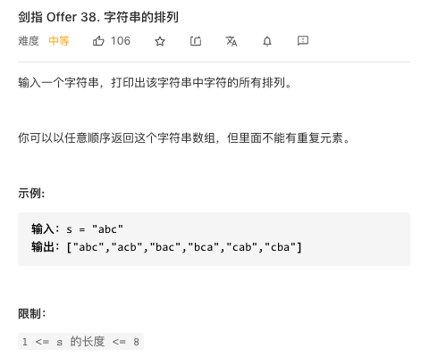

# 剑指Offer
## 1.滑动窗口最大值


```js
/**
 * @param {number[]} nums
 * @param {number} k
 * @return {number[]}
 */
var maxSlidingWindow = function (nums, k) {

    function monStack() {
        this.stack = [];

        monStack.prototype.getMax = function () {
            return this.stack[0];
        }

        monStack.prototype.push = function (n) {
            while (this.stack[this.stack.length - 1] < n && this.stack.length > 0) {
                this.stack.pop();
            }
            this.stack.push(n);
        }

        monStack.prototype.pop = function (n) {
            if (n === this.stack[0]) {
                this.stack.shift();
            }
        }

    }

    let s = new monStack();
    let len = nums.length;
    let ans = [];

    for (let i = 0; i < len; i++) {
        if (i < k - 1) {
            s.push(nums[i]);
        } else {
            s.push(nums[i]);
            ans.push(s.getMax());
            s.pop(nums[i - k + 1]);
        }
    }

    return ans;
};
```
## 剪绳子 IIx


```js
/**
 * @param {number} n
 * @return {number}
 */
var cuttingRope = function (n) {

    const mod = BigInt(1000000007);
    let dp = new Array(n + 1).fill(BigInt(0));
    dp[2] = BigInt(1);
    for (let i = BigInt(3); i <= n; i++) {
        for (let j = BigInt(1); j <= i - BigInt(1); j++) {
            let t1 = dp[i - j] * BigInt(j) ;
            let t2 = (i - j) * j ;
            let bigger = dp[i] > t1 ? dp[i] : t1;
            dp[i] = (bigger > t2 ? bigger : t2) ;
        }
    }
    return dp[n] % mod;

};
```
注意有可能超过整数范围要用BigInt
并且递推关系为dp[i] = Math.max(dp[i-j] * j,(i-j) * j)(1 <= j <= n-1),即分成两段或者是分成多段

或者使用数学方法

```js
/**
 * @param {number} n
 * @return {number}
 */
var cuttingRope = function (n) {
    
    if (n === 3) return 2;
    if (n === 2) return 1;
    const a = Math.floor(n / 3);
    const b = Math.floor(n % 3);
    if (b === 1) return Math.pow(3, a - 1) * 4;
    if (b === 2) return Math.pow(3, a) * 2;
    return Math.pow(3, a);

};
```
规则为：
1. 能拆成3就拆成3
2. 余数若为1，把一个3拿出来变成2*2
3. 余数若为2，则直接把2乘进去

## 队列的最大值


```js
var MaxQueue = function () {
    this.queue = [];
    this.maxQ = [];
};

/**
 * @return {number}
 */
MaxQueue.prototype.max_value = function () {
    return this.maxQ[0] || -1;
};

/** 
 * @param {number} value
 * @return {void}
 */
MaxQueue.prototype.push_back = function (value) {
    this.queue.push(value);
    while(this.maxQ.length && this.maxQ[this.maxQ.length - 1] < value){
        this.maxQ.pop();
    }
    this.maxQ.push(value);
};

/**
 * @return {number}
 */
MaxQueue.prototype.pop_front = function () {
    let t = this.queue.shift();
    if(t === this.maxQ[0]) this.maxQ.shift();
    return t || -1;
};

/**
 * Your MaxQueue object will be instantiated and called as such:
 * var obj = new MaxQueue()
 * var param_1 = obj.max_value()
 * obj.push_back(value)
 * var param_3 = obj.pop_front()
 */
```

## 15. 二进制中1的个数

方法1：
注意输入的数字就是十进制的数，要先用toString(进制数)转换成对应进制的字符串
parseInt(数, 进制)也可以进行转换

```js
/**
 * @param {number} n - a positive integer
 * @return {number}
 */
var hammingWeight = function(n) {
    let str = n.toString(2);
    let len = str.length;
    let ans= 0;
    for(let i = 0;i < len;i++){
        if(str[i] === '1'){
            ans++;
        }
    }
    return ans;
};
```
## 剑指 Offer 16. 数值的整数次方x

快速幂的思想
```js
/**
 * @param {number} x
 * @param {number} n
 * @return {number}
 */
var myPow = function (x, n) {
    //递归边界
    if(n === 0) return 1;
    let temp = n < 0 ? -n : n;
    let ans = 0;
    if (temp % 2 === 0) {//若是偶次幂
        let mi = myPow(x, temp / 2);
        ans = mi * mi;
    } else {//若为奇次幂
        ans = x * myPow(x, temp - 1);
    }
    return n < 0 ? 1 / ans : ans;
};
```
如果考虑大整数需要取余要使用BigInt
```js
/**
 * @param {number} x
 * @param {number} n
 * @return {number}
 */
var myPow = function (x, n) {
    //递归边界
    const mod = BigInt(1000000007);
    if(n === 0) return BigInt(1);
    let temp = n < 0 ? -n : n;
    let ans = BigInt(0);
    if (temp % 2 === 0) {//若是偶次幂
        let mi = BigInt(myPow(x, temp / 2)) % mod;
        ans = mi * mi % mod;
    } else {//若为奇次幂
        ans = BigInt(x) * myPow(x, temp - 1) % mod;
    }
    return (n < 0 ? BigInt(1) / ans : ans) % mod;
};
```
注意：
1. 由于对1e9取余，所以有可能有两个数分别为1e9 * 1e9导致超过int类型的上线Pow(2,53) 即1e10导致结果失去精度
2. BigInt不能和int类型一起计算
3. 不能使用Math类中的方法
## 剑指 Offer 17. 打印从1到最大的n位数


```js
/**
 * @param {number} n
 * @return {number[]}
 */
var printNumbers = function(n) {
    //求最大的n位十进制数为 10的n次方-1， 使用快速幂的思想可以求解
    function power(x,n){//快速幂
        if(n === 0) return 1;
        if(n % 2 === 0){
            let temp = power(x,n/2);
            return temp * temp;
        }else{
            return power(x,n-1) * x;
        }
    }
    let upper = power(10,n) - 1;
    let ans = [];
    for(let i = 0;i < upper;i++){
        ans.push(i + 1);
    }
    return ans;
};
```
## 剑指 Offer 18. 删除链表的节点


```js
/**
 * Definition for singly-linked list.
 * function ListNode(val) {
 *     this.val = val;
 *     this.next = null;
 * }
 */
/**
 * @param {ListNode} head
 * @param {number} val
 * @return {ListNode}
 */
var deleteNode = function(head, val) {
    //加一个头结点
    let my_head = new ListNode(null);
    my_head.next = head;
    head = my_head;
    //首先找到该结点的前一个结点
    let p = head;
    while(p.next.val !== val){
        p = p.next;
    }
    //再删除结点
    p.next = p.next.next;
    return head.next;
};
```
## 正则表达式匹配x


```js
/**
 * @param {string} s
 * @param {string} p
 * @return {boolean}
 */
var isMatch = function (s, p) {
    let slen = s.length;
    let plen = p.length;
    let dp = (new Array(slen + 1).fill(0)).map(() => {
        return new Array(plen + 1).fill(true);
    })

    //初始化
    for(let i = 1;i <= slen;i++){
        dp[i][0] = false;
    }

    //再进行状态转移
    for (let i = 0; i <= slen; i++) {
        for (let j = 1; j <= plen; j++) {

            if (i > 0 && (s[i-1] === p[j-1] || p[j-1] === '.')) {
                dp[i][j] = dp[i - 1][j - 1];
            } else if (p[j-1] === '*') {
                if (s[i-1] === p[j - 2] || p[j-2] === '.' && i > 0) {
                    dp[i][j] = dp[i][j - 2] || dp[i - 1][j];
                } else {
                    dp[i][j] = dp[i][j - 2];
                }
            } else {
                dp[i][j] = false;
            }

        }
    }
    
    return dp[slen][plen];
};
```
## 合并两个排序的链表


```js
/**
 * Definition for singly-linked list.
 * function ListNode(val) {
 *     this.val = val;
 *     this.next = null;
 * }
 */
/**
 * @param {ListNode} l1
 * @param {ListNode} l2
 * @return {ListNode}
 */
var mergeTwoLists = function(l1, l2) {
    if(!l1) return l2;
    if(!l2) return l1;
    if(l1.val < l2.val){
        l1.next = mergeTwoLists(l1.next,l2);
        return l1;
    }else{
        l2.next = mergeTwoLists(l1,l2.next);
        return l2;
    }
};
```
## 树的子结构


```js
/**
 * Definition for a binary tree node.
 * function TreeNode(val) {
 *     this.val = val;
 *     this.left = this.right = null;
 * }
 */
/**
 * @param {TreeNode} A
 * @param {TreeNode} B
 * @return {boolean}
 */
var isSubStructure = function (A, B) {
    function helper(A, B) {//从A的根结点开始，判断B是否是A的子树
        if (!B) {
            return true;
        }
        if (!A) {
            return false;
        }
        if (A.val !== B.val) {
            return false;
        } else {
            return helper(A.left, B.left) && helper(A.right, B.right);
        }
    }

    if (!A || !B) return false;//空树返回 false;
    return helper(A, B) || isSubStructure(A.left, B) || isSubStructure(A.right, B);//注意是返回isSubStructure
};
```
## 顺时针打印矩阵

```js
/**
 * @param {number[][]} matrix
 * @return {number[]}
 */
var spiralOrder = function(matrix) {
    let directions = [[0,1],[1,0],[0,-1],[-1,0]];
    let m = matrix.length;
    let n = !matrix[0] || matrix[0].length;
    let visited = createArray(m,n);
    let x = 0;
    let y = 0;
    let total = m * n;
    let ans = [];
    let num = 0;//方向的下标
    let direction = directions[num];//目前行进的方向
    for(let i = 0;i < total;i++){
        ans.push(matrix[x][y]);
        visited[x][y] = 1;
        tempX = x + direction[0];
        tempY = y + direction[1];
        if(!(tempX >= 0 && tempY >= 0 && tempX < m && tempY < n && !visited[tempX][tempY])){//如果下一步已经超过了已经遍历的矩阵范围就要换方向
            num = (num + 1) % 4;
            direction = directions[num];
        }
        x += direction[0];
        y += direction[1];
    }
    return ans;
    function createArray(m,n){
        return new Array(m).fill(0).map(_=>{
            return new Array(n).fill(0);
        })
    }

};
```
## 包含min函数的栈


```js
/**
 * initialize your data structure here.
 */
var MinStack = function () {
    this.stack = [];
    this.minStack = [];
    this.minNum = Number.MAX_SAFE_INTEGER;
};

/** 
 * @param {number} x
 * @return {void}
 */
MinStack.prototype.push = function (x) {
    if (this.minNum > x) {
        this.minNum = x;
    }
    this.stack.push(x);
    this.minStack.push(this.minNum);
};

/**
 * @return {void}
 */
MinStack.prototype.pop = function () {
    this.stack.pop();
    this.minStack.pop();
    if(this.stack.length === 0){
        this.minNum = Number.MAX_SAFE_INTEGER;
    }
    if (this.minStack[this.minStack.length - 1] > this.minNum) {
        this.minNum = this.minStack[this.minStack.length - 1];
    }
};

/**
 * @return {number}
 */
MinStack.prototype.top = function () {
    return this.stack[this.stack.length - 1];
};

/**
 * @return {number}
 */
MinStack.prototype.min = function () {
    return this.minNum;
};

/**
 * Your MinStack object will be instantiated and called as such:
 * var obj = new MinStack()
 * obj.push(x)
 * obj.pop()
 * var param_3 = obj.top()
 * var param_4 = obj.min()
 */
```

## 栈的压入、弹出序列x


我的方法
```js
/**
 * @param {number[]} pushed
 * @param {number[]} popped
 * @return {boolean}
 */
var validateStackSequences = function (pushed, popped) {
    let s = [];
    let p_pushed = 0;
    let p_popped = 0;
    let len = popped.length;
    for (let p_popped = 0; p_popped < len; p_popped++) {//检查每一个popped的值

        //先看一下栈顶能不能出栈
        if (s.length && s[s.length - 1] === popped[p_popped]) {//如果能出栈直接出
            s.pop();
            continue;
        }

        //不能出栈再向后找
        let flag = true;
        while (p_pushed < len) {
            if (popped[p_popped] !== pushed[p_pushed]) {
                s.push(pushed[p_pushed]);
                p_pushed++;
            } else {
                flag = false;
                p_pushed++;
                break;
            }
        }
        if(flag){
            return false;
        }
    }
    return true;
};
```
更好的方法

```js
/**
 * @param {number[]} pushed
 * @param {number[]} popped
 * @return {boolean}
 */
var validateStackSequences = function (pushed, popped) {
    let len =  popped.length;
    let s = [];
    let p = 0;
    for(let i = 0;i < len;i++){
        s.push(pushed[i]);
        while(s.length && s[s.length-1] === popped[p]){//如果栈顶值和popped的值相等
            s.pop();
            p++;
        }
    }
    return s.length === 0 ? true:false;
};
```
## I. 从上到下打印二叉树


```js
/**
 * Definition for a binary tree node.
 * function TreeNode(val) {
 *     this.val = val;
 *     this.left = this.right = null;
 * }
 */
/**
 * @param {TreeNode} root
 * @return {number[]}
 */
var levelOrder = function(root) {
    let q = [];
    let ans = [];
    if(!root) return ans;
    q.push(root);
    while(q.length){
        let front = q.shift();
        if(front.left) q.push(front.left);
        if(front.right) q.push(front.right);
        ans.push(front.val);
    }
    return ans;
};
```
## 剑指 Offer 32 - II. 从上到下打印二叉树 II


```js
/**
 * Definition for a binary tree node.
 * function TreeNode(val) {
 *     this.val = val;
 *     this.left = this.right = null;
 * }
 */
/**
 * @param {TreeNode} root
 * @return {number[][]}
 */
var levelOrder = function(root) {
    let q = [];
    let ans = [];
    if(!root) return ans;
    q.push(root);
    while(q.length){
        let temp = [];
        let len = q.length;
        for(let i = 0;i < len;i++){
            let front = q.shift();
            temp.push(front.val);
            if(front.left) q.push(front.left);
            if(front.right) q.push(front.right);
        }
        ans.push(temp);
    }
    return ans;
};
```
## III. 从上到下打印二叉树 III


```js
/**
 * Definition for a binary tree node.
 * function TreeNode(val) {
 *     this.val = val;
 *     this.left = this.right = null;
 * }
 */
/**
 * @param {TreeNode} root
 * @return {number[][]}
 */
var levelOrder = function (root) {
    let q = [];
    let ans = [];
    if (!root) return ans;
    q.push(root);
    let layer = 1;
    while (q.length) {
        let temp = [];
        let len = q.length;
        for (let i = 0; i < len; i++) {
            let front = q.shift();
            temp.push(front.val);
            if (front.left) q.push(front.left);
            if (front.right) q.push(front.right);
        }
        if (layer % 2 === 0) {//如果是偶数层则从右向左
            temp.reverse();
        }
        layer++;
        ans.push(temp);
    }
    return ans;
};
```
或者

```js
/**
 * Definition for a binary tree node.
 * function TreeNode(val) {
 *     this.val = val;
 *     this.left = this.right = null;
 * }
 */
/**
 * @param {TreeNode} root
 * @return {number[][]}
 */
var levelOrder = function (root) {
    let q = [];
    let ans = [];
    if (!root) return ans;
    q.push(root);
    let layer = 1;
    while (q.length) {
        let temp = [];
        let len = q.length;
        for (let i = 0; i < len; i++) {
            let front = q.shift();
            if (layer % 2 === 0) {//如果是偶数层则从右向左
                temp.unshift(front.val);
            } else {
                temp.push(front.val);
            }
            if (front.left) q.push(front.left);
            if (front.right) q.push(front.right);
        }
        layer++;
        ans.push(temp);
    }
    return ans;
};
```
## 二叉搜索树的后序遍历序列x


```js
/**
 * @param {number[]} postorder
 * @return {boolean}
 */
var verifyPostorder = function(postorder) {
    function helper(l,r,postorder){
        if(l >= r) return true;
        let temp = postorder[r];
        let p1 = 0;
        while(postorder[p1] < temp){
            p1++;
        }
        let p2 = p1;
        while(postorder[p2] > temp){
            p2++;
        }
        if(p2 !== r){
            return false;
        } else{
            return helper(l,p1-1,postorder) && helper(p1,r-1,postorder);
        }
    }  
    return helper(0,postorder.length-1,postorder);
};
```
## 二叉树中和为某一值的路径


```js
/**
 * Definition for a binary tree node.
 * function TreeNode(val) {
 *     this.val = val;
 *     this.left = this.right = null;
 * }
 */
/**
 * @param {TreeNode} root
 * @param {number} sum
 * @return {number[][]}
 */
var pathSum = function (root, sum) {
    let ans = [];
    let temp = [];
    function helper(root, sum) {
        if (!root) return;
        temp.push(root.val);
        if (!root.left && !root.right) {
            if (sum - root.val === 0) ans.push(Array.from(temp));
            temp.pop();
            return;
        }
        helper(root.left, sum - root.val);
        helper(root.right, sum - root.val);
        temp.pop();
    }
    helper(root, sum);
    return ans;
};
```
## 复制带随机指针的链表x


```js
/**
 * // Definition for a Node.
 * function Node(val, next, random) {
 *    this.val = val;
 *    this.next = next;
 *    this.random = random;
 * };
 */

/**
 * @param {Node} head
 * @return {Node}
 */
var copyRandomList = function(head) {
    let m = new Map();//利用一个图来存储原来的指针和新的结点的映射关系
    function helper(head){
        if(!head) return null;
        if(m.get(head)){
            return m.get(head);
        }
        let node = new Node(head.val,null,null);
        m.set(head,node);
        node.next = helper(head.next);
        node.random = helper(head.random);
        return node;
    }
    return helper(head);
};
```
## 二叉搜索树与双向链表x
https://leetcode-cn.com/problems/er-cha-sou-suo-shu-yu-shuang-xiang-lian-biao-lcof/
```js
/**
 * // Definition for a Node.
 * function Node(val,left,right) {
 *    this.val = val;
 *    this.left = left;
 *    this.right = right;
 * };
 */
/**
 * @param {Node} root
 * @return {Node}
 */
var treeToDoublyList = function (root) {
    if(!root) return root;
    let head = null;
    let pre = null;//用来保存前一个节点
  //利用二叉搜索树的性质来中序遍历使其遍历有序
    function helper(root) {
        if (!root) return;
        helper(root.left);
        if (pre === null) {//如果pre还为null说明为头结点
            head = root;
        } else {
            pre.right = root;
            root.left = pre;
        }
        pre = root;
        helper(root.right);
    }
    helper(root);
    head.left = pre;
    pre.right = head;
    return head;
};
```
## 序列化二叉树x

方法1:BFS
```js
/**
 * Definition for a binary tree node.
 * function TreeNode(val) {
 *     this.val = val;
 *     this.left = this.right = null;
 * }
 */

/**
 * Encodes a tree to a single string.
 *
 * @param {TreeNode} root
 * @return {string}
 */
var serialize = function (root) {
    let q = [root];
    let res = [];
    while (q.length) {
        let front = q.shift();
        if (front) {
            q.push(front.left);
            q.push(front.right);
            res.push(front.val);
        } else {
            res.push('X');
        }
    }
    return res.join(',');

};

/**
 * Decodes your encoded data to tree.
 *
 * @param {string} data
 * @return {TreeNode}
 */
var deserialize = function (data) {
    if (data === 'X') return null;
    data = data.split(',');
    let root = new TreeNode(data[0]);
    let q = [root];
    let index = 1;
    let len = data.length;
    while (index < len) {
        let front = q.shift();
        let lval = data[index];
        let rval = data[index + 1];

        if (lval !== 'X') {
            front.left = new TreeNode(lval);
            q.push(front.left);
        }
        if (rval !== 'X') {
            front.right = new TreeNode(rval);
            q.push(front.right);
        }
        index += 2;

    }

    return root;

};

/**
 * Your functions will be called as such:
 * deserialize(serialize(root));
 */
```
方法2:DFS

```js
/**
 * Definition for a binary tree node.
 * function TreeNode(val) {
 *     this.val = val;
 *     this.left = this.right = null;
 * }
 */

/**
 * Encodes a tree to a single string.
 *
 * @param {TreeNode} root
 * @return {string}
 */
var serialize = function (root) {

    if(!root) return 'X,';

    let cur = root.val + ',';
    let l = serialize(root.left);
    let r = serialize(root.right);

    return cur + l + r;

};

/**
 * Decodes your encoded data to tree.
 *
 * @param {string} data
 * @return {TreeNode}
 */
var deserialize = function (data) {

    data = data.split(',');
    function helper(data){
        let front = data.shift();
        if(front === 'X') return null;
        let root = new TreeNode(front);
        root.left = helper(data);
        root.right = helper(data);
        return root;
    }
    return helper(data);
};

/**
 * Your functions will be called as such:
 * deserialize(serialize(root));
 */
```
## 字符串的排列


```js
/**
 * @param {string} s
 * @return {string[]}
 */
var permutation = function (s) {
    let temp = [];
    let ans = [];
    let pos = [];
    let len = s.length;

    function helper(index) {//第i个位置
        //递归边界
        if (index === len) {
            ans.push(temp.join(''));
            return;
        }
        let map = new Map();//用来存储该位置出现过的字符，避免重复
        for (let i = 0; i < len; i++) {
            if (map.get(s[i])) {//如过有一个重复的字符已经在这个位置上出现过
                continue;//直接跳过这个字符
            }
            if (!pos[i]) {//如果这个字符还没有被用到才放入
                temp.push(s[i]);
                pos[i] = 1;
                map.set(s[i], 1);
                helper(index + 1);
                temp.pop();
                pos[i] = 0;
            }
        }
    }

    helper(0);
    return ans;
};
```
用一个数组来判断这个字符是否已经被放在了temp中
用一个map来判断一个位置上是否已经有一个相同的字符已经出现过了
## 数组中出现次数超过一半的数字x

1.排序

```js
/**
 * @param {number[]} nums
 * @return {number}
 */
var majorityElement = function(nums) {
    nums.sort();
    return nums[Math.ceil(nums.length / 2) - 1];
};
```
2.hash
3.投票算法

```js
/**
 * @param {number[]} nums
 * @return {number}
 */
var majorityElement = function(nums) {
    let ans = 0;
    let votes = 0;
    let len = nums.length;
    for(let i = 0;i < len;i++){
        if(votes === 0) ans = nums[i];
        votes += ans === nums[i] ? 1 : -1;
    }
    return ans;
};
```
## 最小的k个数

1.利用一个小顶堆
```js
/**
 * @param {number[]} arr
 * @param {number} k
 * @return {number[]}
 */
var getLeastNumbers = function (arr, k) {
    function MinHeap(arr) {//手写实现一个堆
        this.heap = arr.slice(0);
        this.pop = () => {//弹出堆顶元素
            let h = this.heap;
            let len = h.length - 1;
            //把第一个数和最后一个数交换
            [h[1],h[len]] = [h[len],h[1]];
            //再把最后一个数弹出
            let res = h.pop();
            //再向下调整维护这个小顶堆
            downAdjust(1,h.length - 1,h);
            return res;
        }
        let initial = () => {
            let h = this.heap;
            let len = h.length;
            h.unshift('');//让这个数组的下标从1开始
            //从第一个非叶子结点开始向下调整得到小顶堆
            for (let i = Math.floor(len / 2); i > 0; i--) {
                downAdjust(i, len, h);
            }
        }
        initial();
        function downAdjust(l, r, arr) {//向下调整
            let lchild = l * 2;
            let rchild = l * 2 + 1;
            if (lchild > rchild) return;
            if (rchild < r && arr[lchild] > arr[rchild]) {//注意这个地方要判断rchild是否过界
                lchild = rchild;
            }
            if (arr[lchild] < arr[l]) {
                [arr[lchild], arr[l]] = [arr[l], arr[lchild]];
                downAdjust(lchild, r, arr);
            }
        }
    }
    let heap = new MinHeap(arr);
    let ans = [];
    for(let i = k; i > 0;i--){
        ans.push(heap.pop());
    }
    return ans;
};
```
2.快排

```js
/**
 * @param {number[]} arr
 * @param {number} k
 * @return {number[]}
 */
var getLeastNumbers = function (arr, k) {
    function partition(l, r, arr) {
        let temp = arr[l];
        while (l < r) {
            while (arr[r] >= temp && r > l) {
                r--;
            }
            arr[l] = arr[r];
            while (temp >= arr[l] && r > l) {
                l++;
            }
            arr[r] = arr[l];
        }
        arr[l] = temp;
        return l;
    }
    function quickSort(l, r, arr) {
        let mid = partition(l, r, arr);
        if (mid === k) {
            return arr.slice(0, k);
        }
        if (mid < k) {
            return quickSort(mid + 1, r, arr);
        } else {
            return quickSort(l, mid - 1, arr);
        }
    }
    return quickSort(0, arr.length - 1, arr);
};
```
## 连续子数组的最大和

/**

```js
 * @param {number[]} nums
 * @return {number}
 */
var maxSubArray = function(nums) {
    let sum = 0;
    let max = Number.MIN_SAFE_INTEGER;
    for(let i = 0;i < nums.length;i++){
        if(sum < 0){
            sum = nums[i];
        }else{
            sum += nums[i];
        }
        max = Math.max(max,sum);
    }
    return max;
};
```
## 1～n整数中1出现的次数

```js
/**
 * @param {number} n
 * @return {number}
 */
var countDigitOne = function (n) {
    let high = Math.floor(n / 10);
    let cur = n % 10;
    let digit = 1;
    let low = 0;
    let sum = 0;
    while (high !== 0 || low !== n) {
        if (cur === 1) sum += (digit * high + low + 1);
        if (cur === 0) sum += digit * high;
        if (cur > 1) sum += (high + 1) * digit;
        digit *= 10;
        cur = high % 10;
        high = Math.floor(high / 10);
        low = n % digit;
    }
    return sum;
};
```
从个位开始直到最高位：
如果该位为1:则这个位上的1的个数位(digit * high + low + 1)
如果位0则为digit * high
如果>0则为(high + 1) * digit

digit该为是第几位
high为高位，low为低位
## 数字序列中某一位的数字

## 把数字翻译成字符串x

```js
/**
 * @param {number} num
 * @return {number}
 */
var translateNum = function (num) {
    let s = num + '';
    let dp = new Array(s.length + 1).fill(1);
    for (let i = 1; i <= s.length; i++) {
        if (i <= 1) {
            dp[i] = 1;
            continue;
        }
        if (parseInt(s[i - 2] + s[i - 1]) <= 25 && s[i-2] != '0') {
            dp[i] = dp[i - 1] + dp[i - 2];
        } else {
            dp[i] = dp[i - 1];
        }
    }
    return dp[s.length];
};
```
## 礼物的最大价值

1.DFS超时
```js
/**
 * @param {number[][]} grid
 * @return {number}
 */
var maxValue = function(grid) {
    let max = Number.MIN_SAFE_INTEGER;
    let sum = 0;
    function helper(x,y){
        if(x >= grid.length || y >= grid[0].length) return;
        if(x === grid.length - 1 && y === grid[0].length - 1){
            sum += grid[x][y];
            max = Math.max(max,sum);
            sum -= grid[x][y];
        }
        sum += grid[x][y];
        helper(x+1,y);
        helper(x,y+1);
        sum -= grid[x][y];
    }
    helper(0,0);
    return max;
};
```
2.动态规划

```js
/**
 * @param {number[][]} grid
 * @return {number}
 */
var maxValue = function (grid) {
    let row = grid.length;
    let col = grid[0].length;
    let dp = new Array(row).fill(0).map(() => {
        return new Array(col).fill(0);
    });
    for (let i = 0; i < row; i++) {
        for (let j = 0; j < col; j++) {
            if(i === 0 && j === 0){
                dp[0][0] = grid[0][0];
            }else if (i === 0) {
                dp[i][j] = dp[i][j - 1] + grid[i][j];
            } else if (j === 0) {
                dp[i][j] = dp[i - 1][j] + grid[i][j];
            } else {
                dp[i][j] = Math.max(dp[i - 1][j], dp[i][j - 1]) + grid[i][j];
            }
        }
    }
    return dp[row - 1][col - 1];
};
```
3.动态规划（一维数组）

```js
/**
 * @param {number[][]} grid
 * @return {number}
 */
var maxValue = function (grid) {
    let row = grid.length;
    let col = grid[0].length;
    let dp = new Array(col).fill(0);
    for (let i = 0; i < row; i++) {
        for (let j = 0; j < col; j++) {
            if(i === 0 && j === 0){
                dp[j] = grid[0][0];
            }else if (i === 0) {
                dp[j] = dp[j - 1] + grid[i][j];
            } else if (j === 0) {
                dp[j] = dp[j] + grid[i][j];
            } else {
                dp[j] = Math.max(dp[j], dp[j - 1]) + grid[i][j];
            }
        }
    }
    return dp[col - 1];
};
```
## 最长不含重复字符的子字符串x


```js
/**
 * @param {string} s
 * @return {number}
 */
var lengthOfLongestSubstring = function (s) {
    let max = 1;
    let len = s.length;
    let dp = new Array(len).fill(0);
    if (!s) return 0;
    dp[0] = 1;
    let map = new Map();
    map.set(s[0], 0);
    for (let i = 1; i < len; i++) {
        let temp = map.get(s[i]);
        if (temp !== undefined) {
            dp[i] = Math.min(dp[i - 1] + 1,i - temp);
        } else {
            dp[i] = dp[i - 1] + 1;
        }
        map.set(s[i], i);
        max = Math.max(max, dp[i]);
    }
    return max;
};
```
## 丑数x


```js
/**
 * @param {number} n
 * @return {number}
 */
var nthUglyNumber = function(n) {
    let dp = new Array(n + 1).fill(1);
    let a = 1;
    let b = 1;
    let c = 1;
    for(let i = 2;i <= n;i++){
        let ugly = Math.min(dp[a] * 2,dp[b] * 3,dp[c] * 5);
        if(ugly === dp[a] * 2) a++;
        if(ugly === dp[b] * 3) b++;
        if(ugly === dp[c] * 5) c++;
        dp[i] = ugly;
    }
    return dp[n];
};
```
## 第一个只出现一次的字符


```js
/**
 * @param {string} s
 * @return {character}
 */
var firstUniqChar = function (s) {
    let map = new Map();
    for (let i = 0; i < s.length; i++) {
        let t = map.get(s[i]);
        if (t) {
            map.set(s[i], t + 1);
        } else {
            map.set(s[i], 1);
        }
    }
    for (let i = 0; i < s.length; i++) {
        let t = map.get(s[i]);
        if (t === 1) {
            return s[i];
        } 
    }
    return " ";
};
```
## 数组中的逆序对x


```js
/**
 * @param {number[]} nums
 * @return {number}
 */
var reversePairs = function (nums) {
    let sum = 0;
    function mergerSort(nums, l, r) {
        if (l >= r) return;//注意若为空则l值会有可能大于r
        let mid = Math.floor((l + r) / 2);
        let temp = [];
        let l1 = l;
        let l2 = mid + 1;
        mergerSort(nums, l, mid);
        mergerSort(nums, mid + 1, r);
        while (l1 <= mid && l2 <= r) {
            if (nums[l1] <= nums[l2]) {//注意此处为了确保l2之前的数都小于nums[l1],所以要用小于等于
                temp.push(nums[l1]);
                l1++;
                sum += l2 - mid - 1;
            } else {
                temp.push(nums[l2]);
                l2++;
            }
        }
        while (l1 <= mid) {
            temp.push(nums[l1]);
            l1++;
            sum += l2 - mid - 1;
        }
        while (l2 <= r) {
            temp.push(nums[l2]);
            l2++;
        }
        for (let i = l; i <= r; i++) {
            nums[i] = temp[i - l];
        }
    }
    mergerSort(nums, 0, nums.length - 1);
    return sum;
};
```
## 两个链表的第一个公共节点


```js
/**
 * Definition for singly-linked list.
 * function ListNode(val) {
 *     this.val = val;
 *     this.next = null;
 * }
 */

/**
 * @param {ListNode} headA
 * @param {ListNode} headB
 * @return {ListNode}
 */
var getIntersectionNode = function(headA, headB) {
    let p1 = headA;
    let p2 = headB;
    while(p1 !== p2){
        p1 = p1 ? p1.next : headB;
        p2 = p2 ? p2.next : headA;
    }
    return p1;
};
```
注意
1. 会有可能有没有交点的情况，这种情况下再经历链表1的长度*链表2的长度次后会同时为null
2. 不能用p1.next来判断，因为有可能p1为null
## 在排序数组中查找数字 I


```js
/**
 * @param {number[]} nums
 * @param {number} target
 * @return {number}
 */
var search = function (nums, target) {
    let l = 0;
    let r = nums.length;
    let ans = 0;
    while (l < r) {
        let mid = Math.floor((l + r) / 2);
        if(nums[mid] >= target){
            r = mid;
        }else{
            l = mid + 1;
        }
    }
    while(nums[l] === target){
        ans++;
        l++;
    }
    return ans;
};
```
##  0～n-1中缺失的数字


```js
/**
 * @param {number[]} nums
 * @return {number}
 */
var missingNumber = function (nums) {
    let l = 0, r = nums.length;
    while(l < r){
        let mid = Math.floor((l + r) / 2);
        if(nums[mid] > mid){
            r = mid;
        }else{
            l = mid + 1;
        }
    }
    return l;
};
```
## 二叉搜索树的第k大节点


```js
/**
 * Definition for a binary tree node.
 * function TreeNode(val) {
 *     this.val = val;
 *     this.left = this.right = null;
 * }
 */
/**
 * @param {TreeNode} root
 * @param {number} k
 * @return {number}
 */
var kthLargest = function(root, k) {
    let rank = 0;
    let ans = null;

    function helper(root){
        if(!root) return;
        helper(root.right);
        rank++;
        if(rank === k){
            ans = root;
            return;
        }
        helper(root.left);
    }

    helper(root);
    return ans.val;
};
```
## 和为s的两个数字


```js
/**
 * @param {number[]} nums
 * @param {number} target
 * @return {number[]}
 */
var twoSum = function(nums, target) {
    let map = new Map();
    for(let i = 0;i < nums.length;i++){
        let t = map.get(target - nums[i]);
        if(t){
            return [nums[i],t];
        }else{
            map.set(nums[i],nums[i]);
        }
    }
    return [];
};
```
注意已经有序的数组的双指针！
```js
/**
 * @param {number[]} nums
 * @param {number} target
 * @return {number[]}
 */
var twoSum = function(nums, target) {
    let l = 0, r = nums.length - 1;
    while(l < r){
        if(nums[l] + nums[r] === target){
            return [nums[l],nums[r]];
        }else if(nums[l] + nums[r] < target){
            l++;
        }else{
            r--;
        }
    }
    return [];
};
```
## 和为s的连续正数序列x

方法1:滑动窗口
```js
/**
 * @param {number} target
 * @return {number[][]}
 */
var findContinuousSequence = function (target) {
    let l = 1;
    let r = 2;
    let sum = l + r;
    let ans = [];
    while (r <= Math.ceil(target / 2)) {//注意r只要超过了一半的上界就不用继续了
        if (sum < target) {
            r++;
            sum += r;
        } else if (sum === target) {
            let temp = [];
            for (let i = l; i <= r; i++) {
                temp.push(i);
            }
            ans.push(temp);
            sum -= l;
            l++;
        } else {
            sum -= l;
            l++;
        }
    }
    return ans;
};
```
## 左旋转字符串


```js
/**
 * @param {string} s
 * @param {number} n
 * @return {string}
 */
var reverseLeftWords = function(s, n) {
    let s1 = s.slice(0,n);
    let s2 = s.slice(n);
    return s2 + s1;
};
```
这个题也可以先翻转前半部分，再翻转后半部分，再一起翻转得到。翻转可以由双指针实现。这样可以理论上不消耗额外内存。
但是由于js的字符串不可变，所以这种方式不能用js实现。
## 圆圈中最后剩下的数字


```js
/**
 * @param {number} n
 * @param {number} m
 * @return {number}
 */
var lastRemaining = function(n, m) {
    let ans = 0;
    for(let i = 1;i < n;i++){
        ans = (ans + m) % (i + 1);
    }
    return ans;
};
```

[https://leetcode-cn.com/problems/yuan-quan-zhong-zui-hou-sheng-xia-de-shu-zi-lcof/solution/huan-ge-jiao-du-ju-li-jie-jue-yue-se-fu-huan-by-as/](Explaination)

## 扑克牌中的顺子x

只要满足两个条件即可：
1. 无重复
2. 最大值-最小值 < 5
```js
/**
 * @param {number[]} nums
 * @return {boolean}
 */
var isStraight = function(nums) {
    let s = new Set();
    let min = Number.MAX_SAFE_INTEGER;
    let max = Number.MIN_SAFE_INTEGER;
    for(let i = 0;i < nums.length;i++){
        if(nums[i] === 0) continue;
        if(s.has(nums[i])) return false;
        s.add(nums[i]);
        min = Math.min(nums[i],min);
        max = Math.max(nums[i],max);
    }
    return max - min < 5 ? true : false;
};
```
## 剑指 Offer 64. 求1+2+…+n


```js
/**
 * @param {number} n
 * @return {number}
 */
var sumNums = function (n) {
    let sum = 0;
    function helper(n) {
        let a = n >= 1 && helper(n - 1);
        sum += n;
    }
    helper(n);
    return sum;
};
```
## 把字符串转换成整数


```js
/**
 * @param {string} str
 * @return {number}
 */
var strToInt = function(str) {

    str = str.trim();
    if(!str) return 0;
    let i = 0 ,ans = 0, boundry = Math.pow(2,31);
    if(str[i] === '-' || str[i] === '+') i++;
    while(i < str.length && str[i] >= '0' && str[i] <= '9'){
        if(ans > Math.floor(boundry / 10) || (ans ===  Math.floor(boundry / 10) && str[i] > '7')){
            return str[0] === '-' ? -boundry : boundry - 1;
        }
        ans = ans * 10 + parseInt(str[i]);
        i++;
    }
    return str[0] === '-' ? -ans : ans;

};
```
注意js中的字符在用> < 比较的时候是会自动转成ASCII码比较的
## 数据流中的中位数x


```js
/**
 * initialize your data structure here.
 */


var MedianFinder = function () {

    function Heap(compare) {
        this.heap = [0];//给一个初始值使得下标从1开始


        //若compare是(a,b)=>{return a < b}则为小顶堆
        function upAdjust(arr, l, r) {//向上调整


            let father = Math.floor(r / 2);

            if (father >= l && compare(arr[r], arr[father])) {
                [arr[father], arr[r]] = [arr[r], arr[father]];
                upAdjust(arr, l, father);
            }

        }

        function downAdjust(arr, l, r) {//向下调整

            let lchild = l * 2;
            let rchild = lchild + 1;

            if (lchild > r) return;

            if (rchild <= r && compare(arr[rchild], arr[lchild])) {
                lchild = rchild;
            }

            if (compare(arr[lchild], arr[l])) {
                [arr[lchild], arr[l]] = [arr[l], arr[lchild]];
                downAdjust(arr, lchild, r);
            }

        }

        this.push = (val) => {//注意这里要方法定义在实例上否则不能传进不同的比较函数
            this.heap.push(val);
            upAdjust(this.heap, 1, this.heap.length - 1);
        }

        this.pop = () => {
            let temp = this.heap[1];
            this.heap[1] = this.heap[this.heap.length - 1];
            this.heap.length--;
            downAdjust(this.heap, 1, this.heap.length - 1);
            return temp;
        }

        //通过一个函数返回Heap内部的heap的长度实现封装
        Heap.prototype.getLen = function () {//注意不能用箭头函数不然没有this
            return this.heap.length;
        }

        //通过一个函数返回Heap内部的heap的首部实现封装
        Heap.prototype.top = function () {
            return this.heap[1];
        }
    }
    this.maxHeap = new Heap((a, b) => { return a > b });
    this.minHeap = new Heap((a, b) => { return a < b });

};

/** 
 * @param {number} num
 * @return {void}
 */
MedianFinder.prototype.addNum = function (num) {
    let maxLen = this.maxHeap.getLen();
    let minLen = this.minHeap.getLen();
    if (maxLen === minLen) {
        this.maxHeap.push(num);
        let t = this.maxHeap.pop();
        this.minHeap.push(t);
    } else {
        this.minHeap.push(num);
        let t = this.minHeap.pop();
        this.maxHeap.push(t);
    }
    return null;
};

/**
 * @return {number}
 */
MedianFinder.prototype.findMedian = function () {
    let maxLen = this.maxHeap.getLen();
    let minLen = this.minHeap.getLen();
    if (maxLen === 0 && minLen === 0) return null;
    if (maxLen === minLen) {
        return (this.minHeap.top() + this.maxHeap.top()) / 2;
    } else {
        return this.minHeap.top();
    }
};
```
## 数字序列中某一位的数字


```js
/**
 * @param {number} n
 * @return {number}
 */
var findNthDigit = function (n) {

    let start = 1, digit = 1, count = 9;

    while (n > count) {
        n -= count;
        start *= 10;
        digit++;
        count = digit * 9 * start;
    }

    let num = Math.floor((n-1) / digit) + start;
    let str = String(num);
    return parseInt(str[(n-1) % digit]);

};
```
## 把数组排成最小的数x


```js
/**
 * @param {number[]} nums
 * @return {string}
 */
var minNumber = function(nums) {
    function partition(nums,l,r){
        let temp = nums[l];
        while(l < r){
            while(l < r && compare(temp,nums[r])) r--;
            [nums[l],nums[r]] = [nums[r],nums[l]];
            while(l < r && compare(nums[l],temp)) l++;
            [nums[l],nums[r]] = [nums[r],nums[l]];
        }
        nums[l] = temp;
        return l;
    }
    function quickSort(nums,l,r){
        if(l >= r) return;
        let mid = partition(nums,l,r);
        quickSort(nums,l,mid-1);
        quickSort(nums,mid + 1,r);
    }
    function compare(a,b){
        return parseInt(a + b) <= parseInt(b + a);
    }
    for(let i = 0;i < nums.length;i++){
        nums[i] = String(nums[i]);
    }
    quickSort(nums,0,nums.length-1);
    return nums.join('');
};
```
利用改变比较规则的快排来实现
## 构建乘积数组


```js
/**
 * @param {number[]} a
 * @return {number[]}
 */
var constructArr = function(a) {
    let len = a.length;
    let b = new Array(len).fill(1);
    let ji = 1;
    for(let i = 1;i < len;i++){
        b[i] = ji * a[i - 1];
        ji  = b[i];
    }
    ji = 1;
    for(let j = len - 2;j >= 0;j--){
        ji *= a[j + 1];
        b[j] *= ji;
    }
    return b;
};
```

## 重复的子字符串x

```js
/**
 * @param {string} s
 * @return {boolean}
 */
var repeatedSubstringPattern = function (s) {
    let len = s.length;
    let maxr = Math.floor(len / 2) - 1;
    for (let i = 0; i <= maxr; i++) {//注意应该是小于等于这个值
        if (len % (i + 1) !== 0) continue;//如果总长度除以滑动窗口的长度有余数说明不可能是这个长度
        let l = 0, r = i;
        let pre = s.slice(l, r + 1);
        let cur = pre;
        while (r < len) {
            cur = s.slice(l, r + 1);
            if (pre !== cur) break;
            l += (i + 1);//注意应该右移一个窗口的长度
            r += (i + 1);
            pre = cur;
        }
        if (r >= len) return true;//注意这里应该是大于等于
    }
    return false;
};
```
遍历所有可能的字符串长度