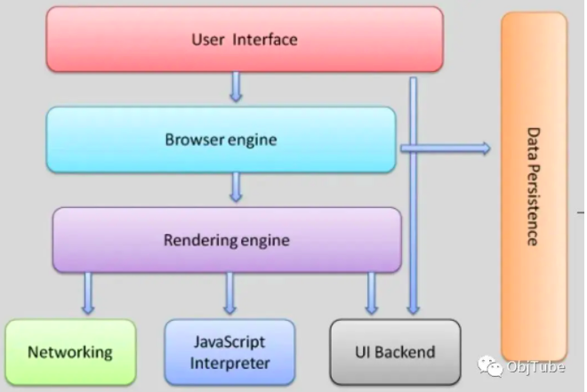
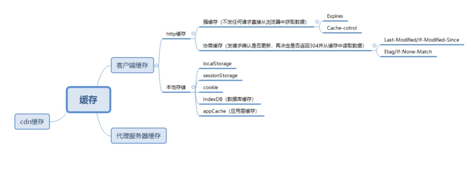
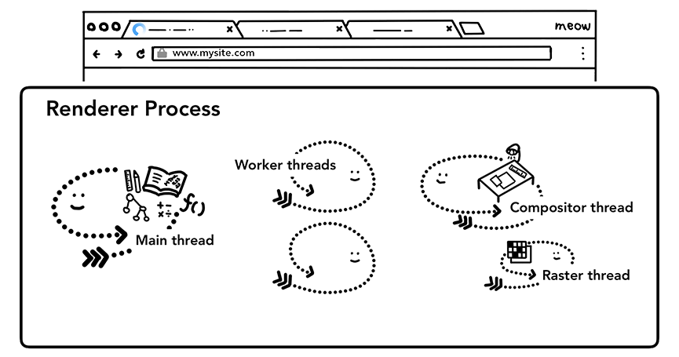

# 浏览器相关

## 进程和线程

1. 进程是什么？

> 进程是操作系统进行资源分配和调度的基本单元，可以申请和拥有计算机资源，进程是程序的基本执行实体。

* 当我们启动某个程序时，就会创建至少一个进程来执行任务代码，同时会为该进程分配内存空间，该应用程序的状态都保存在该内存空间里。
* 当应用关闭时，该内存空间就会被回收。
* 进程可以启动更多的进程来执行任务。
* 由于每个进程分配的内存空间是独立的，如果两个进程间需要传递某些数据，则需要通过进程间通信管道IPC来传递。

2. 线程是什么？

> 线程是操作系统能够进行运算调度的最小单位，一个进程中可以并发多个线程，每条线程并行执行不同的任务。

* 线程是由进程划分的更细的任务
* 线程是在某一个时间直接占据CPU的最小单位
* 同一个进程下的线程可以直接通信共享数据
* 对进程来说，线程是并发执行的，但对线程来说，线程是并行执行的（在单核CPU的情况下）

3. 两者的区别和联系？

* 线程是由进程划分的更细的任务
* 对进程来说，线程是并发执行的，但对线程来说，线程是并行执行的（在单核CPU的情况下）
* 同一个进程下的线程可以直接通信共享数据，但不同进程要共享资源就要通过IPC

## 浏览器的结构

### 浏览器的整体框架



* 用户界面:展示除了展示每个标签页内容以外的用户界面内容
* 浏览器引擎：在用户界面和渲染引擎之间传递数据
* 数据存储持久层：保存cookie,localStorage等本地数据
* 渲染引擎：是整个浏览器的运行核心，下面有很多小的功能模块
  * 网络模块：负责网络请求
  * js解释器：解析和执行js
  * 等等。。。

### 浏览器的多进程结构

#### 早期浏览器结构

早期浏览器是单进程结构，这带来三个问题：

1. 线程间相互影响导致不稳定：如js执行线程卡死=》一个页面卡死=〉所有页面都卡死
2. 不安全：线程间共享数据导致js可以随意访问所有数据
3. 销量低：一个进程负责的事情太多导致资源的管理混乱，效率低下

#### 现代浏览器进程结构


1. Browser进程：浏览器的主进程（负责协调、主控），只有一个。作用有

* 负责浏览器界面显示，与用户交互。如前进，后退等
* 负责各个页面的管理，创建和销毁其他进程
* 将Renderer进程得到的内存中的Bitmap，绘制到用户界面上
* 网络资源的管理，下载等
* 对应线程：
  * UI thread：控制浏览器的按钮和网址输入
  * network thread：控制网络请求发送和接受
  * storage thread：控制文件的读取

2. 网络进程：

* 负责网络请求

3. GPU进程：

* 负责图形的渲染

4. 插件进程：

* 运行插件，如Flash,但是并不包括Chrome市场里的扩展

5. **渲染进程**：

* 控制每一个tab中的内容
* 默认是每一个tab就对应一个进程，根据启动chrome时的所选的进程模型决定
  * 在Chromium的官方文档（文档地址：https://www.chromium.org/developers/design-documents/process-models ）上，说明了Chrome一共有四种进程模型。
* 下方有哪些线程？
  * GUI渲染线程（主线程）
    * 负责渲染浏览器界面，解析HTML，CSS，构建DOM树和RenderObject树，布局和绘制等。
    * 当界面需要重绘（Repaint）或由于某种操作引发回流(reflow)时，该线程就会执行
    * 注意，**GUI渲染线程与JS引擎线程是互斥的**，当JS引擎执行时GUI线程会被挂起（相当于被冻结了），GUI更新会被保存在一个队列中**等到JS引擎空闲时**立即被执行。
  * JS引擎线程(单线程)
    * 也称为JS内核，负责处理Javascript脚本程序。（例如常常听到的谷歌浏览器的V8引擎，新版火狐的JaegerMonkey引擎等）
    * JS引擎线程负责解析Javascript脚本，运行代码。
    * JS引擎一直等待着**任务队列**中任务的到来，然后加以处理，一个Tab页（renderer进程）中无论什么时候都只有一个JS线程在运行JS程序
    * 同样注意，**GUI渲染线程与JS引擎线程是互斥的**，所以如果JS执行的时间过长，这样就会造成页面的渲染不连贯，导致页面渲染加载阻塞。
  * 事件触发线程
    * 归属于渲染进程而不是JS引擎，用来控制**事件轮询**（可以理解，JS引擎自己都忙不过来，需要浏览器另开线程协助）
    * 当JS引擎执行代码块如鼠标点击、AJAX异步请求等，会将对应任务添加到事件触发线程中
    * 当对应的事件符合触发条件被触发时，该线程会把事件添加到待处理**任务队列**的队尾，等待JS引擎的处理
    * 注意，由于JS的单线程关系，所以这些待处理队列中的事件都得排队等待JS引擎处理（当JS引擎空闲时才会去执行）
  * 定时触发器线程
    * 定时器setInterval与setTimeout所在线程
    * 浏览器定时计数器并不是由JavaScript引擎计数的,（因为JavaScript引擎是单线程的, 如果任务队列处于阻塞线程状态就会影响记计时的准确）
    * 因此通过单独线程来计时并触发定时（计时完毕后，添加到事件队列中，等待JS引擎空闲后执行）
    * 注意，W3C在HTML标准中规定，规定要求setTimeout中低于4ms的时间间隔算为4ms。
  * 异步http请求线程
    * 用于处理请求[XMLHttpRequest](https://link.jianshu.com?t=http%3A%2F%2Fwww.w3school.com.cn%2Fxml%2Fxml_http.asp)，在连接后是通过浏览器新开一个线程请求。如ajax，是浏览器新开一个http线程
    * 将检测到状态变更（如ajax返回结果）时，如果设置有回调函数，异步线程就产生状态变更事件，将这个回调再放入js引擎线程的事件队列中。再由JavaScript引擎执行。
  * 合成器线程
  * 栅栏线程

## 输入域名后发生了什么？-渲染原理

#### 网络部分（拿到数据之前）


注意：

* 是在传输完成过后才开始渲染，所以如果index.html过大就会导致首屏时间增加

* 首先浏览器进程的UI线程捕捉url的输入，判断是url还是搜索内容
* 然后叫网络线程发送请求，网络线程开始进行DNS解析等等，这个时候**出现加载的图标**
* 如果出现了3开头的重定向响应报头，则网络线程和UI线程交流重新发送请求
* 当request body开始被接受，网络线程就会看这个content-type是否是text/html,如果是的话就把数据交给render进程，如果是别的文件就会把这些数据交给download manager。与此同时，网络线程也会查看这个数据的安全性，使用了safeBrowing,如果安全才会把这个数据给渲染进程。并且，Cross Origin Read Blocking同源检测也会发生在这个阶段。
* 其实当UI线程通知网络线程发送请求的时候，UI线程就会新建一个render进程，如果上一步网络线程检查无误的话这个预备进程在上一步结束后被启用。这样的好处是用户可以少等待一个创建render的时间
* 然后开始commit navigation,这一步UI线程通知已经创建的render进程开始navigation,网络线程也同时向render进程通过IPC管道发送数据。这个时候导航栏的input就被更新，和页面相关的设置也已经显示，历史记录也被更新
* 当渲染进程完成了渲染，就会通知UI进程页面已经加载完成，**这个通知发生在window.onload事件之后**。UI进程拿到这个通知后就关闭加载图标。当然这里的渲染只是指最开始的渲染，不包括后续的js请求等
* 当用户要跳转到其他的页面时分两种情况
  * 用户在input框中输入url,此时UI线程会通知对应的render进程是否要响应beforeunload事件
  * 用户是在js中实现的跳转，比如window.location='www.baidu.com',这个时候渲染进程内部就会处理bedoreunload事件
* 然后UI线程会创建一个新的render进程去应对新的页面，并告诉旧的render结束进程，执行对应的unload事件。

#### 渲染原理(拿到数据之后)

##### 不考虑script标签的影响

如果不考虑script标签的影响，那么就用启动**渲染进程中的GUI渲染线程**对HTML进行解析(parser),对内嵌样式或者是外联样式表也进行解析生成CSSOM

1. HTML=>DOM


* 遇到DOM部分的代码就构建DOM
* 渲染线程中的DOM解析器解析DOM tree
* **DOMContentLoaded事件是在DOM建立好过后触发，是document事件**
* **load事件是当所有的资源包括图片都加载完成后再触发，是window事件**
* 在parsing的过程中主线程发现有其他资源要加载的时候就去请求其他的资源
* 但是有一个preload scanner的优化，即当html被转换为tocken的时候，preload scanner就会找到对应的资源进行提前加载而不是当它生成到DOM或者变成Node的时候再加载

2. CSS => CSSOM


* 遇到CSS的内嵌样式部分就直接构建CSSOM
* 如果是link标签的就要先交给网络进程进行加载，然后再进行解析成CSSOM
* 由渲染线程中的CSS解析器负责
* **和DOM解析器平行运行，即CSS解析器解析CSS并不会阻碍DOM的建立**


3. CSSOM和DOM结合进行CSS计算

* 同样由渲染线程来进行，将DOM和CSSOM进行结合，计算每一个节点的样式
* 注意就算没有写样式，浏览器也有自己定义的样式，这一步的操作就是完善所有节点的样式
* CSS匹配HTML元素是一个相当复杂和有性能问题的事情。所以，DOM树要小，CSS尽量用id和class，千万不要过渡层叠下去。否则会返回去找父结点查看是否匹配

4. layout 

* 这是最复杂的一个步骤，需要把加上CSS信息的DOM转换为layout tree，计算出每个节点的位置信息
* 这个layout tree只会带有会被显示出来的节点，比如display:none不会在layout tree中，或者通过伪类添加的元素也会在这个tree中


4. Painting(绘制)

* 主线程即渲染线程会遍历**layout tree**（不是layer tree）生成一个绘制顺序的记录,这个纪录中也带有位置，颜色等信息


5. Compositing(合成)

* compositing是什么？

  * 就是先把一个页面的不同部分进行分层，然后对每层进行分别的杉格化，最后交给合成线程进行合成。如果滑动页面，只需要合成线程把已经杉格化好的层进行合成生成新的一帧就好了。

* 怎么分层？

  * 为了找到不同的元素属于哪一个层，主线程会遍历layout tree去创建一个layer tree（**注意是在paint之前生成layer tree**）如果浏览器没有把一个应该被分层的元素分层，可以用will-change CSS属性进行定义。但是该属性不能使用太多次，否则浏览器会在合成的时候具有太大的压力，导致性能问题
  * 这个层就是层叠上下文的层，可以通过生成一个层叠上下文的方式来改变元素的层叠顺序
  * paint和分层的关系就是分层会影响paint的顺序，但是分层只是实现杉格化的手段，和paint的结果并不是一定相关的
    * 

* Raster and composite off of the main thread

  * **当layer tree被创建，paint的顺序也被确定**，这两个东西就会被交给合成器线程，合成器线程会把每一层的页面分成很多个小块(tiles)并把每个小块交给对应的多个栅格化线程，然后杉格化线程把杉格化好的结果存储在GPU内存中。
    * 
  * 合成器线程还会给不同的杉格化线程不同的优先级，让视口中的部分优先工作。
  * 就算是一层的也有多个分tile的方式，有多个杉格化的结果，这些结果对应不同的分辨率
  * 当tile被杉格化之后，每个tile被杉格化的结果的相关信息被存在一个叫做Draw quads的东西里面。每一个draw quads都对应了每一个tile被杉格化之后的结果，其中存储了其在GPU中的内存位置和在页面中的位置。
  * 合成器线程就是把这些draw quads合并成对应的**compositor frame**，这是一个代表了页面的一帧的draw quads集合。
  * 这个**compositor frame**随后被发送给浏览器进程，和浏览器线程中的UI线程产生的**compositor frame**或者其他的render进程中产生的**compositor frame**一起被浏览器进程发送给到GPU进行页面的渲染。

  

  * 由于transform属性是compositing属性，并不需要经过layout paint阶段，不用经过大量的计算，也不用与js发生冲突，所以是一种性能最优的实现动画的方式。

##### 考虑script标签的影响

* 当主线程在把tocken构建为DOM的过程中，遇到script标签会执行去执行js句或者去请求js脚本文件待加载完后再执行
* 这是为了避免JS对DOM有操作导致在JS执行之前的DOM生成无效
* 在js的资源加载和解析执行的过程中会阻塞渲染线程，而渲染线程负责整个渲染过程，所以DOM和CSSOM的解析，渲染树的生成以及回流重绘都会被阻塞
* 可以使用async和defer属性去缓解js的阻塞带来的不良影响
  * async是并行请求请求到了就马上执行，不管请求的顺序
  * defer会延迟到最后执行且按照请求的先后顺序执行
    
  


##### 实例分析

```html
// html
<!DOCTYPE html>
<html>
<head>
	<title>js阻塞</title>
</head>
<body>
	<div id="wrapper">
		<script defer src='./script1.js'></script>
		<p id='p1'>line1</p>
		<!-- <link rel='stylesheet' href="./style.css"> -->
		<script async src='./script2.js'></script>
		<p id='p2'>line2</p>
		<script src='./script3.js'></script>
		<p id='p3'>line3</p>
		<script src='./script4.js'></script>
		<p id='p4'>line4</p>
		<script src='./script5.js'></script>
		<p id='p5'>line5</p>
	</div>
</body>
</html>

//js
alert('script1');
console.log('script1',document.getElementById('wrapper').childNodes);
```

* script标签的执行顺序取决于每个标签加载的时间
* 每个元素渲染的顺序取决于GUI渲染线程能不能在script标签结束运行后把已经构建好的render tree交给GPU进行渲染
* **但是可以确定的是在script3执行完之前line3 4 5都肯定没有办法被加载，并且在scipt3以及之前的标签都已经被解析进入了DOM tree,只是还没有被渲染到页面上而已**
* 并且浏览器的渲染并不会等到所有的资源或者是css加载完了过后才继续，是有一套内部的规则让一些已经解析好了的DOM或者是CSSOM先呈现出来。

##### 回流重绘

当网页生成的时候，至少会渲染一次。在用户访问的过程中，还会不断重新渲染。

* 回流:当style中的关于元素的位置，大小等有关定位的属性发生改变后就会**马上**重新触发样式计算，layout tree的生成,paint的过程以及layer tree的生成。**这个时候渲染线程会排除js的执行重新抢占主线程。js只有等待回流重绘完成才会继续**
* 重绘:当元素的改变不会影响布局的时候，比如background-color等属性，就只会触发样式计算和paint的过程。这个过程同样也是**渲染线程渲染线程会排除js的执行重新抢占主线程。js只有等待回流重绘完成才会继续**

* 由于回流重绘的cost非常expensive，在chrome等现代浏览器中对回流重绘的执行顺序做了优化，当js执行了引起回流重绘的方法，**并不会马上让渲染线程运行进行样式计算，layout,paint,layer的过程,而是会把这些变化加入渲染队列**，**等js执行完**再进行样式计算layout,paint,layer的过程。

* 如果想要让渲染队列强行出队提前进行渲染，可以在js中操作特定的属性或者执行特定的方法（详情见下表，通常和元素的位置有关），因为浏览器为了让开发者精确的获取这些属性，就会在获取这些属性之前强制渲染队列出队并清空队列，**渲染队列中的回流操作进行样式计算和layout计算**，**重绘操作只进行样式计算**，使得这些属性的值是精确的。直到js执行完毕过后再进行layer tree的更新和paint以及重新composite。由于js和渲染线程冲突，所以强制回流重绘会让js的执行暂停，直到样式计算和layout完了再继续js的执行，这会使得js的执行变慢。如下图所示。


**回流必定会发生重绘，重绘不一定会引发回流。**回流会经过四个阶段，重绘只会经过两个，所以重绘的消耗要小一些。

但是这两个操作都很expensive，所以要尽量避免。

1. 引起回流的方法总结

任何会改变元素几何信息(元素的位置和尺寸大小)的操作，都会触发回流，

* 添加或者删除可见的DOM元素；
* 元素尺寸改变——边距、填充、边框、宽度和高度
* 内容变化，比如用户在input框中输入文字
* 浏览器窗口尺寸改变——resize事件发生时
* 计算 offsetWidth 和 offsetHeight 属性
* 设置 style 属性的值
  

2. 引起重绘的方法总结


3. 可以强制浏览器清空渲染队列的属性

获取，操作如下的属性执行如下方法都会强制浏览器回流重绘：

**Getting box metrics**

- `elem.offsetLeft`, `elem.offsetTop`, `elem.offsetWidth`, `elem.offsetHeight`, `elem.offsetParent`
- `elem.clientLeft`, `elem.clientTop`, `elem.clientWidth`, `elem.clientHeight`
- `elem.getClientRects()`, `elem.getBoundingClientRect()`

**Scroll stuff**

- `elem.scrollBy()`, `elem.scrollTo()`
- `elem.scrollIntoView()`, `elem.scrollIntoViewIfNeeded()`
- `elem.scrollWidth`, `elem.scrollHeight`
- `elem.scrollLeft`, `elem.scrollTop` also, setting them

**Getting window dimensions**

- `window.scrollX`, `window.scrollY`
- `window.innerHeight`, `window.innerWidth`
- window.visualViewport.height / width / offsetTop / offsetLeft ([source](https://source.chromium.org/chromium/chromium/src/+/master:third_party/blink/renderer/core/frame/visual_viewport.cc;l=435-461;drc=a3c165458e524bdc55db15d2a5714bb9a0c69c70?originalUrl=https:%2F%2Fcs.chromium.org%2F))

**Mouse events: Reading offset data**

- `mouseEvt.layerX`, `mouseEvt.layerY`, `mouseEvt.offsetX`, `mouseEvt.offsetY` ([source](https://source.chromium.org/chromium/chromium/src/+/master:third_party/blink/renderer/core/events/mouse_event.cc;l=476-487;drc=52fd700fb07a43b740d24595d42d8a6a57a43f81))


4. 实例：

```html
//html
<!DOCTYPE html>
<html lang="en">

<head>
    <meta charset="UTF-8">
    <meta name="viewport" content="width=device-width, initial-scale=1.0">
    <title>Document</title>
</head>
<style>
    div {
        width: 10px;
        height: 10px;
        position: absolute;
        top: 0px;
        left: 0px;
        background-color: aquamarine;
    }
</style>

<body>
    <div></div>
</body>
<script defer src="./test.js">
</script>

</html>
```

```js
//test.js
let div = document.getElementsByTagName('div')[0];
div.style.left = 20+'px';
div.style.top = 20+'px';
div.style.width = 20+'px';
div.style.height = 20+'px';
```


* ```js
  //触发一次回流重绘，因为有渲染队列对如下的变化进行缓存
      div.style.left = 20+'px';
      div.style.top = 20+'px';
      div.style.width = 20+'px';
      div.style.height = 20+'px';
  ```


可以看出script标签的defer延迟执行，这个html文件在js执行前先渲染了一次，然后再执行js文件(黄色部分)，由于浏览器的渲染队列所以只在js执行完后重新回流重绘一次(紫色部分)。

* ```js
  //同样触发一次回流重绘,因为在获取offsetLeft的时候渲染队列中并没有任务
  		console.log(div.offsetLeft);
      div.style.left = 20+'px';
      div.style.top = 20+'px';
      div.style.width = 20+'px';
      div.style.height = 20+'px';
  ```


前面解析html的方式并渲染一次和上图类似相似就不截全，主要可以看到仍然只有一次回流重绘

* ```js
  //触发两次，一次是获取offsetLeft时触发，让div.style.left出队
  //另外一次在代码结束后浏览器再出队一次
  div.style.left = 1px;
  console.log(div.offsetLeft);
  div.style.top = 1px;
  div.style.width = 1px;
  div.style.height = 1px;
  ```

  
  可以看到在js(黄色部分)的执行过程中发生了一次样式计算和layout（紫色部分），并且在js执行完成后又发生了一次样式计算和layout
  
* ```js
  //触发四次
  div.style.left = 1px;
  console.log(div.offsetLeft);//=>1次
  div.style.top = 1px;
  console.log(div.offsetLeft);//=>2次
  div.style.width = 1px;
  console.log(div.offsetLeft);//=>3次
  div.style.height = 1px;
  console.log(div.offsetLeft);//=>4次
  ```

  
  可以看到在js执行过程中触发了四次由读取div.offsetLeft触发的回流重绘，四次中第一个小紫块是样式重新计算，第二个小紫块是layout。注意最后一个紫色方块只是update layer tree，绿色是paint。
  
* ```js
  div.style.backgroundColor = 'red';
  console.log(div.offsetLeft);
  div.style.backgroundColor = 'blue';
  console.log(div.offsetLeft);
  div.style.backgroundColor = 'white';
  console.log(div.offsetLeft);
  div.style.backgroundColor = 'black';
  console.log(div.offsetLeft);
  ```

  

  可以看到经历了四次样式计算，并且是在js的执行过程中

* ```js
  //触发1次
  //虽然el.offsetWidth会强制触发回流重绘，但是此时渲染队列为空
  //所以只会等程序运行结束后渲染一次
  el.style.width = (el.offsetWidth + 1) + 'px';
  el.style.width = 1 + 'px'
  ```

5. 如何尽量优化使得减少回流重绘？

* 分离读写操作

```js
//未分离触发4次
div.style.left = 1px;
console.log(div.offsetLeft);//=>1次
div.style.top = 1px;
console.log(div.offsetLeft);//=>2次
div.style.width = 1px;
console.log(div.offsetLeft);//=>3次
div.style.height = 1px;
console.log(div.offsetLeft);//=>4次

//分离触发1次
div.style.left = 1px;
div.style.top = 1px;
div.style.width = 1px;
div.style.height = 1px;
console.log(div.offsetLeft);//=》1次
console.log(div.offsetLeft);
console.log(div.offsetLeft);
console.log(div.offsetLeft);
```

* 样式集中改变
  * 样式不要分开改动，合理的利用渲染队列让多次样式改变只触发一次回流重绘
  * 可以通过修改class类名的方式让样式一次修改到位
* 缓存布局信息

```js
//会触发两次回流重绘
div.style.left = div.offsetLeft + 1 + 'px';
div.style.top = div.offsetTop + 1 + 'px';

//触发一次回流重绘
let offsetLeft = div.offsetLeft;
let offsetTop = div.offsetTop;
div.style.left = offsetLeft + 1 + 'px';
div.style.top = offsetTop + 1 + 'px';
```

* 元素批量操作
  * 利用文档碎片，在新建节点上进行预处理再一次性插入到DOM的方式减少回流重绘的次数

## DOM的操作'贵'在哪里？

1. 贵在js和DOM的通信上

只要js去访问，操作了DOM上的和浏览器的显示相关的属性，就会产生DOM和浏览器交流的开销，体现出来就是js的执行时间变长。

实例：

```js
<!DOCTYPE html>
<html lang="en">

<head>
    <meta charset="UTF-8">
    <meta name="viewport" content="width=device-width, initial-scale=1.0">
    <title>Document</title>
</head>
<style>
</style>

<body>
    <div id='app'>
        123
    </div>
    <script>
    </script>
</body>

</html>
```

* 情况1:

```js
        let now = Date.now();
        let div = document.getElementById('app');
        let obj = {a:1}
        for(let i = 0;i < 10000000;i++){
        }
        console.log(Date.now() - now);//=>10-11
```

* 情况2:

```js
        let now = Date.now();
        let div = document.getElementById('app');
        let obj = {a:1}
        for(let i = 0;i < 10000000;i++){
            obj.a;
        }
        console.log(Date.now() - now);//=>10-12
```

* 情况3:

```js
        let now = Date.now();
        let div = document.getElementById('app');
        let obj = {a:1}
        for(let i = 0;i < 10000000;i++){
            obj.a = i;
        }
        console.log(Date.now() - now);//=>15-20
```

* 情况4:

```js
        let now = Date.now();
        let div = document.getElementById('app');
        let obj = {a:1}
        for(let i = 0;i < 10000000;i++){
            div.a;
        }
        console.log(Date.now() - now);//=>10-12
```

* 情况5:

```js
        let now = Date.now();
        let div = document.getElementById('app');
        let obj = {a:1}
        for(let i = 0;i < 10000000;i++){
            div.textContent;
        }
        console.log(Date.now() - now);//=>676
```

* 情况6:

```js
        let now = Date.now();
        let div = document.getElementById('app');
        let obj = {a:1}
        for(let i = 0;i < 10000000;i++){
            div.textContent = i;
        }
        console.log(Date.now() - now);//=>10261
```

情况6的performance:


* 总结：
  * 情况5，6和情况4的对比可以说明对DOM上代表了浏览器内容的属性打交道会增加js的执行时间
  * 情况5，6对比说明操作DOM上代表了浏览器内容的属性会有更大的cost
  * 情况6的performance说明了这种cost并不是由于回流重绘引起的而是和DOM交流本身的cost

2. 贵在js可能引起的回流重绘上

js在访问操作一些DOM属性时会直接引发回流重绘，引起整个操作的时间变慢。详情见渲染原理-回流重绘。

## 浏览器渲染优化总结

* 减少http请求：大部分浏览器只能最大支持6个并发的请求，多的就要等待，所以要减少请求数量
  * CSS内嵌
* 减少阻塞
  * js放尾部或者采用async或者defer
  * CSS放首部
  * js使用defer或async
* 减少回流和重绘
  * 使用 transform 替代 top
  * 使用 visibility 替换 display: none ，因为前者只会引起重绘，后者会引发回流（改变了布局）
  * 不要把节点的属性值放在一个循环里当成循环里的变量。
  * 可以把CSS语句打包最后一次更新
  * 不要使用 table 布局，可能很小的一个小改动会造成整个 table 的重新布局
  * 动画实现的速度的选择，动画速度越快，回流次数越多，也可以选择使用 requestAnimationFrame
  * CSS 选择符从右往左匹配查找，避免节点层级过多
  * 将频繁重绘或者回流的节点设置为图层，图层能够阻止该节点的渲染行为影响别的节点。比如对于 video 标签来说，浏览器会自动将该节点变为图层。
  * 使用VUE
  * 分离读写操作
  * 􏱞样式集中改变
  * 缓存布局信息
  * 元素批量修改
  * 牺牲平滑度换取速度
* 如果在一次动画执行完了之后一个JS文件开始运行并持续时间比较长，这个js文件就会一直占用主线程，就会使得动画卡顿
  * 可以使用equestAnimationFrame，在每一帧任务结束后再执行回调函数
  * css中有个动画属性叫transform，通过该属性实现的动画，不会经过布局和绘制，而是直接运行在Compositor和rasterizing线程中，所以不会受到主线程中js执行的影响。更重要的是transform的动画，由于不需要经过布局绘制样式计算，所以节省了很多运算时间。可以让复杂的动画更加流畅。

## 浏览器的缓存管理

#### 浏览器缓存的分类


本地存储解决方案：

 * 服务器存储
   * 数据库
   * Redis
   * session
 * 客户端本地存储
   * 访问客户端本地存储的信息，**受‘浏览器’（IE存储的谷歌访问不了），‘源’（百度下存储的信息京东获取不了）的限制**（存储在本地，物理磁盘中跟的某一个位置，但是是加密的）
   * 本地存储的信息都是明文的，所以需要严格保密的信息都要慎重存在本地（要加密）
   * cookie
   * H5中的webStorage
     * localStorage
     * SessionStorage
   * 本地数据库存储
     * webSql
     * IndexedDB

#### HTTP缓存

简单来说，浏览器缓存就是把一个已经请求过的Web资源（如html，图片，js）拷贝一份副本储存在浏览器中。缓存会根据进来的请求保存输出内容的副本。当下一个请求来到的时候，如果是相同的URL，缓存会根据缓存机制决定是直接使用副本响应访问请求，还是向源服务器再次发送请求（当然还有304的情况）。

**缓存是根据url来处理的，只要url不一样就是新的资源。**

##### 强缓存

1. 理解

* 不会向服务器发送请求，直接从缓存中读取资源
* 请求返回200的状态码
* 在chrome控制台的network选项中可以看到size显示from disk cache或from memory cache
  	* from memory cache代表使用内存中的缓存
  	* from disk cache则代表使用的是硬盘中的缓存
  	* 浏览器读取缓存的顺序为memory –> disk
  	* 在浏览器中，浏览器会在js和图片等文件解析执行后直接存入内存缓存中，那么当刷新页面时只需直接从内存缓存中读取(from memory cache)；而css文件则会存入硬盘文件中，所以每次渲染页面都需要从硬盘读取缓存(from disk cache)

 

2. http中的具体实现
   

客户端可以在HTTP请求中使用的标准 Cache-Control 指令:

* max-age=<\seconds>
  * The maximum amount of time a resource is considered fresh. Unlike Expires, this directive is relative to the time of the request.多少秒后过期
* max-stale[=<\seconds>]
  * Indicates the client will accept a stale response. An optional value in seconds indicates the upper limit of staleness the client will accept.
* min-fresh=<\seconds>
  * Indicates the client wants a response that will still be fresh for at least the specified number of seconds.
* no-cache 
  * 每次用之前都要请求校验一下
* no-store 
  * 不缓存
* no-transform 
  * No transformations or conversions should be made to the resource. The Content-Encoding, Content-Range, Content-Type headers must not be modified by a proxy.
* only-if-cached 
  * 如果缓存服务器有缓存该资源，则返回，不需要确认有效性。否则返回504网关超时

服务器可以在响应中使用的标准 Cache-Control 指令:

* must-revalidate 
  * 缓存资源未过期，则返回，否则代理要向源服务器再次验证即将返回的响应缓存是否有效，如果连接不到源服务器，则返回504网关超时
* no-cache 
  * 同上
* no-store 
  * 同上
* no-transform 
  * 同上
* public 
  * 代理服务器等都可以缓存
* private 
  * 只有客户端缓存
* proxy-revalidate 
  * 所有缓存服务器在客户端请求返回响应之前，再次向源服务器验证缓存有效性
* max-age=<\seconds> 
  * 同上
* s-maxage=<\seconds> 
  * Overrides max-age or the Expires header, but only for shared caches (e.g., proxies). Ignored by private caches.

**实例：**


**Expires和Cache-Control两者对比**：Expires 是http1.0的产物，Cache-Control是http1.1的产物，两者同时存在的话，**Cache-Control优先级高于Expires**


##### 协商缓存

**理解**
协商缓存就是强制缓存失效后，浏览器携带缓存标识向服务器发起请求，由服务器根据缓存标识决定是否使用缓存的过程
协商缓存生效，返回304和Not Modified

 **http的实现**

1. Last-Modified和If-Modified-Since
   浏览器在第一次访问资源时，服务器返回资源的同时，在response header中添加 Last-Modified的header，值是这个资源在服务器上的最后修改时间，浏览器接收后缓存文件和header；
   浏览器下一次请求这个资源，浏览器检测到有 Last-Modified这个header，于是添加If-Modified-Since这个header，值就是Last-Modified中的值；服务器再次收到这个资源请求，会根据 If-Modified-Since 中的值与服务器中这个资源的最后修改时间对比，如果没有变化，返回304和空的响应体，直接从缓存读取，如果If-Modified-Since的时间小于服务器中这个资源的最后修改时间，说明文件有更新，于是返回新的资源文件和200

2. ETag和If-None-Match
   Etag是上一次加载资源时，服务器返回的response header，是对该资源的一种唯一标识，只要资源有变化，Etag就会重新生成。浏览器在下一次加载资源向服务器发送请求时，会将上一次返回的Etag值放到request header里的If-None-Match里，服务器只需要比较客户端传来的If-None-Match跟自己服务器上该资源的ETag是否一致，就能很好地判断资源相对客户端而言是否被修改过了。如果服务器发现ETag匹配不上，那么直接以常规GET 200回包形式将新的资源（当然也包括了新的ETag）发给客户端；如果ETag是一致的，则直接返回304知会客户端直接使用本地缓存即可。

3. 协商缓存两种方式的对比

* 精确度上，Etag要优于Last-Modified，Last-Modified的时间单位是秒，如果某个文件在1秒内改变了多次，那么他们的Last-Modified其实并没有体现出来修改，但是Etag每次都会改变确保了精度；如果是负载均衡的服务器，各个服务器生成的Last-Modified也有可能不一致。
* 性能上，Etag要逊于Last-Modified，毕竟Last-Modified只需要记录时间，而Etag需要服务器通过算法来计算出一个hash值。
* 优先级上，服务器校验优先考虑Etag

##### Http缓存的缓存机制


#### 本地存储

##### cookie

Cookie主要是由服务器生成，且前端也可以通过document.cookie设置，保存在客户端本地的一个文件，通过response响应头的set-Cookie字段进行设置，且Cookie的内容自动在同源请求的时候被传递给服务器。如下：

Reponse:


Request:


**Cookie包含的信息：**

它可以记录你的用户ID、密码、浏览过的网页、停留的时间等信息。当你再次来到该网站时，网站通过读取Cookies，得知你的相关信息，就可以做出相应的动作，如在页面显示欢迎你的标语，或者让你不用输入ID、密码就直接登录等等。一个网站只能读取它自己放置的信息，不能读取其他网站的Cookie文件。因此，Cookie文件还保存了host属性，即网站的域名或ip。
这些属性以名值对的方式进行保存，为了安全，它的内容大多进行了加密处理。

**Cookie的优点：**

* 给用户更人性化的使用体验，如记住“密码功能”、老用户登录欢迎语
* 弥补了HTTP无连接特性
* 站点统计访问人数的一个依据

**Cookie的缺点：**

* 它无法解决多人共用一台电脑的问题，带来了不安全因素
* Cookie文件容易被误删除
* 一人使用多台电脑
* Cookies欺骗。修改host文件，可以非法访问目标站点的Cookie
* 容量有限制，不能超过4kb
* 在请求头上带着数据安全性差

##### Local Storage

localStorage主要是前端开发人员，在前端设置，一旦数据保存在本地后，就可以避免再向服务器请求数据，因此减少不必要的数据请求，减少数据在浏览器和服务器间不必要地来回传递。

**可以长期存储数据，没有时间限制**，一天，一年，两年甚至更长，数据都可以使用。
localStorage中一般浏览器支持的是5M大小，这个在不同的浏览器中localStorage会有所不同

优点：

* localStorage拓展了cookie的4k限制
* localStorage可以将第一次请求的5M大小数据直接存储到本地，相比于cookie可以节约带宽
* localStorage的使用也是遵循同源策略的，所以不同的网站直接是不能共用相同localStorage

缺点：

* 需要手动删除，否则长期存在
* 浏览器大小不一，版本的支持也不一样
* localStorage只支持string类型的存储，JSON对象需要转换
* localStorage本质上是对字符串的读取，如果存储内容多的话会消耗内存空间，会导致页面变卡


##### SessionStorage

sessionStorage主要是前端开发人员，在前端设置，sessionStorage（会话存储），只有在浏览器被关闭之前使用，创建另一个页面时同意可以使用，关闭浏览器之后数据就会消失

存储上限限制：不同的浏览器存储的上限也不一样，但大多数浏览器把上限限制在5MB以下

##### websql

Web SQL 是在浏览器上模拟数据库，可以使用JS来操作SQL完成对数据的读写。它使用 SQL 来操纵客户端数据库的 API，这些 API 是异步的，规范中使用的方言是SQLlite。数据库还是在服务端，不建议使用，已废弃

##### indexDB

随着浏览器的功能不断增强，越来越多的网站开始考虑，将大量数据储存在客户端，这样可以减少从服务器获取数据，直接从本地获取数据。

现有的浏览器数据储存方案，都不适合储存大量数据：Cookie 的大小不超过4KB，且每次请求都会发送回服务器；LocalStorage 在 2.5MB 到 10MB 之间（各家浏览器不同），而且不提供搜索功能，不能建立自定义的索引。所以，需要一种新的解决方案，这就是 IndexedDB 诞生的背景。

通俗地说，IndexedDB 就是浏览器提供的本地数据库，它可以被网页脚本创建和操作。IndexedDB 允许储存大量数据，提供查找接口，还能建立索引。这些都是 LocalStorage 所不具备的。就数据库类型而言，IndexedDB 不属于关系型数据库（不支持 SQL 查询语句），更接近 NoSQL 数据库。

#### 注意点

##### Cookie,LocalSession,SessionStorage的区别对比

1. Cookie对比localSession

* cookie兼容大部分浏览器（包括IE6），localStorage是H5中新增的API，不兼容低版本浏览器，例如（IE678），在考虑兼容的情况下只用COOKIE
* 本地存储的cookie信息在发送AJAX请求的时候会在请求头中自动携带并传递给服务器（Cookie）虽然是本地存储，但是会在服务器和客户端传来传去），
  但是localStorage是不会这样传递的
* cookie有大小存储的限制，比localStorage小很多，一般同一个源下，
  cookie只能存储4kb,localStorage可以存储5MB(所以存储一些代码信息或者一些s数据信息，我们应该使用localStorage)
* cookie不稳定，会被一些特殊情况给干掉，cookie本身是有生命周期的，比如：使用360安全卫士或者浏览器本身自带的清理历史记录的功能清理电脑时，就会把cookie干掉，但是到目前为止，这些工具都清除不掉localStorage,localStorage是持久化的存储在客户端，除非手动清除，没有生命周期的限制
* cookie可能会被禁用（例如浏览器的无痕浏览模式）

2. LocalSession对比SessionStorage

* localstorage是持久存储到本地，然而sessionStorage是会话存储，也就是：页面关掉（刷新不算），当前存储的SessionStorage就会被清除

#####  Cookie和Session的区别和联系

* Session的概念：
  * 为了解决http无状态的问题，要用某种机制记录用户的状态，即判断是谁和服务器发送请求报文而产生的一种会话的抽象概念

* Cookie的概念：
  * 确实存在的一个存储在浏览器端的一个字段，会在http的头部发送给服务器，服务器也可以用set-Cookie字段对Cookie进行修改，当然前端也可以自己改

* Session和Cookie的联系：
 * 为了实现Session,后端服务器会对每一个发送请求的用户建立开辟一个存储记录的空间，并且每一条记录有一个唯一标示Session id,服务器会把这个Session id放在set-cookie里面发回给客户端，从而记录下来这个Session id到cookie中。客户端以后再发送请求就要带着这个存在cookie中的字段发给服务器，从而识别用户的身份
 * session 的运行依赖 session id，而 session id 是存在 cookie 中的，也就是说，如果浏览器禁用了 cookie ，同时 session 也会失效（但是可以通过其它方式实现，比如在 url 中传递 session_id）

* 注意：
  * 不只是登陆要用到session和session id，就算没有登陆也会用一个对应用户的Session来存放用户信息，如:不登录 x 宝或者 x 东，加入物品进购物车。然后关闭页面。再开页面进去，登录，你会发现东西都在你登录后的购物车里。这就是未登录的 session ID


#### CDN 缓存

当服务接入了 CDN 之后，浏览器本地缓存的资源过期之后，浏览器不是直接向源服务器请求资源，而是转而向 CDN 边缘节点请求资源。CDN 边缘节点中将用户的数据缓存起来，如果 CDN 中的缓存也过期了，CDN 边缘节点会向源服务器发出回源请求，从而来获取最新资源。
https://juejin.im/post/5cdb7e29e51d453a572aa2f1

## 前端的页面优化方式

#### 1. 从网络传输的角度看

##### 资源数量相同减少http请求次数

应该做好单次http请求的请求资源数量和http请求次数的tradeOff，使得不会过多次的请求小型文件。

可以用到的策略有：

- 合并压缩代码，比如使用webpack
- 代码比较少的情况下，尽可能使用内嵌式

- 雪碧图或者图片BASE64

##### 优先只加载必须的资源

优先只加载在首屏中用户会看到的或者是一些内容强相关的资源

可以用到的策略有：

- 对于动态获取的图片，采用图片懒加载
- 数据也可以做异步分批加载：开始只请求加载第一屏的数据，滑动到第几屏在加载这一屏的数据和图片
- 骨架屏技术（首屏内容由服务器渲染；再或者开始展示占位结构，客户端在单独获取数据渲染；）
- 音视频取消预加载（播放的时候再去加载音视频文件，对于自动播放采取延迟播放的处理，先打开页面再加载音视频）

##### 用更少的数据量传递相同的信息

* 服务器采用GZIP压缩
* 采用http2.0的头部压缩
* 在客户端和服务器端进行信息交互的时候，对于多项数据我们尽可能基于JSON格式来进行传送（JSON格式的数据处理方便，资源偏小）
* 尽可能实现JS的封装（低耦合高内聚），减少页面中的冗余代码

##### 使用更好的网络传输机制

- **数据或者是资源文件**进行缓存，包括强缓存协商缓存
- 数据放在cookie,localStorage,SessionStorage中进行存储
- DNS预获取
- CDN区域分布式服务器开发部署（费钱  效果会非常的好）
- 使用http2.0实现长连接和多工，服务器推送的机制

#### 2.从浏览器运行的角度来看

* 加快DOM的解析和渲染
  * 尽量减少CSS表达式的使用(expression)
  * 在CSS导入的时候不要嵌套太深的@import导入式，因为会阻碍DOM的渲染
  * CSS放首部，JS放尾部
  * 基于SCRIPT调取JS的时候，可已使用 defer或者async 来异步加载
* 减少回流重绘
  * 使用 transform 替代 top
  * 使用CSS实现动画的特效
  * 使用 visibility 替换 display: none ，因为前者只会引起重绘，后者会引发回流（改变了布局）
  * 样式集中改变
  * 读写分离
  * 缓存布局信息
  * 元素批量修改
  * 使用VUE等对DOM的渲染操作做了优化的框架
  * 将频繁重绘或者回流的节点设置为图层，图层能够阻止该节点的渲染行为影响别的节点。比如对于 video 标签来说，浏览器会自动将该节点变为图层。
* 使JS的代码执行逻辑更加合理
  * 在JS中尽量减少闭包的使用（内存优化）
  * 减少递归的使用，避免死递归，避免由于递归导致的栈内存嵌套


## Inside look at modern web browser1-4阅读笔记

### part1

1. CPU


任务进来过后一个接一个的处理，一个core(一次处理一个任务)，现在的浏览器大多是多核。

2. GPU

与CPU的区别多core同时处理一个任务，但是任务要比较简单。


3. 进程

* 操作系统打开一个application就会分配一个内存空间给这个进程
* 这个进程可以创建别的线程来帮助它完成子任务，也可以要求操作系统分配一个内存给别的进程来帮助它完成任务。
* 但是进程间的通信需要使用IPC来进行。进程和进程之间互不影响，这保证了进程的独立性

3. 线程

* 进程创建处理子任务的是线程
* 同一个进程中的线程通信由于都在同一个内存中可以直接通信

4. 浏览器架构

* chrome架构

  * 

  * | Process and What it controls |                                                              |
    | :--------------------------- | ------------------------------------------------------------ |
    | Browser                      | Controls "chrome" part of the application including address bar, bookmarks, back and forward buttons. Also handles the invisible, privileged parts of a web browser such as network requests and file access. |
    | Renderer                     | Controls anything inside of the tab where a website is displayed. |
    | Plugin                       | Controls any plugins used by the website, for example, flash. |
    | GPU                          | Handles GPU tasks in isolation from other processes. It is separated into different process because GPUs handles requests from multiple apps and draw them in the same surface. |

    还有 Extension process and utility processes等，可以通过任务管理器查看

5. 浏览器多进程的好处

* 避免一个页面进程卡死，所有的页面进程都卡死的情况发生
* 安全：防止进程对所有文件的修改，对有不同功能的进程给予不同的权限

6. 节约内存

由于每一个进程都要分配到进程所需的基本环境到对应的内存中，所以进程越多，重复拷贝的基本环境所占的空间也越多，不能让进程过多。Chrome会检查用户的硬件条件从而决定要不要开启这么多的进程，如果硬件条件不足就会合并进程。无论是渲染进程还是浏览器进程等。

7. Per-frame renderer processes

不仅一个tab一个进程，一个页面中的frame也会被单独分配一个进程


### part2

这个part回答了在输入url呈现页面后浏览器进程中的UI线程和网络线程与render进程的关系

* 首先浏览器进程的UI线程捕捉url的输入，判断是url还是搜索内容
* 然后叫网络线程发送请求，网络线程开始进行DNS解析等等，这个时候出现加载的图标
* 如果出现了3开头的重定向响应报头，则网络线程和UI线程交流重新发送请求
* 当request body开始被接受，网络线程就会看这个content-type是否是text/html,如果是的话就把数据交给render进程，如果是别的文件就会把这些数据交给download manager。与此同时，网络线程也会查看这个数据的安全性，使用了safeBrowing,如果安全才会把这个数据给渲染进程。并且，Cross Origin Read Blocking同源检测也会发生在这个阶段。
* 其实当UI线程通知网络线程发送请求的时候，UI线程就会新建一个render进程，如果上一步网络线程检查无误的话这个预备进程在上一步结束后被启用。这样的好处是用户可以少等待一个创建render的时间
* 然后开始commit navigation,这一步UI线程通知已经创建的render进程开始navigation,网络线程也同时向render进程通过IPC管道发送数据。这个时候导航栏的input就被更新，和页面相关的设置也已经显示，历史记录也被更新
* 当渲染进程完成了渲染，就会通知UI进程页面已经加载完成，这个通知发生在window.onload事件之后。UI进程拿到这个通知后就关闭加载图标。当然这里的渲染只是指最开始的渲染，不包括后续的js请求等
* 当用户要跳转到其他的页面时分两种情况
  * 用户在input框中输入url,此时UI线程会通知对应的render进程是否要响应beforeunload事件
  * 用户是在js中实现的跳转，比如window.location='www.baidu.com',这个时候渲染进程内部就会处理bedoreunload事件
* 然后UI线程会创建一个新的render进程去应对新的页面，并告诉旧的render结束进程，执行对应的unload事件。

###  part3

这个part解决了render进程内部对于html的渲染过程

1. render进程干什么，组成？



2. Parsing html

* Construction of a DOM

  * 将html转换为DOM，数据=》字符串=〉tocken=>node=>DOM

* Subresource loading

  * 在parsing的过程中主线程发现有其他资源要加载的时候就去请求其他的资源
  * 但是有一个preload scanner的优化，即当html被转换为tocken的时候，preload scanner就会找到对应的资源进行提前加载而不是当它生成到DOM或者变成Node的时候再加载
  * js阻塞解析

* Hint to browser how you want to load resources

  * 提示浏览器怎么解析资源，比如async await这种

* Style计算

  * 解析CSS文件后，把CSS文件上的样式加到DOM节点中，让每一个节点都有其对应的样式
  * 注意就算没有写样式，浏览器也有自己定义的样式，这一步的操作就是完善所有节点的样式

* layout

  * 这是最复杂的一个步骤，需要把加上CSS信息的DOM转换为layout tree，计算出每个节点的位置信息
  * 这个layout tree只会带有会被显示出来的节点，比如display:none不会在layout tree中，或者通过伪类添加的元素也会在这个tree中

* paint

  * 主线程即渲染线程会遍历layout tree生成一个绘制顺序的记录,这个纪录中也带有位置，颜色等信息
  * 注意如果你更改了style，就会重新经过style计算，layout,paint这三个步骤重新渲染出页面，这是非常消耗性能的。
  * 

* 动画优化

  * 

    

    

3. Compositing

* compositing是什么？
  * 就是先把一个页面的不同部分进行分层，然后对每层进行分别的杉格化，最后交给合成线程进行合成。如果滑动页面，只需要合成线程把已经杉格化好的层进行合成生成新的一帧就好了。
* 怎么分层？
  * 为了找到不同的元素属于哪一个层，主线程会遍历layout tree去创建一个layer tree,如果浏览器没有把一个应该被分层的元素分层，可以用will-change CSS属性进行定义。但是该属性不能使用太多次，否则浏览器会在合成的时候具有太大的压力，导致性能问题
  * 这个层就是层叠上下文的层，可以通过生成一个层叠上下文的方式来改变元素的层叠顺序
  * paint和分层的关系就是分层会影响paint的顺序，但是分层只是实现杉格化的手段，和paint的结果并不是一定相关的
    * 
* Raster and composite off of the main thread
  * 当layer tree被创建，paint的顺序也被确定，这两个东西就会被交给合成器线程，合成器线程会把每一层的页面分成很多个小块(tiles)并把每个小块交给对应的多个栅格化线程，然后杉格化线程把杉格化好的结果存储在GPU内存中。
    * 
  * 合成器线程还给给不同的杉格化线程不同的优先级，让视口中的部分优先工作。
  * 就算是一层的也有多个tiling的结果对应不同的分辨率
  * 当tile被杉格化之后，每个tile被杉格化的结果的相关信息被存在一个叫做Draw quads的东西里面。每一个draw quads都对应了每一个tile被杉格化之后的结果，其中存储了其在GPU中的内存位置和在页面中的位置。
  * 合成器线程就是把这些draw quads合并成对应的**compositor frame**，这是一个代表了页面的一帧的draw quads集合。
  * 这个**compositor frame**随后被发送给浏览器进程，和浏览器线程中的UI线程产生的**compositor frame**或者其他的render进程中产生的**compositor frame**一起被浏览器进程发送给到GPU进行页面的渲染。
  * 由于transform属性是compositing属性，并不需要经过layout paint阶段，不用经过大量的计算，也不用与js发生冲突，所以是一种性能最优的实现动画的方式。

### part4

这个part解决input事件和compositor的关系

1. 从浏览器的角度理解事件

   浏览器进程发现用户触发的事件，并且可以得到事件触发在屏幕和页面上的位置。浏览器进程会把这个事件类型和位置传给渲染进程，渲染进程会找到事件target并执行对应的event listeners。

   

2. non-fast scrollable region

合成器线程在合成页面的时候把绑定了event handler的区域标记为了Non-Fast Scrollable Region。当一个事件发生，浏览器把事件类型和发生位置传给渲染进程的合成器线程，合成器线程判断是否是Non-Fast Scrollable Region触发的事件，如果不是的话就直接生成新的compositor frame，如果是的话就要等待js的执行结果再进行合成。

3. 事件代理的副作用

由于采用了事件代理，导致了很大的页面都成为了Non-Fast Scrollable Region,每一个事件都会先被合成线程告诉主线程，主线程再去查看有没有对应的handle执行，如果没有的话再进行合成更新页面。这样就会增大合成器线程和主线程的沟通成本。


这个副作用可以用如下的方式解决：
```js
document.body.addEventListener('touchstart', event => {
    if (event.target === area) {
        event.preventDefault()
    }
 }, {passive: true});
```

开启passive:true就是告诉合成器线程虽然也要把对应事件告诉主线程，但是不必在等主线程的返回结果，这样就不会卡顿。这样也有副作用就是如果要渲染出事件的结果，这样就会有bug.

4. Finding the event target

合成器线程通知主线程，即渲染线程后，主线程会去做一个hit test去找到event target，这个hit test使用了paint的记录，比对浏览器进程传过来的坐标，从而找到是哪一个元素是event target.

5. Minimizing event dispatches to the main thread


一些连续事件比如wheel`, `mousewheel`, `mousemove`, `pointermove`, `touchmove这种浏览器会合并事件的发生并且把对应的listener用requestAnimationFrame的方式在每一帧之前执行从而不影响每一帧的呈现。

## 一些待解决的问题

1. 实例分析中每个P出现的随机性没有办法解释，script2执行的顺序也没有办法太好的解释。
2. 即栅格化，渲染的过程还不是很清楚，这对解决上一个问题应该比较有帮助

## 之后可以参考的材料

《Inside look at modern web browser1-4》https://developers.google.com/web/updates/2018/09/inside-browser-part1

《How Browsers Work》 https://www.html5rocks.com/en/tutorials/internals/howbrowserswork

《Process Models》https://www.chromium.org/developers/design-documents/process-models

《High Performance Animations》https://www.html5rocks.com/en/tutorials/speed/high-performance-animations/

《webkit技术内幕》朱永盛著(这是本书)