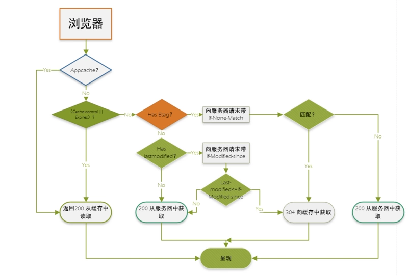

# 浏览器面试问题

### 浏览器的渲染过程？

渲染进程拿到数据=》DOM建立/CSSOM建立=〉style computation => layout => layer => paint => compose合成

### 浏览器的缓存机制？

首先我们可以把浏览器的缓存分为两类：

* http资源相关的缓存
* 浏览器的本地信息存储

先说http资源相关的缓存

1. http资源相关缓存

* 强缓存
  
  * 指不往服务器发送请求直接获取的缓存，返回状态200，在http中由expires或者是catch-control进行控制
  
* 协商缓存
  
  * 指要往服务器发送请求验证缓存是否过期的缓存，若没有更新返回304，在http中由etag/if-none-match, last-modified/if-modified-since决定
  
* 整个缓存过程？

  

2. 浏览器的本地存储

* cookie
  * Set-cookie响应字段设置，cookie字段发送
  * 前端可以在document.cookie设置
* localStorage
* sessionStorage
* indexDB

* 一些区别总结
  * localStorage对比cookie
  * LocalStorage对比SessionStorage
  * Cookie和Session的区别和联系

### 渲染的优化方式有哪些？

#### 1. 从网络传输的角度看

**资源数量相同减少http请求次数**

应该做好单次http请求的请求资源数量和http请求次数的tradeOff，使得不会过多次的请求小型文件。

可以用到的策略有：

- 合并压缩代码，比如使用webpack
- 代码比较少的情况下，尽可能使用内嵌式

- 雪碧图(把很多小图拼接成一张大图)或者图片BASE64

**优先只加载必须的资源**

优先只加载在首屏中用户会看到的或者是一些内容强相关的资源

可以用到的策略有：

- 对于动态获取的图片，采用图片懒加载
- 数据也可以做异步分批加载：开始只请求加载第一屏的数据，滑动到第几屏在加载这一屏的数据和图片
- 骨架屏技术（首屏内容由服务器渲染；再或者开始展示占位结构，客户端在单独获取数据渲染；）
- 音视频取消预加载（播放的时候再去加载音视频文件，对于自动播放采取延迟播放的处理，先打开页面再加载音视频）

**用更少的数据量传递相同的信息**

* 服务器采用GZIP压缩
* 采用http2.0的头部压缩
* 在客户端和服务器端进行信息交互的时候，对于多项数据我们尽可能基于JSON格式来进行传送（JSON格式的数据处理方便，资源偏小）
* 尽可能实现JS的封装（低耦合高内聚），减少页面中的冗余代码

**使用更好的网络传输机制**

- **数据或者是资源文件**进行缓存，包括强缓存协商缓存

- 数据放在cookie,localStorage,SessionStorage中进行存储

- DNS预处理（在html解析到要加载的url之前通过写在前面的<link>标签告诉浏览器后面要用到这个url,先进行DNS解析等到加载到的时候就可以直接用）

  - https://developer.mozilla.org/zh-CN/docs/Web/HTTP/Headers/X-DNS-Prefetch-Control

- CDN区域分布式服务器开发部署（费钱  效果会非常的好

  - CDN 缓存

    当服务接入了 CDN 之后，浏览器本地缓存的资源过期之后，浏览器不是直接向源服务器请求资源，而是转而向 CDN 边缘节点请求资源。CDN 边缘节点中将用户的数据缓存起来，如果 CDN 中的缓存也过期了，CDN 边缘节点会向源服务器发出回源请求，从而来获取最新资源。
    https://juejin.im/post/5cdb7e29e51d453a572aa2f1

- 使用http2.0实现长连接和多工，服务器推送的机制

#### 2.从浏览器运行的角度来看

* 加快DOM的解析和渲染
  * 尽量减少CSS表达式的使用(expression)
  * 在CSS导入的时候不要嵌套太深的@import导入式，因为会阻碍DOM的渲染
  * CSS放首部，JS放尾部
  * 基于SCRIPT调取JS的时候，可已使用 defer或者async 来异步加载
* 减少回流重绘
  * 使用 transform 替代 top
  * 使用CSS实现动画的特效
  * 使用 visibility 替换 display: none ，因为前者只会引起重绘，后者会引发回流（改变了布局）
  * 样式集中改变
  * 读写分离
  * 缓存布局信息
  * 元素批量修改
  * 使用VUE等对DOM的渲染操作做了优化的框架？
  * 将频繁重绘或者回流的节点设置为图层，图层能够阻止该节点的渲染行为影响别的节点。比如对于 video 标签来说，浏览器会自动将该节点变为图层。？
* 使JS的代码执行逻辑更加合理
  * 在JS中尽量减少闭包的使用（内存优化）
  * 减少递归的使用，避免死递归，避免由于递归导致的栈内存嵌套