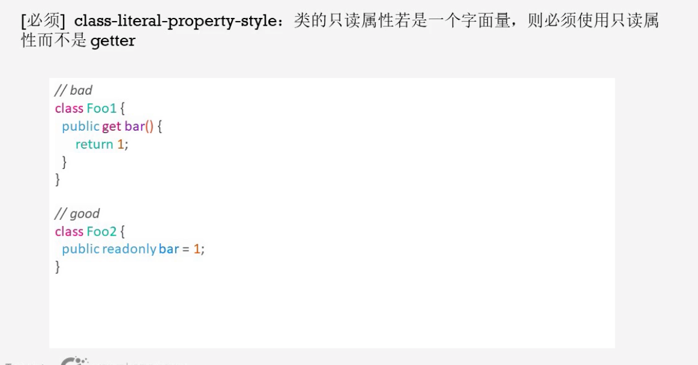

# 代码规范

## 腾讯js代码规范

### 代码规范背景

### 代码规范介绍

使用airBnb作为代码规范

### 命名规则

文件名全小写可以避免不同系统对于大小写造成的误解

### 重点规则

1.

ASI算法：js去判断;号的算法

但是会有如上的问题

2.

3. 

4.

5. 

6.

7.

8. 

9.

10.

b,c被挂在根结点上，这就会导致内存泄漏的问题。

11.

12.

13.

注意tab和space的缩进是不一样的，如果有些人用tab有些人用space就会产生代码缩进的不一致。

14.

避免出错，并且使得代码的改动尽量小

### 配套工具

### 自动检查

## 腾讯ts代码规范

### 规范介绍

### 重点规则

1. 

2.

3.

4.

5.

6.

7.

8.

### 配套工具

