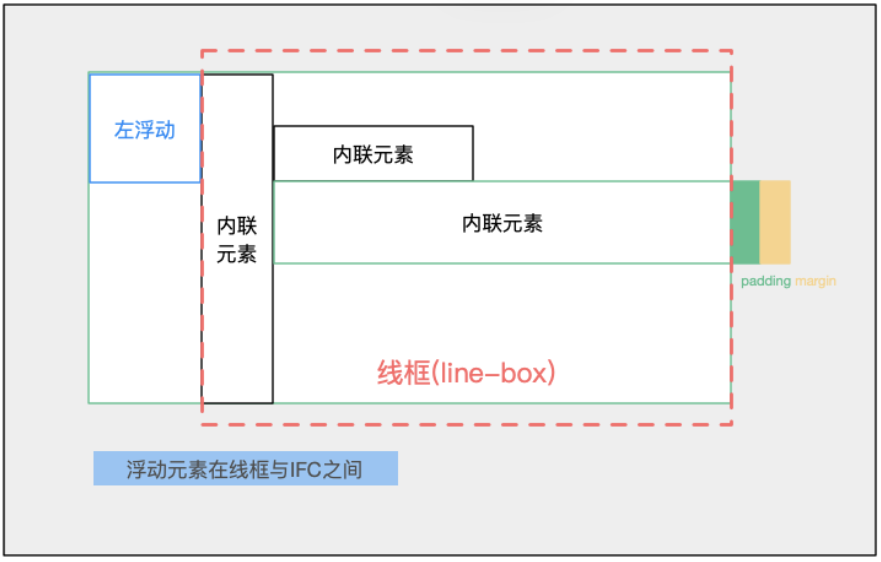
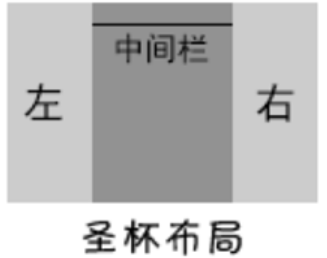

# CSS知识总结

## CSS笔记思维导图部分


## CSS选择器

大纲目录:

- 众多高级选择器技术核心  
- 选择器的权重和优先级
- 选择器的命名规范 
 

### 1. 众多高级选择器技术核心  

> https://developer.mozilla.org/zh-CN/docs/Web/Guide/CSS/Getting_Started/Selectors
>
> http://css.cuishifeng.cn/


#### 1-1. 基本选择器

| **选择器**          | **类型**   | **功能描述**                                         |
| ------------------- | ---------- | ---------------------------------------------------- |
| *                   | 通配选择器 | 选择文档中所有HTML元素                               |
| E                   | 元素选择器 | 选择指定类型的HTML元素                               |
| #id                 | ID选择器   | 选择指定ID属性值为“id”的任意类型元素                 |
| .class              | 类选择器   | 选择指定class属性值为“class”的任意类型的任意多个元素 |
| selector1,selectorN | 群组选择器 | 将每一个选择器匹配的元素集合并                       |
| Selector1Selector2  |            | 选择既满足selector1又满足selector2的元素             |

#### 1-2. 层次(关系)选择器

| **选择器** | **类型**                 | **功能描述**                                          |
| ---------- | ------------------------ | ----------------------------------------------------- |
| E  F       | 后代选择器（包含选择器） | 选择匹配的F元素，且匹配的F元素被包含在匹配的E元素内   |
| E>F        | 子选择器                 | 选择匹配的F元素，且匹配的F元素所匹配的E元素的子元素   |
| E+F        | 相邻兄弟选择器           | 选择匹配的F元素，且匹配的F元素紧位于匹配的E元素的后面 |
| E~F        | 通用选择器               | 选择匹配的F元素，且位于匹配的E元素后的所有匹配的F元素 |

#### 1-3. 动态伪类选择器

| **选择器** | **类型**       | **功能描述**                                                 |
| ---------- | -------------- | ------------------------------------------------------------ |
| E:link     | 链接伪类选择器 | 选择匹配的E元素，而且匹配元素被定义了超链接并未被访问过。常用于链接描点上 |
| E:visited  | 链接伪类选择器 | 选择匹配的E元素，而且匹配元素被定义了超链接并已被访问过。常用于链接描点上 |
| E:active   | 用户行为选择器 | 选择匹配的E元素，且匹配元素被激活。常用于链接描点和按钮上    |
| E:hover    | 用户行为选择器 | 选择匹配的E元素，且用户鼠标停留在元素E上。IE6及以下浏览器仅支持a:hover |
| E:focus    | 用户行为选择器 | 选择匹配的E元素，而且匹配元素获取焦点                        |
注意：

* 使用的时候应该按照love(link visited)   hate (hover active)的顺序从上到下依次书写

#### 1-4. 目标伪类选择器

| **选择器** | **功能描述**                                 |
| ---------- | -------------------------------------------- |
| E:target   | 选择匹配E的所有元素，且匹配元素被相关URL指向 |

#### 1-5. UI元素状态伪类选择器

| **选择器** | **类型**             | **功能描述**                           |
| ---------- | -------------------- | -------------------------------------- |
| E:checked  | 选中状态伪类选择器   | 匹配选中的复选按钮或者单选按钮表单元素 |
| E:enabled  | 启用状态伪类选择器   | 匹配所有启用的表单元素                 |
| E:disabled | 不可用状态伪类选择器 | 匹配所有禁用的表单元素                 |

#### 1-6. 结构伪类选择器

| **选择器**            | **功能描述**                                                 |
| --------------------- | ------------------------------------------------------------ |
| E:first-child         | 作为父元素的第一个子元素的元素E。与E:nth-child(1)等同        |
| E:last-child          | 作为父元素的最后一个子元素的元素E。与E:nth-last-child(1)等同 |
| E:root                | 选择匹配元素E所在文档的根元素。在HTML文档中，根元素始终是html，此时该选择器与html类型选择器匹配的内容相同 |
| E F:nth-child(n)      | 选择父元素E的第n个子元素F。其中n可以是整数（1，2，3）、关键字（even，odd）、可以是公式（2n+1）,而且n值起始值为1，而不是0. |
| E F:nth-last-child(n) | 选择父元素E的倒数第n个子元素F。此选择器与E:nth-child(n)选择器计算顺序刚好相反，但使用方法都是一样的，其中：nth-last-child(1)始终匹配最后一个元素，与last-child等同 |
| E:nth-of-type(n)      | 选择父元素内具有指定类型的第n个E元素                         |
| E:nth-last-of-type(n) | 选择父元素内具有指定类型的倒数第n个E元素                     |
| E:first-of-type       | 选择父元素内具有指定类型的第一个E元素，与E:nth-of-type(1)等同 |
| E:last-of-type        | 选择父元素内具有指定类型的最后一个E元素，与E:nth-last-of-type(1)等同 |
| E:only-child          | 选择父元素只包含一个子元素，且该子元素匹配E元素              |
| E:only-of-type        | 选择父元素只包含一个同类型子元素，且该子元素匹配E元素        |
| E:empty               | 选择没有子元素的元素，而且该元素也不包含任何文本节点         |

**E:nth-of-type(n)和E F:nth-child(n)的区别：**

* nth-child(n)   用所有的孩子进行排序， nth-of-type(n) 只在相同type的内部进行排序

#### 1-7. 否定伪类选择器

| **选择器** | **功能描述**             |
| ---------- | ------------------------ |
| E:not(F)   | 匹配所有除元素F外的E元素 |

#### 1-8. 伪元素选择器

| **选择器**     | **功能描述**                                                 |
| -------------- | ------------------------------------------------------------ |
| ::first-letter | 设置对象内的第一个字符的样式                                 |
| ::first-line   | 设置对象内的第一行的样式                                     |
| ::before       | 设置在对象前（依据对象树的逻辑结构）发生的内容。用来和content属性一起使用，并且必须定义content属性 |
| ::after        | 设置在对象后（依据对象树的逻辑结构）发生的内容。用来和content属性一起使用，并且必须定义content属性 |
| ::placeholder  | 设置对象文字占位符的样式                                     |
| ::selection    | 设置对象被选择时的样式,::selection只能定义被选择时的[background-color](http://caibaojian.com/css3/properties/background/background-color.htm)及[color](http://caibaojian.com/css3/properties/color/color.htm)。 |
```css
/* 封装一个代码片段 - 清浮动  -  reset.min.css
.clearfix{
}
*/
.clearfix::after{
  content: '';
  display: block;
  clear: both;
}
```
#### 1-9. 属性选择器

https://www.zhangxinxu.com/wordpress/2016/08/regular-expression-in-css-selector/

正则表达式字符含义: 

- 字符`^`表示字符串开始位置匹配；
- 字符`$`表示字符串结束位置匹配；
- 字符`*`表示字符串任意位置匹配；
- 字符`i`表示字符串匹配不区分大小写；
- 字符`g`表示字符串全局匹配；


CSS属性选择器版本: 

- CSS2.1属性选择器：

- - 直接匹配： [attr]、[attr="val"]、[attr~="val"]、[attr|="val"];

- CSS3属性选择器:

- - 正则匹配：[attr^='val'], [attr$='val'],  [attr*='val'],

- CSS4属性选择器

- - 忽略大小写匹配： [attr='val' i]

| **选择器**              | **功能描述**                                                 |
| ----------------------- | ------------------------------------------------------------ |
| [*attribute*]           | 用于选取带有指定属性的元素。                                 |
| [*attribute*=*value*]   | 用于选取带有指定属性和值的元素。                             |
| [*attribute*~=*value*]  | 用于选取属性值中包含指定词汇的元素。                         |
| [*attribute*\|=*value*] | 用于选取带有以指定值开头的属性值的元素，该值必须是整个单词。 |
| [*attribute*^=*value*]  | 选择匹配元素E，且E元素定义了属性attr，其属性值以val开头的任何字符串。 |
| [*attribute*$=*value*]  | 选择匹配元素E，且E元素定义了属性attr，其属性值以val结束的任何字符串。 |
| [*attribute**=*value*]  | 选择匹配元素E，且E元素定义了属性attr，其属性值任意位置包含了val。 |

**CSS属性选择器分解**

>
> 
>
> [attr="val"]：
>
> - 元素的属性名是"attr",值必须是'val'  
>
> - \<div attr="val">\</div>        对
>
> - \<div attr="text val">\</div>    错
>
> - \<div attr="value">\</div>      错   
>
> - \<div attr="val-ue">\</div>     错
>
> 
>
> [attr~="val"]：
>
> - "attr"值需含有单词"val"
> - \<div attr="val">\</div>        对
> - \<div attr="text val">\</div>    对
> - \<div attr="value">\</div>      错
> - \<div attr="val-ue">\</div>     错
>
> 
>
> [attr|="bar"] ：
>
> - "attr" 属性值开头必须是bar的单词，或者开头是bar-
> - \<div attr="bar">\</div>       对
> - \<div attr="bar-val">\</div>     对 
> - \<div attr="barval">\</div>     错   
> - \<div attr="bar val">\</div>     错
>
> 
>
> [attr^='val'] : 
>
> - 属性值开头三个字符需要是val
> - \<div attr="val">\</div>        对
> - \<div attr="text  val">\</div>    错
> - \<div attr="value">\</div>      对
> - \<div attr="val-ue">\</div>     对
>
> 
>
> [attr$='val'] ：
>
> - 属性值最后三个字符需要是val
> - \<div attr="val">\</div>        对
> - \<div attr="text  val">\</div>    对
> - \<div attr="value">\</div>      错
> - \<div attr="val-ue">\</div>     错
>
> 
>
> [attr*='val']：
>
> - 属性值任意位置包含val这三个字符就可以
>
> - \<div attr="val">\</div>        对
>
> - \<div attr="text  val">\</div>    对
>
> - \<div attr="value">\</div>      对
>
> - \<div attr="val-ue">\</div>     对
>
> 
>
> [attr*='val' i]：
>
> - 就和正则表达式中的作i用一样，忽略大小写
>
> - \<div attr="VAL">\</div>       对
>
> - \<div attr="Text  val">\</div>    对
>
> - \<div attr="Value">\</div>      对
>
> - \<div attr="Val-ue">\</div>     对

兼容性:

- 目前Chrome, FireFox, Safari已支持`i`正则，但是，IE惊喜过后又打回了原形，包括到IE14都还没支持不区分大小写; 估计很快，实际项目中就可以应用此特性了。


**AMCSS开发模式简介**

https://www.zhangxinxu.com/wordpress/2018/03/amcss-attribute-modules-css/

https://css-tricks.com/methods-organize-css/


AMCSS的官网:

- AMCSS有专门的介绍网站：http://amcss.github.io/
- 优点: 每个属性有效地声明一个单独的命名空间，用于封装样式信息，从而产生更易于阅读和维护的HTML和CSS; 

```
// 目前主流类名选择器:通过多个类名进行控制
.button {...}
.button-large {...}
.button-blue {...}

// AMCSS则是基于属性控制
[am-button] {...}
[am-button~="large"] {...}
[am-button~="blue"] {...}
```

> 使用案例1:  Bootstrap Buttons

```
<style>
.btn{ /* Default button styles */ }
.btn-primary{ /* Primary colours */ }
.btn-large{ /* Large sizing */ }

[am-Button] { /* Default button styles */ }
[am-Button~="primary"] { /* Primary colours */ }
[am-Button~="large"] { /* Large sizing */ }
</style>  

// Large primary button 
<a class="btn btn-primary btn-lg">Large primary button</a>
<a am-Button="primary large">Large primary button</a>

// Default button 
<a class="btn btn-default">Default button</a>
<a am-Button>Default button</a>

// Small info button 
<a class="btn btn-info btn-sm">Small info button</a>
<a am-Button="info small">Small info button</a>

// Extra-small danger button
<a class="btn btn-danger btn-xs">Extra-small danger button</a>
<a am-Button="danger extra-small">Extra-small danger button</a>
```

> 使用案例2:  Flexbox Grid

```
<div class="row reverse">
  <div class="column-12--hand column-8--lap">
    <div class="box">Responsive</div>
  </div>
</div>

<div am-Grid-Row="reverse">
  <div am-Grid-Col="12 lap:8">
    <div am-Demo="box">Responsive</div>
  </div>
</div>
```

> 使用案例3:  Traits

```
<div class="u-posAbsoluteCenter">
  <div class="u-textTruncate u-textCenter">
    Very centered text.
  </div>
</div>

<div am-position="absolute center">
  <div am-text="truncate center">
    Very centered text.
  </div>
</div>
```

**全面解读伪类和伪元素**

> https://developer.mozilla.org/en-US/docs/Learn/CSS/Building_blocks/Selectors/Pseudo-classes_and_pseudo-elements
>
> 伪类：
>
> - 用于当已有元素处于的某个状态时，为其添加对应的样式，这个状态是根据用户行为而动态变化的。比如说，当用户悬停在指定的元素时，我们可以通过:hover来描述这个元素的状态。虽然它和普通的css类相似，可以为已有的元素添加样式，但是它只有处于dom树无法描述的状态下才能为元素添加样式，所以将其称为伪类。
> - 伪类存在的意义是为了通过选择器，格式化DOM树以外的信息以及不能被常规CSS选择器获取到的信息。
>
> 
>
> 伪元素：
>
> - 用于创建一些不在文档树中的元素，并为其添加样式。比如说，我们可以通过:before来在一个元素前增加一些文本，并为这些文本添加样式。虽然用户可以看到这些文本，但是这些文本实际上不在文档树中。
> - 伪元素可以创建一些文档语言无法创建的虚拟元素。比如：文档语言没有一种机制可以描述元素内容的第一个字母或第一行，但伪元素可以做到(::first-letter、::first-line)。同时，伪元素还可以创建源文档不存在的内容，比如使用 ::before 或  ::after
>
> 
>
> 区别：
>
> 伪类的操作对象是文档树中已有的元素，而伪元素则创建了一个文档数外的元素。因此，伪类与伪元素的区别在于：有没有创建一个文档树之外的元素
>
> - 伪类本质上是为了弥补常规CSS选择器的不足，以便获取到更多信息；
> - 伪元素本质上是创建了一个有内容的虚拟容器；
> - CSS3中伪类和伪元素的语法不同；
> - 在CSS3中，已经明确规定了伪类用一个冒号来表示，而伪元素则用两个冒号来表示。
> - 可以同时使用多个伪类，而只能同时使用一个伪元素；


### 2. 择器的权重和优先级

#### 2-1. CSS三大特性

- 继承性
- 优先级
- 层叠性

#### 2-2. 选择器的权值大小

- 0级(0)：通配选择器（*）、选择符（+、>、~、空格、||）
- 1级(1)：元素、关系、伪元素
- 2级(10)：类选择器、属性选择器、伪类
- 3级(100)：ID选择器
- 4级(1000)：style内联选择器
- 5级(10000)：!important

#### 2-3. 选择器优先级的等级


#### 2-4. 优先级的计算规则 

> - 权重顺序 !important>行内样式>id选择器>类选择器>标签选择器>通配符>继承>浏览器默认
> - !important 优先级最高
> - 元素属性 优先级高
> - 相同权重 后写的生效

```html
<ul class="shopping-list" id="awesome">
      <li><span>Milk</span></li>
      <li class="favorite" id="must-buy"><span class="highlight">Sausage</span></li>
</ul>

// 情况一：Blue(蓝色)
这是一个很基础的试题，考的就是选择器的权重问题，上面两个选择器都是标签选择器，按照选择器的权重等级之分，
他们都是“０，０，０，１”。但同一个元素有两个或多个冲突的属性声明，那么有最高特殊性的声明就会胜出。
如果同一个元素具有相同的权重，处在后面的样式就会比前面的声明重
ul {color:red;}
li {color:blue;}

// 情况二：Blue(蓝色)
在选择器权重当中，一个ID的权重是“0,1,0,0”，而一个标签元素是0,0,0,1。
针对这个示例来说，前一个选择器权重是”0,0,0,2″；后者的权重是“0,1,0,0”。因此，在这里他的颜色是蓝色。
ul li {color: red;/*0,0,0,2*/}
#must-buy{color: blue;/*0,1,0,0*/}

// 情况三：Blue(蓝色)
.shopping-list .favorite {color: red;/*0,0,2,0*/}
#must-buy {color: blue;/*0,1,0,0*/}

// 情况四：Blue(蓝色)
ul#awesome {color: red;/*0,1,0,1*/}
ul.shopping-list li.favorite span {color: blue;/*0,0,2,3*/}

// 情况五：Blue(蓝色)
ul#awesome #must-buy {color: red;/*0,2,0,1*/}
.favorite span {color: blue!important;/*1,0,0,1,1*/}

// 情况六：Blue(蓝色)
ul.shopping-list li .highlight {color: red;/*0,0,2,2*/}
ul.shopping-list li .highlight:nth-of-type(odd){color: blue;/*0,0,3,2*/}

// 情况七：Red(红色)
// 注意此处#awesome算作一个id选择器，所以算下来权重更高，即选择器的权重计算是只要出现了就算
#awesome .favorite:not(#awesome) .highlight {color: red;/*0,2,2,0*/}
#awesome .highlight:nth-of-type(1):nth-last-of-type(1) {color: blue;/*0,1,3,0*/}

对于选择器中给定的各个ID属性值，加“0,1,0,0”。
对于选择器中给定的各个类属性值，属性选择或伪类，加”0,0,1,0″。
对于选择器中给定的各个元素为伪元素，加“0,0,0,1”。
结合符和通配符“*”以及”:not()”没有任何的加分权。
对于行内样式，加为“1,0,0,0”
对于”!important”加分高于上面的一切，将变成“1,0,0,0,0”
```

### 3. 选择器的命名规范

#### 3-1. 骆驼命名法

> 第一个字母要小写，后面的词的第一个字母就要用大写，例如: studentInfo、navMenuRedButton

#### 3-2. 帕斯卡命名法

> 这种命名法同样也是大小写字母混编而成，和骆驼命名法很像，但和骆驼命名法有一点区别，就是所有单词的首字母都要大写，当然也包括第一个单词；例如: StudentInfo、NavMenuRedButton

#### 3-3. 匈牙利命名法

> 在名称前面加上一个或多个小写字母作为前缀，来让名称更加好认，更容易理解，例如: head_navigation、
>
> red_navMenuButton；

页面模块的常用命名:

| 头：header            | 导航：nav        | 菜单：menu      | 友情链接：friendlink |
| --------------------- | ---------------- | --------------- | -------------------- |
| 页面外围包裹：wrapper | 子导航：subnav   | 子菜单：submenu | 下载：download       |
| 页面主体：main        | 广告：banner     | 侧栏：sidebar   | 小技巧：tips         |
| 内容：content         | 标志：logo       | 栏目：column    | 滚动：scroll         |
| 页脚：footer          | 搜索：search     | 热点：hot       | 上一个：prev         |
| 版权：copyright       | 登录条：loginbar | 新闻：news      | 下一个：next         |

#### 3-4. BEM命名法

> 案例参考:  https://y.qq.com/n/yqq/song/0022O8fw36UsfQ.html?ADTAG=h5_playsong&no_redirect=1
>
> BEM的意思就是块（block）、元素（element）、修饰符（modifier）,是由Yandex团队提出的一种前端命名方法论。这种巧妙的命名方法让你的CSS类对其他开发者来说更加透明而且更有意义。BEM命名约定更加严格，而且包含更多的信息，它们用于一个团队开发一个耗时的大项目。
>
> - BEM：块（block）、元素（element）、修饰符（modifier）
> - block 代表了更高级别的抽象或组件。
> - block__element 代表.block的后代，用于形成一个完整的.block的整体。
> - block--modifier代表.block的不同状态或不同版本，用于修饰。

```html
air-table{} /* 块 */  
air-table__footer{} /* 元素 */  
air-table--full{} /* 修饰符 */  

// vue组件下使用
<template>
    // wrapper主要用于sass嵌套，以免父（子）组件里的css冲突
    <div class="air-table(组件名)-wrapper">  
        <el-table class="air-table"></el-table>
        <div class="air-table__footer air-table__footer--full">
              <button class="air-table__footer--prev">上</button>
            <button class="air-table__footer--next">下</button>
        </div>
    </div>
</template>
<style lang="scss" scoped>
.air-table(组件名)-wrapper {
    .air-table {}
    .air-table__footer {
        .air-table__footer—prev {}

        .air-table__footer—bext {}

        &.air-table__footer--full {}
    }
}
</style>
```


## CSS工作原理及使用规则

> 大纲目录:
>
> - CSS布局模型
> - BFC的原理和功能
> - IFC的原理和功能
> - 定位和层叠上下文

### 1. CSS布局模型

#### 1-1. 流动模型(Flow）

> 含义：
>
> - 流动(Flow）是默认的网页布局模式。也就是说网页在默认状态下的 HTML 网页元素都是根据流动模型来分布网页内容的。
>
> 特征: 
>
> - 块状元素都会在所处的包含元素内自上而下按顺序垂直延伸分布，因为在默认状态下，块状元素的宽度都为100%。实际上，块状元素都会以行的形式占据位置。
> - 在流动模型下，内联元素都会在所处的包含元素内从左到右水平分布显示（内联元素可不像块状元素这么霸道独占一行）

#### 1-2. 浮动模型(Float）

> - 通过css的float属性可以将元素设置为浮动元素。元素浮动之后不再占据原来的位置，它们会尽可能的往包裹它们的父元素的左边框或右边框靠，并会在它们元素所处位置的下面产生浮动流，影响下面的元素定位。
> - 浮动元素并没有完全脱离文档流，它只是从包裹它的盒子中浮动起来并尽可能远的往左侧或者右侧进行移动。
> - 浮动设计的初衷是为了实现文字在图片周围的环绕效果。

#### 1-3. 层模型(Layer）

> 含义：
>
> - 层布局模型就像是图像软件PhotoShop中非常流行的图层编辑功能一样，每个图层能够精确定位操作，但在网页设计领域，由于网页大小的活动性，层布局没能受到热捧。但是在网页上局部使用层布局还是有其方便之处的
>
> 层模型有三种形式：
>
> - 相对定位（position: relative)
> - 绝对定位（position: absolute）
> - 固定定位（position: fixed）

### 2. BFC的原理和功能

> 其实BFC是上面三种布局方式中的普通流，BFC会产生一个独立的容器，该容器内部的元素不会在布局上影响到外部的元素，在外部的普通流看来它和其他普通流元素无差别，文档最终会按照上面说的普通流计算布局。
>
> https://developer.mozilla.org/zh-CN/docs/Web/Guide/CSS/Block_formatting_context


#### 2-1.BFC的含义

> - MDN的定义:  块格式化上下文（Block Formatting Context，BFC） 是Web页面的可视化CSS渲染的一部分，是块盒子的布局过程发生的区域，也是浮动元素与其他元素交互的区域。
> - BFC(block formatting context)块级格式化上下文，它是页面中的一块渲染区域，并且有一套属于自己的渲染规则，它决定了元素如何对齐内容进行布局，以及与其他元素的关系和相互作用。 当涉及到可视化布局的时候，BFC提供了一个环境，HTML元素在这个环境中按照一定规则进行布局；
> - 具有BFC特性的元素可以看做是隔离了的独立容器，容器里面的元素不会在布局上影响到外面的元素，并且BFC具有普通容器所没有的的一些特性。
> - BFC是一个独立的布局环境，BFC内部的元素布局与外部互不影响。

#### 2-2.BFC的布局规则

> - 内部的盒子会在垂直方向，一个个地放置；
> - 盒子垂直方向的距离由margin决定，属于同一个BFC的两个相邻Box的上下margin会发生重叠；
> - 每个元素的左边，与包含的盒子的左边相接触，即使存在浮动也是如此；
> - BFC的区域不会与float box重叠；
> - BFC就是页面上的一个隔离的独立容器，容器里面的子元素不会影响到外面的元素，反之也如此；
> - 计算BFC的高度时，浮动元素也参与计算；

#### 2-3.触发BFC的条件

> 只要元素满足下面任一条件即可触发BFC特性：
>
> - html根元素或其他包含它的元素；
> - float的属性不为none；
> - overflow为auto、scroll、hidden；
> - display为inline-block，table-cell，table-caption中的任何一个；
> - position为absolute或fixed；
>
> 

#### 2-4.BFC的实战用处 

> 案例一: 让浮动内容和周围的内容等高
>
> - overflow:auto 创建一个会包含这个浮动的 BFC，通常的做法是设置父元素 overflow: auto 或者设置其他的非默认的 overflow: visible 的值。overflow: auto 或者设置其他的非默认的 overflow: visible 的值。
> - 使用display: flow-root; 一个新的 display 属性的值，它可以创建无副作用的 BFC。在父级块中使用 display: flow-root 可以创建新的 BFC。
>
> 
>
> 案例二:  外边距折叠
>
> - 原因: Box垂直方向的距离由margin决定。属于同一个BFC的两个相邻Box的margin会发生重叠
> - 解决方法: 给上box或者下box任意一个包裹新的box并开启BFC
> - 原理: BFC就是页面上的一个隔离的独立容器，容器里面的子元素不会影响到外面的元素，反之也如此；
>
> 
>
> 案例三:  清除浮动
>
> - 解决方法: 给父元素开启BFC
> - 原理: 计算BFC的高度时，浮动子元素也参与计算
>
> 
>
> 案例四:  自适应的两列布局(左图右文)
>
> - 解决方法: 给父元素开启BFC
> - 原理: BFC的区域不会与float box重叠；

### 3. IFC的原理和功能

> 存在块级格式化上下文BFC，则对应存在内联格式化上下文IFC、网格格式化上下文GFC、自适应格式化上下文FFC，这些都可以统称为格式化上下文;



#### 3-1.IFC的含义

> - IFC(inline Formatting Context）叫做“内联格式化上下”
> - 内部的元素从包含块的顶部开始，从左至右(默认)排列成一行形成的一个矩形盒子叫做line box；

#### 3-2.IFC的布局规则

> - 盒子是水平一个接一个的排列，水平的margin，内边距，边框是可以有的。
> - 垂直方向的对齐，可能是底部对齐，顶部对齐，也可能是基线对齐（这个是默认的）
> - 行框中的内联盒子的高度小于行框的高度时，内联盒子的垂直方向的对齐方式取决于vertical-align属性。
> - 当一个行框水平不能容纳内联盒子时，他们将会在垂直方向上产生多个行框，他们上下一个挨着一个，但是不会重叠。
> - 一般来说，行框的左边界紧挨着包含容器的左边界，行框的右边界紧挨着包含容器的右边界，（是两个边都紧挨着）。然而，浮动盒子可能存在于包含边框边界和行框边界之间。
> - 多个内联盒子的宽度小于包含他们的行框时，他们在水平方向的分布取决于text-align属性。

#### 3-3.IFC的实战用处 

> - 水平居中：当一个块要在环境中水平居中时候，设置其为inline-block则会在外层产生IFC，通过text-align:center则可以使其水平居中。
> - 不定尺寸图片的垂直居中：创建一个IFC，用其中一个元素撑开父元素的高度，然后设置其vertical-align:middle,其他行内元素则可以在此父元素下垂直居中
>   - 理解font-size、line-height、vertical-align
>
> https://www.zhangxinxu.com/wordpress/2015/08/css-deep-understand-vertical-align-and-line-height/
>
> https://www.cnblogs.com/10yearsmanong/p/13084706.html
>
> 
>
> * 图片下面默认的留白:
>   * 让vertical-align失效-图片设置display或者浮动、绝对定位
>   * 使用其他vertical-align值(bottom/middle/top)
>   * 直接修改line-height值
>   * line-height为相对单位，font-size间接控制，所以可以修改font-size为0进行控制

#### 3-4 line-height属性和display的关系


对于display为inline的元素来说满足如上图所示的规律。virtual-area 和 content-area 高度的差异叫做 leading。leading 的一半会被加到 content-area 顶部，另一半会被加到底部。因此 content-area 总是处于 virtual-area 的中间。

计算出来的 line-height（也就是 virtual-area 的高度）可以等于、大于或小于 content-area。如果 virtual-area 小于 content-area，那么 leading 就是负的，因此 line-box 看起来就比内容还矮了。

还有一些其他种类的内联元素：

- 可替换的内联元素，如 img / input / svg 等
- inline-block 元素，以及所有 display 值以 inline- 开头的元素，如 inline-table / inline-flex
- 处于某种特殊格式化上下文的内联元素，例如 flexbox 元素中的子元素都处于 [flex formatting context（弹性格式化上下文）](http://www.w3.org/TR/css-flexbox-1/#flex-items)中，这些子元素的 display 值都是「blockified」

这类内联元素，其高度是基于 height、margin，padding,border 属性。如果你将其 height 设置为 auto 的话，那么其高度的取值就是 line-height，其 content-area 的取值也是 line-height。

### 4. 定位和层叠上下文

#### 4-1.定位常见值及原理

> http://www.ruanyifeng.com/blog/2019/11/css-position.html
>
> position属性用来指定一个元素在网页上的位置，一共有5种定位方式，即position属性主要有五个值。
>
> static (默认值)：
>
> - static是position属性的默认值。如果省略position属性，浏览器就认为该元素是static定位。
> - 这时浏览器会按照源码的顺序，决定每个元素的位置，这称为"正常的页面流"（normal flow）。每个块级元素占据自己的区块（block），元素与元素之间不产生重叠，这个位置就是元素的默认位置。
> - 该关键字指定元素使用正常的布局行为，即元素在文档常规流中当前的布局位置。此时 top, right, bottom, left 和 z-index 属性无效;
>
> 
>
> 
>
> relative(相对定位)：
>
> - 表示，相对于默认位置（即static时的位置）进行偏移
> - 即定位基点是元素的默认位置
> - 它必须搭配top、bottom、left、right这四个属性一起使用，用来指定偏移的方向和距离；
>
> 
>
> 
>
> absolute(绝对定位)：
>
> - 表示，相对于上级元素（一般是父元素）进行偏移，即定位基点是父元素。
> - 它有一个重要的限制条件：定位基点（一般是父元素）不能是static定位，否则定位基点就会变成整个网页的根元素html。
> - 另外，absolute定位也必须搭配top、bottom、left、right这四个属性一起使用。
> - 注意，absolute定位的元素会被"正常页面流"忽略，即在"正常页面流"中，该元素所占空间为零，周边元素不受影响。
>
> 
>
> 
>
> fixed(固定定位):  
>
> - 表示，相对于视口（viewport，浏览器窗口）进行偏移，即定位基点是浏览器窗口。这会导致元素的位置不随页面滚动而变化，好像固定在网页上一样。
> - 它如果搭配top、bottom、left、right这四个属性一起使用，表示元素的初始位置是基于视口计算的，否则初始位置就是元素的默认位置。
>
>   
>
> 
>
> sticky(粘连定位):  
>
> - 跟前面四个属性值都不一样，它会产生动态效果，很像relative和fixed的结合：一些时候是relative定位（定位基点是自身默认位置），另一些时候自动变成fixed定位（定位基点是视口）。
> - 因此，它能够形成"动态固定"的效果。比如，网页的搜索工具栏，初始加载时在自己的默认位置（relative定位）。
> - sticky生效的前提是，必须搭配top、bottom、left、right这四个属性一起使用，不能省略，否则等同于relative定位，不产生"动态固定"的效果。原因是这四个属性用来定义"偏移距离"，浏览器把它当作sticky的生效门槛。它的具体规则是，当页面滚动，父元素开始脱离视口时（即部分不可见），只要与sticky元素的距离达到生效门槛，relative定位自动切换为fixed定位；等到父元素完全脱离视口时（即完全不可见），fixed定位自动切换回relative定位； 
> - 页面向下滚动时，工具栏变成固定位置，始终停留在页面头部（fixed定位）
> - 等到页面重新向上滚动回到原位，工具栏也会回到默认位置。
>
> 
>
> 
>
> - sticky生效的前提是，必须搭配top、bottom、left、right这四个属性一起使用，不能省略，否则等同于relative定位，不产生"动态固定"的效果。原因是这四个属性用来定义"偏移距离"，浏览器把它当作sticky的生效门槛。
> - 它的具体规则是，当页面滚动，父元素开始脱离视口时（即部分不可见），只要与sticky元素的距离达到生效门槛，relative定位自动切换为fixed定位；等到父元素完全脱离视口时（即完全不可见），fixed定位自动切换回relative定位。
> - 除了已被淘汰的IE 以外，其他浏览器目前都支持sticky。但是，Safari 浏览器需要加上浏览器前缀-webkit-;
> - position: -webkit-sticky; /* safari 浏览器 */ position:sticky; /* 其他浏览器 */

#### 4-2.postition fixed和sticky

> https://www.zhangxinxu.com/wordpress/2020/03/position-sticky-rules/
>
> position:sticky粘性定位与position:fixed固定定位; 都可以在拖动滚动条的时候，将元素固定于指定位置，但是两者的区别也是非常巨大的;  
>
> 
>
> position:fixed
>
> - 元素可以被固定于页面指定位置，始终固定于此位置。
> - 定位位置可以通过top、bottom、left与right属性设置。
> - 如果属性同时设置，那么top的优先级高于bottom，left的优先级高于right。
> - top、bottom、left与right无需显式设置，fixed定位也会生效。
> - 元素的定位参考对象是当前窗口。
> - 元素脱离文档流。
> - 当前所有主流浏览器都支持此定位方式（不再考虑IE6浏览器）
>
> 
>
> position:sticky
>
> - 元素可以被固定于页面指定位置，但并不一定始终固定于此位置。
> - 定位位置可以通过top、bottom、left与right属性设置，但是此位置是一个临界值，也就是说元素只有达到设置的这个临界值才会固定，其他位置并不会固定。
> - 如果属性同时设置，那么top的优先级高于bottom，left的优先级高于right。
> - 必须至少显式设置top、bottom、left与right其中某一个属性值，sticky定位才会生效。
> - 元素的定位参考对象距离其最近的overflow属性值为visible的具有滚动条的祖先元素，如果是以body或者body的父辈元素为考，那么定位参考对象是窗口。
> - 元素不会脱离文档流。
> - 浏览器兼行当前有点差，不过以后肯定会越来越好。Safari目前还需要-webkit-私有前缀。
>
> 

#### 4-3.层叠上下文和层叠顺序

> https://www.zhangxinxu.com/wordpress/2016/01/understand-css-stacking-context-order-z-index/
>
> 层叠上下文含义: 
>
> - 层叠上下文(stacking context)，是HTML中一个三维的概念。在CSS2.1规范中，每个盒模型的位置是三维的，分别是平面画布上的X轴，Y轴以及表示层叠的Z轴。一般情况下，元素在页面上沿X轴Y轴平铺，我们察觉不到它们在Z轴上的层叠关系。而一旦元素发生堆叠，这时就能发现某个元素可能覆盖了另一个元素或者被另一个元素覆盖。
> - 如果一个元素含有层叠上下文，(也就是说它是层叠上下文元素)，我们可以理解为这个元素在Z轴上就“高人一等”，最终表现就是它离屏幕观察者更近。
>
> 
>
> 层叠等级含义： 
>
> - 层叠等级(stacking level，叫“层叠级别”/“层叠水平”也行)
> - 在同一个层叠上下文中，它描述定义的是该层叠上下文中的层叠上下文元素在Z轴上的上下顺序。
> - 在其他普通元素中，它描述定义的是这些普通元素在Z轴上的上下顺序；
>
> 总结: 
>
> - 普通元素的层叠等级优先由其所在的层叠上下文决定。
> - 层叠等级的比较只有在当前层叠上下文元素中才有意义。不同层叠上下文中比较层叠等级是没有意义的。
>
> 
>
> 层叠顺序:
> "层叠顺序" (stacking order)表示元素发生层叠时按照特定的顺序规则在Z轴上垂直显示。由此可见，前面所说的“层叠上下文”和“层叠等级”是一种概念，而这里的“层叠顺序”是一种规则。
>
> 
>
> 
>
> 同一个堆叠上下文元素在Z轴的排列: 
>
> - 创建推叠上下文的元素的背景和边框
> - 堆叠级别(z-index,stack level)为负值的堆叠上下文
> - 常规流非定位的块盒
> - 非定位的浮动盒子
> - 常规流非定位行盒
> - 任何z-index是auto的定位子元素，以及z-index是0的堆叠上下文
> - 堆叠等级为正值的堆叠上下文
>
> 
>
> 通俗理解: 
>
> - 当两个元素类型一样时，默认情况下后一个元素层级比前一个元素层级高。
> - 在没有设置背景的情况下，元素的背景是透明的，并且允许后面的元素透上来。
> - 块元素和其他任意除定位元素以外，文字层级比背景层级高。
> - 浮动和块元素，浮动层级高。
> - 浮动和行内块，行内块层级高。
> - 浮动和行内，行内层级高。
> - 定位和定位，后一个元素层级高。
> - 定位比所有元素层级高。
>
> 背景和边框 < 小于0的z-index < 块 < 浮动 < 行内块 < 行内 < 定位 < 大于0的z-index;
>
> 
>
> 固定定位（position: fixed）的特殊性
>
> - 单纯是绝对/相对定位元素是无法创建一个层叠上下文的，需要同时满足 z-index 值不为 auto 的条件。然而，固定定位元素就不需要满足这个条件，显得尤为特殊。
> - 固定定位元素无需满足 z-index 值不为 auto 的条件就可以创建层叠上下文；同样地，设置 z-index: auto 并不能撤销固定定位元素所创建的层叠上下文。
> - 正常情况下，固定定位是相对于浏览器视窗（viewport）进行定位的，但是当其祖先元素中存在符合以下任意一个条件的元素时，固定定位元素会相对于该元素进行定位：
>
> - - 1、transform 属性值不为 none；
>   - 2、transform-style: preserve-3d；
>   - 3、perspective 属性值不为 none；
>   - 4、will-change 属性 指定了上面 3 个 CSS 属性中的任意一个；
>
> - 然而，这种表现在不同的浏览器中有差异，譬如在 Safari 中只有上述第 1 点会对固定定位元素产生影响。
>
> 
>
> 建议： 通过对层叠上下文和层叠顺序的了解，我们知道，要控制元素间的层叠关系除了使用 z-index 属性外还有很多途径，而且比使用 z-index 要优雅得多。滥用 z-index 往往只会把层叠关系复杂化，造成代码难以维护。
>
> 层叠准则:
>
> - 谁大谁上：当具有明显的层叠水平标示的时候，如识别的z-indx值，在同一个层叠上下文领域，层叠水平值大的那一个覆盖小的那一个。通俗讲就是官大的压死官小的。
> - 后来居上：当元素的层叠水平一致、层叠顺序相同的时候，在DOM流中处于后面的元素会覆盖前面的元素。

#### 4-4.层叠上下文形成条件

> https://developer.cdn.mozilla.net/zh-CN/docs/Web/Guide/CSS/Understanding_z_index/The_stacking_context
>
> 层叠上下文(stacking context)，它是一块区域，这块区域由某个元素创建，它规定了该区域中的内容在Z轴上排列的先后顺序。
>
> 凡是拥有层叠上下文的元素，将离用户最近，也就是越靠在Z轴前面。默认情况下只有根元素HTML会产生一个层叠上下文，并且元素一旦使用了一些属性也将会产生一个层叠上下文，如我们常用的定位属性。如两个层叠上下文相遇时，总是后一个层叠前一个，除非使用z-index来改变；
>
> 
>
> 文档中的层叠上下文由满足以下任意一个条件的元素形成：
>
> - 文档根元素
> - position 值为 absolute（绝对定位）或  relative（相对定位）且 z-index 值不为 auto 的元素；
> - position 值为 fixed（固定定位）或 sticky（粘滞定位）的元素（沾滞定位适配所有移动设备上的浏览器，但老的桌面浏览器不支持);
> - flex (flexbox) 容器的子元素，且 z-index 值不为 auto；
> - grid (grid) 容器的子元素，且 z-index 值不为 auto；
> - opacity 属性值小于 1 的元素（参见 the specification for opacity）；
> - mix-blend-mode 属性值不为 normal 的元素；
> - 以下任意属性值不为 none 的元素：
>
> - - transform
>   - filter
>   - perspective
>   - clip-path
>   - mask / mask-image / mask-border
>
> - isolation 属性值为 isolate 的元素；
> - -webkit-overflow-scrolling 属性值为 touch 的元素；
> - will-change 值设定了任一属性而该属性在 non-initial 值时会创建层叠上下文的元素；
> - contain 属性值为 layout、paint 或包含它们其中之一的合成值（比如 contain: strict、contain: content）的元素。
>
> 
>
> 在层叠上下文中，子元素同样也按照上面解释的规则进行层叠。 重要的是，其子级层叠上下文的z-index 值只在父级中才有意义。子级层叠上下文被自动视为父级层叠上下文的一个独立单元。
>
> 
>
> 总结:
>
> - 层叠上下文可以包含在其他层叠上下文中，并且一起创建一个层叠上下文的层级。
> - 每个层叠上下文都完全独立于它的兄弟元素：当处理层叠时只考虑子元素。
> - 每个层叠上下文都是自包含的：当一个元素的内容发生层叠后，该元素将被作为整体在父级层叠上下文中按顺序进行层叠。

#### 4-5.层叠上下文对z-index的影响

> 含义: z-index 属性设置元素的堆叠顺序。拥有更高堆叠顺序的元素总是会处于堆叠顺序较低的元素的前面。该属性设置一个定位元素沿 z 轴的位置，z 轴定义为垂直延伸到显示区的轴。如果为正数，则离用户更近，为负数则表示离用户更远
>
> - 层叠上下文（stacking context）并不只是z-index（必须配合position才能生效）才能创建，还有很多其他元素（如：opacity、transform等）也可以创建层叠上下文;
> - 在存在层叠上下文的情况下，z-index的大小决定了层叠水平（stacking level），即谁在谁上面，这是“谁大谁上”原则;
> - 层叠水平的比较只有在同一级别的DOM节点的层叠上下文中才有意义;
> - 在同一DOM节点，并且层级水平一样的情况下，在HTML文档中写在后面的元素会遮住前面的元素（后者会在前者上面），这是"后来居上" 原则;


## 各种布局套路

大纲目录

> - \1. 各种主流布局实战技巧
> - \2. PC经典布局方案深度解析
> - \3. 新布局方案深度解析

 

> 什么是布局？
>
> 简单来说就是HTML页面的整体结构或骨架，类似于传统的报纸或杂志中的排版；
>
> 布局不是某个技术内容，而是一种设计思想；
>
> - CSS知识体系的重中之重
> - 早期以table为主(简单)
> - 后来以技巧性布局为主(难)
> - 现在有flexbox/grid(偏简单)
> - 响应式布局是必备知识

### 1. 各种主流布局实战技巧

#### 1-1.水平居中布局

含义: 指当前元素在父级元素容器中，水平方向是居中显示的；


方案一: inline-block + text-align 属性配合使用

- 优点: 浏览器兼容性比较好;
- 缺点：text-align属性具有继承性，导致子元素的文本也是居中显示的;
- 

通过以下CSS样式代码实现水平方向居中布局效果：

.parent{text-align:center;}

.child{display:inline-block;}


方案二: table + margin 属性配合使用

- 优点: 只需要对子级元素进行设置就可以实现水平方向居中布局效果;
- 缺点：如果子级元素脱离文档流(float:left或right/position:absolute或fixed)，导致margin属性的值无效;

通过以下CSS样式代码实现水平方向居中布局效果：

.child{display:table;margin:0 auto;}


方案三：absolute + margin 属性配合使用


通过以下CSS样式代码实现水平方向居中布局效果：

.parent{position:relative;}

.child{position:absolute;left:50%;margin-left:-元素宽度/2}


方案四：absolute + transform属性配合使用

- 优点: 父级元素是否脱离文档流，不影响子级元素水平居中效果;
- 缺点: transform属性是CSS3中新增属性，浏览器支持情况不好;

</div>

通过以下CSS样式代码实现水平方向居中布局效果：

.parent{position:relative;}

.child{position:absolute;left:50%;transform:translateX(-50%)}


方案五：flex + justify-content 属性配合使用


通过以下CSS样式代码实现水平方向居中布局效果：

.parent{display:flex;justify-content: center;}


总结:  

- 文本/行内元素/行内块级元素 .parent{text-align:center}
- 单个块级元素  .son{width:1000px(定宽)，margin:0 auto}
- 多个块级元素  .parent{text-align:center}  .son{display:inline-block}
- 使用绝对定位: 子绝父相，top、right、bottom、left的值是相对于父元素尺寸的，然后margin或者transform是相对于自身尺寸的，组合使用达到水平居中的目的;
- 任意个元素(flex): #parent{display: flex;  justify-content: center; }

#### 1-2.垂直居中布局

> 含义: 指当前元素在父级元素容器中，垂直方向是居中显示的；
>
> 
>
> 方案一: table-cell + vertical-align 属性配合使用 
>
> - 优点: 浏览器的兼容性比较好;
> - 缺点：vertical-align属性会导致父元素的文本也是居中显示的;
>
>
> 通过以下CSS样式代码实现垂直方向居中布局效果：
>
> .parent{display:table-cell;vertical-align:middle;}
>
> 
>
> 方案二：absolute + transform属性配合使用
>
> - 优点: 父级元素是否脱离文档流，不影响子级元素垂直居中效果;
> - 缺点：transform属性是CSS3中新增属性，浏览器支持情况不好;
>
>
> 通过以下CSS样式代码实现垂直方向居中布局效果：
>
> .parent{position:relative;}
>
> .child{position:absolute;top:50%;transform:translateY(-50%)}
>
> 
>
> 方案三：flex +align-items 属性配合使用
>
>
> 通过以下CSS样式代码实现垂直方向居中布局效果：
>
> .parent{display:flex;align-items: center;}
>
> 
>
> 总结:
>
> - 文本/行内元素/行内块级元素 .parent{height:150px;line-height:150px;} 高度等于行高的值；
> - 多行文本/行内元素/行内块级元素  .parent{height:150px;line-height:30px;} 行高等于height/行数；
> - 图片元素:  .parent{height:150px;line-height:150px;font-size:0;} .son{vertical-align:middle}  
> - 单个块级元素: 
>
> - - 使用tabel-cell实现:  .parent{display:table-cell;vertical-align:middle}
>   - 使用position实现:  子绝父相，top、right、bottom、left的值是相对于父元素尺寸的，然后margin或者transform是相对于自身尺寸的，组合使用达到垂直居中的目的；
>   - 利用flex实现  .parent{display:flex; align-items: center;}
>
> - 任意个元素：.parent{display:flex; align-items: center;} 或 .parent{display:flex;} .son{align-self: center;} 
>   或者 .parent{display:flex;flex-direction: column;justify-content: center;} 

#### 1-3.居中布局(水平+垂直)

> 含义: 居中布局实际上就是既要水平方向居中，也要垂直方向居中；
>
> 16种方法实现水平居中垂直居中  https://juejin.im/post/6844903474879004680
>
> 
>
> 方案一: table + margin实现水平方向居中，table-cell + vertical-align实现垂直方向居中 
>
> - 优点: 浏览器的兼容性比较好;
> - 缺点：vertical-align属性具有继承性，导致父元素的文本也是居中显示的;
>
>
> 通过以下CSS样式代码实现水平垂直方向居中布局效果：
>
> .parent{display:table-cell;vertical-align:middle;}
>
> .child{display:table;margin:0 auto;}
>
> 
>
> 方案二：absolute + transform/margin 实现水平方向和垂直方向居中
>
> - 优点: 父级元素是否脱离文档流，不影响子级元素垂直居中效果;
> - 缺点：transform属性是CSS3中新增属性，浏览器支持情况不好;
>
>
> 通过以下CSS样式代码实现水平垂直方向居中布局效果：
>
> .parent{position:relative;}
>
> .child{position:absolute;top:50%;left:50%;transform:translate(-50%,-50%)}
>
> 
>
> 方案三：flex+ justify-content/justify-content 实现水平方向和垂直方向居中
>
> - 优点: 简单灵活；功能强大;
> - 缺点：PC端[兼容性不好](https://caniuse.com/#search=flex)，移动端（Android4.0+）;
>
>
> 通过以下CSS样式代码实现水平垂直方向居中布局效果：
>
> .parent{display:flex; justify-content:center; align-items: center;}
>
> 
>
> 总结: 
>
> - 行内/行内块级/图片: 原理：text-align: center; 控制行内内容相对于块父元素水平居中,然后就是line-height和vertical-align的基友关系使其垂直居中，font-size: 0; 是为了消除近似居中的bug；
>   .parent{height:150px;line-height:150px;text-align:center;font-size:0;} 
>   .son{vertical-align:middle;}
> - table-cell:  CSS Table，使表格内容垂直对齐方式为middle,然后根据是行内内容还是块级内容采取不同的方式达到水平居中;
> - 绝对定位: 三种写法-子绝父相，top、right、bottom、left的值是相对于父元素尺寸的，然后margin或者transform是相对于自身尺寸的，组合使用达到几何上的水平垂直居中；
> - 利用flex居中: .parent{display:flex;justify-content:center;align-items:center;}

#### 1-4.两列布局

> 两列布局一般情况下是指定宽与自适应布局，两列中左列是确定的宽度，右列是自动填满剩余所有空间的一种布局效果；
>
> 
>
> 左列定宽, 右列自适应
>
> - float + margin属性实现；
>
> - - 优点：实现方式简单
>   - 缺点：自适应元素margin属性值需要与定宽元素的width属性值保持一致；
>     定宽元素浮动与自适应元素不浮动导致浏览器兼容性不好；
>     右列自适应元素中定义的了加clear:both的子级元素会出问题；
>
> - float + margin(fix) 实现；
> - float + overflow属性实现；
>
> - - 优点: 简单易用  全兼容
>   - 缺点: overflow属性不仅解决了两列布局问题，同时设置了内容溢出的情况；
>
> - display属性的table相关值实现；
>
> - - 优点: 浏览器兼容比较好
>   - 缺点: 将所有元素的display属性设置为table相关值，受到相应制约；
>
> - 使用绝对定位实现；
> - 使用flex实现；
> - 使用Grid实现；
>
> 
>
> 左列自适应, 右列定宽
>
> - float + margin属性实现；
> - float + overflow属性实现；
> - display属性的table相关值实现；
> - 使用绝对定位实现；
> - 使用flex实现；
> - 使用Grid实现；
>
> 
>
> 一列不定宽，一列自适应
>
> - float + margin属性实现；
> - 使用flex实现；
> - 使用Grid实现；

#### 1-5.三列布局

> 三列布局一般情况下是指三列中左边两列是确定的宽度，右边一列是自动填满剩余所有空间的一种布局效果;
>
> 
>
> 两列定宽,一列自适应(右边)
>
> - float + margin属性实现；
> - float + overflow属性实现；
> - display属性的table相关值实现；
> - 使用flex实现；
> - 使用Grid实现；
>
> 
>
> 两侧定宽,中间自适应
>
> - 圣杯布局方法
> - 双飞翼布局方法
> - 使用Gird实现
> - 使用table实现
> - 使用flex实现
> - 使用position实现

#### 1-6.圣杯布局

> 圣杯布局是来源于该布局效果类似圣杯而得名。简单来说，就是指三行三列布局；
>
> 圣杯布局核心：主要是实现中间主体部分中的左右定宽+中间自适应的布局效果；
>
> 

```
// CSS
#parent {
    box-sizing: border-box;
    height: 500px;
    padding: 0 215px 0 115px;  /*为了使#center摆正,左右padding分别等于左右盒子的宽,可以结合左右盒子相对定位的left调整间距*/
}
#left {
    margin-left: -100%;  /*使#left上去一行*/
    position: relative;
    left: -115px;  /*相对定位调整#left的位置,正值大于或等于自身宽度*/
    float: left;
    width: 100px;
    height: 500px;
    background-color: #f00;
    opacity: 0.5;
}
#center {
    float: left;
    width: 100%;  /*由于#parent的padding,达到自适应的目的*/
    height: 500px;
    box-sizing: border-box;
    border: 1px solid #000;
    background-color: #eeff2b;
}
#right {
    position: relative;
    left: 215px; /*相对定位调整#right的位置,大于或等于自身宽度*/
    width: 200px;
    height: 500px;
    margin-left: -200px;  /*使#right上去一行*/
    float: left;
    background-color: #0f0;
    opacity: 0.5;
}

// HTML
<div id="parent">
    <!--#center需要放在前面-->
    <div id="center">中间自适应</div>
    <div id="left">左列定宽</div>
    <div id="right">右列定宽</div>
</div>
```

#### 1-7.双飞翼布局

> 双飞翼布局最早是淘宝团队提出，是针对圣杯布局的优化解决方案。
>
> 主要是优化了圣杯布局中开启定位的问题。
>
> 

```
// CSS
#left {
    float: left;
    width: 100px;
    height: 500px;
    margin-left: -100%; /*调整#left的位置,值等于自身宽度*/
    background-color: #f00;
    opacity: 0.5;
}
#center {
    height: 500px;
    float: left;
    width: 100%;
    background-color: #eeff2b;
}
#center_inbox{
    height: 480px;
    border: 1px solid #000;
    margin: 0 220px 0 120px;  /*关键!!!左右边界等于左右盒子的宽度,多出来的为盒子间隔*/
}
#right {
    float: left;
    width: 200px;
    height: 500px;
    margin-left: -200px;  /*使right到指定的位置,值等于自身宽度*/
    background-color: #0f0;
    opacity: 0.5;
}

<!--中间栏需要放在前面-->
<div id="parent">
    <div id="center">
        <div id="center_inbox">中间自适应</div>
        <hr>  <!--方便观察原理-->
    </div>
    <div id="left">左列定宽</div>
    <div id="right">右列定宽</div>
</div>
```

#### 1-8.等分布局

> 等分布局就是指一行被分为若干列，每一列的宽度是相同的值；
>
> 
>
> - float属性实现等分布局效果；
> - display属性的值有关table实现等分布局效果；
> - flex属性实现等分布局效果；
> - Grid属性实现等分布局效果；

#### 1-9.等高分局

> https://www.cnblogs.com/xiaohuochai/p/5457127.html
>
> 等高布局就是一行被划分成若干列，每一列的高度是相同的值；
>
> 
>
> - display属性的值有关table实现；
> - padding + margin属性实现等高布局效果；

#### 1-10.全屏布局

> https://www.cnblogs.com/xiaohuochai/p/5458068.html
>
> 全屏布局就是指HTML页面铺满整个浏览器窗口，并且没有滚动条。而且还可以跟着浏览器的大小变化而变化；
>
> 
>
> - 利用绝对定位实现；
> - 利用flex实现；

### 2. PC经典布局方案深度解析

#### 2-1.table布局

> - table：指定对象作为块元素级的表格。类同于html标签\<table>（CSS2）
> - inline-table：指定对象作为内联元素级的表格。类同于html标签\<table>（CSS2）
> - table-caption：指定对象作为表格标题。类同于html标签\<caption>（CSS2）
> - table-cell：指定对象作为表格单元格。类同于html标签\<td>（CSS2）
> - table-row：指定对象作为表格行。类同于html标签\<tr>（CSS2）
> - table-row-group：指定对象作为表格行组。类同于html标签\<tbody>（CSS2）
> - table-column：指定对象作为表格列。类同于html标签\<col>（CSS2）
> - table-column-group：指定对象作为表格列组显示。类同于html标签\<colgroup>（CSS2）
> - table-header-group：指定对象作为表格标题组。类同于html标签\<thead>（CSS2）
> - table-footer-group：指定对象作为表格脚注组。类同于html标签\<tfoot>（CSS2）
> - table-layout:fixed | auto(默认)

```
 table {
    border-collapse: collapse; // 可以让单元格的之间共享边框
    border-spacing: 0;  // 消除单元格之间的间距
}
table    { display: table }
tr       { display: table-row }
thead    { display: table-header-group }
tbody    { display: table-row-group }
tfoot    { display: table-footer-group }
col      { display: table-column }
colgroup { display: table-column-group }
td, th   { display: table-cell }
caption  { display: table-caption }
```

#### 2-2.inline-block布局

> 特点： 
>
> - 像文本一样排block元素
> - 没有清除浮动等问题
> - 需要处理间隙(父元素:font-size:0)

#### 2-3.float布局

> CSS清除浮动方法总结:  https://juejin.im/post/582d98d5da2f600063e28f27
>
> BFC原理全面剖析:      https://juejin.im/entry/59c3713a518825396f4f6969
>
> - 特点:
>
> - - 元素"浮动"
>   - 脱离文档流
>   - 但不脱离文本流
>
> - 影响: 
>
> - - 对自身的影响: 形成"块"(BFC)、位置尽量靠上、位置尽量靠左(右)，无法满足会靠下
>   - 对兄弟的影响: 上面贴非float元素、旁边贴float元素、不影响其它块级元素位置、影响其它块级元素内部文本
>   - 对父级的影响: 从布局上"消失"、高度塌陷(overflow:hidden | clearfix)
>
> - 实战: float + margin
>
> - - 两列布局
>   - 三列布局

### 3. 新布局方案深度解析

> flex是最新的，但是在实际的浏览器测试中，display: flex 不能完全替代display: -webkit-box;
>
> https://www.cnblogs.com/jing-tian/p/10987970.html
>
> - display: box 使用可以参考http://www.html5rocks.com/en/tutorials/flexbox/quick/
> - display: flex 使用可以参考https://css-tricks.com/snippets/css/a-guide-to-flexbox/
> - 兼容性的问题可以参考https://css-tricks.com/old-flexbox-and-new-flexbox/
> - Android UC浏览器只支持display: box语法。而iOS UC浏览器则支持两种方式;
> - 需要注意的是如果要使用line-clamp时需要用display:box;
> - display:-webkit-box;父元素设置该属性后，作用与display:flex类似，子元素可在一行显示，且实现自适应;

#### 3-1.Box盒布局

> https://www.html5rocks.com/zh/tutorials/flexbox/quick/
>
> display: box该显示样式的新值可将此元素及其直系子代加入弹性框模型中。Flexbox 模型只适用于直系子代;
>
> Flexbox为 display 属性赋予了一个新的值（即 box 值），还为我们提供了 8 个新的属性：
>
> 
>
> **用于框的样式：**
>
> - box-orient：horizontal | vertical | inherit; 用来确定父容器里子容器的排列方式，是水平还是垂直；
> - box-pack：start | end | center | justify;  表示父容器里面子容器的水平对齐方式；
> - box-align：start | end | center | baseline | stretch;  表示父容器里面子容器的垂直对齐方式；
>
> 
>
> **用于框的子代的样式：**
>
> - box-flex：0 | 任意整数; 该子代的弹性比。弹性比为 1 的子代占据父代框的空间是弹性比为 2 的同级属性的两倍。其默认值为 0，也就是不具有弹性。
> - box-flex-group：以组为单位的流体系数；
> - box-ordinal-group：以组为单位的子元素排列方向；
> - box-direction: normal | reverse  用来确定父容器里的子容器排列顺序；
> - box-lines
>
> 
>
> **实战: 多行文本省略号出现的条件**
>
> - display: -webkit-box;
> - -webkit-box-orient: vertical;
> - -webkit-line-clamp: 2;
> - word-break: break-all;
> - text-overflow: ellipsis;

```
display: box;
box-orient: horizontal; 
box-pack: center;
box-align: center;

// 浏览器兼容:
display: -webkit-box;
-webkit-box-orient: horizontal;
-webkit-box-pack: center;
-webkit-box-align: center;

display: -moz-box;
-moz-box-orient: horizontal;
-moz-box-pack: center;
-moz-box-align: center;

display: box;
box-orient: horizontal;
box-pack: center;
box-align: center;
```

#### 3-2.Flexbox布局 

> http://www.ruanyifeng.com/blog/2015/07/flex-grammar.html
>
> https://www.zhangxinxu.com/wordpress/2018/10/display-flex-css3-css/
>
> https://css-tricks.com/snippets/css/a-guide-to-flexbox/
>
> https://www.w3cplus.com/css3/understanding-flexbox-everything-you-need-to-know.html
>
> - 布局的传统解决方案，基于[盒状模型](https://developer.mozilla.org/en-US/docs/Web/CSS/box_model)，依赖 display 属性 + position属性 + float属性。它对于那些特殊布局非常不方便，比如，[垂直居中](https://css-tricks.com/centering-css-complete-guide/)就不容易实现；
> - 2009年，W3C 提出了一种新的方案----Flex 布局，可以简便、完整、响应式地实现各种页面布局。目前，它已经得到了所有浏览器的支持，这意味着，现在就能很安全地使用这项功能。
> - Flex是Flexible Box的缩写，意为"弹性布局"，用来为盒状模型提供最大的灵活性；任何一个容器都可以指定为
> - Flex布局，行内元素也可以使用Flex布局; webkit内核的浏览器，必须加上-webkit-前缀。
>
> - - 弹性盒子;
>   - 盒子本来就是并列的;
>   - 指定宽度即可;
>
> - 任何一个容器都可以指定为 Flex 布局。       .box{display: flex;}
>
> - 行内元素也可以使用 Flex 布局。            .box{display: inline-flex;}
>
> - Webkit 内核的浏览器，必须加上-webkit前缀。.box{display: -webkit-flex; /* Safari */  display: flex; }
>
> - 注意，设为 Flex 布局以后，子元素的float、clear和vertical-align属性将失效。
>
> 
>
> **容器的属性(6个)**
>
> - flex-direction: row | row-reverse | column | column-reverse; 决定主轴的方向（即项目的排列方向）
> - flex-wrap: nowrap | wrap | wrap-reverse; 默认情况下，项目都排在一条线（又称"轴线"）上。flex-wrap属性定义，如果一条轴线排不下，如何换行;
> - flex-flow: 属性是flex-direction属性和flex-wrap属性的简写形式，默认值为row nowrap;
> - justify-content: flex-start | flex-end | center | space-between | space-around; 属性定义了项目在主轴上的对齐方式。
> - align-items: flex-start | flex-end | center | baseline | stretch; 属性定义项目在交叉轴上如何对齐
> - align-content：flex-start | flex-end | center | space-between | space-around | stretch; 属性定义了多根轴线的对齐方式。如果项目只有一根轴线，该属性不起作用。
>
> 
>
> **项目的属性(6个)**
>
> - order: 属性定义项目的排列顺序。数值越小，排列越靠前，默认为0。
> - flex-grow: 属性定义项目的放大比例，默认为0，即如果存在剩余空间，也不放大。如果所有项目的flex-grow属性都为1，则它们将等分剩余空间（如果有的话）。如果一个项目的flex-grow属性为2，其他项目都为1，则前者占据的剩余空间将比其他项多一倍。
> - flex-shrink: 属性定义了项目的缩小比例，默认为1，即如果空间不足，该项目将缩小。如果所有项目的flex-shrink属性都为1，当空间不足时，都将等比例缩小。如果一个项目的flex-shrink属性为0，其他项目都为1，则空间不足时，前者不缩小。负值对该属性无效。
> - flex-basis：属性定义了在分配多余空间之前，项目占据的主轴空间（main size）。浏览器根据这个属性，计算主轴是否有多余空间。它的默认值为auto，即项目的本来大小。它可以设为跟width或height属性一样的值（比如350px），则项目将占据固定空间。
> - flex：flex属性是flex-grow, flex-shrink 和 flex-basis的简写，默认值为0 1 auto。后两个属性可选。该属性有两个快捷值：auto (1 1 auto) 和 none (0 0 auto)。建议优先使用这个属性，而不是单独写三个分离的属性，因为浏览器会推算相关值。
> - align-self：属性允许单个项目有与其他项目不一样的对齐方式，可覆盖align-items属性。默认值为auto，表示继承父元素的align-items属性，如果没有父元素，则等同于stretch。

```
// 全兼容写法: 
display: -webkit-box; /* Chrome 4+, Safari 3.1, iOS Safari 3.2+ */
display: -moz-box; /* Firefox 17- */
display: -webkit-flex; /* Chrome 21+, Safari 6.1+, iOS Safari 7+, Opera 15/16 */
display: -moz-flex; /* Firefox 18+ */
display: -ms-flexbox; /* IE 10 */
display: flex; /* Chrome 29+, Firefox 22+, IE 11+, Opera 12.1/17/18, Android 4.4+ */
```

#### 3-3.Grid布局

> http://www.ruanyifeng.com/blog/2019/03/grid-layout-tutorial.html
>
> https://www.zhangxinxu.com/wordpress/2018/11/display-grid-css-css3/
>
> https://zhuanlan.zhihu.com/p/33030746
>
> 网格布局（Grid）是最强大的 CSS 布局方案。
>
> - 它将网页划分成一个个网格，可以任意组合不同的网格，做出各种各样的布局。以前，只能通过复杂的CSS框架达到的效果，现在浏览器内置了;
> - Grid 布局与 Flex 布局有一定的相似性，都可以指定容器内部多个项目的位置。但是，它们也存在重大区别。
> - Flex 布局是轴线布局，只能指定"项目"针对轴线的位置，可以看作是一维布局。Grid 布局则是将容器划分成"行"和"列"，产生单元格，然后指定"项目所在"的单元格，可以看作是二维布局。Grid 布局远比Flex布局强大。
> - 设为网格布局以后，容器子元素（项目）的float、display: inline-block、display: table-cell、vertical-align和column-*等设置都将失效。
>
> 
>
> **容器属性**
>
> -  display: grid指定一个容器采用网格布局。
>
> - grid-template-columns属性定义每一列的列宽
>
> -  grid-template-rows属性定义每一行的行高。
>
> - repeat()函数: 重复写同样的值非常麻烦，尤其网格很多时，可以简化重复的值;接受两个参数，第一个参数是重复的次数（上例是3），第二个参数是所要重复的值
>
> - auto-fill: 有时，单元格的大小是固定的，但是容器的大小不确定。如果希望每一行（或每一列）容纳尽可能多的单元格，这时可以使用auto-fill关键字表示自动填充
>
> - fr关键字: 为了方便表示比例关系，网格布局提供了fr关键字（fraction 的缩写，意为"片段"）。如果两列的宽度分别为1fr和2fr，就表示后者是前者的两倍。
>
> - minmax()函数产生一个长度范围，表示长度就在这个范围之中。它接受两个参数，分别为最小值和最大值。
>
> - auto关键字表示由浏览器自己决定长度。
>
> - grid-template-columns: [c1] 100px [c2] 100px [c3] auto [c4];  grid-template-columns属性和grid-template-rows属性里面，还可以使用方括号，指定每一根网格线的名字，方便以后的引用。
>
> - grid-row-gap属性设置行与行的间隔（行间距）
>
> - grid-column-gap属性设置列与列的间隔（列间距）
>
>
> - grid-template-areas:网格布局允许指定"区域"（area），一个区域由单个或多个单元格组成。grid-template-areas属性用于定义区域。
>
> -  grid-auto-flow: 划分网格以后，容器的子元素会按照顺序，自动放置在每一个网格。默认的放置顺序是"先行后列"，即先填满第一行，再开始放入第二行;

> - justify-items属性设置单元格内容的水平位置（左中右）

> - align-items属性设置单元格内容的垂直位置（上中下）

> - place-items属性是align-items属性和justify-items属性的合并简写形式

> - justify-content属性是整个内容区域在容器里面的水平位置（左中右）

> - align-content属性是整个内容区域的垂直位置（上中下）。

> - place-content属性是align-content属性和justify-content属性的合并简写形式。

> - grid-auto-columns属性和grid-auto-rows属性用来设置，浏览器自动创建的多余网格的列宽和行高。它们的写法与grid-template-columns和grid-template-rows完全相同。如果不指定这两个属性，浏览器完全根据单元格内容的大小，决定新增网格的列宽和行高。

> - grid-template属性是grid-template-columns、grid-template-rows和grid-template-areas这三个属性的合并简写形式。

> - grid属性是grid-template-rows、grid-template-columns、grid-template-areas、 grid-auto-rows、grid-auto-columns、grid-auto-flow这六个属性的合并简写形式。

> **项目属性**

> - grid-column-start属性：左边框所在的垂直网格线

> - grid-column-end属性：右边框所在的垂直网格线

> - grid-row-start属性：上边框所在的水平网格线

> - grid-row-end属性：下边框所在的水平网格线

> - grid-column属性是grid-column-start和grid-column-end的合并简写形式

> -   grid-row属性是grid-row-start属性和grid-row-end的合并简写形式。

> -  grid-area属性指定项目放在哪一个区域。

> - justify-self属性设置单元格内容的水平位置（左中右），跟justify-items属性的用法完全一致，但只作用于单个项目。

> -  align-self属性设置单元格内容的垂直位置（上中下），跟align-items属性的用法完全一致，也是只作用于单个项目。

> - place-self属性是align-self属性和justify-self属性的合并简写形式。

#### 3-4.Columns布局

> https://www.zhangxinxu.com/wordpress/2019/01/css-css3-columns-layout/
>
> https://www.zhangxinxu.com/wordpress/2017/02/css3-multiple-column-layout-read-horizontal/
>
> - columns: 他是column-width和column-count属性的缩写;
> - column-width表示每一栏/列的最佳宽度,如果我们只设定column-width，浏览器会自动根据现有容器宽度划分栏目的个数;
> - column-count表示理想的分栏数目;
> - column-rule-color表示每个栏目中间分隔线的颜色;
> - column-rule-style表示每个栏目中间分隔线的类型。支持的属性值和border-style是一模一样的;
> - column-rule-width表示每个栏目中间分隔线的宽度大小。支持的属性值和border-width是一模一样的;
> - column-rule:column-rule是column-rule-width，column-rule-style和column-rule-color这3个CSS属性的缩写。正如border是border-style，border-width和border-color的缩写一样;
> - column-span有点类似于表格布局中的colspan这个HTML属性，表示某一个内容是否跨多栏显示。
> - column-fill作用是当内容分栏的时候，如何平衡每一栏填充的内容;
> - column-gap表示每一栏之间的那个空白间隙大小；
>
> 
>
> column-gap 列的间距
>
> - 表示每一栏之间的那个空白间隙大小；
> - normal默认值。在多栏布局中为1em，在其它类型的布局中为0。
> - \<length>具体的长度值。不支持负数。
> - \<percentage>百分比值。和column-width不同，column-gap支持百分比值。同样，不能是负数。
>
> 
>
> column-width 列的宽度
>
> - 表示每一栏/列的最佳宽度。如果我们只设定column-width，浏览器会自动根据现有容器宽度划分栏目的个数。
> - \<length>表示设定的最佳列宽值。实际呈现的每一栏的宽度可能与指定值不同;
> - auto默认值。表示每一栏的宽度由其它CSS属性决定，例如column-count。
> - 一些细节：
> - column-width有时候会无效。例如容器宽度400像素，设定的每一栏宽度是300像素，不足以分栏，此时内容填充填充表现为充分利用可用空间，最终呈现的列宽比设定的更宽。又例如容器宽度400像素，column-width设置为500像素，则最终分栏宽度不会超过容器宽度，比设定的500像素要小。
> - column-width不支持负值，也不支持百分比值。
>
> 
>
> column-rule 列的边框
>
> - column-rule是column-rule-width，column-rule-style和column-rule-color这3个CSS属性的缩写。正如border是border-style，border-width和border-color的缩写一样。
> - column-rule-width: 表示每个栏目中间分隔线的宽度大小。支持的属性值和border-width是一模一样的,thin：薄薄的，等同于1px; medium（默认值）：薄厚均匀，等同于3px；thick：厚厚的，等同于5px；
> - column-rule-style: 表示每个栏目中间分隔线的类型。支持的属性值和border-style是一模一样的;
> - column-rule-color: 表示每个栏目中间分隔线的颜色;
>
> 
>
> column-span 横跨多列
>
> - 有点类似于表格布局中的colspan这个HTML属性，表示某一个内容是否跨多栏显示。
> - none表示不横跨多栏，默认值。
> - all表示横跨所有垂直列。
>
> 
>
> column-fill 列的填充
>
> - 用是当内容分栏的时候，如何平衡每一栏填充的内容。
> - auto 按顺序填充每一列。内容只占用它需要的空间。
> - balance 默认值。尽可能在列之间平衡内容。在分隔断开的上下文中，只有最后一个片段是平衡的。举例来说就是有多个\<p>元素，正好最后一个\<p>换行了，那这个\<p>元素的内容前后等分，保持平衡。这就会造成最后一栏内容较少的情况。
> - balance-all（可忽略）尽可能在列之间平衡内容。在分隔断开的上下文中，所有片段都是平衡的。

#### 3-5.Shapes布局

> https://www.zhangxinxu.com/wordpress/2019/02/css-css3-shapes/
>
> CSS Shapes布局可以实现不规则的文字环绕效果，需要和浮动配合使用。
>
> 还是很不错的，移动端可用，内部中后台项目可用。

> CSS shapes布局相关属性并不多，学习成本比grid布局，flex布局小很多。

> 兼容性如下图：
>
> 
>
> Shapes布局相关属性：

> • shape-outside: 是不规则形状环绕布局的核心

> • shape-margin: 文字环绕图形时候，距离边界的位置

> • shape-image-threshold: 指图像环绕时候的半透明阈值，默认是0.0，也就是图像透明度为0的区域边界才能环绕。同理，如果值是0.5表示透明度小于0.5的区域都可以文字环绕。

> 效果案例:
>
> https://www.zhangxinxu.com/study/201901/css-shape-outside-keywords-demo.php
>
> https://www.zhangxinxu.com/study/201901/css-shape-outside-function-demo.php
>
> https://www.zhangxinxu.com/study/201709/css3-shapes-around-iphone-x.html

## 移动端响应式布局

> 大纲目录:
>
> - 移动端响应式布局技巧
> - Bootstrap源码解读

### 1. 移动端响应式布局技巧

#### 1-1.设备像素、设备独立像素、CSS像素、devicePixelRatio

> 物理像素(设备像素/设备物理像素)
>
> - 物理像素又被称为设备像素、设备物理像素，它是显示器（电脑、手机屏幕）最小的物理显示单位，每个物理像素由颜色值和亮度值组成。所谓的一倍屏、二倍屏(Retina)、三倍屏，指的是设备以多少物理像素来显示一个CSS像素，也就是说，多倍屏以更多更精细的物理像素点来显示一个CSS像素点，在普通屏幕下1个CSS像素对应1个物理像素，而在Retina屏幕下，1个CSS像素对应的却是4个物理像素；
> - 显示器的最小物理单位（对于一个显示器来说是固定的），以手机屏幕为例，iphonex像素分辨率为1125x2436，是指屏幕横向能显示1125个物理像素点，纵向能显示2436个物理像素点；
> - 通常说的4K显示屏指的是 4096x2160
>
> 
>
> 设备独立像素（dips）
>
> - 设备独立像素又被称为CSS像素，是我们写CSS时所用的像素，它是一个抽像的单位，主要使用在浏览器上，用来精确度量Web页面上的内容；
> - 比如我们偶尔会说“电脑屏幕在 2560x1600分辨率下不适合玩游戏，我们把它调为 1440x900”，这里的“分辨率”（非严谨说法）指的就是设备独立像素。
> - 可在控制台通过 window.screen.width/ window.screen.height 查看。
> - 另外，平时我们所说的 iphoneX的逻辑分辨率375 x 812指的就是设备独立像素。chrome检查元素模拟调试手机设备时显示如375x667和 320x480都是设备独立像素。
> -  一个设备独立像素可能包含多个物理像素，包含的越多，显示越清晰；**
>   **
>
> 
>
> devicePixelRatio
>
> - 像素比window.devicePixelRatio, devicePixelRatio指的是物理像素和设备独立像素的比，即1独立像素由多少物理像素渲染。
> - dpr（device pixel ratio）：设备像素比，定义了物理像素和设备独立像素的对应关系：
>   设备像素比(window.devicePixelRatio) ＝ 物理像素 / 设备独立像素，代表设备独立像素到设备像素的转换关系，在JS中可以通过 window.devicePixelRatio 获取； 
> - 经计算， iphonex的devicePixelRatio是3

#### 1-2.viewport缩放适配

> https://www.html.cn/archives/5975
>
> layout viewport（布局视口）
>
> ​	指的是这个手机屏幕的可视区域有多少个dips
>
> visual viewport（视觉视口）和物理像素
>
> ​	指的就是手机屏幕的物理像素
>
> ideal viewport（理想视口）和 dip （设备逻辑像素）
>
> ​	指的就是物理像素/dpr的结果，一般就设置layout viewport和ideal viewport相等
>
> 屏幕的尺寸：window.screen.width   // 指整个设备独立像素值，即物理像素/dpr
>
> 浏览器窗口尺寸:  window.innerWidth 、window.innerHeight // 指的是可视区域的设备独立像素
>
> 注：innerWidth innerHeight不包括滚动条的宽度高度， 精确计量用document.documentElement.clientWidth和document.documentElement.clientHeight
>
> 
>
> 移动前端中常说的 viewport （视口）就是浏览器显示页面内容的屏幕区域;
>
> - width: 控制 viewport 的大小，可以指定的一个值，如 600，或者特殊的值，如 device-width 为设备的宽度（单位为缩放为 100% 时的 CSS 的像素）。
> - height: 和width相对应，指定高度。
> - initial-scale：初始缩放比例，也即是当页面第一次 load 的时候缩放比例。
> - maximum-scale：允许用户缩放到的最大比例。
> - minimum-scale：允许用户缩放到的最小比例。
> - user-scalable：用户是否可以手动缩放

```
// 快捷键生成：meta:vp tab
<meta id="viewport" name="viewport" content="width=device-width; initial-scale=1.0; 
maximum-scale=1.0; user-scalable=no;">
```

#### 1-3.媒体查询@media

> 语法: @media 媒体类型 逻辑操作符 (媒体属性) ｛样式代码｝
>
> 逻辑操作符 
>
> - and： 操作符用来把多个媒体属性组合起来，合并到同一条媒体查询中。只有当每个属性都为真时，这条查询的结果才为真； @media  all and （min-width:700px）and （orientation: lanscape）{...}
> - not：操作符用来对一条媒体查询的结果进行取反; 
>
>   @media not all  and（monochrome){...}  <=> @media @medianot (all  and (monochrome)){...} 
>
> - only：操作符表示仅在媒体查询匹配成功时应用指定样式。可以通过它让选中的样式在老式浏览器中不被应用；  media = "only screen and（max-width：1000px)" {...}
>
> 
>
> 媒体属性
>
> - width | min-width | max-width
> - height | min-height | max-height
> - device-width | min-device-width | max-device-width
> - device-height | min-device-height | max-device-height
> - aspect-ratio | min-aspect-ratio | max-aspect-ratio
> - device-aspect-ratio | min-device-aspect-ratio | max-device-aspect-ratio
> - color | min-color | max-color
> - color-index | min-color-index | max-color-index
> - monochrome | min-monochrome | max-monochrome
> - resolution | min-resolution | max-resolution
> - scan | grid
>
> 
>
> 横竖屏
>
> - @media (orientation: portrait) { 竖屏 }
>
> - @media (orientation: landscape) { 横屏 }

#### 1-4.rem适配

> - 相对长度单位。相对于根元素(即html元素)font-size计算值的倍数; 
> - 根元素html默认的font-size为16px; 
> - 为了方便计算，我们一般给父元素的font-size设置为100px;
> - 移动端适配 rem & vw 计算工具  http://www.jq22.com/demo/jqueryremvw201812251323/

```
// 针对750的设计稿
<script type="text/javascript">
function refreshRem() {
  var desW = 750,
  winW = document.documentElement.clientWidth,
  ratio = winW / desW;
  document.documentElement.style.fontSize = ratio * 100 + 'px';
}
refreshRem();
window.addEventListener('resize', refreshRem);
</script>
```

#### 1-5.vw适配

> - vw : 1vw 等于视口宽度的1%
> - vh : 1vh  等于视口高度的1%
> - vmin : 选取 vw 和 vh 中最小的那个
> - vmax : 选取 vw 和 vh 中最大的那个
> - 视口单位区别于%单位，视口单位是依赖于视口的尺寸，根据视口尺寸的百分比来定义的；而%单位则是依赖于元素的祖先元素。

### 2.移动端1px的问题

> 参考案例(小米官网): https://m.mi.com/

#### 2-1.产生的原因

> - 为了适配各种屏幕，我们写代码时一般使用设备独立像素来对页面进行布局。而在设备像素比大于1的屏幕上，我们写的1px实际上是被多个物理像素渲染，这就会出现1px在有些屏幕上看起来很粗的现象。
> - window.devicePixelRatio是设备上物理像素和设备独立像素(device-independent pixels (dips))的比例。
> - 公式表示就是：window.devicePixelRatio = 物理像素 / dips
> - dip或dp,（device independent pixels，设备独立像素）与屏幕密度有关。dip可以用来辅助区分视网膜设备还是非视网膜设备; 

#### 2-2.方案一:  0.5px的边框

> 在2014年的 WWDC，“设计响应的Web体验” 一讲中，Ted O’Connor 讲到关于“retina
>
> hairlines”（retina 极细的线）：在retina屏上仅仅显示1物理像素的边框，开发者应该如何处理呢。
>
> 他们曾介绍到 iOS 8 和 OS X Yosemite 即将支持 0.5px 的边框； 但是iOS 8+系统支持，iOS 7 和之前版本，OS X Mavericks 及以前版本，还有 Android 设备不支持。
>
> - 优点:  简单，不需要过多代码。
> - 缺点:  无法兼容安卓设备、 iOS 8 以下设备。

```
.border_1px{
    border:1px solid #000;
}
@media (-webkit-min-device-pixel-ratio:2){
     .border_1px{
       border-width:0.5px;
   }
}

// 解决方法:通过JavaScript检测浏览器能否处理0.5px的边框,如果可以,给html标签元素添加个class
$(document).ready(function () {
    if (window.devicePixelRatio && devicePixelRatio >= 2) {
        var testElem = document.createElement('div');
        testElem.style.border = '.5px solid transparent';
        document.body.appendChild(testElem);
    }
    if (testElem.offsetHeight == 1) {
        document.querySelector('html').classList.add('hairlines');
    }
    document.body.removeChild(testElem);
})

.border_1px{
    border:1px solid #000;
}
.hairlines .border_1px{
    border-width:0.5px;
}
```

#### 2-3.方案二: border-image

> 基于media查询判断不同的设备像素比给定不同的border-image
>
> - border-image-source 用在边框的图片的路径
> - border-image-slice   图片边框内偏移
> - border-image-width  图片边框的宽度
> - border-image-outset 边框图像区域超出边框的量
> - border-image-repeat 图像边框是否平铺(repeated)、铺满(rounded)或拉伸(stretched)
>
> 优点：可以设置单条,多条边框, 没有性能瓶颈的问题
>
> 缺点：修改颜色麻烦, 需要替换图片, 圆角需要特殊处理，并且边缘会模糊

```
.border_1px{
        border-bottom: 1px solid #000;
}
@media only screen and (-webkit-min-device-pixel-ratio:2){
    .border_1px{
        border-bottom: none;
        border-width: 0 0 1px 0;
        border-image: url(../img/1pxline.png) 0 0 2 0 stretch;
    }
}
```

#### 2-4.方案三: background-image

```
.border_1px{
        border-bottom: 1px solid #000;
}
@media only screen and (-webkit-min-device-pixel-ratio:2){
    .border_1px{
        background: url(../img/1pxline.png) repeat-x left bottom;
        background-size: 100% 1px;
    }
}
```

#### 2-5.方案四: 多背景渐变实现

> 与background-image方案类似，只是将图片替换为css3渐变。设置1px的渐变背景，50%有颜色，50%透明
>
> - 优点：可以实现单条、多条边框 , 边框的颜色随意设置;
> - 缺点：代码量不少,圆角没法实现, 多背景图片有兼容性问题;

```
.border_1px{
      background:
        linear-gradient(#000, #000 100%, transparent 100%) left / 1px 100% no-repeat,
        linear-gradient(#000, #000 100%, transparent 100%) right / 1px 100% no-repeat,
        linear-gradient(#000,#000 100%, transparent 100%) top / 100% 1px no-repeat,
        linear-gradient(#000,#000 100%, transparent 100%) bottom / 100% 1px no-repeat
}
/* 或者 */
.border_1px{
      background:
        -webkit-gradient(linear, left top, right bottom, color-stop(0, transparent), color-stop(0, #000), to(#000)) left / 1px 100% no-repeat,
        -webkit-gradient(linear, left top, right bottom, color-stop(0, transparent), color-stop(0, #000), to(#000)) right / 1px 100% no-repeat,
        -webkit-gradient(linear, left top, right bottom, color-stop(0, transparent), color-stop(0, #000), to(#000)) top / 100% 1px no-repeat,
        -webkit-gradient(linear, left top, right bottom, color-stop(0, transparent), color-stop(0, #000), to(#000)) bottom / 100% 1px no-repeat
}
```

#### 2-6.方案五:  使用box-shadow模拟边框 

> - 利用css对阴影处理的方式实现0.5px的效果； 
> - 优点：代码量少, 可以满足所有场景;
> - 缺点：边框有阴影，颜色变浅;

```
.border_1px{
    box-shadow: 0 -1px 1px -1px #e5e5e5,   // 上边线
               1px  0  1px -1px #e5e5e5,    // 右边线
               0   1px 1px -1px #e5e5e5,    // 下边线
              -1px  0  1px -1px #e5e5e5;    // 左边线
}
```

#### 2-7.方案六: viewport + rem实现 

> - 同时通过设置对应viewport的rem基准值；
> - 这种兼容方案相对比较完美，适合新的项目，老的项目修改成本过大。
> - 优点：所有场景都能满足, 一套代码，可以兼容基本所有布局；
>
> - 缺点：老项目修改代价过大，只适用于新项目；

```
// 在devicePixelRatio = 1时，输出viewport
<meta name="viewport" content="initial-scale=1, maximum-scale=1, minimum-scale=1, user-scalable=no">

// 在devicePixelRatio = 2 时，输出viewport
<meta name="viewport" content="initial-scale=0.5, maximum-scale=0.5, minimum-scale=0.5, user-scalable=no">

// 在devicePixelRatio = 3 时，输出viewport
<meta name="viewport" content="initial-scale=0.3333333333333333, maximum-scale=0.3333333333333333, minimum-scale=0.3333333

// 通过设置缩放, 让CSS像素等于真正的物理像素
(function (baseFontSize) {
    const _baseFontSize = baseFontSize || 75;
    const ua = navigator.userAgent;
    const matches = ua.match(/Android[\S\s]+AppleWebkit\/(\d{3})/i);
    const isIos = navigator.appVersion.match(/(iphone|ipad|ipod)/gi);
    const dpr = window.devicePixelRatio || 1;
    if (!isIos && !(matches && matches[1] > 534)) {
        // 如果非iOS, 非Android4.3以上, dpr设为1;
        dpr = 1;
    }
    const scale = 1 / dpr;
    const metaEl = document.querySelector('meta[name="viewport"]');
    if (!metaEl) {
        metaEl = document.createElement('meta');
        metaEl.setAttribute('name', 'viewport');
        window.document.head.appendChild(metaEl);
    }
    metaEl.setAttribute('content', 'width=device-width,user-scalable=no,initial-scale=' + scale + ',maximum-scale=' + scale + ',minimum-scale=' + scale);
    document.documentElement.style.fontSize = document.documentElement.clientWidth / (750 / _baseFontSize) + 'px';
})();
```

#### 2-8.方案七: svg的方法

> - 借助PostCSS的postcss-write-svg我们能直接使用border-image和background-image创建svg的1px边框;

```
@svg border_1px { 
  height: 2px; 
  @rect { 
    fill: var(--color, black); 
    width: 100%; 
    height: 50%; 
    } 
  } 
.border_1px{
        border: 1px solid transparent; border-image: svg(border_1px param(--color #00b1ff)) 2 2 stretch;
}

编译后:
.border_1px{ 
        border: 1px solid transparent; border-image: url("data:image/svg+xml;charset=utf-8,%3Csvg xmlns='http://www.w3.org/2000/svg' height='2px'%3E%3Crect fill='%2300b1ff' width='100%25' height='50%25'/%3E%3C/svg%3E") 2 2 stretch; 
}
```

#### 2-9.方案八:  伪元素 + transform 

> - 基于media查询判断不同的设备像素比对线条进行缩放; 

```
 .border_1px{ 
         position: relative; 
 }
 .border_1px:after {
     position: absolute;
     z-index: 2;
     content: "";
     top: 0;
     left: 0;
     pointer-events: none;
     box-sizing: border-box;
     width: 100%;
     height: 100%;
     -webkit-transform-origin: top left;
     -ms-transform-origin: top left;
     transform-origin: top left;
     border-bottom:1px solid rgba(0,0,0,.1);
}
@media screen and (-webkit-min-device-pixel-ratio: 1.5) {
    .border_1px:after{
        width:150%;
        height: 150%;
        -webkit-transform: scale(.666666);
        -ms-transform: scale(.666666);
        transform: scale(.666666)
    }
}
@media screen and (-webkit-min-device-pixel-ratio: 2) {
    .border_1px:after {
        width:200%;
        height: 200%;
        -webkit-transform: scale(.5);
        -ms-transform: scale(.5);
        transform: scale(.5)
    }
}
@media screen and (-webkit-min-device-pixel-ratio: 3) {
    .border_1px:after {
        width: 300%;
        height: 300%;
        -webkit-transform: scale(.333333);
        -ms-transform: scale(.333333);
        transform: scale(.333333)
    }
}
```

### 3.图片模糊问题

#### 3-1.失真的原因 

> - 一些像素比较低的图片，在普通显示屏上可以显示，但在高清屏上会出现模糊的现象
>
> - 原因是：假如有一张图片，设置宽高为100px，在不同屏幕上，呈现的都是100px设备独立像素的图片，但对于高清屏来说，100px独立像素所需的物理像素比普通屏多得多
>
> - 1px独立像素所含的物理像素越多，屏幕越高清;  假如普通屏100px独立像素需要1W个像素点，高清屏得3W个,  但是图片本身包含的像素点可能远远达不到3W，这时候，图片就会拉伸自己的像素点，所以看起来就显得模糊了。
>
> - 矢量图永不失真: 因为矢量图形不是一个个像素点显色的，而是通过给定的坐标数据进行绘制的，所以不会失真。
>
>   
>
> 解决思路
>
> - 为了保证图片质量，我们应该尽可能让一个屏幕像素来渲染一个图片像素，所以，针对不同`DPR`的屏幕，我们需要展示不同分辨率的图片
> - 高清屏上图片的宽高设小一点，这样所需的物理像素就不用那么多了，屏幕显示图片所需的物理像素越接近图片，图片越高清；

#### 3-2.方案一: media查询

> - 使用`media`查询判断不同的设备像素比来显示不同精度的图片; 

```
.pic{
        background-image: url(pic_1x.png);
}
@media only screen and (-webkit-min-device-pixel-ratio:2){
    .pic{
            background-image: url(pic_2x.png);
    }
}
@media only screen and (-webkit-min-device-pixel-ratio:3){
    .pic{
            background-image: url(pic_3x.png);
    }
}
```

#### 3-3.方案二: image-set

```
.pic{
    background-image: -webkit-image-set( "pic_1x.png" 1x, "pic_2x.png" 2x );
}
```

#### 3-4.方案三: srcset

> - 使用img标签的srcset属性，浏览器会自动根据像素密度匹配最佳显示图片;

```

```

#### 3-5.方案四: JavaScript拼接图片url

> - 使用window.devicePixelRatio获取设备像素比，遍历所有图片，替换图片地址；

```
const dpr = window.devicePixelRatio;
const images =  document.querySelectorAll('img');
images.forEach((img)=>{
  img.src.replace(".", `@${dpr}x.`);
})
```

#### 3-6.方案五:使用svg

> - SVG的全称是可缩放矢量图（Scalable Vector Graphics）。不同于位图的基于像素，SVG 则是属于对图像的形状描述，所以它本质上是文本文件，体积较小，且不管放大多少倍都不会失真。
> - 除了我们手动在代码中绘制svg，我们还可以像使用位图一样使用svg图片

```


.pic {
   background: url(pic.svg);
}
```

### 4. Bootstrap源码解读

> 官方地址 https://getbootstrap.com/
>
> 中文地址 https://www.bootcss.com/

#### 4-1.bootstrap简介

> 利用BootstrapCDN 和一个最简模板快速上手 Bootstrap。Bootstrap 是全球最流行的前端框架，用于构建响应式、移动设备优先的 WEB 站点。
>
> - 一个CSS框架，twitter出品，提高通用基础样式；提供基础样式、常用组件和JS插件; 
> - 简单灵活可用于架构流行的用户界面和交互接口的html、css、javascript工具集。
> - 基于html5、css3的bootstrap，具有大量的诱人特性：友好的学习曲线，卓越的兼容性，响应式设计，12列格网，样式向导文档。
> - 自定义JQuery插件，完整的类库，基于Less等；

#### 4-2.Bootstrap优缺点

> - 优点:CSS代码结构合理 现成的样式可以直接用
> - 缺点：定制较为繁琐 体积大

#### 4-3.Bootstrap安装下载

> https://v4.bootcss.com/docs/getting-started/download/
>
> - 方法一: 预编译的 CSS 和 JS 文件
> - 方法二: 源码文件
> - 方法三：通过软件包管理器
>
> - - npm - $ npm install bootstrap
>   - yarn - $ yarn add bootstrap
>   - RubyGems -  $ gem install bootstrap -v 4.5.0
>   - Composer - $  composer require twbs/bootstrap:4.5.0
>   - NuGet -  PM> Install-Package bootstrap
>
> - 方法四:  BootstrapCDN

```
<!-- CSS only -->
<link rel="stylesheet" href="https://cdn.jsdelivr.net/npm/bootstrap@4.5.0/dist/css/bootstrap.min.css" integrity="sha384-9aIt2nRpC12Uk9gS9baDl411NQApFmC26EwAOH8WgZl5MYYxFfc+NcPb1dKGj7Sk" crossorigin="anonymous">

<!-- JS, Popper.js, and jQuery -->
<script src="https://cdn.jsdelivr.net/npm/jquery@3.5.1/dist/jquery.slim.min.js" integrity="sha384-DfXdz2htPH0lsSSs5nCTpuj/zy4C+OGpamoFVy38MVBnE+IbbVYUew+OrCXaRkfj" crossorigin="anonymous"></script>
<script src="https://cdn.jsdelivr.net/npm/popper.js@1.16.0/dist/umd/popper.min.js" integrity="sha384-Q6E9RHvbIyZFJoft+2mJbHaEWldlvI9IOYy5n3zV9zzTtmI3UksdQRVvoxMfooAo" crossorigin="anonymous"></script>
<script src="https://cdn.jsdelivr.net/npm/bootstrap@4.5.0/dist/js/bootstrap.min.js" integrity="sha384-OgVRvuATP1z7JjHLkuOU7Xw704+h835Lr+6QL9UvYjZE3Ipu6Tp75j7Bh/kR0JKI" crossorigin="anonymous"></script>
```

#### 4-4.Bootstrap内容目录


#### 4-5.Bootstrap版本4

> - 兼容IE10+
> - 使用flexbox布局
> - 抛弃Nomalize.css
> - 提高布局和reboot版本

#### 4-6.Bootstrap响应式布局

> - 原理:通过media query设置不同分辨率的class
> - 使用:为不同分辨率选择不同的网格class


```
// Small devices (landscape phones, 576px and up)
@media (min-width: 576px) { ... }

// Medium devices (tablets, 768px and up)
@media (min-width: 768px) { ... }

// Large devices (desktops, 992px and up)
@media (min-width: 992px) { ... }

// Extra large devices (large desktops, 1200px and up)
@media (min-width: 1200px) { ... }
```

#### 4-7.BootstrapJS组件

> - 用于组件交互
>
> - - dropdown(下拉)
>   - modal(弹窗)
>   - ......
>
> - 依赖JS
>
> - - jQuery
>   - Popper.js
>   - bootstrap.js
>
> - 使用方式: 
>
> - - 基于data-*属性
>   - 基于JS API

#### 4-8.Bootstrap定制方法

> - 使用CSS同名类覆盖
> - 修改源码重新构建
> - 引用scss源文件 修改变量

#### 4-9.Bootstrap图标库

> https://icons.bootcss.com/
>
> 图标库的安装: 
>
> Bootstrap图标库已被发布到了npm，但是仍然可以手动下载并安装。
>
> - 通过npm安装：
>
> - - 利用如下 npm 命令安装 Bootstrap 图标库  
>   - npm install bootstrap-icons
>
> - 下载安装包: 
>
> - - 所有已发布的 版本 (https://github.com/twbs/icons/releases/) 都保存在 GitHub 上。所有 SVG 格式的图标都包含在安装包内，其中也包括许可证和 readme 文件。package.json 文件也被包含在内，不过这些 npm 脚本主要用于我们的开发流程。
>
> 
>
> 图标库的用法:
>
> Bootstrap 图标库 的图标都是 SVG 格式的，因此你可以通过以下几种方式将他们应用到你的 HTML 中，具体使用哪种方式取决于你的项目是如何设置的。Bootstrap 图标库 默认将 width 和 height 设置为 1em，便于你通过 font-size 属性重置图标的大小。
>
> - 内嵌：将图标嵌入你的 HTML 页面中（与引用外部图像文件相反）。如下例子中我们对 width 和 height 属性进行了重新设置。

```
<svg class="bi bi-chevron-right" width="32" height="32" viewBox="0 0 20 20" fill="currentColor" xmlns="http://www.w3.org/2000/svg"><path fill-rule="evenodd" d="M6.646 3.646a.5.5 0 01.708 0l6 6a.5.5 0 010 .708l-6 6a.5.5 0 01-.708-.708L12.293 10 6.646 4.354a.5.5 0 010-.708z"/></svg>
```

> - Sprite：利用 SVG sprite 和 \<use> 元素即可插入任何图标。使用图标的文件名作为片段标识符（fragment identifier。例如 toggles 就是 #toggles）。SVG sprites 允许你引用类似 \ 元素的外部文件，并支持 currentColor 的功能以便主题化。

```
<svg class="bi" width="32" height="32" fill="currentColor">
  <use xlink:href="bootstrap-icons.svg#heart-fill"/>
</svg>
<svg class="bi" width="32" height="32" fill="currentColor">
  <use xlink:href="bootstrap-icons.svg#toggles"/>
</svg>
<svg class="bi" width="32" height="32" fill="currentColor">
  <use xlink:href="bootstrap-icons.svg#shop"/>
</svg>
```

> - 作为外部图像文件引用： 将 Bootstrap 图标库 的 SVG 文件复制到你所选择的目录中，并像引用普通图像一样使用  元素引入 SVG 图标。

```

```

> CSS：你还可以在 CSS 中使用 SVG 图标（当指定十六进制颜色值时 务必对某些字符进行转义，例如将 # 字符替换为 %23）。如果未指定 \<svg> 元素的 width 和 height 属性，则图标将填满所有可用空间。
>
> 如果需要使用 background-size 来调整图标的大小，则必须设置 viewBox 属性。请注意，xmlns 属性是必需的。

```
.bi::before {
  display: inline-block;
  content: "";
  background-image: url("data:image/svg+xml,<svg viewBox='0 0 16 16' fill='%23333' xmlns='http://www.w3.org/2000/svg'><path fill-rule='evenodd' d='M8 9.5a1.5 1.5 0 1 0 0-3 1.5 1.5 0 0 0 0 3z' clip-rule='evenodd'/></svg>");
  background-repeat: no-repeat;
  background-size: 1rem 1rem;
}
```

> 图标库的样式设置:
>
> 可以通过设置 .text-* 类或自定义 CSS 来改变颜色：

```
<svg class="bi bi-alert-triangle text-success" width="32" height="32" viewBox="0 0 20 20" fill="currentColor" xmlns="http://www.w3.org/2000/svg">
  ...
</svg>
```

> 使用SVG时的注意事项:
>
> - SVG 是非常棒的技术，但是它们仍然存在一些需要处理的怪异行为。考虑到 SVG 有多种使用方式，我们在代码中没有包含以下这些属性和处理手段。
> - Internet Explorer 和 Edge 浏览器对焦点的处理不正确。 在嵌入 SVG 时，请为 \<svg> 元素添加 focusable="false" 属性。
> - 某些浏览器将 SVG 视为带有语音辅助的 \ 标签。 尽可能添加 role="img" 属性以避免这些问题。 
> - Safari 浏览器在使用非可聚焦（non-focusable）的 SVG 时会忽略 aria-label 属性。 因此，在嵌入 \<svg> 文件时请设置 aria-hidden="true" 属性，并通过 CSS 在视觉上隐藏与之有相同功能的标签。 

## CSS动画

> 大纲目录:
>
> - transform全解
> - transition过渡动画
> - keyframes关键帧动画
> - steps逐帧动画

**动画细节和原理深入解析**

> 动画的原理:
>
> - 视觉暂留作用
> - 画面逐渐变化
>
> 
>
> 动画的作用:
>
> - 愉悦感
> - 引起注意
> - 掩饰
>
> 
>
> 动画的类型：
>
> - transition补间动画
>
> - - 位置 - 平移(left/right/margin/transform：translate)
>   - 方位 - 旋转(transform：rotate)
>   - 大小 - 缩放(transform：scale)
>   - 透明度(opacity)
>   - 其他 - 线性变换(transform)
>
> - keyframes关键帧动画
>
> - - 相当于多个补间动画
>   - 与元素状态的变化无关
>   - 定义更加灵活
>
> - step逐帧动画
>
> - - 适用于无法补间计算的动画
>   - 资源较大
>   - 使用steps()

### 1. transform全解


#### 1-1.translate位移

> - translate()： 指定对象的2D translation（2D平移）。第一个参数对应X轴，第二个参数对应Y轴。如果第二个参数未提供，则默认值为0 
> - translateX()： 定对象X轴（水平方向）的平移 
> - translateY()：指定对象Y轴（垂直方向）的平移

#### 1-2.rotate旋转

> - rotate()： 指定对象的2D rotation（2D旋转），需先有 transform-origin 属性的定义；表示旋转一定的角度； 
> - rotate() = rotate(angle) 
> - rotate3d() = rotate3d(number,number,number,angle) 
> - rotateX() = rotatex(angle) 
> - rotateY() = rotatey(angle) 
> - rotateZ() = rotatez(angle) 

#### 1-3.scale缩放

> - scale()：指定对象的2D scale（2D缩放）。第一个参数对应X轴，第二个参数对应Y轴。如果第二个参数未提供，则默认取第一个参数的值； 
> - scaleX()：指定对象X轴的（水平方向）缩放； 
> - scaleY()：指定对象Y轴的（垂直方向）缩放；

#### 1-4.transform-origin

> - 设置或检索对象以某个原点进行转换。 
> - 该属性提供2个参数值。 
>
> - - 如果提供两个，第一个用于横坐标，第二个用于纵坐标。 
>   - 如果只提供一个，该值将用于横坐标；纵坐标将默认为50%;
>   - 默认值：50% 50%，效果等同于center center
>
> - percentage： 用百分比指定坐标值。可以为负值。
> - length： 用长度值指定坐标值。可以为负值。
> - left： 指定原点的横坐标为left
> - center①： 指定原点的横坐标为center
> - right： 指定原点的横坐标为right
> - top： 指定原点的纵坐标为top
> - center②： 指定原点的纵坐标为center
> - bottom： 指定原点的纵坐标为bottom

#### 1-4.transform-3D

> - 3D变换：在3D空间中进行变换
> - 3D卡片
> - 3D相册
> - 3D立方体(实战)

```html
// CSS
.container{
    margin:50px;
    padding: 10px;
    border: 1px solid red;
    width: 200px;
    height: 200px;
    position: relative;
    perspective: 500px;
}
#cube{
    width:200px;
    height:200px;
    transform-style: preserve-3d;
    transform: translateZ(-100px);
    transition:transform .4s; 
}
#cube div{
    width: 200px;
    height:200px;
    position: absolute;
    line-height: 200px;
    font-size:50px;
    text-align: center;
}
#cube:hover{
    transform: translateZ(-100px) rotateX(90deg) rotateY(90deg);
}
.front{
    transform: translateZ(100px);
    background:rgba(255,0,0,.3);
}
.back{
    transform: translateZ(-100px) rotateY(180deg);
    background:rgba(0,255,0,.3);
}
.left{
    transform: translateX(-100px) rotateY(-90deg);
    background:rgba(0,0,255,.3);
}
.right{
    transform: translateX(100px) rotateY(90deg);
    background:rgba(255,255,0,.3);
}
.top{
    transform: translateY(-100px) rotateX(-90deg);
    background:rgba(255,0,255,.3);
}
.bottom{
    transform: translateY(100px) rotateX(90deg);
    background:rgba(0,255,255,.3);
}
// HTML
<div class="container">
  <div id="cube">
      <div class="front">1</div>
      <div class="back">2</div>
      <div class="right">3</div>
      <div class="left">4</div>
      <div class="top">5</div>
      <div class="bottom">6</div>
  </div>
</div>
```

### 2. transition 过渡动画

> 复合属性。检索或设置对象变换时的过渡。 
>
> 注意：
>
> - 如果只提供一个参数，则为 transition-duration 的值定义； 
> - 如果提供二个参数，则第一个为 transition-duration  的值定义，第二个为  transition-delay 的值定义 
> - 可以为同一元素的多个属性定义过渡效果,如果需要定义多个过渡属性且不想指定具体是哪些属性过渡,可以用all代替;


#### 2-1.transition-property

> - 检索或设置对象中的参与过渡的属性。 
> - 默认值为：all。默认为所有可以进行过渡的css属性。 
> - 如果提供多个属性值，以逗号进行分隔。
>
> - - none： 不指定过渡的css属性
>   - all： 所有可以进行过渡的css属性
>   - \<IDENT>: 指定要进行过渡的css属性

#### 2-2.transition-duration

> - 检索或设置对象过渡的持续时间,默认值：0； 
> - 如果提供多个属性值，以逗号进行分隔； 
> - 取值: time 指定对象过渡的持续时间

#### 2-3.transition-timing-function

> 检索或设置对象中过渡的动画类型，默认值：ease； 
>
> 如果提供多个属性值，以逗号进行分隔。
>
> - linear： 线性过渡。等同于贝塞尔曲线(0.0, 0.0, 1.0, 1.0)
> - ease： 平滑过渡。等同于贝塞尔曲线(0.25, 0.1, 0.25, 1.0)
> - ease-in： 由慢到快。等同于贝塞尔曲线(0.42, 0, 1.0, 1.0)
> - ease-out： 由快到慢。等同于贝塞尔曲线(0, 0, 0.58, 1.0)
> - ease-in-out： 由慢到快再到慢。等同于贝塞尔曲线(0.42, 0, 0.58, 1.0)
> - step-start： 等同于 steps(1, start)
> - step-end： 等同于 steps(1, end)
> - steps(\<integer>[, [ start | end ] ]?)： 接受两个参数的步进函数。第一个参数必须为正整数，指定函数的步数。第二个参数取值可以是start或end，指定每一步的值发生变化的时间点。第二个参数是可选的，默认值为end。
> - cubic-bezier(\<number>, \<number>, \<number>, \<number>)： 特定的贝塞尔曲线类型，4个数值需在[0, 1]区间内
>
> 
>
> 定义动画进度和时间的关系: 
>
> https://matthewlein.com/tools/ceaser
>
> https://cubic-bezier.com/#.17,.67,.83,.67  贝塞尔曲线


#### 2-4.transition-delay

> - 检索或设置对象延迟过渡的时间,，默认值：0； 
> - 如果提供多个属性值，以逗号进行分隔； 
> - time：指定对象过渡的延迟时间

### 3. keyframes关键帧动画

> CSS动画库: https://daneden.github.io/animate.css/
>
> @keyframes 动画帧
>
> - 指定动画名称和动画效果。 
> - @keyframes定义的动画名称用来被animation-name所使用。 
> - 定义动画时，简单的动画可以直接使用关键字from和to，即从一种状态过渡到另一种状态：
>
> 
>
> 语法: @keyframes\<identifier> { \<keyframes-blocks> }
>
> \<keyframes-blocks>：[ [ from | to | \<percentage> ]{ sRules } ] [ [ , from | to | \<percentage> ]{ sRules } ]*
>
> 
>
> 取值:  < identifier>： identifier定义一个动画名称 
>
> ​     \<keyframes-blocks> ： 定义动画在每个阶段的样式，即帧动画
>
> ```
> @keyframes test {
>   0% { opacity: 1; }
>   50% { opacity: .5; }
>   100% { opacity: 0; }
> }
> ```

****

#### 3-1.animation-name 

检索或设置对象所应用的动画名称，必须与规则@keyframes配合使用，因为动画名称由@keyframes定义

- none： 不引用任何动画名称
- identifier: 定义一个或多个动画名称(identifier标识)

#### 3-2.animation-duration

> 检索或设置对象动画的持续时间,默认值：0s 
>
> - time 指定对象动画的持续时间

#### 3-3.animation-timing-function

> 检索或设置对象动画的过渡类型，默认值：ease；
>
> - linear： 线性过渡。等同于贝塞尔曲线(0.0, 0.0, 1.0, 1.0)
> - ease： 平滑过渡。等同于贝塞尔曲线(0.25, 0.1, 0.25, 1.0)
> - ease-in： 由慢到快。等同于贝塞尔曲线(0.42, 0, 1.0, 1.0)
> - ease-out： 由快到慢。等同于贝塞尔曲线(0, 0, 0.58, 1.0)
> - ease-in-out： 由慢到快再到慢。等同于贝塞尔曲线(0.42, 0, 0.58, 1.0)
> - step-start： 等同于 steps(1, start)
> - step-end： 等同于 steps(1, end)
> - steps([, [ start | end ] ]?)： 接受两个参数的步进函数。第一个参数必须为正整数，指定函数的步数。第二个参数取值可以是start或end，指定每一步的值发生变化的时间点。第二个参数是可选的，默认值为end。
> - cubic-bezier(, , , )： 特定的贝塞尔曲线类型，4个数值需在[0, 1]区间内；

#### 3-4.animation-delay

> 检索或设置对象动画的延迟时间，默认值：0s； 
>
> - time：指定对象动画延迟的时间

#### 3-5.animation-iteration-count

> 检索或设置对象动画的循环次数;
>
> - infinite：无限循环
> - number:  指定对象动画的具体循环次数

#### 3-6.animation-direction

> 检索或设置对象动画在循环中是否反向运动
>
> - normal： 正常方向
> - reverse： 反方向运行
> - alternate： 动画先正常运行再反方向运行，并持续交替运行
> - alternate-reverse： 动画先反运行再正方向运行，并持续交替运行

#### 3-7.animation-play-state

> 检索或设置对象动画的状态
>
> - running： 运动
> - paused： 暂停

#### 3-8.animation-fill-mode

> 检索或设置对象动画时间之外的状态
>
> - none： 默认值。不设置对象动画之外的状态
> - forwards： 设置对象状态为动画结束时的状态
> - backwards：设置对象状态为动画开始时的状态
> - both： 设置对象状态为动画结束或开始的状态

### 4. steps逐帧动画

> https://www.zhangxinxu.com/wordpress/2018/06/css3-animation-steps-step-start-end/
>
> cubic-bezier(): 贝塞尔曲线, 则有linear，ease，ease-in，ease-out以及ease-in-out
>
> steps() : 逐步运动,简化出了step-start和step-end这两个关键字；

#### 4-1.steps()逐帧动画之number  

> steps(number, position)
>
> number数值。这个很好理解，表示把我们的动画分成了多少段；

#### 4-2.steps()逐帧动画之position

> 表示动画是从时间段的开头连续还是末尾连续。支持start和end两个关键字, 默认是end
>
> - start：表示直接开始。也就是时间才开始，就已经执行了一个距离段。于是，动画执行的5个分段点是下面这5个，起始点被忽略，因为时间一开始直接就到了第二个点：
>
> 

> - end：表示戛然而止。也就是时间一结束，当前距离位移就停止。于是，动画执行的5个分段点是下面这5个，结束点被忽略，因为等要执行结束点的时候已经没时间了；

> 

#### 4-3.steps()与填充模式animation-fill-mode 

> - animation-fill-mode有时候也会影响steps()的断点表现：animation: move 5s forwards steps(5, end);
>
> - 动画只执行一次，因为没有设置infinite无限循环，而forwards虽然表示“前”，但同样和现实表现是反的，也就是动画结束时候元素保持动画关键帧最后的状态。于是，下面6个分段点都会执行，整个动画停止在第6个分段点上。
>
> 
>
> 可以消减分段个数和动画运动的跨度，调整如下：
>
> @keyframes move {
>
>    0% { left: 0; }

>    100% { left: 80px; }

> }

> 也就是原来终点100px改成80px，同时CSS调用改成：animation: move 5s forwards steps(4, end);

> 也就是原来steps(5, end)改成steps(4, end)，最后100%这一帧交给forwards即可！

**拓展: CSS面试真题**

> - 如何平移/放大一个元素
>
> - - transform:translateX(100px)
>   - tansform:scale(2)
>
> - 如何实现3D效果
>
> - - perspective:500px;
>   - transform-style:preserve-3d;
>   - transform: translate  rotate ...
>
> - CSS动画的实现方式有几种
>
> - - transition
>   - keyframes(animation)
>
> - 过渡动画和关键帧动画的区别
>
> - - 过渡动画需要有状态变化
>   - 关键帧动画不需要状态变化
>   - 关键帧动画能控制更精细
>
> - 如何实现逐帧动画
>
> - - 使用关键帧动画
>   - 去掉补间( 利用steps）
>
> - CSS动画的性能
>
> - - 性能不坏
>   - 部分情况下优于JS
>   - 但JS可以做到更好
>   - 部分高危属性 box-shadow等

