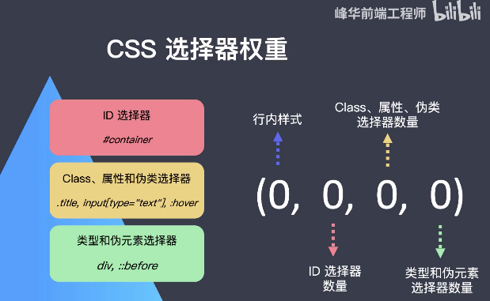
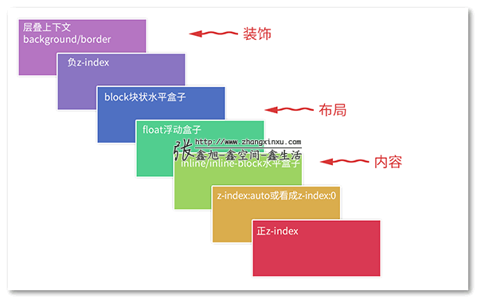

# CSS面试题总结（零散知识点）

## 1. flex布局

1. 布局思想是什么？

2. 常用的属性和值有哪些？

3. flex属性为1是什么意思？

4. 优缺点

   好处：好用

   坏处：兼容性不太好，主要用于移动端

详细用法见思维导图，练习画骰子熟悉用法

注意：**flex写死宽度的时候记得要把flex-grow和flex-shrink定义为0，否则会采用默认的flex-shrink：1来进行宽高的设定**

## 2.水平居中

详细见思维导图和知识点总结

## 3.垂直居中

详细见思维导图和知识点总结

补充：inline-block元素的垂直居中

## 4.有哪些属性是可以继承的？

* text-align

## 5.响应式布局的属性的区别？怎么实现？

响应式布局常用方法

1. **@media**

语法: @media 媒体类型 逻辑操作符 (媒体属性) ｛样式代码｝

逻辑操作符 

- and： 操作符用来把多个媒体属性组合起来，合并到同一条媒体查询中。只有当每个属性都为真时，这条查询的结果才为真； @media  all and （min-width:700px）and （orientation: lanscape）{...}

- not：操作符用来对一条媒体查询的结果进行取反; 

  @media not all  and（monochrome){...}  <=> @media @medianot (all  and (monochrome)){...} 

- only：操作符表示仅在媒体查询匹配成功时应用指定样式。可以通过它让选中的样式在老式浏览器中不被应用；  media = "only screen and（max-width：1000px)" {...}

媒体属性

- width | min-width | max-width
- height | min-height | max-height
- device-width | min-device-width | max-device-width
- device-height | min-device-height | max-device-height
- aspect-ratio | min-aspect-ratio | max-aspect-ratio
- device-aspect-ratio | min-device-aspect-ratio | max-device-aspect-ratio
- color | min-color | max-color
- color-index | min-color-index | max-color-index
- monochrome | min-monochrome | max-monochrome
- resolution | min-resolution | max-resolution
- scan | grid

横竖屏

- @media (orientation: portrait) { 竖屏 }
- @media (orientation: landscape) { 横屏 }

这种方式主要针对于需要对元素的展示方式进行改变的，横竖屏检测的。

2. %

使用百分比单位,相对于父元素的长宽，注意父元素必须要有定义

**注意如果父亲元素的宽高并没有被定义，只是被自动称开了，那么对子元素使用100%定义宽高是无效的，因为没有办法获取父元素的宽高，除非父元素是block自动占满整行**

3. rem/em

rem是相对根元素，html的font-size

em是相对于父元素的font-size

4. vw/vh/vmin/vmax

- vw : 1vw 等于视口宽度的1%
- vh : 1vh  等于视口高度的1%
- vmin : 选取 vw 和 vh 中最小的那个
- vmax : 选取 vw 和 vh 中最大的那个
- 视口单位区别于%单位，视口单位是依赖于视口的尺寸，根据视口尺寸的百分比来定义的；而%单位则是依赖于元素的祖先元素。

5. 实践方式

* 响应式布局要灵活运用flex布局，或者是block宽度的自动一行，不定宽高度的自动适应，以及上面提到的属性来实现。

* 来使用vw定义html元素的字体大小，其他元素使用rem进行定义是一种比较流行的方法

## 5.两列布局

* 具体查看代码

* 左右两列高度统一的方法？
  * 如果是flex则不用考虑自动高度统一
  * 如果不是flex可以使用padding-bottom:1000px; margin-bottom:-10000px来实现
* 占满全屏方法？
  * 使用position:absolute相对于视口定位的方法来进行实现

## 6.三列布局

## 7. 等分布局

## 8. 全屏布局

## 8. Inline-block元素的间距问题

如果inline-block元素中有换行符，就有一个默认的间距，可以通过设置font-size为0或者是在代码中删去换行符来完成

## 9.CSS的优先级问题

## 10.margin的负值问题

* margin的top和left是相对于别的元素移动自己上边界或者左边界
*  right和bottom是以自己为基准去影响别的元素的左边界或者是上边界，所以这个特性可以用来解决border的重叠变粗问题
* 正因为margin left是移动自己的左边界，所以对block元素来说意味自动width占满整行所以看起来margin-left为负数时整个block的宽度增加了。这个特性可以用来清除等分布局时的第一个间隙。

## 11. 外边距折叠

外边距折叠就是块的顶部外边距和底部外边距有时被组合(折叠)为单个外边距，其大小是组合到其中的最大外边距，若为一正一负则相加。这种行为称为外边距塌陷(margin collapsing)。**这种情况只发生在块级元素之间**。

1.产生的三种情况

* 块级父元素与其第一个/最后一个子元素
* 相邻的兄弟块级元素
* 空块元素
  * 如果存在一个空的块级元素，其 border、padding、inline content、height、min-height都不存在，那么此时空块元素的上下边距就会发生折叠

2. 解决方案

* 块级父元素与其第一个/最后一个子元素
  * 设置父元素的boder
  * 父元素设为BFC
  * 不用margin用padding
* 相邻的兄弟块级元素
  * 各自设置为BFC 
  * 只设置一边的margin
* 空块元素
  * 不要用block
  * 采用padding
  * BFC

## BFC

1. 什么是BFC？

BFC会产生一个独立的容器，该容器内部的元素不会在布局上影响到外部的元素，在外部的普通流看来它和其他普通流元素无差别，文档最终会按照上面说的普通流计算布局。

2. 形成条件？

- html根元素或其他包含它的元素；
- float的属性不为none；
- overflow为auto、scroll、hidden；(默认值为visible)
- display为inline-block，table-cell，table-caption中的任何一个；
- position为absolute或fixed；

3. 有什么用？

* 清除浮动
* 处理外边距折叠
* 使浮动元素不在BFC中，用于两列布局或者三列布局

## 清除浮动

1. 为什么要清除浮动

子元素浮动造成父元素高度塌陷的问题

2. 方法？

* ::after伪元素+clear
* 父元素形成BFC

## 14. outline属性解析

https://www.w3school.com.cn/cssref/pr_outline.asp

注意outline并不占据内容宽高

## 15. background属性解析

https://www.w3school.com.cn/cssref/pr_background.asp

* 常用的具体属性
  * backgroud-color
  * Background-img 注意要用url()
  * Background-position 一般用center确定背图片的放置位置
  * Background-size 操作背景图片的大小，一般用cover使覆盖元素的最大尺寸，contain是最小尺寸

与img的区别？

* 这个background设置图片的话图片不会随着元素的宽高进行变化，而img中的图片会随着img元素的宽高进行压缩

## 16. 去掉元素的默认样式

* button
  * border自定义
  * outline:none

* input
  * Outline:none

* a
  * Text-decoration:none;
  * color

默认间距离

​	*{

​	padding:0;

​	margin:0;

}

## nth-of-type(n)和E F:nth-child(n)的区别

nth-child(n)   用所有的孩子进行排序， nth-of-type(n) 只在相同type的内部进行排序

## 伪类和伪元素有哪些

## 层叠上下文的层叠顺序和形成条件

- 文档根元素
- position 值为 absolute（绝对定位）或  relative（相对定位）且 z-index 值不为 auto 的元素；
- position 值为 fixed（固定定位）或 sticky（粘滞定位）的元素（沾滞定位适配所有移动设备上的浏览器，但老的桌面浏览器不支持);
- flex (flexbox) 容器的子元素，且 z-index 值不为 auto；
- grid (grid) 容器的子元素，且 z-index 值不为 auto；
- opacity 属性值小于 1 的元素（参见 the specification for opacity）；
- mix-blend-mode 属性值不为 normal 的元素；
- 以下任意属性值不为 none 的元素：

- - transform
  - filter
  - perspective
  - clip-path
  - mask / mask-image / mask-border

- isolation 属性值为 isolate 的元素；
- -webkit-overflow-scrolling 属性值为 touch 的元素；
- will-change 值设定了任一属性而该属性在 non-initial 值时会创建层叠上下文的元素；
- contain 属性值为 layout、paint 或包含它们其中之一的合成值（比如 contain: strict、contain: content）的元素。

## CSS动画

* 实现动画的两种方式

  * transition

  * Keyframes(){

    } + animation

* 以上两种的区别？
  * 过渡动画需要有状态变化
  * 关键帧动画不需要状态变化
  * 关键帧动画能控制更精细

* 如何实现逐帧动画
  
  * Keyframes + animation animation-time-function:steps()

## CSS百分比单位总结

1. Width/height

相对于父元素的width/height来计算。注意height如果要使用百分比单位的话父元素的高度一定要被定义，因为块级别高度并不能自己扩展。

如果元素是根元素（`<html>`），它的包含块是视口（viewport）提供的初始包含块（initial containing block），初始包含块任何时候都被认为是有高度定义的，且等于视口高度。所以，`<html>`标签的高度定义百分比总是有效的，而如果你希望在`<body>`里也用高度百分比，就一定要先为`<html>`定义明确的高度。所以要占满整个页面的话要用html,body{height:100%}.

2. margin/padding

Margin/padding任何方向上的百分比单位都是相对于**父级元素**的宽度。

3. border

border不能使用百分比单位

4. Border-radius

相对自身元素的宽高

语法：

Border-radius:10% 10% 10% 10%/ 10% 10% 10% 10%

/前定义的是上左，上右，下右，下左的相对于宽度的圆的横轴半径

/后定义的是上左，上右，下右，下左的相对于高度的圆的竖轴半径

上写法

=Border-radius:10%

=Border-radius:10% / 10% 

= Border-radius:10% 10% / 10% 10% 

5. background-position
6. Font-size

参照是直接父元素的`font-size`。例如，一个元素的直接父元素的`font-size`是`14px`，无论这个是直接定义的，还是继承得到的，当该元素定义`font-size:100%;`，获得的效果就是`font-size:14px;`。

7.line-height

参照是元素自身的`font-size`。例如，一个元素的`font-size`是`12px`，那么`line-height:150%;`的效果是`line-height:18px;`。

8.vertical-align

参照是元素自身的`line-height`（和前面很有关联吧，所以我排在了这里）。例如，一个元素的`line-height`是`30px`，则`vertical-align:10%;`的效果是`vertical-align:3px;`。

9.定位用的bottom、left、right、top

参照是元素的父级元素。`left`和`right`是父级别元素的宽度，`bottom`和`top`是父级别元素的高度。

10.transform: translate

平移变换，在水平方向和垂直方向上也可以使用百分比，其参照是元素自身的**width+padding+border**（即这个元素自己的**border-box**尺寸）。例如，一个宽度为`150px`，高度为`100px`的元素，定义`transform:translate(50%, 50%)`的效果是`transform:translate(75px, 50px);`。

11. 注意！

请注意，**当百分比值用于可继承属性时，只有结合参照值计算后的绝对值会被继承，而不是百分比值本身**。例如，一个元素的`font-size`是`14px`，并定义了`line-height:150%;`，那么该元素的下一级子元素继承到的`line-height`就是`21px`，而不会再和子元素自己的`font-size`有关。

## @import和link标签导入css的区别

**差别1：**

老祖宗的差别。link属于XHTML标签，而@import完全是CSS提供的一种方式。

link标签除了可以加载CSS外，还可以做很多其它的事情，比如定义RSS，定义rel连接属性等，@import就只能加载CSS了。

**差别2：**

​	由于@import导入的样式表中有可能还会去导入其他的样式表，那么在下载并解析了一个使用了@import的样式表后会重新发起请求去下载这个被@import的样式表，这就会使得第二次被下载的样式表没有和第一次被下载的样式表同步的加载，导致整体的样式加载时间变长。

​	由于CSS样式的下载并解析为CSSOM是进行完整style computation的前提，所以浏览器在解析html的过程中如果知道还有CSS样式在加载就会等待CSS的样式加载和解析，等到其加载和解析完成过后再进行style recomputation，layout和layer update的过程，如果等待时间过长，就会先进行没有样式的layout,layer,update的过程。

​	所以样式加载时间变长就会导致整体页面呈现的时间变慢或者出现没有样式的页面，过多的嵌套@import就会导致页面呈现的时间变慢或者出现没有样式的页面。

​	所以应该少用@import。但是由于现在的打包工具的使用，已经把这些代码的依赖关系做了一个合并处理，所以在使用了打包工具的前提下，真正运行在浏览器上的样式也不会通过@import的方式进行导入，所以在使用了打包工作处理依赖的前提下使用@import也未尝不可。

**差别3：**兼容性的差别。由于@import是CSS2.1提出的所以老的浏览器不支持，@import只有在IE5以上的才能识别，而link标签无此问题。

**差别4：**使用dom控制样式时的差别。当使用javascript控制dom去改变样式的时候，只能使用link标签，因为@import不是dom可以控制的。