### Git Note

## Git
### 版本控制工具的功能
* 协同修改
* 数据备份
* 版本管理
   * Git采取文件系统快照的方式
* 权限控制
   * 对内进行权限控制
   * 对外对开发者进行审核--Git独有
* 历史记录
   * 查看修改内容
   * 恢复到一个历史状态
* 分支管理
   * 多条生产线同时推进
### Git的优势

* 本地完成，不要联网
* 完整性保证，利用hash
* 尽可能添加数据而不是删除或修改数据，很少产生不可逆的操作，随时返回历史版本
* 分支操作快捷流畅，创建和移动指针
* 与Linux命令全面兼容
### Git的本地结构
* 工作区(working tree)：写代码
* 暂存区(index file)：临时存储
* 本地库：历史版本
* git add->暂存区 git commit->本地区
###  Git 和 代码托管中心
Github是代码托管中心，维护远程库
* 局域网
   * 自己搭建
* 外网
   * 码云
   * Github
### 本地库和远程库

   * 团队内部协作
      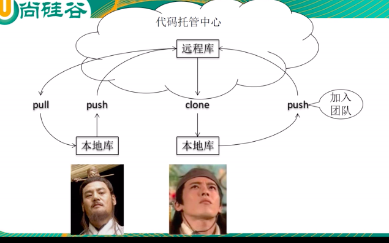
      
      
### Git基本原理

#### Hash

* 特点
  * 不管输入数据量多大，同一个hash算法，得到的结果长度都一样
  * 算法确定，输入确定，输出确定
  * 算法确定，输入变化，输出变化，通常很大（可用于校验文件）
  * 算法不可逆
* Git 底层用的是SHA-1算法

#### Git保存版本的机制

* 保存机制


* 提交对象

  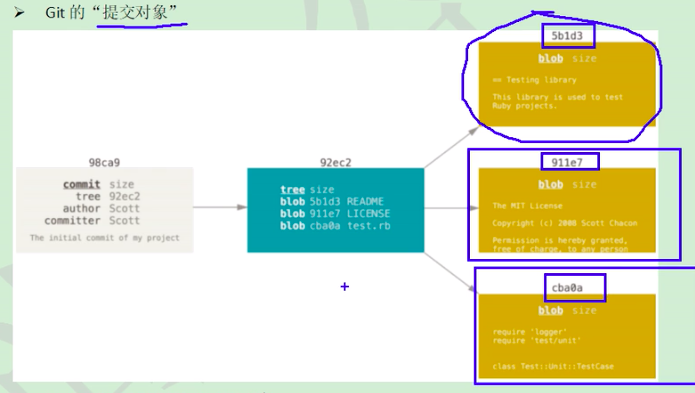
  每一个文件都有一个对应的blob对象指向，并且有一个独有的hash值，所有的blob对象由一个tree对象指向，这个tree对象又由一个提交对象commit指向。

  这个commit对象就是git log的commit的hash值

  

* 提交对象及其父对象形成的链条


Snapshot就是快照，所有的提交对象通过链表的方式表示时间关系

#### Git分支管理机制

* 分支的创建

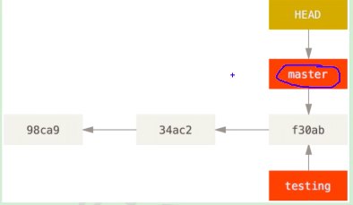


* 分支的切换

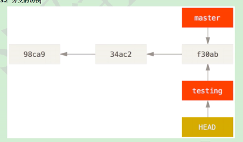

切换分支只是切换HEAD指针的指向所以很快

* 在分支上提交使得testing指针移动


在分支上提交只会移动testing指针

* 在master上也提交会造成分支


## Git命令行


### 1.本地库操作

#### 1.1本地库初始化
* 命令：git init
* 效果：生成一个 .git的本地库
* 注意：.git目录中存放的是本地库相关的子目录和文件，不要乱整
#### 1.2设置签名

* 形式：
   用户名：tom
   Email地址：随便写就行
* 作用：区分不同开发人员身份
* 辨析：和登录代码托管中心的不一样
* 命令：
   *  项目级别/仓库级别：仅在当前本地库范围内有效
      * git config user.name tom_pro
      * git config user.email xxx@111.com
      * 信息保存位置： ./git/config
   *  系统用户级别：登录当前操作系统的用户
      * git congig --global user.name tom_glb
      * git congig --global user.email xxx@111.com
      * 信息保存位置： ~/.gitconfig （~为系统当前用户目录）
   *  优先级：
      * 就近原则：项目级别优先于系统用户级别
      * 如果只有系统用户级别的签名，就以系统用户级别的签名为准
      * 二者都没有不允许
#### 1.3添加提交

* git status  查看工作区，暂存区状态
* git add [file name]（若为. 表示所有文件）将工作区的提交到暂存区或开始追踪
* git commit -m "commit_message" [file name] （若为. 表示所有文件） 将暂存区提交到本地库
  * 如果你想要将这一次的提交仍然采用上一次的commit log则可以使用 git commit --amend
#### 1.4历史记录

* git log 查看历史记录
   * git log --pretty=oneline (以最简洁的方式显示日志 无提交信息)
   * git log --oneline（比pretty更简洁，哈希值取一部分）
   * **git reflog**  (推荐)(HEAD@(指针移动的到这个历史记录的次数)，提交记录，齐全）
   * 多屏显示方式：如果记录很多就会默认是这种显示
      * 空格向下翻页
      * b向上翻页
      * q退出
#### 1.5前进后退
* **基于索引值操作**(推荐)
   * git reset --hard [索引值(只需要一部分索引值)]
* 使用^符号（只能往过去）
   * git reset --hard HEAD ^  n个符号回退n步
   * git reset --hard HEAD^^ 退两步
* 使用~符号（只能往过去）
   * git reset --hard HEAD~[int 回退步数]
##### reset 命令的三个参数对比
* --soft 参数
   * 仅在本地库移动指针
* --mixed 参数
   * 本地库移动HEAD
   * 重置暂存区
* --hard 参数
   * 三个区域都改变
* 注意
   * --soft参数改变本地库，git会认为本地库和暂存区不一样，从而认为暂存区也改变了
   * --mixed 改变本地库和暂存区，从而认为工作区变了
#### 1.6 删除文件在本地库找回

* 前提： 删除前的状态提交到了本地库
* 同样回退到历史记录就可以了
#### 1.7 比较文件差异
* git diff[文件名]
   * 将工作区中的文件和暂存区对应的文件进行比较
* git diff\[本地库中历史版本][文件名] eg: git diff\[HEAD^][文件名]
   * 工作区文件对比本地库文件
   * 不指定文件名就可以对比所有工作区文件
#### 1.8 分支管理

* 什么是分支
  
   * 多条线推进多个任务
   
* 好处
   * 并行开发，提高效率
   * 某分支开发失败不会对其他分支有影响，删除失败分支即可
   
* git branch 查看所有分支

   * 带*的分支是当前所在的分支，是HEAD指针指向的分支

   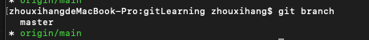

   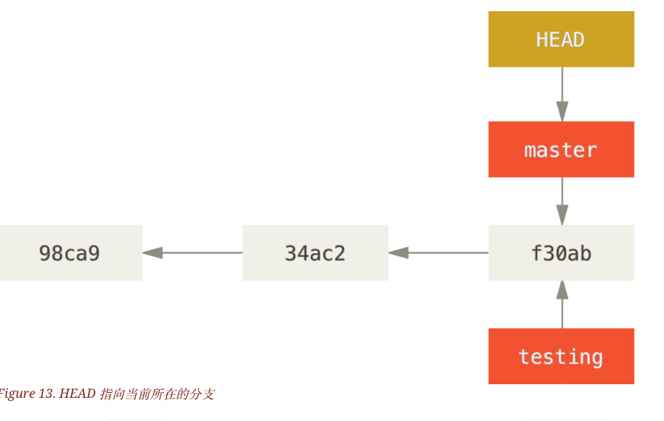

* git branch [分支名] 创建分支

   * 这就是在当前所在的提交对象上创建一个指针

   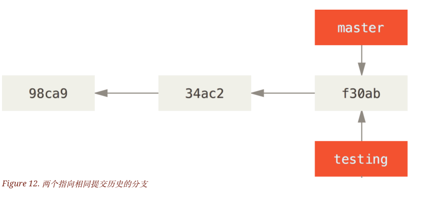

   * 创建分支后在分支上进行开发会使得分之指针向前推进，如果分支同时推进会产生分叉

   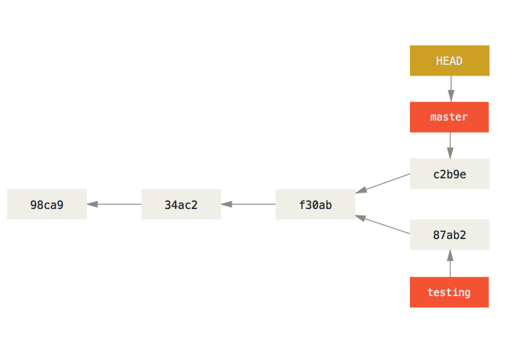

* git checkout [分支名] 切换分支

   * 切换HEAD指针的指向

* 合并分支
   * 第一：切换到要receiver分支
   * 第二：git merge [sender分支]
   * 通过merge合并分支后会在当前所在的分之多创建一个commit
   * 例子：合并前在master分支，merge到iss53分支
   
   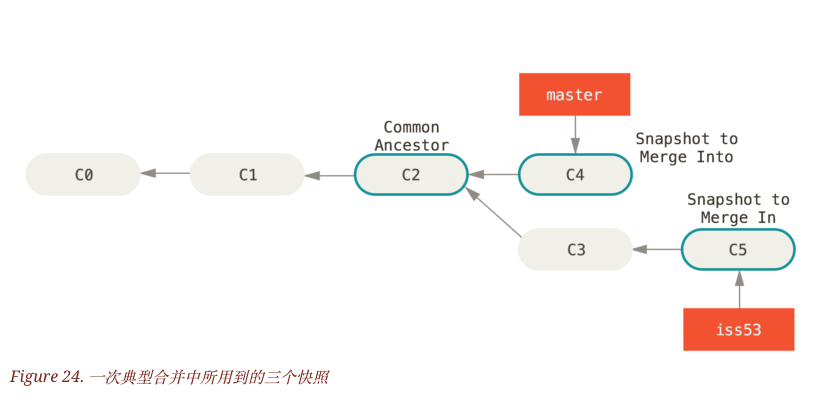
   
   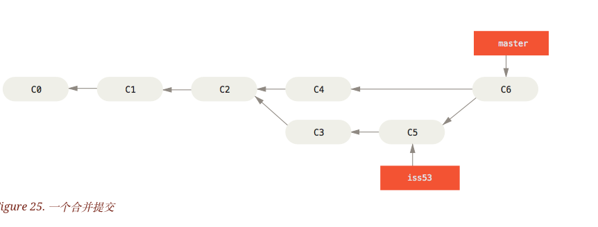
   
* 解决冲突
   * 产生原因
     
      * 再分出一个branch过后，两个 branch的同一个部分作出了不同的修改，若直接合并的话就会造成一个branch的修改丢失，所以需要进行手动修改
   * 解决
      * 编辑文件，删除特殊符号
        * vscode有支持的直接修改的选项
      
      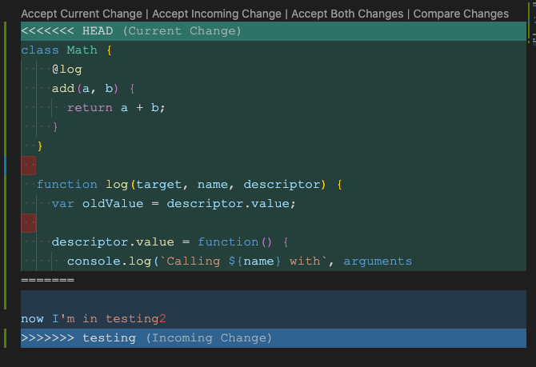
      
      * 把文件修改到满意的程度
      * git add[文件名]
      * 生成commit
        * 如果是merge的话直接git commit -m"message" ，会生成一个新的commit
     * 如果是rebase的话应该使用git rebase --continue
      * 注意：在解决冲突的时候应该注意HEAD的指向，有可能HEAD此时指向的是fetch新生成的origin/<>分支
   
* git rebase [base分支]

  * 以base分支为底重构提交历史，使得整个提交历史呈线形

  * 例子：

    以merge合并master和experiment分支，会多一个C5的commit对象，该对象其实比较冗余，并且历史纪录看起来并不清晰

  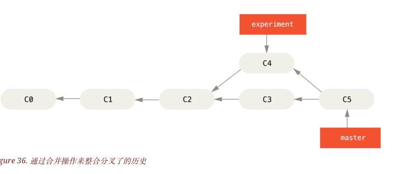

  在experiment分支中执行git rebase master会得到以下提交历史：

  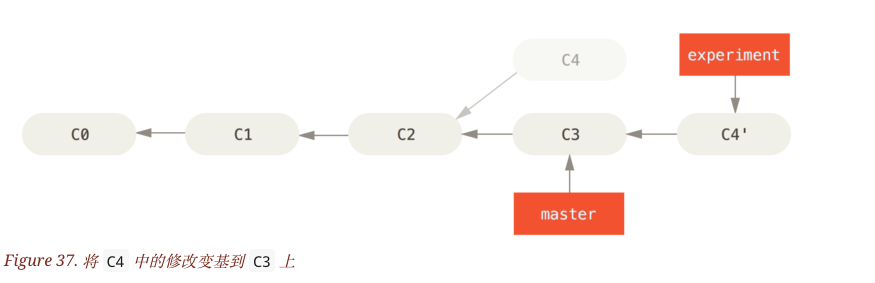

  再在master分支中执行git merge experiment就可以快进到以下：这样的合并更加的清晰

  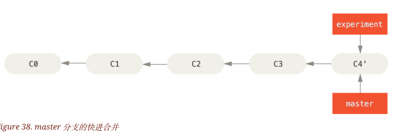

#### 1.9 Git Stash

*  git stash 或者是 git stash save ' ' 保存现在工作区的状态到一个存储状态的栈中
  * git stash save'' 可以为这一次的状态命名
* git stash list
  * 查看目前的状态栈的状态，有几个状态在栈中
* git stash apply <状态名>
  * 状态名不加的话默认用栈顶的状态来恢复
* git stash pop
  * 应用栈顶的状态并且把栈顶的状态删除
* 注意在应用stash到目前的工作区的时候有可能会引发冲突，需要进行冲突的解决

#### 1.10 git cherry-pick

对于多分支的代码库，将代码从一个分支转移到另一个分支是常见需求。

这时分两种情况。一种情况是，你需要另一个分支的所有代码变动，那么就采用合并（`git merge`）。另一种情况是，你只需要部分代码变动（某几个提交），这时可以采用 Cherry pick。

```bash
$ git cherry-pick <commitHash>
```
把其他分支上某一个commit的代码改动应用到当前分支上

[阮一峰cherry-pick](https://www.ruanyifeng.com/blog/2020/04/git-cherry-pick.html)

### 远程库操作

#### Github

* 远程库与本地库的交互逻辑

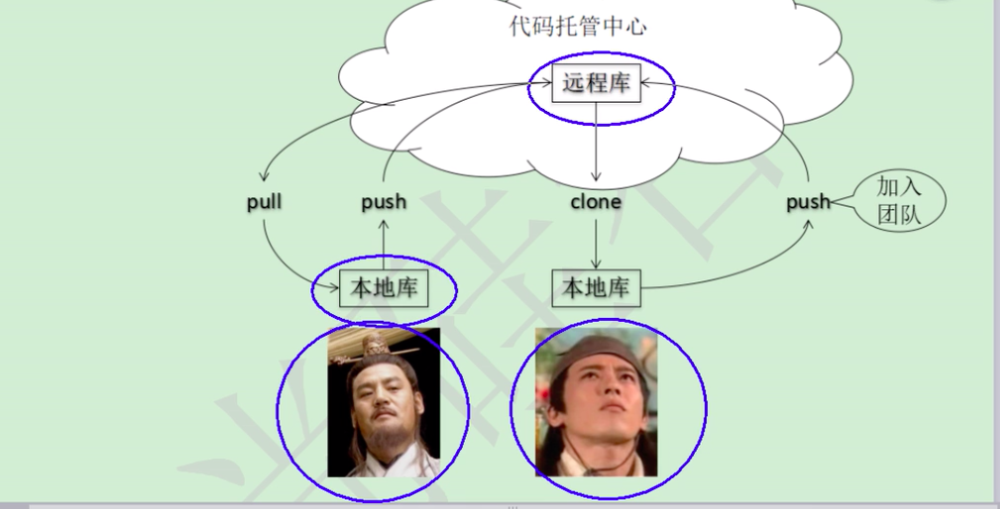
* 创建远程库
  
   * 在github上创建就好了
* 在本地创建远程库别名
   * 查看本地所有别名
      * git remote -v
   * 加入远程库别名
      * git remote add [别名] [远程库链接]
   * 删除别名
      * git remote rm [别名]
* 推送本地库
   * git push <远程主机名> <本地分支名>:<远程分支名>
   * 如果省略远程分支名，则表示将本地分支推送与之存在"追踪关系"的远程分支（通常两者同名），如果该远程分支不存在，则会被新建。
     * eg: git push origin master
   * 如果省略本地分支名，则表示删除指定的远程分支，因为这等同于推送一个空的本地分支到远程分支。
* 远程库克隆到本地库
   * git clone [远程库地址]
   * 三个效果
      * 完整把远程库下载到本地
      * 创建origin远程地址别名
      * 初始化本地库
* 邀请新成员
  
   * settings -> collaboration->copy link->accept
* 拉取远程库的更新
   * fetch
      * git fetch [远程库地址别名] [远程分支名]
      * 只把远程内容下载到本地，不做更改
      * 要看下载内容要切换到远程库的fetch的分支上
         * git checkout [远程库地址别名/远程分支名]
         * 当你从远程库fetch东西了过后就会自动创建一个[远程库地址别名/远程分支名]的分支
      
   * merge 
      * git merge [远程库地址别名/远程分支名]
      * merge的作用就是把写的分支合并到当前分支，所以就把被创建的[远程库地址别名/远程分支名]分支合并到当前分支
      
   * pull = fetch + merge

      *  git pull <远程主机名> <远程分支名>:<本地分支名>

      * 如果远程分支是与当前分支合并，则冒号后面的部分可以省略。

      * 如果当前分支与远程分支存在追踪关系，`git pull`就可以省略远程分支名。

      * 如果合并需要采用rebase模式，可以使用`--rebase`选项。

         * ```shell
            git pull --rebase <远程主机名> <远程分支名>:<本地分支名>
            ```
         
         * git pull --rebase其实作用等于先git fetch再git rebase
         
         * 为什么使用--rebase?
         
         * 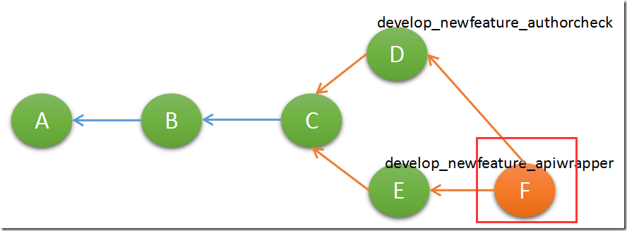
         
            *  正常情况在apiwrapper分支上pull下更新合并会产生F这个默认的commit使得log十分冗杂
         
         * 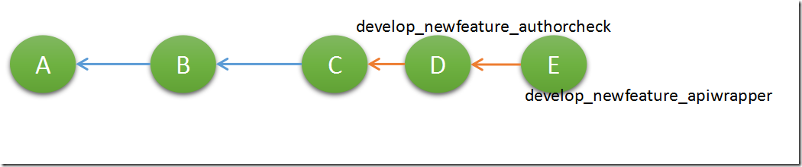
         
            *  但是这种--rebase的方式就只会保持一条单一的commit记录
   
* 协同开发时的冲突和解决
   * 跟多分支的时候发生的冲突类似，若不是基于github远程库最新版所做的修改，不能推送，必须要先拉取下来在推送
   * 要先拉取下来最新的版本，这个时候会提示冲突，然后再去除特殊符号，改成想要的样子，再修改到本地库并推送。
   * 注意： 参考解决本地多分支冲突，commit不加文件名
* 跨团队协作操作
  
   * fork
      * 以团队外参与人的身份点fork
   
     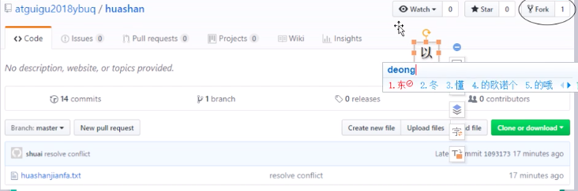
   * clone
     
      * clone下因为fork新建远程库的内容到本地
   * 本地修改并推送到fork远程库
   * Pull request
      * new pull request -> create pull request->填写消息
      * 接受人再点commit-changer看修改操作，若无问题则merge pull request
      * 接受人再把修改拉到本地

### Git hooks

* git hooks是一些自定义的脚本，用于控制git工作的流程，分为**客户端**钩子和**服务端**钩子。

* 客户端钩子包括：`pre-commit`、`prepare-commit-msg`、`commit-msg`、`post-commit`等，主要用于控制客户端git的提交工作流。服务端钩子：`pre-receive`、`post-receive`、`update`，主要在服务端接收提交对象时、推送到服务器之前调用。

* git hooks位置位于每个git项目下的隐藏文件夹.git中的hooks文件夹里，进去后会看到一些hooks的官方示例，他们都是以.sample结尾的文件名。**注意这些以.sample结尾的示例脚本是不会执行的，只有重命名后才会生效**


#### pre-commit的例子

- `pre-commit`是客户端hooks之一，也是接下来要介绍的钩子。`pre-commit`在`git add`提交之后，然后执行`git commit`时执行，脚本执行没报错就继续提交，反之就驳回提交的操作。
- 这个钩子中可以实现：对将要提交的代码进行检查、优化代码格式、或者对提交的图片进行压缩等等任务。下面是用shell编写的具体代码：

```bash
STAGE_FILES=$(git diff --cached --name-only --diff-filter=ACM -- '*.vue' '*.js')
if test ${#STAGE_FILES} -gt 0
then
    echo '开始eslint检查'

    which eslint &> /dev/null
    if [[ "$?" == 1 ]]; then
        echo '没安装eslint'
        exit 1
    fi

    PASS=true

    for FILE in $STAGE_FILES
    do
        eslint $FILE
        if [[ "$?" == 1 ]]; then
      PASS=false
    fi
  done

  if ! $PASS; then
      echo "eslint检查没通过！"
      exit 1
  else
      echo "eslint检查完毕"
  fi

else
    echo '没有js文件需要检查'
fi

exit 0
```

稍微解释下：首先用`git diff`获取到提交到暂存区的文件，我这里添加了过滤即只获取.vue和.js文件。

然后判断eslint是否已安装，接着再对获取到的文件依次检查，当某个文件检查不通过时不会中断进程，会继续遍历所有文件，这样最后在控制台可以显示出所有检查不通过的文件信息

exit即表示退出当前脚本进程、后面接上状态码，0表示正常，会继续执行`git commit`的操作，其他情况表示出错，不会继续commit。

将上面的代码保存为`pre-commit`，然后存放在.git/hooks中，然后每次执行`git commit`时就会使用eslint进行代码检查了。