# 面试总结

## 面试投递

| 投递公司         | 查询链接                                                                 | 面试时间      | 状态   |
| ------------ | -------------------------------------------------------------------- | --------- | ---- |
| 字节           |                                                                      |           |      |
| 腾讯           | https://join.qq.com/center.html                                      | 12号晚上7点1面 |      |
| 阿里           |                                                                      |           | 已投递  |
| 虾皮           | https://app.mokahr.com/m/candidate/applications/deliver-query/shopee | 10号下午4点笔试 |      |
| 美团           | https://campus.meituan.com/apply-record                              |           |      |
| 搜狐           |                                                                      |           | 无前端  |
| 快手           |                                                                      |           | 没开始  |
| thoughtWorks | https://join.thoughtworks.cn/account/profile                         |           | 做完测评 |
| 网易           | https://campus.163.com/app/personal/apply                            |           | 已投递  |
| 京东           | http://campus.jd.com/web/apply/myjob                                 |           | 已投递  |
| 滴滴           |                                                                      |           | 没有春招 |
| 百度           |                                                                      |           | 没有春招 |

## 项目内容和各自亮点

### 德州仪器

1. 项目内容
   
   对一个报表系统进行优化，优化了报表系统的加载时间和呈现方式

2. 项目亮点
* 浏览器的响应式
  
  * 项目需求不要出现横向的scroll,所以识别不同浏览器的宽度动态调节每个单元格的宽度，设置了单元格的最小宽度，如果宽度不够就折行。并且使用了防抖来监听resize事件。
    * 使用rowspan/colspan来完成单元格的合并
    * 用防抖来监听resize事件，让宽度不够折行

* 动画
  
  * 使用hover使得hover的行变颜色

* 前端的性能优化
  
  * 最开始是一个单元格一个单元的插入到DOM效率低下。使用文档碎片加载表格，使得每10行数据用文档碎片的形式一次性加入。
  * 使用了表格懒加载的方式进行表格的加载
    * 表格数据量有的时候比较大，可以有100多行，采取每次加载10行的方式，如果可视窗口到达最底行以上100px就动态加载新的10行
    * 使用了单例设计模式，可以动态的设置每次加载插入的行数

* 不同浏览器的适配 
  
  * 由于办公室用chrme，但是工厂用IE7，所以要进行浏览器的适配。
    
    * 一些CSS属性不支持IE7，比如hover属性IE不支持改用JS实现，采用CSS.supports语法进行识别
      
      * https://www.zhangxinxu.com/wordpress/2019/11/js-css-supports-detect/
      
      * ```js
        result = CSS.supports('filter', 'blur(5px)');
        ```
    
    * 一些DOM属性IE不支持，比如innerWidth,采用IE支持的clientWidth.
    
    * 还有一些其他的方法的兼容性问题，尽量在采取一些DOM的操作或者JS自带的原生操作前检验一下该方法是否被支持
      
      * IE不支持getElementsByClassName,需要自己写一个函数来获取
      * js中的splice方法并不在IE中被支持，需要自己写操作字符串的方法

### 学校项目——房屋租赁系统

1. 项目内容
   
   完成了学校的课程项目，一个房屋的租赁系统，采用了sails框架，服务端渲染的项目。是一个多页面应用。并且完成了移动端的CSS适配。

2. 项目的亮点
* CSS相关
  
  * animation+关键帧动画
    * 菊花图加载
      * 首先画6条上竖线和6条下竖线，然后一次旋转成为一个菊花形状，然后设置关键帧动画，linear渐变，从opaccitiy:0-1渐变。并且给一个延迟时间让opacity:0感觉像是在移动
    * 上传图片的时候采取了box-shadow画点的方式来进行加载点的呈现
      * 使用关键帧+animation的方式进行实现，采用了steps的时间函数。小圆点采用了box-shadow实现。给一个2px,2px的span,这个span的阴影其实就是可以看作这个span小点的复制。
  * transform(translate, scale)+transition动画
    * 图片的上移动效果
    * 图片的放大效果的实现

* JS相关
  
  * 返回顶部效果的实现
    * 返回顶部 window.scrollTo(0,0)
  * 放大镜效果的实现
    * 只用一张图片即可，自动生成一张设置比例了的大图
      * 鼠标跟随，用event.clientX,event.clientY和元素距离视口的位置关系算出放大镜距离父容器图片的left, top,从而实现跟随
      * 注意要使用一个透明的mark盖住原图和放大镜，对mark捕捉mouseenter时间显示放大镜。这样才不会频繁的触发mouseenter事件。
  * 图片懒加载
    * 首先所有的图片都有一个规格，用div的背景进行展示，position-size:cover。先定义好图片的宽高。
    * 最开始background-url不加，把url存在index属性中
    * 通过scroll事件的监听遍历所有图片的元素，判断元素到视口的top距离是否大于视口高度判断元素是否进入视口。
  * 动态添加class名的方式实现下拉框的展示，从而实现了一些CSS的复用
  
  ```js
  // div is an object reference to a <div> element with class="foo bar"
  div.classList.remove("foo");
  div.classList.add("anotherclass");
  
  // if visible is set remove it, otherwise add it
  div.classList.toggle("visible");
  
  // add/remove visible, depending on test conditional, i less than 10
  div.classList.toggle("visible", i < 10 );
  
  alert(div.classList.contains("foo"));
  
  // add or remove multiple classes
  div.classList.add("foo", "bar", "baz");
  div.classList.remove("foo", "bar", "baz");
  
  // add or remove multiple classes using spread syntax
  let cls = ["foo", "bar"];
  div.classList.add(...cls); 
  div.classList.remove(...cls);
  
  // replace class "foo" with class "bar"
  div.classList.replace("foo", "bar");
  ```

* 移动端的适配
  
  * 对网站进行了响应式的布局
    * 使用了flex布局
    * 尽量不采取px的方式定义宽高，而是采取%或者是rem的方式来呈现内容。对根元素设置vw来获取屏幕宽度设置根元素字体
    * 采用媒体查询来改变图片的每行呈现个数
3. 项目相关功能的实现
* 登陆的实现？
  
  * 采用了cookie存储sessionID的方式进行的实现

* tocken和cookie的实现区别？
  
  * tocken是把用户信息通过JWT方式加密存储在浏览器，通过http头部authorization发送到服务器
  
  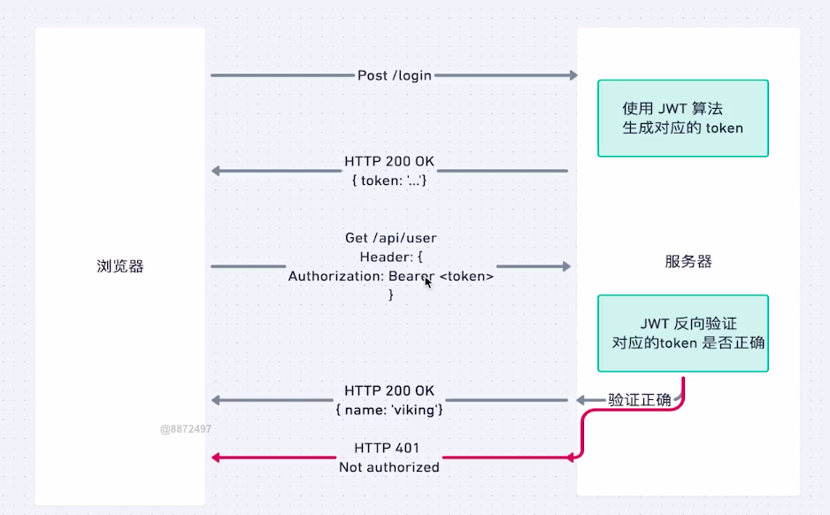
  
  * cookie是客户端存session id，用户信息存在服务器，这样进行身份的识别。但是这样不方便后端集群的实现，要实现数据持久层，太麻烦。
  
  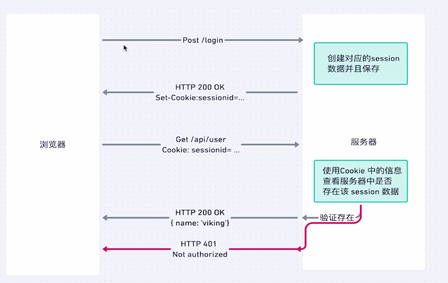

### 猿辅导项目

1. 项目内容
   
   * 采用vue2,vuex,vuexrouter,vue-cil和内部的UI库,ts对一个后台管理平台的路由优化功能的添加，完成了后台系统对app管理和app页面管理的动态配置模块。
   
   * 重新梳理组件的逻辑，优化路由逻辑
   
   * 让用户在app管理页面上对接入后台的app进行调整，并将其内容存储在vuex中便于全局管理
   
   * 用户可以在app页面管理中对每一个app相关的活动链接进行配置，为了用户友好，url的配置方式采用输入key,value键值对的方式进行并且最后动态生成完整的url。

2. 项目亮点
* 采用了ts进行项目的实现

* 采取了vuex管理用户添加的app信息，可以让其他模块响应式的获取该app信息

* 登陆采用token,并且使用了localStorage进行持久化登录的设计

* 基于组件复用的思想，对输入key,value键值对生成input url的方式进行组件封装
  
  * 由于想要插入根据输入key,value键值对的方式封装成一个input到表单，就自己写了一个带验证功能的表单
  * 使用@blur事件监听验证事件，父组件通过传值给input验证规则。
  * 实现input和父组件的响应式主要采用了model重新定义v-model的方式。父组件穿值给mailVal,子组件通过发送update事件给父亲组件从而实现双向绑定
  
  ```js
    model: {
  
      prop: "mailVal",
  
      event: "update",
  
    },
  ```
  
  * 实现提交表单验证的按钮使用了this.$emit和this.$on方法。这种方法可以在一个vue实例里面监听事件。所以在子组件的created生命周期中发送事件this.$parent.$emit把它的验证函数发给父组件，即validate-form组件。validate-form组件用一个this.$on方法进行监听，从二收集validate-input方法。最后在提交表单的时候把这些验证方法都运行一次即可。
  * 再实现url动态验证的组件，这个组件可以动态匹配url，把参数,host提取出来单独输入。首先实现这个组件。把这个组件写在validate-input的组件中，用户通过传递type的值判断是不是要渲染这个组件。这个组件要实现和validate-input组件的双向绑定，再由validate-input和父组件实现双向绑定最后实现。
  * inheritAttrs:false + v-bind:"$attrs"可以把父组件给子组件组件绑定的属性绑定到子组件的具体元素上。
3. 项目相关功能的实现

1.登陆

* 登陆获取tocken吧tocken绑定在store上
* 获取tocken后给之后所有的请求都加上tocken字段在http头部的authorization
* tocken的持久化方案
  * login之后把tocken存在localStorage中
  * store的tocken初始值也从localStorage中获取
  * 第一次如果没有登陆但是login为false，就自动发送登陆请求自动登录
  * 如果请求成功就是成功，失败了就清空localStorage，显示错误
  * 
2. 跨域
- vue的devServer.proxy
- 本身应该是来自于一个叫做 `http-proxy-middleware`的node服务

```javascript
// vue.config.js
devServer: {
  proxy: {
    '/apis': {
      target: 'http://sb.dreamcat.ink:2020/',
        ws: true,
          changeOrigin: true,//把请求头的host改为目标的host
            pathRewrite: {
              '^/apis': ''
            }
    }
  }
}
```

## 遇到的项目难点

### CSS相关

* Margin的负值清除border

* Float，absolute的时候宽度不占满整行

* flex布局的时候需要设置是否缩放，否则设定的宽度可能不起效果

* IFC的使用，inline-block的居中，图片在block元素中的下边距清除

* 层叠上下文的使用使得悬浮的弹框可以被看见

* CSS动画steps的使用

* 使用box-shadow结合animation生成加载的小圆点

### JS相关

* 在实现放大镜动画的过程中发现要加一个mark去响应mouseover事件，否则会一直进出触发mouseover事件
* js的异步原理导致的动画卡顿

### Vue相关

* 对于数组的push操作不能响应式，应该使用。。方法

## webpack相关

webpack5中使用webpack-dev-server会报错

## 面试问题总结

### 腾讯一面

1. TS和JS的区别，你觉得哪一个更好一点？
* 主要区别：
  
  * JS动态类型语言，ts静态类型语言
  * JS弱类型语言，ts强类型语言
  * ts是js的超集，向下兼容所有的js操作，并且执行的时候其实也是把ts转换为js执行

* ts相对js的优势
  
  * 主要是对于开发人员，语言在解释执行阶段就可以发现类型不匹配的错误，结合IDE可以提供大量的便捷纠错能力。
  * 方便代码阅读，方便大型项目的合作开发
  * IDE提供的大量便捷支持和TS本身的语法检查和代码提示自动补全让开发者提高效率，方便重构

* ts相对js的劣势
  
  * 前期需要自己定义类型，在项目前期增加了开发成本，对于小型项目来说其实可以不用ts

* 一些拓展
  
  * 什么是解释型语言和编译型语言？
  
  解释型语言使用解释器把代码逐行翻译为源代码，编译型语言把代码通过编译器编译为最终可执行文件。

  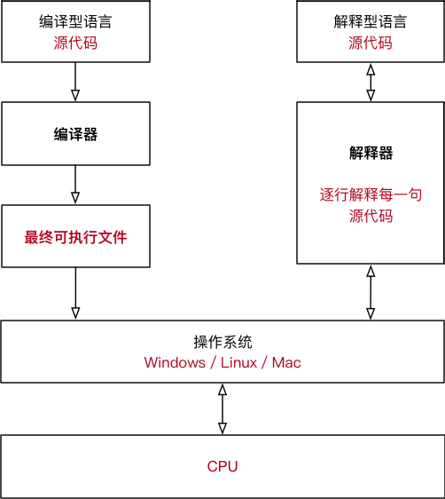

| **类型** | **原理**                                                         | **优点**                              | **缺点**         |
| ------ | -------------------------------------------------------------- | ----------------------------------- | -------------- |
| 编译型语言  | 通过专门的编译器，将所有源代码一次性转换成特定平台（Windows、Linux 等）执行的机器码（以可执行文件的形式存在）。 | 编译一次后，脱离了编译器也可以运行，并且运行效率高。          | 可移植性差，不够灵活。    |
| 解释型语言  | 由专门的解释器，根据需要将部分源代码临时转换成特定平台的机器码。                               | 跨平台性好，通过不同的解释器，将相同的源代码解释成不同平台下的机器码。 | 一边执行一边转换，效率很低。 |

* 强类型语言，弱类型语言，静态，动态类型语言是什么区别是什么？
  
  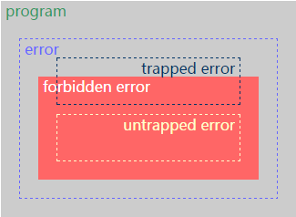
- *trapped errors*。导致程序终止执行，如除0，Java中数组越界访问

- *untrapped errors*。 出错后继续执行，但可能出现任意行为。如C里的缓冲区溢出、Jump到错误地址

- Forbidden error:语言设计时，可以定义一组*forbidden behaviors*. 它必须包括所有untrapped errors, 但可能包含trapped errors.
* *well behaved*: 如果程序执行不可能出现forbidden behaviors, 则为*well behaved*。

* *ill behaved: 否则为ill behaved...*

* *强类型strongly typed*: 如果一种语言的所有程序都是well behaved——即不可能出现forbidden behaviors，则该语言为strongly typed。

* *弱类型weakly typed*: 否则为weakly typed。比如C语言的缓冲区溢出，属于trapped errors，即属于forbidden behaviors..故C是弱类型

* *静态类型 statically*: 如果在编译时拒绝ill behaved程序，则是statically typed;

* *动态类型dynamiclly*: 如果在运行时拒绝ill behaviors, 则是dynamiclly typed。
2. js中的数据类型
- 基本数据类型
  - undefined
  - number
  - string
  - boolean
  - null
  - symbol(ES6新增)
  - BigInt(最新)
- 引用数据类型
  - 对象
  - 正则
  - 数组
  - 日期
  - Math
  - 实例
  - function
3. 基本数据类型和引用数据类型的区别
* 基本数据类型存储在栈内存中
* 引用数据类型存储在堆内存中
* 基本数据类型是传值
* 引用数据类型是传地址，传指针

```js
let a = 1;
let b = a;//由于a是基本数据类型，这个时候是生成了一个b指针指向了另外一个栈内存地址，并且赋值为1
b = 2;//因为是指向另外一个内存地址，所以b的值的修改不会影响a的值
console.log(a); // => 1

let objA = {
  'a':1
}
let objB = objA; //引用数据类型是传地址，所以objA和objB指向同一个内存地址
objB.a = 2;//因为指向同一个内存地址，所以修改objB.a就相当于修改objA.a
console.log(objA.a);// =>2
```

4. js检测数据类型
* typeof a
  
  * 字符串中包含了对应的数据类型  "number"/"string"/"boolean"/"undefined"/"symbol"/"object"/"**function**"
  * 缺点：
    * 是typeof null => "object"
    * 不能精准的检测引用数据类型，都会返回"object"

* a instanceOf Number
  
  * 检测某个实例是否属于这个类，沿着原型链向上查找,所有出现在其原型链上的类，检测结果都是TRUE
  * 缺点：
    * 由于可以基于__proto__或者prototype改动原型链的动向，所以基于instanceof检测出来的结果并不一定是准确的
    * 基本数据类型的值，连对象都不是，更没有__proto__，虽说也是所属类的实例，在JS中也可以调取所属类原型上的方法，但是instanceof是不认的

* Object.prototype.toString.call([value]) / ({}).toString.call([value])
  
  * 返回当前实例所属类的信息，格式："[object 所属类信息]"
  
  * "[object Object/Array/RegExp/Date/Function/Null/Undefined/Number/String/Boolean/Symbol...]"
  
  * 缺点：
    
    * 没有缺点，最准确的方式

```js
    function getType(a){
        let temp = Object.prototype.toString.call(a);
        let index1 = temp.indexOf(' ');
        let index2 = temp.indexOf(']');
        return temp.slice(index1 + 1,index2);
    }
```

5. ==和===的区别
* ===
  * 检查两侧必须类型和值都相等才返回true
* ==
  * 如果两侧类型相等则等于===
  * 如果两侧类型不同，则进行类型转换
    * NaN==NaN ：NaN和谁都不相等（包括自己）
    * null==undefined：null和undefined两个等号比较是相等的（三个则不相等），但是他们和其它任何值都不相等
    * 引用数据类型和其他基本类型：先尝试用vlaueOf()的结果进行比较，如果类型还是不相等就用toString()把这个引用数据类型变成String类型进行比较
    * 其他基本类型的比较都是使用Number()统一转换为数字类型

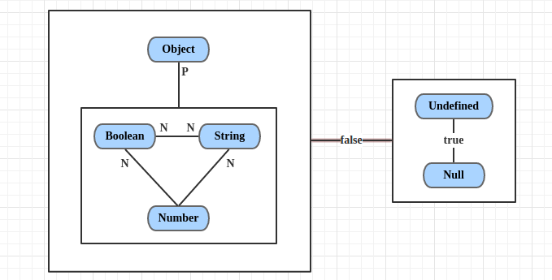

P：先用Object.prototype.valueOf()方法，如果类型不等就使用toString()方法

N：使用Number()转换为number比较

6. let 和 var的区别？
* let没有变量提升，var会提前声明但是不定义
* 全局变量对象VO(G)中声明的变量（用var声明的），也会给全局对象GO中增加一个对应的属性；但是用let声明的变量不存在这个特点；如果是在浏览器中这个全局变量对象就是window

```js
function fn() {
    //此时的x不是AO（FN）中的私有变量，则向全局找，此处相当于给全局VO（G）变量对象中设置了一个x的全局变量，也相当于给全局对象GO设置了一个x的属性
    x = 100;
}
fn();
console.log(window.x); 
```

* var的重复声明是可以通过词法解析的，但是let是不可以的。

* var没有块级作用域，let有块级作用域
7. var声明函数和直接声明函数的区别？

var声明只会变量提升但不定义，直接声明函数变量提升且定义

8. let和const的区别
* 实际上所有的变量声明都是声明了一个指针指向对应的内存地址，基本数据类型的传值是通过传值的方式进行，而引用数据类型的传值是通过传地址的方式。

* 用let声明的指针的指向是可以被改变的，但是用const定义的指针的指向是不能被改变的。

* 对引用数据类型而言，使用const定义虽然无法改变这个指针的指向，但是可以改变指针指向的内存地址的内容。

```js
let a = 1;
const aConst = 1;
a = 2;
aConst = 2; // 报错，不能运行

let arrA = [];
const arrConst = [];
arrA[0] = 1;
arrConst[0] = 1;
console.log(arrA,arrConst)
```

9. 作用域和作用域链？
* 首先明确几个概念：
  
  * ECStack：Execution [ˌeksɪˈkjuːʃn] Context Stack 执行环境栈：JS执行的主栈内存
  * EC：Execution Context 执行环境（执行上下文）：为一个函数运行时分配的主栈内存
  * VO/VO(G)/GO/window(浏览器端)：Varibale Object 变量对象（全局的变量对象）是存储全局下的定义的变量
  * AO：Activation Object 活动对象 （存储函数内部执行上下文的对象）
  * Scope:作用域，函数对象的一个属性，是一个指针，指向函数创建时所在EC的变量对象或者是活动对象
  * Scope Chain ：作用域链，一个指针，在函数执行时初始化，指向该函数的作用域指向的变量对象或者是活动对象

* 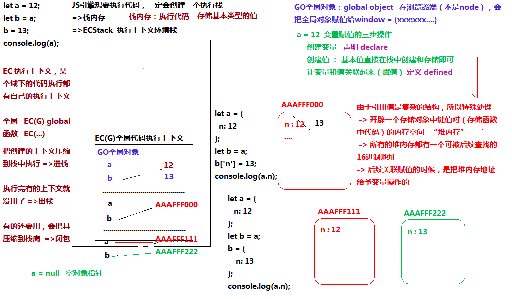

* 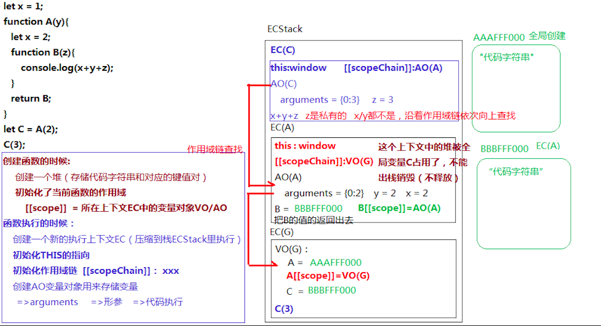
  
  * 首先在EC(G)中定义一个x的基本值，加入到VO(G)中
  * 再定义A函数，初始化A的作用域scope为当前EC(G)中的VO(G)
  * 执行A，初始化this为window, 初始化作用域链为该A中的作用域，即VO(G)
  * 定义B，初始化B的作用域scope为当前上下文的AO(A)
  * 返回B的内存地址给C，**注意C的scope属性其实就是B的scope，因为指向同一个内存地址**
  * 执行C，初始化this,初始化scopeChain为scope,指向AO(A)
  
  **注意this的初始化是在执行的时候进行的**

10.什么是闭包？

闭包是指有权访问另一个 函数作用域中的变量的**函数**。注意**闭包是一个函数**。

```js
    function createComparisonFunction(propertyName) {
        return function(object1, object2){
            var value1 = object1[propertyName];//访问了createComparisonFunction作用域中的propertyName属性
            var value2 = object2[propertyName];
            if (value1 < value2){
                return -1;
            } else if (value1 > value2){
                return 1;
            } else {
                return 0;
} };
}
```

返回的匿名函数可以访问createComparisonFunction作用域中的propertyName属性，这个createComparisonFunction的ECstack得到保存，对应的propertyName属性也得到了保存。

11. 词法作用域和动态作用域
* 词法作用域=静态作用域：函数的作用域在函数定义的时候就决定
* 动态作用域：函数的作用域在函数执行的时候决定
* 一个例子：

```js
var value = 1;

function foo() {
    console.log(value);
}

function bar() {
    var value = 2;
    foo();
}

bar();
```

由于js是采用的词法作用域，foo函数在定义的时候scope就已经被初始化为VO(G),所以当foo执行的时候也会初始化scope chain为VO(G),所以输出的value为1.

如果js采用动态作用域，那么foo函数定义的时候就不会初始化scope，执行的时候再初始化scope为bar函数中的AO,那么输出的value为2

12. 箭头函数和普通函数的区别？
* 箭头函数中没有自身的THIS，所用到的THIS都是其上下文中的THIS,即向上级作用域去借用this，也可以说是函数被定义时所处的上下文中的this。

* 箭头函数没有的东西很多：
  
  * 他没有prototype（也就是没有构造器），所以不能被new执行
  * 他没有arguments实参集合（**可以基于...args剩余运算符获取**）

* 一些实例

```js
let obj = {
    name: 'OBJ',
    fn: function () {
        // console.log(this); //=>obj
        let _this = this;
        return function () {
            // console.log(this); //=>window
            _this.name = "珠峰";
        };
    }
};
//执行fn,这个fn的this在执行时初始化为obj,但是返回的函数有自己的this指向window,需要保存下来fn作用域中的this给返回的匿名函数ff
let ff = obj.fn();
ff(); 

let obj = {
    name: 'OBJ',
    fn: function () {
        // console.log(this); //=>obj
        return () => {
            console.log(this); //=>obj
        };
    }
};
//在定义这个匿名函数的时候初始化了它的scope作用域为fn的AO，其中有fn的this
//由于箭头函数没有自己的this,所以会沿着作用域链向上找到fn的AO，其中有fn的this,fn的this指向的是obj,所以ff的this同样指向obj
let ff = obj.fn();
ff(); 

let obj = {
    name: 'OBJ',
    fn: function () {
        setTimeout(_ => {
            this.name = "珠峰";
        }, 1000);
    }
};
//由于箭头函数没有this,当箭头函数被定义的时候其中的this指向的是fn运行的时候初始化的this,所以指向obj
obj.fn(); 
console.log(obj.name); //=>珠峰

let fn = ()=>{console.log(this)};
fn();//window
let obj = {
  fn
}
//由于fn是箭头函数，没有自己的this,所以在执行的时候自然也不能把自己的this初始化到obj
//在执行的时候fn会初始化自己的scopeChain为自己的scope,即VO(G),并沿着scopeChain向上查找到VO(G)中的this,自然就是window
obj.fn();//window
```

13. 改变this的指向的方法
* CALL/APPLY
  
  * 第一个参数就是改变的THIS指向，写谁就是谁（特殊：非严格模式下，传递null/undefined指向的也是window）
  * 唯一区别：执行函数，传递的参数方式有区别，call是一个个的传递，apply是把需要传递的参数放到数组中整体传递

* BIND
  
  * call/apply都是改变this的同时直接把函数执行了，而bind不是立即执行函数，属于预先改变this和传递一些内容  =>"柯理化"

* 手写
  
  * 手写bind

```js
~function anonymous(proto) {//立即执行函数重新写function原型中的bind函数
    //ES5版本
    function bind(context){
        context = context || window;//若context并为传值则为undefined,也可以为null表示空，两种方式都会被做bool类型转换为false
        //获取传递的实参集合
        let args = [].slice.call(arguments,1);//调用了[]原型中的slice方法把{}变成[]且传入1参数从第二个数字开始转换
        //获取需要执行的最终函数，因为function有自己的this,并不指向调用的函数
        _this = this;
        //返回封装好的函数
        return function anonymous(){
            //获取anonymous中可能传入的参数
            let inArgs = [].slice.call(arguments,0);//全部都要
            _this.apply(context,args.concat(inArgs));//改变this的指向到context执行，并传入所有的参数
        }
    }
    //ES6版本
    //1.使用apply实现
    function bind(context = window,...args) {
        context = context || window;//由于只能给undefinde赋初值所有还是要加这一句判断null
        return (...inArgs) =>  this.apply(context,args.concat(inArgs));
    }
    proto.bind = bind;
    //2.因为call的效率更高所以用call实现更好
    function bind(context = window,...args) {
        return (...inArgs) =>  this.call(context,...args.concat(inArgs));//...在传参时表示把数组拆分成单个的参数
    }
    proto.bind = bind;
}(Function.prototype)
let obj = {
    a: 1,
    fn: function fn() {
        return function () {
            console.log(this.a);
        }
    }
}
let fn = obj.fn().bind(obj);
```

​    手写call


```js
~function anonymous(proto) {//立即执行函数重新写function原型中的bind函数
    function call(context = window, ...args) {
        context = context || window;
        let type = typeof context;
        //若为基本类型值则转换为对应的对象
        if (type === 'number' || type === 'string' || type === 'boolean') {
            switch (type) {
                case 'number':
                    context = new Number(context)
                    break;
                case 'string':
                    context = new String(context);
                    break;
                case 'boolean':
                    context = new Boolean(context);
                    break;
            }
        }
        context.$fn = this;
        let result = context.$fn(...args);
        delete context.$fn;
        return result;
    }
    proto.call = call;
}(Function.prototype)
let obj = {
    a: 1,
    fn: function fn() {
        return function () {
            console.log(this.a);
        }
    }
}
console.log(obj.fn().call(obj), obj);
```

手写apply()

```js
    function apply(context = window, args) {//相比call只是传入的参数变成了数组而已
        context.$fn = this;
        let result = context.$fn(...args);//仍然要展开传值
        delete context.$fn;
        return result;
    }
```

14.你用到的异步处理方法和原理？

Promise,Async await

```js
class MyPromise {
            constructor(executor) {//executor是必须传入的参数，是实际运用中需要异步执行的函数
                this.status = 'pending';
                this.value = undefined;
                this.resolveArr = [];//用来装.then中成功的回调函数，不止一个所以用数组
                this.rejectArr = [];//用来装.then中失败的回调函数，不止一个所以用数组

                let change = (status, value) => {//作为改变实例状态的一个函数
                    if (this.status !== 'pending') return;//只能改变一次所以若不为pending就不能继续
                    this.value = value;
                    this.status = status;
                    let fnArr = status === 'resolved' ? this.resolveArr : this.rejectArr;//是成功还是失败的回调？
                    fnArr.forEach(item => {
                        if (typeof item !== 'function') return;
                        item(this.value);//以executor中对resolve或者reject传入的参数作为回调函数的参数进行执行
                    });
                };
                let resolve = result => {
                    if (this.resolveArr.length > 0) {//若已经执行了.then放了回调函数才执行
                        change('resolved', result);
                        return;
                    }
                    let delayTimer = setTimeout(_ => {//若没有执行回调函数就利用一个定时器去模拟微任务的实现让.then先执行
                        change('resolved', result);
                        clearTimeout(delayTimer);//清除计时器
                    }, 0);
                };
                let reject = reason => {
                    if (this.rejectArr.length > 0) {
                        change('rejected', reason);
                        return;
                    }
                    let delayTimer = setTimeout(_ => {
                        change('rejected', reason);
                        clearTimeout(delayTimer);
                    }, 0);
                };

                try {//若executor本身执行不出错才会看executor中是执行的resolve还是reject
                    executor(resolve, reject);
                } catch (err) {//若本身执行出错了就会直接执行reject并传入出错的信息
                    reject(err.message);
                }
            }

            then(resolveFn, rejectFn) {
                // 如果传递的参数不是函数（NULL/不传递），我们让成功或者失败顺延
                if (typeof resolveFn !== 'function') {
                    resolveFn = result => {
                        return result;//如果是成功的回调函数没传直接把result参数传递即可
                    };
                }
                if (typeof rejectFn !== 'function') {
                    rejectFn = reason => {
                        return MyPromise.reject(reason);//如果是失败的回调函数没传就静态生成一个reject状态的promise实例
                    };
                }
                //为了满足回调函数的执行结果会对.then状态造成影响的效果，采用了闭包的处理机制，把新生成的实例的resolve，reject方法和resolverFn放在一个匿名函数中再放进resolverArr，从而通过识别resolverFn的执行结果选择执行resolve或者reject
                return new MyPromise((resolve, reject) => {
                    //注意这里的this指向的是上一次的promise实例，记住，函数的作用域永远是在定义的时候确定的，哪怕是在参数里
                    //因为这是箭头函数没有this所以向上找到上一次new生成的promise对象,即 then函数的this指向
                    this.resolveArr.push(result => {//
                        try {//若resolverFn执行成功
                            let x = resolveFn(result);
                            if (x instanceof MyPromise) {//若返回一个Promise实例会根据这个实例的状态来执行resolve或者是reject
                                x.then(resolve, reject);
                                return;
                            }
                            resolve(x);
                        } catch (err) {//若resolverFn执行失败
                            reject(err.message);
                        }
                    });
                    console.log(this);
                    this.rejectArr.push(reason => {//原理同上
                        try {
                            let x = rejectFn(reason);
                            if (x instanceof MyPromise) {
                                x.then(resolve, reject);
                                return;
                            }
                            resolve(x);
                        } catch (err) {
                            reject(err.message);
                        }
                    });
                });
            }

            // MyPromise.prototype.catch(fn) === MyPromise.prototype.then(null,fn)
            catch(rejectFn) {
                return this.then(null, rejectFn);
            }

            /* 静态方法 */
            static resolve(result) {//用来实现MyPromise.resolve(100)返回一个状态为成功的MyPromise实例
                return new MyPromise(resolve => {
                    resolve(result);
                });
            }
            static reject(reason) {
                return new MyPromise((_, reject) => {
                    reject(reason);
                });
            }

            static all(arr) {
                return new MyPromise((resolve, reject) => {
                    let index = 0,
                        results = [];
                    for (let i = 0; i < arr.length; i++) {
                        let item = arr[i];
                        if (!(item instanceof MyPromise)) continue;
                        item.then(result => {
                            index++;
                            results[i] = result;
                            if (index === arr.length) {
                                resolve(results);
                            }
                        }).catch(reason => {
                            // 只要有一个失败，整体就是失败
                            reject(reason);
                        });
                    }
                });
            }
        }
```

怎么描述Promise类的实现？

首先，Promise类中的属性有如下

* Value:存放这个异步函数的返回值，用户使用resolve或者是reject方法传参改变
* Status:存放这个promise类的状态
* resolveArr:存放这个promise类的then方法传入的成功回调函数
* rejectArr:存放这个promise类的then方法传入的失败回调函数

定义的内置方法：

* resolve方法，即传入函数的resolve参数
* reject方法，即传入函数reject参数
* change方法：resolve方法和reject方法调用，从该改变类的状态，并且以value的值作为参数去执行存放在resolveArr或者rejectArr中的回调方法

最后去执行用户传入的函数，并且手动的传入resolve和reject方法

.then方法的实现？

首先.then方法传入两个参数，一个是成功的回调函数，一个是失败的回调函数,返回一个promise实例供下一个.then方法执行

* 对于传入的回调函数，会将其封装为一个接受promise value值的匿名函数传入该promise实例的resolveArr中，等待用户自定义函数中执行了上一个promise实例的resolve方法后被调用。再被调用后会调用.then方法中传出的promise实例中的resolve方法把回调函数的运行结果传给下一个.then方法

.catch方法的实现？

就是只传入失败方法的.then方法

15. 事件循环？

由于js是单线程，处理异步请求的任务的时候需要通过事件循环的机制去执行回调任务。

先去处理微任务队列直到微任务队列清空，再去执行DOM的渲染，最后去清空宏任务队列。

微任务队列：promise的回调任务

宏任务队列：setTimeout,setInterval等的回调任务

16. 渲染过程？

详见浏览器知识总结

17. 以下的过程会触发几次回流重绘？

```js
div.style.top = 1px;
div.style.left = 1px;
div.style.width = 1px;
div.style.height = 1px;
```

会触发一次

* 如果要想多次触发怎么办？
  * 使用console.log(div.offsetLeft)等属性去强制触发回流重绘
  * 或者使用setTimeout包裹

详见浏览器知识总结

18. Position:absolute相对什么定位？

相对第一个position不为static的父元素定位，没有的话就相对视口进行定位

19. 水平垂直居中
* Inline:
  
  * 水平居中：
    * Text-align:center
  * 垂直居中：
    * Line-height：父元素高度

* Inline-block:
  
  * 水平居中：
    * Text-align:center
  * 垂直居中：
    * 一个line-height元素的高度撑开父元素，再vertical-align:middle,并且font-size:0

* block元素
  
  * 水平居中(需要定宽)：
    * margin:auto
    * Left:50%,margin-left:-宽度的50%
  * 水平居中(不需定宽)：
    * Left:50%,transform:translate(-50%)
    * flex
    * Display:inline-block;text-align:center
  * 垂直居中(定高)
    * Top:50%,margin-top:-高度的50%
    * Top:0;bottom:0;margin:auto
  * 垂直居中(不定高)
    * Top:50%,transform:translate(0,-50%)
    * flex
20. CSS中所有属性的%单位相对谁的总结

详见知识总结

### 字节一面

1.flex布局

具体见思维导图

注意点：

* Justify-content/align-items的对齐方式

Justify-content是决定项目在**主轴**上的对齐方式而不是只是水平方向

同样align-items也不是只是定义纵轴而是**交叉轴**

这就意味着我们可以通过flex-direction来修改主轴的水平垂直方向从而来改变justify-content/align-items的对齐方式

* 注意有flex-wrap这个属性不要说漏了

No-wrap,wrap,wrap-reverse

* Align-content属性不要说漏了

这个属性定义了项目在多根轴线的时候的对齐方式

* flex这个属性的默认属性

默认：0 1 auto/flex-grow flex-shrink flex-basis

auto: 1 1 auto

none:0 0 auto

1: 1 1 0

注意1的时候是110而不是11auto

0和auto的区别就是auto是项目本来的大小

0就是只占据主轴的0%,但是由于flex-grow是1所以会让这个盒子随着内容称宽。

2. js读代码

```js
alert(a);//=>func
a();//=>10
var a = 3;
function a (){
  alert(10)
}
alert(a);//=>3
a = 6;
a()//=>报错，a不是一个函数
```

变量提升的题目，首先输出func,因为a这个函数在var a之前，并且被定义，然后执行a(),然后**注意var a = 3在编译阶段只是被变量提升但是没有被定义，所以这个时候会运行a = 3把a的值赋为了3**，所以下一个alert(a)会输出3，最后a变成了一个6，直接运行6()会报错。

```js
alert(a);
a();
let a = 3;//由于是let不能重复声明变量直接报错
function a (){
  alert(10)
}
alert(a);
a = 6;
a()
```

注意这个地方由于let不能重复定义变量，function a又会变量提升，所以直接就会在编译阶段报错。

3. promise的执行过程读代码

```js
console.log('script start'); 

setTimeout(function() {
  console.log('setTimeout');
}, 0);

let p = new Promise((resolve, reject)=>{
  resolve('10');
  console.log('hello') 
})
p.then(function() {
  console.log('promise1'); 
}).then(function() {
  console.log('promise2'); 
});

console.log('script end'); 
```

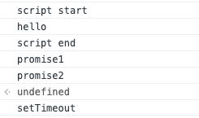

注意一下.then方法其实实在第一次函数运行的过程中就执行，所以两个.then方法其实一开始就运行了并把回调函数加入到了微任务队列。所以script end输出了就输出promise1 promise2

4. nextTick方法

Vue 在更新 DOM 时是**异步**执行的。只要侦听到数据变化，Vue 将开启一个队列，并缓冲在同一事件循环中发生的所有数据变更。如果同一个 watcher 被多次触发，只会被推入到队列中一次。这种在缓冲时去除重复数据对于避免不必要的计算和 DOM 操作是非常重要的。然后，在下一个的事件循环“tick”中，Vue 刷新队列并执行实际 (已去重的) 工作。Vue 在内部对异步队列尝试使用原生的 `Promise.then`、`MutationObserver` 和 `setImmediate`，如果执行环境不支持，则会采用 `setTimeout(fn, 0)` 代替。

例如，当你设置 `vm.someData = 'new value'`，该组件不会立即重新渲染。当刷新队列时，组件会在下一个事件循环“tick”中更新。多数情况我们不需要关心这个过程，但是如果你想基于更新后的 DOM 状态来做点什么，这就可能会有些棘手。虽然 Vue.js 通常鼓励开发人员使用“数据驱动”的方式思考，避免直接接触 DOM，但是有时我们必须要这么做。为了在数据变化之后等待 Vue 完成更新 DOM，可以在数据变化之后立即使用 `Vue.nextTick(callback)`。这样回调函数将在 DOM 更新完成后被调用。例如：

```js
var vm = new Vue({
  el: '#example',
  data: {
    message: '123'
  }
})
vm.message = 'new message' // 更改数据
vm.$el.textContent === 'new message' // false
Vue.nextTick(function () {
  vm.$el.textContent === 'new message' // true
})
```

因为 `$nextTick()` 返回一个 `Promise` 对象，所以你可以使用新的 [ES2017 async/await](https://developer.mozilla.org/zh-CN/docs/Web/JavaScript/Reference/Statements/async_function) 语法完成相同的事情：

```js
methods: {
  updateMessage: async function () {
    this.message = '已更新'
    console.log(this.$el.textContent) // => '未更新'
    await this.$nextTick()
    console.log(this.$el.textContent) // => '已更新'
  }
}
```

注意$el是指这个vue实例所绑定的真实的DOM节点，并且该方法返回的是一个promise实例。

5. 你在vue的使用过程中遇到的问题？

Vue不能直接监听数组的以下变动：

1. 当你利用索引直接设置一个数组项时，例如：`vm.items[indexOfItem] = newValue`
2. 当你修改数组的长度时，例如：`vm.items.length = newLength`

为了解决第一类问题，以下两种方式都可以实现和 `vm.items[indexOfItem] = newValue` 相同的效果，同时也将在响应式系统内触发状态更新：

```js
// Vue.set
Vue.set(vm.items, indexOfItem, newValue)//全局方法
vm.$set(vm.items, indexOfItem, newValue)//组件上的方法
// Array.prototype.splice
vm.items.splice(indexOfItem, 1, newValue)//vue自己实现的splice方法
```

Vue不能直接监听对象属性的添加和移除：

```js
var vm = new Vue({
  data:{
    a:1
  }
})

// `vm.a` 是响应式的

vm.b = 2
// `vm.b` 是非响应式的
```

解决方法：

```js
Vue.set(vm.someObject, 'b', 2)
this.$set(this.someObject,'b',2)
```

Vue不能直接使用Object.assign方法把一个对象上的多个属性放到响应式的对象中：

```js
Object.assign(this.someObject, { a: 1, b: 2 })//不是响应式的
```

解决方法：

```js
this.someObject = Object.assign({}, this.someObject, { a: 1, b: 2 })//给一个新的target对象
```

6. 怎么检查平时遇到的错误？
* 首先看console的报错，一般就可以根据报错解决

* 解决不了就上官网查，或者stackoverflow

* 再不行一般就是代码逻辑有问题，打断电调试
7. Vue.set方法的原理？

主要是调用了defineReactive方法对新增的属性进行了一个响应式的处理，new了一个dep来监听管理这个属性的变化，通过Object.defineProperty方法来劫持这个指的更新通知dep实例，dep实例通知依赖这个值的watchers进行update的操作。

```js
Object.defineProperty(obj,'property',{
    get:function(){
        return 
    },
    set:function(){
        return 
    }
})
```

8. 判断一个数字是不是回文数,可能有正负号

```js
function isPalindrom(x) {
    let str = x + '';
    if(!isNumber(str[0])){
        return false;
    }
    let l = 0;
    let r = str.length - 1;
    while(l < r){
        if(str[l] === str[r]){
            l++;
            r--;
        }else{
            return false;
        }
    }
    return true;
    function isNumber(s){
        return !isNaN(parseInt(s));
    }
}
```

### 腾讯二面

1. localStorage的持久登录
* login之后把tocken存在localStorage中
* store的tocken初始值也从localStorage中获取
* 第一次如果没有登陆但是login为false，就自动发送登陆请求自动登录
* 如果请求成功就是成功，失败了就清空localStorage，显示错误

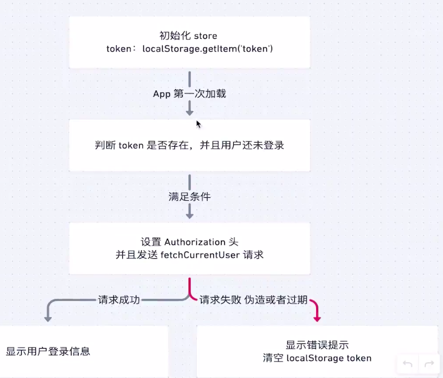

### 字节二面

1. 路由优化具体是做什么的？

首先梳理了组件逻辑，重新对不同路由进行逻辑上的命名优化，减少子路由的嵌套。

2. 学到了什么？

沟通，团队协作开发，应该在项目之前讨论命名规范，梳理项目逻辑。

3. Eslint和prettier区别？
* Eslint不仅可以可以对代码的语法进行判断然后通过eslint --fix进行自动修改，还可以自定义代码风格

* Prettier只能对做到代码风格的统一，并且不支持灵活的自定义代码风格
4. 虚拟DOM你了解吗？
* 虚拟DOM是什么？

virtual dom实际上是对真实的DOM的映射，是使用JS对象来重构一个DOM从而表达DOM的节点关系和信息

* 为什么要使用虚拟DOM？

virtual DOM实际上是规范了对DOM的操作。由于对DOM的操作过程实际上都转换为了对虚拟DOM的操作，最后再统一patch渲染。这相当于操作JS，使得中间的操作步骤会变得很快。由于DOM的操作比较costly，不仅是因为一些DOM的操作会直接引发浏览器的styleRecomputation和layout(详见浏览器)，还因为DOM本来就只是一个js和浏览器交互的API，交流的过程中本来就会有很多交流的cost.

* 虚拟DOM一定好吗？

也不是，因为构建虚拟DOM本身也有开销，包括diff对比前后的虚拟节点和patching或者是每次创建虚拟DOM都会有时间损耗。所以对于性能有极致要求的项目并不适合使用虚拟DOM。

* 虚拟DOM是怎样避免回流重绘以及减少操作DOM从而提高性能的？

从两个方面来讲，

一是虚拟DOM的使用避免了直接在DOM上的操作，每次操作实际上都是在操作Vue的实例对象中的数组，然后监听更新生成对应的vnode进行DOM的构建

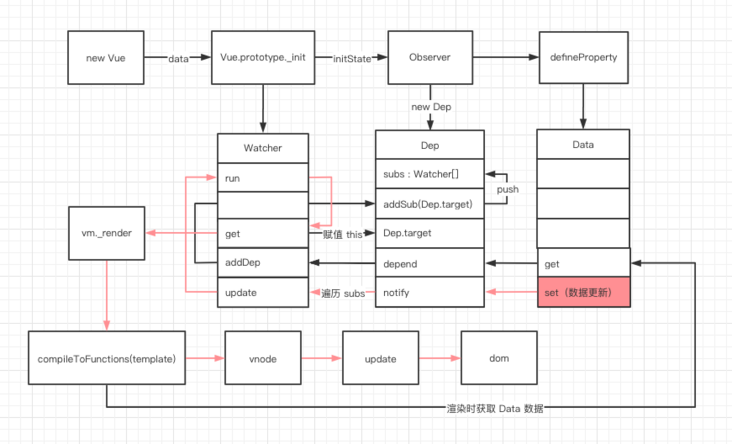

二是虚拟DOM在处理数据更新的时候采用了异步更新的策略，使得所有的更新一次性被更新到真实的DOM上

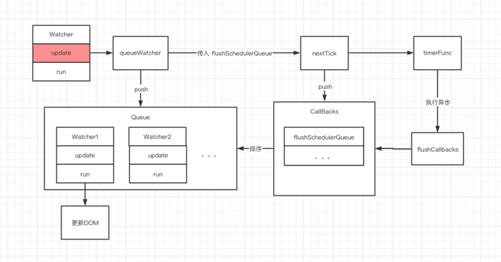

5. Vue3和2的区别？
* vue3使用proxy，可以监听对象的所有行为而不是属性，vue2只是使用了object.defineProperty，只能对已经有的数据进行拦截放入dep,所以vue3可以响应式的监听object的新属性和数组长度变化

* **基于 proxy 的响应侦测**
  
  - **Proxy 的优势如下:**
    
    - Proxy 可以直接监听对象而非属性；
    - Proxy 可以直接监听数组的变化；
    - Proxy 有多达 13 种拦截方法,不限于 apply、ownKeys、deleteProperty、has 等等是 Object.defineProperty 不具备的；
    - Proxy 返回的是一个新对象,我们可以只操作新的对象达到目的,而 Object.defineProperty 只能遍历对象属性直接修改；
    - Proxy 作为新标准将受到浏览器厂商重点持续的性能优化，也就是传说中的新标准的性能红利；
    
    **Object.defineProperty 的优势如下:**
    
    - 兼容性好，支持 IE9，而 Proxy 的存在浏览器兼容性问题,而且无法用 polyfill 磨平，因此 Vue 的作者才声明需要等到下个大版本( 3.0 )才能用 Proxy 重写。

* 生命周期的区别
  
  Vue2--------------vue3 
  
  beforeCreate  -> setup() 
  
  created       -> setup() 
  
  beforeMount   -> onBeforeMount 
  
  mounted       -> onMounted 
  
  beforeUpdate  -> onBeforeUpdate 
  
  updated       -> onUpdated 
  
  beforeDestroy -> onBeforeUnmount 
  
  destroyed     -> onUnmounted 
  
  activated     -> onActivated 
  
  deactivated   -> onDeactivated 
  
  errorCaptured -> onErrorCaptured

* 全局API的区别
  
  * 全局对象上的方法单独export便于tree shaking

* v-model实现不同

* 新增一些API,比如teleport
6. 写一个秒针，用CSS动画实现

```js
<!DOCTYPE html>
<html lang="en">
<head>
    <meta charset="UTF-8">
    <meta name="viewport" content="width=device-width, initial-scale=1.0">
    <title>Document</title>
</head>
<body>
    <style>
        #clock{
            width:500px;
            height:500px;
        }
        #second{
            width:2px;
            height:100%;
            background-color:black;
            margin:auto;
            animation:rotate 60s linear;
        }
    @keyframes rotate{
        0%{
            transform:rotate(0deg);
        }
        100%{
            transform:rotate(360deg);
        }
    }
    </style>
    <div id='clock'>
        <div id='second'> </div>
    </div>
</body>
</html>
```

7. 假设有一排陷阱，每个陷阱里面有一定数量的米，如果老鼠同时偷吃了连续两个相邻陷阱里面的米，就会导致陷阱触发，写一个函数计算老鼠能吃到的最多的米：
   
   eg:
   
   input: [2,33,5,12,56,7,4,90] 33+56+90
   
   output: 179

```js
//可以只用两个变量从而进行空间优化
function eatMost(arr){
      if(arr.length === 0) return 0;    
    let dp = new Array(arr.length).fill(0);
    for(let i = 0;i < arr.length;i++){
        if(i === 0){
            dp[i] = arr[i];
        }else if(i === 1){
            dp[i] = Math.max(dp[0],arr[i]);
        }else{
           dp[i] = Math.max(dp[i-1],dp[i-2] + arr[i]);
        }
    }
    return dp[arr.length - 1];
}

console.log(eatMost([2,33,5,12,56,7,4,90]));
```

### 虾皮笔试

1. 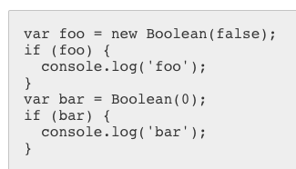

输出foo,因为new Boolean生成一个对象，但是Boolean()只是把一个值布尔化，而0对应false,别的数字对应true

2. 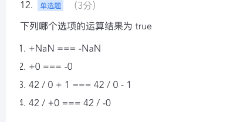

NaN === NaN => false NaN和谁都不想等

+0 === -0 => true

42/0 => Infinity => Infinity + 1 => Infinity === 42/0 => Infinity => Infinity - 1 => Infinity 因为Infinity等于Infinity所以最后返回true

42 / +0 => +Infinity 42/-0 => -Infinity 因为+Infinity不等于-Infinity所以返回false

3. 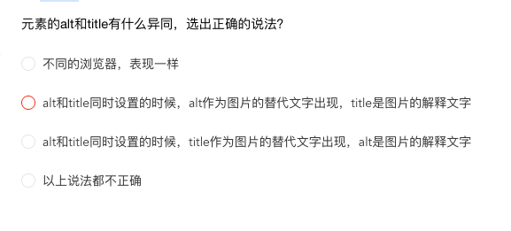

Title

* HTML有title的元素，用来定义浏览器的tab上的信息
* 也可以是元素的一个属性值，即悬浮在这个元素上显示的文本框信息

alt

* 而alt属性只能用在img、area和input元素中，用于网页中图片无法正常显示时给用户提供文字说明使其了解图像信息。alt是替代图像作用而不是提供额外说明文字的。所以只有当图挂了才显示

但是在旧版本的IE浏览器中，鼠标经过图像时显示的提示文字是alt的内容，而忽略了title属性。

4. 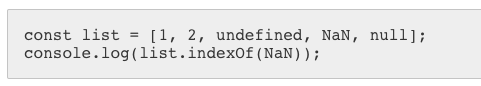

返回-1,因为NaN和自己也不相等，所以找不到

### 美团一面

1. 线程和进程？

2. 生产者消费者模型？

3. 发布订阅模式是什么？

4. 数据库事务的特性？

5. sql注入是什么？

6. 完整的http请求？

7. 长连接短连接？

8. 满二叉树
   
   节点要不然就有两个子节点，要不然就是叶子节点

9. 快排

10. 单行文本出现省略号

```css
        .text1{
            width: 200px;
            white-space: nowrap;
            text-overflow: ellipsis;
            overflow: hidden;
        }
```

11. 布局，左右定宽，高度满屏，中间自适应高度自适应

使用float:

```html
<style>
    html,body{
        height: 100%;
    }
    #left{
        float: left;
        width: 200px;
        height: 100%;
        background-color: aqua;
    }
    #right{
        float: right;
        width: 200px;
        height: 100%;
        background-color: black;
    }
    center{
        overflow: hidden;
        background-color: blue;
    }
</style>

<body>
    <div id='left'></div>
    <div id='right'></div>
    <div id='center'>123123</div>
</body>
```

使用flex:

```html
<style>
/* 对父容器使用absolute占满整个屏幕*/  
    #container{
        position: absolute;
        top: 0;
        bottom: 0;
        display: flex;
        width: 100%;
    }
  /*注意所有flex中的子容器的高度都会自动占满整个容器*/
    #left{
        flex-basis: 200px;
        height: 100%;
        background-color: aqua;
    }
    #right{
        flex-basis: 200px;
        height: 100%;
        background-color: black;
    }
    #center{
        flex: auto;
        background-color: blue;
    }
  /*所以这个地方用一个center-content实现了中栏的高度自适应*/
    #center-content{
        background-color: brown;
    }
</style>

<body>
    <div id='container'>
        <div id='left'></div>
        <div id='center'>
            <div id='center-content'>123123</div>
        </div>
        <div id='right'></div>
    </div>
</body>
```

12. 取三个0-10之间的随机正整数

```js
function getRandoms(count,from,to){
    let arr = [];

    for(let i = 0;i < count;i++){
        arr.push(Math.floor(Math.random() * (to - from)) + from);
    }
    return arr;

}

console.log(getRandoms(3,0,10));
```

13. Vue中使用:key的意义是什么？

由于Vue使用diff算法来进行对比检测同层级的组件是否更新，如果没有key就只会依次对比同级的元素是否发生变化，如果发生变化就会进行替换更新的操作，而加上了一个key就是加上了一个唯一标示，让组件的更新更有效率。

https://www.zhihu.com/question/61064119

### 虾皮一面

1. 数据库的索引是什么，优缺点？
2. Mysql按序的关键字

BY ORDER 

3. http2.0比之前的版本的改进？
4. 为什么要进行TCP三次握手？
5. 内存中的堆和栈的区别？

堆：保存引用数据类型

栈：代码执行，基本数据类型的保存，引用地址的保存

栈的效率更高，更贵

6. 发布订阅模式是什么？和观察者模式的区别？
7. 防抖

```js
function throlle (func,time){
  let timer = null;
  return (...args)=>{
    clearTimeout(timer);
    if(!timer){
      func.apply(this,...args);
    }
    timer = setTimeout(()=>{
        timer = null;
    },time)
  }
}
```

### 网易一面

1. 两边宽度固定，高度自适应的三列布局
2. 不定宽高的水平垂直居中
3. 文字和icon的水平居中对齐

文字：line-height:父元素高度    注意line-height的百分比相对于自己的font-size所以只能手动设置为父元素的高度

Icon:vertical-align:middle   

但是这样其实是没有严格的水平对齐，其实图片会稍微偏下，所以一般要让一个不定高的inline-block图片垂直居中要让这个盒子中的font-size为0

4. setTimeout函数的this指向？

几个例子：

```js
let a = {
  fn(){
      setTimeout(function(){
        console.log(this);
      },0)
  }
}
a.fn();//=>指向window

let b = {
  fn(){
      setTimeout(()=>{console.log(this)},0)
  }
}
b.fn();//=>指向b


let c = {
  fn(){
      console.log(this);
  }
}
setTimeout(c.fn,0);//=>window
c.fn();//=>c

let d = {
    fn:()=>{
        console.log(this);
    }
}
setTimeout(d.fn,0);//=>window
d.fn();//=>window
```

传统函数的this由如下规则定义：

* 函数前的.是谁指向谁，没有.就直接指向window
  * 只需要注意setTimeout中执行的obj.fn的形式最后还是指向window
* 绑定事件的函数指向绑定的DOM元素
* new指向生成的对象

箭头函数中的this由自己的作用域决定：

* 由于箭头函数没有this,所以在执行的时候自然不能创建this,只能通过作用域链向上查找父级别作用域的this。所以如果父级作用域是全局就指向window
5. 什么是闭包？
6. $nextTick的应用
7. 算法题：二分查找最后一个小于等于target的数组下标

```js
function find(arr,target){
  let l = 0;
  let h = arr.length - 1；
  while(l < h){
    let mid = Math.floor((l + h) / 2);
    if(arr[mid] > target){
      h = mid - 1;//注意这个地方要-1因为一旦大于target就不再可能是这个mid
    }else if(arr[mid] <= target){
      l = mid;
    }
  }
  return l;
}
```