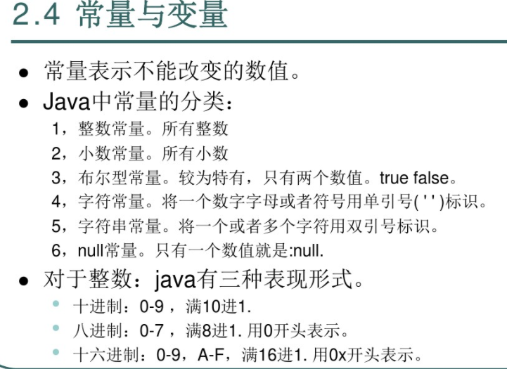
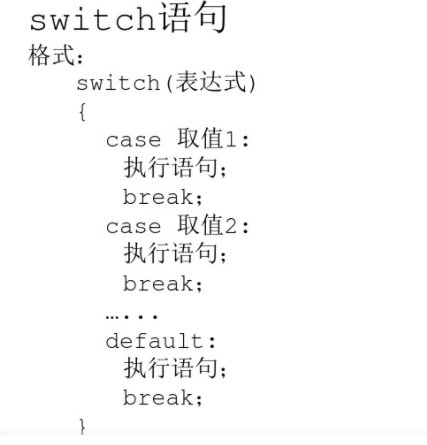

#Java

@(JAVA)

### Java跨平台

#### 跨平台底层原理
在不同的操作系统中装JVM（Java Visual Machine）去编译Java
但是JVM不跨平台，所以不同操作系统要做不同的JVM

### Java语言环境搭建
#### JRE，JDK

JRE： JVM+类库
JDK：JRE+JAVA的开发工具
#### 安装

### JDK中命令行工具
不是图形化界面工具，是命令行工具，只能在cmd中打开
#### 命令行简介


d: 进入D盘
dir 看目录
cd  （change directory）进入目录
cd jdk* 进入第一个模糊查询结果
cd.. 回退
cd\ 退根目录
md abd 新建文件夹
rd asa 删除文件夹（在windows中只能删除空文件夹，所以在图形化界面中是从里向外删除）
del 删除文件 
exit 退出
Help 查找全部的命令行
help cd 查找cd的全部用法
#### 环境变量配置
##### 1.概念
为了在在任何目录下都可以执行某些应用程序，先找所在的目录，如果没有的话就在环境变量中的Path中依次找，不同路径用;分割
记得要重启
##### 2.配置
 JAVA_HOME为一个环境变量值
JAVA\_HOME=E:\JavaJDK\jdk1.6.0_31  给环境变量赋值
path=%JAVA_HOME%\bin;      //拿到这个环境变量值
##### 3.临时配置


set 获取所有系统变量
set path 查看环境变量
set path=hahah 只在当前窗口临时改变path并不会影响本机
set path=    临时清空path的值
set path=E:\JavaJDK\jdk1.0\bin;%path%
拼接path变量值

###  Java开发
####  Java基础
* .java结尾的java文件
```
class Demo{
    public static void main(String[] args){
	    System.out.println("hello,wold");//ln最后有回车
    }
}
```
* 要利用javac (java complie)工具编译，有语法错误会被发现
javac 123.java 命令行执行.java文件
* 然后生成一个类文件会被虚拟机执行，该文件名为 类名.class
* 然后用java工具运行类文件 java Demo （可以不加.class）

注意：
1. 一个程序的入口为主函数，被虚拟机调用，没有主函数就报错,有它保证一个程序的独立运行
2. 123.java.text 隐藏文件拓展名后看不到text会认为这是java文件
#### classPath环境变量
在当前路径下去运行非当前路径下的java可执行文件
* 没有分号
set classpath=c:\myclass
规定虚拟机在哪里执行java可执行文件，如果没有配置，就在当前目录查找，如果找不到报错

* 有分号
set classpath=c:\myclass;
若规定目录找不到，则继续在当前目录找，找不到再报错

set classpath=.;c:\myclass 就可以设置当前路径

注意：
1. 命令行中设置classpath是临时设置
#### 基本语法





[Alt text](1597818875444.png)


#### 函数
java中的函数的定义格式：  
修饰符 返回值类型 函数名(参数类型 形式参数1，)
{   执行语句；   
	return 返回值；  
	}
主函数：  
1）、保证该类的独立运行。  
2）、因为它是程序的入口。  
3）、因为它在被jvm调用。

重载：
在一个类中，如果出现了两个或者两个以上的同名函数，只要它们的参数的个数，或者参数的类型不同，即可称之为该函数重载了。
如何区分重载：当函数同名时，只看参数列表。和返回值类型没关系。

数组：
1）、元素类型[] 变量名 = new 元素类型[元素的个数]； 
2）、元素类型[] 变量名 = {元素1，元素2...}； 
			元素类型[] 变量名 = new 元素类型[]{元素1，元素2...}；

java分了5片内存。 1：寄存器。2：本地方法区。3：方法区。4：栈。5：堆。 
栈：存储的都是局部变量 ( 函数中定义的变量，函数上的参数，语句中的变量 )；  只要数据运算完成所在的区域结束，该数据就会被释放。 
堆：用于存储数组和对象，也就是实体。啥是实体啊？就是用于封装多个数据的。 1：每一个实体都有内存首地址值。 2：堆内存中的变量都有默认初始化值。因为数据类型不同，值也不一样。  3：垃圾回收机制。
#### 面向对象
##### 基本概念
1.匿名对象使用场景：
* 当对方法只进行一次调用的时候，可以使用匿名对象。 
* 当对象对成员进行多次调用时，不能使用匿名对象。必须给对象起名字。
2.成员有两种： 
* 成员变量：其实对应的就是事物的属性。 
* 成员函数：其实对应的就是事物的行为。
3.私有属性
private int age;//私有的访问权限最低，只有在本类中的访问有效。
私有的成员：其他类不能直接创建对象访问，所以只有通过本类对外提供具体的访问方式来完成对私有的访问，可以通过对外提供函数的形式对其进行访问。 
好处：可以在函数中加入逻辑判断等操作，对数据进行判断等操作。  
总结：开发时，记住，属性是用于存储数据的，直接被访问，容易出现安全隐患，所以，类中的属性通常被私有化，并对外提供公共的访问方法。 
这个方法一般有两个，规范写法：对于属性 xxx，可以使用setXXX(),getXXX()对其进行操作。

4.类中怎么没有定义主函数呢？ 
注意：主函数的存在，仅为该类是否需要独立运行，如果不需要，主函数是不用定义的。 
主函数的解释：保证所在类的独立运行，是程序的入口，被jvm调用。

5.成员变量和局部变量的区别： 
1：成员变量直接定义在类中。    局部变量定义在方法中，参数上，语句中。 
2：成员变量在这个类中有效。 局部变量只在自己所属的大括号内有效，大括号结束，局部变量失去作用域。 
3：成员变量存在于堆内存中，随着对象的产生而存在，消失而消失。 局部变量存在于栈内存中，随着所属区域的运行而存在，结束而释放。

##### 构造函数


用于给对象进行初始化，是给与之对应的对象进行初始化，它具有针对性，函数中的一种。
特点： 1：该函数的名称和所在类的名称相同，必须相同
			 2：不能定义返回值类型。 
			 3：该函数没有具体的返回值。
			 4：首字母大写
 
 注意事项：
 
* 一个类在定义时，如果没有定义过构造函数，那么该类中会自动生成一个空参数的构造函数，为了方便该类创建对象，完成初始化。如果在类中自定义了构造函数，那么默认的构造函数就没有了。
* 一个类中，可以有多个构造函数，因为它们的函数名称都相同，所以只能通过参数列表来区分。所以，一个类中如果出现多个构造函数。它们的存在是以重载体现的。若不是重载则会被后面的覆盖
* 构造函数和一般函数有什么区别呢？ 
1：两个函数定义格式不同。 
2：构造函数是在对象创建时，就被调用，用于初始化，而且初始化动作只执行一次。     一般函数，是对象创建后，需要调用才执行，可以被调用多次。 			 

*定义构造函数
重载定义构造函数


[Alt text](1597821787737.png)

* 构造函数运行时的内存过程

创建一个对象都在内存中做了什么事情？ 
1：先将硬盘上指定位置的Person.class文件加载进内存。 
2：执行main方法时，在栈内存中开辟了main方法的空间(压栈-进栈)，然后在main方法的栈区分配了一个变量p。 
3：在堆内存中开辟一个实体空间，分配了一个内存首地址值。new 4：在该实体空间中进行属性的空间分配，并进行了默认初始化。 5：对空间中的属性进行显示初始化。
6：进行实体的构造代码块初始化。 
7：调用该实体对应的构造函数，进行构造函数初始化。（） 
8：将首地址赋值给p ，p变量就引用了该实体。(指向了该对象)

##### this

* 哪个对象实例调用了this所在的函数，this就代表哪个对象，就是哪个对象的引用。


* this 还可以用于构造函数间的调用
调用格式：this(实际参数)； 

this对象后面跟上 .  调用的是成员属性和成员方法(一般方法)； 
this对象后面跟上 () 调用的是本类中的对应参数的构造函数。

注意：用this调用构造函数，必须定义在构造函数的第一行。因为构造函数是用于初始化的，所以初始化动作一定要执行。否则编译失败。

##### static
关键字，是一个修饰符，用于修饰成员(成员变量和成员函数)
* 特点
	* 将对象实例中的共有相同数据共享
	* 被静态修饰的成员，可以直接被类名所调用。也就是说，静态的成员多了一种调用方式。类名.静态方式（当然也可以对象.静态方式）
	* 静态随着类的加载而加载。而且优先于对象存在
* 弊端
	* 有些数据是对象特有的数据，是不可以被静态修饰的。因为那样的话，特有数据会变成对象的共享数据。这样对事物的描述就出了问题。所以，在定义静态时，必须要明确，这个数据是否是被对象所共享的。
	* 静态方法只能访问静态成员，不可以访问非静态成员。 因为静态方法加载时，优先于对象存在，所以没有办法访问对象中的成员。
	* 静态方法中不能使用this，super关键字。 因为this代表对象，而静态在时，有可能没有对象，所以this无法使用。
	* 主函数是静态的。

* 成员变量和静态变量的区别：
1，成员变量所属于对象。所以也称为实例变量。 静态变量所属于类。所以也称为类变量。 
2，成员变量存在于堆内存中。 静态变量存在于方法区中。 
3，成员变量随着对象创建而存在。随着对象被回收而消失。 静态变量随着类的加载而存在。随着类的消失而消失。 
4，成员变量只能被对象所调用 。 静态变量可以被对象调用，也可以被类名调用。 
**所以，成员变量可以称为对象的特有数据，静态变量称为对象的共享数据。** 

* 静态代码块

```
static{
	
}
```
静态代码块：就是一个有静态关键字标示的一个代码块区域。定义在类中。 
作用：可以完成类的初始化。静态代码块随着类的加载而执行，而且只执行一次（new 多个对象就只执行一次）。如果和主函数在同一类中，优先于主函数执行


注意：如果一个类中的所有方法都是静态的方法，当然就没有必要创建一个对象来调用改方法，可以直接用private定义构造函数使得用户不能new一个对象


* 提取文档注释工具

##### 设计模式
 单例设计模式
	解决的问题:保证一个类在内存中的对象唯一性
	
	必须对于多个程序使用同一个配置信息对象时，就需要保证该对象的唯一性

	怎么保证对象唯一性？
	* 不允许其他程序用new创建该类对象
	* 在该类中创建一个本类实例
	* 对外提供一个方法让其他程序可以获取该对象
步骤：
* 私有化该类构造函数
* 通过new在本类中创建一个本类对象
* 定义一个共有的方法，将创建的对象返回

* 饿汉式

```
class Single{  
	private Single(){} //私有化构造函数。 
	private static Single s = new Single(); //创建私有并静态的本类对象。  
	public static Single getInstance(){ //定义公有并静态的方法，返回该对象。   
		return s;  
		} 
	} 
```
*懒汉式:延迟加载方式。
class Single2{ 
		private Single2(){} 
		private static Single2 s = null;  
		public static Single2 getInstance(){   
			if(s==null)   s = new Single2();   
			return s;  
			} 
		} 

##### 继承

 

    class Student extends Person{
    }


JAVA只能继承一个父类，即单继承，但是可以多重继承，即父类也可以有父类。

* 继承特点
1：成员变量。 

当子父类中出现一样的属性时，子类类型的对象，调用该属性，值是子类的属性值。   
如果想要调用父类中的属性值，需要使用一个关键字：super    
This：代表是本类类型的对象引用。   this.num
Super：代表是子类所属的父类中的内存空间引用。   super.num

注意：子类不能直接访问父类的私有内容，但可以通过一个get方法

2：成员函数


当子父类中出现了一模一样的方法时，建立子类对象会运行子类中的方法。好像父类中的方法被覆盖掉一样。所以这种情况，是函数的另一个特性：覆盖(复写，重写) 
什么时候使用覆盖呢？当一个类的功能内容需要修改时，可以通过覆盖来实现。

在方法覆盖时，注意两点： 
1：子类覆盖父类时，必须要保证，子类方法的权限必须大于等于父类方法权限可以实现继承。否则，编译失败。  即父类是public, 子类必须也是至少public
2：覆盖时，要么都静态，要么都不静态。 (静态只能覆盖静态，或者被静态覆盖) 

3:子类中构造函数中的特点
* 在子类构造对象时，发现，访问子类构造函数时，父类也运行了。
原因：在子类的构造函数中第一行有一个默认的隐式语句。 super();
如果要执行父类的super就要自己写上super(12);


* 构造函数不继承，不覆盖

* 为什么要用super
因为子类继承父类，会继承到父类中的数据，所以必须要看父类是如何对自己的数据进行初始化的。

* 注意
	* super语句必须要定义在子类构造函数的第一行
	* super()和this()只能有一个定义在第一行，所以只能出现其中一个，但是可以从this()进去一个构造函数再访问一个父类的构造函数
	* 
* 一个例题


* 一个对象的实例化过程
	* JVM会读取指定路径下的
