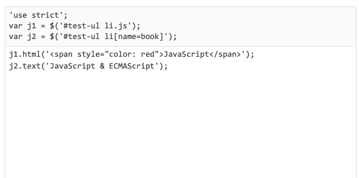

# JQuery

@(前端框架)

## 选择器
### 按ID查找

```
// 查找<div id="abc">:
var div = $('#abc');
```
注意，#abc以#开头。返回的对象是jQuery对象。
### JQuery对象
什么是jQuery对象？jQuery对象类似数组，它的每个元素都是一个引用了DOM节点的对象。

以上面的查找为例，如果id为abc的<div>存在，返回的jQuery对象如下：

```
[<div id="abc">...</div>]
```

如果id为abc的<div>不存在，返回的jQuery对象如下：

```
[]
```

总之jQuery的选择器不会返回undefined或者null，这样的好处是你不必在下一行判断if (div === undefined)。

jQuery对象和DOM对象之间可以互相转化：

```
var div = $('#abc'); // jQuery对象
var divDom = div.get(0); // 假设存在div，获取第1个DOM元素
var another = $(divDom); // 重新把DOM包装为jQuery对象
```

通常情况下你不需要获取DOM对象，直接使用jQuery对象更加方便。如果你拿到了一个DOM对象，那可以简单地调用$(aDomObject)把它变成jQuery对象，这样就可以方便地使用jQuery的API了。
### 按tag查找

```
var ps = $('p'); // 返回所有<p>节点
ps.length; // 数一数页面有多少个<p>节点
```
### 按class查找
按class查找注意在class名称前加一个.：
```
var a = $('.red'); // 所有节点包含`class="red"`都将返回
// 例如:
// <div class="red">...</div>
// <p class="green red">...</p>
```
通常很多节点有多个class，我们可以查找同时包含red和green的节点：

```
var a = $('.red.green'); // 注意没有空格！
// 符合条件的节点：
// <div class="red green">...</div>
// <div class="blue green red">...</div>
```
### 按属性查找
一个DOM节点除了id和class外还可以有很多属性，很多时候按属性查找会非常方便，比如在一个表单中按属性来查找：

```
var email = $('[name=email]'); // 找出<??? name="email">
var passwordInput = $('[type=password]'); // 找出<??? type="password">
var a = $('[items="A B"]'); // 找出<??? items="A B">
```

当属性的值包含空格等特殊字符时，需要用双引号括起来。

按属性查找还可以使用前缀查找或者后缀查找：

```
var icons = $('[name^=icon]'); // 找出所有name属性值以icon开头的DOM
// 例如: name="icon-1", name="icon-2"
var names = $('[name$=with]'); // 找出所有name属性值以with结尾的DOM
// 例如: name="startswith", name="endswith"
```

这个方法尤其适合通过class属性查找，且不受class包含多个名称的影响：

```
var icons = $('[class^="icon-"]'); // 找出所有class包含至少一个以`icon-`开头的DOM
// 例如: class="icon-clock", class="abc icon-home"
```
### 组合查找
组合查找就是把上述简单选择器组合起来使用。如果我们查找$('[name=email]')，很可能把表单外的<div name="email">也找出来，但我们只希望查找<input>，就可以这么写：

```
var emailInput = $('input[name=email]'); // 不会找出<div name="email">
```

同样的，根据tag和class来组合查找也很常见：

```
var tr = $('tr.red'); // 找出<tr class="red ...">...</tr>
```
### 多项选择器
多项选择器就是把多个选择器用,组合起来一块选：

```
$('p,div'); // 把<p>和<div>都选出来
$('p.red,p.green'); // 把<p class="red">和<p class="green">都选出来
```

要注意的是，选出来的元素是按照它们在HTML中出现的顺序排列的，而且不会有重复元素。例如，<p class="red green">不会被上面的$('p.red,p.green')选择两次。
### 层级选择器
如果两个DOM元素具有层级关系，就可以用$('ancestor descendant')来选择，层级之间用空格隔开。例如：

```
<!-- HTML结构 -->
<div class="testing">
    <ul class="lang">
        <li class="lang-javascript">JavaScript</li>
        <li class="lang-python">Python</li>
        <li class="lang-lua">Lua</li>
    </ul>
</div>
```

要选出JavaScript，可以用层级选择器：

```
$('ul.lang li.lang-javascript'); // [<li class="lang-javascript">JavaScript</li>]
$('div.testing li.lang-javascript'); // [<li class="lang-javascript">JavaScript</li>]
```

因为<div>和<ul>都是<li>的祖先节点，所以上面两种方式都可以选出相应的<li>节点。

要选择所有的<li>节点，用：

```
$('ul.lang li');
```

这种层级选择器相比单个的选择器好处在于，它缩小了选择范围，因为首先要定位父节点，才能选择相应的子节点，这样避免了页面其他不相关的元素。

例如：

```
$('form[name=upload] input');
```

就把选择范围限定在name属性为upload的表单里。如果页面有很多表单，其他表单的<input>不会被选择。

多层选择也是允许的：

```
$('form.test p input'); // 在form表单选择被<p>包含的<input>
```

### 子选择器
子选择器$('parent>child')类似层级选择器，但是限定了层级关系必须是父子关系，就是<child>节点必须是<parent>节点的**直属子节点**。还是以上面的例子：

```
$('ul.lang>li.lang-javascript'); // 可以选出[<li class="lang-javascript">JavaScript</li>]
$('div.testing>li.lang-javascript'); // [], 无法选出，因为<div>和<li>不构成父子关系
```
### 过滤器
过滤器一般不单独使用，它通常附加在选择器上，帮助我们更精确地定位元素。观察过滤器的效果：

```
$('ul.lang li'); // 选出JavaScript、Python和Lua 3个节点

$('ul.lang li:first-child'); // 仅选出JavaScript
$('ul.lang li:last-child'); // 仅选出Lua
$('ul.lang li:nth-child(2)'); // 选出第N个元素，N从1开始
$('ul.lang li:nth-child(even)'); // 选出序号为偶数的元素
$('ul.lang li:nth-child(odd)'); // 选出序号为奇数的元素
```
### 表单相关

### 查找和过滤
通常情况下选择器可以直接定位到我们想要的元素，但是，当我们拿到一个jQuery对象后，还可以以这个对象为基准，进行查找和过滤。

最常见的查找是在某个节点的所有子节点中查找，使用find()方法，它本身又接收一个任意的选择器。

```
<!-- HTML结构 -->
<ul class="lang">
    <li class="js dy">JavaScript</li>
    <li class="dy">Python</li>
    <li id="swift">Swift</li>
    <li class="dy">Scheme</li>
    <li name="haskell">Haskell</li>
</ul>
```

```
用find()查找：
var ul = $('ul.lang'); // 获得<ul>
var dy = ul.find('.dy'); // 获得JavaScript, Python, Scheme
var swf = ul.find('#swift'); // 获得Swift
var hsk = ul.find('[name=haskell]'); // 获得Haskell
```
如果要从当前节点开始向上查找，使用parent()方法：

```
var swf = $('#swift'); // 获得Swift
var parent = swf.parent(); // 获得Swift的上层节点<ul>
var a = swf.parent('.red'); // 获得Swift的上层节点<ul>，同时传入过滤条件。如果ul不符合条件，返回空jQuery对象
```
对于位于同一层级的节点，可以通过next()和prev()方法，例如：
当我们已经拿到Swift节点后：

```
var swift = $('#swift');

swift.next(); // Scheme
swift.next('[name=haskell]'); // 空的jQuery对象，因为Swift的下一个元素Scheme不符合条件[name=haskell]

swift.prev(); // Python
swift.prev('.dy'); // Python，因为Python同时符合过滤器条件.dy
```
### 过滤
filter()方法可以过滤掉不符合选择器条件的节点：

```
var langs = $('ul.lang li'); // 拿到JavaScript, Python, Swift, Scheme和Haskell
var a = langs.filter('.dy'); // 拿到JavaScript, Python, Scheme
```
或者传入一个函数，要特别注意函数内部的this被绑定为DOM对象，不是jQuery对象：

```
var langs = $('ul.lang li'); // 拿到JavaScript, Python, Swift, Scheme和Haskell
langs.filter(function () {
    return this.innerHTML.indexOf('S') === 0; // 返回S开头的节点
}); // 拿到Swift, Scheme
```
map()方法把一个jQuery对象包含的若干DOM节点转化为其他对象：

```
var langs = $('ul.lang li'); // 拿到JavaScript, Python, Swift, Scheme和Haskell
var arr = langs.map(function () {
    return this.innerHTML;
}).get(); // 用get()拿到包含string的Array：['JavaScript', 'Python', 'Swift', 'Scheme', 'Haskell']
```
此外，一个jQuery对象如果包含了不止一个DOM节点，first()、last()和slice()方法可以返回一个新的jQuery对象，把不需要的DOM节点去掉：

```
var langs = $('ul.lang li'); // 拿到JavaScript, Python, Swift, Scheme和Haskell
var js = langs.first(); // JavaScript，相当于$('ul.lang li:first-child')
var haskell = langs.last(); // Haskell, 相当于$('ul.lang li:last-child')
var sub = langs.slice(2, 4); // Swift, Scheme, 参数和数组的slice()方法一致
```
## 操作DOM
回顾一下修改DOM的CSS、文本、设置HTML有多么麻烦，而且有的浏览器只有innerHTML，有的浏览器支持innerText，有了jQuery对象，不需要考虑浏览器差异了，全部统一操作！
### 修改Text和HTML
jQuery对象的text()和html()方法分别获取节点的文本和原始HTML文本，例如，如下的HTML结构：

```
<!-- HTML结构 -->
<ul id="test-ul">
    <li class="js">JavaScript</li>
    <li name="book">Java &amp; JavaScript</li>
</ul>
```
分别获取文本和HTML：

```
$('#test-ul li[name=book]').text(); // 'Java & JavaScript'
$('#test-ul li[name=book]').html(); // 'Java &amp; JavaScript'
```
如何设置文本或HTML？jQuery的API设计非常巧妙：无参数调用text()是获取文本，传入参数就变成设置文本，HTML也是类似操作

一个jQuery对象可以包含0个或任意个DOM对象，它的方法实际上会作用在对应的每个DOM节点上。

```
$('#test-ul li').text('JS'); // 是不是两个节点都变成了JS？
```
所以jQuery对象的另一个好处是我们可以执行一个操作，作用在对应的一组DOM节点上。即使选择器没有返回任何DOM节点，调用jQuery对象的方法仍然不会报错：

```
// 如果不存在id为not-exist的节点：
$('#not-exist').text('Hello'); // 代码不报错，没有节点被设置为'Hello'
```
这意味着jQuery帮你免去了许多if语句。

### 修改CSS
jQuery对象有“批量操作”的特点，这用于修改CSS实在是太方便了。考虑下面的HTML结构：

```
<!-- HTML结构 -->
<ul id="test-css">
    <li class="lang dy"><span>JavaScript</span></li>
    <li class="lang"><span>Java</span></li>
    <li class="lang dy"><span>Python</span></li>
    <li class="lang"><span>Swift</span></li>
    <li class="lang dy"><span>Scheme</span></li>
</ul>
```
要高亮显示动态语言，调用jQuery对象的css('name', 'value')方法，我们用一行语句实现：

```
$('#test-css li.dy>span').css('background-color', '#ffd351').css('color', 'red');
```
**注意**，jQuery对象的所有方法都返回一个jQuery对象（可能是新的也可能是自身），这样我们可以进行链式调用，非常方便。
jQuery对象的css()方法还可以这么用：

```
var div = $('#test-div');
div.css('color'); // '#000033', 获取CSS属性
div.css('color', '#336699'); // 设置CSS属性
div.css('color', ''); // 清除CSS属性
```
为了和JavaScript保持一致，CSS属性可以用'background-color'和'backgroundColor'两种格式。

css()方法将作用于DOM节点的style属性，具有最高优先级。如果要修改class属性，可以用jQuery提供的下列方法：

```
var div = $('#test-div');
div.hasClass('highlight'); // false， class是否包含highlight
div.addClass('highlight'); // 添加highlight这个class
div.removeClass('highlight'); // 删除highlight这个class
```
### 添加DOM
要添加新的DOM节点，除了通过jQuery的html()这种暴力方法外，还可以用append()方法，例如：

```
<div id="test-div">
    <ul>
        <li><span>JavaScript</span></li>
        <li><span>Python</span></li>
        <li><span>Swift</span></li>
    </ul>
</div>
```
向列表新增一个语言

```
var ul = $('#test-div>ul');
ul.append('<li><span>Haskell</span></li>');
```
除了接受字符串，append()还可以传入原始的DOM对象，jQuery对象和函数对象：

```
// 创建DOM对象:
var ps = document.createElement('li');
ps.innerHTML = '<span>Pascal</span>';
// 添加DOM对象:
ul.append(ps);

// 添加jQuery对象:
ul.append($('#scheme'));

// 添加函数对象:
ul.append(function (index, html) {
    return '<li><span>Language - ' + index + '</span></li>';
});
```
传入函数时，要求返回一个字符串、DOM对象或者jQuery对象。因为jQuery的append()可能作用于一组DOM节点，只有传入函数才能针对每个DOM生成不同的子节点。
**append()**把DOM添加到最后，**prepend()**则把DOM添加到最前。
另外注意，如果要添加的DOM节点已经存在于HTML文档中，它会首先从文档移除，然后再添加，也就是说，用append()，你可以移动一个DOM节点。
如果要把新节点插入到指定位置，例如，JavaScript和Python之间，那么，可以先定位到JavaScript，然后用after()方法：

```
var js = $('#test-div>ul>li:first-child');
js.after('<li><span>Lua</span></li>');
```
也就是说，同级节点可以用after()或者before()方法。
### 删除节点
要删除DOM节点，拿到jQuery对象后直接调用remove()方法就可以了。如果jQuery对象包含若干DOM节点，实际上可以一次删除多个DOM节点：

```
var li = $('#test-div>ul>li');
li.remove(); // 所有<li>全被删除
```
## 事件
因为JavaScript在浏览器中以单线程模式运行，页面加载后，一旦页面上所有的JavaScript代码被执行完后，就只能依赖触发事件来执行JavaScript代码。
由于不同的浏览器绑定事件的代码都不太一样，所以用jQuery来写代码，就屏蔽了不同浏览器的差异，我们总是编写相同的代码。
### 绑定事件
举个例子，假设要在用户点击了超链接时弹出提示框，我们用jQuery这样绑定一个click事件：

```
/* HTML:
 *
 * <a id="test-link" href="#0">点我试试</a>
 *
 */

// 获取超链接的jQuery对象:
var a = $('#test-link');
a.on('click', function () {
    alert('Hello!');
});
```
on方法用来绑定一个事件，我们需要传入事件名称和对应的处理函数。

另一种更简化的写法是直接调用click()方法：

```
a.click(function () {
    alert('Hello!');
});
```
### 能绑定的事件分类
#### 鼠标事件
click: 鼠标单击时触发；
dblclick：鼠标双击时触发；
mouseenter：鼠标进入时触发；
mouseleave：鼠标移出时触发；
mousemove：鼠标在DOM内部移动时触发；
hover：鼠标进入和退出时触发两个函数，相当于mouseenter加上mouseleave。
#### 键盘事件
键盘事件仅作用在当前焦点的DOM上，通常是<input>和<textarea>。

keydown：键盘按下时触发；
keyup：键盘松开时触发；
keypress：按一次键后触发。
#### 其他事件
focus：当DOM获得焦点时触发；
blur：当DOM失去焦点时触发；
change：当<input>、<select>或<textarea>的内容改变时触发；
submit：当<form>提交时触发；
ready：当页面被载入并且DOM树完成初始化后触发。
**注意：**
其中，ready仅作用于document对象。由于ready事件在DOM完成初始化后触发，且只触发一次，所以非常适合用来写其他的初始化代码。假设我们想给一个<form>表单绑定submit事件，下面的代码没有预期的效果：

```
<html>
<head>
    <script>
        // 不能达到预期效果弹出一个框:
        $('#testForm).on('submit', function () {
            alert('submit!');
        });
    </script>
</head>
<body>
    <form id="testForm">
        ...
    </form>
</body>
```
因为JavaScript在此执行的时候，<form>尚未载入浏览器，所以$('#testForm)返回[]，并没有绑定事件到任何DOM上。

所以我们自己的初始化代码必须放到document对象的ready事件中，保证DOM已完成初始化：

```
<html>
<head>
    <script>
        $(document).on('ready', function () {
            $('#testForm).on('submit', function () {
                alert('submit!');
            });
        });
    </script>
</head>
<body>
    <form id="testForm">
        ...
    </form>
</body>
```

由于ready事件使用非常普遍，所以可以这样简化：

```
$(document).ready(function () {
    // on('submit', function)也可以简化:
    $('#testForm).submit(function () {
        alert('submit!');
    });
});
```
甚至还可以再简化为：

```
$(function () {
    // init...
});
```
上面的这种写法最为常见。如果你遇到$(function () {...})的形式，牢记这是document对象的ready事件处理函数。

完全可以反复绑定事件处理函数，它们会依次执行：

```
$(function () {
    console.log('init A...');
});
$(function () {
    console.log('init B...');
});
$(function () {
    console.log('init C...');
});
```
### 事件参数
有些事件，如mousemove和keypress，我们需要获取鼠标位置和按键的值，否则监听这些事件就没什么意义了。所有事件都会传入Event对象作为参数，可以从Event对象上获取到更多的信息：

```
$(function () {
    $('#testMouseMoveDiv').mousemove(function (e) {
        $('#testMouseMoveSpan').text('pageX = ' + e.pageX + ', pageY = ' + e.pageY);
    });
});
```
### 取消绑定
一个已被绑定的事件可以解除绑定，通过off('click', function)实现：

```
function hello() {
    alert('hello!');
}

a.click(hello); // 绑定事件

// 10秒钟后解除绑定:
setTimeout(function () {
    a.off('click', hello);
}, 10000);
```
需要特别注意的是，下面这种写法是无效的：

```
// 绑定事件:
a.click(function () {
    alert('hello!');
});

// 解除绑定:
a.off('click', function () {
    alert('hello!');
});
```
这是因为两个匿名函数虽然长得一模一样，但是它们是两个不同的函数对象，off('click', function () {...})无法移除已绑定的第一个匿名函数。

为了实现移除效果，可以使用off('click')一次性移除已绑定的click事件的所有处理函数。

同理，无参数调用off()一次性移除已绑定的所有类型的事件处理函数。
### 事件触发条件
一个需要注意的问题是，事件的触发总是由用户操作引发的。例如，我们监控文本框的内容改动：

```
var input = $('#test-input');
input.change(function () {
    console.log('changed...');
});
```
当用户在文本框中输入时，就会触发change事件。但是，如果用JavaScript代码去改动文本框的值，将不会触发change事件：

```
var input = $('#test-input');
input.val('change it!'); // 无法触发change事件
```
有些时候，我们希望用代码触发change事件，可以直接调用无参数的change()方法来触发该事件：

```
var input = $('#test-input');
input.val('change it!');
input.change(); // 触发change事件
```
input.change()相当于input.trigger('change')，它是trigger()方法的简写。
### 浏览器安全限制
在浏览器中，有些JavaScript代码只有在用户触发下才能执行，例如，window.open()函数：

```
// 无法弹出新窗口，将被浏览器屏蔽:
$(function () {
    window.open('/');
});
```
这些“敏感代码”只能由用户操作来触发：

```
var button1 = $('#testPopupButton1');
var button2 = $('#testPopupButton2');

function popupTestWindow() {
    window.open('/');
}

button1.click(function () {
    popupTestWindow();
});

button2.click(function () {
    // 不立刻执行popupTestWindow()，3秒后执行:
    setTimeout(popupTestWindow, 3000);
});
```
当用户点击button1时，click事件被触发，由于popupTestWindow()在click事件处理函数内执行，这是浏览器允许的，而button2的click事件并未立刻执行popupTestWindow()，延迟执行的popupTestWindow()将被浏览器拦截。谷歌浏览器其实并不会拦截。
## AJAX
jQuery在全局对象jQuery（也就是$）绑定了ajax()函数，可以处理AJAX请求。ajax(url, settings)函数需要接收一个URL和一个可选的settings对象，常用的选项如下：
* async：是否异步执行AJAX请求，默认为true，千万不要指定为false；
* method：发送的Method，缺省为'GET'，可指定为'POST'、'PUT'等；
* contentType：发送POST请求的格式，默认值为'application/x-www-form-urlencoded; charset=UTF-8'，也可以指定为text/plain、application/json；
* data：发送的数据，可以是字符串、数组或object。如果是GET请求，data将被转换成query附加到URL上，如果是POST请求，根据contentType把data序列化成合适的格式；
* headers：发送的额外的HTTP头，必须是一个object；
* dataType：接收的数据格式，可以指定为'html'、'xml'、'json'、'text'等，缺省情况下根据响应的Content-Type猜测。
下面的例子发送一个GET请求，并返回一个JSON格式的数据：

```
var jqxhr = $.ajax('/api/categories', {
    dataType: 'json'
});
// 请求已经发送了
```
jQuery的jqXHR对象类似一个Promise对象，我们可以用链式写法来处理各种回调：

### get
对常用的AJAX操作，jQuery提供了一些辅助方法。由于GET请求最常见，所以jQuery提供了get()方法，可以这么写：

```
var jqxhr = $.get('/path/to/resource', {
    name: 'Bob Lee',
    check: 1
});
```
第二个参数如果是object，jQuery自动把它变成query string然后加到URL后面，实际的URL是：

```
/path/to/resource?name=Bob%20Lee&check=1
```
### post
post()和get()类似，但是传入的第二个参数默认被序列化为application/x-www-form-urlencoded：

```
var jqxhr = $.post('/path/to/resource', {
    name: 'Bob Lee',
    check: 1
});
```
实际构造的数据name=Bob%20Lee&check=1作为POST的body被发送。
### getJSON
由于JSON用得越来越普遍，所以jQuery也提供了getJSON()方法来快速通过GET获取一个JSON对象：

```
var jqxhr = $.getJSON('/path/to/resource', {
    name: 'Bob Lee',
    check: 1
}).done(function (data) {
    // data已经被解析为JSON对象了
});
```
### 安全限制 
jQuery的AJAX完全封装的是JavaScript的AJAX操作，所以它的安全限制和前面讲的用JavaScript写AJAX完全一样。

如果需要使用JSONP，可以在ajax()中设置jsonp: 'callback'，让jQuery实现JSONP跨域加载数据。
## 扩展
我们可以扩展jQuery来实现自定义方法。
### 编写jQuery插件
给jQuery对象绑定一个新方法是通过扩展$.fn对象实现的。让我们来编写第一个扩展——highlight1()：

```
$.fn.highlight1 = function () {
    // this已绑定为当前jQuery对象:
    this.css('backgroundColor', '#fffceb').css('color', '#d85030');
    return this;
}
```
注意到函数内部的this在调用时被绑定为jQuery对象，所以函数内部代码可以正常调用所有jQuery对象的方法。

对于如下的HTML结构：

```
<!-- HTML结构 -->
<div id="test-highlight1">
    <p>什么是<span>jQuery</span></p>
    <p><span>jQuery</span>是目前最流行的<span>JavaScript</span>库。</p>
</div>
$('#test-highlight1 span').highlight1();
```
为什么最后要return this;？因为jQuery对象支持链式操作，我们自己写的扩展方法也要能继续链式下去：

```
$('span.hl').highlight1().slideDown();
```
我们可以给方法加个参数，让用户自己把参数用对象传进去。于是我们有了第二个版本的highlight2()：

```
$.fn.highlight2 = function (options) {
    // 要考虑到各种情况:
    // options为undefined
    // options只有部分key
    var bgcolor = options && options.backgroundColor || '#fffceb';//&&options为假才返回自己，优先级比||高
    var color = options && options.color || '#d85030';
    this.css('backgroundColor', bgcolor).css('color', color);
    return this;
}
```
对于默认值的处理，我们用了一个简单的&&和||短路操作符，总能得到一个有效的值。

另一种方法是使用jQuery提供的辅助方法$.extend(target, obj1, obj2, ...)，它把多个object对象的属性合并到第一个target对象中，遇到同名属性，总是使用靠后的对象的值，也就是越往后优先级越高：

```
// 把默认值和用户传入的options合并到对象{}中并返回:
var opts = $.extend({}, {
    backgroundColor: '#00a8e6',
    color: '#ffffff'
}, options);
```
紧接着用户对highlight2()提出了意见：每次调用都需要传入自定义的设置，能不能让我自己设定一个缺省值，以后的调用统一使用无参数的highlight2()？

也就是说，我们设定的默认值应该能允许用户修改。

那默认值放哪比较合适？放全局变量肯定不合适，最佳地点是$.fn.highlight2这个函数对象本身。

于是最终版的highlight()终于诞生了：

```
$.fn.highlight = function (options) {
    // 合并默认值和用户设定值:
    var opts = $.extend({}, $.fn.highlight.defaults, options);
    this.css('backgroundColor', opts.backgroundColor).css('color', opts.color);
    return this;
}

// 设定默认值:
$.fn.highlight.defaults = {
    color: '#d85030',
    backgroundColor: '#fff8de'
}
```
这次用户终于满意了。用户使用时，只需一次性设定默认值：

```
$.fn.highlight.defaults.color = '#fff';
$.fn.highlight.defaults.backgroundColor = '#000';
```

最终，我们得出编写一个jQuery插件的原则：

1. 给$.fn绑定函数，实现插件的代码逻辑；
2. 插件函数最后要return this;以支持链式调用；
3. 插件函数要有默认值，绑定在$.fn.<pluginName>.defaults上；
4. 用户在调用时可传入设定值以便覆盖默认值。
