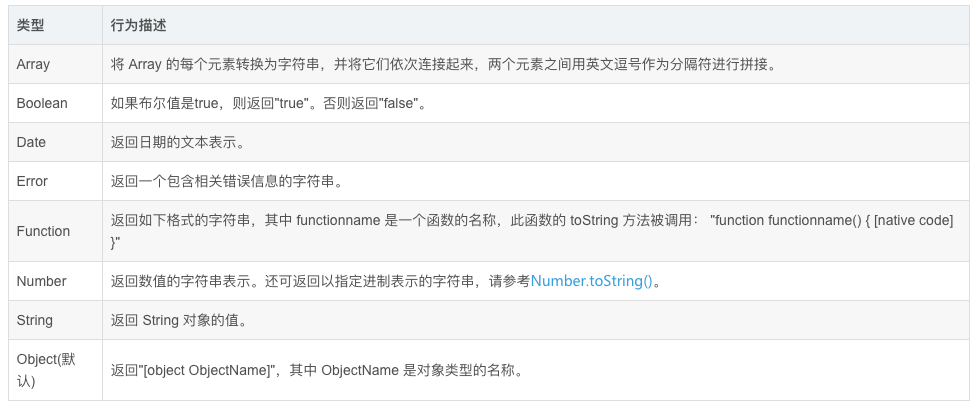
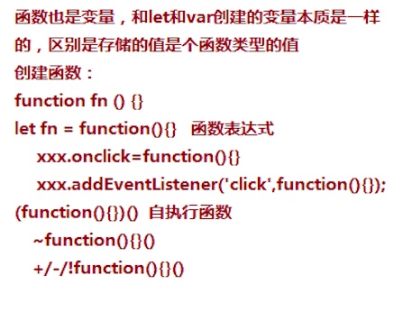
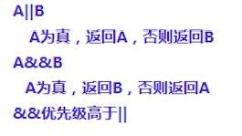
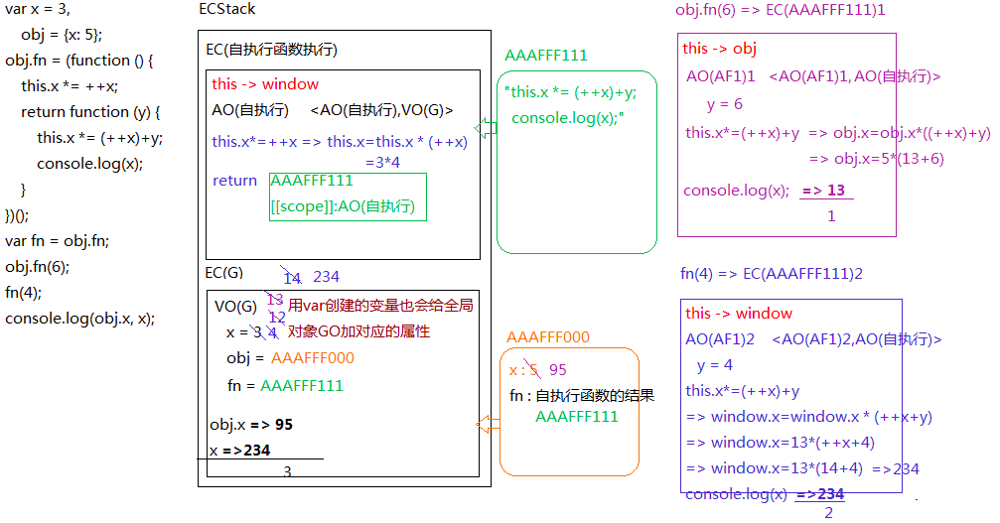
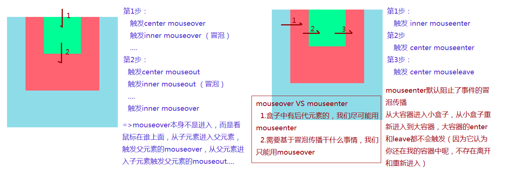

# JS知识点总结
## 1.数据类型及其类型检测
### 1.1数据类型
1. 基本数据类型
	- undefined
	- number
	- string
	- boolean
	- null
	- symbol(ES6新增)
	- BigInt(最新)
2. 引用数据类型
	- 对象
	- 正则
	- 数组
	- 日期
	- Math
	- 实例
	- function
### 1.2类型检测
**检测数据类型1：typeof**
返回结果都是字符串
字符串中包含了对应的数据类型  "number"/"string"/"boolean"/"undefined"/"symbol"/"object"/"function"
基本对象和函数可用这种方法，简单
【局限性】
**typeof null => "object"**   null不是对象，它是空对象指针
检测数据或者正则等特殊的对象，返回结果都是"object"，所以无法基于typeof判断是数据还是正则

***检测数据类型2/3：instanceof / constructor(是沿着原型链找到原型上的constructor)***
检测某个实例是否属于这个类
他检测的底层机制：所有出现在其原型链上的类，检测结果都是TRUE
【局限性】
由于可以基于__proto__或者prototype改动原型链的动向，所以基于instanceof检测出来的结果并不一定是准确的
基本数据类型的值，连对象都不是，更没有__proto__，虽说也是所属类的实例，在JS中也可以调取所属类原型上的方法，但是instanceof是不认的
例子：

```js
console.log(12 instanceof Number); //=>false 直接基本类型是不认的
console.log(new Number(12) instanceof Number); //=>true
console.log([] instanceof Array); //=>true
console.log([] instanceof Object); //=>true

function Fn() {}
Fn.prototype.__proto__ = Array.prototype;
let f = new Fn();
//=>原型链：f -> Fn.prototype -> Array.prototype -> Object.prototype
```
**检测数据类型4：Object.prototype.toString.call([value]) / ({}).toString.call([value])（一定要是object上的原型才行）**
不是用来转换为字符串的，而是返回当前实例所属类的信息
格式："[object 所属类信息]"
 "[object Object/Array/RegExp/Date/Function/Null/Undefined/Number/String/Boolean/Symbol...]"
这种方式基本上没有什么局限性，是检测数据类型最准确的方式，不会因为改变原型链而发生变化，检测引用数据类型用这种方式

### 1.3其他类自带的toString和valueOf方法汇总

Number/String/Boolean/Symbol他们的原型上都有：
  =>toString：转化为字符串
  =>valueOf：返回原始值
Array/RegExp/Function等内置类的原型上都有
  =>toString：转化为字符串
Object的原型上
  =>toString：返回当前实例所属类的信息
  =>valueOf：返回原始值

### 1.4 相等 VS ===绝对相等

* ===
  * 检查两侧必须类型和值都相等才返回true
* ==
  * 如果两侧类型相等则等于===
  * 如果两侧类型不同，则进行类型转换
    * NaN==NaN ：NaN和谁都不相等（包括自己）
    * null==undefined：null和undefined两个等号比较是相等的（三个则不相等），但是他们和其它任何值都不相等
    * 引用数据类型和其他基本类型：先尝试用vlaueOf()的结果进行比较，如果类型还是不相等就用toString()把这个引用数据类型变成String类型进行比较
    * 其他基本类型的比较都是使用Number()统一转换为数字类型


P：先用Object.prototype.valueOf()方法，如果类型不等就使用toString()方法

N：使用Number()转换为number比较

### 1.5NaN
NaN是number类型，意为不是一个数
应该用isNaN()检测NaN
**NaN和任何值都不相等，所以检测NaN必须用 isNaN()**
得到NaN的情况： parseInt(), float(),Number(),即数学运算不能转换为数据时
**isNaN()中会进行number()的隐式转换，在判断是不是NaN,是NaN返回true,不是返回false**

### 1.6 Object

```js
let obj = {
    0:100,
    true:'a',
    {x:100}:100//不允许，会报错
}

    let a = {x:100};
    let obj = {
    0:100,
    true:'a',
    a:100//允许
}
a[0] === a['0'];//这两个值是相等的

var x = 10;
var obj = {x:1};//这个x就是一个字符串，不是x变量
```

**其中a在obj中会自动先运行({x:100}).toString()从而将这个对象转换为"[objet Object]"字符串。所有的属性值在对象中都会先自动运用toString()生成字符串”**

## 2. Object 和 Array的基本方法
### 2.1 Object.prototype上定义的方法
1. obj.hasOwnProperty(prop)
prop为一个字符串
返回返回一个布尔值，指示对象自身属性中是否具有**除了原型链上继承的属性以外**的指定的属性
若属性中有.hasOwnProperty属性，则该属性会被覆盖
2. Baz.prototype.isPrototypeOf(baz)
Baz.prototype在不在baz这个实例的原型链上
3. obj.propertyIsEnumerable(prop)
每个对象都有一个 propertyIsEnumerable 方法。此方法可以确定对象中指定的属性是否可以被 for...in 循环枚举，但是通过原型链继承的属性除外。如果对象没有指定的属性，则此方法返回 false。
4. obj.toString();
每个对象都有一个 toString() 方法，当该对象被表示为一个文本值时，或者一个对象以预期的字符串方式引用时自动调用。默认情况下，toString() 方法被每个 Object 对象继承。如果此方法在自定义对象中未被覆盖，toString() 返回 "[object type]"，其中 type 是对象的类型。以下代码说明了这一点：

```js
var o = new Object();
o.toString(); // returns [object Object]
```
**实际上很多内置对象都重写了toString()方法**


**若要使用定义在Object中的方法，就要适用如下的方式**
```
var toString = Object.prototype.toString;
toString.call(new Date);
```
5. obj.toLocaleString()
就是toString();
6. object.valueOf()
返回值为该对象的原始值。
JavaScript的许多内置对象都重写了该函数，以实现更适合自身的功能需要。因此，不同类型对象的valueOf()方法的返回值和返回值类型均可能不同。

也可以自己重写该方法
### 2.2 定义在Object构造函数中的方法
1. Object.assign(target, ...sources)
如果目标对象中的属性具有相同的键，则属性将被源对象中的属性覆盖。后面的源对象的属性将类似地覆盖前面的源对象的属性。
针对深拷贝，需要使用其他办法，因为 Object.assign()拷贝的是属性值。假如源对象的属性值是一个对象的引用，那么它也只指向那个引用。
2. Object.create(proto[, propertiesObject])
Object.create()方法创建一个新对象，**使用现有的对象来提供新创建的对象的\__proto\__**。
所以可以作为寄生继承的一种方法
3. Object.entries(obj)

```js
const anObj = { 100: 'a', 2: 'b', 7: 'c' };
console.log(Object.entries(anObj)); // [ ['2', 'b'], ['7', 'c'], ['100', 'a'] ]
```
4. Object.freeze(obj)
obj:要冻结的对象
返回值：已经被冻结的对象
对应的：Object.isFrozen(obj)
检测是否被冻结
该对象指向的内存不能被修改，所有修改都会失效，严格模式下会报错
5. Object.fromEntries(iterable);
    返回一个对象

```js
const arr = [ ['0', 'a'], ['1', 'b'], ['2', 'c'] ];
const obj = Object.fromEntries(arr);
console.log(obj); // { 0: "a", 1: "b", 2: "c" }
const map = new Map([ ['foo', 'bar'], ['baz', 42] ]);
const obj = Object.fromEntries(map);
console.log(obj); // { foo: "bar", baz: 42 }
```
6. Object.is(value1, value2);
表示两个参数是否相同的布尔值 。

### 2.3 Array中的常用方法
<https://www.liaoxuefeng.com/wiki/1022910821149312/1023020967732032>

## 3. JS的运行机制

### 3.1 编译
用编译器编译，是浏览器能看懂代码,浏览器中的渲染进程中的JS执行线程来进行
词法解析->AST抽象语法树->构建出浏览器能执行的代码

### 3.2 引擎和运行机制
引擎（V8/webkit内核）
变量提升
作用域/闭包
变量对象
堆栈内存
GO/VO/AO/EC/ECStack


- GO：全局对象(Global Object)可以理解为window
- ECStack：Execution [ˌeksɪˈkjuːʃn] Context Stack 执行环境栈
- EC：Execution Context 执行环境（执行上下文）
- VO：Varibale Object 变量对象（全局的变量对象）是存储全局下的定义的变量
- AO：Activation Object 活动对象 （函数的叫做AO，理解为VO的一个分支）
- Scope：作用域，创建的函数的时候就赋予的
- Scope Chain ：作用域链
### 3.3 函数及运行机制
#### 3.3.1 函数的创建方式

但是～的方式不支持给一个变量返回值

#### 3.3.2 创建函数时的操作步骤

#### 3.3.3 函数的调用
- 自执行函数直接调用运行
- 函数名()  即加括号的方式来运行

**注意要明白函数定义和调用的区别,见下面例子**

```js
let x = {x:10};
x.fn = function(){
    console.log(x);
};
setTimeout(x.fn,1000);//1秒后执行
setTimeout(x.fn(),1000);//立即执行
```
因为JS是线性的，在setTimeout被执行的时候就会扫描第一个参数，若是函数定义就不执行，若是加括号或者是立即执行的函数就会立即执行。其实自执行函数也就是看成加括号的函数执行。所以.bind()在函数中会立即执行，.apply()和.call()也会立即执行。但是.bind()的返回值是一个函数，所以这个返回值函数将在时间倒计时结束后执行。

#### 3.3.4 函数的运行步骤

* 生成一个全新的执行上下文
* **初始化THIS指向**
* **初始化作用域链，指向作用域中的变量对象**
* 生成AO，活动对象，所有私有对象变量都在AO中
* 初始化实参合集即arguments
* 创建形参并赋值（若不在严格模式会建立形参和实参的对应关系）
* 代码执行，执行过程中可以沿着作用域链向上查找变量。
* 执行完若在当前执行环境中创建值被其他执行环境所引用则不出栈，生成闭包，否则出栈。

#### 3.3.5 函数赋初值

#### 3.3.6 判断是否是函数要不要执行


## 4. 逻辑符号


## 5. 内存回收机制
#### 5.1标记清除
使用垃圾回收机制，空闲时把不用的对内存进行释放和销毁
#### 5.2 引用计数
跟踪内存被引用的次数，若为0则清除，但会出现循环引用的问题。
#### 5.3 内存泄漏
由于闭包或者循环引用导致的内存没有释放的问题，应该养成良好的释放堆内存的习惯，不要滥用闭包。

## 6. this的指向问题
#### 6.1 this的指向规则
##### 6.1.1 给元素事件绑定
给元素的某个事件行为绑定方法，事件触发，方法执行，此时方法中的THIS一般都是当前元素本身
代码：

```js
//=>DOM0
		btn.onclick = function anonymous() {
			console.log(this); //=>元素
		};
		这种方式是把匿名函数绑定到了onclick上anonymous执行的时候还是被绑定在了windows
		btn.onclick = function(){
	    anonymous();
		}
		//=>DOM2
		btn.addEventListener('click', function anonymous() {
			console.log(this);  //=>元素
		}, false);
		btn.attachEvent('onclick',function anonymous(){
			// <= IE8浏览器中的DOM2事件绑定(特殊性)
			console.log(this); //=>window
		});

		function fn() {	
			console.log(this);
		}
		btn.onclick = fn.bind(window); //=>fn.bind(window)首先会返回一个匿名函数(AM),把AM绑定给事件；点击触发执行AM，AM中的THIS是元素，但是会在AM中执行FN，FN中的THIS是预先指定的WINDOW
```
##### 6.1.2 普通函数执行
普通函数执行，它里面的THIS是谁，取决于方法执行前面是否有“点”，有的话，“点”前面是谁THIS就是谁，没有THIS指向WINDOW（严格模式下是UNDEFINED）
代码：

```js
    function fn() {
			console.log(this);
		}
		let obj = {
			name: 'OBJ',
			fn: fn
		}; 
				/*
		 * hasOwnProperty:用来检测某个属性名是否属于当前对象的私有属性
		 * in是用来检测是否为其属性（不论私有还是公有）
		 *
		 * Object.prototype.hasOwnProperty=function hasOwnProperty(){}
		 */
		fn();
		obj.fn();
		console.log(obj.hasOwnProperty('name')); //=>hasOwnProperty方法中的this:obj  TRUE
		console.log(obj.__proto__.hasOwnProperty('name')); //=>hasOwnProperty方法中的this:obj.__proto__(Object.prototype)  FALSE
		console.log(Object.prototype.hasOwnProperty.call(obj, 'name')); //<=> obj.hasOwnProperty('name')
```
**注意：setTimeout中的函数在计时器完成后运行时的this会自动指向window**

```js
let x = {x:10};
x.fn = function(){
    console.log(this);
};
setTimeout(x.fn,1000);//1秒后执行
setTimeout(x.fn(),1000);//立即执行
```
第一个setTimeout在一秒后执行的时候this会重新指向window,因为此时的fn已经作为了一个普通函数进行运行而不是以x.fn的方式进行的运行
##### 6.1.3 构造函数中的this
构造函数执行（new xxx），函数中的this是当前类的实例
##### 6.1.4 箭头函数中的this
* 箭头函数中没有自身的THIS，所用到的THIS都是其上下文中的THIS,即向上级作用域去借用this，也可以说是函数被定义时所处的上下文中的this。
* 箭头函数没有的东西很多：
	* 他没有prototype（也就是没有构造器），所以不能被new执行
	* 他没有arguments实参集合（可以基于...args剩余运算符获取）
* 箭头函数没有this的应用：没有this即可在一个返回函数中不用重新指定this的指向

```js
let obj = {
	name: 'OBJ',
	fn: function () {
		// console.log(this); //=>obj
		let _this = this;
		return function () {
			// console.log(this); //=>window
			_this.name = "珠峰";
		};
	}
};
let ff = obj.fn();
ff(); 

let obj = {
	name: 'OBJ',
	fn: function () {
		// console.log(this); //=>obj
		return () => {
			console.log(this); //=>obj
		};
	}
};
let ff = obj.fn();
ff(); 

let obj = {
	name: 'OBJ',
	fn: function () {
		setTimeout(_ => {
			this.name = "珠峰";
		}, 1000);
	}
};
obj.fn(); 
```
##### 6.1.5.call/apply/bind改变this指向及其手写实现
* CALL/APPLY
	* 第一个参数就是改变的THIS指向，写谁就是谁（特殊：非严格模式下，传递null/undefined指向的也是window）
	* 唯一区别：执行函数，传递的参数方式有区别，call是一个个的传递，apply是把需要传递的参数放到数组中整体传递
* BIND
	* call/apply都是改变this的同时直接把函数执行了，而bind不是立即执行函数，属于预先改变this和传递一些内容  =>"柯理化"
* 手写
1.手写bind
```js
~function anonymous(proto) {//立即执行函数重新写function原型中的bind函数
    //ES5版本
    function bind(context){
        context = context || window;//若context并为传值则为undefined,也可以为null表示空，两种方式都会被做bool类型转换为false
        //获取传递的实参集合
        let args = [].slice.call(arguments,1);//调用了[]原型中的slice方法把{}变成[]且传入1参数从第二个数字开始转换
        //获取需要执行的最终函数
        _this = this;
        //返回封装好的函数
        return function anonymous(){
            //获取anonymous中可能传入的参数
            let inArgs = [].slice.call(arguments,0);//全部都要
            _this.apply(context,args.concat(inArgs));//改变this的指向到context执行，并传入所有的参数
        }
    }
    //ES6版本
    //1.使用apply实现
    function bind(context = window,...args) {
        context = context || window;//由于只能给undefinde赋初值所有还是要加这一句判断null
        return (...inArgs) =>  this.apply(context,args.concat(inArgs));
    }
    proto.bind = bind;
    //2.因为call的效率更高所以用call实现更好
    function bind(context = window,...args) {
        return (...inArgs) =>  this.call(context,...args.concat(inArgs));//...在传参时表示把数组拆分成单个的参数
    }
    proto.bind = bind;
}(Function.prototype)
let obj = {
    a: 1,
    fn: function fn() {
        return function () {
            console.log(this.a);
        }
    }
}
let fn = obj.fn().bind(obj);
```
2.手写call

```js
~function anonymous(proto) {//立即执行函数重新写function原型中的bind函数
    function call(context = window, ...args) {
        context = context || window;
        let type = typeof context;
        //若为基本类型值则转换为对应的对象
        if (type === 'number' || type === 'string' || type === 'boolean') {
            switch (type) {
                case 'number':
                    context = new Number(context)
                    break;
                case 'string':
                    context = new String(context);
                    break;
                case 'boolean':
                    context = new Boolean(context);
                    break;
            }
        }
        context.$fn = this;
        let result = context.$fn(...args);
        delete context.$fn;
        return result;
    }
    proto.call = call;
}(Function.prototype)
let obj = {
    a: 1,
    fn: function fn() {
        return function () {
            console.log(this.a);
        }
    }
}
console.log(obj.fn().call(obj), obj);
```
3.手写apply()

```js
	function apply(context = window, args) {//相比call只是传入的参数变成了数组而已
		context.$fn = this;
		let result = context.$fn(...args);//仍然要展开传值
		delete context.$fn;
		return result;
	}
```

#### 6.2 三个例题
1.

2.

3.

```js
~ function () {
    function call(context) {
        context = context || window;
        let args = [].slice.call(arguments,1),
            result;
        context.$fn = this;
        result = context.$fn(...args);
        delete context.$fn;
        return result;
    }
    Function.prototype.call = call;
}();

function fn1(){console.log(1);}
function fn2(){console.log(2);}
fn1.call(fn2);
fn1.call.call(fn2);
Function.prototype.call(fn1);
Function.prototype.call.call(fn1);
```
解答：
```js
		fn1.call(fn2); //=>执行的是FN1 =>1
		/*
		 * call执行
		 *   this=>fn1
		 *   context=>fn2
		 *   args=>[]
		 * fn2.$fn = fn1;  fn2.$fn(...[])
		 */
		fn1.call.call(fn2); //=>执行的是Fn2 =>2
		/*
		 * 先让最后一个CALL执行
		 *   this=>fn1.call=>AAAFFF000
		 *   context=>fn2
		 *   args=>[]
		 * fn2.$fn=AAAFFF000  fn2.$fn(...[])
		 *
		 * 让CALL方法再执行
		 *    this=>fn2
		 *    context=>undefined
		 *    args=>[]
		 * undefined.$fn=fn2  undefined.$fn()
		 * 
		 * 让fn2执行
		 */
		Function.prototype.call(fn1);
		/*
		 * 先让最后一个CALL执行
		 *     this=>Function.prototype（anonymous函数）只有Function的原型是一个匿名空函数！
		 *     context=>fn1
		 *     args=>[]
		 * fn1.$fn=Function.prototype   fn1.$fn()
		 * 让Function.prototype执行
		 */
		Function.prototype.call.call(fn1); //=>1
		/*
		 * 先让最后一个CALL执行
		 *     this=>Function.prototype.call（AAAFFF000）
		 *     context=>fn1
		 *     args=>[]
		 * fn1.$fn=AAAFFF000   fn1.$fn()
		 *
		 * 让CALL执行
		 *    this=>fn1
		 *    context=>undefined
		 *    args=>[]
		 * undefined.$fn=fn1   undefined.$fn()
		 * 让fn1执行
		 */
```


## 7. let,var,函数,const区别详解
#### 7.1 变量提升
##### 7.1.1 var和函数
在当前执行上下文代码之前，首先会把所有带var的**提前声明不定义**，带function关键字的**声明且定义**

**注意：在块级作用域中的function也只提前声明不定义**

```js
	console.log(a); //=>undefined
	fn();
	a = 12;
	console.log(a); //=>12  
	fn();
	var a = 12;
	function fn() {
		console.log('ok');
	} 
	
console.log(c);
function c(){}; //=>输出c函数

console.log(d);//=>输出undefined,因为在块级作用域中的function也只提前声明不定义
if(true){
	function d(){}
}

// undefined => ok => 12 => ok => function c(){} => undefined
```
##### 7.1.2 let
let没有变量提升，通过函数变量赋值的方式防止变量提升。
**注意其实变量提升是在JS的编译阶段实现的**


```js
	console.log(a); //=>Uncaught ReferenceError: Cannot access 'a' before initialization
	let a = 12; 
	//=>现在项目中创建函数，一般都是基于函数表达式来实现，这样防止其提前变量提升
	 let fn = function () {

	};
	fn(); 
```
看一个例题

```js
/*
 * EC(G)
 *   VO(G)
 *     fn = AAAFFF111
 *        = AAAFFF222
 *        = AAAFFF444
 *        = AAAFFF555 （变量提升阶段（其实就是编译阶段）完成，fn=AAAFFF555）
 * 代码执行
 */
fn(); //=>5
function fn(){ console.log(1); }
fn(); //=>5
function fn(){ console.log(2); }
fn(); //=>5
//=> fn = AAAFFF333
var fn = function(){ console.log(3); }
fn(); //=>3
function fn(){ console.log(4); }
fn(); //=>3
function fn(){ console.log(5); }
fn(); //=>3 
```

#### 7.2 给全局增加属性
全局变量对象VO(G)中声明的变量（用var声明的），也会给全局对象GO中增加一个对应的属性；但是用let声明的变量不存在这个特点；
仅限于全局有创建全局变量也相当于给全局对象设置属性有这个特点，私有的执行上下文中就是私有变量

```js
	function fn() {
		//此时的x不是AO（FN）中的私有变量，则向全局找，此处相当于给全局VO（G）变量对象中设置了一个x的全局变量，也相当于给全局对象GO设置了一个x的属性
		x = 100;
	}
	fn();
	console.log(window.x); 
```

#### 7.3 重复声明

```js
	//通不过词法解析所以不执行  
	console.log('OK');
	let x = 12;
	console.log(x);
	let x = 13;
	console.log(x); 
```

带var的是可以重复声明的（词法解析可以审核过），执行阶段遇到已经声明过，不会在重新声明；但是let是不可以，词法解析阶段都过不去，也就不存在引擎去执行代码的阶段了
#### 7.4 块级作用域
首先看一个例子

```js
		//=>10MS后连续输出五个5
	for (var i = 0; i < 5; i++) {
		//定时器是异步操作:不用等定时器到时间，继续下一轮循环
		setTimeout(_ => {
			console.log(i);
		}, 10);
	} 
	
		//=>10MS后连续输出0~4
	for (var i = 0; i < 5; i++) {
		//=>每一轮循环都执行自执行函数，形成全新的执行上下文EC
		// 并且把每一轮循环的全局i的值，当做实参赋值给私有下文中的私有变量i（形参变量）
		// 10MS定时器触发执行，用到的i都是私有EC中的保留下来的i
		//=>充分利用闭包的机制（保存/保护）来完成的（这样处理不太好，循环多少次，就形成了多少个不销毁的EC）
		(function (i) {
			/*
			 * EC(自执行)
			 *   AO(自执行) 
			 *    i = 0~4
			 *   创建一个匿名函数_=>{...} BBBFFF000
			 *   BBBFFF000[[scope]]:AO(自执行)
			 * 
			 *   window.setTimeout(BBBFFF000，10);
			 */
			setTimeout(_ => {
				/*
				 * EC(BBBFFF000) 
				 *   AO(BF0)  <AO(BF0),AO(自执行)>
				 */
				console.log(i);
			}, 10);
		})(i);
	}
	
	//注意这一种写法，理解立即执行函数
	for(var i = 0;i < 5;i++){
	setTimeout( ( (i) => {//一个立即执行的函数在setTimeout中会立即执行，因为JS单线程扫描到这里的时候如果是立即执行函数就会立即执行而不是先定义，同样也是构建一个闭包保存了i值
	  return function(){
	  console.log(i);
	  }
	})(i),10);
	}
```

在这个例子中，由于var没有块级作用域，i都会等于5
如果要保留下5，就要构建一个函数的执行环境把i作为一个参数放进去，然后把函数返回给wimdow.setTimeout从而构成了一个闭包保存下i值

如果用let定义就可以避免这种问题

```js
	for (let i = 0; i < 5; i++) {
		setTimeout(_ => {
			console.log(i);
		}, 10);
	}
	console.log(i);//=>Uncaught ReferenceError: i is not defined 用来累计的i也是父块作用域中的，也不是全局的，全局还是不能用
	
	//=>let存在块级作用域（var没有）let的块级实现原理
	/* {
		//=>父块作用域
		let i = 0;

		// 第一轮循环
		{
			//=>子块作用域
			let i = 0;
			setTimeout(_ => {console.log(i);}, 10);
		}
		i++; //=>i=1
		// 第二轮循环
		{
			//=>子块作用域
			let i = 1;
			setTimeout(_ => {console.log(i);}, 10);
		}
		// ....
	} */
```

实际上let也是通过上面的闭包的思想来实现的块级作用域，即在for循环中是构建了新的执行上下文，通过父块作用域和子块作用域来进行的实现

除了对象{},其他带{}的都是块级作用域，看一些例子

```js
	if (1 === 1) {
		let x = 100;
		console.log(x);
	}
	console.log(x); //=>Uncaught ReferenceError: x is not defined

	let a = 100;
	switch (a) {
		case 100:
			let x = 200;//没有break会一直执行
		case 200:
			// let x = 300; //=>Uncaught SyntaxError: Identifier 'x' has already been declared
			break;
	}
	console.log(x); //=>Uncaught ReferenceError: x is not defined

	try {
		let x = 100;
		console.log(x); //=>100
		console.log(a);
	} catch (e) {
		let y = 200;
		console.log(y); //=>200
	}
	// console.log(x);//=>Uncaught ReferenceError: x is not defined
	// console.log(y); //=>Uncaught ReferenceError: y is not defined 
```
#### 7.5 let和const
实际上所有的变量声明都是声明的指向内存地址的指针，let，var的指针指向可以改，但是const不行

```js
let x = 100;
x = 200;
console.log(x); //=>200

const y = 100;
y = 200; //=>Uncaught TypeError: Assignment to constant variable.
console.log(y); 
```
**所以由const指向的对象，数组等的内容都是可以改变的**

## 8. 惰性函数和设计模式
### 8.1 单例设计模式
说白了就是暴露闭包中的方法给全局的变量

```js
		/*
	 *  天气信息管理（查询、设置地区...）
	 *  新闻信息管理（查询、设置地区、分享...）
	 */
	/* 单例设计模式（最原始的模块化思想） */
	 let weatherModule = (function () {
		let _default = 'beijing';
		let queryWeather = function () {
			//...
		};
		let setCity = function () {
			//...
		};

		return {
			//ES6 setCity:setCity
			setCity//注意这个地方是ES6的构建对象写法
		};
	})();

	let newsModule = (function () {
		let _default = 'beijing';
		let queryNews = function () {
			//...
			weatherModule.setCity();
		};
		return {};//即使是空对象也会形成闭包因为已经把这个内存地址赋值给了全局变量
	})(); 
```
### 工厂模式

```js
// 根据标志的不同，实现调用的转换

function func(obj={}){

​    let {type,payload} = options;

​    if(type === 'a'){

​        // 执行一套逻辑

​        return;

​    }else{

​        //执行一套逻辑

​        return;

​    }

}
```

### 构造器模式

```js
// 构造器模式，使用了一个函数的方式构建不同的作用域

class AModule{

​    constructor(){

​        //this指向new的实例对象

​        this.arr = [0];

​    }

​    call(){

​        console.log(this.arr[0]);

​    }

}


// 这两个实例实现了不同模块的封装

let a = new AModule();

let b = new AModule();

a.call();

b.call();
```

### 发布订阅模式

兄弟组件通信过程
```js
// 事件中心 
	let eventHub = new Vue()

 // 发布者
  addTodo: function () {
      // 发布消息（触发事件）
      eventHub.$emit('add-todo', { text: this.newTodoText })
      this.newTodoText = ''
  }

  // 订阅者  created: 
	function () {      
	// 订阅消息（注册事件）
  eventHub.$on('add-todo', this.addTodo)  
  }
```
### 观察者模式

```js
class observer{
    constructor(name){
        this.name = name;
    }
    update(str){
        console.log(str);
    }
}

class observersList{
    constructor(){
        this.list = [];
    }
    add(observer){
        this.list.push(observer);
    }
    remove(observer){
        this.list.filter((one)=>{return one !== observer});
    }
    get(name){
        for(let i = 0;i < this.list.length;i++){
            if(this.list[i].name === name){
                return this.list[i];
            }
        }
    }
}
class subject{
    constructor(){
        this.observersList = new observersList;
    }
    add(obj){
        this.observersList.add(obj);
    }
    remove(obj){
        this.observersList.remove(obj);
    }
    notify(str){
        for(let i = 0;i < this.observersList.list.length;i++){
            this.observersList.list[i].update(str);
        }
    }
}

let a = new observer('123');
let b = new observer('123');
let sub = new subject();
sub.add(a);
sub.add(b);
sub.notify('你好');
```

subject可以根据事情的不同通知观察者进行某种更新和改变

**Vue2.0中的数据响应式**

.assets/未命名文件.jpg)

如果只看dep到watcher的部分，可以看作观察者模式，即dep通知对应的watcher去update视图。但是如果把watcher看成在dep中订阅了的用户，viewModel中的数据通过数据劫持object.defineProperty()来发布订阅的话也可以看成发布订阅模式。

### 中介者模式

就像婚姻中介一样，个人之间彼此不认识，把配对的事情交给中介实现。

* 优点：简化类的实现
* 缺点：有时候中介的逻辑会过于复杂

```js
class person{
    constructor(name){
        this.name = name
    }
    askPair(){

    }
}

class marryAgency{
    constructor(){
        this.peronlist = []
    }
    register(person){
        this.peronlist.push(person)
    }
    pair(person){
        console.log(`${person.name}和${this.peronlist[1].name}配对成功`)
    }
}

let a = new person('周夕航');
let b = new person('张栀')
let marryAgent = new marryAgency();
marryAgent.register(a);
marryAgent.register(b);
marryAgent.pair(a)
```

### 8.2 惰性函数

只进行一次判断即可的函数再进行第一个判断后重新把这个函数值定义一次之后就不用再重新判断,常用与判断浏览器的兼容性

```js
		/*
	 * DOM2事件绑定
	 *   元素.addEventListener()
	 *   元素.attachEvent()
	 */
	function emit(element, type, func) {
		if (element.addEventListener) {
			element.addEventListener(type, func, false);
		} else if (element.attachEvent) {
			element.attachEvent('on' + type, func);
		} else {
			element['on' + type] = func;
		}
	} 

	function emit(element, type, func) {
		if (element.addEventListener) {
			emit = function (element, type, func) {
				element.addEventListener(type, func, false);
			};
		} else if (element.attachEvent) {
			emit = function (element, type, func) {
				element.attachEvent('on' + type, func);
			};
		} else {
			emit = function (element, type, func) {
				element['on' + type] = func;
			};
		}
		emit(element, type, func);
	}

	emit(box, 'click', fn1);
	emit(box, 'click', fn2); 
```


## 9. 柯里化函数思想

利用闭包的机制，把一些内容事先存储和处理了，等到后期需要的时候拿来即用即可
### 9.1 手写bind
手写bind就是利用的柯里化函数思想

```js
    let obj = {
			x: 100
		};

		function fn(y, ev) {
			this.x += y;
			console.log(this);
		}
		//1：触发onlick后fn中的this指向的是box
        box.onclick = fn;
        
        //若要让其指向obj就要预先处理fn,用2
        //2：=>call/apply都会把函数立即执行，而bind不会立即执行函数，预先存储一些内容（bind不兼容IE8及以下）
		box.onclick = fn.bind(obj, 200);
		
		//3:或者用一个匿名函数包起来不立即执行
		box.onclick = function proxy(ev) {
			fn.call(obj, ...[200, ev]);
		};
		
		//老版本浏览器不支持bind，需要手写
		function bind(func, context, ...args) {
			//=>func:fn
			//=>context:obj
			//=>args:[200,300]
			return function proxy() {
				func.call(context, ...args);
			};
		}
		
		//更完整的手写并更新到函数的原型上，即可以直接函数.bind()调用
		~ function (proto) {
			function bind(context) {
				context = context || window;
				var _this = this;
				var outerArgs = Array.prototype.slice.call(arguments, 1);
				return function proxy() {
					var innerArgs = [].slice.call(arguments, 0);
					let args = outerArgs.concat(innerArgs);
					_this.apply(context, args);
				};
			}
			proto.bind = bind;
		}(Function.prototype);	
```
## 10. 扁平化
前面的函数返回值作为参数继续给下一个函数

```js
	let fn1 = function (x) {
		return x + 10;
	};
	let fn2 = function (x) {
		return x * 10;
	};
	let fn3 = function (x) {
		return x / 10;
	};
	
	function compose(...funcs) {
	//=>funcs:传递的函数集合
	return function proxy(...args) {
		//=>args:第一次调用函数传递的参数集合
		let len = funcs.length;
		if (len === 0) {
			//=>一个函数都不需要执行,直接返回ARGS
			return args;
		}
		if (len === 1) {
			//=>只需要执行一个函数，把函数执行，把其结果返回即可
			return funcs[0](...args);
		}
		return funcs.reduce((x, y) => {
			return typeof x === "function" ? y(x(...args)) : y(x);//最精妙的一步，第一次迭代执行，之后作为参数执行
		});
	};
 }
 		//=>compose函数调用的扁平化
	console.log(compose()(5)); //=>5
	console.log(compose(fn1)(5)); //=>5+10 = 15
	console.log(compose(fn1, fn2)(5)); //=>fn1(5)=15  fn2(15)=150 ...
	console.log(compose(fn1, fn2, fn1, fn3)(5)); //=>16
```

实际上就是生成了一个闭包保存函数集合，返回了一个proxy函数用于执行

其中涉及到reduce方法的使用

```js
	let arr = [12, 23, 34, 45];
	let total = arr.reduce((x, y) => {
		//=>x:上一次处理的结果
		//=>y:数组中某一项
		//reduce不传第二个参数：x初始值是第一项的值，然后每一次返回的结果作为下一次x的值
		//reduce传第二个参数:x初始值就是第二个参数值
		console.log(x, y);
		return x + y;
	}, 0);
	console.log(total); 
```

## 11. 面向对象
### 11.1 概述
```js
	对象：万物皆对象
	类：对象的细分
	实例：类中具体的事物
	JS也是面向对象编程：类、实例
	  1 ->Number
	  'A' ->String
	  true ->Boolean
	  null ->Null                ->Object
	  undefined ->Undefined
	  [] ->Array
	  /^$/ ->RegExp
	  function(){}  ->Function
	  {} ->Object

	每一个元素标签（元素对象）都有一个自己所属的大类
	  div -> HTMLDivElement -> HTMLElement -> Element -> Node -> EventTarget -> Object  
	  每一个实例可以调用所属类（整条链）中的属性和方法
```
### 11.2 构造函数的方式自定义类
#### 11.2.1 构造函数的实现
1:函数可以用()执行，执行方式如之前所述
2:用 **new func()** 的方式 或 **new func**  是一种构建对象实例的方式,只是第二种可以传参。过程如下：

```js
/*
 * 创建一个自定义类 
 *   =>创建一个函数（Function类的实例），直接执行就是普通函数，但是“new 执行”它则被称为一个自定义的类
 *   NEW 函数执行
 *     形成一个全新的执行上下文EC
 *     形成一个AO变量对象
 *        ARGUMENTS
 *        形参赋值
 *     初始化作用域链
 *     [新]默认创建一个对象，而这个对象就是当前类的实例
 *     [新]声明其THIS指向，让其指向这个新创建的实例
 *     代码执行
 *     [新]不论其是否写RETURN，都会把新创建的实例返回（特殊点）但是若用户自己返回内容，如果返回的是一个引用类型值，则会把默认返回的实例给覆盖掉（此时返回的值就不在是类的实例了）
 */
```
#### 11.2.2 手写new

```js
function Dog(name) {
	this.name = name;
}
Dog.prototype.bark = function () {
	console.log('wangwang');
};
Dog.prototype.sayName = function () {
	console.log('my name is ' + this.name);
};

/* 
 * 内置NEW的实现原理 
 * @params
 *    Func：操作的那个类
 *    ARGS：NEW类的时候传递的实参集合
 * @return
 *    实例或者自己返回的对象
 */
function _new(Func, ...args) {
	//默认创建一个实例对象（而且是属于当前这个类的一个实例）
	// let obj = {};
	// obj.__proto__ = Func.prototype; //=>IE大部门浏览器中不允许我们直接操作__proto__
	let obj = Object.create(Func.prototype);

	//也会把类当做普通函数执行
	//执行的时候要保证函数中的this指向创建的实例
	let result = Func.call(obj, ...args);

	//若客户自己返回引用值，则以自己返回的为主，否则返回创建的实例
	if ((result !== null && typeof result === "object") || (typeof result === "function")) {
		return result;
	}
	return obj;
}
let sanmao = _new(Dog, '三毛');
sanmao.bark(); //=>"wangwang"
sanmao.sayName(); //=>"my name is 三毛"
console.log(sanmao instanceof Dog); //=>true
```

**注：Object.create(proto)是返回一个实例，该实例是以该参数为原型**
#### 11.2.3 原型prototype和原型链\__proto__
- 每一个类（函数）都具备prototype，并且属性值是一个对象

- 对象上天生具备一个属性：constructor，指向类本身

- 每一个对象（普通对象、prototype、实例、函数等）都具备：proto，属性值是当前实例所属类的原型
  
  注意：1.每一个函数对象（即构造函数，即类）的\__proto__都是指向的Function.prototype
              2:Function.prototype指向的是Object.prototype
####   11.2.4基于内置类原型扩展方法和借用
##### 扩展
主要要加一个前缀防止覆盖原型上的方法

##### 借用
使用其他原型上的方法通过改变指向来达到目的，因为原型上的方法的实现原理类似

### 11.3 四大继承方案
#### 11.3.1 重载和重写
JAVA中重载：函数名相同，但是传参类型、数量不同或者返回值不一样，这相当与把一个函数重载了 （JS中没有类似于后台语言中的重载机制：JS中的重载只的是同一个方法，根据传参不同，实现不同的业务逻辑）
重写：子类重写父类上的方法

#### 11.3.2 继承
子类继承父类中的属性和方法（JS中的继承机制和其它后台语言是不一样的，有自己的独特处理方式）
**方案一：原型继承：**

```js
 * 方案一：原型继承  （B子类 => A父类）
 *    子类的原型指向父类的一个实例
 *  缺点是父类构造函数的私有变量没有办法私有并且不能传递参数
function A() {
	this.x = 100;
}
A.prototype.getX = function getX() {
	console.log(this.x);
};

function B() {
	this.y = 200;
}
B.prototype.sum=function(){}
B.prototype = new A;
B.prototype.getY = function getY() {
	console.log(this.y);
};
let b = new B; 
```
**方案二：CALL继承**

```js
/*
 * CALL继承：把父类当做普通函数执行，让其执行的时候，方法中的this变为子类的实例即可
 *  【特点】
 *     1.只能继承父类中的私有属性（继承的私有属性赋值给子类实例的私有属性），而且是类似拷贝过来一份，而不是链式查找，其__proto__指向object
 *     2.因为只是把父类当做普通的方法执行，所以父类原型上的公有属性方法无法被继承过来
 */
function A() {
	this.x = 100;
}
A.prototype.getX = function getX() {
	console.log(this.x);
};

function B() {
	//CALL继承
	A.call(this);  //=>this.x = 100;  b.x=100;
	this.y = 200;
}
B.prototype.getY = function getY() {
	console.log(this.y);
};
let b = new B;
console.log(b); 
```
**方案三：寄生组合继承**

```js
/*
 * 寄生组合继承：CALL继承+变异版的原型继承共同完成的
 *   CALL继承实现：私有到私有
 *   原型继承实现：公有到公有 
 */
function A() {
	this.x = 100;
}
A.prototype.getX = function getX() {
	console.log(this.x);
};

function B() {
	A.call(this);
	this.y = 200;
}
//=>Object.create(OBJ) 创建一个空对象，让其__proto__指向OBJ（把OBJ作为空对象的原型）
B.prototype = Object.create(A.prototype);
B.prototype.constructor = B;
B.prototype.getY = function getY() {
	console.log(this.y);
};
let b = new B;
console.log(b); 
```
**方案四：ES6创建类用class **

```js
/*
	 * ES6创建类用class 
	 */
	class A {
		constructor() {
			this.x = 100;
		}
		getX() {
			console.log(this.x);
		}
	}
	//=>extends继承和寄生组合继承基本类似
	class B extends A {
		constructor() {
			super(100); //=>一但使用extends实现继承，只要自己写了constructor，就必须写super  <=> A.call(this,100)
			this.y = 200;
		}
		getY() {
			console.log(this.y);
		}
	}

	let b = new B; 

	class A {
		constructor() {
			this.x = 1000;
		}
		//=>这样和构造函数中的this.xxx=xxx没啥区别，设置的是私有属性（ES7）
		num = 100;
		//=>设置到A.prototype上的方法
		getX() {
			console.log(this.x);
		}
		//=>把A当做普通对象设置的静态属性和方法
		static n = 200;
		static getN() {}
	}
	console.log(new A); 
```

### 11.4 数据类型值的创建
 * 创建一个数据类型值：
 *   1.字面量方式
 *   2.构造函数方式 
 * 不论哪一种方式，创建出来的结果都是所属类的实例
 * 基本数据类型两种创建方式是不一样的：字面量创建的是基本类型值，构造函数方式创建的是引用类型值

```js
let x = 10;
let y = new Number(10);
console.log(y.valueOf() === x); //=>对象结果的原始值是基本类型数字10

// let x = 10; => x = 10
// let x = ['10']; => ['10']
// let x = [10]; [10]
// let x = [10,0];[10,0]
// let x = new Array(10);//长度为10的array
// let x = new Array(10,10);//[10,10]
```
## 12. BOM编程

### window对象

window对象是BOM的核心，是一个浏览器的实例，JS通过window对象执行对浏览器相关的操作

#### 全局作用域

window对象是在浏览器的JS执行环境中时Global的对象，所有的全局作用域中用var生命的变量，或者是函数都会成为window对象的属性和方法。

这也意味着要想访问window上定义的属性或者方法可以直接使用而不是用window.的方式

#### 窗口关系和frame

每一个页面中的frame都会有自己的window对象，可以通过window.frames[]这个列表来获取每一个frmae的window对象

#### 窗口位置

window.screenLeft:浏览器相对于设备的屏幕的左边距

window.screenTop:浏览器相对于设备的屏幕的右边距

#### 窗口大小

window.innerWidth:窗口可视区域大小

window.innerHeigt:窗口可视区域高度

#### 窗口打开

window.open(url)：打开一个页面

window.closed():关闭一个页面

#### SetTimeout和SetInterval

这两个方法是在window上面定义的方法,对应了渲染器进程中的计时器线程

#### 系统对话框

常用alert()

### location对象

这个是window对象中的一个属性对象，主要提供了当前窗口中的与文档有关的信息，**注意window.location === document.location**,即window中的location就是document中的location

#### 常用的属性

.assets/image-20210226153203687.png)

#### 解析url参数的函数

#### location位置操作

* Location.assign(url):改变当前窗口的url
* location.hash = '' 可以对上方提到的常用属性直接进行修改从而改变位置
* Location.reload()重新加载，可能走缓存
* Location.reload(true)从服务器中加载
* location.replace(url):跳转到url并且不留下记录给history

### Navigator对象

window中的对象，存储浏览器信息相关的对象

#### 常用属性或方法

.assets/image-20210226153811197.png)

.assets/image-20210226153834244.png)

#### 检测插件

Navigator.plugins:该数组是一个插件对象，可以访问该浏览器中的插件信息

### Screen对象

window中的对象，存储的是浏览器的页面相关的信息

#### 支持属性

.assets/image-20210226154112857.png)

常用:

* Screen.height
* Screen.left
* screen.top
* Screen.availHeight
* screen.availLeft
* Screen.availTop
* screen.avilWidth

### History对象

window中的对象，存储浏览历史记录相关信息

#### 常用属性和方法

* History.go(number):浏览器向前后跳转number条历史记录，正为向前，负为向后

* history.forward() / .back()向前/后移动一次
* History.length:历史记录个数

## 12. DOM编程

### 什么是DOM

DOM是渲染引擎解析html文档后生成的和js交互的接口，以一个对象的方式呈现，DOMtree的不同节点代表了html的元素和之间的对应关系。详见浏览器原理。

DOM属性和接口查询

https://developer.mozilla.org/zh-CN/docs/Web/API/Document_Object_Model

文档中对实现DOM的类和类上的属性以及方法作出了解释并展示了类的继承关系。推荐从node类看起。

### DOM节点

- JavaScript中的所有节点类型都继承自`Node`类型，因此所有节点类型都共享着相同的基本属性和方法。
- 每个节点都有一个`nodeType`属性，用于表明节点的类型。

```javascript
if(someNode.nodeType === 1){
    alert('Node is an element');    //该节点为元素节点
}
```

- 规范中共有12种节点类型（元素节点、属性节点、文本节点、注释、预处理命令。。。），但受到的支持因浏览器而异。当然，最常用的元素节点、属性节点、文本节点等自然是受到广泛且较为统一的支持的。

#### 节点关系

- 每个节点都有一个`childNodes`属性，其中保存着其所有子节点（并非每种节点都有子节点，比如文本节点）。这些子节点用一个`NodeList`对象表示，这是一个类数组对象，可通过方括号索引或者`.item()`方法取值，且具有`length`属性。需要指出的是，`NodeList`对象是动态的，它会随着实际DOM的变化而时刻变化。
- 每个节点都有一个`parentNode`属性，指向其父节点。
- `someNode.firstChild`、`someNode.lastChild`  ——  指向第一个子节点、最后一个子节点。
- `someNode.nextSibling`、`someNode.previousSibling`  ——  指向下一个兄弟节点、上一个兄弟节点。
- 通过`someNode.hasChildNodes()`或`someNode.childNodes.length`判断是否有子节点。
- 任何节点都不可能同时存在于多个文档中，`someNode.ownerDocument`指向拥有该节点的文档，即`document`。

### DOM节点类型

#### Document类型 —— 文档节点

* 在浏览器中，`document`对象是`HTMLDocument`类型的一个实例，而`HTMLDocument`继承自`Document`类型。

* `docuemnt`对象作为文档的顶层节点，我们称其为**文档节点**。

* 文档节点的`nodeType`等于`9`。

* 文档节点的`nodeName`等于`'#document'`。

* document子节点：

  * `DocumentType` 文档类型节点 —— 即文档顶部的文档类型声明标签。如：`<!DOCTYPE HTML>`
  * `Element` 元素节点 —— 在浏览器中，即`<html>...</html>`
  * `Comment` 注释节点 —— 即注释（出现在`<html>...</html>`外部的注释）。

* `document`子节点的访问：

  * `document.doctype` —— 访问文档类型声明标签。
  * `document.documentElement` —— 访问文档中的`<html>...</html>`元素。
  * `document.body`直接指向`html`中的`body`元素。

* `document`文档信息：

  * `document.title` —— 文档（页面）标题。

  * `document.URL` —— 文档（页面）完整的URL，只读。一般情况下

  * 与`window.location.href`相同。

    `document.domain` —— 文档（页面）的域名。

#### Element类型 —— 元素节点

- 元素节点的`nodeType`等于`1`。
- 元素节点的`nodeName`等于元素的标签名（大写。与`tagName`属性返回的值一致）。
- 所有HTML元素都由`HTMLElement`或其子类型表示，`HTMLElement`类型继承自`Element`类型。
- `HTMLElement`类型设定了`id`、`className`、`title`等基本属性，因而所有HTML元素都支持这些属性。
- 不同元素所支持的属性有所不同，原因就在于这些元素由更具体的子类型来表示和实现，而非全部采用`HTMLElement`类型，比如`<button></button>`元素由`HTMLButtonElement`来表示。不过，`HTMLElement`提供的公共属性对任何元素而言都是不会变的。
- 对于任何元素的任何属性（包括自定义属性），我们都可以通过`getAttribute()`、`setAttribute()`、`removeAttribute()`这三个DOM方法进行属性访问、属性设置（新增+更改）、属性删除的操作。
- 元素节点还拥有一个`attributes`属性，其值是一个`NamedNodeMap`对象，类似`NodeList`。这个`attributes`包含了某个HTML元素所有的属性信息。
- 使用`document.createElement()`可以创建新元素。如：


```javascript
var newDiv = document.createElement('div');
var newDivIE = document.createElement('<div id=\'myNewDiv\' class=\'box\'></div>');    //除了上面的规范方法，IE还支持这种方式创建新元素
```

新创建的元素需要使用`appendChild()`、`insertBefore()`等方法手动添加到DOM树中。

- 元素的子节点，即`someElementNode.childNodes`中保存着该元素所有的子节点，这些子节点可能是元素、文本、注释等，在实际操作前最好通过`nodeType`属性进行检查。

#### Text类型 —— 文本节点

* 文本节点的`nodeType`等于`3`.

* 文本节点的`nodeName`等于`'#text'`。

* 文本节点的`nodeValue`即为包含的文本内容。

* 文本节点的父节点是元素节点，没有子节点。

* 文本节点拥有一个`length`属性，表示该文本中的字符数。

* 空格也会生成文本节点。

* 文本节点的创建：`document.createTextNode('文本内容')`。

* 浏览器在解析文档时永远不会创建相邻的文本节点，也就是说默认情况下，一个元素节点下最多只能有一个文本节点。

* 在手动执行某些DOM操作的时候下，会出现多个互为同胞的文本节点，这容易导致混乱。

* 规范化文本节点：`element.normalize()`。作用就是将某个元素内的所有相邻文本节点合并为同一个文本节点。`normalize()`方法由`Node`类型实现和提供，因此可全局使用。

* 分割文本节点：`var txt = textNode.splitText(3)`。分割文本节点是从文本节点中提取数据的一种常用DOM解析技术。

#### Comment类型 —— 注释节点

* 注释节点的`nodeType`等于`8`。

* 注释节点的`nodeName`等于`'#comment'`。

* 注释节点的`nodeValue`即为注释的内容。

* 注释节点没有子节点。

* 注释节点的创建：`document.createComment('注释内容')`。

#### DocumentType类型 —— 文档类型声明节点

* 文档类型声明节点即文档最顶部的类型声明，比如HTML5文档顶部的`<!DOCTYPE HTML>`。

* 文档类型声明节点的`nodeType`等于`10`。

* 文档类型声明节点的`nodeName`等于文档的类型名。

* 显然， 文档类型声明节点没有子节点。

* 浏览器解析文档后，会把该节点对象保存在`document.doctype`中，因此可通过`document.doctype.name`直接取得当前文档的类型。

#### DocumentFragment类型 —— 文档片段节点

------

- 文档片段节点在文档中没有对应的标记。其作用就是作为一个“仓库”，它可以包含和控制节点（文档片段），但不占用额外的资源，在需要时可将这个“仓库”中的内容添加到文档中。
- 文档片段节点的`nodeType`等于`11`。
- 文档片段节点的`nodeName`等于`'#document-fragment'`。
- 文档片段节点没有父节点，因为它只能通过代码创建出来，且始终独立于文档。
- 文档片段节点无法直接被添加到文档中，我们只能将该节点内部的“文档片段”添加到DOM中。
- 文档片段节点的创建与使用：


```html
<!-- 假设页面中有一个空的列表，需要动态添加数据 -->
<ul id="myList"></ul>
```


```javascript
var fragment = document.createDocumentFragment();
var list = document.getElementById('myList');
var li = null;
for(var i=0; i < 3; i++){
    li = document.createElement('li');
    li.appendChild(document.createTextNode('Item' + (i + 1)));
    fragment.appendChild(li);
}
list.appendChild(fragment);
```

- 注意，在执行了`list.appendChild(fragment)`后，`fragment`内部的所有子节点都会被删除并转移到`list`中，但文档片段节点本身 —— `fragment`仍然存在，这相当于执行了一次剪切操作。

#### Attr类型 —— 属性节点

------

- 尽管就技术上而言，属性节点也是节点，但我们一般不将其视作DOM树的一部分。
- 从HTML的角度来看，属性即元素标签内的特性；从JS的角度看，属性就是元素节点对象实现和提供的相关节点。
- 属性节点的`nodeType`等于`2`.
- 属性节点的`nodeName`等于属性名。
- 属性节点的`nodeValue`等于属性值。
- 属性节点在HTML中没有子节点。
- 属性对象有一个布尔型属性`specified`用以表示该属性是默认的还是代码指定的。
- 属性节点的获取、创建与使用：`element.getAttributeNode('id')//获取属性节点`、`var attr = document.createAttribute('name')//创建属性节点`、`element.setAttributeNode(attr)//使用属性节点`。
- 上面都是对纯粹的属性节点的相关介绍，在实际开发中，对于属性的操作我们一般都使用`getAttribute()`、`setAttribute()`、`removeAttribute()`这几个更加好用的方法。

### DOM节点操作

#### 增删复制节点

- `appendChild()`：`var node = someNode.appendChild(newNode)` —— 添加一个节点到`childNodes`的最后，并返回该节点。
   注意：如果`newNode`已经存在于文档中，则这句语句的效果变成移动该节点。
- `insertBefore()`：`var node = someNode.insertBefore(newNode, someNode.firstChild)` —— 在`someNode.firstChild`之前插入一个新节点，并返回插入的节点。
- `replaceChild()`：`var node = someNode.replaceChild(newNode, someNode.firstChild)` —— 用`newNode`替换掉`someNode.firstChild`，返回`newNode`。
- `removeChild()`：`var node = someNode.removeChild(someNode.lastChild)` —— 移除最后一个节点，返回被移除的节点。
- cloneNode()：复制节点（树）的副本。复制出的副本不会指定其父节点，需要手动将其添加到文档中。还要注意，这个方法不会复制onclick等JavaScript属性。
  - `someNode.cloneNode(true)` —— 深复制（复制节点及其子节点树）；
  - `someNode.cloneNode(false)` —— 浅复制（仅复制节点本身）；

#### 节点查找API

> document.getElementById ：根据ID查找元素，大小写敏感，如果有多个结果，只返回第一个；
>
> document.getElementsByClassName ：根据类名查找元素，多个类名用空格分隔，返回一个 HTMLCollection 。注意兼容性为IE9+（含）。另外，不仅仅是document，其它元素也支持 getElementsByClassName 方法；
>
> document.getElementsByTagName ：根据标签查找元素， * 表示查询所有标签，返回一个 HTMLCollection 。
>
> document.getElementsByName ：根据元素的name属性查找，返回一个 NodeList 。
>
> document.querySelector ：返回单个Node，IE8+(含），如果匹配到多个结果，只返回第一个。
>
> document.querySelectorAll ：返回一个 NodeList ，IE8+(含）。
>
> document.forms ：获取当前页面所有form，返回一个 HTMLCollection ；

#### 节点创建API

##### createElement创建元素：

```js
var elem = document.createElement("div");  
elem.id = 'haorooms';  
elem.style = 'color: red';  
elem.innerHTML = '我是新创建的haorooms测试节点';  
document.body.appendChild(elem);  
```

通过 createElement 创建的元素并不属于 document 对象，它只是创建出来，并未添加到html文档中，要调用 appendChild 或 insertBefore 等方法将其添加到HTML文档中。

##### createTextNode创建文本节点：

```js
var node = document.createTextNode("我是文本节点");  
document.body.appendChild(node);  
```

##### cloneNode 克隆一个节点：

node.cloneNode(true/false) ，它接收一个bool参数，用来表示是否复制子元素。

```js
var from = document.getElementById("test");  
var clone = from.cloneNode(true);  
clone.id = "test2";  
document.body.appendChild(clone);  
```

克隆节点并不会克隆事件，除非事件是用

这种方式绑定的，用 addEventListener 和 node.onclick=xxx; 方式绑定的都不会复制。


##### createDocumentFragment

本方法用来创建一个 DocumentFragment ，也就是文档碎片，它表示一种轻量级的文档，主要是用来存储临时节点，大量操作DOM时用它可以大大提升性能。

#### 节点修改API

**1、appendChild**

语法：

```js
parent.appendChild(child);
```

**2、insertBefore**

```js
parentNode.insertBefore(newNode, refNode);  
```

**3、insertAdjacentHTML**

```js
//js谷歌浏览器，火狐浏览器，IE8+
el.insertAdjacentHTML('beforebegin', htmlString);
```

关于insertAdjacentHTML，这个API比较好用，具体可以看：https://developer.mozilla.org/en-US/docs/Web/API/Element/insertAdjacentHTML

```
<!-- beforebegin -->
<p>
  <!-- afterbegin -->
  foo
  <!-- beforeend -->
</p>
<!-- afterend -->
```

**4、Element.insertAdjacentElement()**

用法和上面类似，

```js
targetElement.insertAdjacentElement(position, element);
```

**5、removeChild**

removeChild用于删除指定的子节点并返回子节点，语法：

```js
var deletedChild = parent.removeChild(node);  
```

deletedChild指向被删除节点的引用，它仍然存在于内存中，可以对其进行下一步操作。另外，如果被删除的节点不是其子节点，则将会报错。一般删除节点都是这么删的：

```js
function removeNode(node)  
{  
    if(!node) return;  
    if(node.parentNode) node.parentNode.removeChild(node);  
}  
```

**6、replaceChild**

replaceChild用于将一个节点替换另一个节点，语法：

```js
parent.replaceChild(newChild, oldChild);  
```

#### 节点关系API

**1、父关系API**

> parentNode ：每个节点都有一个parentNode属性，它表示元素的父节点。Element的父节点可能是Element，Document或DocumentFragment；
>
> parentElement ：返回元素的父元素节点，与parentNode的区别在于，其父节点必须是一个Element元素，如果不是，则返回null；

**2、子关系API**

> children ：返回一个实时的 HTMLCollection ，子节点都是Element，IE9以下浏览器不支持；
>
> childNodes ：返回一个实时的 NodeList ，表示元素的子节点列表，注意子节点可能包含文本节点、注释节点等；
>
> firstChild ：返回第一个子节点，不存在返回null，与之相对应的还有一个 firstElementChild ；
>
> lastChild ：返回最后一个子节点，不存在返回null，与之相对应的还有一个 lastElementChild ；

**3、兄弟关系型API**

> previousSibling ：节点的前一个节点，如果不存在则返回null。注意有可能拿到的节点是文本节点或注释节点，与预期的不符，要进行处理一下。
>
> nextSibling ：节点的后一个节点，如果不存在则返回null。注意有可能拿到的节点是文本节点，与预期的不符，要进行处理一下。
>
> previousElementSibling ：返回前一个元素节点，前一个节点必须是Element，注意IE9以下浏览器不支持。
>
> nextElementSibling ：返回后一个元素节点，后一个节点必须是Element，注意IE9以下浏览器不支持。

#### 元素属性型API

**1、setAttribute 给元素设置属性：**

```
element.setAttribute(name, value);  
```

其中name是特性名，value是特性值。如果元素不包含该特性，则会创建该特性并赋值。

**2、getAttribute**

getAttribute返回指定的特性名相应的特性值，如果不存在，则返回null：

```
var value = element.getAttribute("id"); 
```

**3、hasAttribute**

```js
var result = element.hasAttribute(name);

var foo = document.getElementById("foo"); 
if (foo.hasAttribute("bar")) { 
    // do something
}
```

**4、dataset**

获取html data-开头的属性，用法如下：

```js
<div id="user" data-id="1234567890" data-user="johndoe" data-date-of-birth>John Doe</div>

let el = document.querySelector('#user');

// el.id == 'user'
// el.dataset.id === '1234567890'
// el.dataset.user === 'johndoe'
// el.dataset.dateOfBirth === ''

el.dataset.dateOfBirth = '1960-10-03'; // set the DOB.

// 'someDataAttr' in el.dataset === false
el.dataset.someDataAttr = 'mydata';
// 'someDataAttr' in el.dataset === true
```

#### 样式相关API

**1、直接修改元素的样式**

```js
elem.style.color = 'red';  
elem.style.setProperty('font-size', '16px');  
elem.style.removeProperty('color');  
```

**2、动态添加样式规则**

```js
var style = document.createElement('style');  
style.innerHTML = 'body{color:red} #top:hover{background-color: red;color: white;}';  
document.head.appendChild(style);  
```

**3、classList获取样式class**

```js
// div is an object reference to a <div> element with class="foo bar"
div.classList.remove("foo");
div.classList.add("anotherclass");

// if visible is set remove it, otherwise add it
div.classList.toggle("visible");

// add/remove visible, depending on test conditional, i less than 10
div.classList.toggle("visible", i < 10 );

alert(div.classList.contains("foo"));

// add or remove multiple classes
div.classList.add("foo", "bar", "baz");
div.classList.remove("foo", "bar", "baz");

// add or remove multiple classes using spread syntax
let cls = ["foo", "bar"];
div.classList.add(...cls); 
div.classList.remove(...cls);

// replace class "foo" with class "bar"
div.classList.replace("foo", "bar");
```

**4、window.getComputedStyle**

通过 element.sytle.xxx 只能获取到内联样式，借助 window.getComputedStyle 可以获取应用到元素上的所有样式，IE8或更低版本不支持此方法。

```js
var style = window.getComputedStyle(element[, pseudoElt]);  
```

## 12. 事件

事件:是浏览器赋予元素天生默认的一些行为，不论是否绑定相关的方法，只要行为操作进行了，那么一定会触发相关的事件行为（若没有绑定方法其实也会触发事件只是没有反应而已）
### 12.2 事件绑定
给元素的某一个事件行为绑定方法，目的是行为触发会可以做点自己想做的事情
#### 12.2.1 DOM0事件绑定

```js
元素.onxxx=function(){}//要加绑定时要加on
元素.onxxx=null;  
```

原理：给DOM元素对象的某一个私有事件属性赋值函数值，当用户触发这个事件行为，JS引擎会帮助我们把之前绑定的方法执行的

```js
=>1.不是所有的事件类型都支持这种方式，元素有哪些onxxx事件属性，才能给其绑定方法（例如：DOMContentLoaded事件就不支持这种绑定方案）
=>2.只能给当前元素的某一个事件行为绑定一个方法（绑定多个也只能识别最后一个）
```

#### 12.2.2 DOM2事件绑定

```js
/*IE6-8: 元素.attachEvent(onxxx,function(){});
元素.addEventListener([事件类型],[方法],[传播模式])
元素.removeEventListener([事件类型],[方法],[传播模式])
        function anonymous(){
        console.log('ok');
        }*/
box.addEventListener('click',anonymous,false);//flase为冒泡阶段
box.removeEventListener('click',anonymous,false);
```

原理：基于原型链查找机制，找到EventTarget.prototype上的addEventListener方法执行，它是基于浏览器事件池机制完成事件绑定的


### 12.3 事件对象

 当前元素的某个事件行为被触发，不仅会把绑定的方法执行，还会给绑定的方法传递一个实参，这个实参就是事件对象；事件对象就是用来存储当前行为操作相关信息的对象；（MosueEvent/KeyboardEvent/Event/TouchEvent...）
 **注意：**

  * 事件对象和在哪个方法中拿到的没关系，它记录的是当前操作的信息，只和操作的类型，位置等有关，操作一次只有一份信息，第二次操作再重新生成一个新的对象
  * 每一次事件触发浏览器处理顺序：
    1:捕获到当前操作的行为，通过创建MouseEvent实例，得到事件对象EV
    2：通知所有绑定的方法（符合执行条件的）开始执行，并把EV当作实参传给每一个方法，所以每个方法中的事件对象实际上是同一个
    3:后面再继续触发这个事件行为，会重新获取本次操作的信息

*  鼠标事件对象中的属性：
  * clientX,clientY触发点距离窗口（能看到的部分）左上角X/Y轴的坐
  * pageX/pageY触发点距离当前页面（整个页包括看不到的）左上角X/Y轴坐标
  * type:触发事件的类型
  * target:事件源（操作的是哪个元素）
  * srcElement:也是事件
  * preventDefault：阻止默认行为的方法

  * ev.returnValue = false:阻止默认行为

  * stopPropagation:阻止冒泡传播

  * ev.cancleBubble = true 也可以阻止冒泡
* 事件对象属性总结

.assets/image-20210226165729074.png)

.assets/image-20210226165749170.png)


### 12.4 阻止事件的默认行为

```js
  如<a>的默认行为
	 1:页面跳转
	 2:锚点定位
  阻止该默认行为的三种方式：
	 1:href = 'javascript:;'
	 2:link.onclick = function(ev){
		 return false;
	 }
	 点击<a>先触发click行为，再执行href的跳转，
	 通过return false结束后面的步骤
	 3:link.onclick = function(ev){
		 ev.preventDefault();
	 }
```

### 12.5 事件传播机制
捕获阶段：从外到内（目的是为了冒泡排序计算好传播的层级路径）**不能阻止捕获，所以尽量都在冒泡阶段执行**
目标阶段：当前元素的相关事件行为触发
冒泡传播：一个元素的事件行为触发，所有的祖先元素一直到window相关的事件行为都触发（从内到外）
ev.stopPropagation();阻止事件的冒泡传播


### 12.6 mouseeneter VS mouseover


### 12.1 事件类型总结

#### UI事件

-  load:当页面完全加载后在 window 上面触发，当所有框架都加载完毕时在框架集上面触发， 当图像加载完毕时在\元素上面触发，或者当嵌入的内容加载完毕时在\<object>元素上面 触发。

-   unload:当页面完全卸载后在 window 上面触发，当所有框架都卸载后在框架集上面触发，或 者当嵌入的内容卸载完毕后在\<object>元素上面触发。

- abort:在用户停止下载过程时，如果嵌入的内容没有加载完，则在\<object>元素上面触发。

- error:当发生 JavaScript 错误时在 window 上面触发，当无法加载图像时在\元素上面触 发，当无法加载嵌入内容时在\<object>元素上面触发，或者当有一或多个框架无法加载时在框

  架集上面触发。

- select:当用户选择文本框(\<input>或\<texterea>)中的一或多个字符时触发

- resize:当窗口或框架的大小变化时在 window 或框架上面触发。

- scroll:当用户滚动带滚动条的元素中的内容时，在该元素上面触发。

#### 焦点事件

*  blur:在元素失去焦点时触发。这个事件不会冒泡;所有浏览器都支持它。

* DOMFocusIn:在元素获得焦点时触发。这个事件与 HTML 事件 focus 等价，但它冒泡。只有Opera 支持这个事件。DOM3 级事件废弃了 DOMFocusIn，选择了 focusin。

* DOMFocusOut:在元素失去焦点时触发。这个事件是 HTML 事件 blur 的通用版本。只有 Opera支持这个事件。DOM3 级事件废弃了DOMFocusOut，选择了 focusout。

* focus:在元素获得焦点时触发。这个事件不会冒泡;所有浏览器都支持它。

* focusin:在元素获得焦点时触发。这个事件与 HTML 事件 focus 等价，但它冒泡。支持这个

  事件的浏览器有 IE5.5+、Safari 5.1+、Opera 11.5+和 Chrome。

* focusout:在元素失去焦点时触发。这个事件是 HTML 事件 blur 的通用版本。支持这个事件

  的浏览器有 IE5.5+、Safari 5.1+、Opera 11.5+和 Chrome。

当焦点从页面中的一个元素移动到另一个元素，会依次触发下列事件: 

 (1) focusout 在失去焦点的元素上触发;
 (2) focusin 在获得焦点的元素上触发;
 (3) blur 在失去焦点的元素上触发;

(4) DOMFocusOut 在失去焦点的元素上触发;
 (5) focus 在获得焦点的元素上触发;
 (6) DOMFocusIn 在获得焦点的元素上触发。


#### 鼠标和滚轮事件

* click:在用户单击主鼠标按钮(一般是左边的按钮)或者按下回车键时触发。这一点对确保 易访问性很重要，意味着 onclick 事件处理程序既可以通过键盘也可以通过鼠标执行。
* dblclick:在用户双击主鼠标按钮(一般是左边的按钮)时触发。从技术上说，这个事件并不 是 DOM2 级事件规范中规定的，但鉴于它得到了广泛支持，所以 DOM3 级事件将其纳入了标准。
* mousedown:在用户按下了任意鼠标按钮时触发。不能通过键盘触发这个事件。
* mouseenter:在鼠标光标从元素外部首次移动到元素范围之内时触发。这个事件不冒泡，而且 在光标移动到后代元素上不会触发。DOM2 级事件并没有定义这个事件，但 DOM3 级事件将它纳入了规范。IE、Firefox 9+和 Opera 支持这个事件。
* mouseleave:在位于元素上方的鼠标光标移动到元素范围之外时触发。这个事件不冒泡，而且在光标移动到后代元素上不会触发。DOM2 级事件并没有定义这个事件，但 DOM3 级事件将它纳入了规范。IE、Firefox 9+和 Opera 支持这个事件。
* mousemove:当鼠标指针在元素内部移动时重复地触发。不能通过键盘触发这个事件。
* mouseout:在鼠标指针位于一个元素上方，然后用户将其移入另一个元素时触发。又移入的另 14 一个元素可能位于前一个元素的外部，也可能是这个元素的子元素。不能通过键盘触发这个事件。
* mouseover:在鼠标指针位于一个元素外部，然后用户将其首次移入另一个元素边界之内时触 发。不能通过键盘触发这个事件。
* mouseup:在用户释放鼠标按钮时触发。不能通过键盘触发这个事件。

只有在同一个元素上相继触mousedown 和 mouseup 事件，才会触发 click 事件;如果 mousedown 或 mouseup 中的一个被取消，就不会触发 click 事件。类似地，只有触发两次 click 事 件，才会触发一次 dblclick 事件。如果有代码阻止了连续两次触发 click 事件(可能是直接取消 click 事件，也可能通过取消 mousedown 或 mouseup 间接实现)，那么就不会触发 dblclick 事件了。这 4 个事件触发的顺序始终如下:

(1) mousedown 

(2) mouseup 

(3) click

(4) mousedown

 (5) mouseup

(6) click
 (7) dblclick

#### 键盘与文本事件

- keydown:当用户按下键盘上的任意键时触发，而且如果按住不放的话，会重复触发此事件。
- keypress:当用户按下键盘上的字符键时触发，而且如果按住不放的话，会重复触发此事件。
-  keyup:当用户释放键盘上的键时触发。

#### HTML事件

* **DOMContentLoaded** 事件：DOM加载完成就触发，触发在document

### 性能优化

#### 事件委托
```html
<!DOCTYPE html>
<html lang="en">

<head>
    <meta charset="UTF-8">
    <meta name="viewport" content="width=device-width, initial-scale=1.0">
    <title>Document</title>
</head>
<style>
    div {
        border: 1px solid #ccc;
        margin: 10px 0;
        padding: 0 10px;
    }
</style>

<body>
    <button id="btn1">一个按钮</button>
    <div id="div3">
        <a href='./手写call.js'>a1</a><br>
        <a href="#">a2</a><br>
        <a href="#">a3</a><br>
        <a href="#">a4</a><br>
        <button>加载更多...</button>
    </div>
    <script src='./事件代理.js'></script>
</body>

</html>
```

```js

//手写一个事件绑定
let bindEvent = function (ele, type, selector, func) {
    if (typeof selector === 'function') {
        func = selector;
        selector = null;
    }

    ele.addEventListener(type,function(event){
        let target = event.target;
        console.log('s');
        //闭包保存selector
        if(selector){//此时为代理执行，只有目标匹配才执行

            if(target.matches(selector)){
                func.call(target,event);
                alert(target);//target始终都是那一个被点击的无论是否冒泡
            }

        }else{//此时为直接绑定，直接执行

            func.call(target,event);

        }
    })

} 

// 普通绑定
const btn1 = document.getElementById('btn1')
//不能用箭头函数
bindEvent(btn1, 'click', function (event) {
    // console.log(event.target) // 获取触发的元素
    event.preventDefault() // 阻止默认行为
    alert(this.innerHTML)
})

// 代理绑定
const div3 = document.getElementById('div3')
bindEvent(div3, 'click', 'a', function (event) {
    event.preventDefault()
    alert(this.innerHTML)
})


```

减少事件监听，增强性能

#### 移除事件

如果直接用innerHTML更改一部分元素，那么对应的事件处理程序就没有被清空，变成了垃圾。所以事件不用就要及时remove。

## JS中宽高的总结

### window中的宽高

* window.innerHeight:浏览器窗口的视口（viewport）高度（以像素为单位）；如果有水平滚动条，也包括滚动条高度。
* window.outerHeight:整个浏览器的高度

.assets/=FirefoxInnerVsOuterHeight2.png)

* `Window.outerWidth` :获取浏览器窗口外部的宽度。表示整个浏览器窗口的宽度，包括侧边栏（如果存在）、窗口镶边（window chrome）和调正窗口大小的边框（window resizing borders/handles）。
* window.innerWidth：
  浏览器内页面可用宽度；此宽度包含了垂直滚动条的宽度(若存在)。可表示为浏览器当前宽度去除浏览器边框后的宽度。
* 工具栏高度：
  包含了地址栏、书签栏、浏览器边框等范围。如：高度，可通过浏览器高度 - 页面可用高度得出，即：window.outerHeight - window.innerHeight。
* window.screenLeft:浏览器相对于设备的屏幕的左边距
* window.screenTop:浏览器相对于设备的屏幕的右边距
* Window.scrollX:浏览器水平方向上滑动滚动条的距离，等于window.pageXOffset，相当于可视窗口的顶部到页面顶部的距离
* Window.scrollY:浏览器垂直方向上滑动滚动条的距离,等于window.pageYOffset，相当于可视窗口的左边到页面左边的距离
* screen.height：
  屏幕高度。
* screen.availHeight：
  屏幕可用高度。可表示为软件最大化时的高度。
* screen.width：
  屏幕宽度。
* screen.availWidth：
  屏幕可用宽度。可表示为软件最大化时的宽度。

### DOM元素中的宽高

* Element.clientWidth:内联元素以及没有 CSS 样式的元素的 `clientWidth` 属性值为 0。Element.clientWidth属性表示元素的内部宽度，以像素计。该属性**包括内边距 padding，但不包括边框 border、外边距 margin 和垂直滚动条（如果有的话）。**
  * 注意对于**document.body.clientWidth可以获取没有滚动条的页面宽度**
* Element.clientHeight:同上

.assets/=Dimensions-client.png)

* Element.offsetWidth
  * 注意对于**document.body.offsetWidth可以获取有滚动条的页面宽度**
* Element.offsetHeight:同上

.assets/=Dimensions-offset.png)

* **Element.offsetParent**:一个只读属性，返回一个指向最近的（指包含层级上的最近）包含该元素的**定位**元素(postion不为static)或者最近的 `table,``td,``th,``body`元素。
* **Element.offsetTop**:只读属性，它返回当前元素相对于其 [`offsetParent`](https://developer.mozilla.org/zh-CN/docs/Web/API/HTMLElement/offsetParent) 元素的顶部内边距(包括那边距)的距离。可以循环获取到页面顶部的距离但是并不准确,因为border的高度被忽略了
* Element.offsetLeft:返回当前元素*左上角*相对于  [`HTMLElement.offsetParent`](https://developer.mozilla.org/zh-CN/docs/Web/API/HTMLElement/offsetParent) 节点的左边界偏移的像素值。


* Element.scrollWidth:等于元素在不使用水平滚动条的情况下适合视口中的所有内容所需的最小宽度。
  * **Document.body.scrollWidth获取整个页面的宽度(包括滚动条被遮盖的区域)**
* Element.scrollHeight:同上
* Element.scrollTop:获取或设置一个元素的内容垂直滚动的像素数。是这个元素的**内容顶部**（卷起来的）到它的视口可见内容（的顶部）的距离的度量。当一个元素的内容没有产生垂直方向的滚动条，那么它的 `scrollTop` 值为`0`。
  * **document.body.scrollTop获取视口到全文上方的距离**
* Element.scrollLeft：同上
* Element.getBoundingClientRect():方法返回一个对象，该对象中拥有如下图所示的属性反映了元素(包含padding和border)到视口的距离，即图片的边界就是视口

.assets/rect.png)

### 事件对象中的宽高

* Event.clientX/event.clientY:点击位置到可视窗口的距离
* Event.offsettX/event.offsetY:点击点到被点击元素左上角的距离，是包括padding的左上角,不包括border(chrome)
* Event.screenX/event.screenY:点击点距离设备屏幕边界的距离
* Event.pageX/event.pageY:点击点距离全文(包括滚动条隐藏)的左/上距离

## ES6基础语法

### 解构赋值

解构赋值主要是针对于数组和对象的：真实项目中，一般常用于把从服务器获取的JSON数据进行快速解构，赋值给对应的变量，帮助我们快速拿到对应的结果 

```javascript
// let arr = [10, 20, 30, 40];

/* let [a, b, c, d] = arr;
console.log(a, b, c, d); */

/* let [a, , , b] = arr;
console.log(a, b); */

/* let [a] = arr;
console.log(a); */

/* let [a, ...b] = arr;//...为扩展运算符，把剩下的项赋值给b
console.log(a, b); //=>b=[20,30,40] */

/* let [a] = arr.reverse();//拿最后一个词
console.log(a); */

// 赋值默认值
/* let arr = [10];
let [a, b = 0] = arr;
console.log(a, b); */

// a/b互换值
/* let a = 10,
	b = 20; */

/* let c = a;
a = b;
b = c;
console.log(a, b); */

/* a = a + b;
b = a - b;
a = a - b;
console.log(a, b); */

/* [b, a] = [a, b];//快速实现交换变量
console.log(a, b); */
```

### 对象解构赋值

```js
	 let obj = {
		id: 1,
		name: '珠峰培训',
		age: 10
	}; 

	
	//=>对象解构赋值，创建的变量名需要和属性名保持一致
	let {
		id,
		name,
		sex
	} = obj;
	console.log(id, name, sex); 

	
	//=>赋值默认值 
	let {
		sex = 0
	} = obj;
	console.log(id, name, sex); 

	// 设置别名
	let age = 0;
	let {
		age: age1
	} = obj;
	console.log(age1); 

	//设置别名的同时赋予默认值
	let {
    sex : gender = 'man',
    age: old = 11
  } = obj;
	console.log(gender);//=>man
	console.log(age);//=>11
```

##### 真实项目中的应用

```javascript
let data = [{
	id: 1,
	name: '珠峰培训'
}, {
	id: 2,
	name: '周啸天'
}];

/* let str = ``;
data.forEach((item) => {
	let {
		id,
		name
	} = item || {};//对item进行解构赋值拿到里面的数据,且null不能解构赋值会报错，给一个{}的初值
	str += `<div>
		<span>${id}</span>
		<span>${name}</span>
	</div>`;
});*/

/* let str = ``;
data.forEach(({//直接在赋值的时候进行解构赋值拿到id和name
	id,
	name
}) => {
	str += `<div>
		<span>${id}</span>
		<span>${name}</span>
	</div>`;
}); */
```

#### ...运算符

1.扩展运算符  let [...arr]=[10,20,30,40]; // arr = [10,20,30,40],把前面的一起赋值给arr
2.剩余运算符  函数的形参赋值上 
3.展开运算符  展开数组或者对象中的每一项

	/* let fn = (n, ...m) => {//剩余运算符
		// 箭头函数中没有arguments
		console.log(n, m);
	};
	fn(10, 20, 30, 40); */
	
	// 数组克隆 （展开运算符）
	/* let arr1 = [10, 20, 30];
	let arr2 = [...arr1];//把arr1中的每一项展开再传给arr2实现数组的克隆
	fn.call(obj,...arr1);  // fn(10,20,30)展开传递 */

### Array.from()和Array.of()

Array.from() 把一个类数组集合（Set集合）转换为数组,如或set集合:

```
{
1:'a',
2:'c'
}
```

Array.of() 把一组值转换为数组
ES5中Array常用的一个方法：Array.isArray()验证是否为数组

Array.prototype新增的方法
**new Array(3).fill(null)  创建集合长度为3，每一项都填充为null**
includes
flat() 数组扁平化
entries()，keys()，values()
find / findIndex  =>数组的遍历迭代方法 forEach/map/filter/find/some/every/reduce...

### Object上的方法

```
// Object.assign([obj1],[obj2]) 合并对象，把[obj2]的信息替换[obj1]
// Object.create([obj]) 创建一个空对象，让其__proto__指向[obj]
// Object.defineProperty([obj],[key],[options]) 监听一个对象某个属性的处理操作
// Object.entries([obj]) 获取一个对象所有的键值对
// Object.keys([obj])
// Object.values([obj])
// Object.freeze([obj]) 冻结对象，让其所有操作都不能进行
// Object.is([value1],[value2]) 比较两个值是否相等，比==/===更准确 
```

#### 数组去重

方法1:

```
		Set数据结构中的每一项都是唯一的（类数组）
		arr = [...new Set(arr)];
		console.log(arr);
		arr = Array.from(new Set(arr));
		console.log(arr);
```

#### Map

		// 传统对象结构中 键不能是对象
		// let n = {
		// 	x: 10
		// };
		// let obj = {
		// 	id: 1
		// };
		// obj[n] = 10;//此时n会.toString()转化成[object.object]
	
		// map支持属性名是对象
		// let n = {
		// 	x: 10
		// };
		// let obj = new Map();
		// obj.set(n, 10);

## 数组克隆

#### 数组浅克隆

1.展开运算符（浅克隆：只把第一级克隆一份过来，第二级及以后和原始对象公用相同的堆地址,所以第二级或以后的对象地址都是一样的）

```
let arr2 = [...arr1];
```

2.slice实现的也是浅克隆

```
let arr2 = arr1.slice(0);
```

#### 数组深度克隆

1.基于JSON方法，先把原始对象转换为字符串，在把字符串重新定义为对象，此时实现了内容的深度克隆
问题：如果对象中的某一项值是正则或者函数，基于JSON.stringify和JSON.parse处理后就不在是正则（变为空对象）或者函数（变为null）了

```
let arr2 = JSON.parse(JSON.stringify(arr1));
```

2.深度克隆的一般方法

```
function _type(value) {
	return Object.prototype.toString.call(value);
}

function _deepClone(obj) {
	// 必须保证OBJ是数组或者对象等
	let newObj = new obj.constructor;
	for (let key in obj) {
		if (!obj.hasOwnProperty(key)) break;
		let item = obj[key],
			itemType = _type(item);
		if (item !== null && typeof item === "object") {
			if (/(RegExp|Date)/.test(itemType)) {
				newObj[key] = new item.constructor(item);//注意这个地方也要用生成对象的方式
				continue;
			}
			// 只有对象才需要深层次克隆处理
			newObj[key] = _deepClone(item);
			continue;
		}
		newObj[key] = item;
	}
	return newObj;
}
```

注意虽然正则和日期是对象但是并不需要递归生成所以需要额外判断

## JS事件循环

### JS同步异步的操作

##### 同步

JS本身是单线程的（浏览器只分配一个线程供JS代码自上而下运行） 
=>在JS中大部分操作都是同步编程：当前任务不完成，下一个任务是无法继续执行的，换句话说，任务是逐一执行的
=>但是对于某些特殊的需求，也是需要按照异步编程的思维去处理的

##### 异步操作

[浏览器端]

+ 定时器是异步编程
+ JS中的事件绑定是异步编程
+ Ajax/Fetch请求的发送（HTTP事务）
+ Promise设计模式管控异步编程的（包括：async/await...）
  [Node端]
+ progress.nextTick
+ setImmediate
+ FS进行I/O操作可以是异步操作

### 异步运行机制：事件循环和事件队列

1. 运行机制
   .assets/1590576709463.png)	
   .assets/1592456150652.png)
   .assets/1592456403501.png)
   注意主栈清空后先运行微任务，再进行DOM渲染，再运行宏任务
2. 例题1
   .assets/1590577001928.png)
   **注意主栈为空是指所有代码都执行完毕**
3. 例题2

```js
/* console.log(1);
setTimeout(_ => {
	console.log(2);
}, 50);
console.log(3);
setTimeout(_ => {
	console.log(4);
	// 遇到死循环  =>所有代码执行最后都是在主栈中执行，遇到死循环，主栈永远结束不了，后面啥都干不了了
	while (1 === 1) {}
}, 0);
console.log(5); */
```

4. 实现一个sleep函数

```js
function sleep(d){
  for(var t = Date.now();Date.now() - t <= d;);
}
sleep(5000); //当前方法暂停5秒
```

Date.prototype.getTime()
返回从1970-1-1 00:00:00 UTC（协调世界时）到该日期经过的毫秒数，对于1970-1-1 00:00:00 UTC之前的时间返回负值。
Date.now()
返回自 1970-1-1 00:00:00  UTC（世界标准时间）至今所经过的毫秒数。
**注：还有其他版本之后再补充**

## AJAX基础

> AJAX：async javascript and xml  异步的JS和XML

- XML（最早的时候，基于AJAX从服务器获取的数据一般都是XML格式数据，只不过现在基本上都是应用更小巧、更方便操作的JSON格式处理）
  + HTML 超文本标记语言
  + XHTML 严谨的HTML
  + XML 可扩展的标记语言（基于标签结构存储数据）

- 异步的JS（基于AJAX实现局部刷新）
  + 服务器渲染（一般都是同步：全局刷新）
  + 客户端渲染（一般都是异步：局部刷新）

### 1.AJAX的客户端渲染优化原理

.assets/1590741174609.png)

* 最开始都是服务器负责将数据和html进行整合，最后生成一个完整的html文件给客户端，客户端只负责对页面进行一个呈现，不负责数据的交互。
* 这导致了服务器的工作量特别大，并且客户端每次要进行一点微小改变都要再全部请求所有的页面是一种浪费
* 现在可以通过AJAX异步请求请求数据进行局部的修改
* 但是这种通过AJAX异步请求的方式由于数据并不呈现在网页的html文件上，所以搜索引擎并不能识别到就不便于推广

### 2.AJAX的基础语法

发送AJAX请求有四步操作：

1. 创建一个XHR对象

+ 不兼容XMLHttpRequest的浏览器使用ActiveXObject创建

2. 打开请求连接（配置请求信息）

+ xhr.open([METHOD],[URL],[ASYNC],[USER-NAME],[USE-PASS])
+ [METHOD]请求方式
  + GET系列：从服务器获取
   + POST系列：向服务器发送信息
+ [ASYNC]是否为异步请求，默认是true，也就是异步，设置为false代表当前请求任务为同步（项目中基本上都采用异步请求）
  + [USER-NAME],[USE-PASS] 向服务器发送请求所携带的用户名密码，只有在服务器设置了安全来宾账号的情况下需要（一般不用）

3. 监听请求状态，在不同状态中做不同的事情
4. 发送AJAX请求（AJAX任务开始，直到响应主体信息返回[AJAX状态为4]代表当前任务结束）

* XMLHttpRequest.send() 方法用于发送 HTTP 请求。如果是异步请求（默认为异步请求），则此方法会在请求发送后立即返回；如果是同步请求，则此方法直到响应到达后才会返回。XMLHttpRequest.send() 方法接受一个可选的参数，其作为请求主体；如果请求方法是 GET 或者 HEAD，则应将请求主体设置为 null。
* 如果没有使用 setRequestHeader() 方法设置 Accept 头部信息，则会发送带有 "* / *" 的Accept 头部。

### 3.AJAX的异步操作

核心都是ajax操作：JQ中的$.ajax是帮我们封装好的ajax库；axios也是基于Promise封装的ajax库
fetch是浏览器内置的发送请求的类（天生就是Promise管控的） 

 * AJAX的状态：xhr.readyState
 * UNSENT 0  创建完XHR默认就是0
 * OPENED 1  已经完成OPEN操作
 * HEADERS_RECEIVED 2 服务器已经把响应头信息返回了
 * LOADING 3  响应主体正在返回中
 * DONE 4 响应主体已经返回

 XHR.OPEN第三个参数控制的同步异步指的是：从当前SEND发送请求，算任务开始，一直到AJAX状态为4才算任务结束（同步是：在此期间所有的任务都不去处理，而异步是：在此期间该干啥干啥） **true为异步，false为同步**
 =>异步在SEND后，会把这个请求的任务放在EventQueue中（宏任务）

例题1

```
let xhr = new XMLHttpRequest;
xhr.open('get', './js/fastclick.js', true);//true代表异步操作
		// console.log(xhr.readyState); //=>1
xhr.onreadystatechange = function () {
			//=>监听到状态改变后才会触发的事件
			console.log(xhr.readyState); //=>2,3,4
		};
xhr.send(); 
```

输出三次，分别为2，3，4
例题2

```
let xhr = new XMLHttpRequest;
		xhr.open('get', './js/fastclick.js', true);
		xhr.send();
		xhr.onreadystatechange = function () {
			console.log(xhr.readyState); //=>2.3.4
		}; 
```

也会返回2，3，4，因为open是1，收到相应头才会变成2，send并不会改变readyState收到相应头才会
例题3

```
let xhr = new XMLHttpRequest;
		xhr.open('get', './js/fastclick.js', false);
		xhr.send();
		xhr.onreadystatechange = function () {
			console.log(xhr.readyState);
		}; 
```

不输出，因为等状态变为4才绑定事件
例题4

```
let xhr = new XMLHttpRequest;
		xhr.open('get', './js/fastclick.js', false);//状态为1
		xhr.onreadystatechange = function () {
			console.log(xhr.readyState); //=>4
		};
		xhr.send();
```

只会输出4，因为同步执行，直到readyState变成了4才会继续其他任务，绑定的onreadystatechange是在状态为1时绑定，而最后识别到变成了4再继续执行

### 4.Get和Post方法

##### 传递数据的方式

不管是哪一种请求方式，客户端都可以把信息传递给服务器，服务器也可以把信息返回给客户端，只不过GET偏向于拿（给的少拿的多），而POST偏向于给（给的多拿的少）

**[GET系列]**：GET / HEAD（只获取响应头的信息，不获取响应主体内容）/ DELETE（删除，一般代指删除服务器上指定的文件） / OPTIONS（试探性请求，在CROSS跨域请求中，所以正常请求发送前，先发送一个试探请求，验证是否可以和服务器正常的建立连接）

**[POST系列]**：POST / PUT（新增，一般代指向服务器中新增文件）

***基于GET向服务器发送请求，传递给服务器的方式：***

 + 基于请求头传递给服务器（比如想把本地的Cookie信息传递给服务器）
 + 请求URL地址后面的问号传参（主要方式）  **xhr.open('get', './data.json?id=2&lx=0')** 

***基于POST向服务器发送请求，传递给服务器的方式：***

 + 基于请求头传递给服务器
 + 基于请求主体，把信息传递给服务器（主要方式） **xhr.open('post', './data.json');**  **xhr.send(data);**  

注意：Post把要传的东西写在send里面，get则是直接写在url中

##### 传递给服务器的数据格式

 + application/x-www-form-urlencoded：xxx=xxx&xxx=xxx （最常用的方式） 【字符串】
 + multipart/form-data （也很常用，例如：表单提交或者文件上传）  【对象】
 + raw （可以上传text、json、xml、html等格式的文本，富文本编辑器中的内容可以基于这种格式传递）
 + binary （上传二进制数据或者编码格式的数据）

例子：

```
//get方法
let xhr = new XMLHttpRequest;
xhr.open('get', './data.json?lx=1&name=zhufeng');//把要传的信息放在？后面
xhr.send();

//Post方法1
xhr = new XMLHttpRequest;
xhr.open('post', './data.json');
xhr.setRequestHeader('Content-Type', 'application/x-www-form-urlencoded');//设置响应头
xhr.send('lx=1&name=zhufeng&obj=' + encodeURIComponent(JSON.stringify({
	name: '哈哈'
})));

//Post方法2
xhr = new XMLHttpRequest;
xhr.open('post', './data.json');
xhr.setRequestHeader('Content-Type', 'multipart/form-data');//设置响应头
let formData = new FormData();
formData.append('lx', 2);
formData.append('name', 'zhufeng');
formData.append('obj', {
	name: '哈哈'
});
xhr.send(formData);//把要发送的表单数据打包放到对象中
```

##### 两种方法的区别

  1. GET请求传递给服务器的信息有大小的限制（因为它是基于地址问号传参方式传递信息，而URL有长度的限制：IE浏览器只有2KB大小...）；而POST请求理论上是没有大小限制的（实际操作中也都会给予限制）；
  2. GET请求相对POST请求来说不太安全，也是因为传参是基于地址栏问号传参，会被别人基于URL劫持的方式把信息获取到...所以真实项目中，涉及到安全的信息（例如：密码等）都是基于POST方式传递的（互联网面前人人都在裸奔，没有绝对的安全，我们需要更多的处理安全性）
  3. GET请求容易产生缓存，原因还是因为GET是基于问号传参传递信息的，浏览器在每一次获取数据后，一般会缓存一下数据，下一次如果请求的地址和参数和上一次一样，浏览器直接获取缓存中的数据，所以我们基于GET发送请求，需要清除缓存的时候，一般都会在地址栏中添加一个随机数

 *    xhr.open('get', './data.json?lx=1&name=zhufeng&_='+Math.random())

###  5.AJAX状态码 \ 服务器返回的HTTP网络状态码

AJAX状态码：xhr.readyState
HTTP网络状态码：xhr.status

##### 网路状态码总结

* 2开头
  * 200 OK 正常返回数据
* 3开头的一般也是成功了，只不过中间做了一些额外处理
  * 301 Moved Permanently 永久性转移/重定向   一般应用于网站域名更换，访问老域名，永久都跳转到新的域名上
  * 302 Move Temporarily 临时转移
  * 307 Temporary Redirect 临时重定向   一般应用于服务器的负载均衡
  * 304 Not Modified 读取的是缓存中的数据   这个是客户端和服务器端共建的协商缓存（把不经常更新，请求过的资源文件做缓存，后期在访问这些资源直接走缓存数据，除非服务器端更新了此资源，或者客户端强制清缓存刷新等）
* 4开头的都是失败：失败的原因一般都是客户端的问题
  * 400 Bad Request  请求参数错误
  * 401 Unauthorized 无权限访问
  * 404 Not Found  地址错误
  * 405 Method Not Allowed 当前
* 5开头的都是失败：失败的原因一般都是服务器问题
  * 500 Internal Server Error  未知服务器错误
  * 503 Service Unavailable  服务器超负荷

注：真实项目中，后台开发者可能不是按照这个规则来进行处理的，不管传参或者权限是否正确等，只要服务器接收到请求最后都给返回200，再返回的JSON数据中，基于某一个字段（例如：code）来表示错误信息

```
{
	code:0, 0成功  1无权限  2参数错误  3服务器错误 ....
	message:'' 当前状态的具体描述
 }
```

##### 一个请求的例子和一些其他的方法

```
let xhr = new XMLHttpRequest;
xhr.open('get', './data.json');
// xhr.timeout = 100; 设置超时时间
// xhr.withCredentials=true; 跨域资源共享中，允许携带资源凭证
// xhr.abort() 强制中断AJAX请求
// xhr.setRequestHeader() 设置请求头信息（记住：属性值不能是中文和特殊字符）
xhr.setRequestHeader('name', encodeURIComponent("珠峰培训"));
xhr.onreadystatechange = function () {
	let status = xhr.status,//网络状态码
		state = xhr.readyState,//ajax实体的状态
		result = null;
	if (!/^(2|3)\d{2}$/.test(status)) {//如果状态码不是2,3开头
		// 错误处理
		return;
	}
	// AJAX状态码为2的时候，响应头信息回来了
	if (state === 2) {
		// 获取响应头信息
		console.log(xhr.getAllResponseHeaders());
		// console.log(xhr.getResponseHeader('date')); //=>获取的服务器日期是格林尼治时间 GMT（比北京时间晚了八个小时 北京时间：GMT+0800）
		console.log(new Date(xhr.getResponseHeader('date'))); //=>转换为北京时间
		return;
	}
	if (state === 4) {
		// 获取响应主体信息  responseText/responseType/responseXML
		result = xhr.response;
		console.log(result);
	}
};
xhr.send();
/* SEND后：首先响应头信息回来  最后响应主体信息再回来 */
```

### 6.电商倒计时的实例

##### 问题定义：

有一个目标核定时间：2020/02/25 20:30:00
获取当前的时间：2020/02/25 20:10:00
动态的衡量当前时间到目标时间的距离

##### 问题分析

1. 获取当前客户端本地的时间作为当前时间（但是这个时间客户可以自己修改本地的时间）：真实项目中只能做一些参考的工作，不能做严谨的校验；严格校验的情况下，我们需要的时间是从服务器获取的；
2. 如何从服务器获取时间，以及存在的问题

* 可以基于ajax向服务器发送请求，服务器返回的信息中，响应头中包含了服务器时间（GMT 格林尼治时间  => 转换为北京时间  new Date([转换的时间])）
* 由于网络传送存在时差，导致客户端接收到的服务器时间和真实时间存在偏差
  * 当响应头信息返回（AJAX状态为2的时候），我们即获取到时间即可
    * HTTP传输中的HEAD请求方式，就是只获取响应头的信息

##### 实现代码

```
		function queryServerTime() {
			return new Promise(resolve => {
				let xhr = new XMLHttpRequest;
				xhr.open('head', './data.json');
				xhr.onreadystatechange = function () {
					if (!/^(2|3)\d{2}$/.test(xhr.status)) return;
					if (xhr.readyState === 2) {
						// 响应头信息已经返回
						let time = xhr.getResponseHeader('date');//GMT时间的字符串
						time = new Date(time);//将时间转换为北京时间，new Date可以自动转换
						resolve(time);
					}
				};
				xhr.send();
			});
		}

		async function init() {
			let serverTime = await queryServerTime(),//注意await后面一定是一个promise实例
				targetTime = new Date('2020/06/20 20:49:30'),
				autoTimer = null;

			// 计算时间差
			function computed() {
				let spanTime = targetTime - serverTime;//时间相减可以得到时间相差的秒数
				if (spanTime <= 0) {
					// 已经到达我们的抢购时间了
					spanBox.innerHTML = `00:00:00`;
					clearInterval(autoTimer);
					return;
				}
				let hours = Math.floor(spanTime / (60 * 60 * 1000));
				spanTime = spanTime - hours * 60 * 60 * 1000;
				let minutes = Math.floor(spanTime / (60 * 1000));
				spanTime = spanTime - minutes * 60 * 1000;
				let seconds = Math.floor(spanTime / 1000);
				hours = hours < 10 ? '0' + hours : hours;
				minutes = minutes < 10 ? '0' + minutes : minutes;
				seconds = seconds < 10 ? '0' + seconds : seconds;
				spanBox.innerHTML = `${hours}:${minutes}:${seconds}`;//直接利用id为spanBox获取spanBox的DOM元素
			}
			computed();

			// 间隔1S中后重新计算一次
			autoTimer = setInterval(async _ => {
				// 我们应该重新从服务器获取时间（但是这样有很大延迟和服务器的压力太大了）
				// serverTime = await queryServerTime();
				// 我们可以基于第一次获取的时间，在原来的基础上，让其自动累加1000MS即可
				serverTime = new Date(serverTime.getTime() + 1000);//getTime以毫秒的形式返回时间戳
				computed();
			}, 1000);
		}

		init();
```

##### 问题总结

1. Date的用法总结
   看廖雪峰

## Promise的基础

### AJAX中的回调地狱

回调地狱：上一个回调函数中继续做事情，而且继续回调（在真实项目的AJAX请求中经常出现回调地狱）=>异步请求、不方便代码的维护 
例子：

```js
$.ajax({
	url: '/student',
	method: 'get',
	data: {//传入的表单数据
		class: 1
	},
	success: function (result) {//把收到的结果result作为回调函数的参数继续进行
		// result=>学生信息
		$.ajax({//继续ajax请求
			url: '/score',
			method: 'get',
			data: {
				stuId: result.map(item => item.id)//map对数组中每一个值进行操作返回一个新数组
			},
			success: function (result) {
				// result=>学员的分数信息
				$.ajax({
					//...
				});
			}
		});
	}
}); 
```

### Promise的产生

Promise的诞生就是为了解决异步请求中的回调地狱问题：它是一种**设计模式**，ES6中提供了一个JS内置类Promise，来实现这种设计模式，即Promise本身并不是异步，只是一种让异步实现得更优雅已读的代码编写方式
例子：


```js
//封装
function ajax1() {
	return new Promise(resolve => {//用Promise去实行一个ajax的异步请求
		$.ajax({
			url: '/student',
			method: 'get',
			data: {
				class: 1
			},
			success: resolve
		});
	});
}

function ajax2(arr) {
	return new Promise(resolve => {
		$.ajax({
			url: '/score',
			method: 'get',
			data: {
				stuId: arr
			},
			success: resolve
		});
	});
}

function ajax3() {
	return new Promise(resolve => {
		$.ajax({
			url: '/jige',
			// ...
			success: resolve
		});
	});
}
//调用三种promise的方法
ajax1().then(result => {
	return ajax2(result.map(item => item.id));
}).then(result => {
	return ajax3();
}).then(result => {

});
//或者async await语法糖
async function handle() {
	let result = await ajax1();
	result = await ajax2(result.map(item => item.id));
	result = await ajax3();
	// 此处的result就是三次异步请求后获取的信息
}
handle();
```

### 创建一个Promise实例

new Promise([executor]) 
[executor]执行函数是必须传递的

PROMISE是用来管理异步编程的一种设计结构，它本身不是异步的：

```js
let p1 = new Promise(() => {
	console.log(1); //=>1
});
console.log(2); //=>2 
//先输出1再输出2
```

new Promise的时候会立即把executor函数执行（只不过我们一般会在executor函数中处理一个异步操作）
如：

```js
let p1 = new Promise(() => {
	setTimeout(_ => {
		console.log(1);
	}, 1000);
	console.log(2);
});
console.log(3);
//2->3->1
```

### Promise实例的[[PromiseStatus]]和[[PromiseValue]]属性

* PROMISE本身有三个状态  =>[[PromiseStatus]](是实例中的一个属性)
  * pending 初始状态
  * fulfilled 代表操作成功（resolved）
  * rejected 代表当前操作失败

* PROMISE本身有一个[[PromiseValue]]值，用来记录成功的结果**或者是失败的原因**
* 这个状态决定于异步操作中执行resolve还是reject函数，resolve成功，reject失败
* 并且一旦状态被改变，在执行resolve、reject就没有用了

例子：

```js
let p1 = new Promise((resolve, reject) => {
	setTimeout(_ => {
		// 一般会在异步操作结束后，执行resolve/reject函数，执行这两个函数中的一个，都可以修改Promise的[[PromiseStatus]]/[[PromiseValue]]
		// 一旦状态被改变，在执行resolve、reject就没有用了，所以此时是fulfilled,reject无效
		resolve('ok');
		reject('no');
	}, 1000);
});
```

### Then方法

例子1：

```js
let p1 = new Promise((resolve, reject) => {
	setTimeout(_ => {
		let ran = Math.random();
		console.log(ran);
		if (ran < 0.5) {
			reject('NO!');
				return;
			}
			resolve('OK!');
		}, 1000);
// THEN：设置成功或者失败后处理的方法
// Promise.prototype.then([resolvedFn],[rejectedFn])
p1.then(result => {
	console.log(`成功：` + result);
}, reason => {
	console.log(`失败：` + reason);
}); 
```

new Promise的时候先执行executor函数，在这里开启了一个异步操作的任务（此时不等：把其放入到EventQuque任务队列中），继续执行

p1.then基于THEN方法，在promise原型上，存储起来两个函数（此时这两个函数还没有执行）；当executor函数中的异步操作结束了，基于resolve/reject控制Promise状态，从而决定执行then存储的函数中的某一个

例子2：

```js
// 先输出1,2,3 再输出 100
		let p1 = new Promise((resolve, reject) => {
		console.log(1);
			// resolve/reject 的执行，不论是否放到一个异步操作中，都需要等待then先执行完，把方法存储好，才会在更改状态后执行then中对应的方法 =>此处是一个异步操作（所以很多人说PROMISE是异步的），而且是微任务操作
	    resolve(100);
	    console.log(2);
		});
		p1.then(result => {
			console.log(`成功：` + result);
		}, reason => {
			console.log(`失败：` + reason);
		});
		console.log(3); 
```

resolve和reject是异步，会等then先存储两个方法，并且等主栈执行完，再执行resolve并修改promise实例的状态再执行对应的方法，即resolve是异步的微任务
.assets/1590584829656.png)

### 带状态的PROMISE实例的创建

创建一个状态为成功/失败的PROMISE实例 的三种写法：

```js
//1.
Promise.resolve(100)
//2.
Promise.reject(0)
//3.
new Promise(function (resolve, reject){
resolve(100);
//reject(100);
});
```

### Promise的具体执行逻辑

```js
let p1 = new Promise((resolve, reject) => {
		resolve(100);
	});
let p2 = p1.then(result => {//执行它
	console.log('成功：' + result);
	return result + 100;//没有报错成功执行，返回这个200作为p2的成功状态的value值
}, reason => {
	console.log('失败：' + reason);
	return reason - 100;
});
let p3 = p2.then(result => {
	console.log('成功：' + result);
}, reason => {
	console.log('失败：' + reason);
}); 
```

 p1这个new Promise出来的实例，成功或者失败，取决于executor函数执行的时候，执行的是resolve还是reject决定的，再或者executor函数执行发生异常错误，也是会把实例状态改为失败的

 p2/p3这种每一次执行then返回的新实例的状态，由then中存储的方法执行的结果来决定最后的状态（上一个THEN中某个方法执行的结果，决定下一个then中哪一个方法会被执行）

=>不论是成功的方法执行，还是失败的方法执行（THEN中的两个方法），凡是执行抛出了异常，则都会把实例的状态改为失败

=>方法中如果返回一个新的PROMISE实例，返回这个实例的结果是成功还是失败，也决定了当前实例是成功还是失败

=>剩下的情况基本上都是让实例变为成功的状态 

=>方法返回的结果是当前实例的value值：上一个then中方法返回的结果会传递到下一个then的方法中,若没有返回时undefined,若报错了返回报错的信息


例题1：

```js
Promise.resolve(10).then(result => {
	console.log(`成功：${result}`);
	return Promise.reject(result * 10);
}, reason => {
	console.log(`失败：${reason}`);
}).then(result => {
	console.log(`成功：${result}`);
}, reason => {
	console.log(`失败：${reason}`);
}); 
```

返回
成功 10
失败100

例题2:
.assets/1590587566336.png)
返回
.assets/1590587703764.png)

### Then和Catch区别于联系

* TEHN中也可以只写一个或者不写函数
* .then(fn)或者.then(null,fn)
* 遇到一个THEN，要执行成功或者失败的方法，如果此方法并没有在当前THEN中被定义，则顺延到下一个对应的函数

例子1：

```js
Promise.reject(10).then(result => {
			console.log(`成功：${result}`);
			return result * 10;
		}).then(null, reason => {
			console.log(`失败：${reason}`);
		});
```

* 使用catch去捕捉失败
* Promise.prototype.catch(fn)其实与.then(null,fn)的作用相等

例子：

```js
Promise.resolve(10).then(result => {
			console(a);//=>报错了
		}).catch(reason => {
			console.log(`失败：${reason}`);
		});
```

### All和Race的用法

Promise.all(arr)：

* 返回的结果是一个PROMISE实例（ALL实例）
* 要求ARR数组中的每一项都是一个新的PROMIE实例
* PROMISE.ALL是等待所有数组中的实例状态都为成功才会让“ALL实例”状态为成功
* VALUE是一个集合，存储着ARR中每一个实例返回的结果，**且VALUE的顺序对应的是ALL中的顺序**
* ARR中有一个实例状态为失败，“ALL实例”的状态也是失败

Promise.race(arr)：

* 和ALL不同的地方，RACE是赛跑，也就是ARR中不管哪一个先处理完，处理完的结果作为“RACE实例”的结果

例子：

```js
let p1 = Promise.resolve(1);
let p2 = new Promise(resolve => {
	setTimeout(_ => {
		resolve(2);
	}, 1000);
});
let p3 = Promise.reject(3);

Promise.all([p2, p1]).then(result => {
	// 返回的结果是按照ARR中编写实例的顺序组合在一起的
	// [2,1]
	console.log(`成功：${result}`);
}).catch(reason => {
	console.log(`失败：${reason}`);
}); 
```

### async/await

* ES7中提供了PROMISE操作的语法糖：async / await
* ASYNC 是让一个普通函数返回的结果变为STATUS=RESOLVED并且VALUE=RETRN结构的PROMISE实例 

```js
 async function fn() {
			return 10;
		}
		console.log(fn());//返回一个promise实例，状态成功，值为10
```

* ASYNC 最主要的作用是配合AWAIT使用的，因为一旦在函数中使用AWAIT，那么当前的函数必须用ASYNC修饰
* AWAIT会等待当前PROMISE的返回结果，只有返回的状态是RESOLVED情况，才会把返回结果赋值给RESULT
* AWAIT不是同步编程，是异步编程（微任务）:当代码执行到此行就立即执行await对应的函数，然后马上把await下面的代码构建为一个异步的微任务入微任务队列，若返回时成功状态才会执行对应的微任务中的代码，相当于then中的第一个成功的方法
* 如果PROMISE是失败状态，则AWAIT不会接收其返回结果，AWAIT下面的代码也不会在继续执行（AWAIT只能处理PROMISE为成功状态的时候），所以若要处理失败不能用await
* 注意await后面跟的必须是一个promise的实例或者是一个要返回一个promise实例的执行函数才能实现异步操作即把后面的代码作为微任务放到任务队列中，await只是把这个实例的value值返回给了一个变量，让这个变量参与后续的计算

例子1：

```javascript
let p1 = Promise.resolve(100);
let p2 = new Promise(resolve => {//这个时候Promise中的executor已经开始执行了
	setTimeout(_ => {
		resolve(200);
	}, 1000);
});
let p3 = Promise.reject(3);

async function fn() {
	console.log(1);
	// AWAIT会等待当前PROMISE的返回结果，只有返回的状态是RESOLVED情况，才会把返回结果赋值给RESULT
	// AWAIT不是同步编程，是异步编程（微任务）:当代码执行到此行（先把此行），构建一个异步的微任务（等待PROMISE返回结果，并且AWAIT下面的代码也都被列到任务队列中），
	let result = await p2;//注意这个地方p2是一个promise实例，result是这个实例的值，会等待Promise中的executor执行完毕生成value值
	console.log(result);//所以result是200

	let AA = await p1;//AA为100
	console.log(AA);
}
fn();
console.log(2); 
```

例子2:

```js
async function fn() {
	// 如果PROMISE是失败状态，则AWAIT不会接收其返回结果，AWAIT下面的代码也不会在继续执行（AWAIT只能处理PROMISE为成功状态的时候）
	let reason = await p3;
	console.log(reason);//不会输出
}
fn(); 
```

例题3:

```js
async function async1() {
	console.log('async1 start');
	await async2();
	console.log('async1 end');
}
async function async2() {
	console.log('async2');
}
console.log('script start');
setTimeout(function () {
	console.log('setTimeout');
}, 0)
async1();
new Promise(function (resolve) {
	console.log('promise1');
	resolve();
}).then(function () {
	console.log('promise2');
});
console.log('script end');
```

.assets/1590653921358.png)

例题4:

```js
console.log(1);
setTimeout(_ => { console.log(2); }, 1000);
async function fn() {
	console.log(3);
	setTimeout(_ => {  console.log(4); }, 20);
	return Promise.resolve();
}
async function run() {
	console.log(5);
	await fn();
	console.log(6);
}
run();
// 需要执行150MS左右
for (let i = 0; i < 90000000; i++) {}
setTimeout(_ => {
	console.log(7);
	new Promise(resolve => {
		console.log(8);
		resolve();
	}).then(_ => { console.log(9); });
}, 0);
console.log(10);
```

.assets/1590653947699.png)


### Promise的手写

```javascript
class MyPromise {
	constructor(executor) {//executor是必须传入的参数，是实际运用中需要异步执行的函数
		this.status = 'pending';
		this.value = undefined;
		this.resolveArr = [];//用来装.then中成功的回调函数，不止一个所以用数组
		this.rejectArr = [];//用来装.then中失败的回调函数，不止一个所以用数组

		let change = (status, value) => {//作为改变实例状态的一个函数
			if (this.status !== 'pending') return;//只能改变一次所以若不为pending就不能继续
			this.value = value;
			this.status = status;
			let fnArr = status === 'resolved' ? this.resolveArr : this.rejectArr;//是成功还是失败的回调？
			fnArr.forEach(item => {
				if (typeof item !== 'function') return;
				item(this.value);//以executor中对resolve或者reject传入的参数作为回调函数的参数进行执行
			});
		};
		let resolve = result => {
			if (this.resolveArr.length > 0) {//若已经执行了.then放了回调函数才执行
				change('resolved', result);
				return;
			}
			let delayTimer = setTimeout(_ => {//若没有执行回调函数就利用一个定时器去模拟微任务的实现让.then先执行
				change('resolved', result);
				clearTimeout(delayTimer);//清除计时器
			}, 0);
		};
		let reject = reason => {
			if (this.rejectArr.length > 0) {
				change('rejected', reason);
				return;
			}
			let delayTimer = setTimeout(_ => {
				change('rejected', reason);
				clearTimeout(delayTimer);
			}, 0);
		};

		try {//若executor本身执行不出错才会看executor中是执行的resolve还是reject
			executor(resolve, reject);
		} catch (err) {//若本身执行出错了就会直接执行reject并传入出错的信息
			reject(err.message);
		}
	}

	then(resolveFn, rejectFn) {
		// 如果传递的参数不是函数（NULL/不传递），我们让成功或者失败顺延
		if (typeof resolveFn !== 'function') {
			resolveFn = result => {
				return result;//如果是成功的回调函数没传直接把result参数传递即可
			};
		}
		if (typeof rejectFn !== 'function') {
			rejectFn = reason => {
				return MyPromise.reject(reason);//如果是失败的回调函数没传就静态生成一个reject状态的promise实例
			};
		}
//为了满足回调函数的执行结果会对.then状态造成影响的效果，采用了闭包的处理机制，把新生成的实例的resolve，reject方法和resolverFn放在一个匿名函数中再放进resolverArr，从而通过识别resolverFn的执行结果选择执行resolve或者reject
		return new MyPromise((resolve, reject) => {
			this.resolveArr.push(result => {//
				try {//若resolverFn执行成功
					let x = resolveFn(result);
					if (x instanceof MyPromise) {//若返回一个Promise实例会根据这个实例的状态来执行resolve或者是reject
						x.then(resolve, reject);
						return;
					}
					resolve(x);
				} catch (err) {//若resolverFn执行失败
					reject(err.message);
				}
			});
			this.rejectArr.push(reason => {//原理同上
				try {
					let x = rejectFn(reason);
					if (x instanceof MyPromise) {
						x.then(resolve, reject);
						return;
					}
					resolve(x);
				} catch (err) {
					reject(err.message);
				}
			});
		});
	}

	// MyPromise.prototype.catch(fn) === MyPromise.prototype.then(null,fn)
	catch (rejectFn) {
		return this.then(null, rejectFn);
	}

	/* 静态方法 */
	static resolve(result) {//用来实现MyPromise.resolve(100)返回一个状态为成功的MyPromise实例
		return new MyPromise(resolve => {
			resolve(result);
		});
	}
	static reject(reason) {
		return new MyPromise((_, reject) => {
			reject(reason);i
		});
	}
	
	static all(arr) {
		return new MyPromise((resolve, reject) => {
			let index = 0,
				results = [];
			for (let i = 0; i < arr.length; i++) {
				let item = arr[i];
				if (!(item instanceof MyPromise)) continue;
				item.then(result => {
					index++;
					results[i] = result;
					if (index === arr.length) {
						resolve(results);
					}
				}).catch(reason => {
					// 只要有一个失败，整体就是失败
					reject(reason);
				});
			}
		});
	}
}
```

## AXIOS

#### 几种异步处理机制的对比

1. 常用的AJAX库（调用起来更方便、操作起来更简单）：

* 以JQ/ZEPTO为主的AJAX库（把AJAX四步操作进行封装、提供了JSONP跨域处理、对于一些常用操作[例如：GET/POST/表单序列化/参数处理等]进行封装处理）
* 以AXIOS为主的AJAX库（不仅对AJAX进行封装，而且是基于PROMISE进行管理） [最常用的]


2. ES6中新增的内置类Fetch来完成HTTP数据请求（记住：FETCH不是AJAX，他是新的通讯方案；而且默认基于PROMISE进行管理） [很多公司已经开始尝试使用]

#### AXIOS基础

AXIOS：基于PROMISE进行管理的AJAX库
http://www.axios-js.com/zh-cn/docs/ 

1. 发送请求

```
axios.request({
	// 请求的地址  baseURL：统一基本地址，一般是设置地址的前缀
	url: './data.json',
	// 请求的方式
	method: 'GET',
	// 设置请求头信息
	headers: {
		'Content-Type': 'application/x-www-form-urlencoded'
	},
	// GET请求下，问号传参的信息
	params: {},
	// POST请求下，请求主体传参的信息
	data: {},
}).then(result => {
	// 从服务器获取的结果
	/* 
	 * config:你自己的配置信息
	 * headers:响应头信息
	 * request:原生的XHR AJAX对象
	 * status:网络状态码  
	 * statusText
	 * data:存储的是响应主体信息
	 */
	console.log(result);
});
```

2. 快捷请求

```
/* 快捷请求的方法 axios.get/delete/head/post/put... 或者 axios.all*/
// .get([URL],[OPTIONS])
axios.get('./data.json', {
	params: {
		lx: 0
	},
	/* transformResponse: [function (data) {
		// 把从服务器获取的请求主体信息进行处理，处理完在执行THEN操作
	}] */
});
// .get([URL],[DATA],[OPTIONS])  [DATA]是基于请求主体传递的内容
// axios基于请求主体传递给服务器的默认是JSON格式，如果想变为x-www-form-urlencoded格式还需要自己处理
axios.post('./data.json', {
	lx: 0,
	name: 'zhufeng'
}, {
	// 针对于POST系列请求，把传递给服务器请求主体内容进行处理（函数中返回的结果就是最后基于请求主体传递给服务器的内容）
	transformRequest: [function (data) {
		// xxx=xxx&xxx=xxx
		let str = ``;
		for (let key in data) {
			if (!data.hasOwnProperty(key)) break;
			str += `&${key}=${data[key]}`;
		}
		str = str.substring(1);
		return str;
	}],
	headers: {
		'Content-Type': 'application/x-www-form-urlencoded'
	}
}); 
```

3. .all方法

```
let request1 = axios.get('./data.json');
let request2 = axios.get('./data.json');
let request3 = axios.get('./data.json');

/* axios.all([request1, request2, request3]).then(resuls => {
	// 所有请求都成功后才会执行  => Promise.all
	// resuls数组中存储了三个请求的结果
	console.log(resuls);
	let [val1,val2,val3] = results;//直接使用解构赋值可以实现和.spread相同的效果
}); */

axios.all([request1, request2, request3]).then(
	axios.spread((val1, val2, val3) => {
		// 把ALL返回的多个结果进行处理
		console.log(val1, val2, val3);
	})
);
```

##### 基于Promise封装自己的AXIOS库

等后面需要再看

## 跨域及其解决方案

#### 跨域问题的产生及其同源策略

.assets/1591090883379.png)
.assets/1591090925373.png)

```
//当前页面请求地址：http://127.0.0.1:5500/1.html (live server插件)
	axios.get('http://127.0.0.1:1001/test').then(result => {
		console.log(result);
	}); 
//=>跨域请求错误：Access to XMLHttpRequest at 'http://127.0.0.1:1001/test' from origin 'http://127.0.0.1:5500' has been blocked by CORS policy: No 'Access-Control-Allow-Origin' header is present on the requested resource.  为了保证请求的安全，ajax请求默认是不允许跨域的
```

#### 跨域的解决

1. 很早有这样一种方案（开发环境下）：
   =>项目部署的时候肯定会在一起（项目一旦部署不存在跨域访问），但是在开发的时候，开发者需要让本地的项目也能访问到正常的数据接口

* 最开始需要前端开发把后台代码也在本地部署起来，和本地的WEB部署在一起，在本地也产生同源的环境 =>BUG：需要前端随时同步后台的代码到本地，而且本地也要安装一些后太的环境
* 本地无需拿后台代码等，本地启动一个WEB服务，通过修改本地的HOST文件，模拟出和数据服务器相同的环境  xampp / wampp   

2. JSONP  
    JSONP：利用了SCRIPT（IMG/IFRAME）等标签不存在跨域请求限制的特点，实现跨域请求的 

* 只能是GET请求（不能处理POST请求）
* 传递给服务器的信息都是基于问号传参的方式传递过去的
* 为了能够拿到服务器返回的结果，需要利用回调函数的机制，把客户端的某个函数(全局)名传递给服务器，由服务器接收到函数后进行特出的处理  ?callback=func  （callback这个名字是和服务器商定好的，一般都叫callback这个名字）

```
function func(result) {
			console.log(result);
		}

		let script = document.createElement('script');
		script.src = `http://127.0.0.1:1001/test?lx=1&name=zhufeng&callback=func&_=${new Date().getTime()}`;//加一个时间去除缓存
		document.body.appendChild(script);
		// 请求结束，客户点拿到一个这样的结果：func({....})，浏览器会把函数执行（之所以这个函数在传递的时候需要是全局函数，因为后期获取到结果的时候，需要把它执行，只有全局函数才能在任何地方获取到）

/* 
 * JSONP的服务器端处理：所有的JSONP请求都需要服务器端接收到请求后做特殊处理
 */
 app.get('/test', (req, res) => {
	let {
		lx,
		name,
		callback //callback存储的就是客户端传递过来的函数名
	} = req.query;
	let data = {
		code: 0,
		codeText: 'SUCCESS',
		text: `LX：${lx} === NAME：${name}`
	};
	//=>特殊处理：把客户端传递的函数名和需要给客户端的数据，拼成这样的格式 “函数(数据)”
	res.send(`${callback}(${JSON.stringify(data)})`);
}); 
```

3. 其它一些方案（IFRAME）

* window.name  
* window.location.hash
* document.domain 处理主域相同，子域不同的相互请求
* postMessage

4. CORS 跨域资源共享

* 原理：让服务器端允许客户端跨域AJAX请求（基本上靠服务端设置允许跨域，客户端无需做太多的修改，直接正常发送AJAX请求即可）

```
app.use((req, res, next) => {
	// 允许CORS跨域资源请求
	// 1.允许的源ORIGIN有两种写法
	//   "*" ：允许所有客户端发送请求，但是不能携带资源凭证（Credentials===false）
	//   "xxx"：想要携带资源凭证，只能指定一个源，不能指定多个
	res.header("Access-Control-Allow-Origin", "http://127.0.0.1:5500");
	res.header("Access-Control-Allow-Credentials", true);
	res.header("Access-Control-Allow-Headers", "Content-Type,Content-Length,Authorization");
	res.header("Access-Control-Allow-Methods", "PUT,POST,GET,DELETE,OPTIONS,HEAD");
	// 2.POST请求中，在请求发送前，一般都会先发送一个OPTIONS试探请求，目的是验证，当前请求能否和服务器端建立链接，能链接上在发正式请求
	req.method === 'OPTIONS' ? res.send('CURRENT SERVICES SUPPORT CROSS DOMAIN REQUESTS!') : next();
});
```

5. webpack的崛起，带动了http proxy这种方案的兴起

* 原理：利用webpack-dev-server插件，构建本地服务AA（预览本地开发的项目），我们发送AJAX请求，都先把请求发送给AA，有AA帮我们在发送给真正的服务器，AA起了一个中间代理的作用，从而解决跨域的问题！
* 但是上述操作是基于AA这个服务的（webpack-dev-server），项目最后部署的时候，没有webpack-dev-server插件，此时我们需要基于其它方案（例如：nginx反向代理）实现出当初AA服务代理的作用才可以！
* nginx反向代理

6. web scoket

