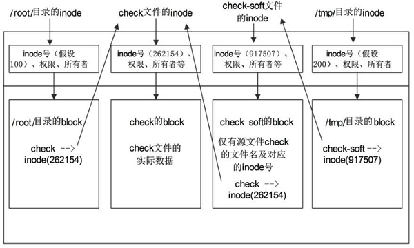

# Linux知识总结

## Linux是什么

### 基本概念

linux是

* 类Unix操作系统
* 免费
* 免费
* 兼容Unix

### Linux和Unix以及MacOS的关系？


UNIX系统在创建后由于自身的不完整性和收费的原因不能用于所有的使用场景，所以出现了许多的不同版本，目前常见的有 Sun Solaris、FreeBSD、IBM AIX、HP-UX 等，以上是UNIX的版本进化史。

而从上图可以知道，linux并不是由UNIX演化而生，而是自己单独的一个版本。Linux的诞生就是为了解决Unix的收费问题，所以Linux是免费开源的，并且在大家一起的完善下功能变得更加好用。由于Linux的诞生参考并且借鉴了UNIX的设计思想，导致在使用上这两个操作系统的体验很相似，所以如果熟练掌握Linux,也就会很快上手Unix。

MacOS也是基于UNIX的freeBSD版本开发的一个操作系统，所以MacOS在某些方面也跟UNIX系统的设计和使用有相同之处，由于Linux像Unix,MacOS继承Unix,那么学习Linux也就可以帮助你更好的使用和理解MacOS系统。

### UNIX/Linux系统结构

UNIX/Linux 系统可以粗糙地抽象为 3 个层次（所谓粗糙，就是不够细致、精准，但是便于初学者抓住重点理解），如图 3 所示。底层是 UNIX/Linux 操作系统，即系统内核（Kernel）；中间层是 Shell 层，即命令解释层；高层则是应用层。


图 3 UNIX/Linux 系统结掏层次概要

#### 1) 内核层

内核层是 UNIX/Linux 系统的核心和基础，它直接附着在硬件平台之上，控制和管理系统内各种资源（硬件资源和软件资源），有效地组织进程的运行，从而扩展硬件的功能，提高资源的利用效率，为用户提供方便、高效、安全、可靠的应用环境。

#### 2) Shell层

Shell 层是与用户直接交互的界面。用户可以在提示符下输入命令行，由 Shell 解释执行并输出相应结果或者有关信息，所以我们也把 Shell 称作命令解释器，利用系统提供的丰富命令可以快捷而简便地完成许多工作。

#### 3) 应用层

应用层提供基于 X Window 协议的图形环境。X Window 协议定义了一个系统所必须具备的功能（就如同 TCP/IP 是一个协议，定义软件所应具备的功能），若系统能满足此协议及符合 X 协会其他的规范，便可称为 X Window。

现在大多数的 UNIX 系统上（包括 Solaris、HP-UX、AIX 等）都可以运行 CDE （Common Desktop Environment，通用桌面环境，是运行于 UNIX 的商业桌面环境）的用户界面；而在 Linux 上广泛应用的有 Gnome（见图 4）、KDE 等。


图 4 Gnome图形界面

X Window 与微软的 Windows 图形环境有很大的区别：

- UNIX/Linux 系统与 X Window 没有必然捆绑的关系，也就是说，UNIX/Linux 可以安装 X Window，也可以不安装；而微软的 Windows 图形环境与内核捆绑密切。
- UNIX/Linux 系统不依赖图形环境，依然可以通过命令行完成 100% 的功能，而且因为不使用图形环境还会节省大量的系统资源。

作为服务器部署，绝大多数 Linux 并不安装或并不启用图形环境，本教程的讲解也基本上为 Linux 命令行下的操作。

### 类UNIX系统

类 UNIX 系统（英文 Unix-like）既包括各种传统的 UNIX 系统，比如 FreeBSD、OpenBSD、Sun Solaris 等，还包括与 UNIX 相似的系统，比如 Linux、QNX、Minix 等，它们都相当程度地继承了原始 UNIX 的特性，有很多相似之处，并且都在一定程度上遵守 POSIX 规范（UNIX 可移植接口规范）。

除去 Windows，几乎你所知道的每一个系统都是 UNIX 和类 UNIX，而且它们在 PC 普及前就大放异彩。Windows 仅仅占领了 PC，而别的方方面面都被 UNIX 和类 UNIX 占领了，至于其他的操作系统更是不值一提。比如：

- 服务器、超级计算机、嵌入式、机顶盒领域都有 Linux 的身影；
- 在手机领域，Android 和 iOS 都是类 UNIX 系统。

总之，除了 Windows，几乎你能叫的出名的都是 UNIX 和类 UNIX 系统。


### Linux中的语言选择

主要是shell脚本语言。虽然Linux使用C去写的，但是日常使用或者说一些Linux本身的功能实现都还是用的脚本语言。

虽然C语言是编译语言，它的执行效率高，但是在日常使用中C由于让程序员太过自由容易出bug,并且每次修改调试执行前都要编译，对于大多数场景来说太麻烦了。并且现在的处理器性能的提高和内存的价格下降让这一点的性能损失变得可以被接受。所以不常用C语言。

### 为什么使用linux系统

和Unix比起来是免费的

和windows或者其他操作系统比起来更加稳定，满足服务器的稳定运行的要求

### Linux的版本有哪些？

从技术上来说，李纳斯•托瓦兹开发的 Linux 只是一个内核。内核指的是一个提供设备驱动、文件系统、进程管理、网络通信等功能的系统软件，内核并不是一套完整的操作系统，它只是操作系统的核心。一些组织或厂商将 Linux 内核与各种软件和文档包装起来，并提供系统安装界面和系统配置、设定与管理工具，就构成了 Linux 的发行版本。

在 Linux 内核的发展过程中，各种 Linux 发行版本起了巨大的作用，正是它们推动了 Linux 的应用，从而让更多的人开始关注 Linux。因此，把 Red Hat、Ubuntu、SUSE 等直接说成 Linux 其实是不确切的，它们是 Linux 的发行版本，更确切地说，应该叫作“以Linux为核心的操作系统软件包”。

Linux 的各个发行版本使用的是同一个 Linux 内核，因此在内核层不存在什么兼容性问题，每个版本有不一样的感觉，只是在发行版本的最外层（由发行商整合开发的应用）才有所体现。

Linux 的发行版本可以大体分为两类：

- 商业公司维护的发行版本，以著名的 Red Hat 为代表；
- 社区组织维护的发行版本，以 Debian 为代表。

很难说大量 Linux 版本中哪一款更好，每个版本都有自己的特点。下面为大家介绍几款常用的 Linux 发行版本。

#### 1) Red Hat Linux


 Red Hat（红帽公司）创建于 1993 年，是目前世界上资深的 Linux 厂商，也是最获认可的 Linux 品牌。

Red Hat 公司的产品主要包括 RHEL（Red Hat Enterprise Linux，收费版本）和 CentOS（RHEL 的社区克隆版本，免费版本）、Fedora Core（由 Red Hat 桌面版发展而来，免费版本）。

Red Hat 是在我国国内使用人群最多的 Linux 版本，资料丰富，如果你有什么不明白的地方，则容易找到人来请教，而且大多数 Linux 教程是以 Red Hat 为例来讲解的（包括本教程）。

本教程以我国国内互联网公司常用的 Linux 发行版本 CentOS 为例讲解，它是基于 Red Hat Enterprise Linux 源代码重新编译、去除 Red Hat 商标的产物，各种操作使用和付费版本没有区别，且完全免费。缺点是不向用户提供技术支持，也不负任何商业责任。有实力的公司可以选择付费版本。

#### 2) Ubuntu Linux


 Ubuntu 基于知名的 Debian Linux 发展而来，界面友好，容易上手，对硬件的支持非常全面，是目前最适合做桌面系统的 Linux 发行版本，而且 Ubuntu 的所有发行版本都免费提供。

Ubuntu 的创始人 Mark Shuttleworth 是非常具有传奇色彩的人物。他在大学毕业后创建了一家安全咨询公司，1999 年以 5.75 亿美元被收购，由此一跃成为南非最年轻有为的本土富翁。作为一名狂热的天文爱好者，Mark Shuttleworth 于 2002 年自费乘坐俄罗斯联盟号飞船，在国际空间站中度过了 8 天的时光。之后，Mark Shuttleworth 创立了 Ubuntu 社区，2005 年 7 月 1 日建立了 Ubuntu 基金会，并为该基金会投资 1000 万美元。他说，太空的所见正是他创立 Ubuntu 的精神之所在。如今，他最热衷的事情就是到处为自由开源的 Ubuntu 进行宣传演讲。

#### 3) SuSE Linux


 SuSE Linux 以 Slackware Linux 为基础，原来是德国的 SuSE Linux AG 公司发布的 Linux 版本，1994 年发行了第一版，早期只有商业版本，2004 年被 Novell 公司收购后，成立了 OpenSUSE 社区，推出了自己的社区版本 OpenSUSE。

SuSE Linux 在欧洲较为流行，在我国国内也有较多应用。值得一提的是，它吸取了 Red Hat Linux 的很多特质。

SuSE Linux 可以非常方便地实现与 Windows 的交互，硬件检测非常优秀，拥有界面友好的安装过程、图形管理工具，对于终端用户和管理员来说使用非常方便。

#### 4) Gentoo Linux


 Gentoo 最初由 Daniel Robbins（FreeBSD 的开发者之一）创建，首个稳定版本发布于 2002 年。Gentoo 是所有 Linux 发行版本里安装最复杂的，到目前为止仍采用源码包编译安装操作系统。

不过，它是安装完成后最便于管理的版本，也是在相同硬件环境下运行最快的版本。自从 Gentoo 1.0 面世后，它就像一场风暴，给 Linux 世界带来了巨大的惊喜，同时也吸引了大量的用户和开发者投入 Gentoo Linux 的怀抱。

有人这样评价 Gentoo：快速、设计干净而有弹性，它的出名是因为其高度的自定制性（基于源代码的发行版）。尽管安装时可以选择预先编译好的软件包，但是大部分使用 Gentoo 的用户都选择自己手动编译。这也是为什么 Gentoo 适合比较有 Linux 使用经验的老手使用。

要注意的是，由于编译软件需要消耗大量的时间，所以，如果你所有的软件都由自己编译，并安装 KDE 桌面系统等比较大的软件包，则可能需要花费很长时间。

#### 5) 其他 Linux 发行版

除以上 4 种 Linux 发行版外，还有很多其他版本，表 1 罗列了几种常见的 Linux 发行版以及它们各自的特点：

| 版本名称         | 网 址              | 特 点                                                                                                                                                      | 软件包管理器                                 |
| ------------ | ---------------- | -------------------------------------------------------------------------------------------------------------------------------------------------------- | -------------------------------------- |
| Debian Linux | www.debian.org   | 开放的开发模式，且易于进行软件包升级                                                                                                                                       | apt                                    |
| Fedora Core  | www.redhat.com   | 拥有数量庞人的用户，优秀的社区技术支持. 并且有许多创新                                                                                                                             | up2date（rpm），yum （rpm）                 |
| CentOS       | www.centos.org   | CentOS 是一种对 RHEL（Red Hat Enterprise Linux）源代码再编译的产物，由于 Linux 是开发源代码的操作系统，并不排斥样基于源代码的再分发，CentOS 就是将商业的 Linux 操作系统 RHEL 进行源代码再编译后分发，并在 RHEL 的基础上修正了不少已知的漏洞 | rpm                                    |
| SUSE Linux   | www.suse.com     | 专业的操作系统，易用的 YaST 软件包管理系统                                                                                                                                 | YaST（rpm），第三方 apt （rpm）软件库（repository） |
| Mandriva     | www.mandriva.com | 操作界面友好，使用图形配置工具，有庞大的社区进行技术支持，支持 NTFS 分区的大小变更                                                                                                             | rpm                                    |
| KNOPPIX      | www.knoppix.com  | 可以直接在 CD 上运行，具有优秀的硬件检测和适配能力，可作为系统的急救盘使用                                                                                                                  | apt                                    |
| Gentoo Linux | www.gentoo.org   | 高度的可定制性，使用手册完整                                                                                                                                           | portage                                |
| Ubuntu       | www.ubuntu.com   | 优秀已用的桌面环境，基于 Debian 构建                                                                                                                                   | apt                                    |

#### Linux 发行版本的选择

Linux 的发行版本众多，在此不逐一介绍，下面给选择 Linux 发行版本犯愁的朋友一点建议：

1. 如果你需要的是一个服务器系统，而且已经厌烦了各种 Linux 的配置，只是想要一个比较稳定的服务器系统，那么建议你选择 CentOS 或 RHEL。
2. 如果你只是需要一个桌面系统，而且既不想使用盗版，又不想花大价钱购买商业软件，不想自己定制，也不想在系统上浪费太多时间，则可以选择 Ubuntu。
3. 如果你想深入摸索一下 Linux 各个方面的知识，而且还想非常灵活地定制自己的 Linux 系统，那就选择 Gentoo 吧，尽情享受 Gentoo 带来的自由快感。
4. 如果你对系统稳定性要求很高，则可以考虑 FreeBSD。
5. 如果你需要使用数据库高级服务和电子邮件网络应用，则可以选择 SuSE。

以上纯属个人化建议，非官方指导意见。其实 Linux 的发行版本众多，但是系统的核心——内核却系出同门，所以只要学会使用其中一种，即可触类旁通。

## Linux文件和目录管理

### Linux一切皆文件

Linux 中所有内容都是以文件的形式保存和管理的，即一切皆文件，普通文件是文件，目录（Windows 下称为文件夹）是文件，硬件设备（键盘、监视器、硬盘、打印机）是文件，就连套接字（[socket](http://c.biancheng.net/socket/)）、网络通信等资源也都是文件。

Linux系统中，文件具体可分为以下几种类型：

#### 1) 普通文件

类似 mp4、pdf、html 这样，可直接拿来使用的文件都属于普通文件，Linux 用户根据访问权限的不同可以对这些文件进行查看、删除以及更改操作。

#### 2) 目录文件

对于用惯 Windows 系统的用户来说，目录是文件可能不太好理解。

Linux 系统中，目录文件包含了此目录中各个文件的文件名以及指向这些文件的指针，打开目录等同于打开目录文件，只要你有权限，可以随意访问目录中的任何文件。

注意，目录文件的访问权限，同普通文件的执行权限，是一个意思。

#### 3) 字符设备文件和块设备文件

这些文件通常隐藏在 /dev/ 目录下，当进行设备读取或外设交互时才会被使用。

例如，磁盘光驱属于块设备文件，串口设备则属于字符设备文件。

Linux 系统中的所有设备，要么是块设备文件，要么是字符设备文件。

#### 4) 套接字文件（socket）

套接字文件一般隐藏在 /var/run/ 目录下，用于进程间的网络通信。

#### 5) 符号链接文件（symbolic link）

类似与 Windows 中的快捷方式，是指向另一文件的简介指针（也就是软链接）。

#### 6) 管道文件（pipe）

主要用于进程间通信。例如，使用 mkfifo 命令创建一个 FIFO 文件，与此同时，启用进程 A 从 FIFO文件读数据，启用进程 B 从 FIFO文件中写数据，随写随读。

### Linux文件挂载

前面讲过，Linux 系统中“一切皆文件”，所有文件都放置在以根目录为树根的树形目录结构中。在 Linux 看来，任何硬件设备也都是文件，它们各有自己的一套文件系统（文件目录结构）。

因此产生的问题是，当在 Linux 系统中使用这些硬件设备时，只有将Linux本身的文件目录与硬件设备的文件目录合二为一，硬件设备才能为我们所用。合二为一的过程称为“挂载”。

如果不挂载，通过Linux系统中的图形界面系统可以查看找到硬件设备，但命令行方式无法找到。

挂载，指的就是将设备文件中的顶级目录连接到 Linux 根目录下的某一目录（最好是空目录），访问此目录就等同于访问设备文件。

纠正一个误区，并不是根目录下任何一个目录都可以作为挂载点，由于挂载操作会使得原有目录中文件被隐藏，因此根目录以及系统原有目录都不要作为挂载点，会造成系统异常甚至崩溃，挂载点最好是新建的空目录。

举个例子，我们想通过命令行访问某个 U 盘中的数据，图 1 所示为 U 盘文件目录结构和 Linux 系统中的文件目录结构。


图 1 U 盘和 Linux 系统文件目录结构

图 1 中可以看到，目前 U 盘和 Linux 系统文件分属两个文件系统，还无法使用命令行找到 U 盘文件，需要将两个文件系统进行挂载。

接下来，我们在根目录下新建一个目录 /sdb-u，通过挂载命令将 U 盘文件系统挂载到此目录，挂载效果如图 2 所示。


图 2 文件系统挂载

可以看到，U 盘文件系统已经成为 Linux 文件系统目录的一部分，此时访问 /sdb-u/ 就等同于访问 U 盘。

前面讲过，根目录下的 /dev/ 目录文件负责所有的硬件设备文件，事实上，当 U 盘插入 Linux 后，系统也确实会给 U 盘分配一个目录文件（比如 sdb1），就位于 /dev/ 目录下（/dev/sdb1），但无法通过 /dev/sdb1/ 直接访问 U 盘数据，访问此目录只会提供给你此设备的一些基本信息（比如容量）。

总之，Linux 系统使用任何硬件设备，都必须将设备文件与已有目录文件进行挂载。

### 文件目录一览表

为了避免诸多使用者对 Linux 系统目录结构天马行空，Linux 基金会发布了 FHS 标准。多数 Linux 发行版系统都遵循这一标准。

FHS（Filesystem Hierarchy Standard），文件系统层次化标准，该标准规定了 Linux 系统中所有一级目录以及部分二级目录（/usr 和 /var）的用途。发布此标准的主要目的就是为了让用户清楚地了解每个目录应该存放什么类型的文件。

#### Linux根目录（/）

FHS 认为，Linux 系统的根目录（/）最为重要（没有之一），其原因有以下 2 点：

1. 所有目录都是由根目录衍生出来的；
2. 根目录与系统的开机、修复、还原密切相关；

因此，根目录必须包含开机软件、核心文件、开机所需程序、函数库、修复系统程序等文件，如表 1 所示。

| 一级目录    | 功能（作用）                                                                                                                                                                                              |
| ------- | --------------------------------------------------------------------------------------------------------------------------------------------------------------------------------------------------- |
| /bin/   | 存放系统命令，普通用户和 root 都可以执行。放在 /bin 下的命令在单用户模式下也可以执行                                                                                                                                                    |
| /boot/  | 系统启动目录，保存与系统启动相关的文件，如内核文件和启动引导程序（grub）文件等                                                                                                                                                           |
| /dev/   | 设备文件保存位置                                                                                                                                                                                            |
| /etc/   | 配置文件保存位置。系统内所有采用默认安装方式（rpm 安装）的服务配置文件全部保存在此目录中，如用户信息、服务的启动脚本、常用服务的配置文件等                                                                                                                             |
| /home/  | 普通用户的主目录（也称为家目录）。在创建用户时，每个用户要有一个默认登录和保存自己数据的位置，就是用户的主目录，所有普通用户的主目录是在 /home/ 下建立一个和用户名相同的目录。如用户 liming 的主目录就是 /home/liming                                                                           |
| /lib/   | 系统调用的函数库保存位置                                                                                                                                                                                        |
| /media/ | 挂载目录。系统建议用来挂载媒体设备，如软盘和光盘                                                                                                                                                                            |
| /mnt/   | 挂载目录。早期 Linux 中只有这一个挂载目录，并没有细分。系统建议这个目录用来挂载额外的设备，如 U 盘、移动硬盘和其他操作系统的分区                                                                                                                               |
| /misc/  | 挂载目录。系统建议用来挂载 NFS 服务的共享目录。虽然系统准备了三个默认挂载目录 /media/、/mnt/、/misc/，但是到底在哪个目录中挂载什么设备可以由管理员自己决定。例如，笔者在接触 Linux 的时候，默认挂载目录只有 /mnt/，所以养成了在 /mnt/ 下建立不同目录挂载不同设备的习惯，如 /mnt/cdrom/ 挂载光盘、/mnt/usb/ 挂载 U 盘，都是可以的 |
| /opt/   | 第三方安装的软件保存位置。这个目录是放置和安装其他软件的位置，手工安装的源码包软件都可以安装到这个目录中。不过笔者还是习惯把软件放到 /usr/local/ 目录中，也就是说，/usr/local/ 目录也可以用来安装软件                                                                                     |
| /root/  | root 的主目录。普通用户主目录在 /home/ 下，root 主目录直接在“/”下                                                                                                                                                         |
| /sbin/  | 保存与系统环境设置相关的命令，只有 root 可以使用这些命令进行系统环境设置，但也有些命令可以允许普通用户查看                                                                                                                                            |
| /srv/   | 服务数据目录。一些系统服务启动之后，可以在这个目录中保存所需要的数据                                                                                                                                                                  |
| /tmp/   | 临时目录。系统存放临时文件的目录，在该目录下，所有用户都可以访问和写入。建议此目录中不能保存重要数据，最好每次开机都把该目录清空                                                                                                                                    |

FHS 针对根目录中包含的子目录仅限于表 1，但除此之外，Linux 系统根目录下通常还包含表 2 中的几个一级目录。

| 一级目录         | 功能（作用）                                                                                                                                                                  |
| ------------ | ----------------------------------------------------------------------------------------------------------------------------------------------------------------------- |
| /lost+found/ | 当系统意外崩溃或意外关机时，产生的一些文件碎片会存放在这里。在系统启动的过程中，fsck 工具会检查这里，并修复已经损坏的文件系统。这个目录只在每个分区中出现，例如，/lost+found 就是根分区的备份恢复目录，/boot/lost+found 就是 /boot 分区的备份恢复目录                         |
| /proc/       | 虚拟文件系统。该目录中的数据并不保存在硬盘上，而是保存到内存中。主要保存系统的内核、进程、外部设备状态和网络状态等。如 /proc/cpuinfo 是保存 CPU 信息的，/proc/devices 是保存设备驱动的列表的，/proc/filesystems 是保存文件系统列表的，/proc/net 是保存网络协议信息的...... |
| /sys/        | 虚拟文件系统。和 /proc/ 目录相似，该目录中的数据都保存在内存中，主要保存与内核相关的信息                                                                                                                        |

#### Linux /usr目录

usr（注意不是 user），全称为 Unix Software Resource，此目录用于存储系统软件资源。FHS 建议所有开发者，应把软件产品的数据合理的放置在 /usr 目录下的各子目录中，而不是为他们的产品创建单独的目录。

Linux 系统中，所有系统默认的软件都存储在 /usr 目录下，/usr 目录类似 Windows 系统中 C:\Windows\ + C:\Program files\ 两个目录的综合体。

FHS 建议，/usr 目录应具备表 3 所示的子目录。

| 子目录          | 功能（作用）                                                                                                |
| ------------ | ----------------------------------------------------------------------------------------------------- |
| /usr/bin/    | 存放系统命令，普通用户和超级用户都可以执行。这些命令和系统启动无关，在单用户模式下不能执行                                                         |
| /usr/sbin/   | 存放根文件系统不必要的系统管理命令，如多数服务程序，只有 root 可以使用。                                                               |
| /usr/lib/    | 应用程序调用的函数库保存位置                                                                                        |
| /usr/XllR6/  | 图形界面系统保存位置                                                                                            |
| /usr/local/  | 手工安装的软件保存位置。我们一般建议源码包软件安装在这个位置                                                                        |
| /usr/share/  | 应用程序的资源文件保存位置，如帮助文档、说明文档和字体目录                                                                         |
| /usr/src/    | 源码包保存位置。我们手工下载的源码包和内核源码包都可以保存到这里。不过笔者更习惯把手工下载的源码包保存到 /usr/local/src/ 目录中，把内核源码保存到 /usr/src/linux/ 目录中 |
| /usr/include | C/[C++](http://c.biancheng.net/cplus/) 等编程语言头文件的放置目录                                                  |

#### Linux /var目录

/var 目录用于存储动态数据，例如缓存、日志文件、软件运行过程中产生的文件等。通常，此目录下建议包含如表 4 所示的这些子目录。

| /var子目录          | 功能（作用）                                                                                   |
| ---------------- | ---------------------------------------------------------------------------------------- |
| /var/lib/        | 程序运行中需要调用或改变的数据保存位置。如 [MySQL](http://c.biancheng.net/mysql/) 的数据库保存在 /var/lib/mysql/ 目录中 |
| /var/log/        | 登陆文件放置的目录，其中所包含比较重要的文件如 /var/log/messages, /var/log/wtmp 等。                              |
| /var/run/        | 一些服务和程序运行后，它们的 PID（进程 ID）保存位置                                                            |
| /var/spool/      | 里面主要都是一些临时存放，随时会被用户所调用的数据，例如 /var/spool/mail/ 存放新收到的邮件，/var/spool/cron/ 存放系统定时任务。        |
| /var/www/        | RPM 包安装的 Apache 的网页主目录                                                                   |
| /var/nis和/var/yp | NIS 服务机制所使用的目录，nis 主要记录所有网络中每一个 client 的连接信息；yp 是 linux 的 nis 服务的日志文件存放的目录               |
| /var/tmp         | 一些应用程序在安装或执行时，需要在重启后使用的某些文件，此目录能将该类文件暂时存放起来，完成后再行删除                                      |

根据以上各表列举的各目录及作用，如果我们要做一些实验和练习，需要创建一些临时文件，应该保存在哪里呢？

答案是用户的主目录或 /tmp/ 临时目录。但是要小心有些目录中不能直接修改和保存数据，比如 /proc/fn/sys/ 目录，因为它们是保存在内存中的，如果在这里写入数据，那么你的内存会越来越小，直至死机；/boot/ 目录也不能保存额外数据，因为 /boot/ 目录会单独分区作为启动分区，如果没有空闲空间，则会导致系统不能正常启动。

总之，Linux 要在合理的目录下进行操作和修改。

### Linux文件系统的层次结构

在 Linux 操作系统中，所有的文件和目录都被组织成以一个根节点“/”开始的倒置的树状结构，如图 1 所示。


图 1 Linux 系统文件和目录组织示意图

文件系统的最顶层是由根目录开始的，**系统使用“/”来表示根目录**，在根目录之下的既可以是目录，也可以是文件，而每一个目录中又可以包含（子）目录或文件。如此反复就可以构成一个庞大的文件系统。

**注意，目录名或文件名都是区分大小写的**，如 dog、DOG 和 Dog 为 3 个不同的目录或文件。完整的目录或文件路径是由一连串的目录名所组成的，其中每一个目录由“/”来分隔。如 cat 的完整路径是 /home/cat。

在文件系统中，有两个特殊的目录，一个是用户所在的工作目录，即当前目录，可用一个点“.”表示；另一个是当前目录的上一层目录，也叫父目录，用两个点“..”表示。

如果一个目录或文件名是以一个点开始，就表示这个目录或文件是一个隐藏目录或文件。即以默认方式査找时，不显示该目录或文件。

### Linux绝对路径和相对路径详解


图 1 Linux系统文件组织结构示意图

路径：一个文件的路径，指的就是该文件存放的位置

绝对路径：

绝对路径一定是由根目录 / 开始写起。例如，使用绝对路径的表示方式指明 bin 文件所在的位置，该路径应写为 /usr/bin，测试代码如下：

```shell
[root@localhost ~]# bin
bash： bin： command not found  <-- 没有找到
[root@localhost ~]# /usr/bin
bash: /usr/bin: is a directory  <-- 是一个文件
```

相对路径

和绝对路径不同，相对路径不是从根目录 / 开始写起，而是从当前所在的工作目录开始写起。使用相对路径表明某文件的存储位置时，经常会用到前面讲到的 2 个特殊目录，**即当前目录（用 . 表示）和父目录（用 .. 表示）**。

### Linux文件（目录）命名规则

Linux 系统中，文件和目录的命名规则如下：

1. 除了字符“/”之外，所有的字符都可以使用，但是要注意，在目录名或文件名中，使用某些特殊字符并不是明智之举。例如，在命名时应避免使用 <、>、？、* 和非打印字符等。如果一个文件名中包含了特殊字符，例如空格，那么在访问这个文件时就需要使用引号将文件名括起来。
2. 目录名或文件名的长度不能超过 255 个字符。
3. 目录名或文件名是区分大小写的。如 DOG、dog、Dog 和 DOg ，是互不相同的目录名或文件名，但使用字符大小写来区分不同的文件或目录，也是不明智的。
4. 与 Windows 操作系统不同，文件的扩展名对 Linux 操作系统没有特殊的含义，换句话说，Linux 系统并不以文件的扩展名开分区文件类型。例如，dog.exe 只是一个文件，其扩展名 .exe 并不代表此文件就一定是可执行文件。

需要注意的是，在 Linux 系统中，硬件设备也是文件，也有各自的文件名称。Linux 系统内核中的 udev 设备管理器会自动对硬件设备的名称进行规范，目的是让用户通过设备文件的名称，就可以大致猜测处设备的属性以及相关信息。

udev 设备管理器会一直以进程的形式运行，并侦听系统内核发出的信号来管理位于 /dev 目录下的设备文件。

表 1 罗列出了Linux 系统中常见硬件设备的文件名。

| 硬件设备         | 文件名称                                                 |
| ------------ | ---------------------------------------------------- |
| IDE设备        | /dev/hd[a-d]，现在的 IDE设备已经很少见了，因此一般的硬盘设备会以 /dev/sd 开头。 |
| SCSI/SATA/U盘 | /dev/sd[a-p]，一台主机可以有多块硬盘，因此系统采用 a~p 代表 16 块不同的硬盘。    |
| 软驱           | /dev/fd[0-1]                                         |
| 打印机          | /dev/lp[0-15]                                        |
| 光驱           | /dev/cdrom                                           |
| 鼠标           | /dev/mouse                                           |
| 磁带机          | /dev/st0 或 /dev/ht0                                  |

### Linux命令行下如何识别文件类型？

1. 颜色区分

一般情况下，Linux 用蓝色代表目录，其他颜色则表示是文件。例如：


图 1 /root 目录下的文件和目录

不仅如此，Linux 中还可以用不同的颜色来区分不同种类的文件，例如绿色代表可执行文件、红色代表压缩文件、浅绿色代表链接文件、白色代表其他文件、黄色代表设备文件等。

但是，不同颜色所代表的文件类型不一定是这样，更准确的对应方式还取决于配置文件 /etc/DIR_COLORS 中的规定。

注意，有些 Linux 发行版单独使用 ls 命令，无法显示出带有不同颜色的文件和目录，此时就需要使用 ls --color=auto 命令，明确令其使用颜色来区分文件类型。

在此基础上，如果不想每次使用 ls 命令时，都显式附带 --color=auto，可以执行如下命令：

[root@localhost ~]# alias ls = 'ls --color=auto'

通过给 ls --color==auto 这个整体设置一个别名 ls，这样当后续使用 ls 命令时，就等同于执行 ls --color=auto 命令。

同时，如果想使这个设置永远生效，还需要将其添加到 /etc/bashrc 或 /home/\<user>/.bashrc 文件中，前者对所有用户有效，而后者仅对用户\<user>有效。

2. ls -l命令查看属性

通过 ls -l 命令，我们就可以查看当前目录下所有文件和目录各自的属性，如图 3 所示。


图 3 查看属性

图 3 显示的执行结构中，每行代表一个文件或目录，其中第一个字符表示的就是文件的类型，其可能的取值以及表示的文件类型，如表 4 所示。

| 第一个字符 | 文件类型                                               |
| ----- | -------------------------------------------------- |
| -     | 普通文件，包括纯文本文件、二进制文件、各种压缩文件等。                        |
| d     | 目录，类似 Windows 系统中的文件夹。                             |
| b     | 块设备文件，就是保存大块数据的设备，比如最常见的硬盘。                        |
| c     | 字符设备文件，例如键盘、鼠标等。                                   |
| s     | 套接字文件，通常用在网络数据连接，可以启动一个程序开监听用户的要求，用户可以通过套接字进行数据通信。 |
| p     | 管道文件，其主要作用是解决多个程序同时存取一个文件所造成的错误。                   |
| l     | 链接文件，类似 Windows 系统中的快捷方式。                          |

3. file命令

### Linux命令基本格式

1. Linux命令的整体构成

命令提示符 命令\[选项]\[参数]

2. 命令提示符

```shell
[root@localhost ~]#
```

这就是 Linux 系统的命令提示符。那么，这个提示符的含义是什么呢？

- []：这是提示符的分隔符号，没有特殊含义。

- root：显示的是当前的登录用户，笔者现在使用的是 root 用户登录。

- @：分隔符号，没有特殊含义。

- localhost：当前系统的简写主机名（完整主机名是 localhost.localdomain）。

- ~：该位置显示用户当前所在目录的最后一个目录，在这里这个~代表了用户的家目录（见下）。

- \#：命令提示符，Linux 用这个符号标识登录的用户权限等级。如果是超级用户，提示符就是 #；如果是普通用户，提示符就是 $。

家目录（又称主目录）是什么？ Linux 系统是纯字符界面，用户登录后，要有一个初始登录的位置，这个初始登录位置就称为用户的家：

- 超级用户的家目录：/root。
- 普通用户的家目录：/home/用户名。

用户在自己的家目录中拥有完整权限，所以我们也建议操作实验可以放在家目录中进行。

3. 命令的整体基本格式

```shell
[root@localhost ~]# 命令[选项][参数]
```

命令的选项用于调整命令功能，而命令的参数是这个命令的操作对象。

### Linux常见内置命令

Linux 命令按照来源方式，可分为两种，分别是 Shell 内置命令和外部命令。所谓 Shell 内置命令，就是 Shell 自带的命令，这些命令是没有执行文件的；而外部命令就是由程序员单独开发的，所以会有命令的执行文件。

#### open命令

[root@localhost ~]# open [相对路径或绝对路径]

打开Finder(mac)对应的路径文件

#### cd命令

cd 命令，是 Change Directory 的缩写，用来切换工作目录。

cd 命令的基本格式如下：

```shell
[root@localhost ~]# cd [相对路径或绝对路径]
```

除此之外，cd 命令后面可以跟一些特殊符号，表达固定的含义，如表 1 所示：

| 特殊符号 | 作 用           |
| ---- | ------------- |
| ~    | 代表当前登录用户的主目录  |
| ~用户名 | 表示切换至指定用户的主目录 |
| -    | 代表上次所在目录      |
| .    | 代表当前目录        |
| ..   | 代表上级目录        |

它们的用法分别是：

1. [root@localhost vbird]# cd ~
   \#表示回到自己的主目录，对于 root 用户，其主目录为 /root
   [root@localhost ~]# cd
   \#没有加上任何路径，也代表回到当前登录用户的主目录
   [root@localhost ~]# cd ~vbird
   \#代表切换到 vbird 这个用户的主目录，亦即 /home/vbird

2. [root@localhost ~]# cd ..
   \#表示切换到目前的上一级目录，亦即是 /root 的上一级目录的意思；
   
   需要注意的是，在 Linux 系统中，根目录确实存在 .（当前目录）以及 ..（当前目录的父目录）两个目录，但由于根目录是最顶级目录，因此根目录的 .. 和 . 的属性和权限完全一致，也就是说，根目录的父目录是自身。

3. [root@localhost /]# cd -
   \#表示回到刚刚的那个目录

#### pwd命令

pwd 命令，是 Print Working Directory （打印工作目录）的缩写，功能是显示用户当前所处的工作目录。该命令的基本格式为：

```shell
[root@localhost ~]# pwd
```

#### ls命令

ls 命令，list 的缩写，是最常见的目录操作命令，其主要功能是显示指定目录下的内容，如果不定义目录就为当前目录。此命令的基本格式为：

```shell
[root@localhost ~]# ls [选项] 目录名称
```

表 1 列出了 ls 命令常用的选项以及各自的功能。

| 选项                                        | 功能                                                                                                      |
| ----------------------------------------- | ------------------------------------------------------------------------------------------------------- |
| -a                                        | 显示全部的文件，包括隐藏文件（开头为 . 的文件）也一起罗列出来，这是最常用的选项之一。                                                            |
| -A                                        | 显示全部的文件，连同隐藏文件，但不包括 . 与 .. 这两个目录。                                                                       |
| -d                                        | 仅列出目录本身，而不是列出目录内的文件数据。                                                                                  |
| -f                                        | ls 默认会以文件名排序，使用 -f 选项会直接列出结果，而不进行排序。                                                                    |
| -F                                        | 在文件或目录名后加上文件类型的指示符号，例如，* 代表可运行文件，/ 代表目录，= 代表 [socket](http://c.biancheng.net/socket/) 文件，\| 代表 FIFO 文件。 |
| -h                                        | 以人们易读的方式显示文件或目录大小，如 1KB、234MB、2GB 等。                                                                    |
| -i                                        | 显示 inode 节点信息。                                                                                          |
| -l                                        | 使用长格式列出文件和目录信息。                                                                                         |
| -n                                        | 以 UID 和 GID 分别代替文件用户名和群组名显示出来。                                                                          |
| -r                                        | 将排序结果反向输出，比如，若原本文件名由小到大，反向则为由大到小。                                                                       |
| -R                                        | 连同子目录内容一起列出来，等於将该目录下的所有文件都显示出来。                                                                         |
| -S                                        | 以文件容量大小排序，而不是以文件名排序。                                                                                    |
| -t                                        | 以时间排序，而不是以文件名排序。                                                                                        |
| --color=never --color=always --color=auto | never 表示不依据文件特性给予颜色显示。 always 表示显示颜色，ls 默认采用这种方式。 auto 表示让系统自行依据配置来判断是否给予颜色。                            |
| --full-time                               | 以完整时间模式 （包含年、月、日、时、分）输出                                                                                 |
| --time={atime,ctime}                      | 输出 access 时间或改变权限属性时间（ctime），而不是内容变更时间。                                                                 |

注意:

* 当 ls 命令不使用任何选项时，默认只会显示非隐藏文件的名称，并以文件名进行排序，同时会根据文件的具体类型给文件名配色（蓝色显示目录，白色显示一般文件）。除此之外，如果想使用 ls 命令显示更多内容，就需要使用表 1 相应的选项。
* 选项可以进行组合，例如: -al

【例 1】

[root@www ~]# ls -al ~
total 156
drwxr-x--- 4 root root 4096 Sep 24 00:07 .
drwxr-xr-x 23 root root 4096 Sep 22 12:09 ..
-rw------- 1 root root 1474 Sep 4 18:27 anaconda-ks.cfg
-rw------- 1 root root  955 Sep 24 00:08 .bash_history
-rw-r--r-- 1 root root  24 Jan 6 2007 .bash_logout
-rw-r--r-- 1 root root  191 Jan 6 2007 .bash_profile
-rw-r--r-- 1 root root  176 Jan 6 2007 .bashrc
drwx------ 3 root root 4096 Sep 5 10:37 .gconf
-rw-r--r-- 1 root root 42304 Sep 4 18:26 install.log
-rw-r--r-- 1 root root 5661 Sep 4 18:25 install.log.syslog

通过使用 -a，你会看到以 . 为开头的几个文件，以及目录文件 （.）、（..）、.gconf 等等，这些都是隐藏的目录和文件。其中，目录文件名以蓝色显示，一般文件以白色显示。

注意，Linux 系统中，隐藏文件不是为了把文件藏起来不让其他用户找到，而是为了告诉用户这些文件都是重要的系统文件，如非必要，不要乱动！所以，不论是 Linux 还是 Windows 都可以非常简单地査看隐藏文件，只是在 Windows 中绝大多数的病毒和木马都会把自己变成隐藏文件，给用户带来了错觉，以为隐藏文件是为了不让用户发现。

不仅如此，这里的 ls 命令还使用了 -l 选项，因此才显示出了文件的详细信息，此选项显示的这 7 列的含义分别是：

1. 第一列：规定了不同的用户对文件所拥有的权限，具体权限的含义将在后续章节中讲解。
2. 第二列：引用计数，文件的引用计数代表该文件的硬链接个数，而目录的引用计数代表该目录有多少个一级子目录。
3. 第三列：所有者，也就是这个文件属于哪个用户。默认所有者是文件的建立用户。
4. 第四列：所属组，默认所属组是文件建立用户的有效组，一般情况下就是建立用户的所在组。
5. 第五列：大小，默认单位是字节。
6. 第六列：文件修改时间，文件状态修改时间或文件数据修改时间都会更改这个时间，注意这个时间不是文件的创建时间。
7. 第七列：文件名或目录名。

【例 2】
如果我们想查看某个目录的详细信息，例如：

[root@localhost ~]# ls -l /root/
总用量44
-rw-------.1 root root 1207 1 月 14 18:18 anaconda-ks.cfg
-rw-r-r--.1 root root 24772 1 月 14 18:17 install.log
-rw-r-r--.1 root root 7690 1 月 14 18:17 install.log.syslog

这个命令会显示目录下的内容，而不会显示这个目录本身的详细信息。如果想显示目录本身的信息，就必须加入 "-d" 选项。

[root@localhost ~]# ls -ld /root/
dr-xr-x---.2 root root 4096 1 月 20 12:30 /root/

【例 3】
"ls-l" 显示的文件大小是字节，但是我们更加习惯的是千字节用 KB 显示，兆字节用 MB 显示，而 "-h" 选项就是按照人们习惯的单位显示文件大小的，例如：

[root@localhost ~]# ls -lh
总用量44K
-rw-------.1 root root 1.2K 1 月 14 18:18 anaconda-ks.cfg
-rw-r-r--.1 root root 25K 1 月 14 18:17 install.log
-rw-r-r--.1 root root 7.6K 1 月 14 18:17 install.log.syslog

#### mkdir命令

mkdir 命令，是 make directories 的缩写，用于创建新的子目录，此命令所有用户都可以使用。

mkdir 命令的基本格式为：

[root@localhost ~]# mkdir [-mp] 目录名或路径

- -m 选项用于手动配置所创建目录的权限，而不再使用默认权限。
- -p 选项递归创建所有目录，以创建 /home/test/demo 为例，在默认情况下，你需要一层一层的创建各个目录，而使用 -p 选项，则系统会自动帮你创建 /home、/home/test 以及 /home/test/demo。

【例 1】建立目录。

[root@localhost ~]#mkdir cangls
[root@localhost ~]#ls
anaconda-ks.cfg cangls install.log install.log.syslog

我们建立一个名为 cangls 的目录，通过 ls 命令可以查看到这个目录已经建立。注意，我们在建立目录的时候使用的是相对路径，所以这个目录被建立到当前目录下。

【例 2】使用 -p 选项递归建立目录。

[root@localhost ~]# mkdir lm/movie/jp/cangls
mkdir:无法创建目录"lm/movie/jp/cangls":没有那个文件或目录
[root@localhost ~]# mkdir -p lm/movie/jp/cangls
[root@localhost ~]# ls
anaconda-ks.cfg cangls install.log install.log.syslog lm
[root@localhost ~]# ls lm/
movie
\#这里只查看一级子目录，其实后续的jp目录、cangls目录都已经建立

【例 3】使用 -m 选项自定义目录权限。

[root@localhost ~]# mkdir -m 711 test2
[root@localhost ~]# ls -l
drwxr-xr-x 3 root root 4096 Jul 18 12:50 test
drwxr-xr-x 3 root root 4096 Jul 18 12:53 test1
drwx--x--x 2 root root 4096 Jul 18 12:54 test2

仔细看上面的权限部分，也就是 ls 命令输出的第一列数据（绿色部分），test 和 test1 目录由于不是使用 -m 选项设定访问权限，因此这两个目录采用的是默认权限（这里的默认权限值是 755，后续章节再详细介绍默认权限）。

而在创建 test2 时，使用了 -m 选项，通过设定 711 权限值来给予新的目录 drwx--x--x 的权限，有关权限值的具体含义也放到后续章节介绍。

#### rmdir命令

rmdir（remove empty directories 的缩写）命令用于删除空目录，此命令的基本格式为：

```shell
[root@localhost ~]# rmdir [-p] 目录名或路径
```

-p 选项用于递归删除空目录。

【例 1】

[root@localhost ~]#rmdir cangls

就这么简单，命令后面加目录名称即可，但命令执行成功与否，取决于要删除目录是否是空目录，因为 rmdir 命令只能删除空目录。

【例 2】
通过学习 mkdir 命令我们知道，使用 mkdir -p 可以实现递归建立目录，同样地，rmdir 命令可以使用 -p 选项递归删除目录。例如：

[root@localhost ~]# rmdir -p lm/movie/jp/cangls

注意，此方式先删除最低一层地目录（这里先删除 cangls），然后逐层删除上级目录，删除时也需要保证各级目录是空目录。

【例 3】
rmdir 命令的作用十分有限，因为只能刪除空目录，所以一旦目录中有内容，就会报错。例如：

[root@localhost # mkdir test
\#建立测试目录
[root@localhost ~]# touch test/boduo
[root@localhost ~]# touch test/longze
\#在测试目录中建立两个文件
[root@localhost ~]# rmdir test
rmdir:删除"test"失败：目录非空

这个命令比较"笨"，所以并不常用。后续我们会学习 rm 命令，使用此命令不但可以删除目录，还可以删除文件。

#### touch命令

touch命令用于创建文件，或者当文件存在时用于修改文件的时间参数。

Linux 系统中，每个文件主要拥有 3 个时间参数（通过 stat 命令进行查看），分别是文件的访问时间、数据修改时间以及状态修改时间：

- 访问时间（Access Time，简称 atime）：只要文件的内容被读取，访问时间就会更新。例如，使用 cat 命令可以查看文件的内容，此时文件的访问时间就会发生改变。
- 数据修改时间（Modify Time，简称 mtime）：当文件的内容数据发生改变，此文件的数据修改时间就会跟着相应改变。
- 状态修改时间（Change Time，简称 ctime）：当文件的状态发生变化，就会相应改变这个时间。比如说，如果文件的权限或者属性发生改变，此时间就会相应改变。

touch 命令的基本格式如下：

```shell
[root@localhost ~]# touch [选项] 文件名
```

可以看到，touch 命令可以只修改文件的访问时间，也可以只修改文件的数据修改时间，但是不能只修改文件的状态修改时间。因为，不论是修改访问时间，还是修改文件的数据时间，对文件来讲，状态都会发生改变，即状态修改时间会随之改变（更新为操作当前文件的真正时间）。

【例 1】 touch 命令创建文件。

```bash
[root@localhost ~]#touch bols
#建立名为 bols 的空文件
```

【例 2】 在例 1 的基础上修改文件的访问时间。

```shell
[root@localhost ~]#ll --time=atime bols
\#查看文件的访问时间
-rw-r--r-- 1 root root 0 Sep 25 21:23 bols
\#文件上次的访问时间为 9 月 25 号 21：23
[root@localhost ~]#touch bols
[root@localhost ~]#ll --time=atime bols
-rw-r--r-- 1 root root 0 May 15 16:36 bols
\#而如果文件已经存在，则也不会报错，只是会修改文件的访问时间。
```

【例 3】 修改 bols 文件的 atime 和 mtime。

```shell
[root@localhost ~]# touch -d "2017-05-04 15:44" bols
[root@localhost ~]# ll bols; ll --time=atime bols; ll --time=ctime bols
-rw-r--r-- 1 root root 0 May 4 2017 bols
-rw-r--r-- 1 root root 0 May 4 2017 bols
-rw-r--r-- 1 root root 0 Sep 25 21:40 bols
\#ctime不会变为设定时间，但更新为当前服务器的时间
```

#### ln命令

##### Linux ext文件系统的工作原理


inode 的默认大小为 128 Byte，每一个文件都由inode节点去保存记录文件的权限（r、w、x）、文件的所有者和属组、文件的大小、文件的状态改变时间（ctime）、文件的最近一次读取时间（atime）、文件的最近一次修改时间（mtime）、文件的数据真正保存的 block 编号,即一个block指针。

每一个block中都会保存文件的文件名，具体的文件内容等与文件相关的信息。block 的大小可以是 1KB、2KB、4KB，默认为 4KB。block 用于实际的数据存储，如果一个 block 放不下数据，则可以占用多个 block。例如，有一个 10KB 的文件需要存储，则会占用 3 个 block，虽然最后一个 block 不能占满，但也不能再放入其他文件的数据。这 3 个 block 有可能是连续的，也有可能是分散的。

##### ln命令的具体使用方式

ln 命令用于给文件创建链接，根据 Linux 系统存储文件的特点，链接的方式分为以下 2 种：

- 软链接：将目标文件指向源文件，并且会生成目标文件自己的inode，在目标文件的block中存储一个指向源文件的指针由此找到源文件
- 硬链接：将目标文件指向源文件，但是不会生成自己的inode,目标文件和源文件共用一个inode

ln 命令的基本格式如下：

[root@localhost ~]# ln [选项] 源文件 目标文件

选项：

- -s：建立软链接文件。如果不加 "-s" 选项，则建立硬链接文件；
- -f：强制。如果目标文件已经存在，则删除目标文件后再建立链接文件；

【例 1】创建硬链接：

[root@localhost ~]# touch cangls
[root@localhost ~]# ln /root/cangls /tmp
\#建立硬链接文件，目标文件没有写文件名，会和原名一致
\#也就是/tmp/cangls 是硬链接文件

【例 2】创建软链接：

[root@localhost ~]# touch bols
[root@localhost ~]# In -s /root/bols /tmp
\#建立软链接文件

这里需要注意的是，软链接文件的源文件必须写成绝对路径，而不能写成相对路径（硬链接没有这样的要求）；否则软链接文件会报错。这是初学者非常容易犯的错误。

##### 深究硬软链接

1. 硬链接

```shell
[root@localhost ~]# touch test
#建立源文件
[root@localhost ~]# ln /root/test /tmp/test-hard
#给源文件建立硬链接文件 /tmp/test-hard
[root@localhost ~]# ll -i /root/test /tmp/test-hard
262147 -rw-r--r-- 2 root root 0 6月 19 10:06 /root/test
hard
262147 -rw-r--r-- 2 root root 0 6月 19 10:06 /tmp/test-hard
#查看两个文件的详细信息，可以发现这两个文件的 inode 号是一样的，"ll"等同于"ls -l"。
```


上图中,/tmp/目录是目标文件test-hard的父目录，/root/是源文件test的父目录，可以看到通过硬连接创建目标文件test-hard和其源文件test共用一个inode。

所以硬链接的的特点为：

- 不论是修改源文件（test 文件），还是修改硬链接文件（test-hard 文件），另一个文件中的数据都会发生改变。
- 不论是删除源文件，还是删除硬链接文件，只要还有一个文件存在，这个文件（inode 号是 262147 的文件）都可以被访问。
- 硬链接不会建立新的 inode 信息，也不会更改 inode 的总数。
- 硬链接不能跨文件系统（分区）建立，因为在不同的文件系统中，inode 号是重新计算的。
- 硬链接不能链接目录，因为如果给目录建立硬链接，那么不仅目录本身需要重新建立，目录下所有的子文件，包括子目录中的所有子文件都需要建立硬链接，这对当前的 Linux 来讲过于复杂。

硬链接的限制比较多，既不能跨文件系统，也不能链接目录，而且源文件和硬链接文件之间除 inode 号是一样的之外，没有其他明显的特征。这些特征都使得硬链接并不常用，大家有所了解就好。

2. 软链接

```shell
[root@localhost ~]# touch check
#建立源文件
[root@localhost ~]# ln -s /root/check /tmp/check-soft
#建立软链接文件
[root@localhost ~]# ll -id /root/check /tmp/check-soft
262154 -rw-r--r-- 1 root root 0 6月 19 11:30 /root/check
917507 lrwxrwxrwx 1 root root 11 6月 19 11:31 /tmp/ check-soft -> /root/check
#软链接和源文件的 inode 号不一致，软链接通过 -> 明显地标识出源文件的位置
#在软链接的权限位 lrwxrwxrwx 中，l 就代表软链接文件
```



上图中,/tmp/目录是目标文件check-soft的父目录，/root/是源文件check的父目录，可以看到通过硬连接创建目标文件check-soft和其源文件check**不共用一个inode**，check-soft有自己的inode。通过check-soft的block中存储的指向check inode的指针来找到源文件check的inode。

我们可以由此总结出软链接的特点（软链接的特点和 Windows 中的快捷方式完全一致）。

- 不论是修改源文件（check），还是修改硬链接文件（check-soft)，另一个文件中的数据都会发生改变。
- 删除软链接文件，源文件不受影响。而删除原文件，软链接文件将找不到实际的数据，从而显示文件不存在。
- 软链接会新建自己的 inode 信息和 block，只是在 block 中不存储实际文件数据，而存储的是源文件的文件名及 inode 号。
- 软链接可以链接目录。
- 软链接可以跨分区。

#### cp命令

cp 命令(copy files)，主要用来复制文件和目录，同时借助某些选项，还可以实现复制整个目录，以及比对两文件的新旧而予以升级等功能。

cp 命令的基本格式如下：

```shell
[root@localhost ~]# cp [选项] 源文件 目标文件或路径
```

选项：

- -a：相当于 -d、-p、-r 选项的集合，这几个选项我们一一介绍；
- -d：如果源文件为软链接（对硬链接无效），则复制出的目标文件也为软链接；
- -i：询问，如果目标文件已经存在，则会询问是否覆盖；
- -l：把目标文件建立为源文件的硬链接文件，而不是复制源文件；
- -s：把目标文件建立为源文件的软链接文件，而不是复制源文件；
- -p：复制后目标文件保留源文件的属性（包括所有者、所属组、权限和时间）；
- -r：递归复制，用于复制目录；
- -u：若目标文件比源文件有差异，则使用该选项可以更新目标文件，此选项可用于对文件的升级和备用。

需要注意的是，源文件可以有多个，但这种情况下，目标文件必须是目录才可以。

【例 1】cp 命令基本用法
cp 命令既可以复制文件，也可以复制目录。我们先来看看如何复制文件，例如：

```shell
[root@localhost ~]# touch cangls
\#建立源文件
[root@localhost ~]# cp cangls /tmp/
\#把源文件不改名复制到 /tmp/ 目录下

如果需要改名复制，则命令如下：

[root@localhost ~]# cp cangls /tmp/bols
\#改名复制

如果复制的目标位置已经存在同名的文件，则会提示是否覆盖，因为 cp 命令默认执行的是“cp -i”的别名，例如：

[root@localhost ~]# cp cangls /tmp/
cp:是否覆盖"/tmp/cangls"?y
\#目标位置有同名文件，所以会提示是否覆盖
```

接下来我们看看如何复制目录，其实复制目录只需使用“-r”选项即可，例如：

```shell
[root@localhost ~]# mkdir movie
\#建立测试目录
[root@localhost ~]# cp -r /root/movie/ /tmp/
\#目录原名复制
```

【例 2】复制软链接文件
如果源文件不是一个普通文件，而是一个软链接文件，那么是否可以复制软链接的属性呢？我们试试：

```shell
[root@localhost ~]# ln -s /root/cangls /tmp/cangls_slink
\#建立一个测试软链接文件/tmp/cangls_slink
[root@localhost ~]# ll /tmp/cangls_slink
lrwxrwxrwx 1 root root 12 6 月 14 05:53 /tmp/cangls_slink -> /root/cangls
\#源文件本身就是一个软链接文件
[root@localhost ~]# cp /tmp/cangls_slink /tmp/cangls_t1
\#复制软链接文件，但是不加"-d"选项
[root@localhost ~]# cp -d /tmp/cangls_slink /tmp/cangls_t2
\#复制软链接文件，加入"-d"选项
[root@localhost ~]# ll /tmp/cangls_t1 /tmp/cangls_t2
-rw-r--r-- 1 root root 0 6月 14 05:56 /tmp/cangls_t1
\#会发现不加"-d"选项，实际复制的是软链接的源文件，而不是软链接文件
lrwxrwxrwx 1 root root 12 6 月 14 05:56/tmp/ cangls_t2-> /root/cangls
\#而如果加入了"-d"选项，则会复制软链接文件
```

这个例子说明，如果在复制软链接文件时不使用 "-d" 选项，则 cp 命令复制的是源文件，而不是软链接文件；只有加入了 "-d" 选项，才会复制软链接文件。请大家注意，"-d" 选项对硬链接是无效的。

【例 3】保留源文件属性复制
我们发现，在执行复制命令后，目标文件的时间会变成复制命令的执行时间，而不是源文件的时间。例如：

```shell
[root@localhost ~]# cp /var/lib/mlocate/mlocate.db /tmp/
[root@localhost ~]# ll /var/lib/mlocate/mlocate.db
-rw-r-----1 root slocate2328027 6月 14 02:08/var/lib/mlocate/mlocate.db
\#注意源文件的时间和所属组
[root@localhost ~]#ll /tmp/mlocate.db
-rw-r----- 1 root root2328027 6 月 14 06:05/tmp/mlocate.db
\#由于复制命令由root用户执行，所以目标文件的所属组为了root，而且时间也变成了复制命令的执行时间
```

而当我们执行备份、曰志备份的时候，这些文件的时间可能是一个重要的参数，这就需执行 "-p" 选项了。这个选项会保留源文件的属性，包括所有者、所属组和时间。例如：

```shell
[root@localhost ~]# cp -p /var/lib/mlocate/mlocate.db /tmp/mlocate.db_2
\#使用"-p"选项
[root@localhost ~]# ll /var/lib/mlocate/mlocate.db /tmp/mlocate.db_2
-rw-r----- root slocate 2328027 6月 14 02:08 /tmp/mlocate.db_2
-rw-r----- root slocate 2328027 6月 14 02:08 /var/lib/mlocate/mlocate.db
\#源文件和目标文件的所有属性都一致，包括时间
```

我们之前讲过，"-a" 选项相当于 "-d、-p、-r" 选项，这几个选项我们已经分别讲过了。所以，当我们使用 "-a" 选项时，目标文件和源文件的所有属性都一致，包括源文件的所有者，所属组、时间和软链接性。使用 "-a" 选项来取代 "-d、-p、-r" 选项更加方便。

【例 4】 "-l" 和 "-s" 选项
我们如果使用 "-l" 选项，则目标文件会被建立为源文件的硬链接；而如果使用了 "-s" 选项，则目标文件会被建立为源文件的软链接。

这两个选项和 "-d" 选项是不同的，"d" 选项要求源文件必须是软链接，目标文件才会复制为软链接；而 "-l" 和 "-s" 选项的源文件只需是普通文件，目标文件就可以直接复制为硬链接和软链接。例如：

```shell
[root@localhost ~]# touch bols
\#建立测试文件
[root@localhost ~]# ll -i bols
262154-rw-r--r-- 1 root root 0 6月 14 06:26 bols
\#源文件只是一个普通文件，而不是软链接文件
[root@localhost ~]# cp -l /root/bols /tmp/bols_h
[root@localhost ~]# cp -s /root/bols /tmp/bols_s
\#使用"-l" 和"-s"选项复制
[root@localhost ~]# ll -i /tmp/bols_h /tmp/bols_s
262154-rw-r--r-- 2root root 0 6 月 14 06:26/tmp/bols_h
\#目标文件 /tmp/bols_h 为源文件的硬链接文件
932113 lrwxrwxrwx 1 root root 10 6 月 14 06:27/tmp/bols_s -> /root/bols
\#目标文件 /tmp/bols_s 为源文件的软链接文件
```

#### rm命令

rm(remove)可以永久性地删除文件系统中指定的文件或目录。在使用 rm 命令删除文件或目录时，系统不会产生任何提示信息。此命令的基本格式为：

```shell
[root@localhost ~]# rm[选项] 文件或目录
```

选项：

- -f：强制删除（force），和 -i 选项相反，使用 -f，系统将不再询问，而是直接删除目标文件或目录。
- -i：和 -f 正好相反，在删除文件或目录之前，系统会给出提示信息，使用 -i 可以有效防止不小心删除有用的文件或目录。
- -r：递归删除，主要用于删除目录，可删除指定目录及包含的所有内容，包括所有的子目录和文件。

注意，rm 命令是一个具有破坏性的命令，因为 rm 命令会永久性地删除文件或目录，这就意味着，如果没有对文件或目录进行备份，一旦使用 rm 命令将其删除，将无法恢复，因此，尤其在使用 rm 命令删除目录时，要慎之又慎。

【例 1】基本用法。
rm 命令如果任何选项都不加，则默认执行的是"rm -i 文件名"，也就是在删除一个文件之前会先询问是否删除。例如：

```shell
[root@localhost ~]# touch cangls
[root@localhost ~]# rm cangls
rm:是否删除普通空文件"cangls"?y
\#删除前会询问是否删除
```

【例 2】 删除目录。
如果需要删除目录，则需要使用"-r"选项。例如:

```shell
[root@localhost ~]# mkdir -p /test/lm/movie/jp
\#递归建立测试目录
[root@localhost ~]# rm /test
rm:无法删除"/test/": 是一个目录
\#如果不加"-r"选项，则会报错
[root@localhost ~]# rm -r /test
rm:是否进入目录"/test"?y
rm:是否进入目录"/test/lm/movie"?y
rm:是否删除目录"/test/lm/movie/jp"?y
rm:是否删除目录"/test/lm/movie"?y
rm:是否删除目录"/test/lm"?y
rm:是否删除目录"/test"?y
\#会分别询问是否进入子目录、是否删除子目录
```

大家会发现，如果每级目录和每个文件都需要确认，那么在实际使用中简直是灾难！

【例 3】强制删除。
如果要删除的目录中有 1 万个子目录或子文件，那么普通的 rm 删除最少需要确认 1 万次。所以，在真正删除文件的时候，我们会选择强制删除。例如：

```shell
[root@localhost ~]# mkdir -p /test/lm/movie/jp
\#重新建立测试目录
[root@localhost ~]# rm -rf /test
\#强制删除，一了百了
```

加入了强制功能之后，删除就会变得很简单，但是需要注意，数据强制删除之后无法恢复，除非依赖第三方的数据恢复工具，如 extundelete 等。但要注意，数据恢复很难恢复完整的数据，一般能恢复 70%~80% 就很难得了。所以，与其把宝压在数据恢复上，不如养成良好的操作习惯。

虽然 "-rf" 选项是用来删除目录的，但是删除文件也不会报错。所以，为了使用方便，一般不论是删除文件还是删除目录，都会直接使用 "-rf" 选项。

#### mv命令

mv 命令（move 的缩写），既可以在**不同的目录之间**移动文件或目录，也可以对**文件和目录**进行重命名。该命令的基本格式如下：

```shell
[root@localhost ~]# mv 【选项】 源文件 目标文件
```

选项：

- -f：强制覆盖，如果目标文件已经存在，则不询问，直接强制覆盖；
- -i：交互移动，如果目标文件已经存在，则询问用户是否覆盖（默认选项）；
- -n：如果目标文件已经存在，则不会覆盖移动，而且不询问用户；
- -v：显示文件或目录的移动过程；
- -u：若目标文件已经存在，但两者相比，源文件更新，则会对目标文件进行升级；

需要注意的是，同 rm 命令类似，mv 命令也是一个具有破坏性的命令，如果使用不当，很可能给系统带来灾难性的后果。

【例 1】移动文件或目录。

```shell
[root@localhost ~]# mv cangls /tmp
\#移动之后，源文件会被删除，类似剪切
[root@localhost ~]# mkdir movie
[root@localhost ~]# mv movie/ /tmp
\#也可以移动目录。和 rm、cp 不同的是，mv 移动目录不需要加入 "-r" 选项
```

如果移动的目标位置已经存在同名的文件，则同样会提示是否覆盖，因为 mv 命令默认执行的也是 "mv -i" 的别名，例如：

```shell
[root@localhost ~]# touch cangls
\#重新建立文件
[root@localhost ~]# mv cangls /tmp
mv:县否覆盖"tmp/cangls"？y
\#由于 /tmp 目录下已经存在 cangls 文件，所以会提示是否覆盖，需要手工输入 y 覆盖移动
```

【例 2】强制移动。
之前说过，如果目标目录下已经存在同名文件，则会提示是否覆盖，需要手工确认。这时如果移动的同名文件较多，则需要一个一个文件进行确认，很不方便。

如果我们确认需要覆盖已经存在的同名文件，则可以使用 "-f" 选项进行强制移动，这就不再需要用户手工确认了。例如：

```shell
[root@localhost ~]# touch cangls
\#重新建立文件
[root@localhost ~]# mv -f cangls /tmp
\#就算 /tmp/ 目录下已经存在同名的文件，由于"-f"选项的作用，所以会强制覆盖
```

【例 3】不覆盖移动。
既然可以强制覆盖移动，那也有可能需要不覆盖的移动。如果需要移动几百个同名文件，但是不想覆盖，这时就需要 "-n" 选项的帮助了。例如：

```shell
[root@localhost ~]# ls /tmp
/tmp/bols /tmp/cangls
\#在/tmp/目录下已经存在bols、cangls文件了
[root@localhost ~]# mv -vn bols cangls lmls /tmp/、
"lmls"->"/tmp/lmls"
\#再向 /tmp/ 目录中移动同名文件，如果使用了 "-n" 选项，则可以看到只移动了 lmls，而同名的 bols 和 cangls 并没有移动（"-v" 选项用于显示移动过程）
```

【例 4】改名。
如果源文件和目标文件在同一目录中，那就是改名。例如：

```shell
[root@localhost ~]# mv bols lmls
\#把 bols 改名为 lmls
```

目录也可以按照同样的方法改名。

【例 5】显示移动过程。
如果我们想要知道在移动过程中到底有哪些文件进行了移动，则可以使用 "-v" 选项来查看详细的移动信息。例如：

```shell
[root@localhost ~]# touch test1.txt test2.txt test3.txt
\#建立三个测试文件
[root@localhost ~]# mv -v *.txt /tmp
"test1.txt" -> "/tmp/test1.txt"
"test2.txt" -> "/tmp/test2.txt"
"test3.txt" -> "/tmp/test3.txt"
\#加入"-v"选项，可以看到有哪些文件进行了移动
```

### Linux命令执行过程

前面讲过，在 Linux 系统中“一切皆文件”，Linux 命令也不例外。那么，当编辑完成 Linux 命令并回车后，系统底层到底发生了什么事情呢？

简单来说，Linux 命令的执行过程分为如下 4 个步骤。

#### 1) 判断路径

判断用户是否以绝对路径或相对路径的方式输入命令（如 /bin/ls），如果是的话直接执行。

#### 2) 检查别名

Linux 系统会检查用户输入的命令是否为“别名命令”。要知道，通过 alias 命令是可以给现有命令自定义别名的，即用一个自定义的命令名称来替换原本的命令名称。

例如，我们经常使用的 rm 命令，其实就是 rm -i 这个整体的别名：

```shell
[root@localhost ~]# alias rm
alias rm='rm -i'
```

这使得当使用 rm 命令删除指定文件时，Linux 系统会要求我们再次确认是否执行删除操作。例如：

```shell
[root@localhost ~]# rm a.txt <-- 假定当前目录中已经存在 a.txt 文件
rm: remove regular file 'a.txt'? y <-- 手动输入 y，即确定删除
[root@localhost ~]#
```

这里可以使用 unalias 命令，将 Linux 系统设置的 rm 别名删除掉，执行命令如下：

```shell
[root@localhost ~]# alias rm
alias rm='rm -i'
[root@localhost ~]# unalias rm
[root@localhost ~]# rm a.txt
[root@localhost ~]# <--直接删除，不再询问
```

注意，这里仅是为了演示 unalisa 的用法，建议读者删除 rm 别名之后，再手动添加到系统中，执行如下命令即可再次成功添加：

[root@localhost ~]# alias rm='rm -i'

#### 3) 判断是内部命令还是外部命令

Linux命令行解释器（又称为 Shell）会判断用户输入的命令是内部命令还是外部命令。其中，内部命令指的是解释器内部的命令，会被直接执行；而用户通常输入的命令都是外部命令，这些命令交给步骤四继续处理。

> 内部命令由 Shell 自带，会随着系统启动，可以直接从内存中读取；而外部命令仅是在系统中有对应的可执行文件，执行时需要读取该文件。

判断一个命令属于内部命令还是外部命令，可以使用 type 命令实现。例如：

```shell
[root@localhost ~]# type pwd
pwd is a shell builtin <-- pwd是内部命令
[root@localhost ~]# type top
top is /usr/bin/top <-- top是外部命令
```

#### 4) 查找外部命令对应的可执行文件

当用户执行的是外部命令时，系统会在指定的多个路径中查找该命令的可执行文件，而定义这些路径的变量，就称为 PATH 环境变量，其作用就是告诉 Shell 待执行命令的可执行文件可能存放的位置，也就是说，Shell 会在 PATH 变量包含的多个路径中逐个查找，直到找到为止（如果找不到，Shell 会提供用户“找不到此命令”）。