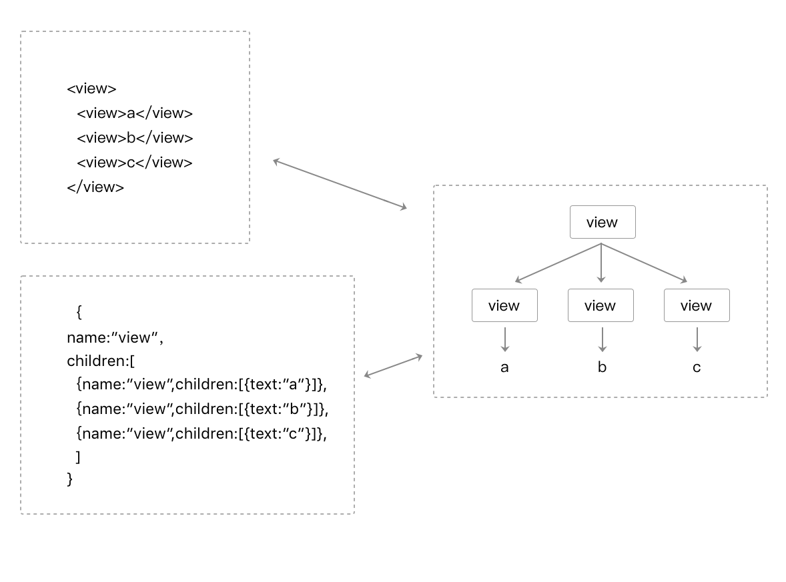
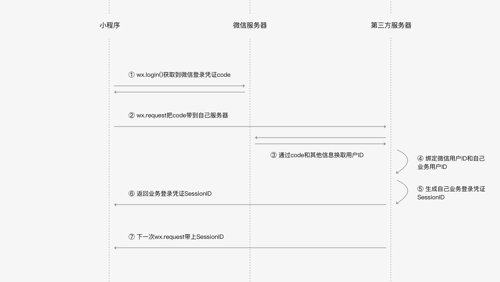

# 小程序知识总结

## 核心概念

### 小程序基本代码组成

#### JSON配置

##### JSON语法

* 注意JSON语法
  * 名称和值都要用双引号
  * 无法使用注释
* JSON的值只能是以下几种数据格式：
  1. 数字，包含浮点数和整数
  2. 字符串，需要包裹在双引号中
  3. Bool值，true 或者 false
  4. 数组，需要包裹在方括号中 []
  5. 对象，需要包裹在大括号中 {}
  6. Null

##### JSON配置的使用

* 在每个文件夹下有一个对应的json文件来进行页面相关初始项的配置
* 通过JSON来配置的项是**无法在运行时动态更新的**
* app.json是全局配置，其他每个文件夹中的配置是局部配置

#### WXML 模板

 WeiXin Markup Language，一套微信设计的标签语言。app.json配置中的pages配置可以生成页面到对应的文件夹和其中的wxml文件。

##### 语法

```html
<!-- 在此处写注释 -->

<标签名 属性名1="属性值1" 属性名2="属性值2" ...> ...</标签名>
```

* WXML 要求标签必须是严格闭合的，没有闭合将会导致编译错误
* WXML中的属性是大小写敏感的，也就是说 class 和 Class 在WXML中是不同的属性

##### 数据绑定

```html
<!--pages/wxml/index.wxml-->
<!--通过{{变量}}动态渲染变量-->
<text>当前时间：{{time}}</text>

// pages/wxml/index.js
Page({
  /**
   * 页面的初始数据
   */
  data: {
    time: (new Date()).toString()
  },
})
```

```html
<!-- 属性值的动态绑定 -->
<!-- 正确的写法：注意{{}}要放在""中 -->
<text data-test="{{test}}"> hello world</text>


<!-- 错误的写法  -->
<text data-test={{test}}> hello world </text >
```

```html
<!--
{
  w: 'w',
  W: 'W'
}
大小写敏感
-->


<view>{{w}}</view>
<view>{{W}}</view>


<!-- 输出
w
W
-->
```

```html
<!--
{
  var2: undefined,
  var3: null,
  var4: "var4"
}
为undefined的值和没有定义的值都不会渲染出来，null可以渲染为null
-->


<view>{{var1}}</view>
<view>{{var2}}</view>
<view>{{var3}}</view>
<view>{{var4}}</view>


<!--
输出：
null
var4
-->
```

##### 逻辑语法

可以在{{}}中进行简单的逻辑运算，比如加减，三元，字符串拼接等。

##### 条件逻辑

```html
<view wx:if="{{length > 5}}"> 1 </view>
<view wx:elif="{{length > 2}}"> 2 </view>
<view wx:else> 3 </view>
```

如果要一次性判断多个组件标签，可以使用一个 `<block/>` 标签将多个组件包装起来，并在上边使用 wx:if 控制属性。

```html
<block wx:if="{{true}}">
  <view> view1 </view>
  <view> view2 </view>
</block>
```

##### 列表渲染

```html
<!-- array 是一个数组 -->
<view wx:for="{{array}}">
  {{index}}: {{item.message}}
</view>

<!-- 对应的脚本文件
Page({
  data: {
    array: [{
      message: 'foo',
    }, {
      message: 'bar'
    }]
  }
})
-->

<!-- 或者给遍历的每一项一个变量名 -->
<view wx:for="{{array}}" wx:for-index="idx" wx:for-item="itemName">
  {{idx}}: {{itemName.message}}
</view>
```

类似 `block wx:if` ，也可以将 `wx:for` 用在 `<block/>` 标签上，以渲染一个包含多节点的结构块。例如：

```html
<block wx:for="{{[1, 2, 3]}}">
  <view> {{index}}: </view>
  <view> {{item}} </view>
</block>
```

通过`wx:key` 来指定列表中项目的唯一的标识符，减少重复渲染，提高性能：

```html
<!--方式一：使用每一个遍历item中的名称为'unique'的属性-->
<switch wx:for="{{objectArray}}" wx:key="unique" > {{item.id}} </switch>
<button bindtap="switch"> Switch </button>
<button bindtap="addToFront"> Add to the front </button>

<!--方式一：使用每一个遍历item本身，这要求遍历的值为字符串或者数字-->
<switch wx:for="{{numberArray}}" wx:key="*this" > {{item}} </switch>
<button bindtap="addNumberToFront"> Add Number to the front </button>
```

```javascript
Page({
  data: {
    objectArray: [
      {id: 5, unique: 'unique_5'},
      {id: 4, unique: 'unique_4'},
      {id: 3, unique: 'unique_3'},
      {id: 2, unique: 'unique_2'},
      {id: 1, unique: 'unique_1'},
      {id: 0, unique: 'unique_0'},
    ],
    numberArray: [1, 2, 3, 4]
  },
  
  // 交换objectArray中任意两个item的位置
  switch: function(e) {
    const length = this.data.objectArray.length
    for (let i = 0; i < length; ++i) {
      const x = Math.floor(Math.random() * length)
      const y = Math.floor(Math.random() * length)
      const temp = this.data.objectArray[x]
      this.data.objectArray[x] = this.data.objectArray[y]
      this.data.objectArray[y] = temp
    }
    this.setData({
      objectArray: this.data.objectArray
    })
  },
  
  addToFront: function(e) {
    const length = this.data.objectArray.length
    this.data.objectArray = [{id: length, unique: 'unique_' + length}].concat(this.data.objectArray)
    this.setData({
      objectArray: this.data.objectArray
    })
  },
  addNumberToFront: function(e){
    this.data.numberArray = [ this.data.numberArray.length + 1 ].concat(this.data.numberArray)
    this.setData({
      numberArray: this.data.numberArray
    })
  }
})
```

##### 模版

```html
<!--
数据定义：
item: {
  index: 0,
  msg: 'this is a template',
  time: '2016-06-18'
}
-->

<!-- 使用template定义模版，并用name定义模版名 -->
<template name="msgItem">
  <view>
    <text> {{index}}: {{msg}} </text>
    <text> Time: {{time}} </text>
  </view>
</template>

<!-- 使用template使用模版，用is去使用对应名称的模版，并且用data属性把各个属性的值传入 -->
<template is="msgItem" data="{{...item}}"/>

<!-- 输出
0: this is a template Time: 2016-06-18
-->
```

可以动态的使用is渲染模版：

```html
<template name="odd">
  <view> odd </view>
</template>


<template name="even">
  <view> even </view>
</template>


<block wx:for="{{[1, 2, 3, 4, 5]}}">
  <template is="{{item % 2 == 0 ? 'even' : 'odd'}}"/>
</block>


<!-- 输出
odd
even
odd
even
odd
-->
```

##### 引用

* import

```html
<!-- item.wxml -->
<template name="item">
  <text>{{text}}</text>
</template>
```

```html
<!-- 在另外一个文件中使用item这个template -->
<import src="item.wxml"/>

<template is="item" data="{{text: 'forbar'}}"/>
```

需要注意的是 import 有作用域的概念，即**只会 import 目标文件中定义的 template，而不会 import 目标文件中 import 的 template**，简言之就是 import 不具有递归的特性。

* include

include 可以将目标文件中除了 `<template/> <wxs/>` 外的整个代码引入，相当于是拷贝到 include 位置

```html
<!-- index.wxml -->
<include src="header.wxml"/>

<view> body </view>

<include src="footer.wxml"/>
```

```html
<!-- header.wxml -->
<view> header </view>
```

```html
<!-- footer.wxml -->
<view> footer </view>
```

##### 共有属性表

表2-1 共同属性

| **属性名**   | **类型**     | **描述**       | **注解**                                 |
| :----------- | :----------- | :------------- | :--------------------------------------- |
| id           | String       | 组件的唯一标识 | 整个页面唯一                             |
| class        | String       | 组件的样式类   | 在对应的 WXSS 中定义的样式类             |
| style        | String       | 组件的内联样式 | 可以动态设置的内联样式                   |
| hidden       | Boolean      | 组件是否显示   | 所有组件默认显示                         |
| data-*       | Any          | 自定义属性     | 组件上触发的事件时，会发送给事件处理函数 |
| bind*/catch* | EventHandler | 组件的事件     |                                          |

#### WXSS 样式

类CSS的样式文件

##### 文件组成


* 公共样式：注入小程序每个页面

* 页面样式：与app.json注册过的页面同名且位置同级的WXSS文件

* 其它样式：其它样式可以被项目公共；样式和页面样式引用

##### 尺寸单位

使用了rpx（responsive pixel）尺寸单位，在一个宽度为375px，物理像素也为375的屏幕下，1rpx = 1px。

##### WXSS引用

在**CSS**中，开发者可以这样引用另一个样式文件：`@import url('./test_0.css')`

这种方法在请求上不会把test_0.css合并到index.css中，也就是请求index.css的时候，会多一个test_0.css的请求。

在**小程序**中，我们依然可以实现样式的引用，样式引用是这样写：

```css
@import './test_0.wxss'
```

由于WXSS最终会被编译打包到目标文件中，用户只需要下载一次，在使用过程中不会因为样式的引用而产生多余的文件请求。

##### 内联样式

与CSS一致并支持动态内联样式：

```html
<!--index.wxml-->

<!--可动态变化的内联样式-->
<!--
{
  eleColor: 'red',
  eleFontsize: '48rpx'
}
-->
<view style="color: {{eleColor}}; font-size: {{eleFontsize}}"></view>
```

##### 选择器

目前支持的选择器：

| **类型**     | **选择器** | **样例**      | **样例描述**                                   |
| :----------- | :--------- | :------------ | :--------------------------------------------- |
| 类选择器     | .class     | .intro        | 选择所有拥有 class="intro" 的组件              |
| id选择器     | #id        | #firstname    | 选择拥有 id="firstname" 的组件                 |
| 元素选择器   | element    | view checkbox | 选择所有文档的 view 组件和所有的 checkbox 组件 |
| 伪元素选择器 | ::after    | view::after   | 在 view 组件后边插入内容                       |
| 伪元素选择器 | ::before   | view::before  | 在 view 组件前边插入内容                       |

权重（与CSS类似）：


##### 官方样式库

https://github.com/Tencent/weui-wxss

#### JavaScript 脚本

##### ECMAScript

ECMAScript（European Computer ManufacturersAssociation）通过ECMA-262标准化的脚本程序设计语言。 JavaScript 是 ECMAScript 的一种实现。

ECMA-262 规定了 ECMAScript 语言的几个重要组成部分：

1. 语法
2. 类型
3. 语句
4. 关键字
5. 操作符
6. 对象

ECMAScript只包含了以上的语言部分的规范，但是JS实际上在不同的环境中为了达到不同的目的还有一些ECMAScript规范意外的功能，如下：

* 浏览器中的js:


浏览器中的JS提供给了JS运行环境，实现了ES的语法规范，还封装了DOM，BOM这两个和浏览器沟通的API库。

* NodeJs中的js:


Node JS中的js同样提供了JS运行环境，实现了基本语法规范，添加了NPM包管理功能，同时通过使用一些原生的模块例如 FS、HTTP、OS等等来拥有一些语言本身所不具有的能力，可以更好的和网络，操作系统等资源进行交互，从而进行一些服务器端的开发能力。

* 小程序中的js:


小程序中的 JavaScript 是由ECMAScript 以及小程序框架和小程序 API 来实现的。同浏览器中的JavaScript 相比没有 BOM 以及 DOM 对象，所以类似 JQuery、Zepto这种浏览器类库是无法在小程序中运行起来的，同样的缺少 Native 模块和NPM包管理的机制，小程序中无法加载原生库，也无法直接使用大部分的 NPM 包。

##### 小程序的执行环境

不同的平台的小程序的脚本执行环境也是有所区别的。

小程序目前可以运行在三大平台：

1. iOS平台，包括iOS9、iOS10、iOS11
2. Android平台
3. 小程序IDE

iOS9和iOS10 所使用的运行环境并没有完全的兼容到 ECMAScript 6 标准，一些 ECMAScript 6 中规定的语法和关键字是没有的或者同标准是有所不同的，例如：

1. 箭头函数
2. let const
3. 模板字符串
4. …

所以一些开发者会发现有些代码在旧的手机操作系统上出现一些语法错误。为了帮助开发者解决这类问题，小程序IDE提供语法转码工具帮助开发者，将 ECMAScript 6代码转为 ECMAScript 5代码，从而在所有的环境都能得到很好的执行。

开发者需要在项目设置中，勾选 ES6 转 ES5 开启此功能。

##### 模块化

小程序中实现了CommonJs的模块规范实现模块化

```javascript
// moduleA.js
module.exports = function( value ){
  return value * 2;
}
```

```javascript
// B.js

// 在B.js中引用模块A
var multiplyBy2 = require('./moduleA')
var result = multiplyBy2(4)
```

##### 脚本执行顺序

浏览器中的\<script>标签是按照加载的顺序执行的（如果不考虑async defer的方式），而在小程序中的脚本执行顺序有所不同。

小程序的执行的入口文件是 app.js 。并且会根据其中 require 的模块顺序决定文件的运行顺序。

```javascript
/* a.js
console.log('a.js')
*/
var a = require('./a.js')
console.log('app.js')

/* b.js
console.log('b.js')
*/
var b = require('./b.js')
```

以上代码的输出顺序是：

```
a.js

app.js

b.js
```

当 app.js 执行结束后，小程序会按照开发者在 app.json 中定义的 pages 的顺序，逐一执行。如代码2-31所示。

代码清单2-31 app.json 文件

```json
{
  "pages": [
    "pages/index/index",
    "pages/log/log",
    "pages/result/result"
  ],
  "window": {}
}
```

app.js文件

```javascript
// app.js
console.log('app.js')
```

pages/index/index.js 文件

```javascript
// pages/index/index
console.log('pages/index/index')
```

page/log/log.js 文件

```javascript
// pages/log/log
console.log('pages/log/log')
```

page/result/result.js 文件

```javascript
// pages/result/result
console.log('pages/result/result')
```

以上文件执行后输出的结果如下：

```
app.js

pages/index/index

pages/log/log

pages/result/result
```

##### 作用域

* 在文件中声明的变量和函数只在该文件中有效，不同的文件中可以声明相同名字的变量和函数，不会互相影响。

* 在局部作用域中全局变量的获取和使用：

代码清单2-38 在脚本 a.js 中设置全局变量

```javascript
// a.js
// 获取全局变量
var global = getApp()
global.globalValue = 'globalValue'
```

代码清单2-39 在脚本 b.js 中访问 a.js 定义的全局变量

```javascript
// b.js
// 访问全局变量
var global = getApp()
console.log(global.globalValue) // 输出 globalValue
```

需要注意的是，上述示例只有在 a.js 比 b.js 先执行才有效当需要保证全局的数据可以在任何文件中安全的被使用到。所以可以现在全局初始化。

* 在全局中初始全局变量，那么可以在 App() 中进行设置

```javascript
// app.js
App({
  globalData: 1
})
```

```javascript
// a.js
// 局部变量
var localValue = 'a'

// 获取 global 变量
var app = getApp()

// 修改 global 变量
app.globalData++  // 执行后 globalData 数值为 2
```

```javascript
// b.js
// 定义另外的局部变量，并不会影响 a.js 中文件变量
var localValue = 'b'

// 如果先执行了 a.js 这里的输出应该是 2
console.log(getApp().globalData)
```

### 小程序宿主环境

#### 渲染层和逻辑层

##### 通信模型


##### 数据驱动

WXML结构实际上等价于一棵Dom树，通过一个JS对象也可以来表达Dom树的结构



WXML可以先转成JS对象，然后再渲染出真正的Dom树


通过setData把msg数据从“Hello World”变成“Goodbye”，产生的JS对象对应的节点就会发生变化，此时可以对比前后两个JS对象得到变化的部分，然后把这个差异应用到原来的Dom树上，从而达到更新UI的目的，这就是“数据驱动”的原理


##### 双线程下的界面渲染


#### 程序与页面

##### 程序

这里的程序指的是一个小程序app。

1. 程序构造器app()

必须写在根目录app.js中的构造器，用于初始化整个小程序app，其中的参数为一个对象，用于各种对应的生命周期方法。

```javascript
App({
  onLaunch: function(options) {},
  onShow: function(options) {},
  onHide: function() {},
  onError: function(msg) {},
  globalData: 'I am global data'
})
```

2. 程序的生命周期和打开场景

| 参数属性 | 类型     | 描述                                                         |
| :------- | :------- | :----------------------------------------------------------- |
| onLaunch | Function | 当小程序初始化完成时，会触发 onLaunch（全局只触发一次）      |
| onShow   | Function | 当小程序启动，或从后台进入前台显示，会触发 onShow            |
| onHide   | Function | 当小程序从前台进入后台，会触发 onHide                        |
| onError  | Function | 当小程序发生脚本错误，或者 API 调用失败时，会触发 onError 并带上错误信息 |
| 其他字段 | 任意     | 可以添加任意的函数或数据到 Object 参数中，在App实例回调用 this 可以访问 |

其中的生命周期函数可以带参数：

```javascript
App({
  onLaunch: function(options) { console.log(options) },//options是一个对象，该对象中有下表所示的字段
  onShow: function(options) { console.log(options) }
})
```

| 字段                   | 类型   | 描述                                                    |
| :--------------------- | :----- | :------------------------------------------------------ |
| path                   | String | 打开小程序的页面路径                                    |
| query                  | Object | 打开小程序的页面参数query                               |
| scene                  | Number | 打开小程序的场景值，详细场景值请参考小程序官方文档      |
| shareTicket            | String | shareTicket，详见小程序官方文档                         |
| referrerInfo           | Object | 当场景为由从另一个小程序或公众号或App打开时，返回此字段 |
| referrerInfo.appId     | String | 来源小程序或公众号或App的 appId，详见下方说明           |
| referrerInfo.extraData | Object | 来源小程序传过来的数据，scene=1037或1038时支持          |

| 场景值 | 场景               | appId信息含义                         |
| :----- | :----------------- | :------------------------------------ |
| 1020   | 公众号 profile     | 页相关小程序列表 返回来源公众号 appId |
| 1035   | 公众号自定义菜单   | 返回来源公众号 appId                  |
| 1036   | App 分享消息卡片   | 返回来源应用 appId                    |
| 1037   | 小程序打开小程序   | 返回来源小程序 appId                  |
| 1038   | 从另一个小程序返回 | 返回来源小程序 appId                  |
| 1043   | 公众号模板消息     | 返回来源公众号 appId                  |

3. 小程序全局数据

小程序的JS脚本是运行在JsCore的线程里，小程序的每个页面各自有一个WebView线程进行渲染，所以小程序切换页面时，小程序逻辑层的JS脚本运行上下文依旧在同一个JsCore线程中。

App实例是单例的，因此不同页面直接可以通过App实例下的属性来共享数据。App构造器可以传递其他参数作为全局属性以达到全局共享数据的目的。

```javascript
// app.js
App({
  globalData: 'I am global data' // 全局共享数据
})
// 其他页面脚本other.js
var appInstance = getApp()
console.log(appInstance.globalData) // 输出: I am global data
```

我们要特别留意一点，所有页面的脚本逻辑都跑在同一个JsCore线程，页面使用setTimeout或者setInterval的定时器，然后跳转到其他页面时，这些定时器并没有被清除，需要开发者自己在页面离开的时候进行清理。

##### 页面

页面就是指每一个在app中能看到的页面。

1. 文件构成和路径

每一个页面路径需要在根目录app.json中的pages字段声明，否则这个页面不会被注册到宿主环境中。

```javascript
{
  "pages":[
    "pages/index/page", // 第一项默认为首页
    "pages/other/other"
  ]
}
```

2. 页面构造器Page()

Page()在页面脚本page.js中调用，用来注册一个页面，其中也有对应的数据初始化和生命周期函数。

```javascript
Page({
  data: { text: "This is page data." },
  onLoad: function(options) { },
  onReady: function() { },
  onShow: function() { },
  onHide: function() { },
  onUnload: function() { },
  onPullDownRefresh: function() { },
  onReachBottom: function() { },
  onShareAppMessage: function () { },
  onPageScroll: function() { }
})
```

3. 生命周期

| 参数属性          | 类型     | 描述                                                         |
| :---------------- | :------- | :----------------------------------------------------------- |
| data              | Object   | 页面的初始数据                                               |
| onLoad            | Function | 生命周期函数--监听页面加载，触发时机早于onShow和onReady，只最开始触发一次 |
| onReady           | Function | 生命周期函数--监听页面初次渲染完成，只触发一次               |
| onShow            | Function | 生命周期函数--监听页面显示，触发事件早于onReady              |
| onHide            | Function | 生命周期函数--监听页面隐藏                                   |
| onUnload          | Function | 生命周期函数--监听页面卸载                                   |
| onPullDownRefresh | Function | 页面相关事件处理函数--监听用户下拉动作                       |
| onReachBottom     | Function | 页面上拉触底事件的处理函数                                   |
| onShareAppMessage | Function | 用户点击右上角转发                                           |
| onPageScroll      | Function | 页面滚动触发事件的处理函数                                   |
| 其他              | Any      | 可以添加任意的函数或数据，在Page实例的其他函数中用 this 可以访问 |

```javascript
// 一个实例，其中onLoad生命周期的参数中自动解析了url中的参数被放在了option中
// pages/list/list.js
// 列表页使用navigateTo跳转到详情页
wx.navigateTo({ url: 'pages/detail/detail?id=1&other=abc' })

// pages/detail/detail.js
Page({
  onLoad: function(option) {
        console.log(option.id)
        console.log(option.other)
  }
})
```

4. 页面的数据

page中定义的data属性就是渲染层初始化能拿到的数据。

```html
<!-- page.wxml -->
<view>{{text}}</view>
<view>{{array[0].msg}}</view>

// page.js
Page({
  data: {
    text: 'init data',
    array: [{msg: '1'}, {msg: '2'}]
  }
})
```

必须要用page实例中的原型上的setData函数才能把要更新的数据传递给渲染层。这是一个异步的过程，所以setData的第二个参数是一个callBack回调。

```javascript
// page.js
Page({
  onLoad: function(){
    this.setData({
      text: 'change data'
    }, function(){
      // 在这次setData对界面渲染完毕后触发
    })
  }
})
```

setData方法只需要给一个改变的最小单位数据即可，没给的数据项并不会改变。并且支持数据链路的写法，例如 this.setData({"d[0]": 100}); this.setData({"d[1].text": 'Goodbye'});

```javascript
// page.js
Page({
  data: {
    a: 1, b: 2, c: 3,
    d: [1, {text: 'Hello'}, 3, 4]
  }
  onLoad: function(){
       // a需要变化时，只需要setData设置a字段即可
    this.setData({a : 2})
  }
})
```

注意：

* 直接修改 Page实例的this.data 而不调用 this.setData 是无法改变页面的状态的，还会造成数据不一致。

* 由于setData是需要两个线程的一些通信消耗，为了提高性能，每次设置的数据不应超过1024kB。

* 不要把data中的任意一项的value设为undefined，否则可能会有引起一些不可预料的bug。

5. 页面的用户行为

小程序宿主环境提供了四个和页面相关的用户行为回调：

* 下拉刷新 onPullDownRefresh
  监听用户下拉刷新事件，需要在app.json的window选项中或页面配置page.json中设置enablePullDownRefresh为true。当处理完数据刷新后，wx.stopPullDownRefresh可以停止当前页面的下拉刷新。

* 上拉触底 onReachBottom
  监听用户上拉触底事件。可以在app.json的window选项中或页面配置page.json中设置触发距离onReachBottomDistance。在触发距离内滑动期间，本事件只会被触发一次。

* 页面滚动 onPageScroll
  监听用户滑动页面事件，参数为 Object，包含 scrollTop 字段，表示页面在垂直方向已滚动的距离（单位px）。

* 用户转发 onShareAppMessage
  只有定义了此事件处理函数，右上角菜单才会显示“转发”按钮，在用户点击转发按钮的时候会调用，此事件需要return一个Object，包含title和path两个字段，用于自定义转发内容，如代码清单3-13所示。

使用onShareAppMessage自定义转发字段

```javascript
// page.js
Page({
onShareAppMessage: function () {
 return {
   title: '自定义转发标题',
   path: '/page/user?id=123'
 }
}
})
```

6. 页面跳转和路由

* 普通页面跳转

wx.navigateTo推入新页面，新的页面是进入页面栈栈顶，这个栈最多只能有10个元素，多了就不能继续推了。

wx.navigateBack()可以让栈顶元素出栈，让距离栈顶最近的页面呈现。

wx.redirectTo({ url: 'pageE' })更换栈顶元素为参数中给的页面，当页面栈达到10个元素后就要用这个api来实现页面的跳转。

* Tabbar页面跳转

可以在app.json声明tabBar字段来定义Tabbar页。一个页面可以既是tabbar页也是普通页。

```json
{
  "tabBar": {
    "list": [
      { "text": "Tab1", "pagePath": "pageA" },
      { "text": "Tab1", "pagePath": "pageF" },
      { "text": "Tab1", "pagePath": "pageG" }
    ]
  }
}
```

wx.switchTab({ url: 'pageF' })，如果页面栈里面只有普通页面，就清空所有普通页，再把参数中的tabbar页放入栈顶。

在这个页面栈[pageA,pageB,pageC]中使用wx.switchTab({ url: 'pageF' })，此时原来的页面栈会被清空（除了已经声明为Tabbar页pageA外其他页面会被销毁），然后会切到pageF所在的tab页面，页面栈变成 [ pageF ]，此时点击Tab1切回到pageA时，**pageA不会再触发onLoad，因为pageA没有被销毁。**
补充一下，wx.navigateTo和wx.redirectTo只能打开非TabBar页面，wx.switchTab只能打开Tabbar页面。
我们还可以使用 wx. reLaunch({ url: 'pageH' }) 重启小程序，并且打开pageH，此时页面栈为 [ pageH ]。下表罗列了详细的页面路由触发方式及页面生命周期函数的对应关系。

表3-5 页面路由触发方式及页面生命周期函数的对应关系

| 路由方式        | 触发时机                   | 路由前页面生命周期 | 路由后页面生命周期 |
| :-------------- | :------------------------- | :----------------- | :----------------- |
| 初始化          | 小程序打开的第一个页面     |                    | onLoad, onShow     |
| 打开新页面 调用 | API wx.navigateTo          | onHide             | onLoad, onShow     |
| 页面重定向 调用 | API wx.redirectTo          | onUnload           | onLoad, onShow     |
| 页面返回 调用   | API wx.navigateBack        | onUnload           | onShow             |
| Tab             | 切换 调用 API wx.switchTab | 请参考下表         | 请参考下表         |
| 重启动          | 调用 API wx.reLaunch       | onUnload           | onLoad, onShow     |

Tab 切换对应的生命周期（以 A、B 页面为 Tabbar 页面，C 是从 A 页面打开的页面，D 页面是从 C 页面打开的页面为例）如下表所示，注意Tabbar页面初始化之后不会被销毁。

| 当前页面      | 路由后页面  | 触发的生命周期（按顺序）                           |
| :------------ | :---------- | :------------------------------------------------- |
| A             | A           | 无                                                 |
| A             | B           | A.onHide(), B.onLoad(), B.onShow()                 |
| A             | B(再次打开) | A.onHide(), B.onShow()                             |
| C             | A           | C.onUnload(), A.onShow()                           |
| C             | B           | C.onUnload(), B.onLoad(), B.onShow()               |
| D             | B           | D.onUnload(), C.onUnload(), B.onLoad(), B.onShow() |
| D(从转发进入) | A           | D.onUnload(), A.onLoad(), A.onShow()               |
| D(从转发进入) | B           | D.onUnload(), B.onLoad(), B.onShow()               |

#### 组件

需要注意，所有组件名和属性都是小写，多个单词会以英文横杠 "-" 进行连接。
对于一些容器组件，其内容可以声明在其开始标签和结束标签之间。

所有组件都拥有下表列举的属性内容。

| 属性名         | 类型         | 描述           | 其他说明                                 |
| :------------- | :----------- | :------------- | :--------------------------------------- |
| id             | String       | 组件的唯一标示 | 保持整个页面唯一                         |
| class          | String       | 组件的样式类   | 在对应的WXSS中定义的样式类               |
| style          | String       | 组件的内联样式 | 可以通过数据绑定进行动态设置的内联样式   |
| hidden         | Boolean      | 组件是否显示   | 所有组件默认显示                         |
| data-*         | Any          | 自定义属性     | 组件上触发的事件时，会发送给事件处理函数 |
| bind */ catch* | EventHandler | 事件           | 详情见3.5节                              |

#### API

一般就是指wx这个全局宿主环境对象提供的api,一般分为如下几类：

1. wx.on* 开头的 API 是监听某个事件发生的API接口，接受一个 Callback 函数作为参数。当该事件触发时，会调用 Callback 函数。
2. 如未特殊约定，多数 API 接口为异步接口 ，都接受一个Object作为参数。
3. API的Object参数一般由success、fail、complete三个回调来接收接口调用结果，示例代码如代码清单3-17所示，详细说明如表3-9所示。
4. wx.get* 开头的API是获取宿主环境数据的接口。
5. wx.set* 开头的API是写入数据到宿主环境的接口。

API接口回调说明

| 参数名字 | 类型     | 必填 | 描述                                             |
| :------- | :------- | :--- | :----------------------------------------------- |
| success  | Function | 否   | 接口调用成功的回调函数                           |
| fail     | Function | 否   | 接口调用失败的回调函数                           |
| complete | Function | 否   | 接口调用结束的回调函数（调用成功、失败都会执行） |

#### 事件

##### 事件是什么


所有在渲染层发生的可能影响逻辑层数据的事情，并且不一定是由用户直接触发。

```html
<!-- page.wxml 绑定bindtap事件-->
<view id="tapTest" data-hi="WeChat" bindtap="tapName"> Click me! </view>

// page.js
   Page({
  tapName: function(event) {
    console.log(event)
  }
})
```

##### 事件类型和事件对象

常见事件类型：

| 类型               | 触发条件                                                     |
| :----------------- | :----------------------------------------------------------- |
| touchstart         | 手指触摸动作开始                                             |
| touchmove          | 手指触摸后移动                                               |
| touchcancel        | 手指触摸动作被打断，如来电提醒，弹窗                         |
| touchend           | 手指触摸动作结束                                             |
| tap                | 手指触摸后马上离开                                           |
| longpress          | 手指触摸后，超过350ms再离开，如果指定了事件回调函数并触发了这个事件，tap事件将不被触发 |
| longtap            | 手指触摸后，超过350ms再离开（推荐使用longpress事件代替）     |
| transitionend      | 会在 WXSS transition 或 wx.createAnimation 动画结束后触发    |
| animationstart     | 会在一个 WXSS animation 动画开始时触发                       |
| animationiteration | 会在一个 WXSS animation 一次迭代结束时触发                   |
| animationend       | 会在一个 WXSS animation 动画完成时触发                       |

事件对象属性

| 属性           | 类型    | 说明                                         |
| :------------- | :------ | :------------------------------------------- |
| type           | String  | 事件类型                                     |
| timeStamp      | Integer | 页面打开到触发事件所经过的毫秒数             |
| target         | Object  | 触发该事件的源头组件的一些属性值集合         |
| currentTarget  | Object  | 当前组件的一些属性值集合                     |
| detail         | Object  | 额外的信息                                   |
| touches        | Array   | 触摸事件，当前停留在屏幕中的触摸点信息的数组 |
| changedTouches | Array   | 触摸事件，当前变化的触摸点信息的数组         |

关于target和currentTarget对象的详细参数

| 属性    | 类型   | 说明                                        |
| :------ | :----- | :------------------------------------------ |
| id      | String | 当前组件的id                                |
| tagName | String | 当前组件的类型                              |
| dataset | Object | 当前组件上由data-开头的自定义属性组成的集合 |

关于touch和changedTouches对象的详细参数

| 属性             | 类型   | 说明                                                         |
| :--------------- | :----- | :----------------------------------------------------------- |
| identifier       | Number | 触摸点的标识符                                               |
| pageX, pageY     | Number | 距离文档左上角的距离，文档的左上角为原点 ，横向为X轴，纵向为Y轴 |
| clientX, clientY | Number | 距离页面可显示区域（屏幕除去导航条）左上角距离，横向为X轴，纵向为Y轴 |

##### 事件绑定与冒泡捕获


capture-bind:事件名   如： capture-bind:bindtap  表示事件捕获阶段的bindtap触发

bind:事件名    如： bind:bindtap 表示冒泡阶段的bindtap触发

capture-catch:事件名   如： capture-catch:bindtap  表示事件捕获阶段的bindtap触发并中断事件传播

catch:事件名   如： catch:bindtap  表示事件冒泡阶段的bindtap触发并中断事件传播

注意，除表3-10列举的事件类型之外的其他组件自定义事件，如无特殊声明都是非冒泡事件，如\<form/>的submit事件，\<input/>的input事件，\<scroll-view/>的scroll事件。

#### 兼容

通过wx.getSystemInfoSync获取宿主环境信息：

```javascript
wx.getSystemInfoSync()
/*
  {
    brand: "iPhone",      // 手机品牌
    model: "iPhone 6",    // 手机型号
    platform: "ios",      // 客户端平台
    system: "iOS 9.3.4",  // 操作系统版本
    version: "6.5.23",    // 微信版本号
    SDKVersion: "1.7.0",  // 小程序基础库版本
    language: "zh_CN",    // 微信设置的语言
    pixelRatio: 2,        // 设备像素比
    screenWidth: 667,    // 屏幕宽度
    screenHeight: 375,     // 屏幕高度
    windowWidth: 667,    // 可使用窗口宽度
    windowHeight: 375,     // 可使用窗口高度
    fontSizeSetting: 16   // 用户字体大小设置
  }
 */
```

```javascript
if (wx.openBluetoothAdapter) {
  wx.openBluetoothAdapter()
} else {
  // 如果希望用户在最新版本的客户端上体验您的小程序，可以这样子提示
  wx.showModal({
    title: '提示',
    content: '当前微信版本过低，无法使用该功能，请升级到最新微信版本后重试。'
  })
}
```

新版本的宿主环境会提供一些新的API，可以通过如下方式来判断用户的版本是否支持新功能：

```javascript
if (wx.openBluetoothAdapter) {
  wx.openBluetoothAdapter()
} else {
  // 如果希望用户在最新版本的客户端上体验您的小程序，可以这样子提示
  wx.showModal({
    title: '提示',
    content: '当前微信版本过低，无法使用该功能，请升级到最新微信版本后重试。'
  })
}
```

使用wx.canIUse这个API判断接口或者是组件在当前宿主环境是否可用，其参数格式为: `${API}.${method}.${param}.${options}或者${component}.${attribute}.${option}`

- ${API} 代表 API 名字
- ${method} 代表调用方式，有效值为return, success, object, callback
- ${param} 代表参数或者返回值
- ${options} 代表参数的可选值
- ${component} 代表组件名字
- ${attribute} 代表组件属性
- ${option} 代表组件属性的可选值

### 场景应用

#### 布局

在小程序中主要就用flex

#### 界面常见的交互反馈

直接看文档即可

#### 发起HTTPS网络通信

##### wx.request

```javascript
wx.request({

  url: 'https://test.com/getinfo',

  success: function(res) {// 成功时的回调信息

    console.log(res)// 服务器回包信息

  }

})
```

| **参数名** | **类型**      | **必填** | **默认值** | **描述**                                                     |
| :--------- | :------------ | :------- | :--------- | :----------------------------------------------------------- |
| url        | String        | 是       |            | 开发者服务器接口地址                                         |
| data       | Object/String | 否       |            | 请求的参数                                                   |
| header     | Object        | 否       |            | 设置请求的 header，header 中不能设置 Referer，默认header['content-type'] = 'application/json' |
| method     | String        | 否       | GET        | （需大写）有效值：OPTIONS, GET, HEAD, POST, PUT, DELETE, TRACE, CONNECT |
| dataType   | String        | 否       | json       | 回包的内容格式，如果设为json，会尝试对返回的数据做一次 JSON解析 |
| success    | Function      | 否       |            | 收到开发者服务成功返回的回调函数，其参数是一个Object，见表4-2。 |
| fail       | Function      | 否       |            | 接口调用失败的回调函数                                       |
| complete   | Function      | 否       |            | 接口调用结束的回调函数（调用成功、失败都会执行）             |

##### 服务器接口

* 必须使用HTTPS服务的接口
* 正式上线的小程序必须使用在管理平台上配置的域名
* 开发阶段开发者工具上在某些情况下可以请求任意域名

##### 请求参数

get请求：

```javascript
// 通过url参数传递数据

wx.request({

  url:'https://test.com/getinfo?id=1&version=1.0.0',

  success: function(res) {

    console.log(res)// 服务器回包信息

  }

})

// 通过data参数传递数据，因为url长度有限制，所以最好都用data传数据

wx.request({

  url: 'https://test.com/getinfo',

     data: { id:1, version:'1.0.0' },

  success: function(res) {

    console.log(res)// 服务器回包信息

  }

})
```

POST请求：并不是所有请求都是按照键值对key=value的形式传递到后台服务器，有时候需要传一些比较复杂的数据结构到后台的时候，用JSON格式会更加合适。此时我们可以在wx.request的header参数设置content-type头部为application/json，小程序发起的请求的包体内容就是data参数对应的JSON字符串，如下：

```javascript
// 请求的包体为 {"a":{"b":[1,2,3],"c":{"d":"test"}}}

wx.request({

  url: 'https://test.com/postdata',

  method: 'POST',

  header: { 'content-type': 'application/json'},

  data: {

    a: {

      b: [1, 2, 3],

      c: { d: "test" }

    }

  },

  success: function(res) {

    console.log(res)// 服务器回包信息

  }

})
```

##### 收到返回

小程序端收到回包后会触发success回调，同时回调会带上一个Object信息，wx.request的success回调参数返回参数：

| **参数名** | **类型**      | **描述**                                |
| :--------- | :------------ | :-------------------------------------- |
| data       | Object/String | 开发者服务器返回的数据                  |
| statusCode | Number        | 开发者服务器返回的 HTTP 状态码          |
| header     | Object        | 开发者服务器返回的 HTTP Response Header |

尤其注意，只要成功收到服务器返回，无论HTTP状态码是多少都会进入success回调。因此开发者自己通过对回包的返回码进行判断后再执行后续的业务逻辑。

success回调的参数data字段类型是根据header['content-type']决定的，默认header['content-type']是'application/json'，在触发success回调前，小程序宿主环境会自动对data字段的值做JSON解析，如果解析成功，那么data字段的值会被设置成解析后的Object对象，其他情况data字段都是String类型，其值为HTTP回包包体。

##### 使用技巧

1. 设置超时时间

如果一个请求等太久就要给用户一个服务不可用的提示，这个时间可以在app.json中设置。

```javascript
//app.json
{

  "networkTimeout": {

    "request": 3000

  }

}
```

2. 请求前后的状态处理

用一个hasClick变量来记录状态防止用户连续点击触发多次请求

```javascript
var hasClick = false;

Page({

  tap: function() {

    if (hasClick) {

      return

    }

    hasClick = true

    wx.showLoading()


    wx.request({

      url: 'https://test.com/getinfo',

      method: 'POST',

      header: { 'content-type':'application/json' },

      data: { },

      success: function (res) {

        if (res.statusCode === 200) {

          console.log(res.data)// 服务器回包内容

        }

      },

      fail: function (res) {

        wx.showToast({ title: '系统错误' })

      },

      complete: function (res) {

        wx.hideLoading()

        hasClick = false

      }

    })

  }

})
```

#### 微信登录



1. 通过wx.login()获取微信登录凭证code

这是一个时限为5分钟的凭证，小程序端需要在5分钟内发送这个凭证code给自己的后台让后台用这个code和微信服务器换取用户的id。

引入这样一个登录凭证code的机制主要是为了避免黑客的攻击。具体❓

2. 发送code到开发者服务器

如果是首次登录开发者服务器，应该顺带业务侧的账号密码。

```javascript
Page({

  tapLogin: function() {

    wx.login({

      success: function(res) {

        if (res.code) {

          wx.request({

            url: 'https://test.com/login',

            data: {

              username: 'zhangsan', // 用户输入的账号

              password: 'pwd123456', // 用户输入的密码

              code: res.code

            },

            success: function(res) {

              // 登录成功

              if (res.statusCode === 200) {

               console.log(res.data.sessionId)// 服务器回包内容

              }

            }

          })

        } else {

          console.log('获取用户登录态失败！' + res.errMsg)

        }

      }

    });

  }

})
```

3. 到微信服务器换取用户身份id

带上AppId和AppSecret去换。返回字段如下：

| **字段**    | **描述**                                                     |
| :---------- | :----------------------------------------------------------- |
| openid      | 微信用户的唯一标识                                           |
| session_key | 会话密钥：开发者服务器和微信服务器的会话密钥                 |
| unionid     | 用户在微信开放平台的唯一标识符。本字段在满足一定条件的情况下才返回。 |

4. 绑定微信用户身份id和业务用户身份

绑定微信身份id和业务身份从而以后就可以绑定微信身份和业务身份，以后就不用再登录业务侧了，这就是静默授权的登录方式。

5. 业务登录凭证SessionId

用户登录成功之后，开发者服务器需要生成会话密钥SessionId，在服务端保持SessionId对应的用户身份信息，同时把SessionId返回给小程序。小程序后续发起的请求中携带上SessionId，开发者服务器就可以通过服务器端的Session信息查询到当前登录用户的身份，这样我们就不需要每次都重新获取code，省去了很多通信消耗。

#### 本地数据缓存 

##### 读写本地缓存

```javascript
// 异步读取缓存
wx.getStorage({

  key: 'key1',

  success: function(res) {

    // 异步接口在success回调才能拿到返回值

    var value1 = res.data

  },

  fail: function() {

    console.log('读取key1发生错误')

  }

})


// 同步读取缓存
try{

  // 同步接口立即返回值

  var value2 = wx.getStorageSync('key2')

}catch (e) {

  console.log('读取key2发生错误')

}
```

wx.getStorage/wx.getStorageSync详细参数

| **参数名** | **类型** | **必填** | **描述**                                                     |
| :--------- | :------- | :------- | :----------------------------------------------------------- |
| key        | String   | 是       | 本地缓存中指定的 key                                         |
| success    | Function | 否       | 异步接口调用成功的回调函数，回调参数格式: {data: key对应的内容} |
| fail       | Function | 否       | 异步接口调用失败的回调函数                                   |
| complete   | Function | 否       | 异步接口调用结束的回调函数（调用成功、失败都会执行）         |

```javascript
// 异步调用缓存
// 异步接口在success/fail回调才知道写入成功与否
wx.setStorage({

  key:"key",

  data:"value1"

  success: function() {

    console.log('写入value1成功')

  },

  fail: function() {

    console.log('写入value1发生错误')

  }

})


// 同步调用缓存
try{

  // 同步接口立即写入

  wx.setStorageSync('key', 'value2')

  console.log('写入value2成功')

}catch (e) {

  console.log('写入value2发生错误')

}
```

wx.setStorage/wx.setStorageSync详细参数

| **参数名** | **类型**      | **必填** | **描述**                                             |
| :--------- | :------------ | :------- | :--------------------------------------------------- |
| key        | String        | 是       | 本地缓存中指定的 key                                 |
| data       | Object/String | 是       | 需要存储的内容                                       |
| success    | Function      | 否       | 异步接口调用成功的回调函数                           |
| fail       | Function      | 否       | 异步接口调用失败的回调函数                           |
| complete   | Function      | 否       | 异步接口调用结束的回调函数（调用成功、失败都会执行） |

##### 缓存限制和隔离

每个小程序的缓存空间上限为10MB，如果当前缓存已经达到10MB，再通过wx.setStorage写入缓存会触发fail回调。

不同小程序和同种小程序不同账户之间的缓存也是隔离的。

##### 利用本地缓存提前渲染界面

```javascript
Page({

  onLoad: function() {

    var that = this

    var list =wx.getStorageSync("list")


    if (list) { // 本地如果有缓存列表，提前渲染

      that.setData({

        list: list

      })

    }

    wx.request({

      url: 'https://test.com/getproductlist',

      success: function (res) {

        if (res.statusCode === 200) {

          list = res.data.list

          that.setData({ // 再次渲染列表

            list: list

          })

          wx.setStorageSync("list",list) // 覆盖缓存数据

        }

      }

    })

  }

})
```

##### 缓存用户登录态SessionId

 利用本地缓存持久存储用户登录态SessionId，否则把这个状态存在内存中的话就会导致关闭小程序后状态丢失。

```javascript
//page.js

var app = getApp()

Page({

  onLoad: function() {

    // 调用wx.login获取微信登录凭证

    wx.login({

      success: function(res) {

        // 拿到微信登录凭证之后去自己服务器换取自己的登录凭证

        wx.request({

          url: 'https://test.com/login',

          data: { code: res.code },

          success: function(res) {

            var data = res.data

            // 把 SessionId 和过期时间放在内存中的全局对象和本地缓存里边

            app.globalData.sessionId =data.sessionId

            wx.setStorageSync('SESSIONID',data.sessionId)


            // 假设登录态保持1天

            var expiredTime = +new Date() +1*24*60*60*1000

            app.globalData.expiredTime =expiredTime

            wx.setStorageSync('EXPIREDTIME',expiredTime)

          }

        })

      }

    })

  }

})
```

```javascript
//app.js

App({

  onLaunch: function(options) {

    var sessionId =wx.getStorageSync('SESSIONID')

    var expiredTime =wx.getStorageSync('EXPIREDTIME')

    var now = +new Date()


    if (now - expiredTime <=1*24*60*60*1000) {

      this.globalData.sessionId = sessionId

      this.globalData.expiredTime = expiredTime

    }

  },

  globalData: {

    sessionId: null,

    expiredTime: 0

  }

})
```

### 底层框架

#### 双线程模型

小程序选择类似于微信 JSSDK 这样的 Hybrid 技术，即界面主要由成熟的 Web 技术渲染，辅之以大量的接口提供丰富的客户端原生能力。同时，每个小程序页面都是用不同的WebView去渲染，这样可以提供更好的交互体验，更贴近原生体验，也避免了单个WebView的任务过于繁重。此外，界面渲染这一块我们定义了一套内置组件以统一体验，并且提供一些基础和通用的能力，进一步降低开发者的学习门槛。值得一提的是，内置组件有一部分较复杂组件是用客户端原生渲染的，以提供更好的性能。

这也带来了一些问题，比如渲染线程和逻辑线程之间的沟通cost。

#### 组件系统

小程序中有一套组件框架——Exparser。基于这个框架，内置了一套组件，以涵盖小程序的基础功能，便于开发者快速搭建出任何界面。同时也提供了自定义组件的能力，开发者可以自行扩展更多的组件，以实现代码复用。

##### Exparser框架

提供了对所有组件的基础支持，管理的能力。比如注册组件，生成组件实例和挂载等一系列的组件基本能力。

##### 内置组件

##### 自定义组件

1. shadowTree

页面节点树(Composed Tree)

```html
<view>

  <input-with-label>

    <label>

      TEXT

    </label>

    <input />

  </input-with-label>

</view>
```

组件节点树(Shadow Tree)

```html
<label><slot/></label>

<input />
```

调用组件的节点树

```html
<view>

    <input-with-label>

        TEXT

    </input-with-label>

</view>
```

在Exparser的组件模型中，这两个节点树可以被拼接成上方的页面节点树。其中，组件的节点树称为“ShadowTree”，即组件内部的实现；最终拼接成的页面节点树被称为“Composed Tree”，即将页面所有组件节点树合成之后的树。在进行了这样的组件分离之后，整个页面节点树实质上被拆分成了若干个ShadowTree（页面的body实质上也是一个组件，因而也是一个ShadowTree）。

同时，各个组件也将具有各自独立的逻辑空间。每个组件都分别拥有自己的独立的数据、setData调用，createSelectorQuery也将运行在Shadow Tree的层面上。

2. 运行原理

在使用自定义组件的小程序页面中，Exparser将接管所有的自定义组件注册与实例化。

在初始化页面时，Exparser会创建出页面根组件的一个实例，用到的其他组件也会响应创建组件实例（这是一个递归的过程）。组件创建的过程大致有以下几个要点：

* 根据组件注册信息，从组件原型上创建出组件节点的JS对象，即组件的this；

* 将组件注册信息中的data 复制一份，作为组件数据，即this.data；

* 将这份数据结合组件WXML，据此创建出Shadow Tree，由于Shadow Tree中可能引用有其他组件，因而这会递归触发其他组件创建过程；

* 将ShadowTree拼接到Composed Tree上，并生成一些缓存数据用于优化组件更新性能；

* 触发组件的created生命周期函数；

* 如果不是页面根组件，需要根据组件节点上的属性定义，来设置组件的属性值；

* 当组件实例被展示在页面上时，触发组件的attached 生命周期函数，如果Shadw Tree中有其他组件，也逐个触发它们的生命周期函数。

3. 组件通信

不同组件实例间的通信有WXML属性值传递、事件系统、selectComponent和relations等方式。其中，WXML属性值传递是从父组件向子组件的基本通信方式，而事件系统是从子组件向父组件的基本通信方式。

Exparser的事件系统完全模仿Shadow DOM的事件系统。在通常的理解中，事件可以分为冒泡事件和非冒泡事件，但在ShadowDOM体系中，冒泡事件还可以划分为在Shadow Tree上冒泡的事件和在Composed Tree上冒泡的事件。如果在Shadow Tree上冒泡，则冒泡只会经过这个组件Shadow Tree上的节点，这样可以有效控制事件冒泡经过的范围。

代码清单6-5 input-with-label的WXML

```html
<label>

  <input />

  <slot />

</label>
```

代码清单6-6 页面WXML

```html
<view>

  <input-with-label>

    <button />

  </input-with-label>

</view>
```

用上面的例子来说，当在 button 上触发一个事件时：

l 如果事件是非冒泡的，那只能在 button 上监听到事件；

l 如果事件是在 Shadow Tree 上冒泡的，那 button 、 input-with-label 、view 可以依次监听到事件；

l 如果事件是在 Composed Tree 上冒泡的，那 button 、 slot 、label 、 input-with-label 、 view 可以依次监听到事件。

在自定义组件中使用triggerEvent触发事件时，可以指定事件的bubbles、composed和capturePhase属性，用于标注事件的冒泡性质。

```javascript
Component({

  methods: {

    helloEvent: function() {

      this.triggerEvent('hello', {}, {

        bubbles: true,      // 这是一个冒泡事件

        composed: true,     // 这个事件在Composed Tree 上冒泡

        capturePhase: false // 这个事件没有捕获阶段

      })

    }

  }

})
```

###### 自定义组件基础

1. 定义组件

```json
// json
{
  "component": true
}
```

```html
<!--WXML -->
<view class="inner">
  {{innerText}}
</view>
<slot></slot>
```

```css
/* wxss */
.inner {
  color: red;
}
```

```js
// js注册组件
Component({
  properties: {
    // 这里定义了innerText属性，属性值可以在组件使用时指定
    innerText: {
      type: String,
      value: 'default value',
    }
  },
  data: {
    // 这里是一些组件内部数据
    someData: {}
  },
  methods: {
    // 这里是一个自定义方法
    customMethod: function(){}
  }
})
```

2. 使用组件

```json
{
  "usingComponents": {
    "component-tag-name": "path/to/the/custom/component"
  }
}
```

3. 注意事项

* 自定义组件的标签名只是小写字母，中划线和下划线的组合
* 自定义组件和页面所在项目根目录名不能以“wx-”为前缀，否则会报错
* 在组件wxss中不应使用ID选择器、属性选择器和标签名选择器。

###### 组件模版和样式

1. slot

```js
Component({
  options: {
    multipleSlots: true // 在组件定义时的选项中启用多slot支持
  },
  properties: { /* ... */ },
  methods: { /* ... */ }
})
```

此时，可以在这个组件的 wxml 中使用多个 slot ，以不同的 `name` 来区分。

```html
<!-- 组件模板 -->
<view class="wrapper">
  <slot name="before"></slot>
  <view>这里是组件的内部细节</view>
  <slot name="after"></slot>
</view>
```

使用时，用 `slot` 属性来将节点插入到不同的 slot 上。

```html
<!-- 引用组件的页面模板 -->
<view>
  <component-tag-name>
    <!-- 这部分内容将被放置在组件 <slot name="before"> 的位置上 -->
    <view slot="before">这里是插入到组件slot name="before"中的内容</view>
    <!-- 这部分内容将被放置在组件 <slot name="after"> 的位置上 -->
    <view slot="after">这里是插入到组件slot name="after"中的内容</view>
  </component-tag-name>
</view>
```

2. host选择器

使用 `:host` 选择器指定它所在节点的默认样式

```css
/* 组件 custom-component.wxss */
:host {
  color: yellow;
}
<!-- 页面的 WXML -->
<custom-component>这段文本是黄色的</custom-component>
```

3. 样式隔离

外部样式不影响内部

```js
Component({
  options: {
    styleIsolation: 'isolated'
  }
})
```

4. 外部样式类

```js
/* 组件 custom-component.js */
Component({
  externalClasses: ['my-class']
})
```

```html
<!-- 组件 custom-component.wxml  -->
<!-- 组件内部使用class='my-class'提供变量  -->
<custom-component class="my-class">这段文本的颜色由组件外的 class 决定</custom-component>
```

```html
<!-- 页面的 WXML -->
<custom-component my-class="red-text" />
<custom-component my-class="large-text" />
<!-- 以下写法需要基础库版本 2.7.1 以上 -->
<custom-component my-class="red-text large-text" />
```

```css
.red-text {
  color: red;
}
.large-text {
  font-size: 1.5em;
}
```

5. 引用页面或父组件样式

```css
.blue-text {
  color: blue;
}
```

在这个组件中可以使用 `~` 来引用这个类的样式：

```html
<view class="~blue-text"> 这段文本是蓝色的 </view>
```

如果在一个组件的父组件 wxss 中定义了：

```css
.red-text {
  color: red;
}
```

在这个组件中可以使用 `^` 来引用这个类的样式：

```html
<view class="^red-text"> 这段文本是红色的 </view>
```

6. 虚拟化组件节点

让自定义组件节点只受自己的内部样式影响，脱离页面的文档限制。

```js
Component({
  options: {
    virtualHost: true
  },
})
```

###### Component 构造器

1. 组件中使用构造器注册组件

```js
Component({

  behaviors: [],

  properties: {
    myProperty: { // 属性名
      type: String,
      value: ''
    },
    myProperty2: String // 简化的定义方式
  },
  
  data: {}, // 私有数据，可用于模板渲染

  lifetimes: {
    // 生命周期函数，可以为函数，或一个在methods段中定义的方法名
    attached: function () { },
    moved: function () { },
    detached: function () { },
  },

  // 生命周期函数，可以为函数，或一个在methods段中定义的方法名
  attached: function () { }, // 此处attached的声明会被lifetimes字段中的声明覆盖
  ready: function() { },

  pageLifetimes: {
    // 组件所在页面的生命周期函数
    show: function () { },
    hide: function () { },
    resize: function () { },
  },

  methods: {
    onMyButtonTap: function(){
      this.setData({
        // 更新属性和数据的方法与更新页面数据的方法类似
      })
    },
    // 内部方法建议以下划线开头
    _myPrivateMethod: function(){
      // 这里将 data.A[0].B 设为 'myPrivateData'
      this.setData({
        'A[0].B': 'myPrivateData'
      })
    },
    _propertyChange: function(newVal, oldVal) {

    }
  }

})
```

2. 使用component构造页面

```json
{
  "usingComponents": {}
}
Component({

  properties: {
    paramA: Number,
    paramB: String,
  },

  methods: {
    onLoad: function() {
      this.data.paramA // 页面参数 paramA 的值
      this.data.paramB // 页面参数 paramB 的值
    }
  }

})
```

也可以用behavior来提取页面中的公共逻辑

###### 组件通信

通过监听和触发事件来进行通信，类似vue

[组件通信]: https://developers.weixin.qq.com/miniprogram/dev/framework/custom-component/events.html

也可以在父组件中通过`this.selectComponent`获取子组件的实例对象

###### 组件生命周期

| 生命周期 | 参数           | 描述                                     | 最低版本                                                     |
| :------- | :------------- | :--------------------------------------- | :----------------------------------------------------------- |
| created  | 无             | 在组件实例刚刚被创建时执行               | [1.6.3](https://developers.weixin.qq.com/miniprogram/dev/framework/compatibility.html) |
| attached | 无             | 在组件实例进入页面节点树时执行           | [1.6.3](https://developers.weixin.qq.com/miniprogram/dev/framework/compatibility.html) |
| ready    | 无             | 在组件在视图层布局完成后执行             | [1.6.3](https://developers.weixin.qq.com/miniprogram/dev/framework/compatibility.html) |
| moved    | 无             | 在组件实例被移动到节点树另一个位置时执行 | [1.6.3](https://developers.weixin.qq.com/miniprogram/dev/framework/compatibility.html) |
| detached | 无             | 在组件实例被从页面节点树移除时执行       | [1.6.3](https://developers.weixin.qq.com/miniprogram/dev/framework/compatibility.html) |
| error    | `Object Error` | 每当组件方法抛出错误时执行               | [2.4.1](https://developers.weixin.qq.com/miniprogram/dev/framework/compatibility.html) |

###### [behaviors](https://developers.weixin.qq.com/miniprogram/dev/framework/custom-component/behaviors.html)

通过behaviors提取组件之间的公共逻辑

###### [组件之间关系](https://developers.weixin.qq.com/miniprogram/dev/framework/custom-component/relations.html)

relations字段定义组件之间的复杂关系

###### [数据监听器](https://developers.weixin.qq.com/miniprogram/dev/framework/custom-component/observer.html)

监听任何属性或者字段，包括纯数据字段的变化，还支持对多种的数据类型的监听。

###### [纯数据字段](https://developers.weixin.qq.com/miniprogram/dev/framework/custom-component/pure-data.html)

为了提高性能，对一些不用于界面渲染的字段使用纯数据字段来进行存储。

###### 抽象节点

```html
<selectable-group generic:selectable="custom-radio" />
```

###### 自定义组件扩展

#### 原生组件

有一些组件并不在Exparser的渲染体系下，而是由客户端原生参与组建的渲染，称为原生组件。

##### 原生组件运行机制

在原生组件内部，其节点树非常简单，基本上可以认为只有一个div元素。上面这行代码在渲染层开始运行时，会经历以下几个步聚：

1. 组件被创建，包括组件属性会依次赋值。
2. 组件被插入到DOM树里，浏览器内核会立即计算布局，此时我们可以读取出组件相对页面的位置（x, y坐标）、宽高。
3. 组件通知客户端，客户端在相同的位置上，根据宽高插入一块原生区域，之后客户端就在这块区域渲染界面
4. 当位置或宽高发生变化时，组件会通知客户端做相应的调整

我们可以看出，原生组件在WebView这一层的渲染任务是很简单，只需要渲染一个占位元素，之后客户端在这块占位元素之上叠了一层原生界面。因此，原生组件的层级会比所有在WebView层渲染的普通组件要高。

交互比较复杂的原生组件都会提供“context”，用于直接操作组件。以canvas为例，小程序提供了wx.createCanvasContext方法来创建canvas的context。

#### 性能优化

#### 启动

在小程序启动时，微信会为小程序展示一个固定的启动界面，界面内包含小程序的图标、名称和加载提示图标。此时，微信会在背后完成几项工作：下载小程序代码包、加载小程序代码包、初始化小程序首页。


##### 代码包下载

第一次启动会下载经过编辑压缩打包后的代码包。

以下是一些常规的控制代码包大小的方法。

1. 精简代码，去掉不必要的WXML结构和未使用的WXSS定义。
2. 减少在代码包中直接嵌入的资源文件。
3. 压缩图片，使用适当的图片格式。

##### 分包加载

一般情况下，小程序的代码将打包在一起，在小程序启动时一次性下载完成。采用分包时，小程序的代码包可以被划分为几个：一个是“主包”，包含小程序启动时会马上打开的页面代码和相关资源；其余是“分包”，包含其余的代码和资源。这样，小程序启动时，只需要先将主包下载完成，就可以立刻启动小程序。这样就可以显著降低小程序代码包的下载时间。


```javascript
// 使用分包时app.json也要做出相应的配置
{
  "pages":[
    "pages/index",
    "pages/logs"
  ],
  "subPackages": [
    {
      "root": "packageA",
      "pages": [
        "pages/cat",
        "pages/dog"
      ]
    }, {
      "root": "packageB",
      "pages": [
        "pages/apple",
        "pages/banana"
      ]
    }
  ]
}
```

一个支持分包的小程序目录结构可以组织成上图的形式。代码根目录下有“packageA”和“packageB”两个子目录（它们的名字需要在app.json中声明），这两个子目录就构成了两个分包，每个分包下都可以有自己的页面代码和资源文件。而除掉这两个目录的部分就是小程序的主包。在小程序启动时，“packageA”和“packageB”两个子目录的内容不会马上被下载下来，只有主包的内容才会被下载。利用这个特性就可以显著降低初始启动时的下载时间。

##### 代码包加载

小程序的代码包被下载（或从缓存中读取）完成后，小程序的代码会被加载到适当的线程中执行。此时，所有app.js、页面所在的JS文件和所有其他被require的JS文件会被自动执行一次，小程序基础库会完成所有页面的注册。在小程序代码调用Page构造器的时候，小程序基础库会记录页面的基础信息，如初始数据（data）、方法等。需要注意的是，如果一个页面被多次创建，并不会使得这个页面所在的JS文件被执行多次，而仅仅是根据初始数据多生成了一个页面实例（this），在页面JS文件中直接定义的变量，在所有这个页面的实例间是共享的。

这个意思就是说页面栈中的相同的页面将会共享它的JS文件中Page构造器以外直接定义的变量。如下的例子：

```javascript
console.log('加载 page.js')
// 这个count就会在所有相同page中被同时掉用，这个count时公用的
var count = 0
Page({
  onLoad: function() {// 但是这个onLoad时私有的
    count += 1
    console.log('第 ' + count + ' 次启动这个页面')
  }
})
```

#### 页面层级准备

页面层级就是页面栈，新建页面的过程就是入栈的过程。但是对于每一个新的页面层级，视图层都需要进行一些额外的准备工作。在小程序启动前，微信会提前准备好一个页面层级用于展示小程序的首页。除此以外，每当一个页面层级被用于渲染页面，微信都会提前开始准备一个新的页面层级，使得每次调用wx.navigateTo都能够尽快展示一个新的页面。
页面层级的准备工作分为三个阶段。第一阶段是启动一个WebView，在iOS和Android系统上，操作系统启动WebView都需要一小段时间。第二阶段是在WebView中初始化基础库，此时还会进行一些基础库内部优化，以提升页面渲染性能。第三阶段是注入小程序WXML结构和WXSS样式，使小程序能在接收到页面初始数据之后马上开始渲染页面（这一阶段无法在小程序启动前执行）。

对于wx.redirectTo，这个调用不会打开一个新的页面层级，而是将当前页面层级重新初始化：重新传入页面的初始数据、路径等，视图层清空当前页面层级的渲染结果然后重新渲染页面。

#### 数据通信

逻辑层向视图层发送页面数据，视图层向逻辑层反馈用户事件。

##### 页面初始数据通信


页面初始化的时间大致由页面初始数据通信时间和初始渲染时间两部分构成。其中，数据通信的时间指数据从逻辑层开始组织数据到视图层完全接收完毕的时间，数据量小于64KB时总时长可以控制在30ms内。传输时间与数据量大体上呈现正相关关系，传输过大的数据将使这一时间显著增加。因而减少传输数据量是降低数据传输时间的有效方式。

##### 更新数据通信

在数据传输时，逻辑层会执行一次JSON.stringify来去除掉setData数据中不可传输的部分，之后将数据发送给视图层。为了提升这个过程的效率，可以采用以下的方式：

1.不要过于频繁调用setData，应考虑将多次setData合并成一次setData调用；
2.数据通信的性能与数据量正相关，因而如果有一些数据字段不在界面中展示且数据结构比较复杂或包含长字符串，则不应使用setData来设置这些数据；
3.与界面渲染无关的数据最好不要设置在data中，可以考虑设置在page对象的其他字段下。

```javascript
Page({
  onShow: function() {

    // 不要频繁调用setData
    this.setData({ a: 1 })
    this.setData({ b: 2 })
    // 绝大多数时候可优化为
    this.setData({ a: 1, b: 2 })

    // 不要设置不在界面渲染时使用的数据，并将界面无关的数据放在data外
    this.setData({
      myData: {
        a: '这个字符串在WXML中用到了',
        b: '这个字符串未在WXML中用到，而且它很长…………………………'
      }
    })
    // 可以优化为
    this.setData({
      'myData.a': '这个字符串在WXML中用到了'
    })
    this._myData = {
      b: '这个字符串未在WXML中用到，而且它很长…………………………'
    }

  }
})
```

##### 用户事件通信

当一个用户事件被触发且有相关的事件监听器需要被触发时，视图层会将信息反馈给逻辑层。如果一个事件没有绑定事件回调函数，则这个事件不会被反馈给逻辑层。

视图层将事件反馈给逻辑层时，同样需要一个通信过程，通信的方向是从视图层到逻辑层。因为这个通信过程是异步的，会产生一定的延迟，延迟时间同样与传输的数据量正相关，数据量小于64KB时在30ms内。降低延迟时间的方法主要有两个。
1.去掉不必要的事件绑定（WXML中的bind和catch），从而减少通信的数据量和次数；
2.事件绑定时需要传输target和currentTarget的dataset，因而不要在节点的data前缀属性中放置过大的数据。

#### 视图层渲染

##### 初始渲染


初始渲染的时间开销和节点树中节点总量成正比。因此减少结点的数量可以有效降低初始渲染的时间开销。

```html
<view data-my-data="{{myData}}"> <!-- 这个 view 和下一行的 view 可以合并 -->
  <view class="my-class" data-my-data="{{myData}}" bindtap="onTap">
    <text> <!-- 这个 text 通常是没必要的 -->
      {{myText}}
    </text>
  </view>
</view>

<!-- 可以简化为 -->

<view class="my-class" data-my-data="{{myData}}" bindtap="onTap">
  {{myText}}
</view>
```

##### 重渲染


在进行当前节点树与新节点树的比较时，会着重比较setData数据影响到的节点属性。因而，去掉不必要设置的数据、减少setData的数据量也有助于提升这一个步骤的性能。

#### 原生组件通信


使用context时，数据从逻辑层传到native层后，直接传入组件中，这样可以显著降低传输延迟。开发者不需要关心具体的原生组件通信问题。这个是微信客户端做的事情。

### 小程序基础库的更新迭代

#### 小程序基础库

##### 基础库载入时机

在所有业务代码之前载入，并且内置在微信中。

##### 基础库版本号

格式为 Major.Minor.Patch，如：1.9.901。

```javascript
var info = wx.getSystemInfoSync()
console.log("小程序基础库版本号为：" + info.SDKVersion)
```

正确比较版本号的方法

```javascript
function compareVersion(v1, v2) {
  v1 = v1.split('.')
  v2 = v2.split('.')
  var len = Math.max(v1.length, v2.length)

  while (v1.length < len) {
    v1.push('0')
  }
  while (v2.length < len) {
    v2.push('0')
  }

  for (var i = 0; i < len; i++) {
    var num1 = parseInt(v1[i])
    var num2 = parseInt(v2[i])

    if (num1 > num2) {
      return 1
    } else if (num1 < num2) {
      return -1
    }
  }
  return 0
}

compareVersion('1.11.0', '1.9.9') // => 1 // 1表示 1.11.0比1.9.9要新
compareVersion('1.11.0', '1.11.0') // => 0 // 0表示1.11.0和1.11.0是同一个版本
compareVersion('1.11.0', '1.99.0') // => -1 // -1表示1.11.0比 1.99.0要老
```

#### 异常

在小程序中，即webView中捕获JS异常的方式：

1. try, catch方案。你可以针对某个代码块使用try,catch包装，这个代码块运行时出错时能在catch块里边捕捉到。
2. window.onerror方案。也可以通过window.addEventListener("error", function(evt){})，这个方法能捕捉到语法错误跟运行时错误，同时还能知道出错的信息，以及出错的文件，行号，列号。

### 分包

https://developers.weixin.qq.com/miniprogram/dev/framework/subpackages.html

### 开发模式

https://developers.weixin.qq.com/miniprogram/dev/devtools/ext.html

