# 知识点补充

## 1.非对称加密算法的原理

### 1.1RSA算法原理

[阮一峰RSA原理1](https://www.ruanyifeng.com/blog/2013/06/rsa_algorithm_part_one.html)

[阮一峰RSA原理2](http://www.ruanyifeng.com/blog/2013/07/rsa_algorithm_part_two.html)

## 2. 数字签名，数字证书到底是什么？

1.数字签名：

* 定义：通过散列函数（MD4，MD5，SHA等）对要传输的内容进行1对1的hash映射，然后对映射后的字符串通过私钥加密，这个加密后的内容就是数字签名。
* 作用：把数字签名和要传输的内容一起传送，接收方可以用发送方的公钥对数字签名进行解密，并用同一种hush映射的方式对传输内容进行映射，比较解密后的数字签名和hush映射的结果，如果相同则可以保证传输的内容是没有被篡改过的。
* 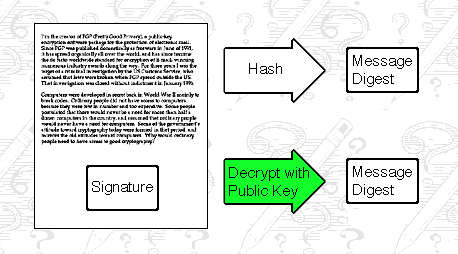

2.数字证书：

* 定义：一个证书里面的内容有：
  * 签发者
  * 证书用途
  * 该证书持有者的公钥
  * 采用的加密算法
  * 采用的签名HASH算法
  * 数字签名（CA写下，用来确保该证书的正确性）
  * 等等

* 作用：该证书用于防止中间人攻击。这个证书的数字签名是CA（certificate authority）对该证书进行的数字签名。具体过程为：首先hash映射证书除开签名部分的内容，再把hash得到的结果用CA的私钥加密，加密后的字符串就是数字签名。一般接受方会内置CA的公钥，从而可以用该公钥解密证书中的数字签名，并采用相同的hush算法对映射后的结果进行对比，从而确认该证书是否被中间人篡改或者冒用。

### 3.https中具体是怎么使用数字证书的？

具体步骤：

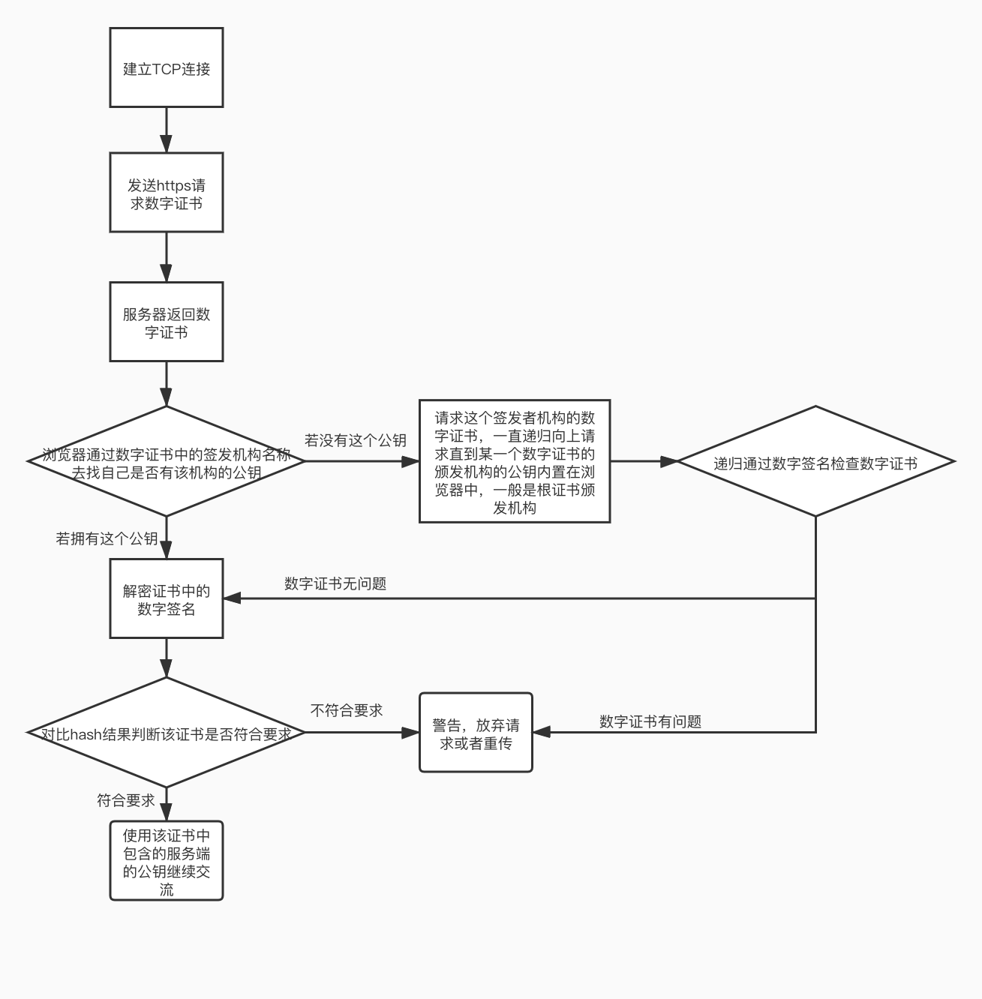

注意：

* 数字证书中只有数字签名会被CA用私钥加密
* 有可能某数字证书的签发机构的公钥并没有内置在客户端或者浏览器中，需要请求该签发机构的公钥，而该签发机构的公钥也会被放在一个数字证书中，这个数字证书中的数字签名是更高级别的签发机构用私钥加密签发的，而最高级别的签发机构，即根级别的签发机构，的公钥一般就是内置在浏览器中，所以可以递归判断每一个在递归过程中的数字证书的合法性。


## 3. SSH的免密远程登录原理


SSH是一种网络协议，用于计算机之间的加密登录。

如果一个用户从本地计算机，使用SSH协议登录另一台远程计算机，我们就可以认为，这种登录是安全的，即使被中途截获，密码也不会泄露。

用户在本地生成一对公钥私钥，然后用户将自己的公钥储存在远程主机上。登录的时候，远程主机会向用户发送一段随机字符串，用户用自己的私钥加密后，再发回来。远程主机用事先储存的公钥进行解密，如果成功，就证明用户是可信的，直接允许登录shell，不再要求密码。


## 4.URI和URL的区别

URI(uniform resource identifier):所有http请求的资源都由URI进行标识

URL(uniform resurce locator):是一种URI的最常见的形式，协议+域名+端口+路径+锚点

URN：URI的另外一种形式，通过特定命名空间中的唯一名称来标识资源

```html
urn:isbn:9780141036144
urn:ietf:rfc:7230
```

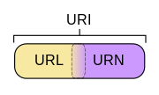

## 5.URL的组成

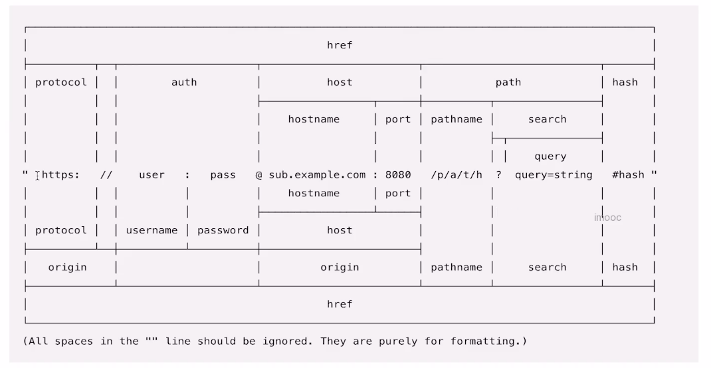

## 6.浏览器缓存

### 浏览器的缓存管理

#### 浏览器缓存的分类

 本地存储解决方案：

- 服务器存储
  - 数据库
  - Redis
  - session
- 客户端本地存储
  - 访问客户端本地存储的信息，**受‘浏览器’（IE存储的谷歌访问不了），‘源’（百度下存储的信息京东获取不了）的限制**（存储在本地，物理磁盘中跟的某一个位置，但是是加密的）
  - 本地存储的信息都是明文的，所以需要严格保密的信息都要慎重存在本地（要加密）
  - cookie
  - H5中的webStorage
    - localStorage
    - SessionStorage
  - 本地数据库存储
    - webSql
    - IndexedDB

#### HTTP缓存

简单来说，浏览器缓存就是把一个已经请求过的Web资源（如html，图片，js）拷贝一份副本储存在浏览器中。缓存会根据进来的请求保存输出内容的副本。当下一个请求来到的时候，如果是相同的URL，缓存会根据缓存机制决定是直接使用副本响应访问请求，还是向源服务器再次发送请求（当然还有304的情况）。

**缓存是根据url来处理的，只要url不一样就是新的资源。**

##### 强缓存

1. 理解

- 不会向服务器发送请求，直接从缓存中读取资源
- 请求返回200的状态码
- 在chrome控制台的network选项中可以看到size显示from disk cache或from memory cache * from memory cache代表使用内存中的缓存 * from disk cache则代表使用的是硬盘中的缓存 * 浏览器读取缓存的顺序为memory –> disk * 在浏览器中，浏览器会在js和图片等文件解析执行后直接存入内存缓存中，那么当刷新页面时只需直接从内存缓存中读取(from memory cache)；而css文件则会存入硬盘文件中，所以每次渲染页面都需要从硬盘读取缓存(from disk cache)

 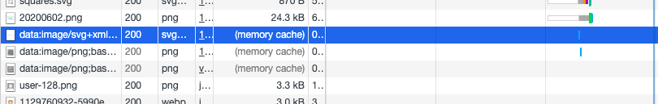

1. http中的具体实现 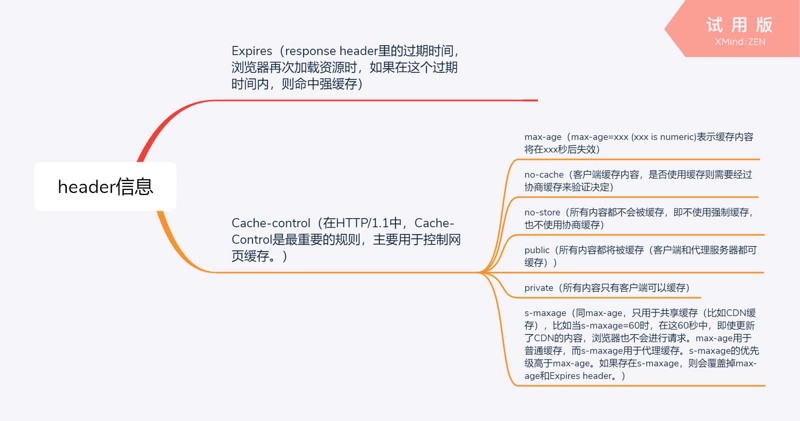

客户端可以在HTTP请求中使用的标准 Cache-Control 指令:

- max-age=<\seconds>
  - The maximum amount of time a resource is considered fresh. Unlike Expires, this directive is relative to the time of the request.多少秒后过期
- max-stale[=<\seconds>]
  - Indicates the client will accept a stale response. An optional value in seconds indicates the upper limit of staleness the client will accept.
- min-fresh=<\seconds>
  - Indicates the client wants a response that will still be fresh for at least the specified number of seconds.
- no-cache 
  - 每次用之前都要请求校验一下
- no-store 
  - 不缓存
- no-transform 
  - No transformations or conversions should be made to the resource. The Content-Encoding, Content-Range, Content-Type headers must not be modified by a proxy.
- only-if-cached 
  - 如果缓存服务器有缓存该资源，则返回，不需要确认有效性。否则返回504网关超时

服务器可以在响应中使用的标准 Cache-Control 指令:

- must-revalidate 
  - 缓存资源未过期，则返回，否则代理要向源服务器再次验证即将返回的响应缓存是否有效，如果连接不到源服务器，则返回504网关超时
- no-cache 
  - 同上
- no-store 
  - 同上
- no-transform 
  - 同上
- public 
  - 代理服务器等都可以缓存
- private 
  - 只有客户端缓存
- proxy-revalidate 
  - 所有缓存服务器在客户端请求返回响应之前，再次向源服务器验证缓存有效性
- max-age=<\seconds> 
  - 同上
- s-maxage=<\seconds> 
  - Overrides max-age or the Expires header, but only for shared caches (e.g., proxies). Ignored by private caches.

**实例：** 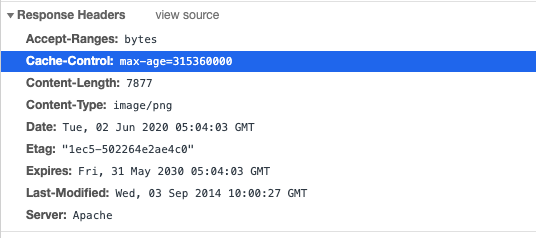 

**Expires和Cache-Control两者对比**：Expires 是http1.0的产物，Cache-Control是http1.1的产物，两者同时存在的话，**Cache-Control优先级高于Expires**

##### 协商缓存

**理解** 协商缓存就是强制缓存失效后，浏览器携带缓存标识向服务器发起请求，由服务器根据缓存标识决定是否使用缓存的过程 协商缓存生效，返回304和Not Modified

 **http的实现**

1. Last-Modified和If-Modified-Since 浏览器在第一次访问资源时，服务器返回资源的同时，在response header中添加 Last-Modified的header，值是这个资源在服务器上的最后修改时间，浏览器接收后缓存文件和header； 浏览器下一次请求这个资源，浏览器检测到有 Last-Modified这个header，于是添加If-Modified-Since这个header，值就是Last-Modified中的值；服务器再次收到这个资源请求，会根据 If-Modified-Since 中的值与服务器中这个资源的最后修改时间对比，如果没有变化，返回304和空的响应体，直接从缓存读取，如果If-Modified-Since的时间小于服务器中这个资源的最后修改时间，说明文件有更新，于是返回新的资源文件和200
2. ETag和If-None-Match Etag是上一次加载资源时，服务器返回的response header，是对该资源的一种唯一标识，只要资源有变化，Etag就会重新生成。浏览器在下一次加载资源向服务器发送请求时，会将上一次返回的Etag值放到request header里的If-None-Match里，服务器只需要比较客户端传来的If-None-Match跟自己服务器上该资源的ETag是否一致，就能很好地判断资源相对客户端而言是否被修改过了。如果服务器发现ETag匹配不上，那么直接以常规GET 200回包形式将新的资源（当然也包括了新的ETag）发给客户端；如果ETag是一致的，则直接返回304知会客户端直接使用本地缓存即可。
3. 协商缓存两种方式的对比

- 精确度上，Etag要优于Last-Modified，Last-Modified的时间单位是秒，如果某个文件在1秒内改变了多次，那么他们的Last-Modified其实并没有体现出来修改，但是Etag每次都会改变确保了精度；如果是负载均衡的服务器，各个服务器生成的Last-Modified也有可能不一致。
- 性能上，Etag要逊于Last-Modified，毕竟Last-Modified只需要记录时间，而Etag需要服务器通过算法来计算出一个hash值。
- 优先级上，服务器校验优先考虑Etag

##### Http缓存的缓存机制

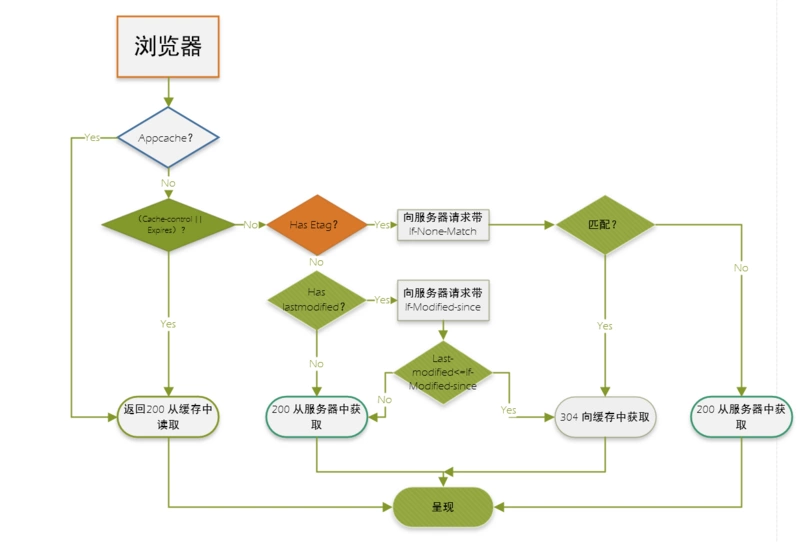

#### 本地存储

##### cookie

Cookie主要是由服务器生成，且前端也可以通过document.cookie设置，保存在客户端本地的一个文件，通过response响应头的set-Cookie字段进行设置，且Cookie的内容自动在同源请求的时候被传递给服务器。如下：

Reponse: 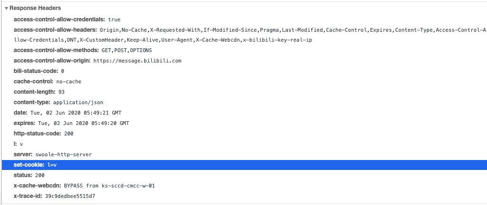

Request: 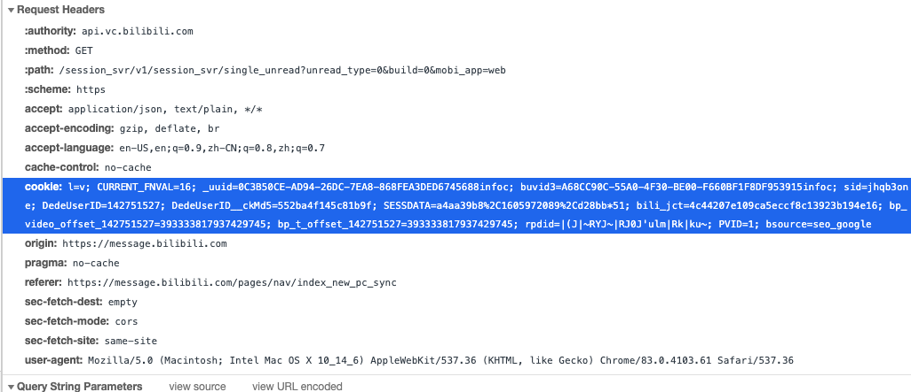

**Cookie包含的信息：**

它可以记录你的用户ID、密码、浏览过的网页、停留的时间等信息。当你再次来到该网站时，网站通过读取Cookies，得知你的相关信息，就可以做出相应的动作，如在页面显示欢迎你的标语，或者让你不用输入ID、密码就直接登录等等。一个网站只能读取它自己放置的信息，不能读取其他网站的Cookie文件。因此，Cookie文件还保存了host属性，即网站的域名或ip。 这些属性以名值对的方式进行保存，为了安全，它的内容大多进行了加密处理。

**Cookie的优点：**

- 给用户更人性化的使用体验，如记住“密码功能”、老用户登录欢迎语
- 弥补了HTTP无连接特性
- 站点统计访问人数的一个依据

**Cookie的缺点：**

- 它无法解决多人共用一台电脑的问题，带来了不安全因素
- Cookie文件容易被误删除
- 一人使用多台电脑
- Cookies欺骗。修改host文件，可以非法访问目标站点的Cookie
- 容量有限制，不能超过4kb
- 在请求头上带着数据安全性差

##### Local Storage

localStorage主要是前端开发人员，在前端设置，一旦数据保存在本地后，就可以避免再向服务器请求数据，因此减少不必要的数据请求，减少数据在浏览器和服务器间不必要地来回传递。

**可以长期存储数据，没有时间限制**，一天，一年，两年甚至更长，数据都可以使用。 localStorage中一般浏览器支持的是5M大小，这个在不同的浏览器中localStorage会有所不同

优点：

- localStorage拓展了cookie的4k限制
- localStorage可以将第一次请求的5M大小数据直接存储到本地，相比于cookie可以节约带宽
- localStorage的使用也是遵循同源策略的，所以不同的网站直接是不能共用相同localStorage

缺点：

- 需要手动删除，否则长期存在
- 浏览器大小不一，版本的支持也不一样
- localStorage只支持string类型的存储，JSON对象需要转换
- localStorage本质上是对字符串的读取，如果存储内容多的话会消耗内存空间，会导致页面变卡

##### SessionStorage

sessionStorage主要是前端开发人员，在前端设置，sessionStorage（会话存储），只有在浏览器被关闭之前使用，创建另一个页面时同意可以使用，关闭浏览器之后数据就会消失

存储上限限制：不同的浏览器存储的上限也不一样，但大多数浏览器把上限限制在5MB以下

##### websql

Web SQL 是在浏览器上模拟数据库，可以使用JS来操作SQL完成对数据的读写。它使用 SQL 来操纵客户端数据库的 API，这些 API 是异步的，规范中使用的方言是SQLlite。数据库还是在服务端，不建议使用，已废弃

##### indexDB

随着浏览器的功能不断增强，越来越多的网站开始考虑，将大量数据储存在客户端，这样可以减少从服务器获取数据，直接从本地获取数据。

现有的浏览器数据储存方案，都不适合储存大量数据：Cookie 的大小不超过4KB，且每次请求都会发送回服务器；LocalStorage 在 2.5MB 到 10MB 之间（各家浏览器不同），而且不提供搜索功能，不能建立自定义的索引。所以，需要一种新的解决方案，这就是 IndexedDB 诞生的背景。

通俗地说，IndexedDB 就是浏览器提供的本地数据库，它可以被网页脚本创建和操作。IndexedDB 允许储存大量数据，提供查找接口，还能建立索引。这些都是 LocalStorage 所不具备的。就数据库类型而言，IndexedDB 不属于关系型数据库（不支持 SQL 查询语句），更接近 NoSQL 数据库。

#### 注意点

##### Cookie,LocalSession,SessionStorage的区别对比

1. Cookie对比localSession

- cookie兼容大部分浏览器（包括IE6），localStorage是H5中新增的API，不兼容低版本浏览器，例如（IE678），在考虑兼容的情况下只用COOKIE
- 本地存储的cookie信息在发送AJAX请求的时候会在请求头中自动携带并传递给服务器（Cookie）虽然是本地存储，但是会在服务器和客户端传来传去）， 但是localStorage是不会这样传递的
- cookie有大小存储的限制，比localStorage小很多，一般同一个源下， cookie只能存储4kb,localStorage可以存储5MB(所以存储一些代码信息或者一些s数据信息，我们应该使用localStorage)
- cookie不稳定，会被一些特殊情况给干掉，cookie本身是有生命周期的，比如：使用360安全卫士或者浏览器本身自带的清理历史记录的功能清理电脑时，就会把cookie干掉，但是到目前为止，这些工具都清除不掉localStorage,localStorage是持久化的存储在客户端，除非手动清除，没有生命周期的限制
- cookie可能会被禁用（例如浏览器的无痕浏览模式）

1. LocalSession对比SessionStorage

- localstorage是持久存储到本地，然而sessionStorage是会话存储，也就是：页面关掉（刷新不算），当前存储的SessionStorage就会被清除

##### Cookie和Session的区别和联系

- Session的概念：
  - 为了解决http无状态的问题，要用某种机制记录用户的状态，即判断是谁和服务器发送请求报文而产生的一种会话的抽象概念
- Cookie的概念：
  - 确实存在的一个存储在浏览器端的一个字段，会在http的头部发送给服务器，服务器也可以用set-Cookie字段对Cookie进行修改，当然前端也可以自己改
- Session和Cookie的联系：
- 为了实现Session,后端服务器会对每一个发送请求的用户建立开辟一个存储记录的空间，并且每一条记录有一个唯一标示Session id,服务器会把这个Session id放在set-cookie里面发回给客户端，从而记录下来这个Session id到cookie中。客户端以后再发送请求就要带着这个存在cookie中的字段发给服务器，从而识别用户的身份
- session 的运行依赖 session id，而 session id 是存在 cookie 中的，也就是说，如果浏览器禁用了 cookie ，同时 session 也会失效（但是可以通过其它方式实现，比如在 url 中传递 session_id）
- 注意：
  - 不只是登陆要用到session和session id，就算没有登陆也会用一个对应用户的Session来存放用户信息，如:不登录 x 宝或者 x 东，加入物品进购物车。然后关闭页面。再开页面进去，登录，你会发现东西都在你登录后的购物车里。这就是未登录的 session ID


#### CDN 缓存

当服务接入了 CDN 之后，浏览器本地缓存的资源过期之后，浏览器不是直接向源服务器请求资源，而是转而向 CDN 边缘节点请求资源。CDN 边缘节点中将用户的数据缓存起来，如果 CDN 中的缓存也过期了，CDN 边缘节点会向源服务器发出回源请求，从而来获取最新资源。 https://juejin.im/post/5cdb7e29e51d453a572aa2f1

## 7. http的常用头部

* 浏览器的缓存方面
  * cache-control/expires
  * etag/If-none-match
  * If-modified-since/Last-modified
* 跨域方面
  * origin
  * Access-control-allow-origin
  * Access-Control-Allow-Credentials
  * Access-Control-Expose-Headers
  * Access-Control-Request-Headers
  * Access-Control-Request-Method
  * Access-Control-Allow-Methods：返回支持的所有方法
  * Access-Control-Allow-Headers：支持的所有http头部信息
  * Access-Control-Allow-Credentials：同上
  * Access-Control-Max-Age：此次预检的有效时间
* 连接方面:
  * connecttion:
* cookie方面
  * Cookie
  * Set-cookie
* 内容方面
  * Accept：指定客户端能够接收的内容类型
  * Accept-Language
  * Content-Type：POST请求头中描述你发送的数据类型，数据类型有：
    * application/x-www-form-urlencoded
    * multipart/form-data
    * text/html
  * Accept-Encoding
  * Host

## 8.为什么要三次握手，四次挥手

1. 三次握手

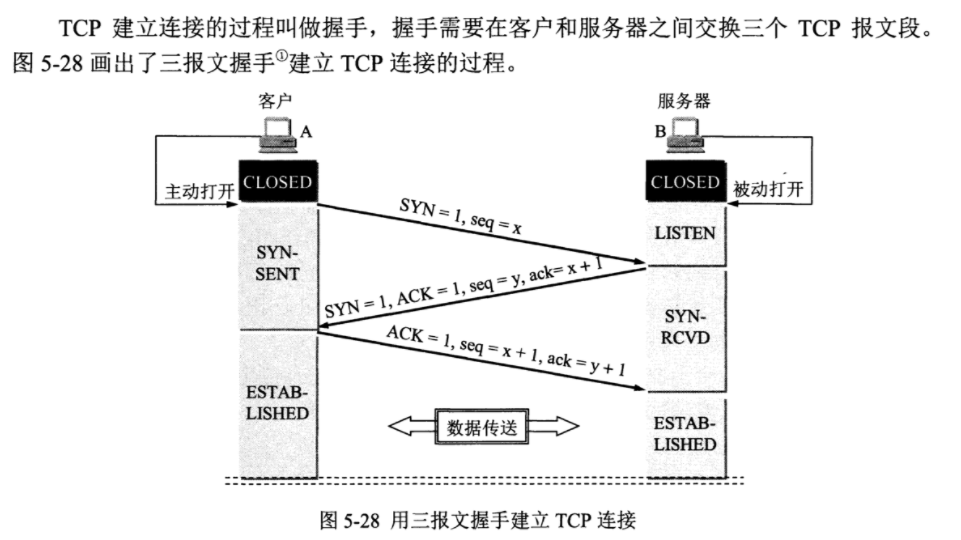

需要三次握手建立连接，否则有可能第二次服务器发出响应的那次信息没有被客户端收到，客户端就认为并没有建立起连接但是服务端已经为这次连接开启占用了部分内存，这样会使得服务器端新开的服务（即内存）被浪费掉。

2. 四次挥手

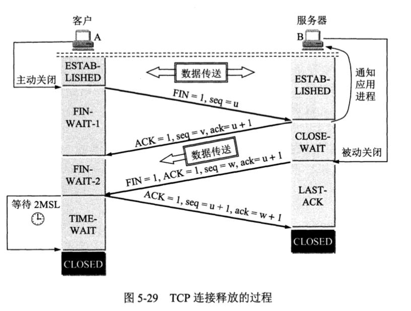

因为TCP是全双工的，即可以互相通信，所以需要四次挥手，每两次挥手都是在解除一方向另外一方发送请求的发送窗口和接受窗口。

注意最后一次挥手要等待2MSL,因为有可能最后一次挥手对方有可能没收到，如果对方没收到你却关闭了请求就会导致对方一直关不了，所以要等待2msl以防对方再次发送挥手请求你不能响应。

## 9.输入一个url到页面渲染经历的了什么？（网络部分）

1. UI线程判断是否是一个url

1.DNS解析

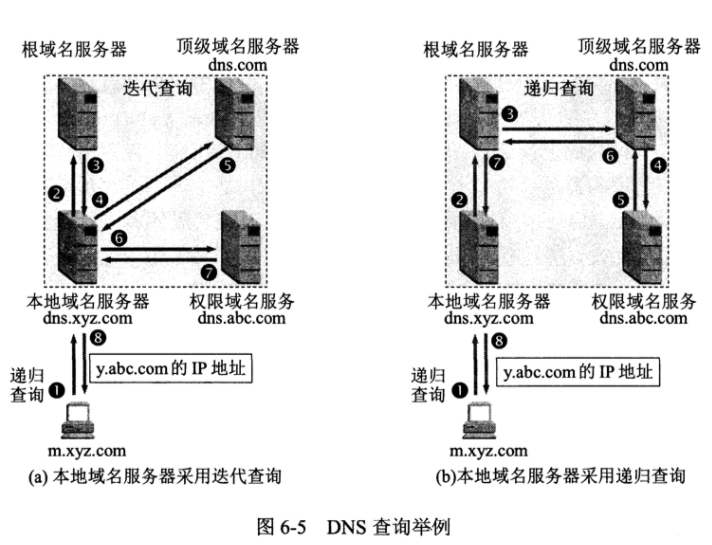


2. 由于http/https协议采用了TCP协议，这个时候层层向下打包头部进入TCP协议
3. TCP协议3次握手建立连接
4. 开始传输http数据
   * 经历慢开始，拥塞避免，快重传，快恢复等一些的过程拿到数据html数据

5. 浏览器开始解析html数据（看浏览器对html的解析过程）
   * 解析html生成
6. 这个过程中还会遇到其他资源的加载，这个时候会继续发送请求
7. 资源加载结束经历4次挥手TCP结束连接。

## 10. XSS攻击和CSRF攻击的原理和预防？

1. XSS攻击？

* Cross-Site Scripting（跨站脚本攻击）简称 XSS，是一种代码注入攻击。攻击者通过在目标网站上注入恶意脚本，使之在用户的浏览器上运行。利用这些恶意脚本，攻击者可获取用户的敏感信息如 Cookie、SessionID 等，进而危害数据安全。

* 攻击形式

  * 在 HTML 中内嵌的文本中，恶意内容以 script 标签形成注入。

    在内联的 JavaScript 中，拼接的数据突破了原本的限制（字符串，变量，方法名等）。

    在标签属性中，恶意内容包含引号，从而突破属性值的限制，注入其他属性或者标签。

    在标签的 href、src 等属性中，包含 javascript: 等可执行代码。

    在 onload、onerror、onclick 等事件中，注入不受控制代码。

    在setInterval或者setTimeout中注入字符串类型的可执行代码

* 预防

  * 在使用 .innerHTML、.outerHTML、document.write() 时要特别小心，不要把不可信的数据作为 HTML 插到页面上，而应尽量使用 .textContent、.setAttribute() 等。

    

    如果用 Vue/React 技术栈，并且不使用 v-html/dangerouslySetInnerHTML 功能，就在前端 render 阶段避免 innerHTML、outerHTML 的 XSS 隐患。

    

    DOM 中的内联事件监听器，如 location、onclick、onerror、onload、onmouseover 等，\<a> 标签的 href 属性，JavaScript 的 eval()、setTimeout()、setInterval() 等，都能把字符串作为代码运行。如果不可信的数据拼接到字符串中传递给这些 API，很容易产生安全隐患，请务必避免。

2. CSRF攻击

* 攻击者诱导受害者进入第三方网站，在第三方网站中，向被攻击网站发送跨站请求。利用受害者在被攻击网站已经获取的注册凭证，绕过后台的用户验证，达到冒充用户对被攻击的网站执行某项操作的目的。还可以进行用户追踪，如facebook在另外一个网站插入一张图片向facebook发送一个跨域请求，这样facebook就可以知道你在访问某一个网站。
* 预防
  * 因为CSRF攻击通常是跨域的，所以可以在服务端通过同源检测origin字段来判断是否是跨域的请求
  * 也可以通过设置cookie的属性sameSite来控制cookie是否在跨域请求中被发送。
    * strict都不发送
    * lax部分发送
    * 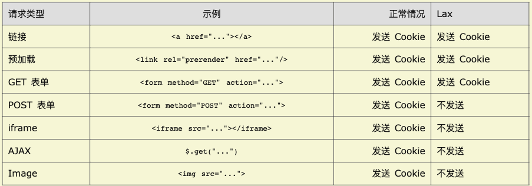
    * None. 关系sameSite。但是必须开启Secure属性，即https才发送cookie
  * 由于是从b向a网站发送请求，在b网站并不能操作a的cookie或者是其他内容。所以可以让用户在请求的时候从cookie中取中其中的一个随机字段放在请求的参数中，服务端只响应这个带有参数的请求
  * 也可以不用cookie来进行用户的身份识别，比如采用tocken来识别用户的身份，因为tocken需要被主动加入到http请求的头部字段中，而一般tocken又是被存在localStorage中，跨域又不能访问到localStorage，从而做到了杜绝这种攻击。

## 11. Corse跨域的方式

1. 简单请求

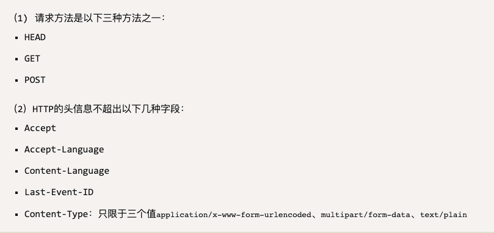

* 相关字段
  * 请求报文：origin字段，标名请求的协议+域名+端口号
  * 响应报文：
    * Access-Control-Allow-Origin：如果服务端同意该跨域请求，那么该字段在响应报文中是必须的。它的值要么是请求时Origin字段的值，要么是一个*，表示接受任意域名的请求。
    * Access-Control-Allow-Credentials：该字段可选。它的值是一个布尔值，表示是否允许发送Cookie。默认情况下，Cookie不包括在CORS请求之中。设为true，即表示服务器明确许可，Cookie可以包含在请求中，一起发给服务器。这个值也只能设为true，如果服务器不要浏览器发送Cookie，删除该字段即可。
    * Access-Control-Expose-Headers：该字段可选。CORS请求时，XMLHttpRequest对象的getResponseHeader()方法只能拿到6个基本字段：Cache-Control、Content-Language、Content-Type、Expires、Last-Modified、Pragma。如果想拿到其他字段，就必须在Access-Control-Expose-Headers里面指定。上面的例子指定，getResponseHeader('FooBar')可以返回FooBar字段的值。

  2. 非简单请求

  * 用OPTIONS方法发送请求预检请求

  * 预检请求相关字段
  
    * origin:表明来源
  * Access-Control-Request-Method：请求会用上的方法
  
* Access-Control-Request-Headers：请求额外自定义的头部字段
  
  * 预检回应相关字段
  
    * Access-Control-Allow-Origin: * 同上
    * Access-Control-Allow-Methods：返回支持的所有方法
    * Access-Control-Allow-Headers：支持的所有http头部信息
  * Access-Control-Allow-Credentials：同上
  * Access-Control-Max-Age：此次预检的有效时间
  
  
  
    3. 正常请求
  
    预检请求通过后的请求，请求头部有origin字段，响应有access-control-allow-origin字段。意义同上。

## 12. 流量控制和拥塞管理？

1. 流量控制：

   流量控制就是让发送方发送速率不要太快，让接收方来得及接收

   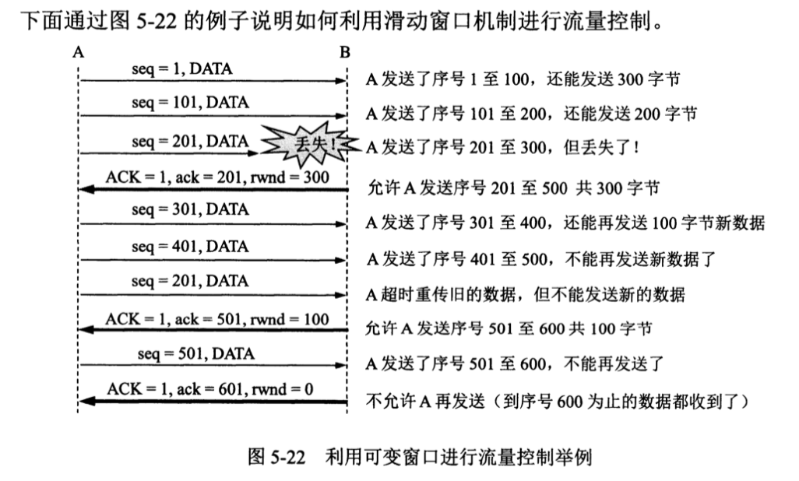

2. 拥赛控制

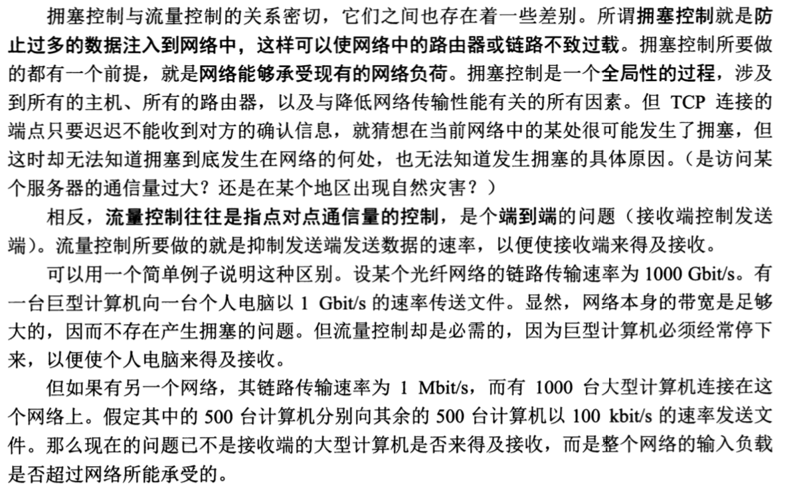

实现方式：

* 慢开始
* 拥赛避免
* 快重传
* 快恢复
  * 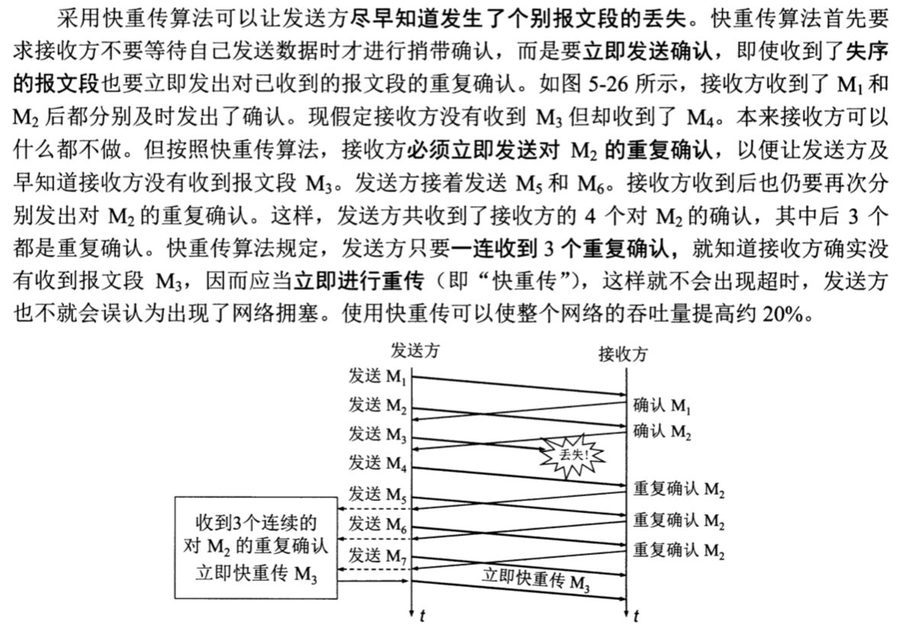

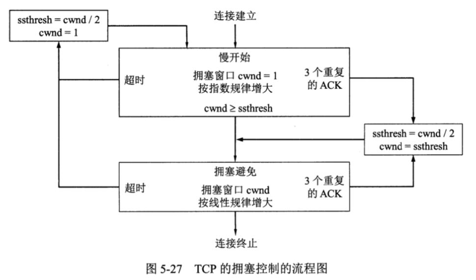

## 13. http不同版本的区别？

1. http1.0

发一个请求就要建立TCP连接和断开连接，这样不能实现TCP连接的复用，效率低下

2. http1.1

* 增加了PUT、PATCH、OPTIONS、DELETE 等请求方式。

* Connect:keep-alive,默认开启TCP的长连接，解决了TCP连接的复用问题。

* 但是每一个公用同一个TCP连接的请求都要按顺序发送和接受响应。即第一个请求的响应收到了才能发送第二个请求。这样会导致对头堵塞，即如果第一个请求一直没有响应，之后的请求也都发送不了。

3. http2.0

* 为了解决上述的痛点，http2.0采用了多工的方式。即不用在一个TCP连接中等上一个请求响应接受了再发送请求，而是直接发送多个请求，依次处理

* 同时进一步优化了头部信息，压缩了头部使得头部信息更小，发送更快
* 服务器推送：之前的http都是客户端向服务器放松请服务器才会响应，现在服务器可以主动向客户端推送一些客户端会用到的资源。比如一些图片资源，这些资源本来是要客户端解析了html后才会想服务器要的，现在服务器先一步想客户端推送就省去了客户端解析html的时间。

## 14. 浏览器缓存策略

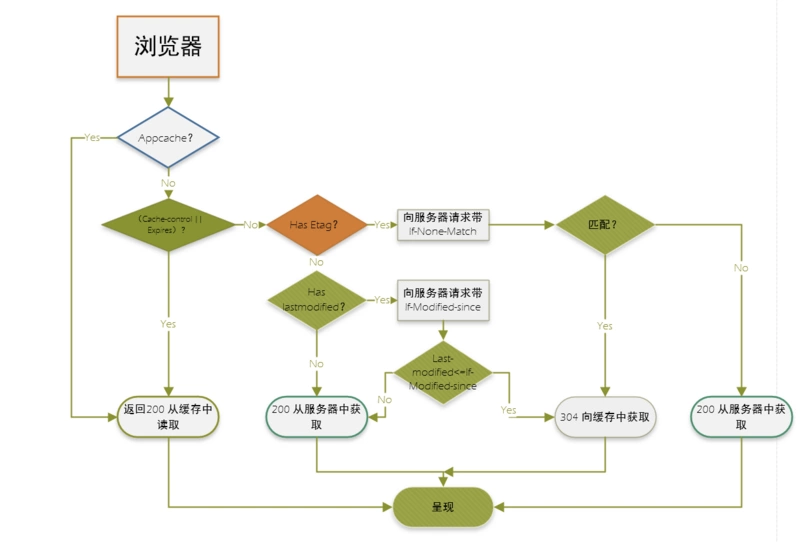

## 15. 互联网的5层7层结构和每层的目的

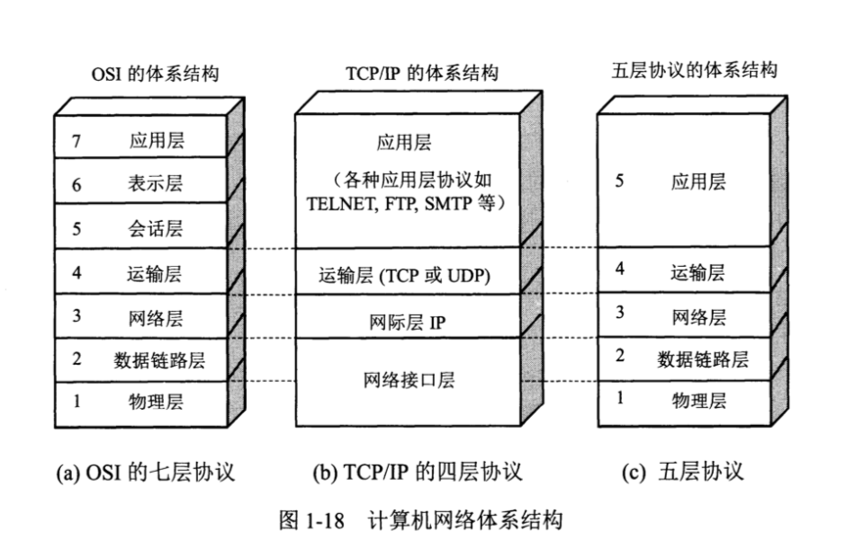

* 物理层：提供了传输的物理继承，传输比特，双绞线，光缆等

  中间设备为转发器

* 数据链路层：将IP数据报组装成帧，可靠，会纠错，经过路由器

  中间设备为网桥或桥接器

* 网络层：IP：不可靠，IP数据报

  中间设备为路由器

* 运输层：TCP：面向连接，可靠，数据单元为报文段，UDP：无连接，不可靠，用户数据报
* 应用层HTTP，域名DNS，电子邮件SMTP协议都在这一层，数据单元为报文，中间设备为网关

## 16. TCP是怎么保证数据传输的准确性的？

两种机制：

1. 等待重传机制

即按顺序一个接受到了才接受下一个，效率低下

2. 滑动窗口协议

发送发构建发送窗口即发送缓存，接受方构建接受窗口即接受缓存。按照累计确认的方式进行确认和窗口的滑动。

## 17. TCP和UDP的区别？

|     方面     | UDP                                        | TCP                                    |
| :----------: | :----------------------------------------- | -------------------------------------- |
|   是否连接   | 无连接                                     | 面向连接                               |
|   是否可靠   | 不可靠传输，不使用流量控制和拥塞控制       | 可靠传输，使用流量控制和拥塞控制       |
| 连接对象个数 | 支持一对一，一对多，多对一和多对多交互通信 | 只能是一对一通信                       |
|   传输方式   | 面向报文                                   | 面向字节流                             |
|   首部开销   | 首部开销小，仅8字节                        | 首部最小20字节，最大60字节             |
|   适用场景   | 适用于实时应用（IP电话、视频会议、直播等） | 适用于要求可靠传输的应用，例如文件传输 |

## 18. cookie的常用属性和意义？

* Expires,max-age:确认cookie的有效时间
* Domain，Path：确认哪些域名可以访问到这个cookie和像哪些域名发送请求的时候要带上这个cookie
* Secure,httpOnly: secure指定只在https下才发送cookie,httpOnly是js不能读取，操作这个cookie
* SameSite: 指定哪种跨域请求的方式带上这个cookie

## 19.http和https的区别？

http不会对内容加密，在互联网上裸奔，https是要加密的

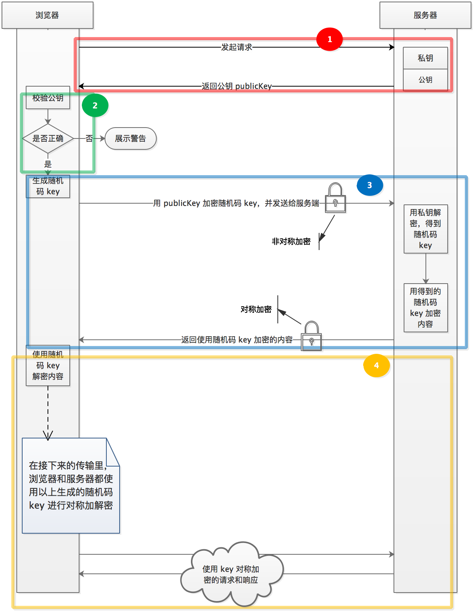

## 20. http请求有哪些方法？

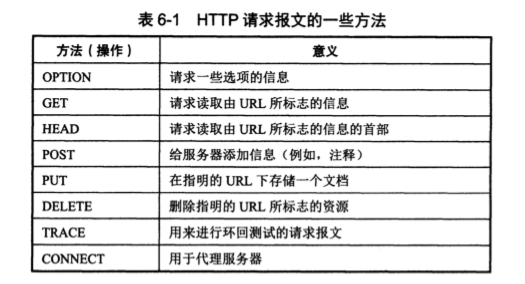

## 21. Get post请求的区别

Get请求的参数是明文的，放在url参数中，并且长度有限制

Post请求是放在request.body字段中，不是明文的，长度无限制

## 22. ARP协议是什么？工作在哪一层？

作用：已知一个机器(主机或路由器)的IP地址，获取对应的硬件地址的协议

归属：IP协议使用了ARP协议，所以归为网络层，但是由于对应的硬件地址是要在数据链路层使用，所以也可以归为数据链路层。

## 23. get请求的缓存清理

Ajax使用GET方式发送请求时，会产生缓存。很多情况下，ajax都会获取实时数据，如果存在缓存问题，就会影响数据真实性。可使用以下两种方式清除缓存：

**1.URL随机后缀**

 在get请求时增加一个随机后缀，用来区分每一次访问的URL地址

```js
xhr.open('get','cache.php?s='+Math.random());
```

2. 设置后台程序让这个请求不缓存

```js
header('cache-controller:no-cache'); 

header('Pragam:no-cache'); 

header('Expires:-1');
```

## 24. 响应状态码有什么？

**1开头 代表请求已被接受，需要继续处理**
1）状态码100 表示服务器已接收请求头，正在等待接下来的请求，或者如果请求已经完成。
2）状态码101 表示服务器已理解客户端请求，通知客户端采用不同的协议来完成这个请求。
3）状态码102 表示​​服务器已经收到并正在处理请求，但无响应可用。


**2开头 （请求成功）表示成功处理了请求的状态代码**

1）状态码**200表示响应成功**
2）状态码**202表示接受请求**
3）状态码204表示请求成功但无资源返回


**3开头 （请求被重定向）表示要完成请求，需要进一步操作。 通常，这些状态代码用来重定向。**
1）状态码**301表示永久性重定向，资源URI已更新**
2）状态码302表示临时性重定向，本次使用新URI

3）状态码**304表示原来缓存的文档可以继续使用**


**4开头 （请求错误）这些状态代码表示请求可能出错，妨碍了服务器的处理。**
1）状态码400表示请求错误，请求报文中存在语法错误，URL 可能拼写错误
2）状态码**403表示禁止请求，请求被服务器拒绝**
3）状态码**404表示无资源，服务器上无法找到请求的资源**


**5开头（服务器错误）这些状态代码表示服务器在尝试处理请求时发生内部错误。 这些错误可能是服务器本身的错误，而不是请求出错。**
1）状态码**500表示服务器错误，服务器端在执行请求时发生错误**
2）状态码**503表示无服务，服务器处于超负荷或正在停机维护，无法处理请求**

## SQL注入是什么？

一种网络攻击的方式，这种方式通过拼接一些sql语句使得服务器去执行了攻击的sql语句。