# Node.js 

@(Node.js)

## 1.nodejs 介绍
### 1.1下载和安装


### 1.2nodejs和js的区别


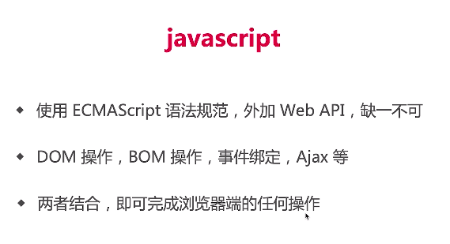


### 2.3 commonjs

commonjs是node实现模块化的方式，具体见es6

### 2.4 debugger

1.直接使用vscode打断点即可


2. debuger之inspect协议

之后遇到了再看看吧

### 2.5 server端和前端开发的区别


## 2.项目介绍
### 2.1需求分析

一个项目的诞生到上线是一个很长的流程，开发只是很小的一部分


### 2.2技术方案


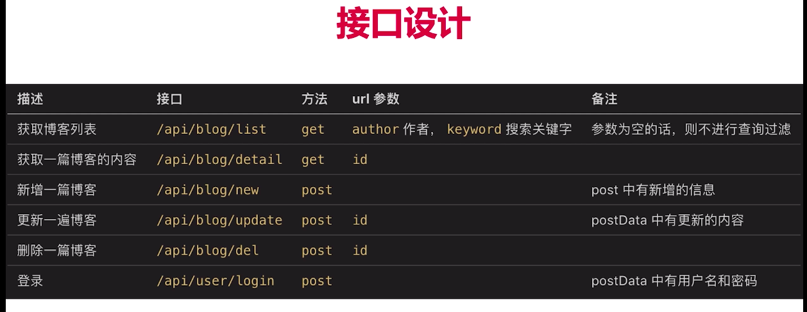


## 3.开发接口
### 3.1 http概述


请求实例

DNS解析：
* DNS缓存
* DNS查找
TCP三次握手连接：
### 3.2 处理get请求
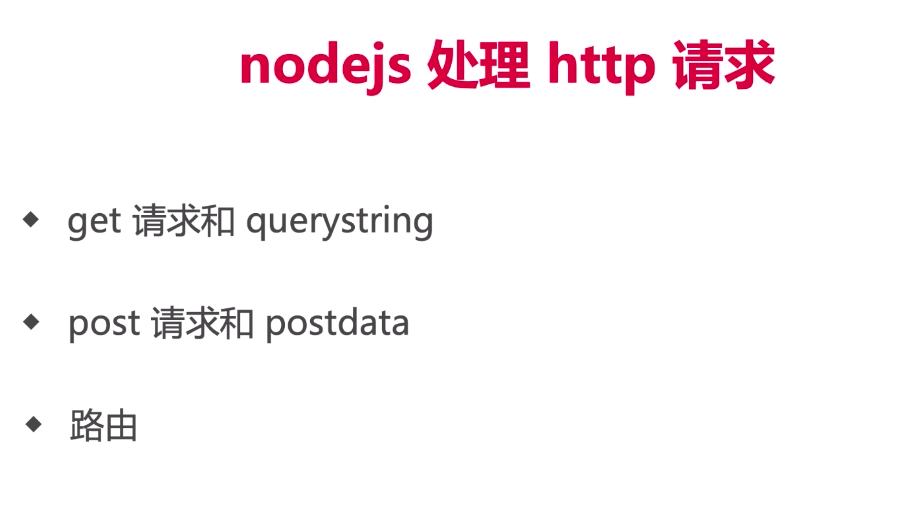

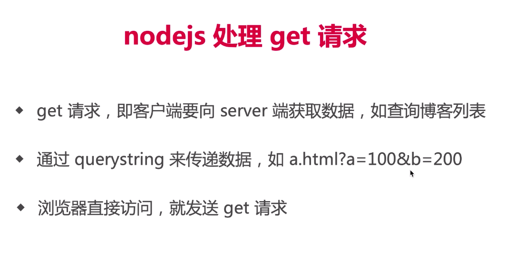
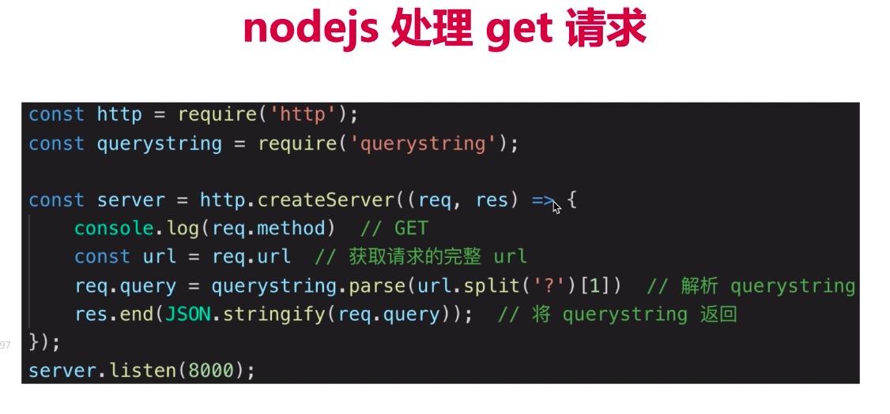

### 3.3 处理post请求


### 3.4搭建开发环境


1. Cross-env

由于不同的操作系统进行环境变量配置的方式是不同的，使用cross-env 设置环境变量可以兼容这些差异。

比如：cross-env NODE_ENV=dev nodemon ./bin/www.js

使用cross-env设置环境变量 NODE_ENV 为 dev

当然也可以设置别的环境变量比如 cross-env FIRST_ENV=one SECOND_ENV=two node ./my-program

2. nodemon

本来应该用node 运行文件运行

现在用nodemon 运行文件 运行就可以监听运行文件的变化重启服务

### 3.5开发接口


## 数据库的连接
### 1 Mysql介绍

## 登陆(cookie)


注意是发送请求域名的cookie


1:直接在浏览器network中查看请求响应头
请求头中有cookie字段
相应头中有set-cookie字段
2:application中的storage查看
3:document.cookie
document.cookie = 'key:val;'
在客户端累加cookie
即使后端已经设置了httponly也可以累加只是不能修改，在服务器端会用最后的username来覆盖掉客户端设置的username


注意

## Session

session解决用户隐私安全和cookie的容量问题

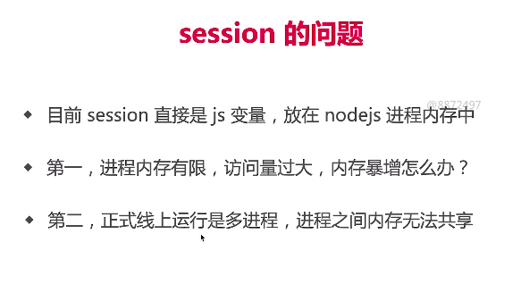

stack中为基础类型变量
heap为引用类型


大不了重新登陆即可，所以断电了也没关系（其实可以配置让他断电也可）
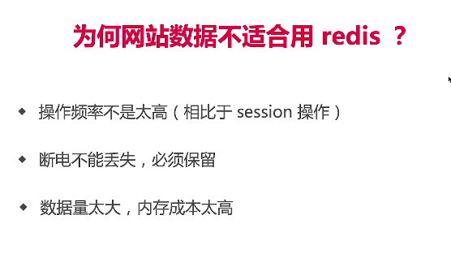


## 与前端联调

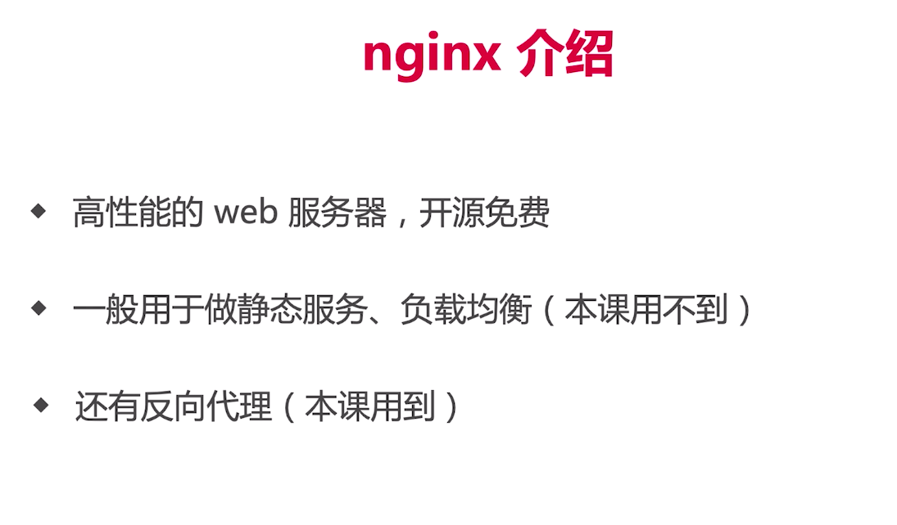


## 日志

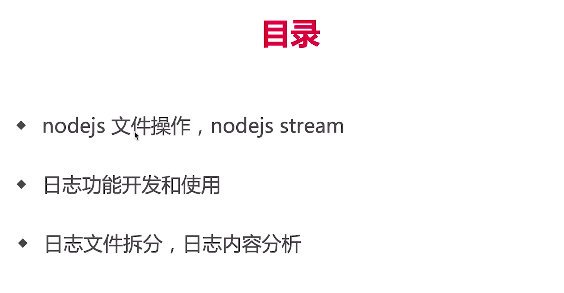

日志很大redis太贵没必要
mysql是关系型数据库，是key value的，成本高没必要
应该用文件来存储日志，便宜，可迁移


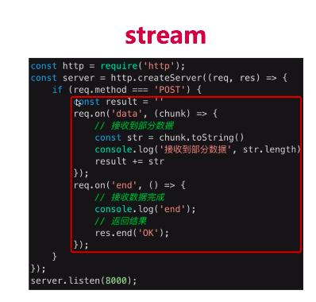
解决网络IO，解放CPU内存

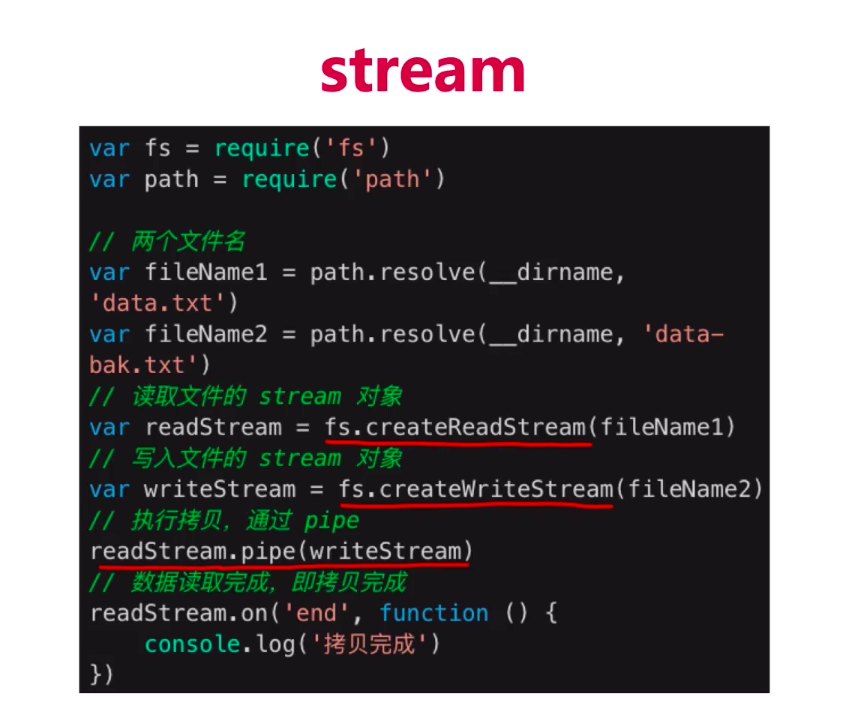

读文件和写文件 readStream通过pipe管道把值传给writeStream


操作系统脚本来做


## 安全


解决：使用xss包对存入的数据进行转义

## 基础总结


内存不够，网络IO不够
优化：stream来优化有限的带宽和内存
扩展：redis


## Express


### Express的实现

```js
const http = require('http')
const slice = Array.prototype.slice

class LikeExpress {
    constructor() {
        // 存放中间件的列表
        this.routes = {
            all: [],   // app.use(...)
            get: [],   // app.get(...)
            post: []   // app.post(...)
        }
    }

  // 根据传入的参数不同生成不同存储执行函数的对象
    register(path) {
        const info = {}
        // 如果第一个参数是string,则第一个参数是路径
        if (typeof path === 'string') {
            info.path = path
            // 从第二个参数开始，转换为数组，存入 stack
            info.stack = slice.call(arguments, 1)
          // 否则第一个参数就是要执行的函数
        } else {
            info.path = '/'
            // 从第一个参数开始，转换为数组，存入 stack
            info.stack = slice.call(arguments, 0)
        }
        return info
    }

  // use方法是把生成的函数对象push进入all数组中
    use() {
        const info = this.register.apply(this, arguments)
        this.routes.all.push(info)
    }
  // get方法是把生成的函数对象push进入get数组中
    get() {
        const info = this.register.apply(this, arguments)
        this.routes.get.push(info)
    }
  
  // 同理
    post() {
        const info = this.register.apply(this, arguments)
        this.routes.post.push(info)
    }
  
	// 从this.routes中匹配到对应的能匹配路由的执行函数
    match(method, url) {
        let stack = []
        if (url === '/favicon.ico') {
            return stack
        }

        // 获取 routes
        let curRoutes = []
        curRoutes = curRoutes.concat(this.routes.all)
        curRoutes = curRoutes.concat(this.routes[method])

      // 遍历routes, 把能匹配上路由的对象中的方法取出
        curRoutes.forEach(routeInfo => {
            if (url.indexOf(routeInfo.path) === 0) {
                // url === '/api/get-cookie' 且 routeInfo.path === '/'
                // url === '/api/get-cookie' 且 routeInfo.path === '/api'
                // url === '/api/get-cookie' 且 routeInfo.path === '/api/get-cookie'
                stack = stack.concat(routeInfo.stack)
            }
        })
        return stack
    }

    // 递归执行的中间件方法
    handle(req, res, stack) {
        const next = () => {
            // 拿到第一个匹配的中间件
            const middleware = stack.shift()
            if (middleware) {
                // 执行中间件函数，并且这个中间件函数传入了next方法可以在这个中间件方法执行的过程选择随时中去执行下一个中间件方法，当下一个执行完了再接着执行自己的
                middleware(req, res, next)
            }
        }
        next()
    }

  // 监听到请求过后的回调函数
    callback() {
        return (req, res) => {
            res.json = (data) => {
                res.setHeader('Content-type', 'application/json')
                res.end(
                    JSON.stringify(data)
                )
            }
            const url = req.url
            const method = req.method.toLowerCase()

            // 根据路由取到能执行的中间件方法合集resultList
            const resultList = this.match(method, url)
            this.handle(req, res, resultList)
        }
    }

  // 监听端口号执行示例的callback方法
    listen(...args) {
        const server = http.createServer(this.callback())
        server.listen(...args)
    }
}

// 工厂函数:工厂函数是一个最后返回值是对象的函数，但它既不是类，也不是构造函数。 在JavaScript中，任何函数都可以返回一个对象。 但当函数没有使用new关键字时，那它便是一个工厂函数。
module.exports = () => {
    return new LikeExpress()
}
```


## Koa

http://www.ruanyifeng.com/blog/2017/08/koa.html

直接看阮一峰老师的教程就好，实现原理和exporess类似

