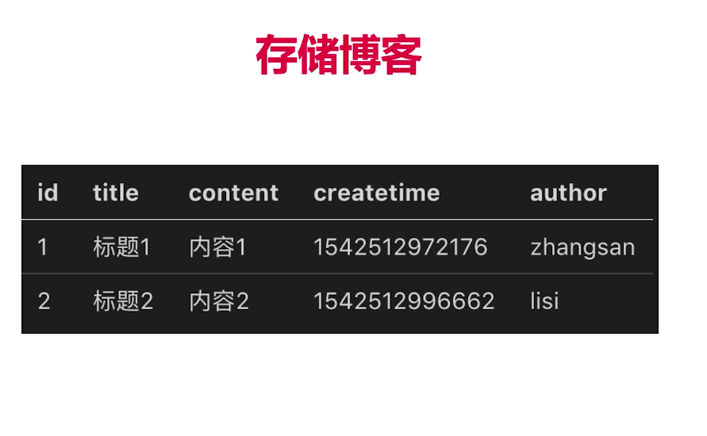

# Node.js 

@(Node.js)

## 1.nodejs 介绍
### 1.1下载和安装

### 1.2nodejs和js的区别

### 2.3 commonjs
### 2.4 debugger
### 2.5 server端和前端开发的区别

## 2.项目介绍
### 2.1需求分析

一个项目的诞生到上线是一个很长的流程，开发只是很小的一部分

### 2.2技术方案

## 3.开发接口
### 3.1 http概述

请求实例

DNS解析：
* DNS缓存
* DNS查找
TCP三次握手连接：
### 3.2 处理get请求

### 3.3 处理post请求

### 3.4搭建开发环境

### 3.5开发接口

## 数据库的连接
### 1 Mysql介绍

## 登陆(cookie)

注意是发送请求域名的cookie

1:直接在浏览器network中查看请求响应头
请求头中有cookie字段
相应头中有set-cookie字段
2:application中的storage查看
3:document.cookie
document.cookie = 'key:val;'
在客户端累加cookie
即使后端已经设置了httponly也可以累加只是不能修改，在服务器端会用最后的username来覆盖掉客户端设置的username

注意
## Session

session解决用户隐私安全和cookie的容量问题

stack中为基础类型变量
heap为引用类型

大不了重新登陆即可，所以断电了也没关系（其实可以配置让他断电也可）

## 与前端联调

## 日志

日志很大redis太贵没必要
mysql是关系型数据库，是key value的，成本高没必要
应该用文件来存储日志，便宜，可迁移

解决网络IO，解放CPU内存

操作系统脚本来做

## 安全

解决：使用xss包对存入的数据进行转义

## 基础总结

内存不够，网络IO不够
优化：stream来优化有限的带宽和内存
扩展：redis

## Express

