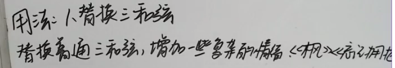
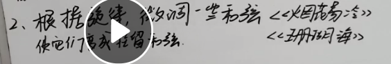
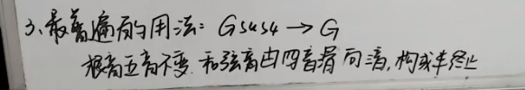
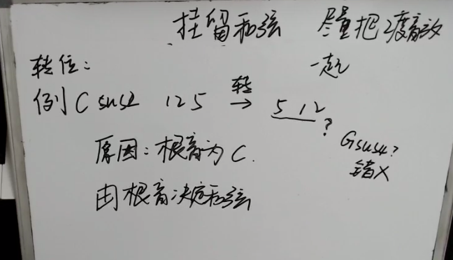

# 钢琴即兴伴奏弹唱部分笔记

### 6节-挂留和弦

1. 什么是挂留和弦

**挂留和弦没有性质**，比如大三小三和弦的挂留和弦在省略了三度音后按的音就是一样的。

2. 标记

sus2:挂2 sus4:挂4  没有写默认挂4

2. 用法

3. 转位

### 七节-加音和弦

add9相比挂留和弦多了三音

add9相比九和弦：9和弦多了7音

#### 常见的加音和弦

#### 弹奏技巧

* 弹和弦的时候只需要第一下给加音，或者之后的时候给一些变化，不用每次都弹一样的

#### 作业

##### 1

右手任意的意思就是可以任意弹两个音：

去找这个音的思路如下：

tips:

* 可以先把要弹的音写下来

* 不用太纠结，先简单一点

##### 2.

同上，只是四个任意的音

