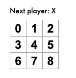
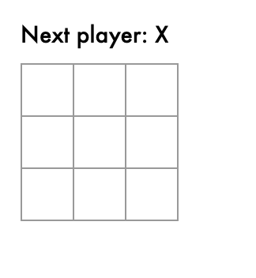

# react_ks

## Guidance

### react简单的基本概念理解

* react是什么

  ​	js库

* 组件是什么？

  ​	是UI的逻辑功能抽象

* 组件在react中的表现形式？

```js
class ShoppingList extends React.Component {
  render() {
    return (
      <div className="shopping-list">
        <h1>Shopping List for {this.props.name}</h1>
        <ul>
          <li>Instagram</li>
          <li>WhatsApp</li>
          <li>Oculus</li>
        </ul>
      </div>
    );
  }
}

// 用法示例: <ShoppingList name="Mark" />
```

组件在react中以一个类的形式呈现，并且接收一些参数props(properties)，其中这个类的render方法返回最后的渲染结果。

这种js中嵌套html的方式被称为**JSX**(JavaScriptXml)语法。

最后就可以通过\<ShoppingList />的方式来进行这个组件的使用

### 游戏的开发步骤

* 通过props从 Board 组件传递到 Square 组件数据



* 点击格子传入X



* 状态提升提取

  * 把state状态从square对象上提升到board对象上进行统一管理。

  * 这样可以使得我们很好的对所有的square对象上的数据进行统一的运算和操作
  * 在改变对象数据时，最好不要在原有的对象上进行改变，而是重新造出一个新的对象，在新的对象上改变数据之后再覆盖掉原来的对象。这样的好处是：
    * 易于实现回退这样的功能
    * 可以直接比较两个对象的指针从而判断该对象是否有改变，从而让我们知道是否应该重新渲染一个组件

* 函数式组件

  * 如果一个组件只有render方法需要被定义的话可以直接写成函数式组件的方式

* 再次状态提升，把所有的squares放在一个处于game类的history数组中

* 展示历史步骤记录

  * 把react元素用js处理过后放在一个数组变量中最后再放到render中进行渲染的一种思想
  * 注意列表渲染时候要对每一个列表选项一个key值，这样才能让计算机知道哪一个元素发生了变化从而更有效率的更新。
    * 注意使用数组的下标并不是一个好的方式，因为当对列表进行重新排序，新增后元素的key就会发生变化

* 实现时间旅行
  * 增加一个stepNumber的state属性从而确定目前处在哪一个记录


## 核心概念

### 1.hello world

```jsx
ReactDOM.render(
  <h1>Hello, world!</h1>,
  document.getElementById('root')
);
```

### 2. JSX简介

JSX是一个js的语法扩展，但是并不在js规范中，与先用babel转译再执行。

好处就在于通过灵活插入html方式，这个语法可以和react一起灵活地组织组件之间的代码逻辑。

#### JSX中的表达式

```jsx
const name = 'Josh Perez';
const element = <h1>Hello, {name}</h1>;
ReactDOM.render(
  element,
  document.getElementById('root')
);
```

表达式放在{}中，表达式可以是变量运算等的一切方式

#### JSX本身也是一个表达式

```jsx
function getGreeting(user) {
  if (user) {
    return <h1>Hello, {formatName(user)}!</h1>;  
  }
  return <h1>Hello, Stranger.</h1>;
}
```

返回一个编译后的js函数，调用后为js对象

#### JSX中的属性定义

```jsx
//属性给字符串值
const element = <div tabIndex="0"></div>;
```

```jsx
//属性给一个{}表达式值
const element = </img>;
```

#### JSX防止XSS

```jsx
const title = response.potentiallyMaliciousInput;
// 直接使用是安全的：
const element = <h1>{title}</h1>;
```

输入内容渲染之前都会转义，从而避免XSS攻击

#### JSX的大概执行步骤

React通过Babel把JSX语法转译成为一个React.createElement函数再进行调用，

比如这种jsx写法：

```jsx
const element = (
  <h1 className="greeting">
    Hello, world!
  </h1>
);
```

就会被babel转译为如下:

```jsx
const element = React.createElement(
  'h1',
  {className: 'greeting'},
  'Hello, world!'
);
```

然后再在js的执行环境中执行最后得到如下一个简化的对象，对应一个react的元素

```jsx
// 注意：这是简化过的结构
const element = {
  type: 'h1',
  props: {
    className: 'greeting',
    children: 'Hello, world!'
  }
};
```

### 3.元素渲染

#### 什么是元素

元素就是react中的开销很小的普通js对象，这与操作DOM不同。并且React的虚拟DOM会自己维护DOM。

#### 将一个元素渲染为DOM

HTML :

```html
<div id="root"></div>
```

JSX:

```jsx
const element = <h1>Hello, world</h1>;
ReactDOM.render(element, document.getElementById('root'));
```

将element元素通过ReactDOM.render方法渲染（挂载）到id为root的DOM元素上

#### 更新已渲染的元素

**注意React元素是不可以改变的对象**，所以如果要更新视图的渲染就必须重新用一个新的React元素挂到这个元素上。

```jsx
function tick() {
  const element = (
    <div>
      <h1>Hello, world!</h1>
      <h2>It is {new Date().toLocaleTimeString()}.</h2>
    </div>
  );
  //每1000ms把一个新的element挂到root上覆盖之前的
  ReactDOM.render(element, document.getElementById('root'));}

setInterval(tick, 1000);
```

并且，react的虚拟DOM在更新的时候会比较之前和之后的状态，然后只改变被改变的部分把这个改变体现在真实的DOM上，从而使得操作DOM的开销变到最小。

### 4.组件

#### 函数组件与class组件

函数组件：

```jsx
function Welcome(props) {
  return <h1>Hello, {props.name}</h1>;
}
```

使用ES6的class语法糖定义的组件：

```jsx
class Welcome extends React.Component {
  render() {
    return <h1>Hello, {this.props.name}</h1>;
  }
}
```

#### 组件传值

```jsx
function Welcome(props) {  
  return <h1>Hello, {props.name}</h1>;
}

const element = <Welcome name="Sara" />;
ReactDOM.render(
  element,
  document.getElementById('root')
);
```

​	父组件通过属性给子组件传值，子组件通过props进行调用，函数式组件记得不用加this,但是要加props参数

**注意组件名称用大写字母开头**

#### 嵌套组件

```jsx
function Welcome(props) {
  return <h1>Hello, {props.name}</h1>;
}

function App() {
  return (
    <div>
      <Welcome name="Sara" />      
      <Welcome name="Cahal" />      
      <Welcome name="Edite" />    
    </div>
  );
}

ReactDOM.render(
  <App />,
  document.getElementById('root')
);
```

#### Props的只读性

注意组件必须是一个纯函数，即不修改传入参数的函数。

所以组件对于props只能调用但是不能够修改

### 5.State和生命周期

#### State

```jsx
class Clock extends React.Component {
  constructor(props) {
    super(props);
    this.state = {date: new Date()};// 给state一个初值
  }

  render() {
    return (
      <div>
        <h1>Hello, world!</h1>
        <h2>It is {this.state.date.toLocaleTimeString()}.</h2>
      </div>
    );
  }
}

ReactDOM.render(
  <Clock />,
  document.getElementById('root')
);
```

要使用state最好是写成class形式的组件比较方便，在state中保存了这个组件内部自己管理的数据。

#### 生命周期

```jsx
class Clock extends React.Component {
  constructor(props) {
    super(props);
    this.state = {date: new Date()};
  }
  
  //在react元素挂载到DOM上后执行
  componentDidMount() {
    this.timerID = setInterval(
      () => this.tick(),
      1000
    );
  }
  
  //在react元素unmount之前执行
  componentWillUnmount() {
    clearInterval(this.timerID);
  }
  
  //通过setState方法动态改变date属性响应式的修改组件的内容
  tick() {    this.setState({      date: new Date()    });  }
  render() {
    return (
      <div>
        <h1>Hello, world!</h1>
        <h2>It is {this.state.date.toLocaleTimeString()}.</h2>
      </div>
    );
  }
}

ReactDOM.render(
  <Clock />,
  document.getElementById('root')
);
```

#### 使用state的注意事项

1.要用setState修改state否则不会响应式的渲染组件

2.state的更新可能是异步的这会导致一些中间的渲染过程可能会丢失，如下：

```jsx
// Wrong
this.setState({
  counter: this.state.counter + this.props.increment,
});
```

如果要强制触发渲染，可以使用如下的函数写法：

```jsx
// Correct
this.setState((state, props) => ({
  counter: state.counter + props.increment
}));

// Correct
this.setState(function(state, props) {
  return {
    counter: state.counter + props.increment
  };
});
```

3.setState的更新是合并更新而不是直接替换

### 6.事件处理

#### React中阻止默认行为

```jsx
function ActionLink() {
  function handleClick(e) {    
    e.preventDefault();    
    console.log('The link was clicked.');  }
  return (
    <a href="#" onClick={handleClick}>      
      Click me
    </a>
  );
}
```

只能通过事件对象调用preventDefault()事件进行

#### React的this问题

```jsx
class Toggle extends React.Component {
  constructor(props) {
    super(props);
    this.state = {isToggleOn: true};
    //注意改变this的指向
	 this.handleClick = this.handleClick.bind(this);  
  }

  handleClick() {    
    this.setState(state => ({      
      isToggleOn: !state.isToggleOn    
    }));  
  }
  render() {
    return (
      <button onClick={this.handleClick}>        				     			 			{this.state.isToggleOn ? 'ON' : 'OFF'}
      </button>
    );
  }
}

ReactDOM.render(
  <Toggle />,
  document.getElementById('root')
);
```

一定要注意在react绑定事件的时候，要注意this的指向，如果没有改变handleClick指向的那一句的话在执行handleClick的时候this会指向undefined。

解决方案：

* 如上所示使用bind方法提前改变handleClick的this指向

* 使用箭头函数没有this的性质

  * 箭头函数使用方式1

  ```jsx
  class Toggle extends React.Component {
    constructor(props) {
      super(props);
      this.state = {isToggleOn: true};
    }
  
    handleClick(){
      console.log(this);
      this.setState(
        {isToggleOn: !this.state.isToggleOn}
      );
    }
  
    render() {
      return (
        //此时handleClick执行的时候.前面是this,则handleClick的this指向这个.前面的this,而由于外面是一个箭头函数，所以.前面的this就是借用了外面的this，指向的是Game元素对象
        <button onClick={()=>{this.handleClick()}}>
          {this.state.isToggleOn ? 'ON' : 'OFF'}
        </button>
      );
    }
  }
  ```

  * 箭头函数使用方式2（实验写法）

```jsx
class Toggle extends React.Component {
  constructor(props) {
    super(props);
    this.state = {isToggleOn: true};
  }

  handleClick = () => {
    console.log(this);
    this.setState(
      {isToggleOn: !this.state.isToggleOn}
    );
  }

  render() {
    return (
      <button onClick={this.handleClick}>
        {this.state.isToggleOn ? 'ON' : 'OFF'}
      </button>
    );
  }
}
```

3.React中事件传参数

```jsx
<button onClick={(e) => this.deleteRow(id, e)}>Delete Row</button>
<button onClick={this.deleteRow.bind(this, id)}>Delete Row</button>
```

**注意如果使用箭头函数那么event对象必须要自己写上**

### 7.条件渲染

#### 一个实例

```jsx
class LoginControl extends React.Component {
  constructor(props) {
    super(props);
    this.handleLoginClick = this.handleLoginClick.bind(this);
    this.handleLogoutClick = this.handleLogoutClick.bind(this);
    this.state = {isLoggedIn: false};
  }

  handleLoginClick() {
    this.setState({isLoggedIn: true});
  }

  handleLogoutClick() {
    this.setState({isLoggedIn: false});
  }

  render() {
    const isLoggedIn = this.state.isLoggedIn;
    let button;
    //根据isLoggedIn这个属性值来决定是哪个button来进行渲染
    if (isLoggedIn) {      
      button = <LogoutButton onClick={this.handleLogoutClick} />;    
    } else {      
      button = <LoginButton onClick={this.handleLoginClick} />;    
    }
    return (
      <div>
        <Greeting isLoggedIn={isLoggedIn} />        
        {button}      
      </div>
    );
  }
}

ReactDOM.render(
  <LoginControl />,
  document.getElementById('root')
);
```

#### 与运算符&&

在 JavaScript 中，`true && expression` 总是会返回 `expression`, 而 `false && expression` 总是会返回 `false`

两个实例：

```jsx
function Mailbox(props) {
  const unreadMessages = props.unreadMessages;
  return (
    <div>
      <h1>Hello!</h1>
      {unreadMessages.length > 0 &&        
      	<h2>          
          You have {unreadMessages.length} unread messages.        				 		</h2>      
      }    
    </div>
  );
}

const messages = ['React', 'Re: React', 'Re:Re: React'];
ReactDOM.render(
  <Mailbox unreadMessages={messages} />,
  document.getElementById('root')
);
```

```jsx
render() {
  const count = 0;  return (
    <div>
      { count && <h1>Messages: {count}</h1>}    
    </div>
  );
}
```

#### 三目运算符

`condition ? true : false`

```jsx
render() {
  const isLoggedIn = this.state.isLoggedIn;
  return (
    <div>
      The user is <b>{isLoggedIn ? 'currently' : 'not'}</b> logged in.    </div>
  );
}
```

#### 阻止组件渲染

可以让render方法直接返回null从而隐藏某组件

```jsx
function WarningBanner(props) {
  //可以让这个组件返回null从而隐藏组件
  if (!props.warn) {    return null;  }
  return (
    <div className="warning">
      Warning!
    </div>
  );
}

class Page extends React.Component {
  constructor(props) {
    super(props);
    this.state = {showWarning: true};
    this.handleToggleClick = this.handleToggleClick.bind(this);
  }

  handleToggleClick() {
    this.setState(state => ({
      showWarning: !state.showWarning
    }));
  }

  render() {
    return (
      <div>
        <WarningBanner warn={this.state.showWarning} />        					<button onClick={this.handleToggleClick}>
          {this.state.showWarning ? 'Hide' : 'Show'}
        </button>
      </div>
    );
  }
}

ReactDOM.render(
  <Page />,
  document.getElementById('root')
);
```

### 8.列表&Key

#### 循环渲染多个组件

```jsx
const numbers = [1, 2, 3, 4, 5];
//使用map方法返回一个react元素数组
const listItems = numbers.map((number) =>  <li>{number}</li>);

ReactDOM.render(
//这个元素数组可以直接使用
  <ul>{listItems}</ul>,
  document.getElementById('root')
);
```

#### 列表组件以及key的使用

```jsx
function NumberList(props) {
  const numbers = props.numbers;
  const listItems = numbers.map((number) =>
    //用key值来区别元素
    <li key={number.toString()}>      
        {number}
    </li>
  );
  return (
    <ul>{listItems}</ul>
  );
}

const numbers = [1, 2, 3, 4, 5];
ReactDOM.render(
  <NumberList numbers={numbers} />,
  document.getElementById('root')
);
```

#### key的位置

元素的 key 只有放在就近的数组上下文中才有意义。

**不正确使用：**

```jsx
function ListItem(props) {
  const value = props.value;
  return (
    // 错误！你不需要在这里指定 key：    
    <li key={value.toString()}>      
      {value}
    </li>
  );
}

function NumberList(props) {
  const numbers = props.numbers;
  const listItems = numbers.map((number) =>
    // 错误！元素的 key 应该在这里指定：    
   <ListItem value={number} />  
  );
  return (
    <ul>
      {listItems}
    </ul>
  );
}

const numbers = [1, 2, 3, 4, 5];
ReactDOM.render(
  <NumberList numbers={numbers} />,
  document.getElementById('root')
);
```

**正确使用：**

```jsx
function ListItem(props) {
  // 正确！这里不需要指定 key：  
  return <li>{props.value}</li>;}

function NumberList(props) {
  const numbers = props.numbers;
  const listItems = numbers.map((number) =>
    // 正确！key 应该在数组的上下文中被指定    
   <ListItem key={number.toString()} value={number} />  
  );
  return (
    <ul>
      {listItems}
    </ul>
  );
}

const numbers = [1, 2, 3, 4, 5];
ReactDOM.render(
  <NumberList numbers={numbers} />,
  document.getElementById('root')
);
```

即key值应该加在最近的循环的组件上，无论这个组件是不是还有子组件，也不管最后到底是不是子组件重复多个，都应该加在抽象出来的循环的组件上。

#### key的隐式传输

```jsx
const content = posts.map((post) =>
  <Post
    //注意key是不能在post组件中访问的
    key={post.id}    
    //如果非要访问只有传给另外一个值
    id={post.id}    
    title={post.title} />
);
```

#### JSX中嵌入map()

```jsx
function NumberList(props) {
  const numbers = props.numbers;
  return (
    <ul>
      {numbers.map((number) =>        
         <ListItem key={number.toString()}                  
           				 value={number} />      
       )}    
    </ul>
  );
}
```

在JSX中直接写表达式返回react的书写风格，和前面先用一个变量接着是一个意思

### 9.表单和受控组件

#### 什么是受控组件 

说白了，就是react实现对于（如`<input>`、 `<textarea>` 和 `<select>`）的双向绑定的组件。

这些组件都是只有一个数据来源就是this.state.something，用户的输入可以通过自定义onChange事件同步到state中，把input组件的value属性设置为state中对应的值可以保证input的值和state中的值一样。

#### input受控

```jsx
class NameForm extends React.Component {
  constructor(props) {
    super(props);
    this.state = {value: ''};
    this.handleChange = this.handleChange.bind(this);
    this.handleSubmit = this.handleSubmit.bind(this);
  }

  handleChange(event) {    
    //这个
    this.setState({value: event.target.value});  
  }
  
  handleSubmit(event) {
    alert('提交的名字: ' + this.state.value);
    event.preventDefault();
  }

  render() {
    return (
      <form onSubmit={this.handleSubmit}>        
        <label>
          名字:
          //handleChange事件同步用户输入，value使得值相等
          <input type="text" value={this.state.value} onChange={this.handleChange} />        
        </label>
        <input type="submit" value="提交" />
      </form>
    );
  }
}
```

#### textarea受控

同上

```jsx
class EssayForm extends React.Component {
  constructor(props) {
    super(props);
    this.state = {      value: '请撰写一篇关于你喜欢的 DOM 元素的文章.'    };
    this.handleChange = this.handleChange.bind(this);
    this.handleSubmit = this.handleSubmit.bind(this);
  }

  handleChange(event) {    this.setState({value: event.target.value});  }
  handleSubmit(event) {
    alert('提交的文章: ' + this.state.value);
    event.preventDefault();
  }

  render() {
    return (
      <form onSubmit={this.handleSubmit}>
        <label>
          文章:
          <textarea value={this.state.value} onChange={this.handleChange} />        
        </label>
        <input type="submit" value="提交" />
      </form>
    );
  }
}
```

#### select标签

```jsx
class FlavorForm extends React.Component {
  constructor(props) {
    super(props);
    this.state = {value: 'coconut'};
    this.handleChange = this.handleChange.bind(this);
    this.handleSubmit = this.handleSubmit.bind(this);
  }

  handleChange(event) {    this.setState({value: event.target.value});  }
  handleSubmit(event) {
    alert('你喜欢的风味是: ' + this.state.value);
    event.preventDefault();
  }

  render() {
    return (
      <form onSubmit={this.handleSubmit}>
        <label>
          选择你喜欢的风味:
          <select value={this.state.value} onChange={this.handleChange}>            
            <option value="grapefruit">葡萄柚</option>
            <option value="lime">酸橙</option>
            <option value="coconut">椰子</option>
            <option value="mango">芒果</option>
          </select>
        </label>
        <input type="submit" value="提交" />
      </form>
    );
  }
}
```

注意

你可以将数组传递到 `value` 属性中，以支持在 `select` 标签中选择多个选项：

```jsx
<select multiple={true} value={['B', 'C']}>
```

#### 处理多个输入

```jsx
class Reservation extends React.Component {
  constructor(props) {
    super(props);
    this.state = {
      isGoing: true,
      numberOfGuests: 2
    };

    this.handleInputChange = this.handleInputChange.bind(this);
  }

  handleInputChange(event) {
    const target = event.target;
    const value = target.type === 'checkbox' ? target.checked : target.value;
    const name = target.name;
    this.setState({
      //ES6的新语法，可以用[]的方式在属性名的命名时使用表达式
      [name]: value    
    });
  }

  render() {
    return (
      <form>
        <label>
          参与:
          <input
            //通过name属性来区分是哪一个input
            name="isGoing"            
            type="checkbox"
            checked={this.state.isGoing}
            onChange={this.handleInputChange} />
        </label>
        <br />
        <label>
          来宾人数:
          <input
            name="numberOfGuests"            
            type="number"
            value={this.state.numberOfGuests}
            onChange={this.handleInputChange} />
        </label>
      </form>
    );
  }
}
```

#### 受控输入空值

如果受控组件的value被写死，用户就不能输入了

#### 非受控组件

比如文件input标签，因为它的value属性是只读属性不能修改，所以不能双向绑定是非受控组件。

### 10.状态提升

状态提升就是把多个子组件中的状态提升到一个公共的父组件中进行的统一的管理从而更好的实现组件之间的逻辑。

这个时候需要让子组件的行为影响到父组件的state，即子组件能够修改父亲组件的state。可以把父组件的setState放在闭包中通过属性传值的方式传给子组件，再由子组件进行调用就可以通过子组件改变父组件的state。

### 11.组合 vs 继承

#### 组合

组合就是把多个组件进行拼接的方式完成工作。就像拼积木。

组合的风格一般有两种：

1.使用props.children作为插槽接受多个子组件

```jsx
function FancyBorder(props) {
  return (
    <div className={'FancyBorder FancyBorder-' + props.color}>
      {props.children}    
    </div>
  );
}

function WelcomeDialog() {
  return (
    //这里调用了FancyBorder并把h1 p两个子组件放入props.children这个插槽
    <FancyBorder color="blue">
      <h1 className="Dialog-title">
        Welcome
      </h1>
      <p className="Dialog-message">
        Thank you for visiting our spacecraft!
      </p>
    </FancyBorder>
  );
}
```

2. 直接通过属性值的方式传入并组合组件

```jsx
function SplitPane(props) {
  return (
    <div className="SplitPane">
      <div className="SplitPane-left">
        {props.left}      
      </div>
      <div className="SplitPane-right">
        {props.right}      
      </div>
    </div>
  );
}

function App() {
  return (
    <SplitPane
      left={
        <Contacts />      
      }
      right={
        <Chat />      
      } />
  );
}
```

#### 继承

在组件的实际开发工程中组合已经非常够用了，不需要继承。

### 12.React开发思维流程

React不仅是一个框架，更是传递了一种前端开发的思维模式，这种模式下可以帮助我们更好的对开发任务进行拆解。

当我们拿到一个设计稿后，如何进行任务拆解？

比如如下设计稿：


1.根据功能划分设计稿的组件层级


2. 不考虑功能交互，创建一个静态版本

   即只考虑把界面的样子做出来，只使用props进行数据的自上而下单向流传递，可以选择自下而上或者是自上而下的构建顺序。

3. 明确交互逻辑，提取最小最根本的state属性

   确定一个属性是否应该是state应该满足以下条件

   * 不由props传递
   * 不随时间推移而改变
   * 不能由其他props或者是state决定

4. 确定state应该放在哪个组件上，并构建单向的state数据流传递

   首先应该找到所有受到该state影响的组件，提取这些组件的最近公共父组件，state就应该放在这个最近公共父组件或者更高的组件上。如果没有一个合适的公共父组件，可以自己创建一个新的组件作为放在比公共父组件更高的位置。

5. 添加反向数据流

   对于一些双向绑定的受控组件添加反向数据流，闭包传递修改数据的函数。

## 高级技巧

### Accessibility（无障碍）

对一些残章人士或者特殊型况下的用户友好体验的优化

### 代码分割

前端工程文件会进行打包操作，一般常用的react框架比如create React app, next.js,Umi等都已经帮助你配置好了webpack等打包工具。

为了防止最后的打包文件过大，需要使用到一种叫做代码分割的技术，这种技术一般主流的打包工具都是支持的。这种技术会把整个项目打多个包从而按需加在需要呈现的部分。

在官网中介绍了import()和React.lazy的分包懒加载方式。

### Context

对于需要很深传递的数据，可以使用context的方式进行数据的传递避免数据需要经过很多个中间组件造成代码的冗余。


#### 实例

**使用场景：**

```jsx
class App extends React.Component {
  render() {
    //必须把theme这个属性传给中间组件Toolbar,造成代码浪费，如果组件特别深的话这样的浪费会更加明显
    return <Toolbar theme="dark" />;
  }
}

function Toolbar(props) {
  return (    
    <div>
      <ThemedButton theme={props.theme} />
    </div>  );
}

class ThemedButton extends React.Component {
  render() {
    return <Button theme={this.props.theme} />;
  }
}
```

App组件中有一个toolbar组件，toolbar组件中又有一个ThemedButton组件。ThemedButton组件中的theme属性值来自App组件，所以就要把theme属性依次向下用props传递就会写很多次重复的props。

**如何使用context来解决上述的问题**

1.使用context API建立context然后用contextType让子组件使用这个context

```jsx
//使用React.createContext返回一个context组组件并且存储需要保存的值
//可以给一个组件默认值
const ThemeContext = React.createContext('light');
class App extends React.Component {
  render() {
    return (
      //使用返回的context.Provider组件，并传入值dark覆盖掉light
      <ThemeContext.Provider value="dark">
        <Toolbar />
      </ThemeContext.Provider>
    );
  }
}

// 中间的组件再也不必往下传递theme了。
function Toolbar() {
  return (
    <div>
      <ThemedButton />
    </div>
  );
}

class ThemedButton extends React.Component {
  //使用static语法，在ThemedButton这个类上增加一个属性contextType，属性值为要使用的context组件对象，就可以在这个组件中使用this.context访问这个组件对象上保存的值
  static contextType = ThemeContext;
  render() {
    return <Button theme={this.context} />;
  }
}
```

2.使用context API建立context然后用`Context.Consumer`让子组件使用这个context

```jsx
//前面都一样

class ThemedButton extends React.Component {
  render() {
    return (
      //使用返回组件的.consumer组件
      <ThemeContext.Consumer>
        //注意如果要使用context的数据要使用一个函数
        {val=>(<Button theme={val} />;)}
      </ThemeContext.Consumer>
    )
  }
}
```


### 错误边界

错误边界其实就是一种react组件，这种组件可以捕获其内部子组件发生的js错误，然后渲染出备用UI代替其出错的部分。

> 注意错误边界只能捕获以下场景中产生的错误：
>
> * 渲染期间
> * 生命周期方法
> * 整个组件树的构造函数
>
> 不能捕捉一下场景的错误：
>
> - 事件处理（[了解更多](https://zh-hans.reactjs.org/docs/error-boundaries.html#how-about-event-handlers)）
> - 异步代码（例如 `setTimeout` 或 `requestAnimationFrame` 回调函数）
> - 服务端渲染
> - 它自身抛出来的错误（并非它的子组件）


所有的用class定义的react的组件都有成为错误边界的潜力，只要我们在

这个class组件中定义了 [`static getDerivedStateFromError()`](https://zh-hans.reactjs.org/docs/react-component.html#static-getderivedstatefromerror) 或 [`componentDidCatch()`](https://zh-hans.reactjs.org/docs/react-component.html#componentdidcatch) 这两个生命周期方法中的任意一个（或两个）时，那么它就变成一个错误边界。当抛出错误后，这个组件使用 `static getDerivedStateFromError()` 返回的组件渲染备用 UI ，使用 `componentDidCatch()` 打印错误信息。

```jsx
class ErrorBoundary extends React.Component {
  constructor(props) {
    super(props);
    this.state = { hasError: false };
  }

  static getDerivedStateFromError(error) {    
    // 更新 state 使下一次渲染能够显示降级后的 UI    
    return { hasError: true };  
  }
  componentDidCatch(error, errorInfo) {    
    // 你同样可以将错误日志上报给服务器    
    logErrorToMyService(error, errorInfo);  
  }
  render() {
    if (this.state.hasError) {      
      // 你可以自定义降级后的 UI 并渲染      
      return <h1>Something went wrong.</h1>;    
    }
    return this.props.children; 
  }
}

```

使用：

```html
<ErrorBoundary>
  <MyWidget />
</ErrorBoundary>
```

关于具体使用方法和对于不能捕捉的错误的处理可以看官网。

### Refs & DOM

类似vue中的refs，同样提供给父组件一种方法去直接访问子组件。

比如为DOM元素添加ref，如下：

```jsx
class CustomTextInput extends React.Component {
  constructor(props) {
    super(props);
    // 创建一个 ref 来存储 textInput 的 DOM 元素
    this.textInput = React.createRef();    
    this.focusTextInput = this.focusTextInput.bind(this);
  }

  focusTextInput() {
    // 直接使用原生 API 使 text 输入框获得焦点
    // 注意：我们通过 "current" 来访问 DOM 节点
    this.textInput.current.focus();  }

  render() {
    // 告诉 React 我们想把 <input> ref 关联到
    // 构造器里创建的 `textInput` 上
    return (
      <div>
        <input
          type="text"
          ref={this.textInput} />        
        <input
          type="button"
          value="Focus the text input"
          onClick={this.focusTextInput}
        />
      </div>
    );
  }
}
```

官网还有一些具体的说明，比如为class组件添加ref等。注意这种方法一定程度上影响了组件之间的独立性，所以尽量少用。

### Refs转发

一个父组件在通过ref访问一个子组件时，这个子组件可以通过refs转发的机制把父组件对自己的访问转移到自己的一个子组件上。

```jsx
const FancyButton = React.forwardRef((props, ref) => (  
  <button ref={ref} className="FancyButton">    
    {props.children}
  </button>
));

// 你可以直接获取 DOM button 的 ref：
const ref = React.createRef();
<FancyButton ref={ref}>Click me!</FancyButton>;
```

这个时候我们就可以使用ref.current去访问FancyButton中的button而不是访问的FancyButton。

以下是对上述示例发生情况的逐步解释：

1. 我们通过调用 `React.createRef` 创建了一个 [React ref](https://zh-hans.reactjs.org/docs/refs-and-the-dom.html) 并将其赋值给 `ref` 变量。
2. 我们通过指定 `ref` 为 JSX 属性，将其向下传递给 `<FancyButton ref={ref}>`。
3. React 传递 `ref` 给 `forwardRef` 内函数 `(props, ref) => ...`，作为其第二个参数。
4. 我们向下转发该 `ref` 参数到 `<button ref={ref}>`，将其指定为 JSX 属性。
5. 当 ref 挂载完成，`ref.current` 将指向 `<button>` DOM 节点。

官网中有更详细的介绍，对于高阶组件的使用和DevTools显示自定义名称

### Fragments

一个组件返回多个元素时候使用fragments从而规范子元素列表。

为了解决的问题：

```jsx
class Table extends React.Component {
  render() {
    return (
      <table>
        <tr>
          <Columns />
        </tr>
      </table>
    );
  }
}

class Columns extends React.Component {
  render() {
    return (
      <div>
        <td>Hello</td>
        <td>World</td>
      </div>
    );
  }
}

//最后得到的输出是无效的因为中间多了一个div
<table>
  <tr>
    <div>
      <td>Hello</td>
      <td>World</td>
    </div>
  </tr>
</table>
```

如果使用了Fragments来包裹这个列表就可以避免这个问题

```jsx
class Columns extends React.Component {
  render() {
    return (
      <React.Fragment>        
      	<td>Hello</td>
        <td>World</td>
      </React.Fragment>    );
  }
}


//得到
<table>
  <tr>
    <td>Hello</td>
    <td>World</td>
  </tr>
</table>
```

短语法：

```jsx
class Columns extends React.Component {
  render() {
    return (
      <>        
      	<td>Hello</td>
        <td>World</td>
      </>    );
  }
}
```

这个Fragment组件可以带key属性，也只能带key属性:

```jsx
function Glossary(props) {
  return (
    <dl>
      {props.items.map(item => (
        // 没有`key`，React 会发出一个关键警告
        <React.Fragment key={item.id}>
          <dt>{item.term}</dt>
          <dd>{item.description}</dd>
        </React.Fragment>
      ))}
    </dl>
  );
}
```

### 高阶组件

高阶组件是一种复用组件逻辑的高级技巧，它具体指的是参数为组件，返回值为新组件的函数。

通过这种方式可以提取出组件的一些公共逻辑从而复用代码。

例子：

```jsx
// 此函数接收一个组件...
function withSubscription(WrappedComponent, selectData) {
  // ...并返回另一个组件...
  return class extends React.Component {
    constructor(props) {
      super(props);
      this.handleChange = this.handleChange.bind(this);
      this.state = {
        data: selectData(DataSource, props)
      };
    }

    componentDidMount() {
      // ...负责订阅相关的操作...
      DataSource.addChangeListener(this.handleChange);
    }

    componentWillUnmount() {
      DataSource.removeChangeListener(this.handleChange);
    }

    handleChange() {
      this.setState({
        data: selectData(DataSource, this.props)
      });
    }

    render() {
      // ... 并使用新数据渲染被包装的组件!
      // 请注意，我们可能还会传递其他属性
      return <WrappedComponent data={this.state.data} {...this.props} />;
    }
  };
}
```

这个函数接收一个组件，对这个组件附加了一些公共的功能比如订阅取消订阅等。

使用：

```jsx
const CommentListWithSubscription = withSubscription(
  CommentList,
  (DataSource) => DataSource.getComments()
);

const BlogPostWithSubscription = withSubscription(
  BlogPost,
  (DataSource, props) => DataSource.getBlogPost(props.id)
);
```

一些具体的约定实现细节请看：

https://zh-hans.reactjs.org/docs/higher-order-components.html

### 深入JSX

实际上JSX仅仅是`React.createElement(component, props, ...children)` 函数的语法糖。

```jsx
<MyButton color="blue" shadowSize={2}>
  Click Me
</MyButton>
```

会被编译为

```jsx
React.createElement(
  MyButton,
  {color: 'blue', shadowSize: 2},
  'Click Me'
)
```

如果没有子节点，你还可以使用自闭合的标签形式，如：

```jsx
<div className="sidebar" />
```

会编译为:

```jsx
React.createElement(
  'div',
  {className: 'sidebar'}
)
```

更多的转换和使用细节请看：

https://zh-hans.reactjs.org/docs/jsx-in-depth.html

### 性能优化

介绍了一些性能优化的常用方法

### Portals

```jsx
ReactDOM.createPortal(child, container)
```

第一个参数是可渲染的子元素，第二个参数是DOM元素。

因为render函数返回一个元素时最后呈现在真实的DOM上一般就是就近找一个DOM节点挂上去。通过这个方法可以把第一个参数的元素挂载到任何的DOM元素上。

```jsx
render() {
  // React 挂载了一个新的 div，并且把子元素渲染其中
  return (
    <div>      
      {this.props.children}
    </div>  
  );
}
```

```jsx
render() {
  // React 并*没有*创建一个新的 div。它只是把子元素渲染到 `domNode` 中。
  // `domNode` 是一个可以在任何位置的有效 DOM 节点。
  return ReactDOM.createPortal(
    this.props.children,
    domNode  
  );
}
```

### Profiler

也是一个组件，有两个prop,一个是`id`(string),一个是当组件树中的组件“提交”更新的时候被React调用的回调函数 `onRender`(function)。

用于测量profiler的子组件的渲染所再来的开销。

具体见官网。

### 协调

当组件的 props 或 state 发生变化时，React 通过将最新返回的元素与原先渲染的元素进行比较，来决定是否有必要进行一次实际的 DOM 更新。当它们不相等时，React 才会更新 DOM。这个过程被称为“协调”。

该章详解了一下react的diff算法，之后再来看看

### Render Props

具有 render prop 的组件接受一个返回 React 元素的函数，并在组件内部通过调用此函数来实现自己的渲染逻辑。

```jsx
<DataProvider render={data => (
  <h1>Hello {data.target}</h1>
)}/>
```

之后再细看

### 静态类型检查

通过ts等对js类型进行检查或约束

### 严格模式

就是<React.StrictMode>组件，会对内部的子组件进行严格模式检查。

```jsx
import React from 'react';

function ExampleApplication() {
  return (
    <div>
      <Header />
      <React.StrictMode>        
        <div>
          <ComponentOne />
          <ComponentTwo />
        </div>
      </React.StrictMode>      <Footer />
    </div>
  );
}
```

`StrictMode` 目前有助于：

- [识别不安全的生命周期](https://zh-hans.reactjs.org/docs/strict-mode.html#identifying-unsafe-lifecycles)
- [关于使用过时字符串 ref API 的警告](https://zh-hans.reactjs.org/docs/strict-mode.html#warning-about-legacy-string-ref-api-usage)
- [关于使用废弃的 findDOMNode 方法的警告](https://zh-hans.reactjs.org/docs/strict-mode.html#warning-about-deprecated-finddomnode-usage)
- [检测意外的副作用](https://zh-hans.reactjs.org/docs/strict-mode.html#detecting-unexpected-side-effects)
- [检测过时的 context API](https://zh-hans.reactjs.org/docs/strict-mode.html#detecting-legacy-context-api)

### 非受控组件

之后再看看

## Hook

Hook其实就是一个函数，用来代替声明state和声明周期。或者以此为基础提取出一些公用的逻辑。

### Hook规则

* 不要在循环，不要在循环，条件或嵌套函数中调用 Hook
  * 这样才能保持每一次渲染的时候都是同样的渲染顺序
* 只在React函数组件中或者自定义的Hook中调用 Hook

### State Hook

```jsx
import React, { useState } from 'react';
function Example() {
  // 声明一个叫 “count” 的 state 变量。  
  const [count, setCount] = useState(0);
  return (
    <div>
      <p>You clicked {count} times</p>
      <button onClick={() => setCount(count + 1)}>
        Click me
      </button>
    </div>
  );
}
```

使用useState钩子，传入了一个state的初始值0，然后得到一个返回值count和一个类似setState的修改state的函数setCount

如果要使用这样的state:

```jsx
//函数中直接使用不用写this.state
<p>You clicked {count} times</p>

//直接使用setCount进行更新
<button onClick={() => setCount(count + 1)}>
  Click me
</button>
```

### Effect Hook

Effect hook故名思议就是一个钩子让你可以在这个钩子中去做出一些effect。

```jsx
import React, { useState, useEffect } from 'react';

function FriendStatus(props) {
  const [isOnline, setIsOnline] = useState(null);

  //使用useEffect让这个组件在mount和update的时候执行作为参数的函数
  useEffect(() => {
    function handleStatusChange(status) {
      setIsOnline(status.isOnline);
    }
    ChatAPI.subscribeToFriendStatus(props.friend.id, handleStatusChange);
    // 最后如果返回函数，那么这个函数就相当于是componentWillUnmount声明周期对应的函数
    return function cleanup() {
      ChatAPI.unsubscribeFromFriendStatus(props.friend.id, handleStatusChange);
    };
  });

  if (isOnline === null) {
    return 'Loading...';
  }
  return isOnline ? 'Online' : 'Offline';
}
```

可以把`useEffect` Hook 看做 `componentDidMount`，`componentDidUpdate` 和 `componentWillUnmount` 这三个函数的组合。

可以定义第二参数控制更新的依赖属性。

### 自定义hook

直接看例子，如果想要实现如下的两个组件：

```jsx
import React, { useState, useEffect } from 'react';

function FriendStatus(props) {
  const [isOnline, setIsOnline] = useState(null);  
  useEffect(() => {    
    function handleStatusChange(status) {      
      setIsOnline(status.isOnline);    
    }    
    ChatAPI.subscribeToFriendStatus(props.friend.id, handleStatusChange);    
    return () => {      
      ChatAPI.unsubscribeFromFriendStatus(props.friend.id, handleStatusChange);    
    };  
  });
  if (isOnline === null) {
    return 'Loading...';
  }
  return isOnline ? 'Online' : 'Offline';
}
```

```jsx
import React, { useState, useEffect } from 'react';

function FriendListItem(props) {
  const [isOnline, setIsOnline] = useState(null);  
  useEffect(() => {    
    function handleStatusChange(status) {      
      setIsOnline(status.isOnline);    
    }    
    ChatAPI.subscribeToFriendStatus(props.friend.id, handleStatusChange);    
    return () => {      
      ChatAPI.unsubscribeFromFriendStatus(props.friend.id, handleStatusChange);    
    };  
  });
  return (
    <li style={{ color: isOnline ? 'green' : 'black' }}>
      {props.friend.name}
    </li>
  );
}
```

这两个friendStatus或者是friendListItem组件其实都是要去识别一下用户现在的状态然后做出一些反应。那么识别用户的状态这个地方就可以提取出来成为一个通用的逻辑，也就是我们的自定义hook。

```jsx
import { useState, useEffect } from 'react';

function useFriendStatus(friendID) {  
  const [isOnline, setIsOnline] = useState(null);

  useEffect(() => {
    function handleStatusChange(status) {
      setIsOnline(status.isOnline);
    }

    ChatAPI.subscribeToFriendStatus(friendID, handleStatusChange);
    return () => {
      ChatAPI.unsubscribeFromFriendStatus(friendID, handleStatusChange);
    };
  });

  return isOnline;
}
```

使用自定义hook过后的friendStatus：

```jsx
function FriendStatus(props) {
  const isOnline = useFriendStatus(props.friend.id);
  if (isOnline === null) {
    return 'Loading...';
  }
  return isOnline ? 'Online' : 'Offline';
}
```

使用自定义hook过后的FriendListItem：

```jsx
function FriendListItem(props) {
  const isOnline = useFriendStatus(props.friend.id);
  return (
    <li style={{ color: isOnline ? 'green' : 'black' }}>
      {props.friend.name}
    </li>
  );
}
```

可以看到实际上自定义hook的实现也就是函数的实现而已，最后返回了需要的stats值。

注意：**自定义Hook必须以use开头**

### UseContext

```jsx
const value = useContext(MyContext);
```

当在一个组件中想要调用最近的.Provide的value值的时候使用，其作用相当于static contextType = MyContext` 或者 `<MyContext.Consumer>。

### useMemo

```jsx
const memoizedValue = useMemo(() => computeExpensiveValue(a, b), [a, b]);
```

以a,b为依赖返回第一项参数的返回结果给memoizedValue，在这里第一项的函数的执行返回值是computeExpensiveValue。只有当依赖项a,b发生变化后memoizedValue才会重新去更新从而避免代价很大的运算进行很多次运算


### useCallback

```jsx
const memoizedCallback = useCallback(
  () => {
    doSomething(a, b);
  },
  [a, b],
);
```

useCallback(fn, deps) 相当于 useMemo(() => fn, deps)，即useMemo是把第一个参数的执行结果返回，但是useCallback是把第一个参数直接返回。

### Memo

https://reactjs.org/docs/react-api.html#reactmemo

