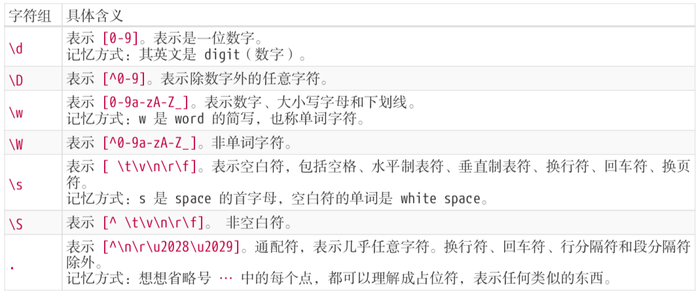
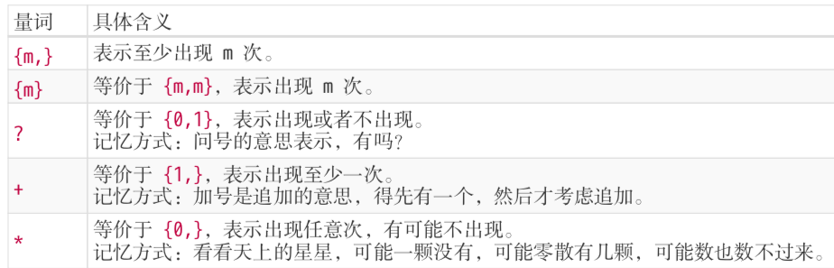
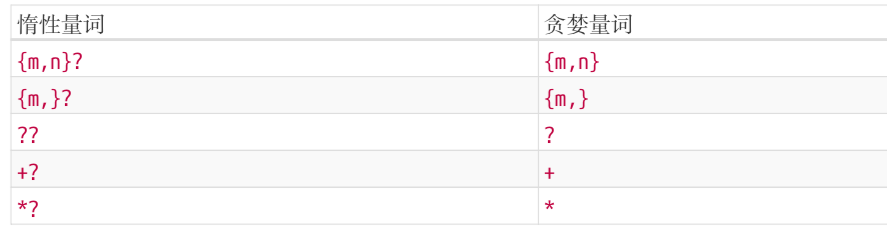

### 

# 正则表达式知识总结

## 正则表达式基础

### 创建正则的方式

1.使用一个正则表达式字面量，其由包含在斜杠之间的模式组成，如下所示：

```
var re = /ab+c/;
```

脚本加载后，正则表达式字面量就会被编译。当正则表达式保持不变时，使用此方法可获得更好的性能。

2.调用`RegExp`对象的构造函数，如下所示：

```
var re = new RegExp("ab+c");
```

在脚本运行过程中，用构造函数创建的正则表达式会被编译。如果正则表达式将会改变，或者它将会从用户输入等来源中动态地产生，就需要使用构造函数来创建正则表达式。

### 和正则相关的常用方法

#### RegExp.prototype.exec()

#### RegExp.prototype.test()

```js
const str = 'table football';

const regex = new RegExp('foo*');
const globalRegex = new RegExp('foo*', 'g');

console.log(regex.test(str));
```

test方法传入一个字符串，判断这个字符串是否匹配这个正则，匹配返回true，

#### String.prototype.match()

 **`match()`** 方法检索返回一个字符串能匹配上某个正则表达式的部分。如果正泽是全局的g，则所有部分都返回，否则返回第一个部分。

```js
  var regex = /ab{2,5}c/;
  var string = "abc abbc abbbc abbbbc abbbbbc abbbbbbc";
  console.log( string.match(regex) );
//=>["abbc", index: 4, input: "abc abbc abbbc abbbbc abbbbbc abbbbbbc", groups: undefined]

 	var regex = /ab{2,5}c/g;
  var string = "abc abbc abbbc abbbbc abbbbbc abbbbbbc";
  console.log( string.match(regex) );
//=> ["abbc", "abbbc", "abbbbc", "abbbbbc"]
```

## 正则表达式匹配攻略

### 两种模糊匹配

#### 横向匹配

比如正则 /ab{2,5}c/ 表示匹配这样一个字符串:第一个字符是 "a"，接下来是 2 到 5 个字符 "b"，最后是字符 "c"。

```js
  var regex = /ab{2,5}c/g;
  var string = "abc abbc abbbc abbbbc abbbbbc abbbbbbc";
  console.log( string.match(regex) );
	//=> ["abbc", "abbbc", "abbbbc", "abbbbbc"]
```

#### 纵向匹配

譬如 [abc]，表示该字符是可以字符 "a"、"b"、"c" 中的任何一个。

```js
var regex = /a[123]b/g;
var string = "a0b a1b a2b a3b a4b";
console.log( string.match(regex) );
  // => ["a1b", "a2b", "a3b"]
```

### 纵向匹配-字符组

#### 范围表示法

[abc]，表示匹配一个字符，它可以是 "a"、"b"、"c" 之一。

可以用-来简写，比如 [123456abcdefGHIJKLM]，可以写成 [1-6a-fG-M]。

可以用\对-进行转义从而匹配-

#### 排除字符组

例如**`[^abc]`**，表示是一个除 "a"、"b"、"c"之外的任意一个字 符。字符组的第一位放 ^(脱字符)，表示求反的概念。

#### 常见的简写形式



### 横向匹配-量词

`{m,n}`表示一个词出现m至n次

#### 一些简写形式




#### 贪婪匹配与惰性匹配

贪婪匹配和惰性匹配是**针对于量词**的两种匹配方式。

默认为贪婪匹配，在下面的例子中，每次可以取2-5个数字，贪婪匹配会尽可能的在每次匹配的时候都接近5个，即尽可能多的到达上限。

```js
var regex = /\d{2,5}/g;
var string = "123 1234 12345 123456";
console.log( string.match(regex) );
// => ["123", "1234", "12345", "12345"]
```

在量词的匹配之后加?则为惰性匹配，如下例子所示，每次都尽可能少的匹配，所以只匹配2个数字。

```js
var regex = /\d{2,5}?/g;
var string = "123 1234 12345 123456";
console.log( string.match(regex) );
// => ["12", "12", "34", "12", "34", "12", "34", "56"]
```

把量词的匹配转换为惰性匹配的方式



### 多选分支匹配

`(p1|p2|p3)`其中 p1、p2 和 p3 是子模式，用 |(管道符)分隔，表示其中任何之一。

```js
var regex = /good|nice/g;
var string = "good idea, nice try.";
console.log( string.match(regex) );
  // => ["good", "nice"]
```

注意：多选分支就近原则，就像或运算，前面过了后面的就不看了

```js
var regex = /goodbye|good/g;
var string = "goodbye";
console.log( string.match(regex) );
// => ["goodbye"]  匹配上了第一个后面的就不会再尝试了
```

### 匹配实例

#### 匹配任意字符

使用 [\d\D]、[\w\W]、[\s\S] 和 [^] 中任何的一个。

#### 匹配 **16** 进制颜色值
#### String.prototype.replace(RxgExp,str)

## 正则表达式位置匹配

正则表达式是匹配模式，要么匹配字符，要么匹配位置。

### 什么是位置

位置也叫锚。指的是**相邻字符之间**的位置。


### 位置匹配符

^、$、\b、\B、(?=p)、(?!p)

#### ^和$

^(脱字符)匹配开头，在多行匹配中匹配行开头。

$(美元符号)匹配结尾，在多行匹配中匹配行结尾。

```js
var result = "hello".replace(/^|$/g, '#');// 注意有g修饰符所以才会在匹配到开头过后继续再全部字符串中查找
console.log(result);
  // => "#hello#"
```

```js
var result = "hello".replace(/^|$/, '#');// 如果没有g则之匹配开头
console.log(result);
  // => "#hello"
```

#### \b 和 \B

`\b` 是单词边界，具体就是` \w `与 `\W `之间的位置，也包括` \w `与` ^ `之间的位置，和 `\w` 与` $ `之间的位置。

其中\w 是字符组` [0-9a-zA-Z_]` 的简写形式，`\W` 是排除字符组` [^0-9a-zA-Z_] `的简写形式。

注意` \w `与` ^ `之间的位置其实指的就是以`[0-9a-zA-Z_]`开头的前一个位置，对 `\w` 与` $ `同理。

#### **(?=p)** 和 (?!p)

