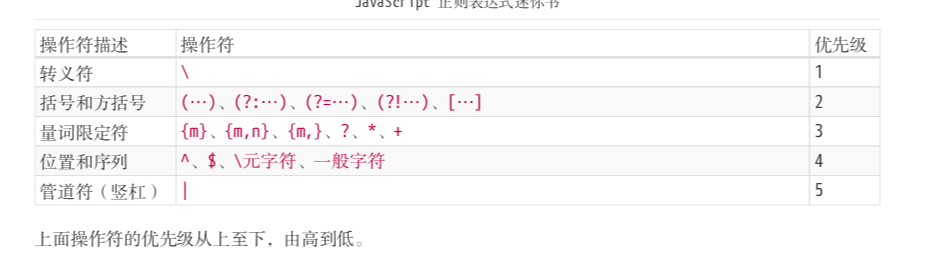

# 正则表达式知识总结

## 正则表达式基础

### 创建正则的方式

1.使用一个正则表达式字面量，其由包含在斜杠之间的模式组成，如下所示：

```
var re = /ab+c/;
```

脚本加载后，正则表达式字面量就会被编译。当正则表达式保持不变时，使用此方法可获得更好的性能。

2.调用`RegExp`对象的构造函数，如下所示：

```
var re = new RegExp("ab+c");
```

在脚本运行过程中，用构造函数创建的正则表达式会被编译。如果正则表达式将会改变，或者它将会从用户输入等来源中动态地产生，就需要使用构造函数来创建正则表达式。

### 和正则相关的常用方法

#### RegExp.prototype.exec()

https://developer.mozilla.org/zh-CN/docs/Web/JavaScript/Reference/Global_Objects/RegExp/exec

#### RegExp.prototype.test()

```js
const str = 'table football';

const regex = new RegExp('foo*');
const globalRegex = new RegExp('foo*', 'g');

console.log(regex.test(str));
```

test方法传入一个字符串，判断这个字符串是否匹配这个正则，匹配返回true，

#### String.prototype.match()

 **`match()`** 方法检索返回一个字符串能匹配上某个正则表达式的部分。如果正泽是全局的g，则所有部分都返回，否则返回第一个部分。

```js
  var regex = /ab{2,5}c/;
  var string = "abc abbc abbbc abbbbc abbbbbc abbbbbbc";
  console.log( string.match(regex) );
//=>["abbc", index: 4, input: "abc abbc abbbc abbbbc abbbbbc abbbbbbc", groups: undefined]

 	var regex = /ab{2,5}c/g;
  var string = "abc abbc abbbc abbbbc abbbbbc abbbbbbc";
  console.log( string.match(regex) );
//=> ["abbc", "abbbc", "abbbbc", "abbbbbc"]
```

https://developer.mozilla.org/zh-CN/docs/Web/JavaScript/Reference/Global_Objects/String/match

#### String.prototype.replace(RxgExp,str)

## 正则表达式匹配攻略

### 两种模糊匹配

#### 横向匹配

比如正则 /ab{2,5}c/ 表示匹配这样一个字符串:第一个字符是 "a"，接下来是 2 到 5 个字符 "b"，最后是字符 "c"。

```js
  var regex = /ab{2,5}c/g;
  var string = "abc abbc abbbc abbbbc abbbbbc abbbbbbc";
  console.log( string.match(regex) );
	//=> ["abbc", "abbbc", "abbbbc", "abbbbbc"]
```

#### 纵向匹配

譬如 [abc]，表示该字符是可以字符 "a"、"b"、"c" 中的任何一个。

```js
var regex = /a[123]b/g;
var string = "a0b a1b a2b a3b a4b";
console.log( string.match(regex) );
  // => ["a1b", "a2b", "a3b"]
```

### 纵向匹配-字符组

#### 范围表示法

[abc]，表示匹配一个字符，它可以是 "a"、"b"、"c" 之一。

可以用-来简写，比如 [123456abcdefGHIJKLM]，可以写成 [1-6a-fG-M]。

可以用\对-进行转义从而匹配-

#### 排除字符组

例如**`[^abc]`**，表示是一个除 "a"、"b"、"c"之外的任意一个字 符。字符组的第一位放 ^(脱字符)，表示求反的概念。

#### 常见的简写形式


### 横向匹配-量词

`{m,n}`表示一个词出现m至n次

#### 一些简写形式


#### 贪婪匹配与惰性匹配

贪婪匹配和惰性匹配是**针对于量词**的两种匹配方式。

默认为贪婪匹配，在下面的例子中，每次可以取2-5个数字，贪婪匹配会尽可能的在每次匹配的时候都接近5个，即尽可能多的到达上限。

```js
var regex = /\d{2,5}/g;
var string = "123 1234 12345 123456";
console.log( string.match(regex) );
// => ["123", "1234", "12345", "12345"]
```

在量词的匹配之后加?则为惰性匹配，如下例子所示，每次都尽可能少的匹配，所以只匹配2个数字。

```js
var regex = /\d{2,5}?/g;
var string = "123 1234 12345 123456";
console.log( string.match(regex) );
// => ["12", "12", "34", "12", "34", "12", "34", "56"]
```

把量词的匹配转换为惰性匹配的方式


### 多选分支匹配

`(p1|p2|p3)`其中 p1、p2 和 p3 是子模式，用 |(管道符)分隔，表示其中任何之一。

```js
var regex = /good|nice/g;
var string = "good idea, nice try.";
console.log( string.match(regex) );
  // => ["good", "nice"]
```

注意：多选分支就近原则，就像或运算，前面过了后面的就不看了

```js
var regex = /goodbye|good/g;
var string = "goodbye";
console.log( string.match(regex) );
// => ["goodbye"]  匹配上了第一个后面的就不会再尝试了
```

### 匹配实例

#### 匹配任意字符

使用 [\d\D]、[\w\W]、[\s\S] 和 [^] 中任何的一个。

#### 匹配 **16** 进制颜色值
## 正则表达式位置匹配

正则表达式是匹配模式，**要么匹配字符，要么匹配位置。**一定要弄清楚一个正则表达式的目的是什么。

### 什么是位置

位置也叫锚。指的是**相邻字符之间**的位置。


可以把位置理解为空字符串。既然是空字符串那么不管多少个连续的空字符串还是空的。

```js
var result = /(?=he)^^he(?=\w)llo$\b\b$/.test("hello");
console.log(result);
// => true
```

### 位置匹配符

^、$、\b、\B、(?=p)、(?!p)

#### ^和$

^(脱字符)匹配开头，在多行匹配中匹配行开头。

$(美元符号)匹配结尾，在多行匹配中匹配行结尾。

```js
var result = "hello".replace(/^|$/g, '#');// 注意有g修饰符所以才会在匹配到开头过后继续再全部字符串中查找
console.log(result);
  // => "#hello#"
```

```js
var result = "hello".replace(/^|$/, '#');// 如果没有g则之匹配开头
console.log(result);
  // => "#hello"
```

#### \b 和 \B

`\b` 是单词边界，具体就是` \w `与 `\W `之间的位置，也包括` \w `与` ^ `之间的位置，和 `\w` 与` $ `之间的位置。

其中\w 是字符组` [0-9a-zA-Z_]` 的简写形式，`\W` 是排除字符组` [^0-9a-zA-Z_] `的简写形式。

注意` \w `与` ^ `之间的位置其实指的就是以`[0-9a-zA-Z_]`开头的前一个位置，对 `\w` 与` $ `同理。

#### **(?=p)** 和 (?!p)

匹配p的前面的位置

```js
var result = "hello".replace(/(?=l)/g, '#');
console.log(result);
// => "he#l#lo"
```

不匹配p的前面的位置

```js
var result = "hello".replace(/(?!l)/g, '#');
console.log(result);
// => "#h#ell#o#"
```

## 正则表达式括号的作用

### 分组和分支结构

#### 分组

```js
 var regex = /(ab)+/g;
 var string = "ababa abbb ababab";
 console.log( string.match(regex) );
 // => ["abab", "ab", "ababab"]
```

改变正则表达式优先级

#### 分支结构

```js
  var regex = /^I love (JavaScript|Regular Expression)$/;
  console.log( regex.test("I love JavaScript") );
  console.log( regex.test("I love Regular Expression") );
  // => true
```

改变正则表达式优先级

### 分组引用

对括号内的内容进行内容的提取，或者是替换。

#### 提取数据

##### 方法一：用match或者是exec方法

```js
var regex = /(\d{4})-(\d{2})-(\d{2})/;
var string = "2017-06-12";
console.log( string.match(regex) );
// => ["2017-06-12", "2017", "06", "12", index: 0, input: "2017-06-12"]
```

第一项过后的n项返回匹配的内容，详细见MDN

##### 方法二：使用构造函数的全局属性 $1 至 $9 来获取

```js
var regex = /(\d{4})-(\d{2})-(\d{2})/;
var string = "2017-06-12";
regex.test(string); // 正则操作即可，例如 
                  //regex.exec(string); 
                  //string.match(regex);

console.log(RegExp.$1); // "2017"
console.log(RegExp.$2); // "06"
console.log(RegExp.$3); // "12"
```

注意要在获取到之前先用一次正则的操作，这个属性上的值都是最近一次的正则操作匹配上的值。

#### 替换

```js
var regex = /(\d{4})-(\d{2})-(\d{2})/;
var string = "2017-06-12";
var result = string.replace(regex, "$2/$3/$1");
console.log(result);
// => "06/12/2017"
```

等于

```js
var regex = /(\d{4})-(\d{2})-(\d{2})/;
var string = "2017-06-12";
var result = string.replace(regex, function () {
  return RegExp.$2 + "/" + RegExp.$3 + "/" + RegExp.$1;
});
console.log(result);
// => "06/12/2017"
```

等于

```js
var regex = /(\d{4})-(\d{2})-(\d{2})/;
var string = "2017-06-12";
var result = string.replace(regex, function (match, year, month, day) {
  return month + "/" + day + "/" + year;
});
console.log(result);
// => "06/12/2017"
```

### 反向引用

#### 基本使用

即在正则中引用之前出现的分组。

例子：

要求第一个分隔符要和第二个分隔符相等，这样的正则对于2016-06/12这样的不符合要求的字符串就不能识别。

```js
var regex = /\d{4}(-|\/|\.)\d{2}(-|\/|\.)\d{2}/;
var string1 = "2017-06-12";
var string2 = "2017/06/12";
var string3 = "2017.06.12";
var string4 = "2016-06/12";
console.log( regex.test(string1) ); // true
console.log( regex.test(string2) ); // true
console.log( regex.test(string3) ); // true
console.log( regex.test(string4) ); // true
```

可以使用反向引用来解决

```js
// 其中\1表示第一个分组匹配到的内容，相当于$1
var regex = /\d{4}(-|\/|\.)\d{2}\1\d{2}/;
var string1 = "2017-06-12";
var string2 = "2017/06/12";
var string3 = "2017.06.12";
var string4 = "2016-06/12";
console.log( regex.test(string1) ); // true
console.log( regex.test(string2) ); // true
console.log( regex.test(string3) ); // true
console.log( regex.test(string4) ); // false
```

在正则中,\1 \2 \3 \4...和$1 $2 $3 $4...表达同样的含义

#### 括号嵌套

```js
var regex = /^((\d)(\d(\d)))\1\2\3\4$/;
var string = "1231231233";
console.log( regex.test(string) ); // true
console.log( RegExp.$1 ); // 123
console.log( RegExp.$2 ); // 1
console.log( RegExp.$3 ); // 23
console.log( RegExp.$4 ); // 3
```

$n的内容是第n个( 包起来的内容

####  \10

代表第10个分组而不是\1 和 0

#### 不存在分组

反向引用引用不存在的分组时不会报错，只是匹配反向引用的字符本身。例如 \2，就匹配 "\2"。注意 "\2" 表示对 "2" 进行了转义。意思就是正则\2匹配的是"\2"转义后的结果。

```js
var regex = /\1\2\3\4\5\6\7\8\9/;
console.log( regex.test("\1\2\3\4\5\6\7\8\9") );//true
console.log( "\1\2\3\4\5\6\7\8\9".split("") );// 输出的是\1,\2...的转移后的字符串
```

### 分组和量词！

#### 基本概念

分组后面有量词的话，分组最终捕获到的数据是最后一次的匹配！

```js
var regex = /(\d)+/;
var string = "12345";
console.log( string.match(regex) );
// => ["12345", "5", index: 0, input: "12345"]
```

注意到是匹配的最后一次匹配的内容5！！

#### 反向引用中的分组和量词

```js
var regex = /(\d)+ \1/;
console.log( regex.test("12345 1") );
// => false
console.log( regex.test("12345 5") );
// => true
```

此时()匹配的内容是5，\1就对应的是5，所以第一条就匹配不上。

### 非捕获括号

如果只想要括号起到分组和分支结构，即改变正则运算优先级的目的，则可以使用非捕获括号(?:p)

```js
var regex = /(?:ab)+/g;
var string = "ababa abbb ababab";
console.log( string.match(regex) );
// => ["abab", "ab", "ababab"]
```

```js
var regex = /^I love (?:JavaScript|Regular Expression)$/;
console.log( regex.test("I love JavaScript") );
console.log( regex.test("I love Regular Expression") );
// => true
```

这个时候再使用match方法等就没有引用数据的功能。

## 正则表达式的回溯法原理

直接看书有图更好理解

## 正则表达式的拆分

### 正则符号的优先级



### 需要转义的元字符

^、$、.、*、+、?、|、\、/、(、)、[、]、{、}、=、!、:、- ,

当匹配上面的字符本身时，可以一律转义:

## 正则表达式的构建

### 什么时候使用正则表达式

* 有明确的匹配目的
* 能使用正则解决
* 当一些常用的字符串api无法解决的时候

### 什么样的正则表达式才是一个好的正则表达式

#### 准确性

一个正则表达式要能准确判断目标字符串，一些错误情况不应该被漏判。为了达到这样的目的，可以参考6.3.1匹配固定电话一步一步的构建正则表达式。

针对每种情形，分别写出正则，然用分支把它们合并在一起，再提取分支公共部分，就能得到准确的正则。

#### 效率

大多时候都不需要优化，因为也不会慢到哪里去，除非真的是特别慢的时候。

那么特别慢的时候应该怎么优化呢？


### 


### 

