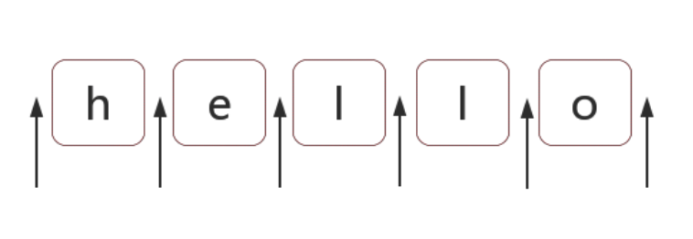

# 正则表达式知识总结

## 正则表达式基础

### 创建正则的方式

1.使用一个正则表达式字面量，其由包含在斜杠之间的模式组成，如下所示：

```
var re = /ab+c/;
```

脚本加载后，正则表达式字面量就会被编译。当正则表达式保持不变时，使用此方法可获得更好的性能。

2.调用`RegExp`对象的构造函数，如下所示：

```
var re = new RegExp("ab+c");
```

在脚本运行过程中，用构造函数创建的正则表达式会被编译。如果正则表达式将会改变，或者它将会从用户输入等来源中动态地产生，就需要使用构造函数来创建正则表达式。

### 和正则相关的常用方法

#### RegExp.prototype.exec()

#### String.prototype.replace(RxgExp,str)

## 正则表达式位置匹配

正则表达式是匹配模式，要么匹配字符，要么匹配位置。

### 什么是位置

位置也叫锚。指的是**相邻字符之间**的位置。



### 位置匹配符

^、$、\b、\B、(?=p)、(?!p)

#### ^和$

^(脱字符)匹配开头，在多行匹配中匹配行开头。

$(美元符号)匹配结尾，在多行匹配中匹配行结尾。

```js
var result = "hello".replace(/^|$/g, '#');// 注意有g修饰符所以才会在匹配到开头过后继续再全部字符串中查找
console.log(result);
  // => "#hello#"
```

```js
var result = "hello".replace(/^|$/, '#');// 如果没有g则之匹配开头
console.log(result);
  // => "#hello"
```

#### \b 和 \B

`\b` 是单词边界，具体就是` \w `与 `\W `之间的位置，也包括` \w `与` ^ `之间的位置，和 `\w` 与` $ `之间的位置。

其中\w 是字符组` [0-9a-zA-Z_]` 的简写形式，`\W` 是排除字符组` [^0-9a-zA-Z_] `的简写形式。

注意` \w `与` ^ `之间的位置其实指的就是以`[0-9a-zA-Z_]`开头的前一个位置，对 `\w` 与` $ `同理。

#### **(?=p)** 和 (?!p)

