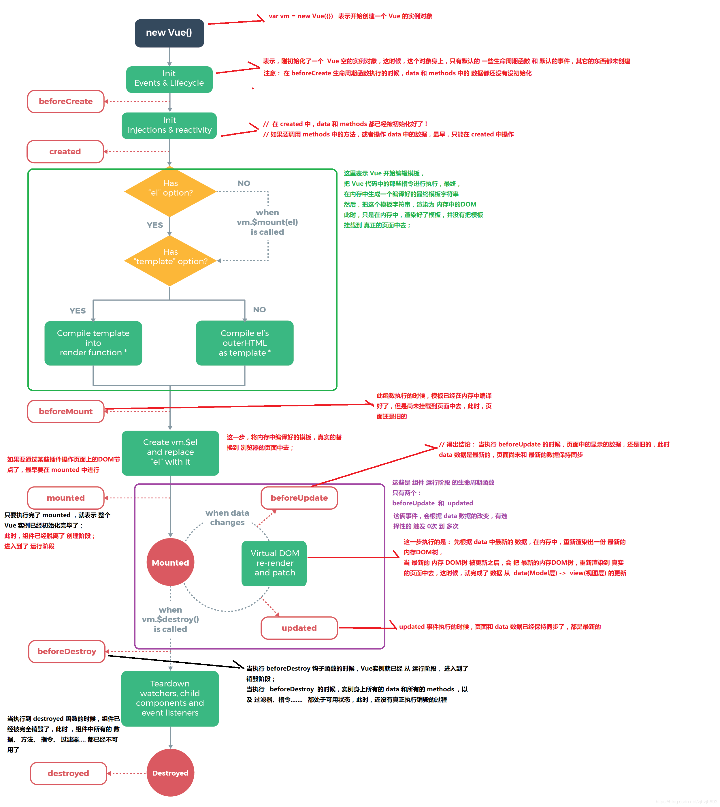
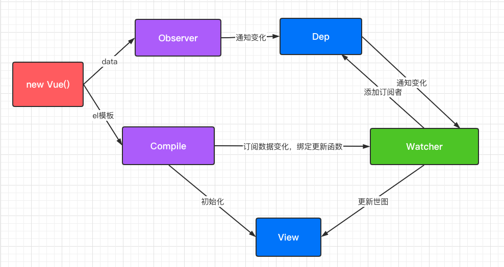
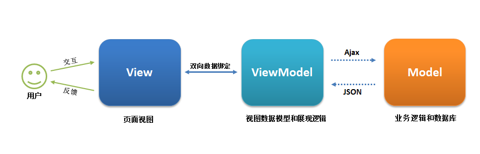
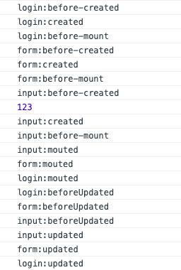
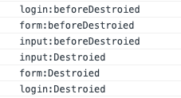

# Vue知识总结

## 1 生命周期



补充：

* created之后的el option的意思是如果有设定了el属性，即有没有决定要挂载到哪个元素上，决定了才继续进行，没有决定的话直到使用了vm.$mounted(el)才继续进行
* 有无template option的意思是有没有定义template属性，定义了的话就用这个属性对应的模版字符串给render函数渲染，否则就是用el这个元素的html模版字符串来进行渲染，可以参考原生的el.outerHTML()方法
* 在使用vue-router进行页面跳转的时候是出于vue的哪一个生命周期？等之后看了vue-router的原理再补充

- beforeCreate： 组件实例被创建之初，组件的属性生效之前
- created： 组件实例已经完全创建，属性也绑定，但真实 dom 还没有生成，$el 还不可用
- beforeMount： 在挂载开始之前被调用：相关的 render 函数首次被调用
- mounted： el 被新创建的 vm.$el 替换，并挂载到实例上去之后调用该钩子
- beforeUpdate： 组件数据更新之前调用，发生在虚拟 DOM 打补丁之前
- update： 组件数据更新之后
- activited： keep-alive 专属，组件被激活时调用
- deactivated： keep-alive 专属，组件被挂起时调用
- beforeDestory： 组件销毁前调用
- destoryed： 组件销毁后调用

* ErrorCaptured:当捕获一个来自子孙组件的错误时被调用。此钩子会收到三个参数：错误对象、发生错误的组件实例以及一个包含错误来源信息的字符串。此钩子可以返回 `false` 以阻止该错误继续向上传播。

## 2 Vue响应式原理和注意事项

### 2.1 Vue2.0 的响应式原理

- 发布者-订阅者模式：绑定监听 -> 更新数据

- 数据劫持：

  vue.js 采用数据劫持 + 发布者-订阅者模式，通过

  ```js
    Object.defineProperty()
  ```
  
  来劫持各个属性的

  ```js
  setter
  ```
  
  ```js
  getter
  ```
  
  在数据变动时发布消息给订阅者，触发相应的监听回调。

  - `Object.defineProperty`：该方法会直接在一个对象上定义一个新属性，或者修改一个对象的现有属性，并返回此对象。
- 通过遍历数组 和递归遍历对象，从而达到利用`Object.defineProperty()`也能对对象和数组（部分方法的操作）进行监听。




**响应式的实现**：

- 监听器 Observer：对数据对象进行遍历，包括子属性对象的属性，利用 Object.defineProperty() 重新在vm即vue实例对象上重新定义响应式的属性值。这样的话，给这个对象的某个值赋值，就会触发 setter，那么就能监听到了数据变化。
- 解析器 Compile：解析 Vue 模板指令，将模板中的变量都替换成数据，然后初始化渲染页面视图，并且将每一个要渲染到view上的值绑定到一个watcher上
- 订阅者 Watcher： 主要的任务是存储vue实例中的响应式值，即viewmodel和DOM节点的对应关系，当收到属性值变化的消息时，触发对应的更新函数去更新view。
- 订阅器 Dep(dependency)：每一个viewModel中的属性值实际上都是可能对应多个watcher(订阅者)，即可能影响多个在view中呈现出来的值，所以要用一个dep来保存每一个每一个属性对应的watcher。
- 注意由于watcher实际上和viewModel中的属性是多对多的关系，所以要用dep记录这种关系

**代码实现：**

```js
<!DOCTYPE html>
<html lang="en">
<head>
  <meta charset="UTF-8">
  <meta name="viewport" content="width=device-width, initial-scale=1.0">
  <title>Document</title>
</head>
<body>
 <div id='app'>
   <input type="text" v-model='text'>
   {{text}}
 </div>
</body>
<script>
  //1.绑定vue中的内容到对应的数值中
  //1.1 劫持结点的所有子结点生成文档片段
function nodeToFragment(node,vm) {
  let fragment = document.createDocumentFragment()
  let child
  while(child = node.firstChild){//赋值node.firstChild给child,以child的值为=表达式的返回值
    //1.3 每一个都处理一下
    compile(child,vm)
    fragment.appendChild(child)//注意通过appendChild加入文档碎片后child就不在app中了
  }
  return fragment
}

  //1.2 编译函数去处理每一个节点，把{{}}中的值和v-model属性中对应的值用vue实例中的值替换到value上
  function compile(node,vm) {
    let reg = /\{\{(.*)\}\}/
    if(node.nodeType===1){//如果该节点是元素类型
     let attr = node.attributes
     for(let i = 0;i < attr.length;i++){
       if(attr[i].nodeName === 'v-model'){
        let name = attr[i].nodeValue
        node.addEventListener('input',function(e){
          vm[name] = e.target.value//注意此时绑定到vm的对应属性上
        })
        //  node.value = vm.data[name]
        // node.value = vm[name]//注意此时绑定到vm的对应属性上
        new Watcher(vm,node,name)//使用watcher监管node的值,有几个视图就有几个watcher
         node.removeAttribute('v-model')
       }
     }
    }
    if(node.nodeType===3){//如果该节点是文本类型
      if(reg.test(node.nodeValue)){
        let name = reg.exec(node.nodeValue)[1]
        name.trim()
        // node.nodeValue = vm.data[name]
        new Watcher(vm,node,name)
        node.nodeValue = vm[name]
      }
    }
  }

  //1.4 创建一个vue实例化函数
  function Vue(options) {
    this.data = options.data

    observe(this.data,this)

    let id = options.el
    let dom = nodeToFragment(document.getElementById(id),this)
    //处理完后还回dom到原来的节点下
    document.getElementById(id).appendChild(dom)
  }

  //2.1 把对应的属性设置到vm上，并用defineProperty改写为响应式
  function defineReactive(obj,key,val) {
    let dep = new Dep()//Dep用来发布更新给对应的Watchers,一个属性值对应一个dep
    Object.defineProperty(obj,key,{//使用Object.defineProperty不仅对obj对象新建了一个key属性，而且还将这个属性的值绑定给val
      get:function(){//读取这个属性都返回val这个值
      if(Dep.target){
        dep.addSub(Dep.target)
      }
        return val
      },
      set:function(newVal){//设置属性的时候也是作用与val这个值
        if(newVal === val){
          return
        }
        val = newVal
        console.log('add',val)
        dep.notify()
      }
    })
  }
  //2.2 实现一个观察者，观察数据的每一个属性
  function observe(obj,vm){
    for(let key of Object.keys(obj)){//注意观察者是在vm上新建了obj上的属性，然后观察vm上的新建属性
      defineReactive(vm,key,obj[key])
    }
  }

  Watcher.prototype.update = function () {
    this.get()//在初始化watcher时第一次调用了get方法
    this.node.nodeValue = this.value
    this.node.value = this.value
  }

  Watcher.prototype.get = function(){
    this.value = this.vm[this.name]//第一次调用get方法时，同时也触发了this.vm[this.name]的get路径，从而将这个watcher加入了dep中
  }

  function Watcher(vm,node,name){
    this.vm = vm //传入vm生成闭包
    this.node = node
    this.name = name
    Dep.target = this
    this.update()
    Dep.target = null
  }

  function Dep(){
    this.subs = []
  }

  Dep.prototype.addSub = function(sub){
    this.subs.push(sub)
  }

  Dep.prototype.notify = function(sub){
    this.subs.forEach((sub)=>{
      sub.update()
    })
  }

    let app = new Vue({
    el:'app',
    data:{
      text:'hello world'
    }
  })
</script>
</html>
```
**简易版本：**

```js
//vue2.0响应式原理
function render(){
    console.log("模拟视图渲染")
}

let arr = [1,2,3];
let methods = ['pop','shift','unshift','sort','reverse','splice','push'];
let arrProto = Array.prototype;
//创建一个自己原型，继承Array.prototype
let proto = Object.create(arrProto);
//重写methods当中的数组方法，使得这些方法支持响应式
methods.forEach(method=>{
    proto[method] = function(){
        render(); 
        arrProto[method].call(this,...arguments);
    }
})

function observer(obj){ //把所有的属性定义成set/get的方式
    if(Array.isArray(obj)){//为了让数组使用自定义的方法，所以更改了其指向的原型
        obj.__proto__ = proto;
        return;
    }
    if(typeof obj =="object"){
        for(let key in obj){
            defineReactive(obj,key,obj[key]);
        }
    }
}

function defineReactive(data,key,value){
    observer(value);//递归调用observe使得对更深层的对象属性也进行响应式
    Object.defineProperty(data,key,{
        get(){  //获取值
            return value;
        },
        set(newValue){//设置值
            observer(newValue);//递归调用observe使得对更深层的对象属性也进行响应式
            if(newValue!==value){
                render();
                value = newValue 
            }
        }
    })
}

function $set(data,key,value){
    if(Array.isArray(data)){
        return data.splice(key,1,value);//当前调用的是splice方法
    }
    defineReactive(data,key,value);
}
observer(arr);
console.log(arr);


//1)如果给对象新增属性 是不会被监控到的 vm.$set
// vm.$set(obj,"age",12);
//2)不支持数组的长度变化，也不支持通过索引更改数组的内容
```
### 2.2 Vue3.0 的响应式原理
```js
//使用proxy来实现数据的响应式变化
//因为使用了reflex,所以可以支持数组，不区分是对象还是数组，甚至所有的数组方法也可以
function render(){
    console.log("模拟视图的更新")
}
let obj = {
    name:'zf',
    age:{age:10},
    arr:[]
}
let handler = {
    get(target,key){
        if(typeof target[key]=="object" && target[key]!==null){
            return new Proxy(target[key],handler);
        }
       return Reflect.get(target,key); 
    },
    set(target,key,value){
       if(key ==="length") return true;//因为每个数组都有length属性，所以插入删除这些操作会render两次，所以要把length属性不render
       render();
       return Reflect.set(target,key,value);
    }
}
let proxy = new Proxy(obj,handler);
// proxy.age = 12;
// proxy.age.age = 20;
// proxy.a = "a";
// proxy.arr.push(123);
proxy.arr[0] = 100;
console.log(proxy.arr);
```
[Proxy的使用](https://developer.mozilla.org/zh-CN/docs/Web/JavaScript/Reference/Global_Objects/Proxy)

### 2.3 检测变化的注意事项

* 对于对象

  Vue 无法检测 property 的添加或移除。可以使用vm.$set或者Vue.set方法添加使其成为响应式的属性

* 对于数组

  Vue 不能检测以下数组的变动：

  1. 当你利用索引直接设置一个数组项时，例如：`vm.items[indexOfItem] = newValue`
  2. 当你修改数组的长度时，例如：`vm.items.length = newLength`

  为了解决第一类问题，以下两种方式都可以用，同时也将在响应式系统内触发状态更新：

  ```
  // Vue.set
  Vue.set(vm.items, indexOfItem, newValue)//或者是vm.$set
  // Array.prototype.splice
  vm.items.splice(indexOfItem, 1, newValue)//或者其他push,shift等方法也可以是响应式的
  ```

  你也可以使用 [`vm.$set`](https://cn.vuejs.org/v2/api/#vm-set) 实例方法，该方法是全局方法 `Vue.set` 的一个别名：

  ```
  vm.$set(vm.items, indexOfItem, newValue)
  ```

  为了解决第二类问题，你可以使用 `splice`：

  ```
  vm.items.splice(newLength)
  ```

## 3 MVVM响应式原理

### 3.1 什么是MVC

 Model-View-Controller（模型-视图-控制器） 模式


* 这种模式这三层全部在后端，controller负责进行页面的逻辑，view层负责交互和展示，model负责服务端的数据维护和存储
* 这种情况下后端就要负责model的管理，页面跳转逻辑或者是数据请求逻辑或者数据的处理，任务量很重，前端只是切图

* 并且是服务端渲染视图，导致性能不好优化，很多操作都需要请求整个页面全部重新渲染和请求

### 3.2 什么是MVVM

- Model–View–ViewModel （MVVM） 是一个软件架构设计模式，MVVM 源自于经典的 Model–View–Controller（MVC）模式。
- MVVM 的出现促进了前端开发与后端业务逻辑的分离，极大地提高了前端开发效率。
- MVVM 的核心是 ViewModel 层，它就像是一个中转站（value converter），负责转换 Model 中的数据对象来让数据变得更容易管理和使用，该层向上与视图层进行双向数据绑定，向下与 Model 层通过接口请求进行数据交互，起呈上启下作用。



- View 层：View 是视图层，也就是用户界面。前端主要由 HTML 和 CSS 来构建 。
- Model 层：Model 是指数据模型，泛指后端进行的各种业务逻辑处理和数据操控，对于前端来说就是后端提供的 api 接口。
- ViewModel 层：ViewModel 是由前端开发人员组织生成和维护的视图数据层。
  - 在这一层，前端开发者对从后端获取的 Model 数据进行转换处理，做二次封装，以生成符合 View 层使用预期的视图数据模型。
  - 需要注意的是 ViewModel 所封装出来的数据模型包括视图的状态和行为两部分，而 Model 层的数据模型是只包含状态的，比如页面的这一块展示什么，而页面加载进来时发生什么，点击这一块发生什么，这一块滚动时发生什么这些都属于视图行为（交互），视图状态和行为都封装在了 ViewModel 里。
  - 这样的封装使得 ViewModel 可以完整地去描述 View 层。
- MVVM 框架实现了双向绑定，这样 ViewModel 的内容会实时展现在 View 层，前端开发者再也不必低效又麻烦地通过操纵 DOM 去更新-视图。
- 我们开发者只需要处理和维护 ViewModel，更新数据视图就会自动得到相应更新。
- 这样 View 层展现的不是 Model 层的数据，而是 ViewModel 的数据。
- 由 ViewModel 负责与 Model 层交互，这就完全解耦了 View 层和 Model 层，这个解耦是至关重要的，它是前后端分离方案实施的重要一环。

```html
<!-- View层 -->
<div id="app">
    <p>{{message}}</p>
    <button v-on:click="showMessage()">Click me</button>
</div>
```
```js
// ViewModel层
var app = new Vue({
    el: '#app',
    data: {  // 用于描述视图状态   
        message: 'Hello Vue!', 
    },
    methods: {  // 用于描述视图行为  
        showMessage(){
            let vm = this;
            alert(vm.message);
        }
    },
    created(){
        let vm = this;
        // Ajax 获取 Model 层的数据
        ajax({
            url: '/your/server/data/api',
            success(res){
                vm.message = res;
            }
        });
    }
})
// Model层
{
    "url": "/your/server/data/api",
    "res": {
        "success": true,
        "name": "IoveC",
        "domain": "www.cnblogs.com"
    }
}
```

## 4 Virtual Dom 虚拟Dom

https://github.com/livoras/blog/issues/13

### 4.1 什么是virtual dom?

virtual dom实际上是对真实的DOM的映射，是使用JS对象来重构一个DOM从而表达DOM的节点关系和信息

### 4.2 使用virtual dom的好处和坏处

* 好处
  * 实际上是规范了对DOM的操作。由于对DOM的操作过程实际上都转换为了对虚拟DOM的操作，最后再统一patch渲染。这相当于操作JS，使得中间的操作步骤会变得很快。比如对一个ul标签添加十个li,如果直接操作DOMcost很大，但是操作虚拟DOM的话值相当于向对象里插入了十个值，这个过程是很快的，最后再统一在DOM上渲染只会引发一次回流重绘
  * 虚拟dom的diff和patch都是自动完成的，无需开发人员手动再去实现
  * 使得开发人员不用再去特别关注操作dom的性能损耗，使得代码逻辑更加清晰
* 缺点
  * 性能优化的上限没有原生高。创建virtual dom也是有开销的，对于性能有极致要求的场合并不适合有virtual dom

### 4.3 Virtual dom的具体实现

实现步骤：

1. 用 JavaScript 对象结构表示 DOM 树的结构；然后用这个树构建一个真正的 DOM 树，插到文档当中
2. 当状态变更的时候，重新构造一棵新的对象树。然后用diff算法比较新的树和旧的树，记录两棵树差异,
3. 把2所记录的差异应用到步骤1所构建的真正的DOM树上，视图就更新了

```js
// 1. 构建虚拟DOM
var tree = el('div', {'id': 'container'}, [
    el('h1', {style: 'color: blue'}, ['simple virtal dom']),
    el('p', ['Hello, virtual-dom']),
    el('ul', [el('li')])
])

// 2. 通过虚拟DOM构建真正的DOM
var root = tree.render()
document.body.appendChild(root)

// 3. 生成新的虚拟DOM
var newTree = el('div', {'id': 'container'}, [
    el('h1', {style: 'color: red'}, ['simple virtal dom']),
    el('p', ['Hello, virtual-dom']),
    el('ul', [el('li'), el('li')])
])

// 4. 比较两棵虚拟DOM树的不同
var patches = diff(tree, newTree)

// 5. 在真正的DOM元素上应用变更
patch(root, patches)
```

[virtual dom的具体实现](https://github.com/livoras/blog/issues/13)

## 5 父子组件传值的方式

### 5.1 props父传子
```html
<div id="app">
    <cpm :cmovies='movies' :cmessage='message'></cmp>
</div>
<template id='cmp'>
    <div>
        <h2>{{cmessage}}</h2>
        <ul>
            <li v-for='movie in cmovies'>{{movie}}</li>
        </ul>
    </div>
</template>
<script src="../js/vue.js"></script>
<script>
   const cpm = {
       template:"#cmp",
       //注意props意为支撑，支柱，作为与父元素沟通的桥梁，并且会将父元素的值动态绑定到子元素上
       props:{
           //这里的数据是可以进行定义的
           cmessage:{
               type:String,
               default:'123'
           },
           //如果是对象的话赋初值要用函数
           cmovies:{
               type:Array,
               default(){
                   return{}
               }
           }
       },
       data(){
           return {};
       }
   }

  const app = new Vue({
    el: '#app',
    data: {
      message: '你好啊',
      movies: ['海王', '海贼王', '海尔兄弟']
    },
    components:{
        cpm,
    }
  })

</script>
```

### 5.2 $emit子传父
```html
<div id='app'>
    <!-- 通过这种方式默认传入的参数就是子组件中的数据 -->
    <!-- 这个地方的cmp组件实际上是在父级作用域中，所以获取到的数据都是app中的，要取得子组件的话要传递-->
    <!-- 所以说父传子是通过属性的值的传递，而子传父是通过自定义事件 -->
    <cmp @item-click='cpnClick'></cmp>
</div>

<template id='cmp'>
    <!-- 注意模版要用div包起来 -->
    <div>
        <button v-for='item in categories' @click='itemClick(item)'>{{item.name}}</button>
    </div>
</template>

<body>
    <script src='../js/vue.js'></script>
    <script>
        const cmp = {
            template: '#cmp',
            data() {
                return {
                    categories: [
                        { id: 'aaa', name: '热门推荐' },
                        { id: 'bbb', name: '手机数码' },
                        { id: 'ccc', name: '家用家电' },
                        { id: 'ddd', name: '电脑办公' },
                    ]
                }
            },
            methods: {
                itemClick(item) {
                    //把这个数据发送给item-click的自定义事件
                    this.$emit('item-click', item);
                }
            }
        }

        const app = new Vue({
            el: '#app',
            components: {
                cmp
            },
            methods: {
                cpnClick(item) {
                    console.log('父组件', item);
                }
            }
        })
    </script>
```

### 5.3 ref或者$children父访问子
```html
<div id='app'>
    <cmp ref='aaa'></cmp>
    <button @click='onClick()'>button</button>
</div>
<template id='cmp'>
    <div>
        <h2>我是子组件</h2>
    </div>
</template>

<body>
    <script src='../js/vue.js'></script>
    <script>

        const cmp = {
            template: '#cmp',
            data() {
                return {
                    name: 123
                }
            },
        }

        const app = new Vue({
            el: '#app',
            components: {
                cmp
            },
            methods: {
                onClick() {
                    // this.$children返回一个自组件的数组
                    // 但是这种方法并不好，如果子组件位置发生修改代码就也要随之改动
                    // console.log(this.$children[0].name);

                    //还可以用ref来实现,注意要在子组件上添加对应的名字
                    //注意是refs是复数
                    console.log(this.$refs.aaa.name);
                }

            }
        })
    </script>
</body>
```

### 5.4 $parent或者$root子访问父
```html
<template id="ccpn">
  <div>
    <h2>我是子组件</h2>
    <button @click="btnClick">按钮</button>
  </div>
</template>

<script src="../js/vue.js"></script>
<script>
  const app = new Vue({
    el: '#app',
    data: {
      message: '你好啊'
    },
    components: {
      cpn: {
        template: '#cpn',
        data() {
          return {
            name: '我是cpn组件的name'
          }
        },
        components: {
          ccpn: {
            template: '#ccpn',
            methods: {
              btnClick() {
                // 1.访问父组件$parent
                // console.log(this.$parent);
                // console.log(this.$parent.name);

                // 2.访问根组件$root
                console.log(this.$root);
                console.log(this.$root.message);
              }
            }
          }
        }
      }
    }
  })
</script>
```

### 5.5 EventBus——任意两个组件的传值

* 首先给两个组件一个公共的属性`Vue.prototype.$bus = new Vue()`, 给Vue的原型上一个$bus属性，是Vue的实例
* 发送： this.$bus.$emit('事件名',值)
* 接收： this.$bus.$on("事件名",[callback])

https://zhuanlan.zhihu.com/p/72777951

### 5.6 provide/inject

父级组件向子级组件传值，无论多深都可以穿

https://cn.vuejs.org/v2/guide/components-edge-cases.html

或者直接查官网

### 5.7 $attrs/$listeners

父组件把所有属性值都打包传入子组件，$attrs传所有的不被props接收的绑定属性值，$listeners传所有事件监听器

https://segmentfault.com/a/1190000022708579

查官网

## 6.零碎知识点

### 6.1 自定义指令

```html
<!DOCTYPE html>
<html lang="en">
<head>
    <meta charset="UTF-8">
    <meta name="viewport" content="width=device-width, initial-scale=1.0">
    <title>指令</title>
    <style>
        .content{
            width: 100px;
            height: 100px;
            background: red;
        }
    </style>
</head>
<body>
    <!-- 指令的作用是来操作DOM元素 有特定的功能 -->
    <div id="app">
        <div v-color="'yellow'">xxxx</div>
        <!-- <input type="text" v-focus> -->
        <div v-click-outside="hide">
            <input type="text" @focus = "show">
            <div class="content" v-if="isShow">
                content 
                <button>选中日期</button>
            </div>
        </div>
    </div>
</body>
</html>
<script src="vue.min.js"></script>
<script>
  	//全局指令
    Vue.directive('color',function(el,bingdings,vnode){
        //el绑定的元素   bingdings  指令的参数  Vue 编译生成的虚拟节点
        // console.log(bingdings);
        el.style.background = `${bingdings.value}`;
    })
    //局部指令
    let vm  = new Vue({
        el:"#app",
        data:{
            msg:"zf",
            isShow:false
        },
        methods:{
            show(){
               this.isShow  = true; 
            },
            hide(){
                this.isShow = false;
            }
        },
        directives:{
            "click-outside":{
                bind(el,bingdings,vnode){//指令第一次绑定到元素时调用
                    console.log(vnode);
                    document.addEventListener("click",(e)=>{
                       if(!el.contains(e.target)){
                          
                        //vnode.context.hide();
                        vnode.context[bingdings.expression]();  
                       } 
                    })
                },
                inserted(el){ //元素插入到页面时执行
                  
                },
                update(el){ //更新时
                    console.log("更新"+el);
                },
                unbind(el){//销毁时  事件的绑定移出的操作
                    
                }
            }
            // focus(el,bingdings,vnode){ //默认调用bind方法

            // }
        }

    })
</script>
```

[自定义指令](https://cn.vuejs.org/v2/guide/custom-directive.html#ad)


### 6.2 computed和watch的区别

```js
<div id="demo">{{ fullName }}</div>
var vm = new Vue({
  el: '#demo',
  data: {
    firstName: 'Foo',
    lastName: 'Bar',
    fullName: 'Foo Bar'
  },
  watch: {
    firstName: function (val) {
      this.fullName = val + ' ' + this.lastName
    },
    lastName: function (val) {
      this.fullName = this.firstName + ' ' + val
    }
  }
})
```

上面代码是命令式且重复的。将它与计算属性的版本进行比较：

```js
var vm = new Vue({
  el: '#demo',
  data: {
    firstName: 'Foo',
    lastName: 'Bar'
  },
  computed: {
    fullName: function () {
      return this.firstName + ' ' + this.lastName
    }
  }
})
```

总结：

* 计算属性相比起watch更加的方便，不用去监听每一个相关的属性造成代码的冗余
* 并且计算属性相比起直接使用方法可以利用缓存，只在相关响应式依赖发生改变时它们才会重新求值。提升了多次重复计算的速度。
* 当有异步操作时，computed没法操作，得用watch

## 7.组件渲染原理
```js
  methods: {
    getSource(type) {
      //拿到template,script,style标签的内容
      const reg = new RegExp(`<${type}[^>]*>`); //开始的标签
      let code = this.code;
      let matches = code.match(reg);
      if (matches) {
        let tag = matches[0];
        return code.slice(
          code.indexOf(tag) + tag.length,
          code.lastIndexOf(`</${type}>`)
        );
      }
      return "";
    },
    run() {
      //获取组件中的内容 template内容 js内容 css的内容
      const template = this.getSource("template");
      const script = this.getSource("script").replace(
        /export default/,
        "return"
      );
      const style = this.getSource("style");
      let component = {};
      if (script) {
        component = new Function(script)();
        console.log(component);
      }
      if (template) {
        component.template = template;
        //template  $mount手动挂载到DOM元素
        //vm.$mount  先获取组件的实例
        //this.$options._base  指Vue类
        let instance = new (this.$options._base.extend(component))();
        this.$refs.showBox.appendChild(instance.$mount().$el);
        //挂载在内存中，挂载的结果放在$el
      }
      if (style) {
        let element = document.createElement("style");
        element.type = "text/css";
        element.innerText = style;
        document.body.appendChild(element);
      }
    },
  },
```

## 8. Patch和diff算法


## 10. Vue2,3的区别

* vue3使用proxy，可以监听对象的所有行为而不是属性，vue2只是使用了object.defineProperty，只能对已经有的数据进行拦截放入dep,所以vue3可以响应式的监听object的新属性和数组长度变化

* **基于 proxy 的响应侦测**

  - **Proxy 的优势如下:**

    - Proxy 可以直接监听对象而非属性；
    - Proxy 可以直接监听数组的变化；
    - Proxy 有多达 13 种拦截方法,不限于 apply、ownKeys、deleteProperty、has 等等是 Object.defineProperty 不具备的；
    - Proxy 返回的是一个新对象,我们可以只操作新的对象达到目的,而 Object.defineProperty 只能遍历对象属性直接修改；
    - Proxy 作为新标准将受到浏览器厂商重点持续的性能优化，也就是传说中的新标准的性能红利；

    **Object.defineProperty 的优势如下:**

    - 兼容性好，支持 IE9，而 Proxy 的存在浏览器兼容性问题,而且无法用 polyfill 磨平，因此 Vue 的作者才声明需要等到下个大版本( 3.0 )才能用 Proxy 重写。

* 生命周期的区别

  Vue2--------------vue3 

  beforeCreate  -> setup() 

  created       -> setup() 

  beforeMount   -> onBeforeMount 

  mounted       -> onMounted 

  beforeUpdate  -> onBeforeUpdate 

  updated       -> onUpdated 

  beforeDestroy -> onBeforeUnmount 

  destroyed     -> onUnmounted 

  activated     -> onActivated 

  deactivated   -> onDeactivated 

  errorCaptured -> onErrorCaptured

* 全局API的区别

  * 全局对象上的方法便于tree shaking

* v-model实现不同


## 11.什么叫做Vue的挂载？

Vue的挂载指的是把vue挂载到真实的DOM节点上，更具体地说，是把vue这个实例的template渲染到这个真实的DOM节点上，并且把其中的数据变成响应式的

## 12. Vue-router的原理，三种实现方式？

SPA(single page application):单一页面应用程序，有且只有一个完整的页面；当它在加载页面的时候，不会加载整个页面的内容，而只更新某个指定的容器中内容。

单页面应用(SPA)的核心之一是:

1.更新视图而不重新请求页面;

2.vue-router在实现单页面前端路由时，提供了三种方式：Hash模式、History模式、abstract模式，根据mode参数来决定采用哪一种方式。

#### 路由模式

vue-router 提供了三种运行模式：

● hash: 使用 URL hash 值来作路由。默认模式。

● history: 依赖 HTML5 History API 和服务器配置。查看 HTML5 History 模式。

* abstract : 支持所有 JavaScript 运行环境，如 Node.js 服务器端。如果发现没有浏览器的 API，路由会自动强制进入这个模式.

### Hash模式

**vue-router 默认模式是 hash 模式 —— 使用 URL 的 hash 来模拟一个完整的 URL，当 URL 改变时，页面不会去重新加载**。

hash（#）是URL 的锚点，代表的是网页中的一个位置，单单改变#后的部分（/#/..），浏览器只会加载相应位置的内容，不会重新加载网页，也就是说 #是用来指导浏览器动作的，对服务器端完全无用，HTTP请求中不包括#；同时每一次改变#后的部分，都会在浏览器的访问历史中增加一个记录，使用”后退”按钮，就可以回到上一个位置；**所以说Hash模式通过锚点值的改变，根据不同的值，渲染指定DOM位置的不同数据**。

#### API

window.location.hash：获取 hash地址

hashChange时间监听hash变化

### History模式

HTML5 History API提供了一种功能，能让开发人员在不刷新整个页面的情况下修改站点的URL，就是利用 history.pushState API 来完成 URL 跳转而无须重新加载页面；

由于hash模式会在url中自带#，如果不想要很丑的 hash，我们可以用路由的 history 模式，只需要在配置路由规则时，加入"mode: 'history'",这种模式充分利用 history.pushState API 来完成 URL 跳转而无须重新加载页面。

```
//main.js文件中
const router = new VueRouter({
  mode: 'history',
  routes: [...]
})
复制代码
```

当使用 history 模式时，URL 就像正常的 url，例如 [yoursite.com/user/id，比较好…](http://yoursite.com/user/id，比较好看！) 不过这种模式要玩好，还需要后台配置支持。因为我们的应用是个单页客户端应用，如果后台没有正确的配置，当用户在浏览器直接访问

所以呢，你要在服务端增加一个覆盖所有情况的候选资源：如果 URL 匹配不到任何静态资源，则应该返回同一个 index.html 页面，这个页面就是你 app 依赖的页面。

```
export const routes = [ 
  {path: "/", name: "homeLink", component:Home}
  {path: "/register", name: "registerLink", component: Register},
  {path: "/login", name: "loginLink", component: Login},
  {path: "*", redirect: "/"}]
  
复制代码
```

此处就设置如果URL输入错误或者是URL 匹配不到任何静态资源，就自动跳到到Home页面。

#### api

```js
window.onpopstate = function(event) {
  alert(`location: ${document.location}, state: ${JSON.stringify(event.state)}`)
}

history.pushState({page: 1}, "title 1", "?page=1")
history.pushState({page: 2}, "title 2", "?page=2")
history.replaceState({page: 3}, "title 3", "?page=3")
history.back() // alerts "location: http://example.com/example.html?page=1, state: {"page":1}"
history.back() // alerts "location: http://example.com/example.html, state: null"
history.go(2)  // alerts "location: http://example.com/example.html?page=3, state: {"page":3}"
```

## 13. Vuex的原理

## 14. 父子组件的生命周期





login为父组件，form为首先渲染遇到的子组件，input为最后渲染的子组件。注意form和input是兄弟关系。

所以是当父组件的beforeMount事件完成过后就开始实例化子组件，当所有组件都before-mout了再由内向外依次mount,最后再由app组件挂载到DOM上。

**由外到内创建，由内向外挂载**

- 执行顺序：
  - 加载渲染过程：父 beforeCreate -> 父 created -> 父 beforeMount -> 子 beforeCreate -> 子 created -> 子 beforeMount -> 子 mounted -> 父 mounted
  - 子组件更新过程：父 beforeUpdate -> 子 beforeUpdate -> 子 updated -> 父 updated
  - 父组件更新过程父 beforeUpdate -> 父 updated
  - 销毁过程父 beforeDestroy -> 子 beforeDestroy -> 子 destroyed -> 父 destroyed
- 什么时候才能...？
  - 什么阶段能发起请求？可以在钩子函数 created、beforeMount、mounted 中进行调用，因为在这三个钩子函数中，data 已经创建，可以将服务端端返回的数据进行赋值。
  - 什么时候可以调用DOM？在钩子函数 mounted 被调用前，Vue 已经将编译好的模板挂载到页面上，所以在 mounted 中可以访问操作 DOM。
- keep-alive 是 Vue 内置的一个组件，可以使被包含的组件保留状态，避免重新渲染 ，其有以下特性：
  - 一般结合路由和动态组件一起使用，用于缓存组件；
  - 提供 include 和 exclude 属性，两者都支持字符串或正则表达式， include 表示只有名称匹配的组件会被缓存，exclude 表示任何名称匹配的组件都不会被缓存 ，其中 exclude 的优先级比 include 高；
  - 对应两个钩子函数 activated 和 deactivated ，当组件被激活时，触发钩子函数 activated，当组件被移除时，触发钩子函数 deactivated。

## 15. 在vue-router过程中的生命周期，有没有keep-alive的影响？

vue-router在没有使用keep-alive包裹router-view的时候每次切换路由都会使得新呈现的组件新建，离开的组件destroyed.即经历完整的生命周期。进入新建，离开销毁。

但是如果加了router-view,所有的页面都只会被创建不会被销毁，留在缓存中。但是被激活时候触发activated钩子，离开时触发deactivated钩子

## 16. 写一个点击展出下拉框的百度搜索框组件

主要就是注意一下在vue中不要直接操作DOM，甚至样式也是，直接通过加class的方式就可以完成了

```html
<template>
  <div>
    <form action="#">
      <input
        type="text"
        class="search-input"
        v-model="inputVal"
        :class="{ 'search-input-focus': isSearchInputFocus }"
        @input="updateInput"
        @blur="deActive"
      />
      <input type="submit" class="submit-input" value="百度一下" />
      <div class="search-box" :class="{ 'search-box-focus': isSearchBoxShow }">
        <ul>
          <li v-for="data in datas" :key="data.id">
            <a :href="data.url">{{ data.value }}</a>
          </li>
        </ul>
      </div>
    </form>
  </div>
</template>

<script>
export default {
  data() {
    return {
      datas: [],
      inputVal: "",
      isSearchBoxShow: false,
      isSearchInputFocus: false,
    };
  },
  methods: {
    updateInput() {
      if (this.inputVal.trim() === "") {
        return;
      } else {
        //发送网络请求拿到数据
        this.datas = [
          {
            id: 1,
            value: "相关搜索",
            url: "www.baidu.com",
          },
          {
            id: 2,
            value: "相关搜索",
            url: "www.baidu.com",
          },
          {
            id: 3,
            value: "相关搜索",
            url: "www.baidu.com",
          },
          {
            id: 4,
            value: "相关搜索",
            url: "www.baidu.com",
          },
          {
            id: 5,
            value: "相关搜索",
            url: "www.baidu.com",
          },
        ];
        this.isSearchBoxShow = true;
        this.isSearchInputFocus = true;
      }
    },
    deActive() {
      this.isSearchBoxShow = false;
      this.isSearchInputFocus = false;
    },
  },
};
</script>

<style scoped>
* {
  padding: 0px;
  border: 0px;
  margin: 0px;
}
a {
  text-decoration: none;
  color: black;
}
li {
  list-style: none;
}
.search-box ul li a {
  display: inline-block;
  width: 100%;
  height: 100%;
  padding-left: 10px;
}
.search-box ul li a:hover {
  color: blue;
}
input {
  outline: none;
}
.search-input {
  width: 450px;
  height: 16px;
  padding: 12px 78px 12px 16px;
  border: 2px solid grey;
  border-radius: 5px 0px 0px 5px;
}
.search-input-focus {
  border: 2px solid blue;
  border-bottom: 0px;
  border-radius: 5px 0px 0px 0px;
}
.search-box-focus {
  visibility: visible !important;
  border: 2px solid blue;
  border-top: 0px;
  border-radius: 0px 0px 5px 5px;
}

.submit-input {
  border-radius: 0px 5px 5px 0px;
  background-color: blue;
  width: 108px;
  height: 44px;
  border: 0px;
  position: relative;
  left: -2px;
  color: white;
}
.search-box {
  visibility: hidden;
  position: relative;
  top: -2px;
  width: 544px;
  border: 2px solid blue;
}
</style>
```

## 17. 什么是$nextTick和原理？
```js
var vm = new Vue({
  el: '#example',
  data: {
    message: '123'
  }
})
vm.message = 'new message' // 更改数据
vm.$el.textContent === 'new message' // false
Vue.nextTick(function () {
  vm.$el.textContent === 'new message' // true
})
```

nextTick主要是为了让其回调函数能够在DOM渲染成功后访问DOM中的数据或者是vm中的数据。

原理：

1. 在JS运行的过程中，每次主栈运行完，即一段JS代码执行完了，主栈空了，就会先去微任务队列看是否有任务执行，直到某一次执行完了以后发现微任务为空，然后去进行DOM渲染，渲染完了如果微任务队列还是为空才会最后去宏任务队列中执行。即每次主栈执行完了之后的执行优先级是微任务>DOM渲染>宏任务。

```js
<!DOCTYPE html>
<html lang="en">
<head>
    <meta charset="UTF-8">
    <meta name="viewport" content="width=device-width, initial-scale=1.0">
    <title>Document</title>
</head>
<body>
    <div id='box'></div>
</body>
<script>
    let box = document.getElementById('box');
    box.textContent = 'display';
    setTimeout(()=>{alert('宏任务执行')},0)
    Promise.resolve().then(()=>{
        alert('微任务执行');
    })
    Promise.resolve().then(()=>{
        alert('微任务执行');
    })
    Promise.resolve().then(()=>{
        alert('微任务执行');
    })
    Promise.resolve().then(()=>{
        alert('微任务执行');
    })
</script>
</html>
```

2. 对于nextTick的回调函数来说，这个回调函数的执行被放在setTimeout等的宏任务执行回调函数中，这样就可以确保nextTick中的回调函数执行的时候DOM已经渲染完毕。

## 18.为什么组件中data是一个函数：

- 组件是复用的，函数每次都返回新的对象，不同组件之间使用不同的数据，否则共用引用对象会共享数据。

## 19. v-for为什么要带上key

- key 是为 Vue 中 vnode 的唯一标记，通过这个 key，我们的 diff 操作可以更准确、快速。可以用来标记变化的节点
- 根据 key 值判断某个node是否已经被修改，未修改则可以复用之前的元素
- 比如向一个列表 [A B C D E] 中插入节点 F，位置在 B C 之间：
  - 没有 key ，需要把 C 变成 F，D 变成 C， E 变成 D，再插入一个 E
  - 有 key，直接在 B C 中间插入一个 F 即可，有一点哈希的思想在里面
- 所以，最好也不要使用 index 作为 key