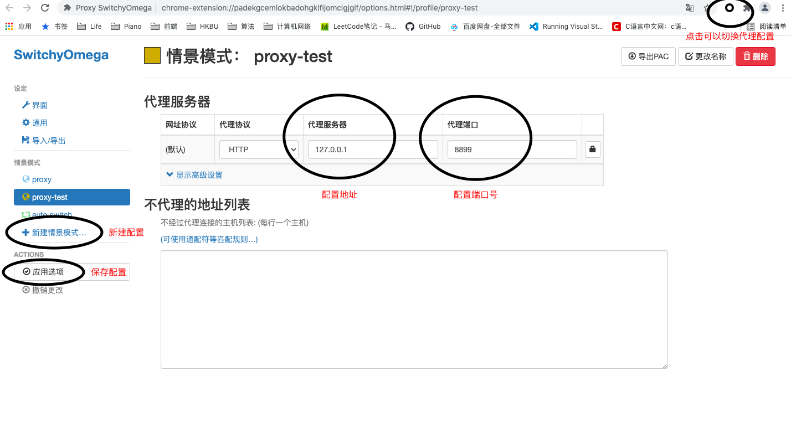

# Whistle分享

在前端的日常开发过程中，我们肯定避免不了使用web调试代理工具进行抓包，修改包内容等工作。这可以帮助我们mock数据，解决跨域问题，定位线上问题等等。所以一个好的工具是非常有必要的。

今天我就和大家分享一个特别好用的web调试代理工具whistle，这个工具**轻便，跨平台，功能全面，并且还开源免费**，是广大前端开发人员的福音，也是腾讯的一位技术大佬avwu自主研发的开源项目，希望有朝一日能够望其项背。

其实网上也已经有不少关于whistle的使用介绍，但是我觉得都不够详细易懂，主要体现在两个方面：

1. 只有简单的使用实例，并没有更加细致的说明，官网在一些规则的描述上也比较晦涩。
2. 对于新手来说如果对于网络代理等基本的网络概念不熟悉的话就不能很好的理解这个工具的使用方式。

那么这篇文章就是一个新手向的whistle教学。主要分享的内容如下：

* whistle的使用方式和基本原理
* Whistle的应用
* whistle相对于其他同类工具的优势
* whistle的插件

如果你是新手，这篇文章不仅会有详细易懂的whistle的使用方式分享，还会说明一些相关的网络基础概念帮助你更好的理解，希望你能自己也动手操作一下，通过实践可以帮助你更深刻的理解一些理论知识。如果你是一名有经验的开发人员，那么这篇文章会给你提供一种新的解决问题的思路。

话不多说，开始吧。

## Whistle的基本概念

首先我们来具体看一下whistle是什么，引用官方文档中的原话：

> whistle(读音 `[ˈwɪsəl]`，拼音 `[wēisǒu]` )是基于 Node 实现的跨平台抓包调试代理工具，有以下基本功能：
>
> 1. 查看 HTTP、HTTPS、HTTP2、WebSocket、TCP 请求响应数据
> 2. 修改 HTTP、HTTPS、HTTP2、WebSocket、TCP 请求响应数据
>    - 修改请求 url、方法、头部、内容等
>    - 修改响应状态码、头部、内容，并支持本地替换等
>    - 修改 WebSocket 和 TCP 收发的帧数据
> 3. 设置 hosts（支持 IPv6）、http-proxy、https-proxy、socks
> 4. 作为HTTP代理或反向代理
> 5. 集成常用的 web 调试工具，如 weinre 和 log 等
> 6. 支持用 Node 编写插件扩展

总结一下这句话的意思：

* 基于Node，意味着只要有安装了node环境就可以运行，实现了跨平台
* 可以对常用的HTTP、HTTPS、HTTP2、WebSocket、TCP协议的请求响应进行增删改查的操作
* 可以直接作为代理服务器对请求进行代理，可以自定义代理规则（等下详细展开）
* 除了这些基本功能还集成了其他的调试工具，并支持插件自定义扩展


### 什么是代理及其原理

如果你是对代理还不熟悉，那么只看上面的介绍对于whistle可能还不清楚这是个什么东西。那么接下来我就简单介绍一下代理的概念。

代理分为两种：**普通代理**以及**隧道代理**。whistle就是采用的**普通代理**的方式，所以在这里只对**普通代理**做一个介绍，另外一种大家可以自行查阅。

#### 普通代理

> HTTP 客户端向代理发送请求报文，代理服务器需要正确地处理请求和连接（例如正确处理 Connection: keep-alive），同时向服务器发送请求，并将收到的响应转发给客户端。


在上面这张图中，whistle就是中间的代理。它在客户端和服务器之间成为了一个“中间人”的角色。在客户端和服务器发送接收信息的过程中，它可以截获客户端发出的所有请求，看到请求的内容，对请求的内容进行修改或者是改变请求的目的地。对于服务器的响应内容它也可以做出同样的处理。whistle的所有的功能其实就是在这个拦截查看修改转发的基础上衍生出的不同应用。

#### 实现一个简单的普通代理

##### 启动代理服务器

我们可以通过node去实现一个最简单版本的普通代理，代码如下：

```js
var http = require('http');
var net = require('net');
var url = require('url');

function request(clientReq, clientRes) {
    // 解析客户端的url请求
    var u = url.parse(clientReq.url);
    var options = {
        hostname : u.hostname, 
        port     : u.port || 80,
        path     : u.path,       
        method     : clientReq.method,
        headers     : clientReq.headers
    };

    // 代理服务器重新自己发送客户端要发送的请求
    var proxyReq = http.request(options, function(proxyRes) {
        // 代理通过回调函数在拿到服务器的响应后重写客户端响应
        clientRes.writeHead(proxyRes.statusCode, proxyRes.headers);
        proxyRes.pipe(clientRes);
    }).on('error', function(e) {
        clientRes.end();
    });
    clientReq.pipe(proxyReq);
}

//启动一个服务器开启request监听事件
http.createServer().on('request', request).listen(8899, '0.0.0.0');
```

这个我们用node搭建的代理服务器运行在127.0.0.1:8888，它起到的作用就是把收到的请求再重新发送一次到真正客户端要发送的服务器地址上，再把服务器的返回内容返回给客户端。

##### 配置代理

把这段代码用node跑起来过后这个代理服务器就已经生成了，但是现在我们怎么使用它呢？换句话说，既然这个代理服务器要接受客户端的请求，那么我们怎么让客户端在发送请求的时候发送给它而不是直接发送给真正的服务器？这个时候我们就需要进行代理的配置。

进行代理的配置有如下两种主要的方式：

1. 全局代理：直接配置系统代理：

- [Windows](https://zhidao.baidu.com/question/40868089.html)
- [Mac](https://support.apple.com/zh-cn/guide/mac-help/mchlp2591/mac): System Preferences > Network > Advanced > Proxies > HTTP or HTTPS

2. 浏览器代理：安装浏览器代理插件 (**推荐**)

   - 安装Chrome代理插件：推荐安装[SwitchyOmega](https://chrome.google.com/webstore/detail/padekgcemlokbadohgkifijomclgjgif)

   

在这里我就用SwitchyOmega举例，大家可以自己在chrome插件商城中进行下载安装。下载完后打开该插件加入新的代理情景，配置对应的代理服务器的地址即可。这样浏览器中的所有请求就不会直接发送给目标服务器而是先发送给你所配置的代理服务器再由代理服务器处理。

##### 操作检验

配置成功后我们就可以随便访问一个http协议的网站（目前只能是http协议的网站，具体原因之后讲解），通过对发送的请求和响应做出任何我们想要做的事情。比如最简单的打印请求的内容:

```js
function request(clientReq, clientRes) {
  	//打印出clientReq 
    console.log(clientReq);// => IncomingMessage{...}
    var u = url.parse(clientReq.url);
    var options = {
        hostname : u.hostname, 
        port     : u.port || 80,
        path     : u.path,       
        method     : clientReq.method,
        headers     : clientReq.headers
    };
  ...
}
```

又比如增加一个响应头部字段：

```js
function request(clientReq, clientRes) {
  ...
    var proxyReq = http.request(options, function(proxyRes) {
      	// 增加响应头事件
        clientRes.setHeader('Set-Cookie', ['type=proxy']);
        clientRes.writeHead(proxyRes.statusCode, proxyRes.headers);
        proxyRes.pipe(clientRes);
    }).on('error', function(e) {
        clientRes.end();
    });
    clientReq.pipe(proxyReq);
}
```

我们可以在开发者工具中查看：


### 总结

到目前为止我们应该明白了代理的基本概念，whistle是什么，以及怎么去启动一个简单的代理服务器。但是还有一个遗留问题就是我们的代理服务器还不能代理https协议的请求。我们将会在接下来阐述怎么使用whisle，并在这个过程中讲解为什么我们的代理服务器不能代理https，以及whistle这个代理工具是怎么解决这一问题。

## Whistle的基本使用

### Whistle的基本安装配置

具体的安装步骤已经在官网说得很详细，所以详细细节请移步[Whistle安装](http://wproxy.org/whistle/install.html)，在这里只会简写官网中的每一步或者做出我的补充。相信在实现了一个简单的代理服务器后这一步将会很容易理解。

1. 安装Node

推荐尽量安装最新版本

2. 安装whistle

```sh
$ npm install -g whistle
```

3. 启动whistle

```sh
$ w2 start
```

这一步就相当于我们在"实现一个简单的普通代理"中做的建立一个代理服务器。

4. 配置代理

这一步等同于我们在"实现一个简单的普通代理"中使用SwitchOmyga进行的浏览器代理配置。

5. 安装根证书

这一步就是为了解决代理无法查看修改https协议请求的问题。你可以先按照官网的说明安装上根证书，也可以先看下一节的讲解为什么要安装根证书再安装，这样会帮助你更好的理解安装步骤。

### Whistle为什么要安装根证书


### Whistle的使用

#### 功能界面

首先大家要对whistle的界面有一个大致的了解，这一块的内容官网已经说得比较详细并且内容也不多，大家可以对照官网进行查看：[whistle界面功能](http://wproxy.org/whistle/webui/)。这里将简单罗列几个最常用的界面功能方便后续展开。

1. Network

> 查看请求响应的详细信息及请求列表的Timeline，还有请求匹配到的规则(见`Overview`)。


2. Rules

这是whistle的规则配置界面，也是我们自定义whistle的行为的最重要的一个界面。官网中有gif动图和详细的功能描述，在这里就不对界面进行详细的介绍。


3. Values

配置`key-value`的数据，在Rules里面配置可以通过`{key}`获取，如：`www.ifeng.com file://{key}`。大家可以先有一个values的概念，之后会详细阐述。


### Rules配置方式

在rules界面中自定义whistle的行为规则是掌握whistle的核心。那么whistle的规则长什么样子呢？十分简单，一个最简单的例子如下：

```bash
https://www.qq.com/ 127.0.0.1:8899
```


## Whistle针对不同应用场景的使用

### 开发过程中解决跨域

## 如何通过Node模块写一个whistle插件

