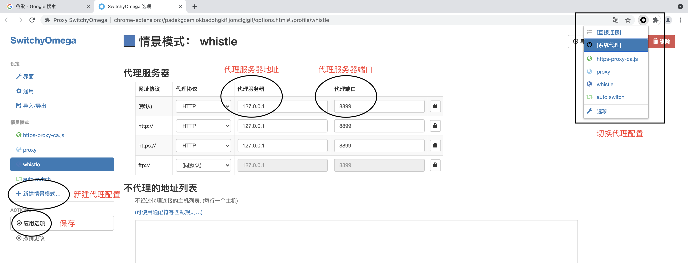

# Whistle的使用和基本原理

> 本文主要讲解了Whistle抓包工具的基本使用和其实现原理

## 前言

在前端的日常开发过程中，我们肯定避免不了使用web调试代理工具进行抓包，修改包内容等工作。这可以帮助我们mock数据，解决跨域问题，定位线上问题等等。所以一个好的工具是非常有必要的。

今天就和大家分享一个特别好用的**web调试代理工具——whistle**，这个工具**轻便，跨平台，功能全面，并且还开源免费**，是广大前端开发人员的福音。

其实网上也已经有不少关于whistle的使用介绍，但是我觉得都不够详细易懂，主要体现在两个方面：

* 只有简单的使用实例，并没有更加细致的说明，官网在一些使用规则的描述上也比较晦涩。

* 对于新手来说如果对于网络代理等基本的网络概念不熟悉的话就不能很好的理解这个工具的使用方式。

这篇文章就针对以上两点做出了一些补足，不仅会有whistle的基本使用规则分享，还会实现一个极简版本的whistle。如果你是新手，希望你能自己也动手操作一下，通过实践可以帮助你更深刻的理解一些理论知识。如果你是一名有经验的开发人员，那么希望这篇文章会给你提供一种新的解决问题的思路。

话不多说，开始吧。

## 1. 什么是代理及其原理

如果你是对代理还不熟悉，那么可能就不太能理解whistle这个工具的实际意义以及它的使用方式。那么接下来就先介绍一下代理的基本概念。

代理分为两种：**普通代理**以及**隧道代理**。

### 1.1 普通代理

#### 1.1.1 什么是普通代理

> HTTP客户端向代理发送请求报文，普通代理服务器需要正确地处理请求和连接（例如正确处理 Connection: keep-alive），同时向服务器发送请求，并将收到的响应转发给客户端。


如上图所示，普通代理在客户端和服务器之间成为了一个“中间人”的角色。在客户端和服务器发送接收信息的过程中，它需要正确处理HTTP请求和响应的内容并转发到正确的目的地。如果有需要，它也可以对其转发内容进行进行增删改查的操作，甚至是修改目的地。Whistle就相当于这个普通代理服务器。

#### 1.1.2 实现一个简单的普通代理

##### 启动代理服务器

我们可以通过node去实现一个极简版本的普通代理，只对代理的HTTP请求和响应进行简单的转发。代码如下（需要一些最基础的node有关网络服务相关的知识，这部分可以自己搜索，基本一看就懂）：

```js
var http = require('http');
const { URL } = require('url');

function request(clientReq, clientRes) {
    // 解析客户端的url请求
    var u = new URL(clientReq.url);
    var options = {
        hostname : u.hostname, 
        port     : u.port || 80,
        path     : u.pathname,       
        method     : clientReq.method,
        headers     : clientReq.headers
    };

    console.log(`httpRequest from ${u.hostname}`);

    // 代理服务器重新自己发送客户端要发送的请求
    var proxyReq = http.request(options, function(proxyRes) {
        // 代理通过回调函数在拿到服务器的响应后重写客户端响应
        clientRes.writeHead(proxyRes.statusCode, proxyRes.headers);
        proxyRes.pipe(clientRes);
    }).on('error', function() {
        clientRes.end();
    });
    clientReq.pipe(proxyReq);
}

//启动一个服务器开启request监听事件
http.createServer().on('request', request).listen(8899, '0.0.0.0');
```

这个node搭建的代理服务器运行在`127.0.0.1:8899`，它起到的作用就是把收到的http请求重新发送到服务器，再把服务器的响应返回给客户端。

##### 配置代理

既然这个代理服务器要接受客户端的请求，那么怎么让客户端在发送请求的时候发送给它而不是直接发送给目的服务器？这个时候就需要进行代理的配置从而告诉客户端你要使用的代理服务器的地址。

进行代理的配置有如下两种主要的方式：

1. 全局代理：直接配置系统代理：

- [Windows](https://zhidao.baidu.com/question/40868089.html)
- [Mac](https://support.apple.com/zh-cn/guide/mac-help/mchlp2591/mac): `System Preferences` > `Network` > `Advanced` > `Proxies` >` HTTP` or `HTTPS`

2. 浏览器代理：安装浏览器代理插件 (**推荐**)

   - 安装Chrome代理插件：推荐安装[SwitchyOmega](https://chrome.google.com/webstore/detail/padekgcemlokbadohgkifijomclgjgif)

   

在这里就用`SwitchyOmega`举例，大家可以在chrome插件商城中进行下载安装。下载完后打开该插件加入新的代理情景，配置对应的代理服务器的地址并在右上角进行配置切换。这样浏览器中的所有请求就不会直接发送给目标服务器而是先发送给配置的代理服务器再由代理服务器处理。

##### 操作检验

配置成功后我们就可以随便访问一个**http协议**的网站，通过对发送的请求和响应做出任何我们想要做的事情。

比如查看请求内容和增加一个响应头部字段：

```js
var http = require('http');
const { URL } = require('url');

function request(clientReq, clientRes) {
    //1:查看响应内容
    console.log(clientReq);

    var u = new URL(clientReq.url);
    var options = {
        hostname : u.hostname, 
        port     : u.port || 80,
        path     : u.pathname,       
        method     : clientReq.method,
        headers     : clientReq.headers
    };

    console.log(`httpRequest from ${u.hostname}`);

    var proxyReq = http.request(options, function(proxyRes) {
        //2:增加响应头设置Cookie
        clientRes.setHeader('Set-Cookie', ['type=proxy']);
        clientRes.writeHead(proxyRes.statusCode, proxyRes.headers);
        proxyRes.pipe(clientRes);
    }).on('error', function() {
        clientRes.end();
    });
    clientReq.pipe(proxyReq);
}
http.createServer().on('request', request).listen(8899, '0.0.0.0');
```

* 查看请求：


* 设置cookie:


### 1.2 隧道代理

#### 1.2.1 什么是隧道代理

> 客户端通过CONNECT 方法请求隧道网关创建一条到达任意目的服务器和端口的 TCP 连接，建立连接后隧道网关对客户端和服务器之间的后继数据进行盲转发。

我们知道HTTP连接基于TCP连接，并且TCP连接是全双工通信且工作在运输层，那么就可以利用HTTP连接建立的TCP连接让代理服务器来双向传递非HTTP协议的流量，比如HTTPS协议的流量。隧道代理就使用了这样的思想。

隧道代理数据流向：


下面这张图很直观的展示了其实现的过程：


通过这张图我们来细说一下隧道代理的实现过程：

* (a)过程客户端发送method为CONNECT的请求到网关（**网关可以理解为代理服务器**）
* (b)(c)过程由网关建立到真正请求的服务器的TCP连接
* 建立TCP连接后，在(d)过程网关向客户端发送HTTP连接成功报文通知客户端
* 在(e)过程客户端就可以正式发起HTTPS请求，其中的网关（代理服务器）只是做一个TCP层面的转发而不关心请求的内容

其中有几个特别值得关注的点：

* (a)过程是用**HTTP**协议进行发送的，即是明文传输的。为了安全所以在这个请求中只包含了方法，目标位置和user-agent。

* 建立隧道连接的判断是**系统内部实现的**。比如我们在浏览器中设置了代理HTTPS的流量，那么浏览器在发起HTTPS请求之前就会默认采用隧道连接的方式向代理服务器发起CONNECT请求从而和真实服务器建立隧道连接。

* 在这个过程中代理服务器只做简单的TCP层面的转发。如果传输的内容是加密的内容，那么在不经过处理的情况下就无从得知其中的内容。

#### 1.2.2 使用隧道连接实现一个HTTPS隧道代理

刚刚我们讲到，什么时候请求建立隧道连接是系统内部实现的，而代理HTTPS流量就是其中的一种情况。所以当设置代理后再发起HTTPS请求时，客户端就会先向代理服务器发送CONNECT请求建立隧道连接。实现的代码如下：

```js
const http = require("http");
const {URL} = require("url");
const net = require("net");

// 启动端口
let port = 8899;
let httpTunnel = new http.Server();

// 启动隧道代理服务
httpTunnel.listen(port, () => {
  console.log(`简易HTTPS中间人代理启动成功，端口：${port}`);
});

// 监听connect请求
httpTunnel.on("connect", (req, cltSocket, head) => {
    var srvUrl = new URL(`http://${req.url}`);
  console.log(`CONNECT ${srvUrl.hostname}:${srvUrl.port}`);
  // 建立到服务端的TCP
  var srvSocket = net.connect(srvUrl.port, srvUrl.hostname, () => {
    cltSocket.write(
      "HTTP/1.1 200 Connection Established\r\n" +
        "Proxy-agent: MITM-proxy\r\n" +
        "\r\n"
    );
    srvSocket.write(head);
    // 转发数据
    srvSocket.pipe(cltSocket);
    cltSocket.pipe(srvSocket);
  });
  srvSocket.on("error", (e) => {
    console.error(e);
  });
});

```

在本地启动服务后，同普通代理一样需要进行代理的配置。经过配置过后发现可以正常的浏览网页。

### 1.3 实现HTTPS代理

通过隧道代理实现的HTTPS代理只能在TCP层盲目转发请求内容，并不能对请求的内容进行查看，修改，转发等操作。那么怎么获取转发的内容呢？“中间人攻击”就是一个很好的手段。

#### 1.3.1 HTTPS与中间人攻击

理解HTTPS的工作原理是实现中间人攻击的前提。关于HTTPS工作原理的文章已经有很多，这里介绍一篇讲得比较清楚的文章。[HTTPS 详解一：附带最精美详尽的 HTTPS 原理图](https://segmentfault.com/a/1190000021494676)。如果有不清楚的同学可以先移步查看。


如上图所示，包含公钥的数字证书的正确性是整个传输过程安全的保障。如果包含公钥的数字证书被一个中间人截获，并在客户端上安装了中间人伪造的CA根证书并让客户端信任，那么中间人就可以在客户端和服务器的交流过程中拿到传输的数据并不引起双方的注意。


中间人攻击的具体过程如下：

(1) 中间人向客户端注入伪造的CA根证书

(2) 捕获服务器真实的CA证书

(3) 根据域名伪造服务器的证书返回给客户端，该伪造证书的根证书指向伪造的CA根证书

(4) 截获双方数据

#### 1.3.2 实现HTTPS代理的原理

在理解了中间人攻击后，代理HTTPS的基本思路就可以理清。

1. 建立客户端到中间人的隧道连接


(a) 客户端向隧道代理服务器发起CONNECT请求

(b) 隧道代理服务器和HTTPS代理服务器(中间人)建立TCP连接

(c) 成功建立隧道连接返回响应

这一步和实现隧道代理HTTPS一样，只是把目的服务器换为HTTPS代理服务器。

2. 建立客户端到HTTPS代理服务器和HTTPS代理服务器到目的服务器的HTTPS连接


(d) 客户端向HTTPS代理服务器发起HTTPS连接的请求

(e) HTTPS代理服务器向目标服务器发起同样的HTTPS连接请求

(f) HTTPS代理服务器获取目标服务器证书

(g)  HTTPS代理服务器向客户端发送伪造的证书

3. 发送随机码


(h) 客户端向HTTPS代理服务器发送随机码

(i) HTTPS代理服务器向目的服务器发送随机码

4. 正常传输数据

#### 1.3.3 具体实现HTTPS代理

1. 申请一个CA证书作为根证书

本文使用在本地签发证书的方式，创建命令行如下：

```shell
openssl genrsa -out private.pem 2048
openssl req -new -x509 -key private.pem -out public.crt -days 99999
```

第二行命令运行后，需要填写一些证书信息。需要注意的是 `Common Name` 一定要填写后续提供 HTTPS 服务的域名或 IP。例如你打算在本地测试，`Common Name` 可以填写 `127.0.0.1`。

创建后两个证书在当前目录下，点击` public.crt`证书打开后信任该证书。


2. 本地实现代理服务

为了使代码简单易读，这里只给出最简单的实现版本，没有根据访问地址动态生成伪造证书，在真实使用的过程中也还有很多的问题。但是这篇文章只注重原理的讲解，对于各种请求的处理有兴趣的同学可以自行阅读whistle源码。最简单实现代码如下：

```js
const http = require("http");
const { URL } = require("url");
const net = require("net");
var https = require("https");
var fs = require("fs");
var path = require('path');


let tunnelPort = 8899; // 启动隧道的端口
let httpsPort = 8900; // 启动HTTPS代理服务的端口

//根据项目的路径导入生成的证书文件
var privateKey = fs.readFileSync(path.join(__dirname, "../private.pem"));
var certificate = fs.readFileSync(path.join(__dirname, "../public.crt"));
var credentials = { key: privateKey, cert: certificate };

// 建立代理服务器
let httpTunnel = new http.Server();
var httpsServer = https.createServer(credentials);

// 启动代理服务
httpTunnel.listen(tunnelPort, () => {
  console.log(`简易HTTP隧道代理启动成功，端口：${tunnelPort}`);
});
httpsServer.listen(httpsPort, () => {
  console.log(`简易HTTPS中间人代理启动成功，端口：${httpsPort}`);
});

// 监听connect请求
httpTunnel.on("connect", (req, cltSocket, head) => {
  var srvUrl = new URL(`http://${req.url}`);
  console.log(`CONNECT ${srvUrl.hostname}:${srvUrl.port}`);
  // 建立到HTTPS代理服务端的TCP
  var srvSocket = net.connect(httpsPort, "127.0.0.1", () => {
    cltSocket.write(
      "HTTP/1.1 200 Connection Established\r\n" +
        "Proxy-agent: MITM-proxy\r\n" +
        "\r\n"
    );
    srvSocket.write(head);
    // 转发数据
    srvSocket.pipe(cltSocket);
    cltSocket.pipe(srvSocket);
  });
  srvSocket.on("error", (e) => {
    console.error(e);
  });
});

// HTTPS代理服务端监听和转发请求
httpsServer.on("request", (clientReq, clientRes) => {
  // 解析客户端请求
  var options = {
    hostname: clientReq.headers.host,
    method: clientReq.method,
    headers: clientReq.headers,
    path:clientReq.url
  };

  // 再重新发送请求到真实的服务器
  var proxyReq = https
    .request(options, function (proxyRes) {
     // 重写响应
      clientRes.writeHead(proxyRes.statusCode, proxyRes.headers);
      proxyRes.pipe(clientRes);
    })
    .on("error", function (e) {
      clientRes.end();
    });
  clientReq.pipe(proxyReq);
});

```

3. 设置浏览器流量代理

在本地启动服务后仍然需要设置对应的浏览器服务代理，注意应该将浏览器流量代理到隧道代理的端口。此例的代理配置如下图：


**注意：**

* chrome浏览器现在不信任本地签发的根证书，所以当启动服务去访问一个https网站后可能会出现如下界面，这需要你手动的输入`thisisunsafe`告诉浏览器用户明确已存在的风险。注意不是在地址栏输入，直接敲击键盘即可。


## 2. Whistle的使用

在理解了代理的基本概念以及怎么实现一个简单的代理服务后，就能够更加好地理解whistle的使用步骤而不需要死记硬背，比如为什么在使用whistle时要配置浏览器代理，为什么查看HTTPS流量之前要安装根证书等等。

### 2.1 Whistle的基本概念

> whistle(读音 `[ˈwɪsəl]`，拼音 `[wēisǒu]` )是基于 Node 实现的跨平台抓包调试代理工具，有以下基本功能：
>
> 1. 查看 HTTP、HTTPS、HTTP2、WebSocket、TCP 请求响应数据
> 2. 修改 HTTP、HTTPS、HTTP2、WebSocket、TCP 请求响应数据
>    - 修改请求 url、方法、头部、内容等
>    - 修改响应状态码、头部、内容，并支持本地替换等
>    - 修改 WebSocket 和 TCP 收发的帧数据
> 3. 设置 hosts（支持 IPv6）、http-proxy、https-proxy、socks
> 4. 作为HTTP代理或反向代理
> 5. 集成常用的 web 调试工具，如 weinre 和 log 等
> 6. 支持用 Node 编写插件扩展

总结一下这句话的意思：

* 基于Node，意味着只要有安装了node环境就可以运行，实现了跨平台
* 可以对常用的HTTP、HTTPS、HTTP2、WebSocket、TCP协议的请求响应进行增删改查的操作
* 可以直接作为代理服务器对请求进行代理，也可以自定义代理规则（等下详细展开）
* 除了这些基本功能还集成了其他的调试工具，并支持插件自定义扩展

### 2.2 Whistle的基本安装配置

具体的安装步骤已经在官网说得很详细，所以更多细节请移步[Whistle安装](http://wproxy.org/whistle/install.html)，在这里只会简写官网中的每一步或者做出一些补充。相信在实现了一个简单的代理服务器后这一步将会很容易理解。

1. 安装Node

推荐尽量安装最新版本

2. 安装whistle

```sh
$ npm install -g whistle
```

3. 启动whistle

```sh
$ w2 start
```

启动一个运行在本地的代理服务器，默认启动在`127.0.0.1:8899`。

4. 配置代理

推荐使用`switchOmyga`进行代理的配置，与“实现一个简单代理“中的步骤相同。

5. [安装根证书][http://wproxy.org/whistle/webui/https.html]

查看修改HTTPS请求的关键一步。把whistle这个"中间人"代理服务器的根证书安装到本地并信任。这一步等同于”中间人“向客户端注入证书。

6. 在浏览器中进入Whistle配置页面

whistle默认启动在`127.0.0.1:8899` 。也可以在启动whistle时自定义。最终在浏览器中进入whistle配置页面如下。


### 2.3 Whistle的使用

#### 2.3.1 功能界面

首先介绍whistle的界面，这一块的内容官网已经说得比较详细并且内容也不多，大家可以对照官网进行查看：[whistle界面功能](http://wproxy.org/whistle/webui/)。这里将简单罗列几个最常用的界面功能方便后续展开。

1. Network

> 查看请求响应的详细信息及请求列表的Timeline，还有请求匹配到的规则(见`Overview`)。


2. Rules

这是whistle的规则配置界面，也是我们自定义whistle的代理行为的最重要的一个界面。


3. Values

配置`key-value`的数据，在Rules里面配置可以通过`{key}`获取，如：`www.ifeng.com file://{key}`。大家可以先有一个values的概念，之后会详细阐述。


### 2.4 Rules配置方式

通过在Rules界面中添加不同的rules，我们可以控制whistle的代理行为。

rules的一条配置规则可以抽象为：

```shell
 pattern operatorURI
```

* `pattern`是匹配模式，用于筛选请求
* `operatorURI`是操作协议，是对匹配这个`pattern`的请求进行操作的行为
* 当`operatorURI`不为 url的时候，`pattern`和`operatorURI`的位置可以交换。

例(1)

```
www.qq.com 127.0.0.1:8899
```

这一条规则的意思是把域名为www.qq.com的请求解析到127.0.0.1:8899上，所以配置了这条规则后访问www.qq.com实际上访问的是127.0.0.1:8899。

此时的`operatorURI`为IP地址不是url，所以此时`pattern`和`operatorURI`的位置可以交换：

```bash
# 这条规则可以和上一条规则起到一样的效果
127.0.0.1:8899 www.qq.com 
```

例(2)

```
www.qq.com cloud.tencent.com
```

这条规则的`pattern`是www.qq.com，`operatorURI`是cloud.tencent.com。用于把域名为www.qq.com的请求代理到cloud.tencent.com上。由于cloud.tencent.com是一个url，所以此时不能交换两者的位置。

之所以支持位置的交换是为了向传统的hosts文件对齐，但是为了避免一些不必要的麻烦，推荐大家在使用whistle的时候尽量使用同一套规则。

接下来我们来详细说一下`pattern`和`operatorURI`的配置。

#### 2.4.1 匹配模式

>  HTTPS、Websocket需要[开启HTTPS拦截](http://wproxy.org/whistle/webui/https.html)才可以正常抓包及使用所有匹配模式，否则只能用域名匹配
>
>  有些老版本可能不支持以下的某种匹配模式，遇到这种情况可以[升级下whistle](http://wproxy.org/whistle/update.html)即可。

whistle的匹配模式(`pattern`)大体可以分成 **域名、路径、正则、精确匹配、通配符匹配**：

1. 域名匹配

域名匹配，不仅支持匹配某个域名，也可以限定端口号以及协议，比如`http`、`https`、`ws`、`wss`、`tunnel`等协议。当`operatorURI`是url的时候，`pattern`和`operatorURI`位置不能调换。

```shell
# 匹配域名www.test.com下的所有请求，包括http、https、ws、wss，tunnel
www.test.com operatorURI

# 匹配域名www.test.com下的所有http请求
http://www.test.com operatorURI

# 匹配域名www.test.com下的所有https请求
https://www.test.com operatorURI

# 上述匹配也可以限定域名的端口号
www.test.com:8888 operatorURI # 8888端口
www.test.com/ operatorURI 

# 这种情况不能交换顺序,否则将
www.test.com www.example.com/index.html
```

2. 正则匹配
   * 和js正则一致，支持两种模式：`/reg/`   , `/reg/i`
   * 不支持`/reg/g`的全局匹配
   
   * 支持正则中的分组引用，可以在`operatorURI`中使用`$1` , `$2`....来动态获取正则表达式中`()`引用的内容
   * 支持非匹配 `!pattern`

```shell
#匹配所有请求
* operatorURI

#匹配url里面包含某个关键字的请求，且忽略大小写
/keyword/i operatorURI

# 利用分组引用把url里面的参数带到匹配的操作uri
# 下面正则将把请求里面的([^\/]+)，带到匹配的操作uri
# 最多支持10个子匹配 $0...9，其中$0表示整个请求url，其它跟正则的子匹配一样
/[^?#]\/([^\/]+)\.html/ protocol://...$1...

#对正则表达式取反
!/keyword/i operatorURI
```

3. 路径匹配

匹配某一个路径，可以选择指定域名、协议、端口号等，也可以不指定。

```shell
# 限定请求协议，只能匹配http请求
http://www.test.com/path operatorURI
http://www.test.com:8080/path operatorURI

# 匹配指定路径下的所有请求
www.test.com/path operatorURI
www.test.com:8080/path operatorURI
```

4. 精确匹配

路径匹配不仅匹配对应的路径，而且还会匹配该路径下面的子路径，而精确匹配只能指定的路径，只要在路径前面加`$`即可变成精确匹配。

```shell
  $http://www.test.com operatorURI
  #只能匹配
  http://www.test.com
```

```shell
 $https://www.test.com/path? operatorURI
 #只能匹配
  https://www.test.com/path?
```

5. 通配符匹配

正则匹配可以解决所有的匹配情况，但是需要使用人懂正则的规则，为了让使用的门槛低一些，wistle提供了通配符来进行匹配。相比于正则表达式通过分组即`()`的方式来提取匹配的内容，通配符使用`*`的方式来进行匹配，匹配规则如下：

* `^`表示开头位置，`$`表示结尾位置
* 如果通配符串在请求url的protocol里面，不管是一个还是多个 `*` 都只能匹配 `[a-z\d]*`
* 如果通配符串在domain里面，一个 `*` 表示匹配 `[^/.]`(除了/.的部分)，两个及以上的 `*` 表示匹配 `[^/]*`(只要不是/就可以匹配)
* 如果通配符串在path里面，一个 `*` 表示匹配 `[^/]`，两个 `*` 表示匹配 `[^？]*`，三个及以上的 `*` 表示匹配 `.*`
* 如果通配符串在query里面，一个 `*` 表示匹配 `[^&]`，两个及以上的 `*` 表示匹配 `.*`

举个例子：

```bash
^*://*.test.**.com:*/**?a=*&**  opProtocol://opValue($0, $1, ..., $9)
# 第一个*匹配协议
# 第二个*匹配/ . 之间的内容，这个里面的内容不能出现/或者是.
# 第三个**匹配. .之间的内容，这个内容里面只要不出现/就可以
# 滴四个*匹配:/之间的内容，这个内容里面是端口号，同样不能出现. / 
# 第5个**匹配路径，只要不出现?就可以
# 第6个*匹配a的值
# 第7个**匹配剩下的所有内容
# $0,$1...$9表示第几个*的内容
```

#### 2.4.2 操作协议

`operatorURI`除了可以是一个地址将符合`pattern`的请求发送到`operatorURI`之外，还可以是一些作者定义的操作词对请求或者响应进行不同的操作。

比如：

```
pattern method://newMethod
```

表示把所有符合`pattern`的请求的方法改为newMethod。

再比如：

```
www.aliexpress.com referer://http://www.aliexpress.com
```

表示把www.aliexpress.com这个请求的referer改为http://www.aliexpress.com。

为了尽可能满足web开发中方方面面的需要，whistle提供基本上覆盖抓包调试工具可以做的所有事情的对应协议，比如修改请求URL，修改请求方法，修改请求头修改请求内容等等。所有的操作协议可以在[官网](http://wproxy.org/whistle/rules/)中自行查找。

#### 2.4.3 操作值

在`operatorURI`中可以使用变量的方式来定义值，变量的值可以分为两类，**字符串**和**JSON对象**。

##### 字符串

1. 如果字符串不包含空格，可以不采用变量的方式直接写在规则中
```bash
    pattern opProtocol://(str)
   
    # 有些操作值不能放到本地文件，则可以不用括号，如：proxy、referer等等，具体参见协议列表
    pattern opProtocol://strValue
```

2. 如果字符串里面包含空格，则可以把操作值先放到whistle界面的[Values](https://wproxy.org/whistle/webui/values.html)或本地文件然后用{}引用，创建values的过程见[Values](https://wproxy.org/whistle/webui/values.html)：

```bash
 # 在Values里面创建一个key为 test.txt 的 key-value 对
 pattern opProtocol://{test.txt}

 # 或者放到本地文件 /User/docs/test.txt
 pattern opProtocol:///User/docs/test.txt
 # windows
 pattern opProtocol://E:\docs\test.txt
```

##### JSON

如果操作值为**JSON对象**，则同样需要把操作值放到whistle界面Values或者本地文件中。可以用以下几种格式书写：

1. 正常的JSON格式：

```bash
     {
       "key1": value1,
       "key2": value2,
       "keyN": valueN
     }
```

2. 行格式：

```bash
     # 以 `冒号+空格` 分隔
     key1: value1
     key2: value2
     keyN: valueN

     # 如果没有 `冒号+空格` ，则以第一个冒号分隔，如果没有冒号，则value为空字符串
     key1: value1
     key2:value2
     key3
     keyN: valueN
```

3. 内联格式(请求参数格式)：

```bash
     # key和value最好都encodeURIComponent
     key1=value1&key2=value2&keyN=valueN
```

注意：最后一种内联格式可以把JSON对象直接转化为字符串，这样可以用第一种方式直接写到配置里面，如果key或value里面出现 `空格`、`&`、`%` 或 `=`，则需要把它们 `encodeURIComponent`，whistle会对每个key和value尝试 `decodeURIComponent`。

##### 内联多行操作值

whistle [v1.12.12](https://wproxy.org/whistle/update.html)开始支持Rules内联多行的Value，即写在rules中的变量名，格式如下：

```bash
#使用键值
pattern protocol://{keyName}

# 定义键值
​``` keyName
content
​```
```

举个例子：

~~~bash
www.test.com/index.html file://{test.html}
``` test.html
Hello world.
Hello world1.
Hello world2.
```
~~~

这种方式设置的Value只对当前阶段的规则生效，且优先级高于[Values](https://wproxy.org/whistle/webui/values.html)设置的Key-Value。

#### 2.4.4 匹配原则

定义了当两条whistle规则出现冲突的时候的优先级。

1. 相同协议规则的默认优先级从上到下，即前面的规则优先级匹配高于后面，如：

```bash
 www.test.com 127.0.0.1:9999
 www.test.com/xxx 127.0.0.1:8080
```

2. 除[rule](https://wproxy.org/whistle/rules/rule)及[proxy](https://wproxy.org/whistle/rules/proxy.html)对应规则除外，可以同时匹配不同协议的规则

```bash
 www.test.com 127.0.0.1:9999
 www.test.com/xxx 127.0.0.1:8080
 www.test.com proxy://127.0.0.1:8888
 www.test.com/xxx socks://127.0.0.1:1080
 www.test.com pac://http://www.pac-server.com/test.pac
 www.test.com/xxx http://www.abc.com
 www.test.com file:///User/xxx/test
```

请求 `https://www.test.com/xxx/index.html` 按从上到下的匹配顺序，及第二点原则，会匹配以下规则：

```bash
 www.test.com 127.0.0.1:9999
 www.test.com proxy://127.0.0.1:8888
 www.test.com pac://http://www.pac-server.com/test.pac
 www.test.com/xxx http://www.abc.com
```

[proxy](https://wproxy.org/whistle/rules/proxy.html)、[http-proxy](https://wproxy.org/whistle/rules/proxy.html)、[https-proxy](https://wproxy.org/whistle/rules/https-proxy.html)、[socks](https://wproxy.org/whistle/rules/socks.html)都属于[proxy](https://wproxy.org/whistle/rules/proxy.html)，[html](https://wproxy.org/whistle/rules/rule/replace.html)、[file](https://wproxy.org/whistle/rules/rule/file.html)等都属于[rule](https://wproxy.org/whistle/rules/rule)，所以这两个对应的协议只能各种匹配其中优先级最高的一个。

3. 一些属于不同协议，但功能有冲突的规则，如 [rule](https://wproxy.org/whistle/rule)、[host](https://wproxy.org/whistle/host.html)、[proxy](https://wproxy.org/whistle/proxy.html)，按常用优先级为 `rule > host > proxy`，如：

```bash
 www.test.com 127.0.0.1:9999
 www.test.com/xxx 127.0.0.1:8080
 www.test.com proxy://127.0.0.1:8888
 www.test.com/xxx socks://127.0.0.1:1080
 www.test.com file:///User/xxx/test
 www.test.com/xxx http://www.abc.com
```

4. 部分相同协议会匹配及合并所有可以匹配的规则，如：

```bash
 www.test.com 127.0.0.1:9999
 www.test.com/xxx 127.0.0.1:8080
 www.test.com proxy://127.0.0.1:8888
 www.test.com/xxx socks://127.0.0.1:1080
 www.test.com pac://http://www.pac-server.com/test.pac
 www.test.com/xxx http://www.abc.com
 www.test.com file:///User/xxx/test
 www.test.com/xxx reqHeaders://{test.json}
 www.test.com reqHeaders:///User/xxx/test.json
 www.test.com/xxx htmlAppend:///User/xxx/test.html
 www.test.com htmlAppend://{test.html}
 www.test.com/xxx reqHeaders:///User/xxx/test2.json
 www.test.com htmlAppend://{test2.html}
```

5. 请求 `https://www.test.com/xxx/index.html` 会匹配以下规则：

```bash
 www.test.com 127.0.0.1:9999
 www.test.com proxy://127.0.0.1:8888
 www.test.com pac://http://www.pac-server.com/test.pac
 www.test.com/xxx http://www.abc.com
 www.test.com/xxx reqHeaders://{test.json}
 www.test.com reqHeaders:///User/xxx/test.json
 www.test.com/xxx htmlAppend:///User/xxx/test.html
 www.test.com htmlAppend://{test.html}
 www.test.com/xxx reqHeaders:///User/xxx/test2.json
 www.test.com htmlAppend://{test2.html}
```

## 3. Whistle的实用场景

whistle的功能总结来说就是拦截所有的请求响应并对其进行查看修改转发等一系列的操作。那么基于这样的功能可以有多种多样的玩儿法。在这里列举一些常用的应用。

1. 解决跨域

以前跨域的解决比较麻烦，现在有了whistle之后只需要在配置规则中加入一条规则即可：

```shell
pattern resHeaders://{Allow-Origin.json}
```

对于要解决跨域的域名使用合适的`pattern`进行匹配，然后在响应头部中加入`Access-Control-Allow-Origin:*`字段即可实现跨越请求。

2. Mock数据

虽然使用umi可以很好的解决Mock数据的需求，但是对于一些没有使用umi的场景，使用whistle将请求代理到本地的一个装有mock数据的文件也是一个可以接受的方式，比如配置如下规则：

```bash
^http://qq.com/** file:///Users//mockData/$1
```

将域名为qq.com的请求代理到本地mockData路径下的对应文件

3. 移动端调试

[vConsole](https://github.com/WechatFE/vConsole)是微信团队开发的轻量、可拓展、针对手机网页的前端开发者调试面板，主要原理是通过在页面注入js实现模拟PC浏览器的Console功能，这边利用whistle的[js](https://avwo.github.io/whistle/rules/js.html)协议往指定网页(https://m.baidu.com/)注入`vConsole.js`，配置whistle规则：

```
m.baidu.com js://{vConsole.js}
```

4. 线上调试

当项目部署到线上后出现的bug比较难以定位，因为项目代码已经经过丑化压缩合并变得不可读，并且线上的项目不能随意修改打断点不方便调试。这个时候如果可以找到线上请求文件对应本地是哪一个文件，就可以通过：

```bash
pattern file://[本地文件地址]
```

将线上的文件请求代理到本地从而打断点或者是使用console.log调试。

## 4. 总结

这篇文章总结了代理的基本两种基本方式，并结合这两种基本方式和中间人攻击实现了对HTTP/HTTPS流量的简单代理。除此之外还分享了Whistle的基本的使用规则和应用场景。在此基础上大家可以继续阅读whistle的源码了解更多的实现细节，或者查阅官方文档获取更多细致的用法，结合自身的实际业务实现发掘更多的应用场景。

